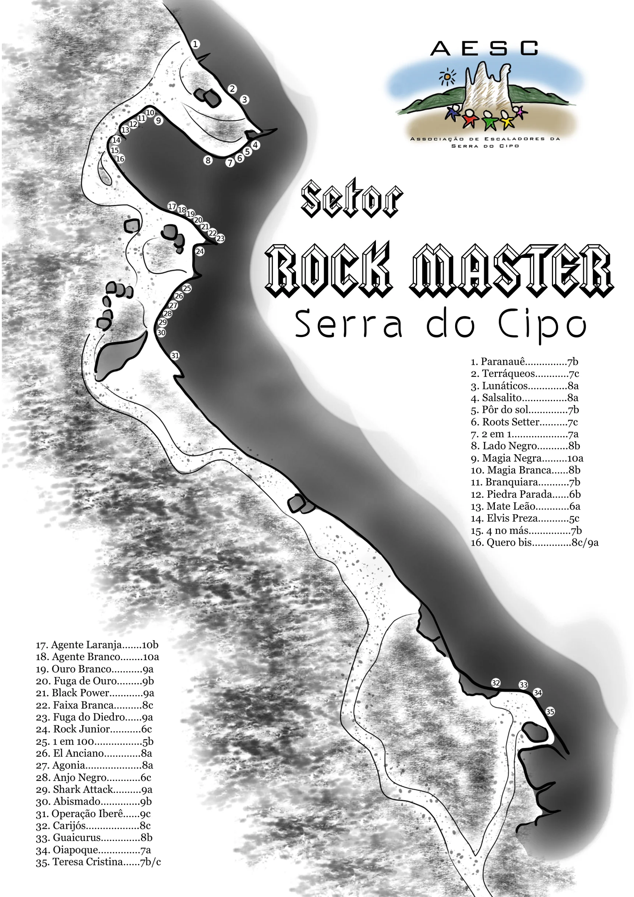
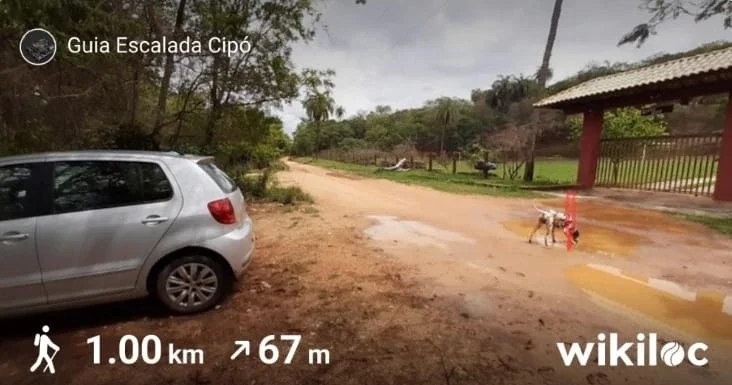

# Croqui: Serra do Cipó - Setor Rock Master

## Informações Gerais

- **descricao**: O Setor Rock Master, localizado na Serra do Cipó (Santana do Riacho - MG), é um clássico setor de escalada esportiva com vias de 5b a 10b.
- **id**: br_mg_santana_do_riacho_serra_do_cipo_rock_master
- **nome**: Serra do Cipó - Setor Rock Master
- **uid**: XTlcdWHJASykL5
- **creditos**:
  - Associação de Escaladores da Serra do Cipó (AESC)
- **caminho_thumbnail**: 
- **ultima_migracao**: 5
- **botoes**:
  - **[0]**:
    - **uid**: KtB6o8ERrNpaVd
    - **texto**: Acesso
    - **destino**:
      - **secao_textual**:
        - **conteudo**:
            # Acesso
            O Setor Rock Master fica na Serra do Cipó, em Santana do Riacho (MG), a cerca de 100 km de Belo Horizonte.
            
            Saindo de Belo Horizonte, siga pela MG-010 em direção à Serra do Cipó, passando por Lagoa Santa e Jaboticatubas. Continue pela rodovia até a região da Serra do Cipó e do distrito de Cardeal Mota.
            
            O trecho final é feito por uma estrada local, seguido de uma caminhada até a área de escalada. A partir daí, siga as placas e os acessos locais até o Setor Rock Master. 
            
            **Coordenadas geográficas do estacionamento:**-19º18'56.1 -43º36'48.6
            
            **Coordenadas geográficas do setor:** -19º18'31.5 -43º36'53.2
            
            **Link para trilha wikiloc:** https://www.wikiloc.com/hiking-trails/setor-rockmaster-1-2-e-3-86913870
            
            |  |
            | :--: |
            | *Estacionamento - Início da trilha* |
- **publicar_croqui**: True

## Parte: setor_rock_master

### Setor (Pico: Serra do Cipó)

- **descricao**:
    Setor clássico de escalada esportiva do Grupo 2 na Serra do Cipó.
    
    Vias positivas, verticais e negativas com exposição solar vespertina e extensões entre 10m e 20m, que não permitem escalada durante chuva.
- **nome**: Setor Rock Master
- **uid**: eGoq2HJJLvRP8o
- **mapas**:
  - **[0]**:
    - **caminho_imagem_mapa**: 
    - **referencias**:
      - **[0]**:
        - **alvo_uid**: awcnCzsTLWLT17
        - **pontos_uids**:
          - BY4qmREQujvgPB
        - **escalada**: Paranauê
        - **ids**:
          - BY4qmREQujvgPB
      - **[1]**:
        - **alvo_uid**: gHoiBoBl5UcnKo
        - **pontos_uids**:
          - EsdM6DXPBuRHe0
        - **escalada**: Terráqueos
        - **ids**:
          - EsdM6DXPBuRHe0
      - **[2]**:
        - **alvo_uid**: y91apLP5nImk86
        - **pontos_uids**:
          - i5VvKatBRm7Xq3
        - **escalada**: Lunáticos
        - **ids**:
          - i5VvKatBRm7Xq3
      - **[3]**:
        - **alvo_uid**: bLk5E8ECTWbiDf
        - **pontos_uids**:
          - Mdjv2ImA0YheV7
        - **escalada**: Salsalito
        - **ids**:
          - Mdjv2ImA0YheV7
      - **[4]**:
        - **alvo_uid**: ZPSXAhXMQzFSDS
        - **pontos_uids**:
          - YVelyWyFWDisHB
        - **escalada**: Pôr do sol
        - **ids**:
          - YVelyWyFWDisHB
      - **[5]**:
        - **alvo_uid**: wFyf2nF10KReHB
        - **pontos_uids**:
          - OwK9pI9pb9UTop
        - **escalada**: Roots Setter
        - **ids**:
          - OwK9pI9pb9UTop
      - **[6]**:
        - **alvo_uid**: bVJQ4oDDonyYPs
        - **pontos_uids**:
          - A40PVrpjhoCktH
        - **escalada**: 2 em 1
        - **ids**:
          - A40PVrpjhoCktH
      - **[7]**:
        - **alvo_uid**: fKMTrMPWfSJvl2
        - **pontos_uids**:
          - 55shR4BHDMOZIk
        - **escalada**: Lado Negro
        - **ids**:
          - 55shR4BHDMOZIk
      - **[8]**:
        - **alvo_uid**: Sc83sOmbU8xGVg
        - **pontos_uids**:
          - GGOi5dor06J523
        - **escalada**: Magia Negra
        - **ids**:
          - GGOi5dor06J523
      - **[9]**:
        - **alvo_uid**: fbSn84UsoxdAWU
        - **pontos_uids**:
          - xQpBMXsEGb0soC
        - **escalada**: Magia Branca
        - **ids**:
          - xQpBMXsEGb0soC
      - **[10]**:
        - **alvo_uid**: vye7niJVMqRmHt
        - **pontos_uids**:
          - ZkYs7Yml9L3Wze
        - **escalada**: Branquiara
        - **ids**:
          - ZkYs7Yml9L3Wze
      - **[11]**:
        - **alvo_uid**: Gs1yVHWkKuo5kb
        - **pontos_uids**:
          - x3PynDlj1R7b2z
        - **escalada**: Piedra Parada
        - **ids**:
          - x3PynDlj1R7b2z
      - **[12]**:
        - **alvo_uid**: Fg5OKqzuU4Pdr7
        - **pontos_uids**:
          - NRMojm496EwFVh
        - **escalada**: Mate Leão
        - **ids**:
          - NRMojm496EwFVh
      - **[13]**:
        - **alvo_uid**: XV6N1aYBeLjxBV
        - **pontos_uids**:
          - evTULrnmMstcne
        - **escalada**: Elvis Preza
        - **ids**:
          - evTULrnmMstcne
      - **[14]**:
        - **alvo_uid**: P71kdcRim1kVQs
        - **pontos_uids**:
          - HkqKDIfBgjpRTJ
        - **escalada**: 4 no más
        - **ids**:
          - HkqKDIfBgjpRTJ
      - **[15]**:
        - **alvo_uid**: qIlUu5AxmKFvMV
        - **pontos_uids**:
          - zCePwRCLu6pmlx
        - **escalada**: Quero bis
        - **ids**:
          - zCePwRCLu6pmlx
      - **[16]**:
        - **alvo_uid**: 5O5PUEyow1lA3e
        - **pontos_uids**:
          - E8Z2N8QWG97eop
        - **escalada**: Agente Laranja
        - **ids**:
          - E8Z2N8QWG97eop
      - **[17]**:
        - **alvo_uid**: 7Jr6qUTANqYSM8
        - **pontos_uids**:
          - 8XY1hNp15k9SUV
        - **escalada**: Agente Branco
        - **ids**:
          - 8XY1hNp15k9SUV
      - **[18]**:
        - **alvo_uid**: iUvDCmW847OdZx
        - **pontos_uids**:
          - 6HHm49HaUreMjf
        - **escalada**: Ouro Branco
        - **ids**:
          - 6HHm49HaUreMjf
      - **[19]**:
        - **alvo_uid**: tdmsuSVhC5uQ5L
        - **pontos_uids**:
          - vHybRUfjiuNK9y
        - **escalada**: Fuga de Ouro
        - **ids**:
          - vHybRUfjiuNK9y
      - **[20]**:
        - **alvo_uid**: hjiANq7pbbsrPK
        - **pontos_uids**:
          - pUQMrGfRR8VCJP
        - **escalada**: Black Power
        - **ids**:
          - pUQMrGfRR8VCJP
      - **[21]**:
        - **alvo_uid**: E4mH5EYGsRq0NV
        - **pontos_uids**:
          - ic6vW9r7JJEQNv
        - **escalada**: Faixa Branca
        - **ids**:
          - ic6vW9r7JJEQNv
      - **[22]**:
        - **alvo_uid**: fqtI8bXe2OaVAk
        - **pontos_uids**:
          - 0dgLbhTn4iO7F2
        - **escalada**: Fuga do Diedro
        - **ids**:
          - 0dgLbhTn4iO7F2
      - **[23]**:
        - **alvo_uid**: onbVbSUXCLqh0F
        - **pontos_uids**:
          - H3qAfbtRcg8fWI
        - **escalada**: Rock Junior
        - **ids**:
          - H3qAfbtRcg8fWI
      - **[24]**:
        - **alvo_uid**: C0c3djprJOWCLc
        - **pontos_uids**:
          - aGQ0P5u49ouEvk
        - **escalada**: 1 em 100
        - **ids**:
          - aGQ0P5u49ouEvk
      - **[25]**:
        - **alvo_uid**: n66hR5mHEwUdKL
        - **pontos_uids**:
          - 9IsuxTBLTc4lzm
        - **escalada**: El Anciano
        - **ids**:
          - 9IsuxTBLTc4lzm
      - **[26]**:
        - **alvo_uid**: 23v3HrMx9kD7Qx
        - **pontos_uids**:
          - Y7zxiI9Hm7QWKJ
        - **escalada**: Agonia
        - **ids**:
          - Y7zxiI9Hm7QWKJ
      - **[27]**:
        - **alvo_uid**: TfHfqGPQhRWYhb
        - **pontos_uids**:
          - KimDHsK4NkGSpM
        - **escalada**: Anjo Negro
        - **ids**:
          - KimDHsK4NkGSpM
      - **[28]**:
        - **alvo_uid**: CEshRkwUS8VHwM
        - **pontos_uids**:
          - AnrNpCwwrvyiEv
        - **escalada**: Shark Attack
        - **ids**:
          - AnrNpCwwrvyiEv
      - **[29]**:
        - **alvo_uid**: WyTVZFKfLzexvd
        - **pontos_uids**:
          - Cy5fVxmlFH17HG
        - **escalada**: Abismado
        - **ids**:
          - Cy5fVxmlFH17HG
      - **[30]**:
        - **alvo_uid**: suwrNfoJRFeon3
        - **pontos_uids**:
          - GgFaBAWWyUXf1O
        - **escalada**: Operação Iberê
        - **ids**:
          - GgFaBAWWyUXf1O
      - **[31]**:
        - **alvo_uid**: NhFAuQdJBJHlzw
        - **pontos_uids**:
          - obll35MMY8mCiW
        - **escalada**: Carijós
        - **ids**:
          - obll35MMY8mCiW
      - **[32]**:
        - **alvo_uid**: apFVrGAo3FhJh8
        - **pontos_uids**:
          - wXRx0uJixoRcMV
        - **escalada**: Guaicurus
        - **ids**:
          - wXRx0uJixoRcMV
      - **[33]**:
        - **alvo_uid**: 0IvLZm4b1w99Oi
        - **pontos_uids**:
          - 6edko2qUugZOaW
        - **escalada**: Oiapoque
        - **ids**:
          - 6edko2qUugZOaW
      - **[34]**:
        - **alvo_uid**: MHh8U1osxT7Sqg
        - **pontos_uids**:
          - 3dqe5gmYWGsQGL
        - **escalada**: Teresa Cristina
        - **ids**:
          - 3dqe5gmYWGsQGL
    - **largura_mapa**: 1722
    - **altura_mapa**: 2435
    - **pontos_de_interesse**:
      - **[0]**:
        - **id**: BY4qmREQujvgPB
        - **uid**: BY4qmREQujvgPB
        - **rotulo**: 1
        - **circulo**:
          - **x**: 530
          - **y**: 120
          - **raio**: 13
        - **label**: 1
      - **[1]**:
        - **id**: EsdM6DXPBuRHe0
        - **uid**: EsdM6DXPBuRHe0
        - **rotulo**: 2
        - **circulo**:
          - **x**: 630
          - **y**: 242
          - **raio**: 13
        - **label**: 2
      - **[2]**:
        - **id**: i5VvKatBRm7Xq3
        - **uid**: i5VvKatBRm7Xq3
        - **rotulo**: 3
        - **circulo**:
          - **x**: 664
          - **y**: 270
          - **raio**: 13
        - **label**: 3
      - **[3]**:
        - **id**: Mdjv2ImA0YheV7
        - **uid**: Mdjv2ImA0YheV7
        - **rotulo**: 4
        - **circulo**:
          - **x**: 694
          - **y**: 394
          - **raio**: 13
        - **label**: 4
      - **[4]**:
        - **id**: YVelyWyFWDisHB
        - **uid**: YVelyWyFWDisHB
        - **rotulo**: 5
        - **circulo**:
          - **x**: 672
          - **y**: 410
          - **raio**: 13
        - **label**: 5
      - **[5]**:
        - **id**: OwK9pI9pb9UTop
        - **uid**: OwK9pI9pb9UTop
        - **rotulo**: 6
        - **circulo**:
          - **x**: 650
          - **y**: 428
          - **raio**: 13
        - **label**: 6
      - **[6]**:
        - **id**: A40PVrpjhoCktH
        - **uid**: A40PVrpjhoCktH
        - **rotulo**: 7
        - **circulo**:
          - **x**: 624
          - **y**: 440
          - **raio**: 13
        - **label**: 7
      - **[7]**:
        - **id**: 55shR4BHDMOZIk
        - **uid**: 55shR4BHDMOZIk
        - **rotulo**: 8
        - **circulo**:
          - **x**: 564
          - **y**: 434
          - **raio**: 13
        - **label**: 8
      - **[8]**:
        - **id**: GGOi5dor06J523
        - **uid**: GGOi5dor06J523
        - **rotulo**: 9
        - **circulo**:
          - **x**: 430
          - **y**: 326
          - **raio**: 13
        - **label**: 9
      - **[9]**:
        - **id**: xQpBMXsEGb0soC
        - **uid**: xQpBMXsEGb0soC
        - **rotulo**: 10
        - **circulo**:
          - **x**: 408
          - **y**: 306
          - **raio**: 13
        - **label**: 10
      - **[10]**:
        - **id**: ZkYs7Yml9L3Wze
        - **uid**: ZkYs7Yml9L3Wze
        - **rotulo**: 11
        - **circulo**:
          - **x**: 386
          - **y**: 320
          - **raio**: 13
        - **label**: 11
      - **[11]**:
        - **id**: x3PynDlj1R7b2z
        - **uid**: x3PynDlj1R7b2z
        - **rotulo**: 12
        - **circulo**:
          - **x**: 362
          - **y**: 336
          - **raio**: 13
        - **label**: 12
      - **[12]**:
        - **id**: NRMojm496EwFVh
        - **uid**: NRMojm496EwFVh
        - **rotulo**: 13
        - **circulo**:
          - **x**: 340
          - **y**: 352
          - **raio**: 13
        - **label**: 13
      - **[13]**:
        - **id**: evTULrnmMstcne
        - **uid**: evTULrnmMstcne
        - **rotulo**: 14
        - **circulo**:
          - **x**: 316
          - **y**: 380
          - **raio**: 13
        - **label**: 14
      - **[14]**:
        - **id**: HkqKDIfBgjpRTJ
        - **uid**: HkqKDIfBgjpRTJ
        - **rotulo**: 15
        - **circulo**:
          - **x**: 310
          - **y**: 408
          - **raio**: 13
        - **label**: 15
      - **[15]**:
        - **id**: zCePwRCLu6pmlx
        - **uid**: zCePwRCLu6pmlx
        - **rotulo**: 16
        - **circulo**:
          - **x**: 324
          - **y**: 430
          - **raio**: 13
        - **label**: 16
      - **[16]**:
        - **id**: E8Z2N8QWG97eop
        - **uid**: E8Z2N8QWG97eop
        - **rotulo**: 17
        - **circulo**:
          - **x**: 466
          - **y**: 560
          - **raio**: 13
        - **label**: 17
      - **[17]**:
        - **id**: 8XY1hNp15k9SUV
        - **uid**: 8XY1hNp15k9SUV
        - **rotulo**: 18
        - **circulo**:
          - **x**: 494
          - **y**: 568
          - **raio**: 13
        - **label**: 18
      - **[18]**:
        - **id**: 6HHm49HaUreMjf
        - **uid**: 6HHm49HaUreMjf
        - **rotulo**: 19
        - **circulo**:
          - **x**: 518
          - **y**: 580
          - **raio**: 13
        - **label**: 19
      - **[19]**:
        - **id**: vHybRUfjiuNK9y
        - **uid**: vHybRUfjiuNK9y
        - **rotulo**: 20
        - **circulo**:
          - **x**: 538
          - **y**: 596
          - **raio**: 13
        - **label**: 20
      - **[20]**:
        - **id**: pUQMrGfRR8VCJP
        - **uid**: pUQMrGfRR8VCJP
        - **rotulo**: 21
        - **circulo**:
          - **x**: 556
          - **y**: 614
          - **raio**: 13
        - **label**: 21
      - **[21]**:
        - **id**: ic6vW9r7JJEQNv
        - **uid**: ic6vW9r7JJEQNv
        - **rotulo**: 22
        - **circulo**:
          - **x**: 576
          - **y**: 632
          - **raio**: 13
        - **label**: 22
      - **[22]**:
        - **id**: 0dgLbhTn4iO7F2
        - **uid**: 0dgLbhTn4iO7F2
        - **rotulo**: 23
        - **circulo**:
          - **x**: 598
          - **y**: 646
          - **raio**: 13
        - **label**: 23
      - **[23]**:
        - **id**: H3qAfbtRcg8fWI
        - **uid**: H3qAfbtRcg8fWI
        - **rotulo**: 24
        - **circulo**:
          - **x**: 542
          - **y**: 682
          - **raio**: 13
        - **label**: 24
      - **[24]**:
        - **id**: aGQ0P5u49ouEvk
        - **uid**: aGQ0P5u49ouEvk
        - **rotulo**: 25
        - **circulo**:
          - **x**: 508
          - **y**: 782
          - **raio**: 13
        - **label**: 25
      - **[25]**:
        - **id**: 9IsuxTBLTc4lzm
        - **uid**: 9IsuxTBLTc4lzm
        - **rotulo**: 26
        - **circulo**:
          - **x**: 486
          - **y**: 802
          - **raio**: 13
        - **label**: 26
      - **[26]**:
        - **id**: Y7zxiI9Hm7QWKJ
        - **uid**: Y7zxiI9Hm7QWKJ
        - **rotulo**: 27
        - **circulo**:
          - **x**: 470
          - **y**: 828
          - **raio**: 13
        - **label**: 27
      - **[27]**:
        - **id**: KimDHsK4NkGSpM
        - **uid**: KimDHsK4NkGSpM
        - **rotulo**: 28
        - **circulo**:
          - **x**: 454
          - **y**: 850
          - **raio**: 13
        - **label**: 28
      - **[28]**:
        - **id**: AnrNpCwwrvyiEv
        - **uid**: AnrNpCwwrvyiEv
        - **rotulo**: 29
        - **circulo**:
          - **x**: 440
          - **y**: 874
          - **raio**: 13
        - **label**: 29
      - **[29]**:
        - **id**: Cy5fVxmlFH17HG
        - **uid**: Cy5fVxmlFH17HG
        - **rotulo**: 30
        - **circulo**:
          - **x**: 436
          - **y**: 902
          - **raio**: 13
        - **label**: 30
      - **[30]**:
        - **id**: GgFaBAWWyUXf1O
        - **uid**: GgFaBAWWyUXf1O
        - **rotulo**: 31
        - **circulo**:
          - **x**: 474
          - **y**: 964
          - **raio**: 13
        - **label**: 31
      - **[31]**:
        - **id**: obll35MMY8mCiW
        - **uid**: obll35MMY8mCiW
        - **rotulo**: 32
        - **circulo**:
          - **x**: 1348
          - **y**: 1854
          - **raio**: 13
        - **label**: 32
      - **[32]**:
        - **id**: wXRx0uJixoRcMV
        - **uid**: wXRx0uJixoRcMV
        - **rotulo**: 33
        - **circulo**:
          - **x**: 1422
          - **y**: 1858
          - **raio**: 13
        - **label**: 33
      - **[33]**:
        - **id**: 6edko2qUugZOaW
        - **uid**: 6edko2qUugZOaW
        - **rotulo**: 34
        - **circulo**:
          - **x**: 1460
          - **y**: 1880
          - **raio**: 13
        - **label**: 34
      - **[34]**:
        - **id**: 3dqe5gmYWGsQGL
        - **uid**: 3dqe5gmYWGsQGL
        - **rotulo**: 35
        - **circulo**:
          - **x**: 1494
          - **y**: 1930
          - **raio**: 13
        - **label**: 35
- **escaladas**:
  - **[0]**:
    - **uid**: awcnCzsTLWLT17
    - **via_esportiva**:
      - **nome**: Paranauê
      - **dificuldade**: BR_7B
      - **quantidade_protecoes_intermediarias**: 6
      - **quantidade_protecoes_parada**: 2
      - **conquistadores**:
        - Luan Krug
        - Rudy Proença
      - **data_abertura**: 2017
  - **[1]**:
    - **uid**: gHoiBoBl5UcnKo
    - **via_esportiva**:
      - **nome**: Terráqueos
      - **dificuldade**: BR_7C
  - **[2]**:
    - **uid**: y91apLP5nImk86
    - **via_esportiva**:
      - **nome**: Lunáticos
      - **dificuldade**: BR_8A
  - **[3]**:
    - **uid**: bLk5E8ECTWbiDf
    - **via_esportiva**:
      - **nome**: Salsalito
      - **dificuldade**: BR_8A
  - **[4]**:
    - **uid**: ZPSXAhXMQzFSDS
    - **via_esportiva**:
      - **nome**: Pôr do sol
      - **dificuldade**: BR_7B
  - **[5]**:
    - **uid**: wFyf2nF10KReHB
    - **via_esportiva**:
      - **nome**: Roots Setter
      - **dificuldade**: BR_7C
  - **[6]**:
    - **uid**: bVJQ4oDDonyYPs
    - **via_esportiva**:
      - **nome**: 2 em 1
      - **dificuldade**: BR_7A
  - **[7]**:
    - **uid**: fKMTrMPWfSJvl2
    - **via_esportiva**:
      - **nome**: Lado Negro
      - **dificuldade**: BR_8B
  - **[8]**:
    - **uid**: Sc83sOmbU8xGVg
    - **via_esportiva**:
      - **nome**: Magia Negra
      - **dificuldade**: BR_10A
  - **[9]**:
    - **uid**: fbSn84UsoxdAWU
    - **via_esportiva**:
      - **nome**: Magia Branca
      - **dificuldade**: BR_8B
  - **[10]**:
    - **uid**: vye7niJVMqRmHt
    - **via_esportiva**:
      - **nome**: Branquiara
      - **dificuldade**: BR_7B
  - **[11]**:
    - **uid**: Gs1yVHWkKuo5kb
    - **via_esportiva**:
      - **nome**: Piedra Parada
      - **dificuldade**: BR_6_BARRA_6SUP
  - **[12]**:
    - **uid**: Fg5OKqzuU4Pdr7
    - **via_esportiva**:
      - **nome**: Mate Leão
      - **dificuldade**: BR_6
  - **[13]**:
    - **uid**: XV6N1aYBeLjxBV
    - **via_esportiva**:
      - **nome**: Elvis Preza
      - **dificuldade**: BR_5SUP
  - **[14]**:
    - **uid**: P71kdcRim1kVQs
    - **via_esportiva**:
      - **nome**: 4 no más
      - **dificuldade**: BR_7B
  - **[15]**:
    - **uid**: qIlUu5AxmKFvMV
    - **via_esportiva**:
      - **nome**: Quero bis
      - **dificuldade**: BR_8C_BARRA_9A
  - **[16]**:
    - **uid**: 5O5PUEyow1lA3e
    - **via_esportiva**:
      - **nome**: Agente Laranja
      - **dificuldade**: BR_10B
  - **[17]**:
    - **uid**: 7Jr6qUTANqYSM8
    - **via_esportiva**:
      - **nome**: Agente Branco
      - **dificuldade**: BR_10A
  - **[18]**:
    - **uid**: iUvDCmW847OdZx
    - **via_esportiva**:
      - **nome**: Ouro Branco
      - **dificuldade**: BR_9A
  - **[19]**:
    - **uid**: tdmsuSVhC5uQ5L
    - **via_esportiva**:
      - **nome**: Fuga de Ouro
      - **dificuldade**: BR_9B
  - **[20]**:
    - **uid**: hjiANq7pbbsrPK
    - **via_esportiva**:
      - **nome**: Black Power
      - **dificuldade**: BR_9A
  - **[21]**:
    - **uid**: E4mH5EYGsRq0NV
    - **via_esportiva**:
      - **nome**: Faixa Branca
      - **dificuldade**: BR_8C
  - **[22]**:
    - **uid**: fqtI8bXe2OaVAk
    - **via_esportiva**:
      - **nome**: Fuga do Diedro
      - **dificuldade**: BR_9A
  - **[23]**:
    - **uid**: onbVbSUXCLqh0F
    - **via_esportiva**:
      - **nome**: Rock Junior
      - **dificuldade**: BR_6SUP
  - **[24]**:
    - **uid**: C0c3djprJOWCLc
    - **via_esportiva**:
      - **nome**: 1 em 100
      - **dificuldade**: BR_5_BARRA_5SUP
  - **[25]**:
    - **uid**: n66hR5mHEwUdKL
    - **via_esportiva**:
      - **nome**: El Anciano
      - **dificuldade**: BR_8A
  - **[26]**:
    - **uid**: 23v3HrMx9kD7Qx
    - **via_esportiva**:
      - **nome**: Agonia
      - **dificuldade**: BR_8A
  - **[27]**:
    - **uid**: TfHfqGPQhRWYhb
    - **via_esportiva**:
      - **nome**: Anjo Negro
      - **dificuldade**: BR_6SUP
  - **[28]**:
    - **uid**: CEshRkwUS8VHwM
    - **via_esportiva**:
      - **nome**: Shark Attack
      - **dificuldade**: BR_9A
  - **[29]**:
    - **uid**: WyTVZFKfLzexvd
    - **via_esportiva**:
      - **nome**: Abismado
      - **dificuldade**: BR_9B
  - **[30]**:
    - **uid**: suwrNfoJRFeon3
    - **via_esportiva**:
      - **nome**: Operação Iberê
      - **dificuldade**: BR_9C
  - **[31]**:
    - **uid**: NhFAuQdJBJHlzw
    - **via_esportiva**:
      - **nome**: Carijós
      - **dificuldade**: BR_8C
  - **[32]**:
    - **uid**: apFVrGAo3FhJh8
    - **via_esportiva**:
      - **nome**: Guaicurus
      - **dificuldade**: BR_8B
  - **[33]**:
    - **uid**: 0IvLZm4b1w99Oi
    - **via_esportiva**:
      - **nome**: Oiapoque
      - **dificuldade**: BR_7A
  - **[34]**:
    - **uid**: MHh8U1osxT7Sqg
    - **via_esportiva**:
      - **nome**: Teresa Cristina
      - **dificuldade**: BR_7B_BARRA_7C
- **localizacao_estacionamento**:
  - **latitude**: -193155830
  - **longitude**: -436135000
- **localizacao_escalada**:
  - **latitude**: -193087500
  - **longitude**: -436147780
- **sinal_de_celular**: True
- **amigavel_a_criancas**: True
- **amigavel_a_bebes**: True
- **precomputados**:
  - **total_escaladas**: 35
  - **total_esportivas**: 35

## Arquivos Externos

- **arquivos_externos**:
  - **[0]**:
    - **caminho**: 
    - **checksum_sha256**: 01266c9914e07dde69f5bf01e1a1afc12bf62b65ff0286017c9526939678abfc
  - **[1]**:
    - **caminho**: 
    - **checksum_sha256**: 2f98291b008899f3e83f61a9bcfea55d93a61fdf0dca8a1970bd304bc15651dd

