# Croqui: Serra do Lenheiro - São João Del Rei

## Informações Gerais

- **descricao**: Guia de escalada da Serra do Lenheiro em São João Del Rei - MG (5ª Edição, 2025).
- **id**: br_mg_sao_joao_del_rei_serra_do_lenheiro
- **nome**: Serra do Lenheiro - São João Del Rei
- **caminho_thumbnail**: 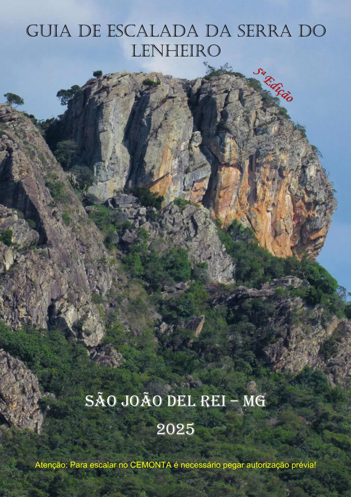
- **ultima_migracao**: 4
- **botoes**:
  - **[0]**:
    - **texto**: Capa
    - **destino**:
      - **secao_textual**:
        - **conteudo**:
            # GUIA DE ESCALADA DA SERRA DO LENHEIRO
            
            ## 5ª Edição
            
            |  |
            | :--: |
            | *Capa do Guia de Escalada da Serra do Lenheiro* |
            
            **São João Del Rei – MG**  
            
            **Atenção:** Para escalar no CEMONTA é necessário pegar autorização prévia!
  - **[1]**:
    - **texto**: Apresentação
    - **destino**:
      - **secao_textual**:
        - **conteudo**:
            # Apresentação
            
            ## O Guia
            
            Este guia foi feito através de um trabalho colaborativo de alguns escaladores com o intuito de servir como orientação para os praticantes que desejam escalar na Serra do Lenheiro, assim como organizar e eternizar as informações que estavam espalhadas em arquivos antigos e na cabeça dos escaladores, correndo o risco de se perderem no tempo.
            
            Este trabalho teve início com uma grande catalogação de vias feito pelo então capitão do 11BIMth Douglas Oliveira, que serviu de base para tudo. Partindo desse levantamento, em 2015 o próprio Douglas se juntou com o instrutor de escalada Jonatas Lima que além de seu conhecimento, veio a somar com repetição de várias vias, fotos e outros materiais que foram digitalizados pelo atual presidente da FEMERJ Pedro Bugim que também contribuiu com material próprio. Após uma paralisação de alguns anos, em 2020 foi dado continuidade no trabalho pelos escaladores sanjoanenses Pedro Naves e Michel Rodrigues que levantaram mais informações faltantes para então finalizar o trabalho, contando com grande ajuda de Luiz Cláudio e Leonardo Rodrigues que compartilharam conhecimentos.
            
            Por se tratar de um guia voltado mais pra escalada recreativa, também não foram incluídas muitas das rotas de treinamento do exército.
            
            Por possuir vias com quase 40 anos conquistadas por escaladores de várias regiões, catalogá-las não foi tarefa fácil e por isso podem haver erros. Qualquer observação será sempre bem-vinda para que correções possam ser feitas ao longo do tempo. Para isso, favor fazer contato com Pedro Naves no (32) 9 9945-7715 ou Michel (32) 9 9932-5359.
            
            A escalada é um esporte de risco e este guia não capacita o leitor a praticar o esporte de forma segura. Para isso, procure por instrutores/guias capacitados. Além de ser um esporte de alta intensidade que requer uma boa preparação e cuidados com o corpo.
            
            Portanto, pratique de forma responsável, seguindo a ética local e não tome nenhuma atitude sem comunicar com escaladores locais. Boas escaladas!
            
            |  |
            | :--: |
            | *Abrigo Lagos e Jonatas Lima* |
            
            |  |
            | :--: |
            | *Espaço Amari - Fisioterapia e Pilates* |
  - **[2]**:
    - **texto**: A Cidade
    - **destino**:
      - **secao_textual**:
        - **conteudo**:
            # A cidade
            
            O município de São João Del Rei está localizado na região do Campo das Vertentes no sudeste de Minas Gerais e possui uma população estimada em torno de 90.000 habitantes. Cidade histórica, teve sua ocupação iniciada em 1701 e conta com um rico patrimônio arquitetônico/cultural. É também considerada uma cidade universitária devido à presença da UFSJ. Possui um batalhão do Exército especializado em operações de montanha, o 11º Batalhão de Infantaria e Montanha (11BIMth) que tem como um dos centros de treinamentos a própria serra tratada neste guia. Os principais atrativos de São João são as belas igrejas no estilo barroco com seus famosos “sinos que falam”, passeio de trem, ótima gastronomia, sua vizinha Tiradentes e belezas naturais como cachoeiras e a Serra do Lenheiro.
            
            | 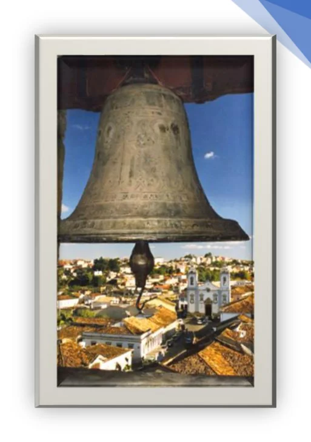 |
            | :--: |
            | *Sino de igreja barroca com vista da cidade histórica de São João Del Rei* |
            
            # Hospedagem
            
            A cidade por ser histórica conta com muitos hotéis. Mas também tem o @AbrigoLagos, voltado para escaladores com quarto e camping, fone (32) 99945-7715.
            
            # Serra do Lenheiro
            
            Geograficamente, a Serra do Lenheiro é a continuação da Serra de São José. Com altitude máxima de 1.218 metros, ela é uma formação cuja origem remonta a 1,6 bilhões de anos e é constituída principalmente por Quartzito. A lenha das árvores provenientes da Serra e as pedras nela encontradas serviram para construir igrejas e pontes da cidade, daí a origem de seu nome. Na Serra do Lenheiro, há atrativos como: pinturas rupestres, canal dos ingleses, gruta do catitú, cachoeira dos sete metros e poço olho d’agua.
            
            # Escalada
            
            A conquista das primeiras vias se deu no final dos anos 70 por militares que passaram a usar os Três Pontões para treinamentos e no início da década de 80, através principalmente dos escaladores cariocas André Ilha, Tonico Magalhães e Lúcia Duarte. Estes encontraram nas fendas de ótima qualidade da Serra do Lenheiro um local para praticar escalada móvel, uma vez que as rochas do Rio de Janeiro não possuem a mesma característica. Nesse início a escalada da região se desenvolveu basicamente em torno da escalada móvel e assim tomou fama, chegando a ganhar destaque até em revistas internacionais como *Mountain* e *Climbing*, sendo reconhecida como primeiro pólo de escalada móvel do Brasil.
            
            Já nos anos 90, começaram a surgir os primeiros escaladores locais que, seguindo uma tendência do país na época, se organizaram em grupos e clubes como Tripon Aventuras, CSM (Centro Sanjoanense de Montanhismo) e Centro Excursionista Lenheiro. Nesse mesmo período organizaram vários encontros de escalada que foram importantes para trazer conhecimento através de escaladores de outras cidades e visibilidade pro esporte que passou a crescer em São João desde então, deixando assim um legado.
            
            Com a virada do século, seguindo uma tendência da época, setores de escalada esportiva e boulder começaram a ser desenvolvidos através de mais escaladores locais, mostrando que a cidade também possui enorme potencial para estes tipos de escalada. Nascendo assim alguns setores incríveis como a Ave Maria, que depois viria a se tornar famosa país afora.
            
            Mas o potencial dessa serra parece não ter fim. Recentemente foi descoberto mais um setor, o Rio das Mortes no outro extremo da serra e tem se tornado bastante popular.
            
            Com certeza essa história não acaba por aqui, pois ainda há muito o que se desenvolver em termos de novas vias e quem sabe até novos setores.
  - **[3]**:
    - **texto**: Ética
    - **destino**:
      - **secao_textual**:
        - **conteudo**:
            # Ética
            
            | 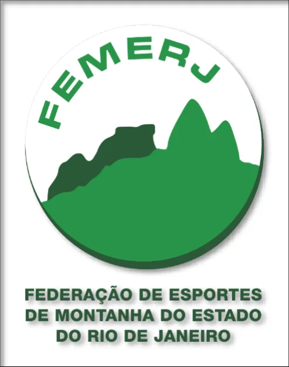 |
            | :--: |
            | *FEMERJ - Federação de Esportes de Montanha do Estado do Rio de Janeiro* |
            
            - Como visto acima, a escalada na região tem suas raízes na escalada móvel. Portanto, deve-se preservar este estilo ao máximo, priorizando o uso de proteções móveis sempre que possível.
            - De qualquer forma, sempre que for abrir alguma via consulte, além deste Guia, algum escalador local pois podem haver restrições, projetos ou até mesmo vias antigas que ainda não foram catalogadas.
            - Em hipótese alguma pode-se cavar ou acrescentar agarras para facilitar a escalada.
            - Evitar uso excessivo de magnésio, limpe as agarras caso tenha deixado marcas. Um dos encantos da escalada é desvendar os movimentos, não tire esse privilégio dos outros.
            - As áreas de escalada estão em propriedades privadas, portanto respeite essas pessoas ao máximo e não faça nada que não faria em sua casa. Deixe porteiras e tronqueiras conforme as encontrou, não obstrua passagens com o veículo, não acampe sem permissão, não faça fogueiras, não deixe rastros. Siga à risca as regras de uso do CEMONTA quando for nos Três Pontões, sempre com autorização e uso do capacete.
            - Preserve a natureza, leve todo o lixo embora.
            - Não fazer necessidade fisiológica próximo das trilhas ou áreas de escalada. Em caso de necessidade afastar-se ao máximo e enterrar os resíduos.
            - Caso encontre costuras ou outro equipamento em alguma via, não remova! Com certeza é de algum escalador que está malhando a via e vai retirar depois.
            - Escaladores de fora se possível fazer contato com alguém local antes de ir escalar.
  - **[4]**:
    - **texto**: Legenda
    - **destino**:
      - **secao_textual**:
        - **conteudo**:
            # Legenda
            
            |  |
            | :--: |
            | *Legenda* |
            
            - **Via Fixa** (linha vermelha)
            - **Via Móvel** (linha amarela)
            - **Via Mista** (linha azul)
            - **Parada Fixa** (círculo vermelho)
            - **Parada Móvel** (círculo amarelo)
            - **Via segue além da foto** (seta preta)
  - **[5]**:
    - **texto**: Áreas de Escalada
    - **destino**:
      - **secao_textual**:
        - **conteudo**:
            # Áreas de Escalada
            
            Atualmente a cidade conta com aproximadamente 200 vias de escalada, divididas em 18 setores com uma grande variedade de estilos, todos no afloramento rochoso da Serra do Lenheiro, portanto em rocha de quartzito. Devido ao comprimento de mais de 10km desta serra, eles foram divididos em 3 grupos para melhor visualização na imagem abaixo:
            
            |  |
            | :--: |
            | *Áreas de Escalada* |
            
            Obs: Os alfinetes são localizações aproximadas de cada grupo de setores para uma visão geral da Serra do Lenheiro, não reflete o local exato de cada setor, este detalhe estará nos capítulos específicos de cada um.
            
            ## Setores do Lenheiro
            
            Esta é a área mais antiga e com maior quantidade de setores e vias. É a mais próxima de São João em termos de estrada (máximo 2km), porém as trilhas para cada setor variam de alguns metros da estrada até 30 minutos de caminhada. Consequentemente com menos de 10 minutos da saída da cidade é possível estar na base de algumas vias.
            
            |  |
            | :--: |
            | *Setores do Lenheiro* |
            
            Para acessar estes setores basta pegar a estrada de terra que dá acesso ao povoado da Trindade, que tem início na **Rua Geraldo Batista Alves** no bairro **Tejuco**, pode-se perguntar pela área do exército (**Cemonta**). As trilhas para os setores estão ao longo desta estrada. Portanto a descrição de cada setor vai partir da saída do Tejuco (início da estrada de terra).
            
            |  |
            | :--: |
            | *QR Code Google Maps início estrada* |
            
            **QR Code Google Maps início estrada**  
            <https://www.google.com.br/maps/@-21.1397043,-44.2836832,334m/data=!3m1!1e3?hl=pt-BR>
            
            | 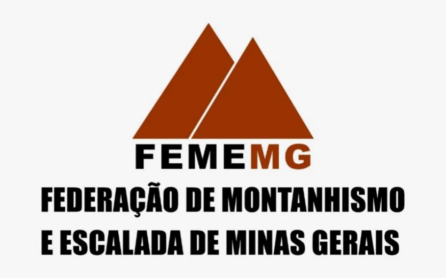 |
            | :--: |
            | *FEMEMG - Federação de Montanhismo e Escalada de Minas Gerais* |
  - **[6]**:
    - **texto**: Regras CEMONTA
    - **destino**:
      - **secao_textual**:
        - **conteudo**:
            # NORMAS DE CONDUTA E AUTORIZAÇÃO PARA USO DO CAMPO ESCOLA DE MONTANHISMO (CEMONTA)
            
            ## SERRA DO LENHEIRO – TRÊS PONTÕES
            [📥 Baixar Ficha para Autorização de Uso do CEMONTA (PDF)](anexos/ficha_autorizacao_cemonta.pdf)
            
            [📥 Baixar Termo de Reconhecimento de Riscos (PDF)](anexos/termo_reconhecimento_riscos_cemonta.pdf)
            
            O Campo Escola de Montanhismo (CEMONTA), mais conhecido como Lenheiro ou Três Pontões, está localizado na cidade de São João del – Rei, MG, em uma Área Militar, de propriedade do Exército Brasileiro. Por esta razão e para o bom relacionamento entre escaladores e o 11º Batalhão de Infantaria de Montanha (11º BI Mth), responsável pela área, as regras abaixo devem ser seguidas:
            
            1. O 11º BI Mth tem atividades práticas no CEMONTA durante todo o ano. É proibida a prática da escalada por civis nos dias em que houver atividades militares no local.
            2. Antes de solicitar autorização, o escalador deverá se certificar de que não haverá atividades militares no local, verificando os períodos disponibilizados à Federação de Escalada e Montanhismo de Minas Gerais (FEMEMG) – Em caráter excepcional, poderá haver a utilização do CEMONTA fora destes períodos estipulados, fazendo-se importante o contato prévio com o Batalhão.
            3. Para solicitar autorização, o escalador responsável pelo grupo deverá preencher a “Ficha para Autorização de uso do CEMONTA”, e remetê-la para o 11º BIMth, com o mínimo de sete dias de antecedência, através do e-mail: ciopmth@gmail.com . O Batalhão responderá ao remetente, no e-mail do escalador, se foi ou não autorizada sua solicitação. Caso tenha sido autorizada, todos os participantes do grupo deverão se dirigir ao 11º Batalhão de Infantaria de Montanha, entre às 08:00 e às 18:00 horas, para assinar o “Termo de Reconhecimento de Riscos” e pegar as chaves das instalações sanitárias do CEMONTA.
            4. Após a atividade de escalada, o grupo deverá deixar as instalações sanitárias nas mesmas condições de limpeza que receberam e entregar as chaves no 11º BIMth.
            5. É proibida a equipagem de vias ou grampeação.
            6. Todo lixo produzido deverá ser conduzido de volta pelo escalador e depositado em local adequado, fora do CEMONTA.
            7. Leve seu material de escalada. O Batalhão não possui qualquer material para empréstimo.
            8. Tenha certeza de deixar o local tão limpo quanto o encontrou.
            9. É proibida a prática isolada da atividade, devendo ser realizada, no mínimo, em dupla.
            10. É obrigatório o uso de capacete durante a prática de qualquer modalidade de escalada.
            11. Não deve ser dispensada, sob qualquer pretexto, a segurança durante as escaladas, seja ela proporcionada por cordas e outros meios, seja pelos próprios praticantes (segurança aproximada).
            12. É proibida a utilização do galpão de instrução.
            13. As necessidades fisiológicas deverão ser realizadas junto às instalações sanitárias, existentes no CEMONTA.
            14. É proibido o corte ou derrubada de qualquer árvore ou arbusto no local, bem como a retirada de grama.
            
            15. É proibido o consumo de bebidas alcoólicas no local.
            16. É proibido o acendimento de fogueiras no local.
            17. É proibida a transposição da cerca de isolamento das pinturas rupestres.
            18. A autorização de uso do CEMONTA não inclui permissão para acessar outras áreas de propriedade particular.
            19. Durante a escalada no CEMONTA, você pode ser interpelado por militares do 11º BIMth que realizam rondas no local. Nesta situação, basta identificar-se e apresentar a autorização recebida.
            20. É proibido gravar nomes, datas ou sinais em pedras, árvores, imóveis, placas ou outros bens do CEMONTA;
            21. É proibido provocar qualquer tipo de barulho que possa perturbar a fauna local (Ex: estampidos, gritos ou utilização de aparelhos de som de qualquer espécie).
            22. Para a visita de grupos com a finalidade de realizar cursos de escalada, deve ser apresentada a carteira de guia ou instrutor de algum clube, ou entidade ligada às federações ou associações que compõem a Confederação Brasileira de Montanhismo e Escalada (CBME).
            23. O uso ou posse de drogas em ambiente militar (CEMONTA) será tratado com o mesmo rigor que o tráfico de drogas, não havendo distinção, no Direito Penal Militar, da figura do usuário e do traficante, conforme artigo 290 do Decreto-Lei Nº 1.001/69.
            24. Na ocorrência do descumprimento de qualquer uma destas regras, ou de qualquer outra conduta que traga consequências negativas para a preservação do local, o responsável será retirado do CEMONTA, e poderá ser negada sua entrada no local em solicitações posteriores, sem prejuízo das responsabilidades cíveis, administrativas e penais aplicáveis.
            
            GUSTAVO TIYODI NAKASHIMA - TC  
            Comandante do 11º Batalhão de Infantaria de Montanha
- **revisado_manualmente**: True
- **publicar_croqui**: True

## Parte: grupo_tres_pontoes

### Grupo (Pico: Serra do Lenheiro)

- **descricao**:
    # Três Pontões (CEMONTA)
    
    Setor mais antigo, teve suas primeiras conquistas no final da década de 70 por militares e no início dos anos 80 através de escaladores cariocas como André Ilha e Tonico Magalhães.
    
    |  |
    | :--: |
    | *Três Pontões* |
    
    Os Três Pontões concentram a maior quantidade de vias clássicas da região, seja por sua imponência, beleza, qualidade ou valor histórico à nível nacional e mundial.
    
    As vias, em sua grande maioria são feitas com proteções móveis, haja vista a grande quantidade de fendas perfeitas nos setores desta formação. Boa parte das vias possui proteção fixa no topo para a descida e para aquelas que não possuem, pode-se descer por vias adjacentes ou por caminhada e cabos de aço (vide imagem setor Rota Interna).
    
    A rocha é um quartzito de qualidade impressionante, com boas fendas e agarras sólidas.
    
    **Atenção:** este setor é um Campo Escola do Exército Brasileiro e por isso possui regras específicas. Deste modo, para escalar lá é obrigatório que se faça um pedido de autorização com alguns dias de antecedência, seguindo as orientações e regras contidas no Anexo 1 e as fichas para preenchimento nos Anexos 2 e 3 ao final deste guia ou no link: https://drive.google.com/drive/folders/1ErE5HCYTzF5a017DwEURxrmlK9QOe2cS?usp=sharing
    
    ## Acesso
    
    Para se chegar ao setor deve-se percorrer 2km pela estrada de terra e entrar no portão de ferro com placa do Exército ou seguir mais 150m pela estrada e pegar a trilha à esquerda.
    
    Dentro do Cemonta, abaixo dos Três Pontões existem inúmeros blocos menores com uma infinidade de vias mais curtas abertas pelo exército para treinamentos e não serão tratadas neste guia, mas a maioria possui indicações através de placas e pinturas na pedra e podem ser interessantes para quem quer fazer um Top-rope prático e treinar algumas técnicas.
    
    ## Pinturas Rupestres
    
    | 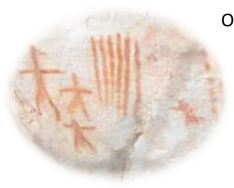 |
    | :--: |
    | *Pinturas Rupestres* |
    
    O local conta ainda com um sítio arqueológico com pinturas rupestres bem interessantes, próximo à base de algumas vias no Pontão Maior. Essas pinturas são datadas com idade de 6 a 10 mil anos e foram feitas por tribos nômades que habitaram essa serra e viviam nas cavidades da rocha.
- **nome**: Três Pontões (CEMONTA)
- **setores**:
  - **[0]**:
    - **conteudo**:
      - **descricao**:
          # Rota Interna
          
          A Rota interna é uma “escalaminhada” que percorre o interior dos Três Pontões através de suas enormes fendas. Existem duas entradas (uma na parte da frente entre os Pontões Médio e Menor e outra atrás na Face Leste do Menor), seu final é no cume do Pontão Maior. Em seu percurso existem 8 vias que estão desenhadas no croqui abaixo, assim como as trilhas que também podem ser usadas para acessar todas as áreas do Cemonta e descer do cume.
          
          As entradas para a Rota Interna podem ser melhor visualizadas nas fotos dos Pontões.
      - **nome**: Rota Interna
      - **mapas**:
        - **[0]**:
          - **caminho_imagem_mapa**: 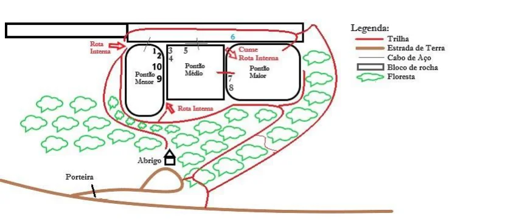
          - **largura_mapa**: 863
          - **altura_mapa**: 361
          - **pontos_de_interesse**:
            - **[0]**:
              - **id**: 1
              - **label**: 1
              - **circulo**:
                - **x**: 254
                - **y**: 84
                - **raio**: 7
            - **[1]**:
              - **id**: 2
              - **label**: 2
              - **circulo**:
                - **x**: 262
                - **y**: 92
                - **raio**: 7
            - **[2]**:
              - **id**: 3
              - **label**: 3
              - **circulo**:
                - **x**: 280
                - **y**: 83
                - **raio**: 7
            - **[3]**:
              - **id**: 4
              - **label**: 4
              - **circulo**:
                - **x**: 282
                - **y**: 96
                - **raio**: 7
            - **[4]**:
              - **id**: 5
              - **label**: 5
              - **circulo**:
                - **x**: 306
                - **y**: 83
                - **raio**: 7
            - **[5]**:
              - **id**: 6
              - **label**: 6
              - **circulo**:
                - **x**: 383
                - **y**: 60
                - **raio**: 7
            - **[6]**:
              - **id**: 7
              - **label**: 7
              - **circulo**:
                - **x**: 379
                - **y**: 129
                - **raio**: 8
            - **[7]**:
              - **id**: 8
              - **label**: 8
              - **circulo**:
                - **x**: 381
                - **y**: 144
                - **raio**: 8
            - **[8]**:
              - **id**: 9
              - **label**: 9
              - **circulo**:
                - **x**: 262
                - **y**: 130
                - **raio**: 8
            - **[9]**:
              - **id**: 10
              - **label**: 10
              - **circulo**:
                - **x**: 258
                - **y**: 109
                - **raio**: 10
          - **referencias**:
            - **[0]**:
              - **escalada**: En Passant
              - **ids**:
                - 1
            - **[1]**:
              - **escalada**: Mamangava
              - **ids**:
                - 2
            - **[2]**:
              - **escalada**: Rio Minas
              - **ids**:
                - 3
            - **[3]**:
              - **escalada**: Minas Rio
              - **ids**:
                - 4
            - **[4]**:
              - **escalada**: Chaminé do Brevê
              - **ids**:
                - 5
            - **[5]**:
              - **escalada**: Quimera
              - **ids**:
                - 6
            - **[6]**:
              - **escalada**: Entre o Céu e o Inferno
              - **ids**:
                - 7
            - **[7]**:
              - **escalada**: Fissura Peter Pan
              - **ids**:
                - 8
            - **[8]**:
              - **escalada**: Sombra (Rota Interna)
              - **ids**:
                - 9
            - **[9]**:
              - **escalada**: Água Fresca
              - **ids**:
                - 10
      - **escaladas**:
        - **[0]**:
          - **via_movel**:
            - **descricao**: Esta via, assim como as quatro seguintes, se encontra em um salão na parte inicial da Rota Interna.
            - **nome**: En Passant
            - **dificuldade**: BR_3
            - **extensao**: 20
            - **conquistadores**:
              - André Ilha
              - Lúcia Duarte
            - **data_abertura**: 1986-05-02
        - **[1]**:
          - **via_movel**:
            - **nome**: Mamangava
            - **dificuldade**: BR_2SUP
            - **extensao**: 20
            - **conquistadores**:
              - André Ilha
              - Lúcia Duarte
            - **data_abertura**: 1986-05-03
        - **[2]**:
          - **via_movel**:
            - **descricao**: Uma bela fissura de dedos em seu início, passando a alguns entalamentos de mão, escalada exigente, sua conquista original foi por chaminé, assim o grau fica mais acessível.
            - **nome**: Rio Minas
            - **dificuldade**: BR_8A
            - **conquistadores**:
              - Dalton Chiarelli
              - José Ronaldo "Pelé"
        - **[3]**:
          - **via_movel**:
            - **nome**: Minas Rio
            - **dificuldade**: BR_4
            - **conquistadores**:
              - Carlos Trindade
              - José Ronaldo "Pelé"
            - **data_abertura**: 1988-04-18
        - **[4]**:
          - **via_movel**:
            - **descricao**: Uma escalada de chaminé bem clássica, totalmente protegida em um fissura que se afina em alguns momentos e outros ficam larga. Termina ao final do cabo de aço.
            - **nome**: Chaminé do Brevê
            - **dificuldade**: BR_4SUP
            - **conquistadores**:
              - João Felipin
              - Ladson
            - **data_abertura**: 2002
        - **[5]**:
          - **via_movel**:
            - **descricao**: Esta via se encontra após o cabo de aço. Uma saída delicada em três chapas passando uma belíssima fenda, que quando ganha altura vai aumentando a abertura, finaliza em uma parada móvel.
            - **nome**: Quimera
            - **dificuldade**: BR_7A
            - **quantidade_protecoes_intermediarias**: 3
            - **conquistadores**:
              - Jonatas Lima
              - Carlos Pádua
            - **data_abertura**: 2015
        - **[6]**:
          - **via_movel**:
            - **nome**: Entre o Céu e o Inferno
            - **dificuldade**: BR_5SUP
            - **conquistadores**:
              - Luiz Cláudio
        - **[7]**:
          - **via_movel**:
            - **nome**: Fissura Peter Pan
            - **dificuldade**: BR_5
            - **conquistadores**:
              - Luiz Cláudio
        - **[8]**:
          - **via_esportiva**:
            - **descricao**: Link Sombra e Água Fresca 4sup.
            - **nome**: Sombra (Rota Interna)
            - **dificuldade**: BR_4
            - **conquistadores**:
              - Jonatas Lima
              - Carlos Pádua
            - **data_abertura**: 2024
        - **[9]**:
          - **via_esportiva**:
            - **nome**: Água Fresca
            - **dificuldade**: BR_4
            - **conquistadores**:
              - Jonatas Lima
              - Carlos Pádua
            - **data_abertura**: 2024
      - **precomputados**:
        - **total_escaladas**: 10
        - **total_esportivas**: 2
  - **[1]**:
    - **conteudo**:
      - **descricao**:
          Esta face fica na parte de trás do Pontão da esquerda de quem olha da estrada, ou seja, não pode ser vista da entrada do Cemonta.
          
          Por ser voltada para Leste, as vias pegam sol de manhã e ficam totalmente na sombra na maior parte da tarde.
          
          São vias bastante usadas por quem está começando a frequentar os Três Pontões, pelo fato de serem mais curtas e também servir de fácil acesso ao cume, permitindo assim a montagem de Top-rope nas vias deste Pontão.
          
          Para acessar esta área pode-se pegar a trilha principal (início no pequeno portão de ferro que fica ao lado do abrigo) ou, caso não tenha entrado nas dependências do Cemonta, existe um acesso para esta trilha seguindo pela estrada de terra, 150 metros após a porteira principal, conforme desenho acima. Esta trilha chega na base do Pontão Maior, neste ponto deve-se seguir para a esquerda passando pelo Pontão Médio e contornando toda a rocha.
          
          Existe também uma trilha mais curta para esta área, sem passar pelos outros Pontões, ela se inicia atrás do abrigo.
          
          | 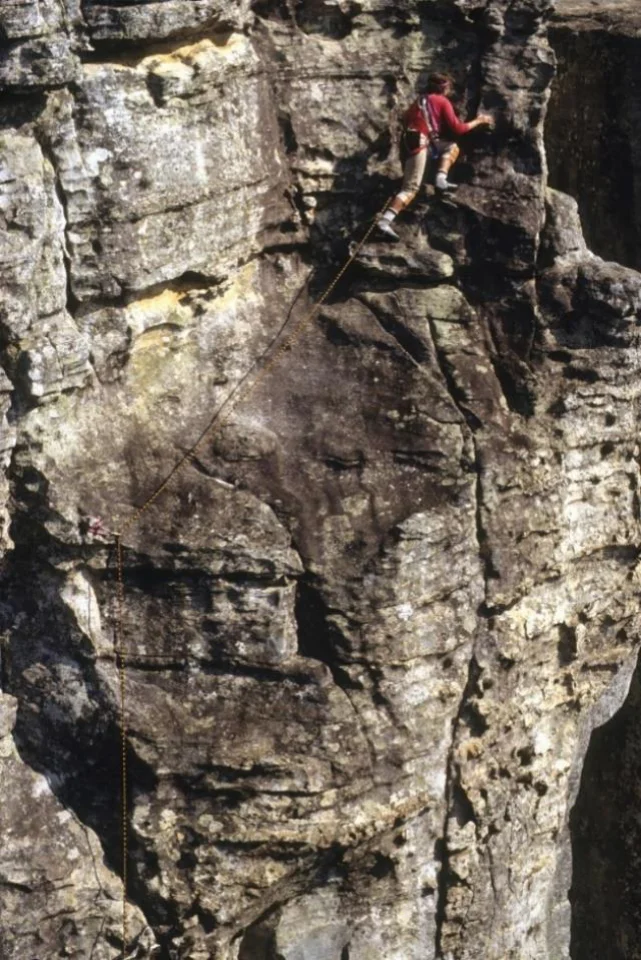 |
          | :--: |
          | *Lucia Duarte escalando a Rota das Âncoras* |
      - **nome**: Pontão Menor - Face Leste (Área da Esquina da Alegria)
      - **mapas**:
        - **[0]**:
          - **caminho_imagem_mapa**: 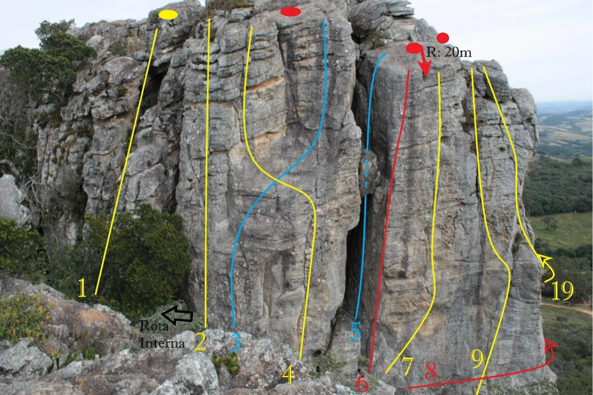
          - **largura_mapa**: 1600
          - **altura_mapa**: 1067
          - **pontos_de_interesse**:
            - **[0]**:
              - **id**: 1
              - **label**: 1
              - **circulo**:
                - **x**: 222
                - **y**: 778
                - **raio**: 35
            - **[1]**:
              - **id**: 2
              - **label**: 2
              - **circulo**:
                - **x**: 539
                - **y**: 924
                - **raio**: 35
            - **[2]**:
              - **id**: 3
              - **label**: 3
              - **circulo**:
                - **x**: 635
                - **y**: 928
                - **raio**: 35
            - **[3]**:
              - **id**: 4
              - **label**: 4
              - **circulo**:
                - **x**: 780
                - **y**: 1011
                - **raio**: 34
            - **[4]**:
              - **id**: 5
              - **label**: 5
              - **circulo**:
                - **x**: 959
                - **y**: 897
                - **raio**: 33
            - **[5]**:
              - **id**: 6
              - **label**: 6
              - **circulo**:
                - **x**: 979
                - **y**: 1036
                - **raio**: 32
            - **[6]**:
              - **id**: 7
              - **label**: 7
              - **circulo**:
                - **x**: 1100
                - **y**: 988
                - **raio**: 33
            - **[7]**:
              - **id**: 8
              - **label**: 8
              - **circulo**:
                - **x**: 1164
                - **y**: 1003
                - **raio**: 32
            - **[8]**:
              - **id**: 9
              - **label**: 9
              - **circulo**:
                - **x**: 1284
                - **y**: 968
                - **raio**: 32
            - **[9]**:
              - **id**: setor_rota_interna
              - **label**: Rota Interna
              - **retangulo**:
                - **x**: 432
                - **y**: 901
                - **comprimento**: 137
                - **largura**: 86
            - **[10]**:
              - **id**: 19
              - **label**: 19
              - **circulo**:
                - **x**: 1519
                - **y**: 783
                - **raio**: 40
              - **cor**: 
          - **referencias**:
            - **[0]**:
              - **escalada**: Consolo
              - **ids**:
                - 1
            - **[1]**:
              - **escalada**: Porto Seguro
              - **ids**:
                - 2
            - **[2]**:
              - **escalada**: Rota das Âncoras
              - **ids**:
                - 3
            - **[3]**:
              - **escalada**: O Retorno das Abelhas
              - **ids**:
                - 4
            - **[4]**:
              - **escalada**: Chaminé dos Militares
              - **ids**:
                - 5
            - **[5]**:
              - **escalada**: Os Iluminados
              - **ids**:
                - 6
            - **[6]**:
              - **escalada**: Alta Tensão
              - **ids**:
                - 7
            - **[7]**:
              - **escalada**: Esquina da Alegria
              - **ids**:
                - 8
            - **[8]**:
              - **escalada**: Briga de Espadas
              - **ids**:
                - 9
            - **[9]**:
              - **setor**: Rota Interna
              - **ids**:
                - setor_rota_interna
            - **[10]**:
              - **ids**:
                - 19
              - **grupo**: Três Pontões (CEMONTA)
              - **setor**: Pontão Menor - Face Norte (Área da Guerra e Paz)
              - **escalada**: Tempos de Guerra
      - **escaladas**:
        - **[0]**:
          - **via_movel**:
            - **descricao**: Via curta e fácil, indicada para quem está iniciando na escalada móvel.
            - **nome**: Consolo
            - **dificuldade**: BR_2
            - **extensao**: 15
            - **conquistadores**:
              - André Ilha
              - Lúcia Duarte
              - Miguel Athayde
            - **data_abertura**: 1990-02-24
        - **[1]**:
          - **via_movel**:
            - **descricao**: Via em um belo sistema de fendas. Começa um pouco mais técnica e depois segue por boas agarras.
            - **nome**: Porto Seguro
            - **dificuldade**: BR_4
            - **extensao**: 15
            - **conquistadores**:
              - Michel Rodrigues
              - Douglas Marques
            - **data_abertura**: 2021-10-09
        - **[2]**:
          - **via_movel**:
            - **descricao**: Esta é a melhor opção para se chegar ao cume do Pontão Menor, para montar top-rope nas vias deste setor, pois além de curta e de baixa graduação, possui duas proteções fixas intermediando a linha.
            - **nome**: Rota das Âncoras
            - **dificuldade**: BR_3
            - **extensao**: 17
            - **quantidade_protecoes_intermediarias**: 2
            - **conquistadores**:
              - Escaladores Militares
            - **data_abertura**: 1984-07-26
        - **[3]**:
          - **via_movel**:
            - **descricao**: Ótima via que tem seu crux e beleza logo na saída. Em sua metade cruza com a via anterior e segue para a esquerda com boas agarras até o cume. Boa proteção em friends pequenos e médios e nuts.
            - **nome**: O Retorno das Abelhas
            - **dificuldade**: BR_6SUP
            - **extensao**: 20
            - **protecoes_moveis**: Friends pequenos e médios e nuts
            - **conquistadores**:
              - André Ilha
              - Lúcia Duarte
            - **data_abertura**: 1984
        - **[4]**:
          - **via_movel**:
            - **descricao**: Pequena e fácil chaminé que pode ser feita em top-rope.
            - **nome**: Chaminé dos Militares
            - **dificuldade**: BR_3
            - **extensao**: 20
        - **[5]**:
          - **via_esportiva**:
            - **descricao**: Aresta de visual incrível, inicia em regletes potentes e pés altos, passando a agarras escondidas. Entre a segunda e terceira chapa é o crux com lances delicados e potentes.
            - **nome**: Os Iluminados
            - **dificuldade**: BR_7B
            - **extensao**: 20
            - **conquistadores**:
              - Jonatas Lima
              - Pablo Veloso
            - **data_abertura**: 2021-09-02
        - **[6]**:
          - **via_movel**:
            - **descricao**: Via muito bonita, porém exposta e de difícil proteção em seu início onde se encontra o crux, conferindo ao guia uma boa dose de alta tensão! Depois é desfrutar de uma boa fenda e agarras grandes.
            - **nome**: Alta Tensão
            - **dificuldade**: BR_6
            - **exposicao**: E3
            - **extensao**: 15
            - **conquistadores**:
              - André Ilha
              - Lúcia Duarte
            - **data_abertura**: 1984-07-22
        - **[7]**:
          - **via_esportiva**:
            - **descricao**: Via que intercala grampos e pittons fixos. Após a virada da aresta, vai por uma horizontal até uma chaminé ao fundo, por onde segue até o cume.
            - **nome**: Esquina da Alegria
            - **dificuldade**: BR_4
            - **extensao**: 30
            - **conquistadores**:
              - Escaladores Militares
        - **[8]**:
          - **via_movel**:
            - **descricao**: Via exposta. Sua saída não é complicada, mas a primeira proteção é alta em uma fenda onde fica o crux. Logo deve-se passar para uma outra fenda mais à esquerda e segue por ela até o cume.
            - **nome**: Briga de Espadas
            - **dificuldade**: BR_6SUP
            - **extensao**: 20
            - **conquistadores**:
              - Rodrigo Ferreira
              - Carlos Henrique
      - **precomputados**:
        - **total_escaladas**: 9
        - **total_esportivas**: 2
  - **[2]**:
    - **conteudo**:
      - **descricao**:
          É a face do pontão que pode ser vista da estrada. Para acessá-la basta pegar as mesmas trilhas da Face Leste citadas acima, que fica logo ao lado virando a grande aresta.
          
          | 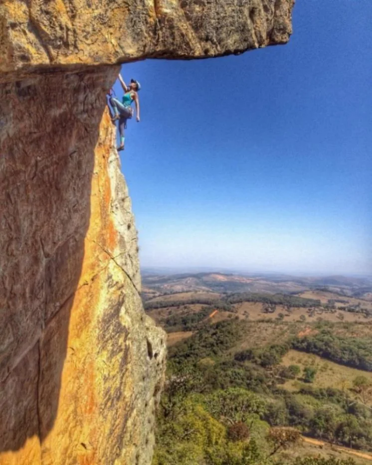 |
          | :--: |
          | *Vivianne Sawczuk na Variante Teto da Guerra e Paz* |
          
          *Vivianne Sawczuk na Variante Teto da Guerra e Paz*
      - **nome**: Pontão Menor - Face Norte (Área da Guerra e Paz)
      - **mapas**:
        - **[0]**:
          - **caminho_imagem_mapa**: 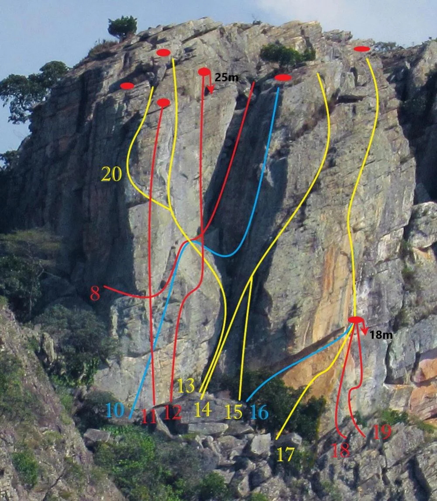
          - **largura_mapa**: 1001
          - **altura_mapa**: 1147
          - **pontos_de_interesse**:
            - **[0]**:
              - **id**: 8
              - **label**: 8
              - **circulo**:
                - **x**: 216
                - **y**: 670
                - **raio**: 25
            - **[1]**:
              - **id**: 10
              - **label**: 10
              - **circulo**:
                - **x**: 263
                - **y**: 940
                - **raio**: 29
            - **[2]**:
              - **id**: 11
              - **label**: 11
              - **circulo**:
                - **x**: 343
                - **y**: 951
                - **raio**: 27
            - **[3]**:
              - **id**: 12
              - **label**: 12
              - **circulo**:
                - **x**: 397
                - **y**: 945
                - **raio**: 27
            - **[4]**:
              - **id**: 13
              - **label**: 13
              - **circulo**:
                - **x**: 428
                - **y**: 882
                - **raio**: 29
            - **[5]**:
              - **id**: 14
              - **label**: 14
              - **circulo**:
                - **x**: 464
                - **y**: 938
                - **raio**: 30
            - **[6]**:
              - **id**: 15
              - **label**: 15
              - **circulo**:
                - **x**: 535
                - **y**: 942
                - **raio**: 27
            - **[7]**:
              - **id**: 16
              - **label**: 16
              - **circulo**:
                - **x**: 595
                - **y**: 943
                - **raio**: 28
            - **[8]**:
              - **id**: 17
              - **label**: 17
              - **circulo**:
                - **x**: 656
                - **y**: 1039
                - **raio**: 28
            - **[9]**:
              - **id**: 18
              - **label**: 18
              - **circulo**:
                - **x**: 780
                - **y**: 1031
                - **raio**: 29
            - **[10]**:
              - **id**: 19
              - **label**: 19
              - **circulo**:
                - **x**: 876
                - **y**: 989
                - **raio**: 29
            - **[11]**:
              - **id**: 20
              - **label**: 20
              - **circulo**:
                - **x**: 255
                - **y**: 399
                - **raio**: 31
          - **referencias**:
            - **[0]**:
              - **escalada**: Esquina da Alegria
              - **ids**:
                - 8
              - **setor**: Pontão Menor - Face Leste (Área da Esquina da Alegria)
            - **[1]**:
              - **escalada**: Rosa de Hiroshima
              - **ids**:
                - 10
            - **[2]**:
              - **escalada**: Feitiço Irreversível
              - **ids**:
                - 11
            - **[3]**:
              - **escalada**: Dois Bruxos e Uma Feiticeira
              - **ids**:
                - 12
            - **[4]**:
              - **escalada**: Spartacus
              - **ids**:
                - 13
            - **[5]**:
              - **escalada**: Rubycon
              - **ids**:
                - 14
            - **[6]**:
              - **escalada**: Variante da Rubycon
              - **ids**:
                - 15
            - **[7]**:
              - **escalada**: Variante Teto da Guerra e Paz
              - **ids**:
                - 16
            - **[8]**:
              - **escalada**: Guerra e Paz
              - **ids**:
                - 17
            - **[9]**:
              - **escalada**: Tempos de Paz
              - **ids**:
                - 18
            - **[10]**:
              - **escalada**: Tempos de Guerra
              - **ids**:
                - 19
            - **[11]**:
              - **escalada**: Rei Leônidas
              - **ids**:
                - 20
      - **escaladas**:
        - **[0]**:
          - **via_movel**:
            - **descricao**: Tem uma saída em móvel com proteções escassas. Depois encontra com a Esquina da Alegria e segue pelo grande platô com proteções fixas. Após alguns lances em horizontal deve-se ir pra direita e pegar a outra face da rocha seguindo por uma fenda óbvia. Enquanto que a Esquina segue para a grande fenda ao fundo.
            - **nome**: Rosa de Hiroshima
            - **dificuldade**: BR_5
            - **extensao**: 35
            - **conquistadores**:
              - André Ilha
              - Lúcia Duarte
            - **data_abertura**: 1986-05-02
        - **[1]**:
          - **via_esportiva**:
            - **descricao**: Via esportiva com saída em pequenos regletes, passa por um platô pra descanso e segue até parada dupla.
            - **nome**: Feitiço Irreversível
            - **dificuldade**: BR_8A
            - **extensao**: 20
            - **quantidade_protecoes_parada**: 2
            - **conquistadores**:
              - Jonatas Lima
              - Marcio Douglas
            - **data_abertura**: 2021-11-07
        - **[2]**:
          - **via_esportiva**:
            - **descricao**: Situada no pontão mais frequentado, é uma linha que impressiona, seja por lances de força ou por passadas técnicas. Um começo de regletes potentes tijolam os braços se não decifrar os lances rapidamente, até uma virada habilidosa para chegar no platô, onde se pode relaxar. Eis que chega na segunda parte da via e mais delicada, passadas técnicas com apertâncias certeiras, seja em regletes ou pinças. São 9 chapas ao todo.
            - **nome**: Dois Bruxos e Uma Feiticeira
            - **dificuldade**: BR_8A
            - **extensao**: 25
            - **quantidade_protecoes_intermediarias**: 9
            - **conquistadores**:
              - Jonatas Lima
              - Marcelo Júnior
              - Aline Nascimento
            - **data_abertura**: 2021-08-28
        - **[3]**:
          - **via_movel**:
            - **descricao**: Tem seu início na fenda larga ao lado do grande teto, onde Camalots 5 e 6 ajudam a proteger melhor. Depois segue para a esquerda, cruza com a Rosa de Hiroshima e segue por uma bonita fenda até o cume.
            - **nome**: Spartacus
            - **dificuldade**: BR_4SUP
            - **extensao**: 35
            - **conquistadores**:
              - André Ilha
              - Tonico Magalhães
            - **data_abertura**: 1984-04-26
            - **protecoes_moveis**: Camalots
        - **[4]**:
          - **via_movel**:
            - **descricao**: Tem a mesma saída da via anterior, mas logo pega a fenda à direita. Mais na parte final, em um platô, seguir para a esquerda cruzando um outro platô com vegetação.
            - **nome**: Rubycon
            - **dificuldade**: BR_4SUP
            - **extensao**: 35
            - **conquistadores**:
              - André Ilha
              - Lúcia Duarte
            - **data_abertura**: 1984-07-22
        - **[5]**:
          - **via_movel**:
            - **descricao**: Saída negativa no início do grande teto. Porém segue reto ao invés da diagonal da via à seguir.
            - **nome**: Variante da Rubycon
            - **dificuldade**: BR_7B
        - **[6]**:
          - **via_movel**:
            - **descricao**: Interessante horizontal, com boas proteções em friends pequenos, médios e nuts, além de dois pitons e um grampo, cruzando todo o grande teto por baixo. Ao término do teto, logo após virar a aresta, há uma parada dupla onde se junta com a via original. Possibilita realizar fotos incríveis.
            - **nome**: Variante Teto da Guerra e Paz
            - **dificuldade**: BR_5
            - **extensao**: 15
            - **quantidade_protecoes_intermediarias**: 3
            - **quantidade_protecoes_parada**: 2
            - **protecoes_moveis**: Friends pequenos, médios e nuts
        - **[7]**:
          - **via_movel**:
            - **descricao**: Sua base é bem abaixo das vias anteriores, descendo pela trilha principal. Sua saída fica entre duas rochas e segue em diagonal pra direita, abaixo do teto até a parada dupla. Porém esta primeira parte caiu um pouco em desuso, pois sua variante tem sido mais usada. Após a parada a via segue levemente para a esquerda em um sistema de fendas que impressiona pela qualidade, onde se encontra o crux. 1 jogo nuts/1 jg camalot até
            - **nome**: Guerra e Paz
            - **dificuldade**: BR_7C
            - **dificuldade_artificial**: A1
            - **extensao**: 35
            - **quantidade_protecoes_parada**: 2
            - **conquistadores**:
              - André Ilha
              - Leonardo Rodrigues
            - **data_abertura**: 1998-05-02
            - **protecoes_moveis**: 1 jogo de nuts, 1 jogo de camalots até
        - **[8]**:
          - **via_esportiva**:
            - **descricao**: Linha que segue um sistema de agarras escorridas e batentes, passando a agarras grandes. Uma linha totalmente reta que emenda na parada da Guerra e Paz, podendo assim chegar ao cume em um único esticão. Sua base fica ao lado da trilha principal e as primeiras chapas são facilmente vistas por quem passa.
            - **nome**: Tempos de Paz
            - **dificuldade**: BR_7A
            - **extensao**: 18
            - **conquistadores**:
              - Jonatas Lima
              - Michel Rodrigues
            - **data_abertura**: 2018
        - **[9]**:
          - **via_esportiva**:
            - **descricao**: Outra via que se junta na parada da Guerra e Paz. Via esportiva clássica por sua variação de estilo e beleza. Saída em lances de negativo e no meio toca para a linda aresta onde muda o estilo pra positivo de equilíbrio.
            - **nome**: Tempos de Guerra
            - **dificuldade**: BR_7A
            - **extensao**: 18
            - **conquistadores**:
              - Pedro Naves
              - Michel Rodrigues
            - **data_abertura**: 2022-04
        - **[10]**:
          - **via_movel**:
            - **descricao**: Variante da Spartacus. Na parte final vira a aresta e termina na Face Leste.
            - **nome**: Rei Leônidas
            - **dificuldade**: BR_4SUP
            - **extensao**: 15
            - **conquistadores**:
              - Jonatas Lima
              - Pablo Veloso
            - **data_abertura**: 2015-07-05
      - **precomputados**:
        - **total_escaladas**: 11
        - **total_esportivas**: 4
  - **[3]**:
    - **conteudo**:
      - **descricao**:
          Esta face fica um pouco escondida, pois a trilha principal não passa por sua base. Seguindo as orientações da trilha principal citada anteriormente, deve-se ficar atento para pegar uma trilha à direita alguns metros antes da via Tempos de Guerra. Esta trilha sobe por alguns blocos de pedra e logo estará na base das vias. A trilha também dá acesso à uma das entradas da Rota Interna e para a base das primeiras vias do Pontão Médio. Sombra pela manhã.
          
          | 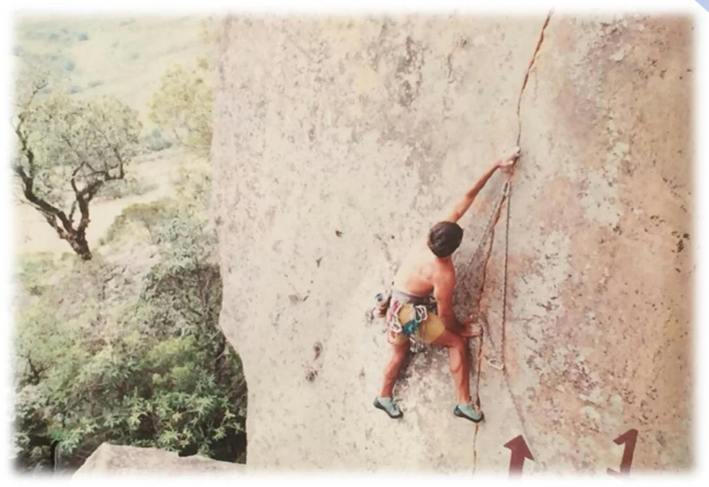 |
          | :--: |
          | *Nativo conquistando a Sublime Inconsequência* |
          
          | 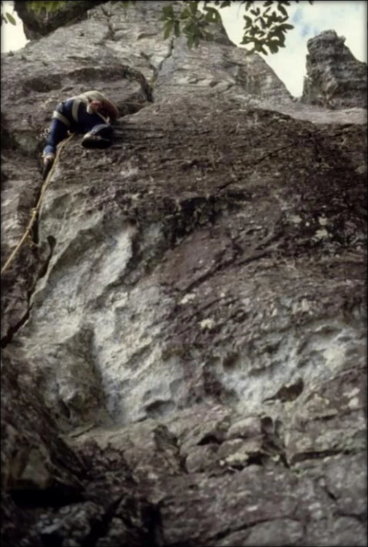 |
          | :--: |
          | *Tonico Magalhães conquistando a Dança Macabra* |
      - **nome**: Pontão Menor – Face Oeste (Cantinho - Dança Macabra)
      - **mapas**:
        - **[0]**:
          - **caminho_imagem_mapa**: 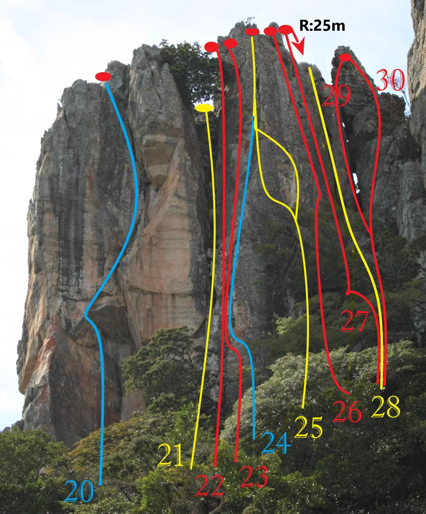
          - **largura_mapa**: 1751
          - **altura_mapa**: 2110
          - **pontos_de_interesse**:
            - **[0]**:
              - **id**: 20
              - **label**: 20
              - **circulo**:
                - **x**: 320
                - **y**: 2016
                - **raio**: 82
            - **[1]**:
              - **id**: 21
              - **label**: 21
              - **circulo**:
                - **x**: 697
                - **y**: 1868
                - **raio**: 82
            - **[2]**:
              - **id**: 22
              - **label**: 22
              - **circulo**:
                - **x**: 860
                - **y**: 1994
                - **raio**: 82
            - **[3]**:
              - **id**: 23
              - **label**: 23
              - **circulo**:
                - **x**: 1042
                - **y**: 1956
                - **raio**: 82
            - **[4]**:
              - **id**: 24
              - **label**: 24
              - **circulo**:
                - **x**: 1132
                - **y**: 1817
                - **raio**: 77
            - **[5]**:
              - **id**: 25
              - **label**: 25
              - **circulo**:
                - **x**: 1268
                - **y**: 1751
                - **raio**: 75
            - **[6]**:
              - **id**: 26
              - **label**: 26
              - **circulo**:
                - **x**: 1424
                - **y**: 1688
                - **raio**: 79
            - **[7]**:
              - **id**: 27
              - **label**: 27
              - **circulo**:
                - **x**: 1455
                - **y**: 1317
                - **raio**: 82
            - **[8]**:
              - **id**: 28
              - **label**: 28
              - **circulo**:
                - **x**: 1585
                - **y**: 1668
                - **raio**: 77
            - **[9]**:
              - **id**: 29
              - **label**: 29
              - **circulo**:
                - **x**: 1378
                - **y**: 392
                - **raio**: 82
            - **[10]**:
              - **id**: 30
              - **label**: 30
              - **circulo**:
                - **x**: 1604
                - **y**: 328
                - **raio**: 82
          - **referencias**:
            - **[0]**:
              - **escalada**: Sublime Inconsequência
              - **ids**:
                - 20
            - **[1]**:
              - **escalada**: Chaminé do Lenheiro
              - **ids**:
                - 21
            - **[2]**:
              - **escalada**: Velho Gafanhoto
              - **ids**:
                - 22
            - **[3]**:
              - **escalada**: Jovem Gafanhoto
              - **ids**:
                - 23
            - **[4]**:
              - **escalada**: Pitelzinho Apimentado
              - **ids**:
                - 24
            - **[5]**:
              - **escalada**: Dança Macabra
              - **ids**:
                - 25
            - **[6]**:
              - **escalada**: No Limite
              - **ids**:
                - 26
            - **[7]**:
              - **escalada**: Sangue Frio
              - **ids**:
                - 27
            - **[8]**:
              - **escalada**: Sonho de Valsa
              - **ids**:
                - 28
            - **[9]**:
              - **escalada**: Barbatana
              - **ids**:
                - 29
            - **[10]**:
              - **escalada**: Roubadas
              - **ids**:
                - 30
      - **escaladas**:
        - **[0]**:
          - **via_movel**:
            - **descricao**: Inicia em uma linda fissura de dedos, levemente positiva e bem lisa, exige uma boa experiencia nesse tipo de escalada. Essa primeira parte termina em um grampo, pois a conquista original de 1987 foi só até ali. Apenas em 1995, a via ganhou seu “upgrade”, indo até o topo. Nesta segunda parte, após contornar o teto pela esquerda, a via segue por um diedro com fenda mais larga até o cume.
            - **nome**: Sublime Inconsequência
            - **dificuldade**: BR_7C
            - **tipo_parede**: POSITIVO
            - **extensao**: 35
            - **conquistadores**:
              - Marcelo Brage
              - Antônio Paulo Faria
              - Ronaldo Franzen "Nativo"
            - **data_abertura**: 1987
        - **[1]**:
          - **via_movel**:
            - **descricao**: Chaminé de baixa graduação, que inicia média e torna-se larga no final. Em sua metade, há um bloco de pedra entalado e ao final deve-se passar por dentro de um buraco.
            - **nome**: Chaminé do Lenheiro
            - **dificuldade**: BR_3
            - **extensao**: 35
            - **conquistadores**:
              - André Ilha
              - Tonico Magalhães
            - **data_abertura**: 1984-04-26
        - **[2]**:
          - **via_esportiva**:
            - **descricao**: Via com uma saída bem técnica e negativo no final ainda sem cadena até a data desta edição.
            - **nome**: Velho Gafanhoto
            - **dificuldade**: PROJETO
            - **extensao**: 30
            - **conquistadores**:
              - Jonatas Lima
              - Lucas Hostalácio
            - **data_abertura**: 2024-04
        - **[3]**:
          - **via_esportiva**:
            - **descricao**: Via longa com movimentação bem variada. Saída vertical, depois faz um contorno pra esquerda onde compartilha um grampo com suas duas vizinhas, seguido do crux em uma barriga delicada, logo após pega pra direita novamente em um rampado de equilíbrio até atingir o negativo final com ótimas agarras.
            - **nome**: Jovem Gafanhoto
            - **dificuldade**: BR_6SUP
            - **extensao**: 30
            - **conquistadores**:
              - Jonatas Lima
              - Lucas Hostalácio
            - **data_abertura**: 2024-04
        - **[4]**:
          - **via_movel**:
            - **descricao**: Possui seu trecho mais fácil no meio, mas as proteções são escassas, tornando a exposição alta. Possui um grampo para aliviar a tensão, ainda no início. 1 jogo de nuts, friends médios e pequenos.
            - **nome**: Pitelzinho Apimentado
            - **dificuldade**: BR_6SUP
            - **exposicao**: E3
            - **extensao**: 40
            - **quantidade_protecoes_intermediarias**: 1
            - **protecoes_moveis**: 1 jogo de nuts, friends médios e pequenos
            - **conquistadores**:
              - Flávio Daflon
              - Cintia Daflon
        - **[5]**:
          - **via_movel**:
            - **descricao**:
                Considerada uma das vias mais clássica do Cemonta, consta no livro “50 vias clássicas no Brasil”. Uma linda fissura que inicia na base e segue até o cume. O crux que está em sua metade após o platô, foi conquistada contornando-o pela esquerda, mas tem sido repetida tocando reto pela fenda óbvia devido sua beleza. 1 jogo de nuts e 1 de friends do .3 ao 4
                
                Vídeo: https://www.youtube.com/watch?v=_VfPH78NUYc&t=2s
            - **nome**: Dança Macabra
            - **destaque**: True
            - **dificuldade**: BR_5SUP
            - **extensao**: 30
            - **protecoes_moveis**: 1 jogo de nuts e 1 de friends do .3 ao 4
            - **conquistadores**:
              - Tonico Magalhães
              - André Ilha
            - **data_abertura**: 1984-04-27
        - **[6]**:
          - **via_esportiva**:
            - **descricao**: Via que começa na mesma face à direita da Dança Macabra e no meio vira pro outro lado da aresta onde segue até o final. Diferente do padrão local, seu estilo positivo de equilíbrio com poucas agarras exige bom trabalho de pés, lembrando vias de parede. 9+2
            - **nome**: No Limite
            - **dificuldade**: BR_5
            - **tipo_parede**: POSITIVO
            - **extensao**: 25
            - **quantidade_protecoes_intermediarias**: 9
            - **quantidade_protecoes_parada**: 2
            - **conquistadores**:
              - Pedro Naves
              - Mariana Fiche
              - Jefferson Lara
            - **data_abertura**: 2023-03-12
        - **[7]**:
          - **via_esportiva**:
            - **descricao**: Saída utiliza um grampo amarelo para atingir o platô, depois passa para a face à esquerda. 9+2 chapas.
            - **nome**: Sangue Frio
            - **dificuldade**: BR_6SUP
            - **extensao**: 25
            - **quantidade_protecoes_intermediarias**: 9
            - **quantidade_protecoes_parada**: 2
            - **conquistadores**:
              - Pedro Naves
              - Gabriel Defelippe (Ripa)
            - **data_abertura**: 2023-03-19
        - **[8]**:
          - **via_movel**:
            - **descricao**: Conquistada em solo. Inicia em agarras, até alcançar a fissura que leva ao topo. Friends médios e grandes.
            - **nome**: Sonho de Valsa
            - **dificuldade**: BR_3
            - **extensao**: 30
            - **protecoes_moveis**: Friends médios e grandes
            - **conquistadores**:
              - André Ilha
            - **data_abertura**: 1984-04-27
        - **[9]**:
          - **via_esportiva**:
            - **descricao**: Via esportiva mais fácil do Cemonta, ótima para iniciantes tanto de top-rope quanto para aprender a guiar. Variante da via à seguir, se separam no platô, esta segue por uma aresta ao fundo e termina no mesmo top.
            - **nome**: Barbatana
            - **dificuldade**: BR_4SUP
            - **extensao**: 25
            - **conquistadores**:
              - Pedro Naves
              - Lucas Agostini
            - **data_abertura**: 2024-04-13
        - **[10]**:
          - **via_esportiva**:
            - **descricao**: Via que compartilha a mesma saída das três anteriores, porém no platô vai pra face da direita, terminando na torre de rocha ao fundo. Possui movimentação variada, alterna partes de negativo com lances de equilíbrio. Seu crux favorece quem é mais alto, por isso os baixos tendem a achar um pouco mais difícil. 8+2.
            - **nome**: Roubadas
            - **dificuldade**: BR_5SUP_BARRA_6
            - **extensao**: 25
            - **quantidade_protecoes_intermediarias**: 8
            - **quantidade_protecoes_parada**: 2
            - **conquistadores**:
              - Pedro Naves
              - Guilherme Otoni
              - Bruno Bastos
            - **data_abertura**: 2023-08-12
      - **precomputados**:
        - **total_escaladas**: 11
        - **total_esportivas**: 6
  - **[4]**:
    - **conteudo**:
      - **descricao**:
          # Pontão Médio
          
          Encontra-se antes do Pontão Menor vindo pela trilha principal. Devido à sua posição, melhor escalar pela manhã, pois o sol pega de tarde, principalmente no inverno. Possui vias bem verticais e altas, algumas com mais de 50 metros. Rapel na Nova Era ou trilha atrás.
          
          | 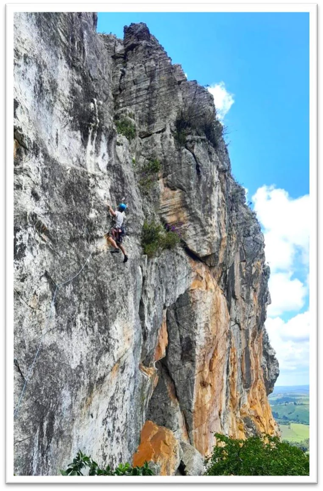 |
          | :--: |
          | *Pedro Naves conquistando a via Olhos de Águia* |
          
          | 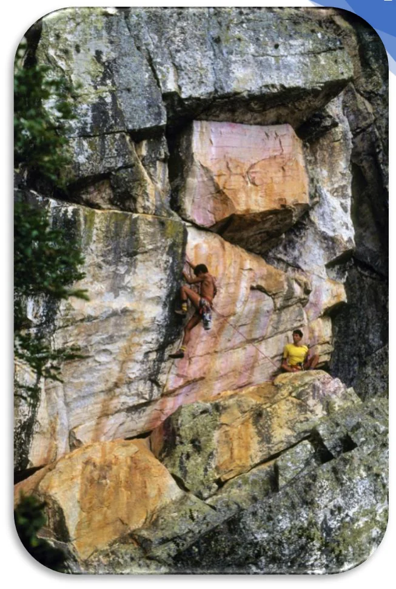 |
          | :--: |
          | *André Ilha conquistando a Sinfonia Fantástica* |
      - **nome**: Pontão Médio
      - **mapas**:
        - **[0]**:
          - **caminho_imagem_mapa**: 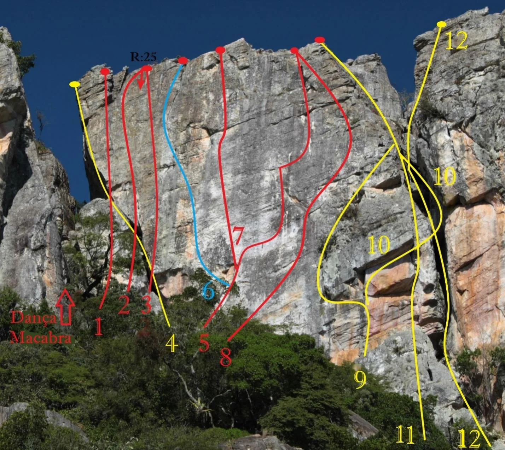
          - **largura_mapa**: 1428
          - **altura_mapa**: 1273
          - **pontos_de_interesse**:
            - **[0]**:
              - **id**: 1
              - **label**: 1
              - **circulo**:
                - **x**: 280
                - **y**: 924
                - **raio**: 34
            - **[1]**:
              - **id**: 2
              - **label**: 2
              - **circulo**:
                - **x**: 351
                - **y**: 864
                - **raio**: 33
            - **[2]**:
              - **id**: 3
              - **label**: 3
              - **circulo**:
                - **x**: 416
                - **y**: 863
                - **raio**: 33
            - **[3]**:
              - **id**: 4
              - **label**: 4
              - **circulo**:
                - **x**: 486
                - **y**: 973
                - **raio**: 35
            - **[4]**:
              - **id**: 5
              - **label**: 5
              - **circulo**:
                - **x**: 577
                - **y**: 970
                - **raio**: 34
            - **[5]**:
              - **id**: 6
              - **label**: 6
              - **circulo**:
                - **x**: 592
                - **y**: 823
                - **raio**: 33
            - **[6]**:
              - **id**: 7
              - **label**: 7
              - **circulo**:
                - **x**: 675
                - **y**: 665
                - **raio**: 33
            - **[7]**:
              - **id**: 8
              - **label**: 8
              - **circulo**:
                - **x**: 639
                - **y**: 1010
                - **raio**: 31
            - **[8]**:
              - **id**: 9
              - **label**: 9
              - **circulo**:
                - **x**: 1019
                - **y**: 1075
                - **raio**: 34
            - **[9]**:
              - **id**: 10
              - **label**: 10
              - **circulo**:
                - **x**: 1070
                - **y**: 691
                - **raio**: 42
            - **[10]**:
              - **id**: 11
              - **label**: 11
              - **circulo**:
                - **x**: 1146
                - **y**: 1230
                - **raio**: 39
            - **[11]**:
              - **id**: 12
              - **label**: 12
              - **circulo**:
                - **x**: 1326
                - **y**: 1239
                - **raio**: 43
            - **[12]**:
              - **id**: setor_danca_macabra
              - **label**: Dança Macabra
              - **retangulo**:
                - **x**: 118
                - **y**: 926
                - **comprimento**: 200
                - **largura**: 113
            - **[13]**:
              - **id**: 12_2
              - **label**: 
              - **circulo**:
                - **x**: 1293
                - **y**: 113
                - **raio**: 44
              - **cor**: 
            - **[14]**:
              - **id**: 10_2
              - **label**: 
              - **circulo**:
                - **x**: 1258
                - **y**: 496
                - **raio**: 43
              - **cor**: 
          - **referencias**:
            - **[0]**:
              - **escalada**: Vai Amanhecer
              - **ids**:
                - 1
            - **[1]**:
              - **escalada**: Indignação
              - **ids**:
                - 2
            - **[2]**:
              - **escalada**: Nova Era
              - **ids**:
                - 3
            - **[3]**:
              - **escalada**: Fissura Limites Invisíveis
              - **ids**:
                - 4
            - **[4]**:
              - **escalada**: Esalianos
              - **ids**:
                - 5
            - **[5]**:
              - **escalada**: Lua de Mel
              - **ids**:
                - 6
            - **[6]**:
              - **escalada**: Livre Para Voar
              - **ids**:
                - 7
            - **[7]**:
              - **escalada**: Olhos de Águia
              - **ids**:
                - 8
            - **[8]**:
              - **escalada**: Sinfonia Fantástica
              - **ids**:
                - 9
            - **[9]**:
              - **escalada**: Vr. O Fantasma da Ópera
              - **ids**:
                - 10
                - 10_2
            - **[10]**:
              - **escalada**: Ópera Selvagem
              - **ids**:
                - 11
            - **[11]**:
              - **escalada**: Pânico na Colméia
              - **ids**:
                - 12
                - 12_2
            - **[12]**:
              - **setor**: Pontão Menor – Face Oeste (Cantinho - Dança Macabra)
              - **ids**:
                - setor_danca_macabra
        - **[1]**:
          - **caminho_imagem_mapa**: 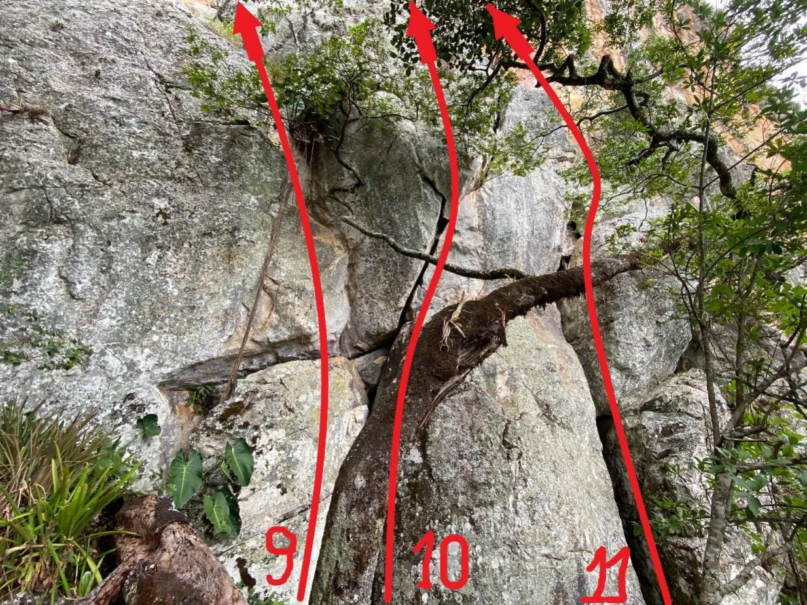
          - **largura_mapa**: 1233
          - **altura_mapa**: 925
          - **pontos_de_interesse**:
            - **[0]**:
              - **id**: 9
              - **label**: 9
              - **circulo**:
                - **x**: 428
                - **y**: 852
                - **raio**: 58
            - **[1]**:
              - **id**: 10
              - **label**: 10
              - **circulo**:
                - **x**: 674
                - **y**: 856
                - **raio**: 64
            - **[2]**:
              - **id**: 11
              - **label**: 11
              - **circulo**:
                - **x**: 928
                - **y**: 881
                - **raio**: 65
          - **referencias**:
            - **[0]**:
              - **escalada**: Sinfonia Fantástica
              - **ids**:
                - 9
            - **[1]**:
              - **escalada**: Vr. O Fantasma da Ópera
              - **ids**:
                - 10
            - **[2]**:
              - **escalada**: Ópera Selvagem
              - **ids**:
                - 11
      - **escaladas**:
        - **[0]**:
          - **via_esportiva**:
            - **descricao**: Essa via é única deste setor que possui uma grande variedade de regletes. Passadas delicadas e técnicas em sua primeira parte até chegar a um platô, de onde se tem um grande visual. A segunda parte é a melhor, com uma saída de boulder e passadas precisas ditam o ritmo do jogo e dão o grau da via. Levar 10 costuras.
            - **nome**: Vai Amanhecer
            - **dificuldade**: BR_7A_BARRA_7B
            - **extensao**: 18
            - **quantidade_protecoes_intermediarias**: 10
            - **conquistadores**:
              - Jonatas Lima
              - Andréa Carvalho
            - **data_abertura**: 2020-03
        - **[1]**:
          - **via_esportiva**:
            - **descricao**: Via sem cadena até a data de publicação desta edição. Saída ao lado esquerdo de uma fenda larga.
            - **nome**: Indignação
            - **dificuldade**: PROJETO
            - **extensao**: 20
            - **conquistadores**:
              - Pedro Naves
              - Douglas Marques
            - **data_abertura**: 2023-09-29
        - **[2]**:
          - **via_esportiva**:
            - **descricao**: Possui uma saída de boulder não tão óbvia, a escalada à vista pode dar uma impressão de maior dificuldade, regletes e agarras com passadas técnicas em sua parte final fazem dela uma clássica. 9 chapas e mais o top.
            - **nome**: Nova Era
            - **dificuldade**: BR_7B
            - **extensao**: 20
            - **quantidade_protecoes_intermediarias**: 9
            - **quantidade_protecoes_parada**: 2
            - **tipo_ancoragem**: Top
            - **destaque**: True
            - **conquistadores**:
              - Jonatas Lima
              - Andréa Carvalho
            - **data_abertura**: 2020-03
        - **[3]**:
          - **via_movel**:
            - **descricao**: Uma fenda larga em diagonal para a esquerda até um grande platô, onde segue pela esquerda da aresta.
            - **nome**: Fissura Limites Invisíveis
            - **dificuldade**: BR_7B
            - **extensao**: 35
            - **conquistadores**:
              - André Ilha
              - Tonico Magalhães
            - **data_abertura**: 1984-04-26
        - **[4]**:
          - **via_esportiva**:
            - **descricao**: Outra clássica, considerada a primeira via no estilo esportivo do Cemonta. Passadas em horizontal, lances delicados em equilíbrio e alguns esticões tornam esta via muito técnica e respeitada. Levar 12 costuras. Na mesma base sai outra via diagonal, a Olhos de Águia, logo abaixo da Esalianos, cuidado pra não confundi-las. Com corda de 70m é possível rapelar pela via e com corda de 60 melhor fazer cume e descer pela via Nova Era ou descer à pé pela parte de trás do pontão.
            - **nome**: Esalianos
            - **dificuldade**: BR_6SUP
            - **extensao**: 30
            - **quantidade_protecoes_intermediarias**: 12
            - **destaque**: True
            - **conquistadores**:
              - Leonardo Caiafa
              - Poeira
            - **data_abertura**: 1996
        - **[5]**:
          - **via_movel**:
            - **descricao**: Linda via. Compartilha saída com Esalianos, com duas primeiras chapeletas em comum e sai para a esquerda, onde possui só mais uma chapa e depois segue por proteções móveis até o final. Sai por uma sequência de agarras, depois passa por um sistema de fendas de proteção mais complicada até chegar numa fenda maior.
            - **nome**: Lua de Mel
            - **dificuldade**: BR_7B
            - **extensao**: 23
            - **quantidade_protecoes_intermediarias**: 3
            - **protecoes_moveis**: Proteções móveis até o final
            - **conquistadores**:
              - Eliseu Frechou
              - Beth Frechou
            - **data_abertura**: 2002
        - **[6]**:
          - **via_esportiva**:
            - **descricao**: Está via é a mais exigente deste setor, com a saída compartilhada da Esalianos até a terceira chapa onde se toca totalmente reto, logo já se encontra o crux, movimentos precisos e explosivos e depois vai pegando na resistência, chapas espaçadas ditam a regra do jogo, característica que originou o nome.
            - **nome**: Livre Para Voar
            - **dificuldade**: BR_7C
            - **extensao**: 23
            - **conquistadores**:
              - Jonatas Lima
              - Mauricio dos Santos
            - **data_abertura**: 2009
        - **[7]**:
          - **via_esportiva**:
            - **descricao**: Linda via que corta todo o Pontão Médio. Saída em diagonal logo abaixo da Esalianos em lances de equilíbrio e depois segue reto até o platô, bom para um descanso. Logo vem um crux mais vertical e segue pela aresta direita deste Pontão. Termina junto com a via Esalianos. São 12 chapas e mais parada dupla, de onde pode-se descer de baldinho ou rapelar com corda de 70m. Com corda de 60 melhor fazer cume e descer pela via Nova Era ou descer à pé pela parte de trás do pontão.
            - **nome**: Olhos de Águia
            - **dificuldade**: BR_6SUP
            - **extensao**: 30
            - **quantidade_protecoes_intermediarias**: 12
            - **quantidade_protecoes_parada**: 2
            - **tipo_ancoragem**: Parada dupla
            - **conquistadores**:
              - Pedro Naves
              - Heider Ribeiro (Tio Nem)
            - **data_abertura**: 2024-02-13
        - **[8]**:
          - **via_movel**:
            - **descricao**: Via que se inicia no grande platô da Opera Selvagem e pode ser acessado por um trepa pedras à esquerda. Após um início vertical, segue por uma fenda horizontal pra esquerda que depois faz um contorno e segue em diagonal pra direita até a aresta da Opera Selvagem.
            - **nome**: Sinfonia Fantástica
            - **dificuldade**: BR_7C
            - **extensao**: 50
            - **conquistadores**:
              - André Ilha
              - Flávio Wasniewski
            - **data_abertura**: 1997-04-21
        - **[9]**:
          - **via_movel**:
            - **descricao**: Mesma saída da via anterior, porém segue reto até o teto onde pega a fenda horizontal pra direita e vai até a grande fenda que divide os Pontões, por onde segue até a aresta do Pontão Médio encontrando com a via à seguir.
            - **nome**: Vr. O Fantasma da Ópera
            - **dificuldade**: BR_6
            - **extensao**: 20
            - **conquistadores**:
              - André Ilha
              - Juliano Magalhães
            - **data_abertura**: 2004-03-20
        - **[10]**:
          - **via_movel**:
            - **descricao**: Clássica pela beleza e facilidade, sua beleza encontra-se na metade onde passa por tetos alaranjados de agarras enormes, onde o som dos morcegos fazem entender o nome da via. 1 jogo de camalot até o
            - **nome**: Ópera Selvagem
            - **dificuldade**: BR_5
            - **extensao**: 60
            - **protecoes_moveis**: 1 jogo de camalot até o
            - **destaque**: True
            - **conquistadores**:
              - André Ilha
              - Lúcia Duarte
            - **data_abertura**: 1984-07-25
        - **[11]**:
          - **via_movel**:
            - **descricao**: Inicia em um bonito diedro em diagonal para a esquerda, chegando à larga chaminé que corta praticamente toda a parede verticalmente. Porém tem sido evitada devido à uma grande colmeia de abelhas em seu início.
            - **nome**: Pânico na Colméia
            - **dificuldade**: BR_4
            - **extensao**: 70
            - **conquistadores**:
              - Tonico Magalhães
              - André Ilha
            - **data_abertura**: 1984-04-27
      - **precomputados**:
        - **total_escaladas**: 12
        - **total_esportivas**: 6
  - **[5]**:
    - **conteudo**:
      - **descricao**:
          # Pontão Maior
          
          É o maior bloco do Cemonta, por isso este nome. Além disso possui as vias mais difíceis, muito em função de sua negatividade. Nele se encontram algumas das vias mais clássicas como a Lúcifer, O Grande Encontro e Profecia. Para acessá-lo basta pegar a trilha principal descrita no Pontão Menor, a trilha atinge primeiro a base da via Variante da Lúcifer.
          
          Para as vias de cume, a forma de descida mais usual é uma trilha que se inicia na parte de trás à direita. Essas trilhas podem ser visualizadas no mapa de trilhas acima.
          
          É nesse bloco que estão as Pinturas Rupestres, elas ficam à direita da via Lúcifer. Vale a visita, independente de onde vai escalar, pois são de fácil acesso e tem valor histórico importante.
          
          | 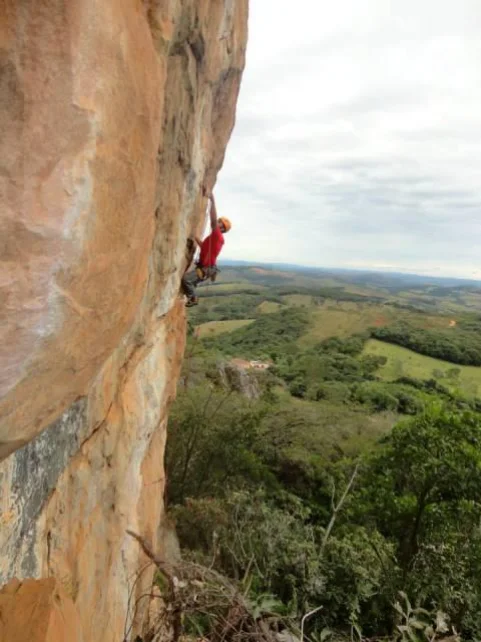 |
          | :--: |
          | *Jonatas Lima na via A Profecia* |
          
          |  |
          | :--: |
          | *Eliseu Frechou conquistando a via O Grande Encontro* |
      - **nome**: Pontão Maior
      - **mapas**:
        - **[0]**:
          - **caminho_imagem_mapa**: 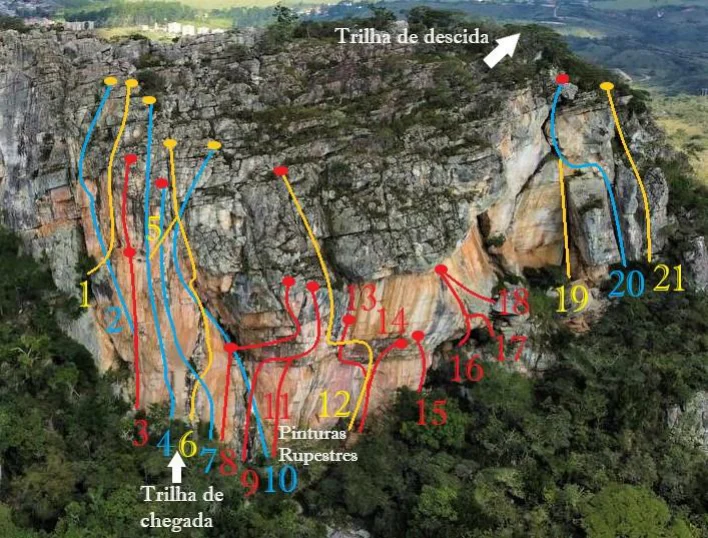
          - **largura_mapa**: 708
          - **altura_mapa**: 538
          - **pontos_de_interesse**:
            - **[0]**:
              - **id**: 1
              - **label**: 1
              - **circulo**:
                - **x**: 85
                - **y**: 295
                - **raio**: 17
            - **[1]**:
              - **id**: 2
              - **label**: 2
              - **circulo**:
                - **x**: 115
                - **y**: 320
                - **raio**: 15
            - **[2]**:
              - **id**: 3
              - **label**: 3
              - **circulo**:
                - **x**: 140
                - **y**: 433
                - **raio**: 15
            - **[3]**:
              - **id**: 4
              - **label**: 4
              - **circulo**:
                - **x**: 166
                - **y**: 444
                - **raio**: 14
            - **[4]**:
              - **id**: 5
              - **label**: 5
              - **circulo**:
                - **x**: 153
                - **y**: 228
                - **raio**: 15
            - **[5]**:
              - **id**: 6
              - **label**: 6
              - **circulo**:
                - **x**: 188
                - **y**: 444
                - **raio**: 15
            - **[6]**:
              - **id**: 7
              - **label**: 7
              - **circulo**:
                - **x**: 209
                - **y**: 461
                - **raio**: 14
            - **[7]**:
              - **id**: 8
              - **label**: 8
              - **circulo**:
                - **x**: 229
                - **y**: 462
                - **raio**: 14
            - **[8]**:
              - **id**: 9
              - **label**: 9
              - **circulo**:
                - **x**: 249
                - **y**: 484
                - **raio**: 17
            - **[9]**:
              - **id**: 10
              - **label**: 10
              - **circulo**:
                - **x**: 282
                - **y**: 480
                - **raio**: 19
            - **[10]**:
              - **id**: 11
              - **label**: 11
              - **circulo**:
                - **x**: 278
                - **y**: 406
                - **raio**: 20
            - **[11]**:
              - **id**: 12
              - **label**: 12
              - **circulo**:
                - **x**: 334
                - **y**: 404
                - **raio**: 21
            - **[12]**:
              - **id**: 13
              - **label**: 13
              - **circulo**:
                - **x**: 362
                - **y**: 297
                - **raio**: 19
            - **[13]**:
              - **id**: 14
              - **label**: 14
              - **circulo**:
                - **x**: 391
                - **y**: 321
                - **raio**: 20
            - **[14]**:
              - **id**: 15
              - **label**: 15
              - **circulo**:
                - **x**: 431
                - **y**: 412
                - **raio**: 21
            - **[15]**:
              - **id**: 16
              - **label**: 16
              - **circulo**:
                - **x**: 467
                - **y**: 368
                - **raio**: 22
            - **[16]**:
              - **id**: 17
              - **label**: 17
              - **circulo**:
                - **x**: 511
                - **y**: 347
                - **raio**: 21
            - **[17]**:
              - **id**: 18
              - **label**: 18
              - **circulo**:
                - **x**: 515
                - **y**: 301
                - **raio**: 21
            - **[18]**:
              - **id**: 19
              - **label**: 19
              - **circulo**:
                - **x**: 572
                - **y**: 297
                - **raio**: 20
            - **[19]**:
              - **id**: 20
              - **label**: 20
              - **circulo**:
                - **x**: 625
                - **y**: 283
                - **raio**: 23
            - **[20]**:
              - **id**: 21
              - **label**: 21
              - **circulo**:
                - **x**: 670
                - **y**: 278
                - **raio**: 22
          - **referencias**:
            - **[0]**:
              - **escalada**: Energia do Diedro Mineral
              - **ids**:
                - 1
            - **[1]**:
              - **escalada**: Entre Dois Mundos
              - **ids**:
                - 2
            - **[2]**:
              - **escalada**: A Profecia
              - **ids**:
                - 3
            - **[3]**:
              - **escalada**: A Profecia P1
              - **ids**:
                - 3
            - **[4]**:
              - **escalada**: O Grande Encontro
              - **ids**:
                - 4
            - **[5]**:
              - **escalada**: Variante Hardside
              - **ids**:
                - 5
            - **[6]**:
              - **escalada**: Variante da Lúcifer
              - **ids**:
                - 6
            - **[7]**:
              - **escalada**: Obra da Desistência
              - **ids**:
                - 7
            - **[8]**:
              - **escalada**: Macacos Ansiosos
              - **ids**:
                - 8
            - **[9]**:
              - **escalada**: Macacos P1
              - **ids**:
                - 8
            - **[10]**:
              - **escalada**: Visão Além do Alcance
              - **ids**:
                - 9
            - **[11]**:
              - **escalada**: Início da Visão
              - **ids**:
                - 9
            - **[12]**:
              - **escalada**: Lúcifer
              - **ids**:
                - 10
            - **[13]**:
              - **escalada**: Humildade e Disciplina
              - **ids**:
                - 11
            - **[14]**:
              - **escalada**: Humilde Disciplina
              - **ids**:
                - 11
            - **[15]**:
              - **escalada**: Rivotril
              - **ids**:
                - 12
            - **[16]**:
              - **escalada**: King Line
              - **ids**:
                - 13
            - **[17]**:
              - **escalada**: Revolução da Espécie
              - **ids**:
                - 14
            - **[18]**:
              - **escalada**: O Ego é Seu Inimigo
              - **ids**:
                - 15
            - **[19]**:
              - **escalada**: Boca Loca
              - **ids**:
                - 16
            - **[20]**:
              - **escalada**: Inimigo Mora ao Lado
              - **ids**:
                - 17
            - **[21]**:
              - **escalada**: O Mirador
              - **ids**:
                - 18
            - **[22]**:
              - **escalada**: Tinoco’s Friends
              - **ids**:
                - 19
            - **[23]**:
              - **escalada**: Diedro dos Militares
              - **ids**:
                - 20
            - **[24]**:
              - **escalada**: Faleon
              - **ids**:
                - 21
      - **escaladas**:
        - **[0]**:
          - **via_movel**:
            - **descricao**: Via conquistada em artificial e em solitário, sem relatos de repetição da mesma totalmente em livre. Inicia saindo do platô da “Ópera Selvagem” (Pontão Médio) e percorre um diedro até passar pelo pequeno teto. Linha natural e perfeita para stoppers pequenos, friends e pittons.
            - **nome**: Energia do Diedro Mineral
            - **dificuldade**: BR_7C
            - **dificuldade_artificial**: A1
            - **protecoes_moveis**: Stoppers pequenos, friends e pitons
        - **[1]**:
          - **via_movel**:
            - **descricao**: Esta linha é linda e exigente. Compartilha as seis chapas iniciais da via A Profecia e passa para uma fenda linda em diagonal para a esquerda. Quando se acessa o platô é que começam os problemas, passadas por uma micro fissura e lances de agarras, até dominar um teto e continuar pelo negativo até a parte positiva.
            - **nome**: Entre Dois Mundos
            - **dificuldade**: BR_8B
            - **extensao**: 50
            - **quantidade_protecoes_intermediarias**: 6
            - **conquistadores**:
              - Jonatas Lima
              - Carlos Pádua
            - **data_abertura**: 2015
        - **[2]**:
          - **via_esportiva**:
            - **descricao**: Esta é uma das vias esportivas mais clássicas do Cemonta. Lances de regletes, passando por micro fissuras, abaulados e batentes, é esteticamente linda e explosiva. Levar 17 costuras, algumas longas. Rapel com corda de 60 parar no meio, de 70 um rapel só.
            - **nome**: A Profecia
            - **destaque**: True
            - **dificuldade**: BR_9A
            - **extensao**: 35
            - **quantidade_protecoes_intermediarias**: 17
            - **conquistadores**:
              - Jonatas Lima
              - Heider Ribeiro (Tio Nem)
            - **data_abertura**: 2013
        - **[3]**:
          - **via_esportiva**:
            - **descricao**: A Profecia foi conquistada como uma escalada única até onde é a segunda parada, mas foi necessário bater uma parada de rapel no meio para viabilizar o rapel com corda de 60m. Porém, pra quem procura uma escalada um pouco mais fácil, indo até a P1 já é clássica! Levar 11 costuras.
            - **nome**: A Profecia P1
            - **dificuldade**: BR_8B
            - **extensao**: 20
            - **quantidade_protecoes_intermediarias**: 11
            - **conquistadores**:
              - Jonatas Lima
              - Heider Ribeiro (Tio Nem)
            - **data_abertura**: 2013
        - **[4]**:
          - **via_movel**:
            - **descricao**: Uma linda via exigente, sua primeira metade é mais exposta, após passar por uma fissura fina chega num grande e lindo diedro mais tranquilo, após lances em leve negativo onde é protegido por duas chapas entra-se na parte final e crux, numa fenda fina e depois lances dinâmicos em abaulados. Friends do .3 ao 1 com peças repetidas e 1 jogo de nuts.
            - **nome**: O Grande Encontro
            - **destaque**: True
            - **dificuldade**: BR_8B
            - **quantidade_protecoes_intermediarias**: 2
            - **protecoes_moveis**: Friends do .3 ao 1 com peças repetidas e 1 jogo de nuts
            - **conquistadores**:
              - Gustavo Piancastelli
              - Fernando Leal
              - Eliseu Frechou
            - **data_abertura**: 2004
        - **[5]**:
          - **via_movel**:
            - **descricao**: Variante que liga a via “O Grande Encontro” à via “Lúcifer”. Linha delicada e com proteções escassas.
            - **nome**: Variante Hardside
            - **dificuldade**: BR_7B
        - **[6]**:
          - **via_movel**:
            - **descricao**: Via clássica e mais repetida do que a via original devido à sua beleza. Sua saída, bem no ponto de chegada da trilha, segue por um sistema de fendas até o pequeno teto onde cruza com a via original. Logo após o crux, que pode ser protegido no grampo de inox da via original, seguir pela direita no belíssimo diedro. Ao final do diedro, após cruzar de novo com a linha original, segue reto na bela fenda levemente negativa. Pode fazer em uma enfiada com costuras longas e peças repetidas ou em duas com 1 jogo de friends e 1 de nuts.
            - **nome**: Variante da Lúcifer
            - **destaque**: True
            - **dificuldade**: BR_6
            - **extensao**: 50
            - **protecoes_moveis**: 1 jogo de friends e 1 de nuts (peças repetidas se feita em uma enfiada)
            - **conquistadores**:
              - Luiz Cláudio
              - Rodrigo Ferreira
              - Leonardo Rodrigues
              - João Felippin
        - **[7]**:
          - **via_movel**:
            - **descricao**: Uma via que corta este pontão no meio, uma via que impressiona pela beleza de sua escalada e da rocha. Início em chapeletas. Sugere-se um jogo de friends até BD#4 e um de nuts. Rapel possível com corda de 70m.
            - **nome**: Obra da Desistência
            - **dificuldade**: BR_7B
            - **extensao**: 40
            - **protecoes_moveis**: 1 jogo de friends até BD#4 e 1 de nuts
            - **conquistadores**:
              - Jonatas Lima
              - Márcio Douglas
              - Carlos Pádua
            - **data_abertura**: 2021-06
        - **[8]**:
          - **via_esportiva**:
            - **descricao**:
                Uma das vias mais fotogênicas do Lenheiro, divide-se em duas enfiadas. A primeira com lances técnicos, que exigem uma boa leitura, regletes e abaulados apimentam essa parte que está cotada em 7b/c, até acessar o grande platô onde possui uma parada dupla. A segunda parte é uma escalada em horizontal cortando um dos tetos mais bonitos da serra, onde a via passa a subir verticalmente "negativa". Final após um bonito teto.
                
                Vídeo: https://www.youtube.com/watch?v=jDrkC1YNgo4
                Variantes: https://drive.google.com/file/d/1HxcEPpiLX-5GXE2pLM_Vsu8SMjTGdOQZ/view?usp=sharing
            - **nome**: Macacos Ansiosos
            - **destaque**: True
            - **dificuldade**: BR_9A
            - **extensao**: 40
            - **conquistadores**:
              - Jonatas Lima
              - Fabio Rufino
              - Márcio Douglas
            - **data_abertura**: 2021-01
        - **[9]**:
          - **via_esportiva**:
            - **descricao**: Primeira parte da via Macacos Ansiosos, até o platô. Uma ótima opção pra quem procura uma via na casa dos sétimos. A bela rocha laranja com movimentação complexa, fazem desta uma via muito interessante!
            - **nome**: Macacos P1
            - **dificuldade**: BR_7B_BARRA_7C
            - **extensao**: 15
            - **conquistadores**:
              - Jonatas Lima
              - Fabio Rufino
              - Márcio Douglas
            - **data_abertura**: 2021-01
        - **[10]**:
          - **via_esportiva**:
            - **descricao**:
                Via dura com início em positivo mais fácil, mas depois passa o diedro e segue diagonal nos fortes negativos.
                
                Vídeo: https://www.youtube.com/watch?v=W7DCQ7zbYJM&t=121s
                Variantes: https://drive.google.com/file/d/19MBOGl1C3KeN4_aXMetM4JE8E_dmJD7N/view?usp=sharing
            - **nome**: Visão Além do Alcance
            - **dificuldade**: BR_10C
            - **extensao**: 30
            - **conquistadores**:
              - Jonatas Lima
              - Márcio Douglas
            - **data_abertura**: 2022
        - **[11]**:
          - **via_esportiva**:
            - **descricao**: Início da via Visão Além do Alcance emendando na parada do platô da via Macacos Ansiosos. Única opção deste pontão pra quem busca uma via esportiva mais fácil.
            - **nome**: Início da Visão
            - **dificuldade**: BR_5SUP
            - **extensao**: 15
            - **conquistadores**:
              - Jonatas Lima
              - Márcio Douglas
            - **data_abertura**: 2022
        - **[12]**:
          - **via_movel**:
            - **descricao**: Uma das vias mais famosas deste setor. Sua saída fica bem ao lado esquerdo da grade de proteção das pinturas rupestres, porém encontra-se um pouco suja devido ao fato de ser pouco frequentada, já que sua variante tem sido mais usada em função de sua beleza. Possui alguns pitons e grampos velhos e pode ser repetida com 1 jogo de friends e 1 de nuts. Após o crux no grampo de inox sua linha segue pela esquerda.
            - **nome**: Lúcifer
            - **destaque**: True
            - **dificuldade**: BR_6
            - **extensao**: 60
            - **protecoes_moveis**: 1 jogo de friends e 1 de nuts (possui alguns pitons e grampos velhos)
            - **conquistadores**:
              - André Ilha
              - Leonardo Rodrigues
              - Waldemar Pugliese
            - **data_abertura**: 1997-09-28
        - **[13]**:
          - **via_esportiva**:
            - **descricao**: Sua saída fica bem encostada na grade das pinturas rupestres e acima se junta na via Visão Além do Alcance.
            - **nome**: Humildade e Disciplina
            - **dificuldade**: BR_11A
            - **extensao**: 30
            - **conquistadores**:
              - Jonatas Lima
              - Márcio Douglas
            - **data_abertura**: 2024-01
        - **[14]**:
          - **via_esportiva**:
            - **descricao**:
                Início da via anterior, terminando na parada à direita logo abaixo do teto. Via vertical muito técnica.
                
                Variantes: https://drive.google.com/file/d/1vqplNsdg1yzDz798YHD4qzJiWkS1oDpk/view?usp=sharing
            - **nome**: Humilde Disciplina
            - **dificuldade**: BR_9A
            - **extensao**: 30
            - **conquistadores**:
              - Jonatas Lima
              - Márcio Douglas
            - **data_abertura**: 2024-01
        - **[15]**:
          - **via_movel**:
            - **descricao**: Linha conquistada inteiramente em artificial, cortando o grande teto à direita da “Chá de Cadeira” e juntando nesta, na metade da parede. Ótimas colocações dos móveis e boa via para quem quer treinar artificial móvel.
            - **nome**: Rivotril
            - **dificuldade**: INDEFINIDO
            - **dificuldade_artificial**: A1
            - **protecoes_moveis**: Ótimas colocações dos móveis
            - **conquistadores**:
              - Carlos Henrique
              - Gelson Feliciano
              - Rodrigo Ferreira
        - **[16]**:
          - **via_esportiva**:
            - **descricao**:
                Clássica! Linda linha natural com movimentação complexa e variada. Começa logo a direita das pinturas rupestres. Saída vertical bem técnica, depois horizontal pra esquerda e termina em um forte negativo.
                
                Vídeo: https://www.youtube.com/watch?v=w4cKssSq5kU
                Variantes: https://drive.google.com/file/d/1F_fCzvLYR0qUuU6vrYTdP-EHYXQLHru2/view?usp=sharing
            - **nome**: King Line
            - **destaque**: True
            - **dificuldade**: BR_9A
            - **extensao**: 30
            - **conquistadores**:
              - Antônio Gilmar (Tonhão)
              - Jonatas Lima
            - **data_abertura**: 2022
        - **[17]**:
          - **via_esportiva**:
            - **descricao**:
                Compartilha a mesma saída da via anterior, mas segue mais reto na fenda e depois vira diagonal pra direita.
                
                Variantes: https://drive.google.com/file/d/1aKpRe22mwsIh3CWrPEbrDoHn82DnDWmj/view?usp=sharing
            - **nome**: Revolução da Espécie
            - **dificuldade**: BR_8C
            - **extensao**: 20
            - **conquistadores**:
              - Jonatas Lima
              - Márcio Douglas
            - **data_abertura**: 2022
        - **[18]**:
          - **via_esportiva**:
            - **descricao**:
                Linda via. Após uma saída vertical com boas agarras é hora de descansar pois a segunda metade não alivia.
                
                Variantes: https://drive.google.com/file/d/1NNovnH65hs_07uiuxunn1jglOmNxuEIn/view?usp=sharing
            - **nome**: O Ego é Seu Inimigo
            - **dificuldade**: BR_8A
            - **extensao**: 15
            - **conquistadores**:
              - Jonatas Lima
              - Márcio Douglas
            - **data_abertura**: 2022
        - **[19]**:
          - **via_esportiva**:
            - **descricao**: Início em um grande buraco na rocha onde encontra-se o crux, depois junta com a via Inimigo Mora ao Lado.
            - **nome**: Boca Loca
            - **dificuldade**: BR_8B
            - **extensao**: 20
            - **conquistadores**:
              - Jonatas Lima
              - Márcio Douglas
            - **data_abertura**: 2023-10
        - **[20]**:
          - **via_esportiva**:
            - **descricao**: Via com estilos variados, primeira metade em uma fenda negativa e depois passa para positivo de equilíbrio e termina no Top da via O Mirador.
            - **nome**: Inimigo Mora ao Lado
            - **dificuldade**: BR_7C
            - **extensao**: 20
            - **conquistadores**:
              - Jonatas Lima
              - Márcio Douglas
            - **data_abertura**: 2023-10-12
        - **[21]**:
          - **via_esportiva**:
            - **descricao**: Linha iniciada e abandonada pelo André Ilha, sendo continuada posteriormente. Uma diagonal pra esquerda toda positivo de equilíbrio com lances muito delicados. Sua base fica acima das vias anteriores.
            - **nome**: O Mirador
            - **dificuldade**: BR_5
            - **extensao**: 15
            - **conquistadores**:
              - André Ilha
              - Rodrigo Magalhães
              - Thiago Barros
              - Jonatas Lima
              - Félix
            - **data_abertura**: 2015
        - **[22]**:
          - **via_movel**:
            - **descricao**: Sua linha impressiona pela beleza, mostra sua grandeza a partir da abertura do diedro. Via exigente que até hoje não foi encadenada toda em livre, a fenda fica boa parte do ano suja de terra por escorrer muita água.
            - **nome**: Tinoco’s Friends
            - **dificuldade**: BR_7C
            - **dificuldade_artificial**: A1
            - **conquistadores**:
              - Gustavo Piancastelli
              - Cristiano
            - **data_abertura**: 2001
        - **[23]**:
          - **via_movel**:
            - **descricao**: Sai num diedro com boas colocações pra móvel (boa pra praticar) e alguns grampos velhos e desnecessários (é possível fazer toda em móvel). Feita em duas enfiadas com parada mista após contornar a aresta.
            - **nome**: Diedro dos Militares
            - **dificuldade**: BR_4
            - **extensao**: 40
            - **protecoes_moveis**: Boas colocações pra móvel (alguns grampos velhos)
            - **conquistadores**:
              - Escaladores Militares
        - **[24]**:
          - **via_movel**:
            - **descricao**: Linha de baixa graduação, na extrema direita do Pontão Maior.
            - **nome**: Faleon
            - **dificuldade**: BR_4
            - **conquistadores**:
              - João Felipin
              - Leonardo Rodrigues
            - **data_abertura**: 2002
      - **precomputados**:
        - **total_escaladas**: 25
        - **total_esportivas**: 14
  - **[6]**:
    - **conteudo**:
      - **descricao**:
          # Vale das Sombras
          
          É um pequeno bloco localizado ao lado esquerdo da trilha que sobe para os Três Pontões, poucos metros antes de chegar na base do Pontão Maior.
          
          Caracteriza-se por vias curtas e fortes, suas pequenas agarras fazem das vias duras do início ao fim. Tanto as vias quanto a base ficam na sombra o dia todo, pois o bloco está inteiro abaixo da linha das árvores.
      - **nome**: Vale das Sombras
      - **mapas**:
        - **[0]**:
          - **caminho_imagem_mapa**: 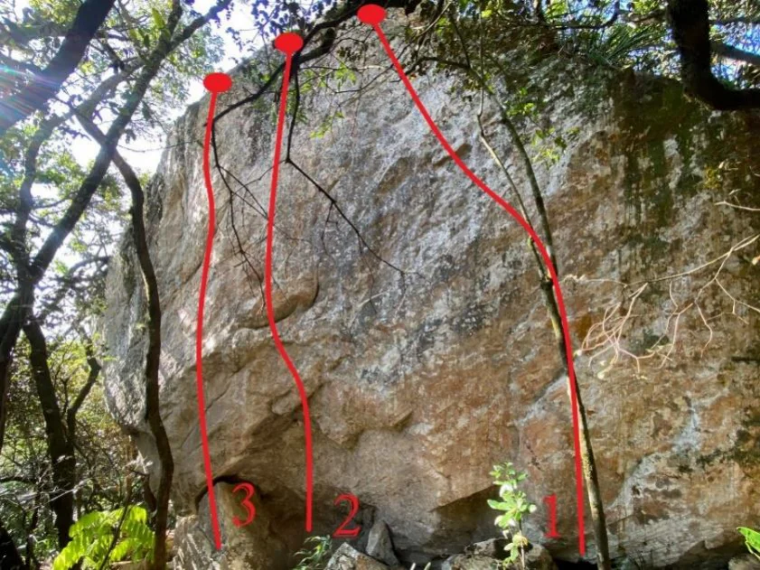
          - **largura_mapa**: 841
          - **altura_mapa**: 631
          - **referencias**:
            - **[0]**:
              - **escalada**: Vale das Sombras
              - **ids**:
                - 1
            - **[1]**:
              - **escalada**: A Emboscada
              - **ids**:
                - 2
            - **[2]**:
              - **escalada**: Dia D
              - **ids**:
                - 3
          - **pontos_de_interesse**:
            - **[0]**:
              - **id**: 1
              - **label**: 1
              - **circulo**:
                - **x**: 610
                - **y**: 570
                - **raio**: 28
            - **[1]**:
              - **id**: 2
              - **label**: 2
              - **circulo**:
                - **x**: 384
                - **y**: 569
                - **raio**: 28
            - **[2]**:
              - **id**: 3
              - **label**: 3
              - **circulo**:
                - **x**: 270
                - **y**: 558
                - **raio**: 28
      - **escaladas**:
        - **[0]**:
          - **via_esportiva**:
            - **descricao**: Via explosiva com sequência dura de regletes sem descanso bom.
            - **nome**: Vale das Sombras
            - **dificuldade**: BR_9B_BARRA_9C
            - **extensao**: 12
            - **conquistadores**:
              - Michel Rodrigues
              - Douglas Marques
            - **data_abertura**: 2022-03-18
        - **[1]**:
          - **via_esportiva**:
            - **descricao**: Via sem cadena até a data de publicação dessa edição do guia.
            - **nome**: A Emboscada
            - **dificuldade**: PROJETO
            - **extensao**: 10
            - **conquistadores**:
              - Michel Rodrigues
              - Douglas Marques
            - **data_abertura**: 2022-03-18
        - **[2]**:
          - **via_esportiva**:
            - **descricao**: Via sem cadena até a data de publicação dessa edição do guia.
            - **nome**: Dia D
            - **dificuldade**: PROJETO
            - **extensao**: 10
            - **conquistadores**:
              - Michel Rodrigues
              - Douglas Marques
            - **data_abertura**: 2022-03-18
      - **precomputados**:
        - **total_escaladas**: 3
        - **total_esportivas**: 3
- **precomputados**:
  - **total_escaladas**: 81
  - **total_esportivas**: 37

## Parte: setor_ave_maria

### Setor (Pico: Serra do Lenheiro)

- **descricao**:
    # Ave Maria
    
    Este setor se tornou famoso entre escaladores esportivos que buscam por uma escalada mais atlética. Suas vias, em geral, são bem negativas e exigentes fisicamente. A área no entorno também possui uma grande quantidade de Boulders, que são tratados num guia independente que pode ser acessado no link disponibilizado no início deste guia.
    
    ### Acesso e Estacionamento
    
    > **Atenção:** Houve uma mudança no local do estacionamento para este setor! Vindo pela estrada principal, virar à direita alguns metros antes do CEMONTA, passar pela torre e deslocar-se em direção a uma porteira onde antes se deixava os veículos, agora deve-se adentrar nessa porteira e seguir pela principal até a próxima porteira onde haverá um estacionamento.
    
    A trilha se inicia no próprio estacionamento acompanhando a cerca com eucaliptos ao lado. Logo à frente encontrará a antiga trilha, nessa bifurcação deve-se subir a trilha íngreme de cascalho. Lá pra cima, após um muro de pedra, deve-se sair da trilha principal e pegar uma trilha à direita, em uma matinha. Em seguida o percurso segue em uma leve subida em meio as lajes de pedras. No final da subida já é possível avistar o setor à esquerda da trilha. No mapa do início deste guia pode-se visualizar essas trilhas, mas uma dica é que no geral deve-se sempre subir, já que este setor encontra-se no topo da serra.
    
    ## Bloco 1
    
    Este é o principal bloco do setor, onde se concentram a maioria das vias. Por possuir uma inclinação acentuada, ele se difere de todos os outros encontrados na cidade. Suas vias exigem força e resistência, tendo como vantagens na maioria das situações agarras grandes e bons descansos. Um outro fator positivo é, sem dúvida, o privilégio de poder escalar em dias chuvosos. Por possuir uma negatividade considerável, a rocha permanece seca mesmo durante uma chuva. Seus melhores registros fotográficos são obtidos ao entardecer.
    
    ## Bloco 2
    
    Este bloco encontra-se ao lado esquerdo do bloco 1, possuindo uma única via de escalada e alguns boulders em sua lateral. Quando se chega pela trilha principal, é possível avistar os dois blocos, um ao lado do outro.
    
    ## Bloco 3
    
    Parede lateral localizada à esquerda do bloco 1. Para uma fácil aproximação segue-se uma trilha descendo entre o bloco 1 e o bloco 2. Neste bloco é possível visualizar ao fundo as elevações a Pedra da Rapadura.
    
    Este setor se tornou famoso entre escaladores esportivos que buscam por uma escalada mais atlética. Suas vias, em geral, são bem negativas e exigentes fisicamente. A área no entorno também possui uma grande quantidade de Boulders, que são tratados num guia independente que pode ser acessado no link disponibilizado no início deste guia.
    
    
    |  |
    | :--: |
    | *Luiz Cláudio conquistando a via Ave Maria* |
    
    |  |
    | :--: |
    | *Jonatas Lima no final da via Apocalipse* |
- **nome**: Ave Maria
- **mapas**:
  - **[0]**:
    - **caminho_imagem_mapa**: 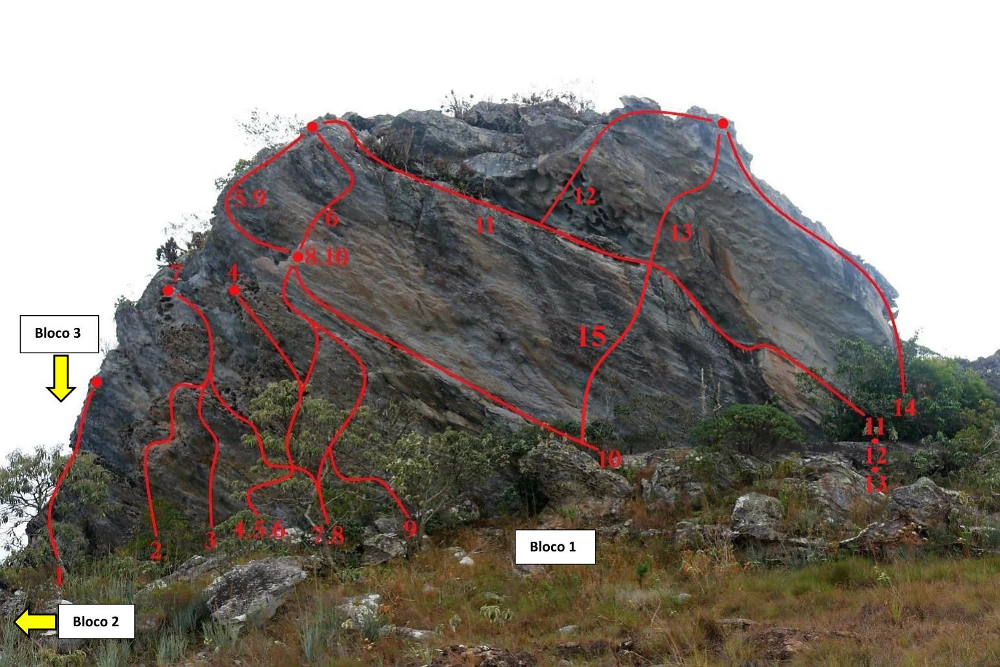
    - **largura_mapa**: 1548
    - **altura_mapa**: 1033
    - **referencias**:
      - **[0]**:
        - **escalada**: Confessionário
        - **ids**:
          - 1
      - **[1]**:
        - **escalada**: Pelo Amor de Deus
        - **ids**:
          - 2
      - **[2]**:
        - **escalada**: Livre Arbítrio
        - **ids**:
          - 3
      - **[3]**:
        - **escalada**: Purgatório
        - **ids**:
          - 4
          - 4_2
      - **[4]**:
        - **escalada**: O Pão que o Diabo Amassou
        - **ids**:
          - 5
          - 5_2
      - **[5]**:
        - **escalada**: Calvário
        - **ids**:
          - 6
          - 6_2
      - **[6]**:
        - **escalada**: Estigma
        - **ids**:
          - 7
          - 7_2
      - **[7]**:
        - **escalada**: Cheia de Graça
        - **ids**:
          - 8
          - 8_2
      - **[8]**:
        - **escalada**: Apocalipse
        - **ids**:
          - 9
          - 9_2
      - **[9]**:
        - **escalada**: Ave Maria
        - **ids**:
          - 10
          - 10_2
      - **[10]**:
        - **escalada**: Ajoelhou Tem Que Rezar
        - **ids**:
          - 11
          - 11_2
      - **[11]**:
        - **escalada**: Oratório
        - **ids**:
          - 12
          - 12_2
      - **[12]**:
        - **escalada**: Água Benta
        - **ids**:
          - 13
          - 13_2
      - **[13]**:
        - **escalada**: Primeira Comunhão
        - **ids**:
          - 14
      - **[14]**:
        - **escalada**: ?
        - **ids**:
          - 15
    - **pontos_de_interesse**:
      - **[0]**:
        - **id**: 1
        - **label**: 1
        - **circulo**:
          - **x**: 91
          - **y**: 894
          - **raio**: 22
      - **[1]**:
        - **id**: 2
        - **label**: 2
        - **circulo**:
          - **x**: 242
          - **y**: 852
          - **raio**: 20
      - **[2]**:
        - **id**: 3
        - **label**: 3
        - **circulo**:
          - **x**: 326
          - **y**: 837
          - **raio**: 19
      - **[3]**:
        - **id**: 4
        - **label**: 4
        - **circulo**:
          - **x**: 370
          - **y**: 821
          - **raio**: 17
      - **[4]**:
        - **id**: 5
        - **label**: 5
        - **circulo**:
          - **x**: 402
          - **y**: 820
          - **raio**: 18
      - **[5]**:
        - **id**: 6
        - **label**: 6
        - **circulo**:
          - **x**: 434
          - **y**: 819
          - **raio**: 17
      - **[6]**:
        - **id**: 7
        - **label**: 7
        - **circulo**:
          - **x**: 493
          - **y**: 828
          - **raio**: 17
      - **[7]**:
        - **id**: 8
        - **label**: 8
        - **circulo**:
          - **x**: 523
          - **y**: 829
          - **raio**: 17
      - **[8]**:
        - **id**: 9
        - **label**: 9
        - **circulo**:
          - **x**: 636
          - **y**: 819
          - **raio**: 18
      - **[9]**:
        - **id**: 10
        - **label**: 10
        - **circulo**:
          - **x**: 946
          - **y**: 711
          - **raio**: 23
      - **[10]**:
        - **id**: 11
        - **label**: 11
        - **circulo**:
          - **x**: 1355
          - **y**: 660
          - **raio**: 21
      - **[11]**:
        - **id**: 12
        - **label**: 12
        - **circulo**:
          - **x**: 1357
          - **y**: 706
          - **raio**: 20
      - **[12]**:
        - **id**: 13
        - **label**: 13
        - **circulo**:
          - **x**: 1357
          - **y**: 750
          - **raio**: 21
      - **[13]**:
        - **id**: 14
        - **label**: 14
        - **circulo**:
          - **x**: 1401
          - **y**: 632
          - **raio**: 21
      - **[14]**:
        - **id**: 15
        - **label**: 15
        - **circulo**:
          - **x**: 917
          - **y**: 518
          - **raio**: 29
      - **[15]**:
        - **id**: 7_2
        - **label**: 
        - **circulo**:
          - **x**: 273
          - **y**: 421
          - **raio**: 18
        - **cor**: 
      - **[16]**:
        - **id**: 4_2
        - **label**: 
        - **circulo**:
          - **x**: 362
          - **y**: 421
          - **raio**: 19
        - **cor**: 
      - **[17]**:
        - **id**: 5_2
        - **label**: 
        - **circulo**:
          - **x**: 371
          - **y**: 308
          - **raio**: 17
        - **cor**: 
      - **[18]**:
        - **id**: 9_2
        - **label**: 
        - **circulo**:
          - **x**: 401
          - **y**: 308
          - **raio**: 18
        - **cor**: 
      - **[19]**:
        - **id**: 8_2
        - **label**: 
        - **circulo**:
          - **x**: 480
          - **y**: 397
          - **raio**: 19
        - **cor**: 
      - **[20]**:
        - **id**: 10_2
        - **label**: 
        - **circulo**:
          - **x**: 523
          - **y**: 398
          - **raio**: 24
        - **cor**: 
      - **[21]**:
        - **id**: 6_2
        - **label**: 
        - **circulo**:
          - **x**: 514
          - **y**: 336
          - **raio**: 19
        - **cor**: 
      - **[22]**:
        - **id**: 11_2
        - **label**: 
        - **circulo**:
          - **x**: 753
          - **y**: 347
          - **raio**: 22
        - **cor**: 
      - **[23]**:
        - **id**: 12_2
        - **label**: 
        - **circulo**:
          - **x**: 908
          - **y**: 303
          - **raio**: 24
        - **cor**: 
      - **[24]**:
        - **id**: 13_2
        - **label**: 
        - **circulo**:
          - **x**: 1056
          - **y**: 359
          - **raio**: 22
        - **cor**: 
  - **[1]**:
    - **caminho_imagem_mapa**: 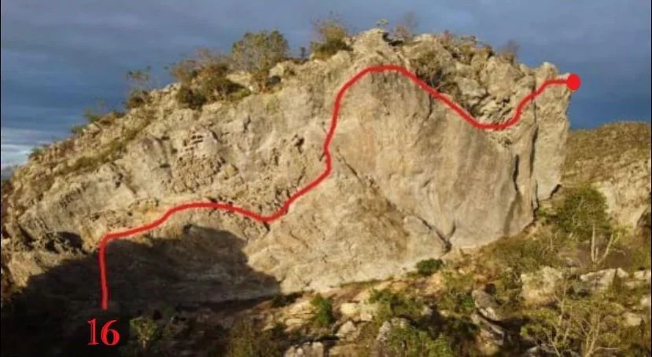
    - **largura_mapa**: 829
    - **altura_mapa**: 455
    - **referencias**:
      - **[0]**:
        - **escalada**: Procissão das Almas
        - **ids**:
          - 16
    - **pontos_de_interesse**:
      - **[0]**:
        - **id**: 16
        - **label**: 16
        - **circulo**:
          - **x**: 132
          - **y**: 424
          - **raio**: 28
  - **[2]**:
    - **caminho_imagem_mapa**: 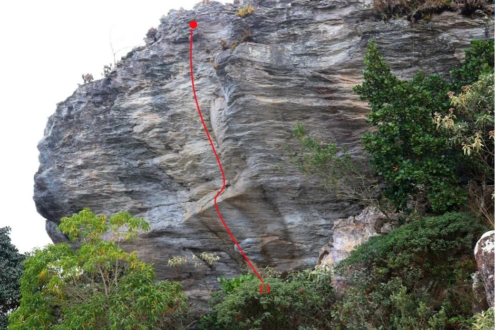
    - **largura_mapa**: 1041
    - **altura_mapa**: 695
    - **referencias**:
      - **[0]**:
        - **escalada**: Bombonier da Sacristia
        - **ids**:
          - 13
    - **pontos_de_interesse**:
      - **[0]**:
        - **id**: 13
        - **label**: 13
        - **circulo**:
          - **x**: 556
          - **y**: 608
          - **raio**: 17
  - **[3]**:
    - **caminho_imagem_mapa**: 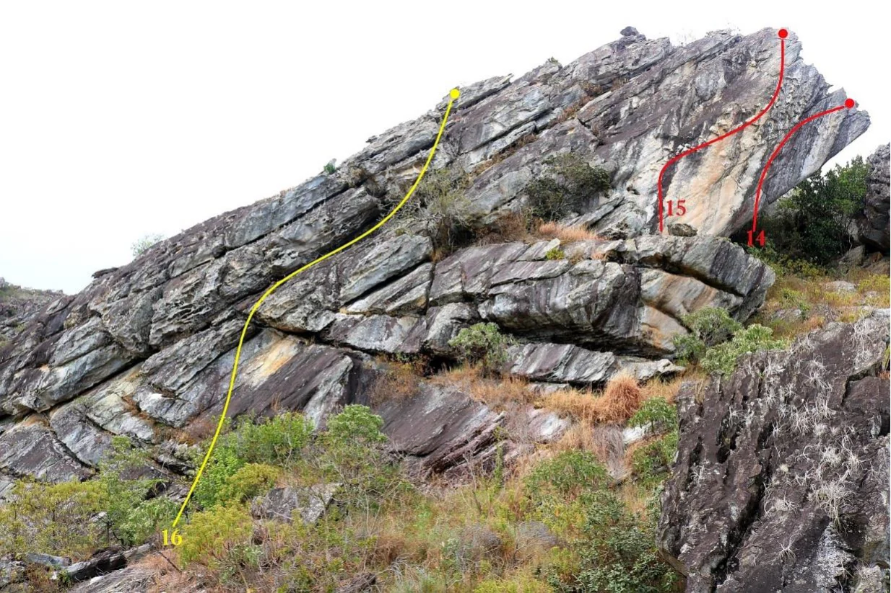
    - **largura_mapa**: 1234
    - **altura_mapa**: 823
    - **referencias**:
      - **[0]**:
        - **escalada**: Anjos e Demônios
        - **ids**:
          - 14
      - **[1]**:
        - **escalada**: Parabolts em Fúria
        - **ids**:
          - 15
      - **[2]**:
        - **escalada**: Contra-grip e resfriado
        - **ids**:
          - 16
    - **pontos_de_interesse**:
      - **[0]**:
        - **id**: 14
        - **label**: 14
        - **circulo**:
          - **x**: 1048
          - **y**: 330
          - **raio**: 17
      - **[1]**:
        - **id**: 15
        - **label**: 15
        - **circulo**:
          - **x**: 937
          - **y**: 289
          - **raio**: 18
      - **[2]**:
        - **id**: 16
        - **label**: 16
        - **circulo**:
          - **x**: 238
          - **y**: 745
          - **raio**: 20
- **escaladas**:
  - **[0]**:
    - **via_esportiva**:
      - **descricao**: Apesar de pequena é bem explosiva e boulderística, depois de virar o negativo ainda se escala uma parte meio rampa até um único grampo para rapel.
      - **nome**: Confessionário
      - **dificuldade**: BR_7C
      - **quantidade_protecoes_parada**: 1
      - **tipo_ancoragem**: Grampo
      - **conquistadores**:
        - Jonatas Lima
        - Tonhão
      - **data_abertura**: 2015
  - **[1]**:
    - **via_esportiva**:
      - **descricao**: O nome diz as característica da via, com agarras super afiadas e cortantes, torna-se um pouco sofrido ficar parado nelas, sua linha segue uma horizontal pra direita até acessar um grande platô, mais alguns lances pra cima e chega ao top duplo de argola. Atenção antes do platô, ainda existem agarras que podem quebrar.
      - **nome**: Pelo Amor de Deus
      - **dificuldade**: BR_7A
      - **quantidade_protecoes_parada**: 2
      - **tipo_ancoragem**: Dupla de argola
      - **conquistadores**:
        - Jonatas Lima
        - Pedro Paulo
  - **[2]**:
    - **via_esportiva**:
      - **descricao**: Uma via com uma saída boulderística e explosiva, passadas em dinâmicos, lances esticados em agarras grandes deixam essa via com uma beleza rara. O final desta via é compartilhada com a via numero 3.
      - **nome**: Livre Arbítrio
      - **dificuldade**: BR_8B
      - **conquistadores**:
        - Webert Resende (Beto)
        - Jonatas Lima
      - **data_abertura**: 2015
  - **[3]**:
    - **via_esportiva**:
      - **descricao**: Segunda via aberta neste setor e uma das mais clássicas, com uma saída numa laca gigante, passadas em diagonal, lances de bidedos, regletes e agarras grandes, fazem desta linha uma das mais procuradas.
      - **nome**: Purgatório
      - **destaque**: True
      - **dificuldade**: BR_7C
      - **conquistadores**:
        - Jonatas Lima
        - João Felipin
      - **data_abertura**: 2003
  - **[4]**:
    - **via_esportiva**:
      - **descricao**: Está é uma variante aberta sem bater uma chapa, por ser uma junção de 4 vias. Seu início pela Purgatório passando pelo crux, emendando na Cheia de Graça, por uma passada rápida pela Ave Maria e terminando no top da Ajoelhou Tem Que Rezar. Entre as graduadas em 8 grau é a mais frequentada do setor.
      - **nome**: O Pão que o Diabo Amassou
      - **dificuldade**: BR_8B_BARRA_8C
      - **conquistadores**:
        - Sérgio Ricardo
        - Jonatas Lima
      - **data_abertura**: 2015
  - **[5]**:
    - **via_esportiva**:
      - **descricao**: Uma Variante que se trata de duas chapas para fazer a junção de várias vias. Esta linha tem que ser escalada pela via O Pão Que o Diabo Amassou e quando se chega na parada dupla da Ave Maria toca-se a direita onde está o real problema, lances de boulder com botes, dinâmicos até emendar na Ajoelhou Tem Que Rezar.
      - **nome**: Calvário
      - **dificuldade**: BR_9B
      - **conquistadores**:
        - Jonatas Lima
        - Carlos Pádua
      - **data_abertura**: 2015
  - **[6]**:
    - **via_esportiva**:
      - **descricao**: Mais uma variante que tem a saída em comum com a Cheia de Graça. Passando a horizontal à esquerda até cruzar com o primeiro movimento difícil da Purgatório, continua-se à esquerda em diagonal até emendar com o final da via Pelo Amor de Deus.
      - **nome**: Estigma
      - **dificuldade**: BR_7C
      - **conquistadores**:
        - Jonatas Lima
        - Webert Resende
      - **data_abertura**: 2015
  - **[7]**:
    - **via_esportiva**:
      - **descricao**: Outra clássica do setor, com uma saída em monte, e passadas em grandes lacas e uma fenda, lances dinâmicos, lances de calcanhar, e um final em diagonal a esquerda até chegar no top duplo da Ave Maria. Excelente via para os que querem se aventurar no setor.
      - **nome**: Cheia de Graça
      - **destaque**: True
      - **dificuldade**: BR_7B
      - **conquistadores**:
        - Everton Alves
        - Jonatas Lima
        - Jefferson Lara
      - **data_abertura**: 2008
  - **[8]**:
    - **via_esportiva**:
      - **descricao**: Sua linha é praticamente a via Cheia de Graça, sendo seu diferencial a saída que é mais à direita e o final que, após o top da Ave Maria, segue pra esquerda com lance forte e aéreo, terminando no top duplo da Ajoelhou Tem Que Rezar.
      - **nome**: Apocalipse
      - **dificuldade**: BR_8A
      - **conquistadores**:
        - Jonatas Lima
        - Carlos Pádua
      - **data_abertura**: 2015
  - **[9]**:
    - **via_esportiva**:
      - **descricao**: A primeira via a ser conquistada no local, a qual deu o nome ao setor. Percorre uma linha diagonal para a esquerda de grandes agarras. Mas é uma via PERIGOSA, pois uma queda antes da terceira chapa pode vir no chão, como já aconteceu. Portanto melhor entrar só quem já está com o grau muito dominado.
      - **nome**: Ave Maria
      - **destaque**: True
      - **dificuldade**: BR_7A
      - **conquistadores**:
        - Luiz Cláudio
        - Rodrigo Araujo
      - **data_abertura**: 2004
  - **[10]**:
    - **via_esportiva**:
      - **descricao**: É a maior via do setor e mais aérea, com chapas um pouco mais distantes as quedas são um pouco maiores e no vazio, percorre toda aresta de toda rocha, possui uma variedade de estilo diferente das outras do setor.
      - **nome**: Ajoelhou Tem Que Rezar
      - **dificuldade**: BR_7B
      - **conquistadores**:
        - Jonatas Lima
        - Fabrício Nascimento
        - Carlos Pádua
      - **data_abertura**: 2012
  - **[11]**:
    - **via_esportiva**:
      - **descricao**: Compartilha o inicio da via Ajoelhou Tem que Rezar e em sua metade sai pra direita, desborda o final da rocha e termina no top da Primeira Comunhão.
      - **nome**: Oratório
      - **dificuldade**: BR_6SUP_BARRA_7A
      - **conquistadores**:
        - Jonatas Lima
        - Márcio Douglas
      - **data_abertura**: 2022
  - **[12]**:
    - **via_esportiva**:
      - **descricao**: Mesma saída da via anterior, mas logo sai pra direita onde toca reto até o top da Primeira Comunhão.
      - **nome**: Água Benta
      - **dificuldade**: BR_8A_BARRA_8B
      - **conquistadores**:
        - Jonatas Lima
        - Márcio Douglas
      - **data_abertura**: 2022
  - **[13]**:
    - **via_esportiva**:
      - **descricao**: Via localizada à extrema direita do bloco rochoso. Sua linha percorre pela aresta terminando em uma parada dupla. Esta via possibilita fotos incríveis, principalmente ao entardecer.
      - **nome**: Primeira Comunhão
      - **dificuldade**: BR_4SUP
      - **quantidade_protecoes_parada**: 2
      - **conquistadores**:
        - Jonatas Lima
        - Carlos Pádua
        - Pablo Veloso
      - **data_abertura**: 2015
  - **[14]**:
    - **via_esportiva**:
      - **descricao**: Provavelmente será uma das vias mais difíceis do setor, ainda não possui cadena e nem nome. Saída usando a primeira chapa da via Ave Maria e toca reto pra cima até a parada dupla das vias anteriores.
      - **nome**: ?
      - **dificuldade**: PROJETO
      - **conquistadores**:
        - Felipe Alvares (Kbeça)
      - **data_abertura**: 2023-05-01
  - **[15]**:
    - **via_esportiva**:
      - **descricao**: Linha que conecta as principais vias, cruzando todo o setor. Graduação estimada em 9?. Sai pela via Pelo Amor de Deus, antes do top desce pela Estigma e sai no lance de mono-dedo da via Purgatório. Faz o lance da Pão que o Diabo Amassou, sobe pelo final da apocalipse e depois volta tudo pela Ajoelhou Tem Que Rezar. Por fim, sobe pela via Oratório e termina no top da Primeira Comunhão. Ainda sem cadena.
      - **nome**: Procissão das Almas
      - **dificuldade**: PROJETO
      - **conquistadores**:
        - Jonatas Lima
      - **data_abertura**: 2022-01-30
  - **[16]**:
    - **via_esportiva**:
      - **descricao**: Única via conquistada no Bloco 2.
      - **nome**: Bombonier da Sacristia
      - **dificuldade**: BR_8B
      - **conquistadores**:
        - Tomás Kesselring
        - Flora Kesselring
      - **data_abertura**: 2015
  - **[17]**:
    - **via_esportiva**:
      - **descricao**: Via localizada no Bloco 3, ao lado da via Parabolts em Fúria. Graduação sugerida de 10a?.
      - **nome**: Anjos e Demônios
      - **dificuldade**: BR_10A
      - **conquistadores**:
        - Tomás Kesselring
        - Flora Kesselring
      - **data_abertura**: 2015
  - **[18]**:
    - **via_esportiva**:
      - **descricao**: Localizada no Bloco 3. Possui uma linha diagonal à direita e posteriormente um sentido mais vertical, chegando em uma parada dupla. Atentar-se na saída, devido a primeira proteção estar alta.
      - **nome**: Parabolts em Fúria
      - **dificuldade**: BR_6SUP
      - **quantidade_protecoes_parada**: 2
      - **conquistadores**:
        - Jonatas Lima
        - Maurício dos Santos
      - **data_abertura**: 2006
  - **[19]**:
    - **via_movel**:
      - **descricao**: Única via em móvel do setor, localizada no Bloco 3, ao lado esquerdo da via Parabolts em Fúria. Parada móvel e descida por caminhada.
      - **nome**: Contra-grip e resfriado
      - **dificuldade**: BR_4
      - **quantidade_protecoes_parada**: 0
      - **protecoes_moveis**: Parada móvel
      - **conquistadores**:
        - Pedro Bugim
        - Vivianne Sawczuk
      - **data_abertura**: 2015
- **precomputados**:
  - **total_escaladas**: 20
  - **total_esportivas**: 19

## Parte: setor_acidos

### Setor (Pico: Serra do Lenheiro)

- **descricao**:
    # Setor Ácidos
    
    O setor Ácidos apresenta como característica vias verticais com movimentações surpreendentes, podendo ser utilizados entalamentos, bidedo, calcanhar e movimentos dinâmicos. As linhas necessitam de uma leitura apurada e muita criatividade. Todas as vias são fixas e com parada dupla no top.
    
    Localizado no início da formação rochosa da Serra do Lenheiro ao lado do Bloco dos Dois Dedos, tem como grande vantagem a rápida aproximação, pois encontra-se muito próximo da estrada que sobe para o CEMONTA, é a primeira formação mais vertical do lado esquerdo. Fica na sombra durante toda a tarde, porém totalmente no sol de manhã.
    
    ## Dica
    
    Como o setor possui todas as vias acima de sétimo grau, uma opção usada por aqueles que querem escalar algo mais fácil é fazer o início da via Olho Clínico e na metade passar pra Ácido Lático, deve dar algo em torno de sexto grau. Por ser uma linha reta pode ser feita em Top-rope e tem o apelido de Olho Lático.
    
    | 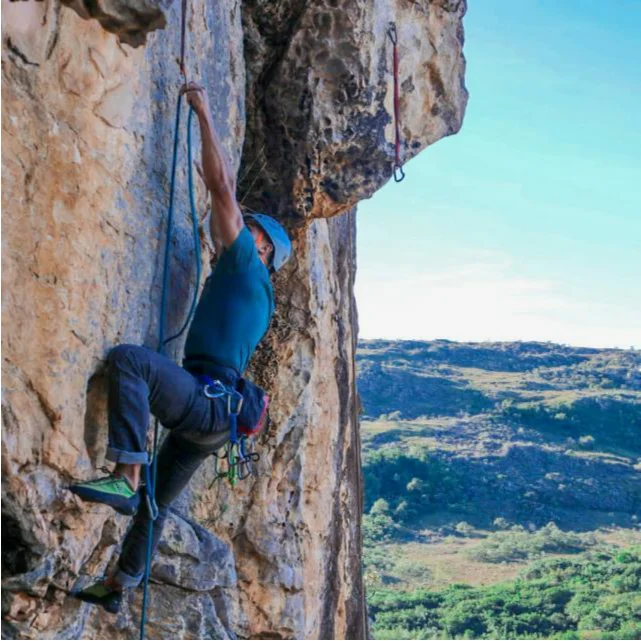 |
    | :--: |
    | *Michel Rodrigues na via Nitroglicerina* |
    
    O setor Ácidos apresenta como característica vias verticais com movimentações surpreendentes, podendo ser utilizados entalamentos, bidedo, calcanhar e movimentos dinâmicos. As linhas necessitam de uma leitura apurada e muita criatividade. Todas as vias são fixas e com parada dupla no top.
    
    Localizado no início da formação rochosa da Serra do Lenheiro ao lado do Bloco dos Dois Dedos, tem como grande vantagem a rápida aproximação, pois encontra-se muito próximo da estrada que sobe para o CEMONTA, é a primeira formação mais vertical do lado esquerdo. Fica na sombra durante toda a tarde, porém totalmente no sol de manhã.
- **nome**: Ácidos
- **mapas**:
  - **[0]**:
    - **caminho_imagem_mapa**: 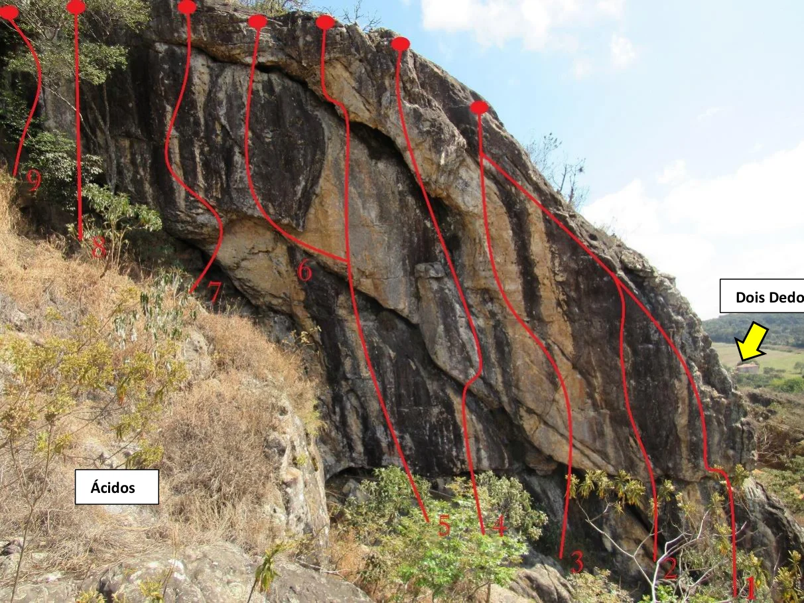
    - **largura_mapa**: 1212
    - **altura_mapa**: 909
    - **pontos_de_interesse**:
      - **[0]**:
        - **id**: 1
        - **label**: 1
        - **circulo**:
          - **x**: 1132
          - **y**: 887
          - **raio**: 21
      - **[1]**:
        - **id**: 2
        - **label**: 2
        - **circulo**:
          - **x**: 1012
          - **y**: 855
          - **raio**: 20
      - **[2]**:
        - **id**: 3
        - **label**: 3
        - **circulo**:
          - **x**: 871
          - **y**: 848
          - **raio**: 20
      - **[3]**:
        - **id**: 4
        - **label**: 4
        - **circulo**:
          - **x**: 753
          - **y**: 793
          - **raio**: 20
      - **[4]**:
        - **id**: 5
        - **label**: 5
        - **circulo**:
          - **x**: 670
          - **y**: 793
          - **raio**: 20
      - **[5]**:
        - **id**: 6
        - **label**: 6
        - **circulo**:
          - **x**: 459
          - **y**: 407
          - **raio**: 20
      - **[6]**:
        - **id**: 7
        - **label**: 7
        - **circulo**:
          - **x**: 323
          - **y**: 440
          - **raio**: 20
      - **[7]**:
        - **id**: 8
        - **label**: 8
        - **circulo**:
          - **x**: 149
          - **y**: 372
          - **raio**: 20
      - **[8]**:
        - **id**: 9
        - **label**: 9
        - **circulo**:
          - **x**: 50
          - **y**: 271
          - **raio**: 20
      - **[9]**:
        - **id**: setor_bloco_dos_dois_dedos
        - **label**: Dois Dedos
        - **retangulo**:
          - **x**: 1148
          - **y**: 446
          - **comprimento**: 126
          - **largura**: 52
    - **referencias**:
      - **[0]**:
        - **escalada**: Ácido Clorídrico
        - **ids**:
          - 1
      - **[1]**:
        - **escalada**: Ácido Sulfúrico
        - **ids**:
          - 2
      - **[2]**:
        - **escalada**: Ácido Lático
        - **ids**:
          - 3
      - **[3]**:
        - **escalada**: Olho Clínico
        - **ids**:
          - 4
      - **[4]**:
        - **escalada**: Nitroglicerina
        - **ids**:
          - 5
      - **[5]**:
        - **escalada**: Carga Explosiva
        - **ids**:
          - 6
      - **[6]**:
        - **escalada**: Menina dos Olhos
        - **ids**:
          - 7
      - **[7]**:
        - **escalada**: Capitão Nascimento
        - **ids**:
          - 8
      - **[8]**:
        - **escalada**: Isolamento Social
        - **ids**:
          - 9
      - **[9]**:
        - **setor**: Bloco dos Dois Dedos
        - **ids**:
          - setor_bloco_dos_dois_dedos
- **escaladas**:
  - **[0]**:
    - **via_esportiva**:
      - **descricao**: Sua linha tem início em agarras e depois segue por bons abaulados. Desborda toda a aresta em diagonal pra esquerda até encontrar o top da Ácido Lático. São 6 chapeletas e mais o top.
      - **nome**: Ácido Clorídrico
      - **dificuldade**: BR_7A
      - **extensao**: 17
      - **quantidade_protecoes_intermediarias**: 6
      - **quantidade_protecoes_parada**: 2
      - **tipo_ancoragem**: Parada dupla
      - **conquistadores**:
        - Everton Alves
        - Jonatas Lima
        - Jefferson Lara
  - **[1]**:
    - **via_esportiva**:
      - **descricao**: Linha mais nova do setor. Segue vertical até a quarta chapa onde junta com a Clorídrico e termina na Lático.
      - **nome**: Ácido Sulfúrico
      - **dificuldade**: BR_7C
      - **extensao**: 15
      - **quantidade_protecoes_parada**: 2
      - **tipo_ancoragem**: Parada dupla
      - **conquistadores**:
        - Pedro Naves
        - Bruno Bastos
      - **data_abertura**: 2023-05-22
  - **[2]**:
    - **via_esportiva**:
      - **descricao**: Primeira via conquistada no setor e também a mais clássica! Possui uma interessante movimentação técnica. Seus lances peculiares com pockets, abaulados e lances de equilíbrio fazem dela uma via desafiadora e por isso foi supergraduada no início. Divide o mesmo top com a via Ácido Clorídrico. São 5 chapas e mais o top.
      - **nome**: Ácido Lático
      - **dificuldade**: BR_7B
      - **extensao**: 12
      - **destaque**: True
      - **quantidade_protecoes_intermediarias**: 5
      - **quantidade_protecoes_parada**: 2
      - **tipo_ancoragem**: Parada dupla
      - **conquistadores**:
        - João Felippin
        - Everton Alves
  - **[3]**:
    - **via_esportiva**:
      - **descricao**: Esta é uma via que pode se tornar clássica do setor. Uma saída técnica passando a lances de oposição até acessar um grande platô, de onde necessita boa leitura caso escale à vista nos lances negativos debaixo do teto até fazer uma virada em grandes agarras. São 5 chapeletas e mais dois grampos no top.
      - **nome**: Olho Clínico
      - **dificuldade**: BR_7B
      - **extensao**: 12
      - **quantidade_protecoes_intermediarias**: 5
      - **quantidade_protecoes_parada**: 2
      - **tipo_ancoragem**: Dois grampos no top
      - **conquistadores**:
        - Jonatas Lima
      - **data_abertura**: 2013
  - **[4]**:
    - **via_esportiva**:
      - **descricao**: Segunda via aberta no setor, extremamente explosiva e com passadas esticadas em dinâmicos e lances certeiros minam a resistência do escalador que ainda tem que dominar um negativo antes de costurar o top final. São 4 chapas e mais duas no top.
      - **nome**: Nitroglicerina
      - **dificuldade**: BR_7C
      - **quantidade_protecoes_intermediarias**: 4
      - **quantidade_protecoes_parada**: 2
      - **tipo_ancoragem**: Parada dupla
      - **conquistadores**:
        - Jonatas Lima
      - **data_abertura**: 2005
  - **[5]**:
    - **via_esportiva**:
      - **descricao**: Essa via possui a mesma saída da via Nitroglicerina, porém após a segunda proteção a linha segue para a esquerda em uma escalada horizontal até um pequeno teto. Após isso a via segue vertical até a parada. 6 + 2 chapas.
      - **nome**: Carga Explosiva
      - **dificuldade**: BR_7C
      - **quantidade_protecoes_intermediarias**: 6
      - **quantidade_protecoes_parada**: 2
      - **tipo_ancoragem**: Parada dupla
      - **conquistadores**:
        - Jonatas Lima
        - Fabrício Nascimento
      - **data_abertura**: 2012
  - **[6]**:
    - **via_esportiva**:
      - **descricao**: É uma via curta, porém de rara beleza! Com agarras diferenciadas, como buracos bidedos e tridedos, variedade de agarras. Via curta, porém exigente apesar da graduação. Aconselha-se sair com a primeira proteção costurada.
      - **nome**: Menina dos Olhos
      - **dificuldade**: BR_7A
      - **quantidade_protecoes_parada**: 2
      - **tipo_ancoragem**: Parada dupla
      - **conquistadores**:
        - Jonatas Lima
        - Fabrício Nascimento
      - **data_abertura**: 2012
  - **[7]**:
    - **via_esportiva**:
      - **descricao**: Eis que temos a via mais difícil do setor. Uma via curta, porém praticamente todos os lances são de boulder. Seu crux é logo da primeira para a segunda chapa, após são lances de boulder mais diluídos, porém mantém uma constância até a parada dupla.
      - **nome**: Capitão Nascimento
      - **dificuldade**: BR_8B_BARRA_8C
      - **extensao**: 10
      - **quantidade_protecoes_parada**: 2
      - **tipo_ancoragem**: Parada dupla
      - **conquistadores**:
        - Jonatas Lima
        - Andréa Carvalho
      - **data_abertura**: 2014
  - **[8]**:
    - **via_esportiva**:
      - **descricao**: Via curta, mas inteira dura. Seus micro-regletes e monodedos com movimentação de difícil leitura fazem dela um belo desafio pra escalada à vista. Ao final passa pra outra face da rocha à esquerda. Sugere-se entrar com as costuras no lugar, pois as agarras de costura são bem ruins.
      - **nome**: Isolamento Social
      - **dificuldade**: BR_7C_BARRA_8A
      - **extensao**: 8
      - **quantidade_protecoes_parada**: 2
      - **tipo_ancoragem**: Parada dupla
      - **conquistadores**:
        - Pedro Naves
        - Mariana Fiche
      - **data_abertura**: 2021-08-15
- **precomputados**:
  - **total_escaladas**: 9
  - **total_esportivas**: 9

## Parte: setor_bloco_dos_dois_dedos

### Setor (Pico: Serra do Lenheiro)

- **descricao**:
    É o setor mais acessível da cidade, pois fica literalmente na beira da estrada à esquerda de quem sobe pro CEMONTA, ao lado do setor Ácidos. Está à 1km da saída da cidade.
    
    Excelente campo-escola, pois possui varias vias interessantes tanto pra quem está tendo o primeiro contato com a escalada quanto pra quem está começando a guiar via fixa ou móvel.
    
    Várias vias móveis não possuem parada fixa no cume, portanto é um bom local para se treinar parada móvel. No croqui pode-se ver as vias com parada fixa para a rapel (círculos vermelhos).
    
    | 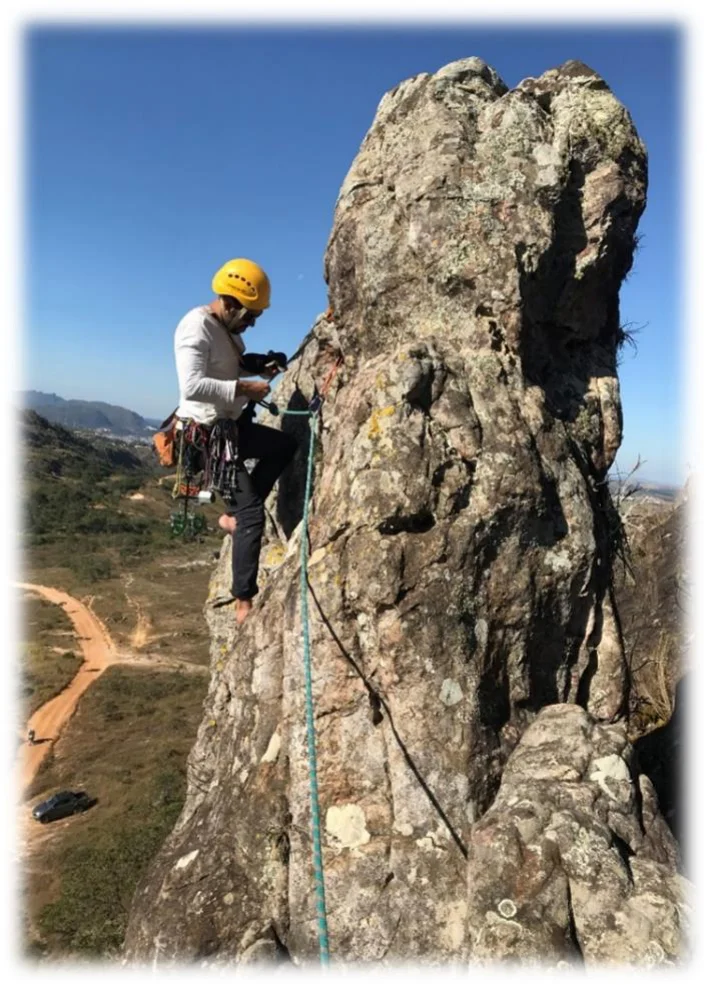 |
    | :--: |
    | *Jefferson Lara no final da Fissura dos Dois Dedos* |
    
    | 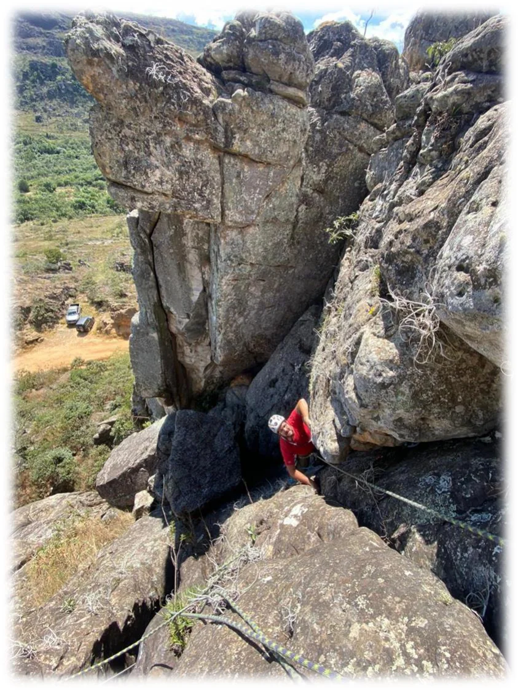 |
    | :--: |
    | *Márcio Andrade participando da conquista da via Jurassic Park, ao fundo a bela fissura da Magnésio de Cheirar* |
- **nome**: Bloco dos Dois Dedos
- **mapas**:
  - **[0]**:
    - **caminho_imagem_mapa**: 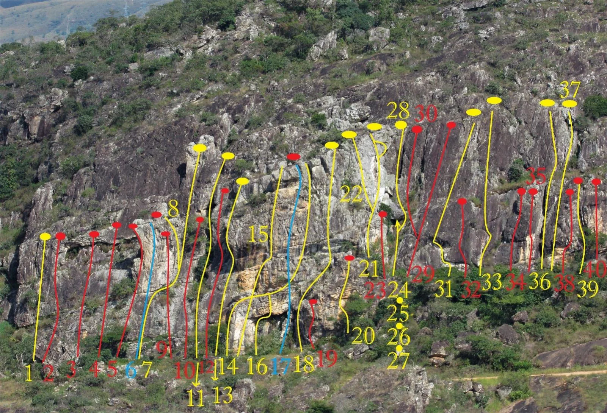
    - **largura_mapa**: 1601
    - **altura_mapa**: 1091
    - **referencias**:
      - **[0]**:
        - **escalada**: Fissura Santíssima Trindade
        - **ids**:
          - 1
      - **[1]**:
        - **escalada**: Boca Murcha
        - **ids**:
          - 2
      - **[2]**:
        - **escalada**: Sorte de Principiante
        - **ids**:
          - 3
      - **[3]**:
        - **escalada**: Pescador de Ilusões
        - **ids**:
          - 4
      - **[4]**:
        - **escalada**: Malvado Favorito
        - **ids**:
          - 5
      - **[5]**:
        - **escalada**: A Primeira e Gente Nunca Esquece
        - **ids**:
          - 6
      - **[6]**:
        - **escalada**: Fissura dos Dois Dedos
        - **ids**:
          - 7
      - **[7]**:
        - **escalada**: O Retorno
        - **ids**:
          - 8
      - **[8]**:
        - **escalada**: Sinergia
        - **ids**:
          - 9
      - **[9]**:
        - **escalada**: Chapeleta
        - **ids**:
          - 10
      - **[10]**:
        - **escalada**: Elo Perdido
        - **ids**:
          - 11
      - **[11]**:
        - **escalada**: Investida Invertida
        - **ids**:
          - 12
      - **[12]**:
        - **escalada**: Domingão com Viagra
        - **ids**:
          - 13
      - **[13]**:
        - **escalada**: Portal do Delírio
        - **ids**:
          - 14
      - **[14]**:
        - **escalada**: Outra Dimensão
        - **ids**:
          - 15
      - **[15]**:
        - **escalada**: Variante Teto do Portal
        - **ids**:
          - 16
      - **[16]**:
        - **escalada**: Mano de Quartzito
        - **ids**:
          - 17
      - **[17]**:
        - **escalada**: Garimpeiros
        - **ids**:
          - 18
      - **[18]**:
        - **escalada**: Um Minuto de Silêncio
        - **ids**:
          - 19
      - **[19]**:
        - **escalada**: Mina de Cristal
        - **ids**:
          - 20
      - **[20]**:
        - **escalada**: Erva do Diabo
        - **ids**:
          - 21
      - **[21]**:
        - **escalada**: Olhos de Lince
        - **ids**:
          - 22
      - **[22]**:
        - **escalada**: Da Toca Pra Cima
        - **ids**:
          - 23
      - **[23]**:
        - **escalada**: Magnésio de Cheirar
        - **ids**:
          - 24
      - **[24]**:
        - **escalada**: Fissura do Desejo
        - **ids**:
          - 25
      - **[25]**:
        - **escalada**: Reconciliação (Variante)
        - **ids**:
          - 26
      - **[26]**:
        - **escalada**: Jurassic Park
        - **ids**:
          - 27
      - **[27]**:
        - **escalada**: Diedro do Professor
        - **ids**:
          - 28
      - **[28]**:
        - **escalada**: Vacinados
        - **ids**:
          - 29
      - **[29]**:
        - **escalada**: Finalmente
        - **ids**:
          - 30
      - **[30]**:
        - **escalada**: Idade da Pedra
        - **ids**:
          - 31
      - **[31]**:
        - **escalada**: Os Nômades
        - **ids**:
          - 32
      - **[32]**:
        - **escalada**: Projetistas
        - **ids**:
          - 33
      - **[33]**:
        - **escalada**: Esperança
        - **ids**:
          - 34
      - **[34]**:
        - **escalada**: Pedra Lascada
        - **ids**:
          - 35
      - **[35]**:
        - **escalada**: Chaminé Estiagem
        - **ids**:
          - 36
      - **[36]**:
        - **escalada**: Temporal
        - **ids**:
          - 37
      - **[37]**:
        - **escalada**: Golias
        - **ids**:
          - 38
      - **[38]**:
        - **escalada**: Esqueceram de Mim
        - **ids**:
          - 39
      - **[39]**:
        - **escalada**: Suco de Laranja
        - **ids**:
          - 40
    - **pontos_de_interesse**:
      - **[0]**:
        - **id**: 1
        - **label**: 1
        - **circulo**:
          - **x**: 76
          - **y**: 985
          - **raio**: 25
      - **[1]**:
        - **id**: 2
        - **label**: 2
        - **circulo**:
          - **x**: 128
          - **y**: 986
          - **raio**: 26
      - **[2]**:
        - **id**: 3
        - **label**: 3
        - **circulo**:
          - **x**: 188
          - **y**: 976
          - **raio**: 26
      - **[3]**:
        - **id**: 4
        - **label**: 4
        - **circulo**:
          - **x**: 250
          - **y**: 975
          - **raio**: 26
      - **[4]**:
        - **id**: 5
        - **label**: 5
        - **circulo**:
          - **x**: 297
          - **y**: 975
          - **raio**: 26
      - **[5]**:
        - **id**: 6
        - **label**: 6
        - **circulo**:
          - **x**: 345
          - **y**: 976
          - **raio**: 26
      - **[6]**:
        - **id**: 7
        - **label**: 7
        - **circulo**:
          - **x**: 388
          - **y**: 976
          - **raio**: 26
      - **[7]**:
        - **id**: 8
        - **label**: 8
        - **circulo**:
          - **x**: 456
          - **y**: 550
          - **raio**: 26
      - **[8]**:
        - **id**: 9
        - **label**: 9
        - **circulo**:
          - **x**: 425
          - **y**: 924
          - **raio**: 26
      - **[9]**:
        - **id**: 10
        - **label**: 10
        - **circulo**:
          - **x**: 486
          - **y**: 978
          - **raio**: 33
      - **[10]**:
        - **id**: 11
        - **label**: 11
        - **circulo**:
          - **x**: 516
          - **y**: 1050
          - **raio**: 34
      - **[11]**:
        - **id**: 12
        - **label**: 12
        - **circulo**:
          - **x**: 546
          - **y**: 970
          - **raio**: 26
      - **[12]**:
        - **id**: 13
        - **label**: 13
        - **circulo**:
          - **x**: 588
          - **y**: 1042
          - **raio**: 35
      - **[13]**:
        - **id**: 14
        - **label**: 14
        - **circulo**:
          - **x**: 601
          - **y**: 965
          - **raio**: 34
      - **[14]**:
        - **id**: 15
        - **label**: 15
        - **circulo**:
          - **x**: 682
          - **y**: 617
          - **raio**: 36
      - **[15]**:
        - **id**: 16
        - **label**: 16
        - **circulo**:
          - **x**: 678
          - **y**: 968
          - **raio**: 35
      - **[16]**:
        - **id**: 17
        - **label**: 17
        - **circulo**:
          - **x**: 743
          - **y**: 967
          - **raio**: 33
      - **[17]**:
        - **id**: 18
        - **label**: 18
        - **circulo**:
          - **x**: 802
          - **y**: 961
          - **raio**: 32
      - **[18]**:
        - **id**: 19
        - **label**: 19
        - **circulo**:
          - **x**: 862
          - **y**: 945
          - **raio**: 33
      - **[19]**:
        - **id**: 20
        - **label**: 20
        - **circulo**:
          - **x**: 957
          - **y**: 889
          - **raio**: 37
      - **[20]**:
        - **id**: 21
        - **label**: 21
        - **circulo**:
          - **x**: 974
          - **y**: 707
          - **raio**: 35
      - **[21]**:
        - **id**: 22
        - **label**: 22
        - **circulo**:
          - **x**: 927
          - **y**: 511
          - **raio**: 38
      - **[22]**:
        - **id**: 23
        - **label**: 23
        - **circulo**:
          - **x**: 989
          - **y**: 767
          - **raio**: 36
      - **[23]**:
        - **id**: 24
        - **label**: 24
        - **circulo**:
          - **x**: 1052
          - **y**: 766
          - **raio**: 36
      - **[24]**:
        - **id**: 25
        - **label**: 25
        - **circulo**:
          - **x**: 1049
          - **y**: 827
          - **raio**: 36
      - **[25]**:
        - **id**: 26
        - **label**: 26
        - **circulo**:
          - **x**: 1051
          - **y**: 891
          - **raio**: 36
      - **[26]**:
        - **id**: 27
        - **label**: 27
        - **circulo**:
          - **x**: 1051
          - **y**: 954
          - **raio**: 36
      - **[27]**:
        - **id**: 28
        - **label**: 28
        - **circulo**:
          - **x**: 1051
          - **y**: 290
          - **raio**: 36
      - **[28]**:
        - **id**: 29
        - **label**: 29
        - **circulo**:
          - **x**: 1115
          - **y**: 722
          - **raio**: 36
      - **[29]**:
        - **id**: 30
        - **label**: 30
        - **circulo**:
          - **x**: 1124
          - **y**: 299
          - **raio**: 36
      - **[30]**:
        - **id**: 31
        - **label**: 31
        - **circulo**:
          - **x**: 1171
          - **y**: 763
          - **raio**: 33
      - **[31]**:
        - **id**: 32
        - **label**: 32
        - **circulo**:
          - **x**: 1243
          - **y**: 765
          - **raio**: 34
      - **[32]**:
        - **id**: 33
        - **label**: 33
        - **circulo**:
          - **x**: 1298
          - **y**: 744
          - **raio**: 32
      - **[33]**:
        - **id**: 34
        - **label**: 34
        - **circulo**:
          - **x**: 1361
          - **y**: 744
          - **raio**: 33
      - **[34]**:
        - **id**: 35
        - **label**: 35
        - **circulo**:
          - **x**: 1414
          - **y**: 466
          - **raio**: 35
      - **[35]**:
        - **id**: 36
        - **label**: 36
        - **circulo**:
          - **x**: 1424
          - **y**: 744
          - **raio**: 35
      - **[36]**:
        - **id**: 37
        - **label**: 37
        - **circulo**:
          - **x**: 1502
          - **y**: 234
          - **raio**: 35
      - **[37]**:
        - **id**: 38
        - **label**: 38
        - **circulo**:
          - **x**: 1489
          - **y**: 746
          - **raio**: 33
      - **[38]**:
        - **id**: 39
        - **label**: 39
        - **circulo**:
          - **x**: 1550
          - **y**: 762
          - **raio**: 34
      - **[39]**:
        - **id**: 40
        - **label**: 40
        - **circulo**:
          - **x**: 1571
          - **y**: 709
          - **raio**: 35
  - **[1]**:
    - **caminho_imagem_mapa**: 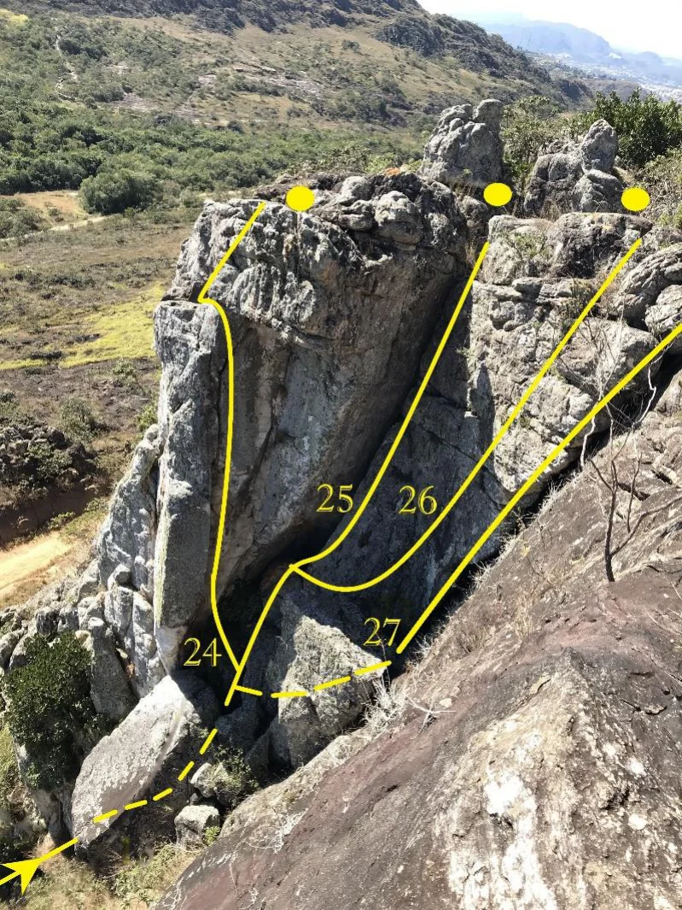
    - **largura_mapa**: 799
    - **altura_mapa**: 1065
    - **referencias**:
      - **[0]**:
        - **escalada**: Magnésio de Cheirar
        - **ids**:
          - 24
      - **[1]**:
        - **escalada**: Fissura do Desejo
        - **ids**:
          - 25
      - **[2]**:
        - **escalada**: Reconciliação (Variante)
        - **ids**:
          - 26
      - **[3]**:
        - **escalada**: Jurassic Park
        - **ids**:
          - 27
    - **pontos_de_interesse**:
      - **[0]**:
        - **id**: 24
        - **label**: 24
        - **circulo**:
          - **x**: 237
          - **y**: 762
          - **raio**: 27
      - **[1]**:
        - **id**: 25
        - **label**: 25
        - **circulo**:
          - **x**: 393
          - **y**: 582
          - **raio**: 29
      - **[2]**:
        - **id**: 26
        - **label**: 26
        - **circulo**:
          - **x**: 489
          - **y**: 585
          - **raio**: 27
      - **[3]**:
        - **id**: 27
        - **label**: 27
        - **circulo**:
          - **x**: 448
          - **y**: 741
          - **raio**: 28
- **escaladas**:
  - **[0]**:
    - **via_movel**:
      - **descricao**: Via curta e fácil por uma fissura reta e um pouco suja. Sem relatos de repetições.
      - **nome**: Fissura Santíssima Trindade
      - **dificuldade**: BR_3
      - **extensao**: 20
      - **conquistadores**:
        - Centro Excursionista Lenheiro
      - **data_abertura**: 1988
  - **[1]**:
    - **via_esportiva**:
      - **descricao**: Primeira via fixa da esquerda pra direita do setor. Via bem fácil, interessante pra uma primeira guiada.
      - **nome**: Boca Murcha
      - **dificuldade**: BR_3SUP
      - **extensao**: 10
      - **conquistadores**:
        - Michel Rodrigues
        - Douglas Marques
      - **data_abertura**: 2023-07-27
  - **[2]**:
    - **via_esportiva**:
      - **descricao**: Via começa vertical em boas agarras, passa por um fácil positivo e termina com um crux vertical mais técnico.
      - **nome**: Sorte de Principiante
      - **dificuldade**: BR_5
      - **extensao**: 12
      - **conquistadores**:
        - Michel Rodrigues
        - Douglas Marques
      - **data_abertura**: 2023-07-27
  - **[3]**:
    - **via_esportiva**:
      - **descricao**: Bem ao lado da via anterior, se parecem no estilo. Porém essa tem um crux mais negativo e de difícil leitura.
      - **nome**: Pescador de Ilusões
      - **dificuldade**: BR_6SUP
      - **extensao**: 15
      - **conquistadores**:
        - Michel Rodrigues
        - Douglas Marques
      - **data_abertura**: 2023-07-27
  - **[4]**:
    - **via_esportiva**:
      - **descricao**: Saída embaixo da copa de uma árvore. Início em positivo e crux no final em uma bonita sequência negativa.
      - **nome**: Malvado Favorito
      - **dificuldade**: BR_6
      - **extensao**: 20
      - **conquistadores**:
        - Jonatas Lima
        - Pablo Veloso
        - Carlos Pádua
      - **data_abertura**: 2021-10-12
  - **[5]**:
    - **via_movel**:
      - **descricao**: Via bem no meio do bloco rochoso vertical de cor mais clara. Possui apenas duas chapeletas em sua metade superior e parada dupla no cume. Para montagem de top-rope levar ao menos duas fitas de 1,20m.
      - **nome**: A Primeira e Gente Nunca Esquece
      - **dificuldade**: BR_5
      - **extensao**: 20
      - **quantidade_protecoes_intermediarias**: 2
      - **quantidade_protecoes_parada**: 2
      - **conquistadores**:
        - Luiz Cláudio
  - **[6]**:
    - **via_movel**:
      - **descricao**: Primeira via do setor e uma das mais belas, foi conquistada em solo. Saída ao lado da via anterior, depois segue pelo diedro e termina no topo da formação que dá nome ao setor. Um jogo de friends é o suficiente. Para descer, desescalar um lance pra direita, subir o trepa-pedras e ir até a parada fixa no final da via Portal do Delírio ou descer por caminhada.
      - **nome**: Fissura dos Dois Dedos
      - **dificuldade**: BR_4SUP
      - **extensao**: 40
      - **conquistadores**:
        - André Ilha
      - **data_abertura**: 1984-04-28
  - **[7]**:
    - **via_movel**:
      - **descricao**: Variante da via anterior. Parada fixa no topo.
      - **nome**: O Retorno
      - **dificuldade**: BR_4
      - **extensao**: 20
      - **conquistadores**:
        - Luiz Cláudio
        - Márcio Andrade
        - Leonardo Rodrigues
        - Rodrigo Araujo
        - Gelson
      - **data_abertura**: 2020
  - **[8]**:
    - **via_esportiva**:
      - **descricao**: Esta linha cruza com as anteriores e crux no final.
      - **nome**: Sinergia
      - **dificuldade**: BR_5
      - **extensao**: 20
      - **conquistadores**:
        - Luiz Cláudio
        - Márcio Andrade
      - **data_abertura**: 2021-09
  - **[9]**:
    - **via_esportiva**:
      - **nome**: Chapeleta
      - **dificuldade**: BR_4
      - **extensao**: 20
      - **conquistadores**:
        - Ronan Morais
        - Dircinei Paulo
      - **data_abertura**: 2017
  - **[10]**:
    - **via_movel**:
      - **descricao**: Via inicia em uma fenda larga e suja entre duas vias fixas. Depois entra na grande cavidade da rocha e segue por uma fissura perfeita ao fundo. Costuma ficar bastante húmida na época de chuvas. Um jogo de friends.
      - **nome**: Elo Perdido
      - **dificuldade**: BR_4
      - **extensao**: 30
      - **conquistadores**:
        - Leonardo Rodrigues
        - Márcio Andrade
  - **[11]**:
    - **via_esportiva**:
      - **nome**: Investida Invertida
      - **dificuldade**: BR_5SUP
      - **conquistadores**:
        - Luiz Cláudio
        - Márcio Andrade
        - Leonardo Rodrigues
        - Rodrigo Araujo
        - Gelson
      - **data_abertura**: 2020
  - **[12]**:
    - **via_movel**:
      - **descricao**: Diedro oposto ao da Fissura dos Dois Dedos. Depois segue por uma bonita fenda em diagonal pra direita.
      - **nome**: Domingão com Viagra
      - **dificuldade**: BR_5SUP
      - **extensao**: 30
      - **conquistadores**:
        - Leonardo Rodrigues
        - Márcio Andrade
  - **[13]**:
    - **via_movel**:
      - **descricao**: Inicia na aresta à esquerda do “Portal”, mas também é feita saindo pela fenda óbvia bem ao lado do portal devido à sua beleza e dá menos arrasto na corda, desta forma o grau deve subir pra casa do sexto grau.
      - **nome**: Portal do Delírio
      - **dificuldade**: BR_4
      - **extensao**: 30
      - **conquistadores**:
        - Antônio Paulo de Faria
        - Dalton Chiareli
        - P. C. Caliano
        - Guilherme
      - **data_abertura**: 1988-04-17
  - **[14]**:
    - **via_movel**:
      - **descricao**: Apesar de ter sido conquistada recentemente, é clássica e uma das móveis mais difíceis do setor. Pois além do crux estilo Boulder no final possui mais outros lances técnicos. Foi conquistada saindo pela bela fissura que já era usada como variante da via anterior, no platô segue reto entre blocos de pedra até atingir uma canaleta negativa que também é exigente. Levar um jogo de friends até BD #4(final da via) e um de nuts.
      - **nome**: Outra Dimensão
      - **dificuldade**: BR_7A
      - **extensao**: 25
      - **conquistadores**:
        - Pedro Naves
        - Bruno Bastos
      - **data_abertura**: 2021-10-12
  - **[15]**:
    - **via_movel**:
      - **nome**: Variante Teto do Portal
      - **dificuldade**: BR_7A
      - **conquistadores**:
        - Antônio Paulo de Faria
        - Dalton Chiareli
        - P. C. Caliano
        - Guilherme
      - **data_abertura**: 1988-08-14
  - **[16]**:
    - **via_movel**:
      - **descricao**: Inicia na aresta à direita do portal, em grampos. Sua metade superior é feita toda em móvel, cruzando com a “Portal do Delírio” no grande platô no meio da parede. Parada dupla no topo, para segurança e rapel.
      - **nome**: Mano de Quartzito
      - **dificuldade**: BR_5
      - **extensao**: 30
      - **quantidade_protecoes_parada**: 2
      - **conquistadores**:
        - Pedro Bugim
        - Vivianne Sawczuk
      - **data_abertura**: 2015-04-26
  - **[17]**:
    - **via_movel**:
      - **descricao**: Outra conquista recente bem interessante. Início em uma fenda escura, segue por um sistema de canaletas passando bem ao lado direito de uma árvore, até chegar no grande platô onde encontra-se o crux: uma proteção antes de entrar no lance ajuda a dar confiança no movimento dinâmico para alcançar um bico, no qual bloca-se para proteger com um Camalot #4 e terminar a virada do negativo. Mais acima passa por uma fenda branca e segue por uma fissura perfeita até o cume. Levar um jogo de friends até BD#4 e um de nuts.
      - **nome**: Garimpeiros
      - **dificuldade**: BR_6SUP
      - **extensao**: 30
      - **conquistadores**:
        - Pedro Naves
        - Guilherme Otoni
      - **data_abertura**: 2021-12-08
  - **[18]**:
    - **via_esportiva**:
      - **descricao**: Via curta, mas explosiva do início ao fim. Difícil de sacar as costuras, melhora muito com elas no lugar.
      - **nome**: Um Minuto de Silêncio
      - **dificuldade**: BR_7B
      - **extensao**: 12
      - **conquistadores**:
        - Fernando Honse
        - Mahananda Vargas
      - **data_abertura**: 2011-01-15
  - **[19]**:
    - **via_movel**:
      - **descricao**: Via curta e levemente negativa, com boas passadas de oposição. Grampo no topo para segurança e rapel.
      - **nome**: Mina de Cristal
      - **dificuldade**: BR_6
      - **extensao**: 15
      - **quantidade_protecoes_parada**: 1
      - **conquistadores**:
        - Pedro Bugim
        - Vivianne Sawczuk
      - **data_abertura**: 2015-04-26
  - **[20]**:
    - **via_movel**:
      - **descricao**: Bela via, principalmente na sua parte final. Sua base fica atrás do top da via anterior. Na conquista seu final foi feito pela aresta à direita, mas tem sido repetida tocando reto na bonita e óbvia fenda principal.
      - **nome**: Erva do Diabo
      - **dificuldade**: BR_5
      - **extensao**: 25
      - **conquistadores**:
        - Juratan Câmara
      - **data_abertura**: 2001
  - **[21]**:
    - **via_movel**:
      - **descricao**: Variante da via anterior. Compartilha a mesma saída e segue pra esquerda em uma fenda após o platô.
      - **nome**: Olhos de Lince
      - **dificuldade**: BR_5
      - **conquistadores**:
        - Luiz Cláudio
        - Leonardo Rodrigues
  - **[22]**:
    - **via_esportiva**:
      - **descricao**: Via curta com saída de Boulder na entrada da “toca”. Após o platô, mais um crux na bela pedra laranja.
      - **nome**: Da Toca Pra Cima
      - **dificuldade**: BR_7A
      - **extensao**: 12
      - **conquistadores**:
        - Guilherme Otoni
        - Pedro Naves
      - **data_abertura**: 2021-08-22
  - **[23]**:
    - **via_movel**:
      - **descricao**: Variante da via seguinte, não pode ser vista da base pois passa pela parte de trás da fenda da Erva do Diabo, ficando escondida nas costas da rocha onde possui uma fissura de mão perfeita.
      - **nome**: Magnésio de Cheirar
      - **dificuldade**: BR_7A
      - **conquistadores**:
        - Everton Alves
        - Fernando Honse
      - **data_abertura**: 2006
  - **[24]**:
    - **via_movel**:
      - **descricao**: Saída por uma calha, passa por baixo de um grande bloco de pedra e sobe por um diedro fendado ao fundo. Seu final não pode ser visto da base.
      - **nome**: Fissura do Desejo
      - **dificuldade**: BR_3SUP
      - **extensao**: 30
      - **conquistadores**:
        - André Ilha
        - Lúcia Duarte
      - **data_abertura**: 1984-07-23
  - **[25]**:
    - **via_movel**:
      - **descricao**: Variante que segue em agarras entre duas fendas.
      - **nome**: Reconciliação (Variante)
      - **dificuldade**: BR_3
      - **conquistadores**:
        - Jonatas Lima
        - Márcio Andrade
  - **[26]**:
    - **via_movel**:
      - **descricao**: Bonita fissura formada do desplacamento entre duas rochas formando uma fenda larga que protege com peças grandes (até o camalot #5 já dá, mas o #6 ajuda a proteger melhor) daí o nome da via. Depois a fenda vai afinando no final.
      - **nome**: Jurassic Park
      - **dificuldade**: BR_5
      - **extensao**: 30
      - **conquistadores**:
        - Pedro Naves
        - Márcio Andrade
        - Hebert Souza
        - Halle
      - **data_abertura**: 2024-05-11
  - **[27]**:
    - **via_movel**:
      - **descricao**: Sai na mesma canaleta das vias anteriores, mas ao final dela contorna-se o grande bloco pela direita.
      - **nome**: Diedro do Professor
      - **dificuldade**: BR_4
      - **extensao**: 25
      - **conquistadores**:
        - Márcio Andrade
        - Hebert Souza
      - **data_abertura**: 2024-04-28
  - **[28]**:
    - **via_esportiva**:
      - **descricao**: Via positiva e bem protegida. Boa para treinar lances de equilíbrio e pra quem está começando a guiar.
      - **nome**: Vacinados
      - **dificuldade**: BR_4
      - **extensao**: 25
      - **conquistadores**:
        - Márcio Andrade
        - Carlos Pádua
        - Luiz Cláudio
      - **data_abertura**: 2021-07-17
  - **[29]**:
    - **via_esportiva**:
      - **descricao**: Variante da via anterior, compartilham as primeiras chapas e depois sai pra esquerda passando pelo bloco.
      - **nome**: Finalmente
      - **dificuldade**: BR_4
      - **extensao**: 25
      - **conquistadores**:
        - Pedro Naves
        - Márcio Andrade
      - **data_abertura**: 2024-08-15
  - **[30]**:
    - **via_movel**:
      - **descricao**: Seu crux fica na bela fenda inicial, com proteções em friends grandes e stoppers. Continua em agarras e finaliza em uma fácil e bonita fissura em diagonal pra direita ao lado de uma mais larga e suja.
      - **nome**: Idade da Pedra
      - **dificuldade**: BR_5SUP
      - **extensao**: 25
      - **conquistadores**:
        - André Ilha
        - Lúcia Duarte
        - José Ronaldo "Pelé"
      - **data_abertura**: 1990-02-27
  - **[31]**:
    - **via_esportiva**:
      - **descricao**: Via bem variada, com início explosivo e depois passa por lances delicados. 3 chapas e mais parada dupla.
      - **nome**: Os Nômades
      - **dificuldade**: BR_7C
      - **extensao**: 15
      - **quantidade_protecoes_intermediarias**: 3
      - **quantidade_protecoes_parada**: 2
      - **conquistadores**:
        - Pablo Veloso
        - Carlos Pádua
        - Jonatas Lima
      - **data_abertura**: 2021-09
  - **[32]**:
    - **via_movel**:
      - **descricao**: Crux no início com proteções não muito boas. Começa em uma fenda e depois passa pra outra à direita.
      - **nome**: Projetistas
      - **dificuldade**: BR_6
      - **extensao**: 25
      - **conquistadores**:
        - Pedro Naves
        - Guilherme Otoni
      - **data_abertura**: 2021-09-12
  - **[33]**:
    - **via_esportiva**:
      - **descricao**: Via com saída em abaulados e após um rampado fácil segue mais vertical até parada dupla.
      - **nome**: Esperança
      - **dificuldade**: BR_5
      - **extensao**: 12
      - **quantidade_protecoes_parada**: 2
      - **conquistadores**:
        - Pedro Naves
        - Gabriel Defelippe (Ripa)
        - Mariana Fiche
      - **data_abertura**: 2021-08-21
  - **[34]**:
    - **via_esportiva**:
      - **descricao**: Via interessante com uma saída delicada e crux bem técnico na virada. São 3 chapeletas e mais parada dupla.
      - **nome**: Pedra Lascada
      - **dificuldade**: BR_6SUP
      - **extensao**: 12
      - **quantidade_protecoes_intermediarias**: 3
      - **quantidade_protecoes_parada**: 2
      - **conquistadores**:
        - Carlos Pádua
        - Pablo Veloso
      - **data_abertura**: 2021-08-21
  - **[35]**:
    - **via_movel**:
      - **descricao**: Começa em uma chaminé média/estreita, bem limpa, evoluindo para lances em agarras.
      - **nome**: Chaminé Estiagem
      - **dificuldade**: BR_2
      - **extensao**: 25
      - **conquistadores**:
        - André Ilha
        - Lúcia Duarte
        - José Ronaldo "Pelé"
      - **data_abertura**: 1990-02-27
  - **[36]**:
    - **via_movel**:
      - **descricao**: Início em agarras, chegando em um bom platô. A segunda metade segue uma fenda fácil.
      - **nome**: Temporal
      - **dificuldade**: BR_5
      - **extensao**: 20
      - **conquistadores**:
        - André Ilha
        - Lúcia Duarte
        - José Ronaldo "Pelé"
      - **data_abertura**: 1990-02-27
  - **[37]**:
    - **via_esportiva**:
      - **descricao**: Via com crux bem concentrado em seu início com move explosivo. Depois segue tranquila até parada dupla.
      - **nome**: Golias
      - **dificuldade**: BR_7A
      - **extensao**: 12
      - **quantidade_protecoes_parada**: 2
      - **conquistadores**:
        - Michel Rodrigues
        - Gabriel Tollentino
      - **data_abertura**: 2021-12-12
  - **[38]**:
    - **via_movel**:
      - **descricao**: Bonita fissura, possui apenas um grampo no final. Mas é possível rapelar da parada dupla da via ao lado.
      - **nome**: Esqueceram de Mim
      - **dificuldade**: BR_5
      - **extensao**: 25
      - **quantidade_protecoes_parada**: 1
      - **conquistadores**:
        - Márcio Andrade
        - Jonatas Lima
      - **data_abertura**: 2004
  - **[39]**:
    - **via_esportiva**:
      - **descricao**: Via técnica que engana por parecer mais fácil do que é. Movimentos interessantes do início ao fim.
      - **nome**: Suco de Laranja
      - **dificuldade**: BR_5
      - **extensao**: 10
      - **conquistadores**:
        - Pablo Veloso
        - Carlos Pádua
      - **data_abertura**: 2021-08-21
- **precomputados**:
  - **total_escaladas**: 40
  - **total_esportivas**: 16

## Parte: setor_toca_do_coelho

### Setor (Pico: Serra do Lenheiro)

- **descricao**:
    # Toca do Coelho
    
    Este setor fica escondido na parte alta à direita do Bloco dos Dois Dedos. A trilha de 5min inicia 100m após os Dois Dedos, à esquerda ao lado de um corte d’água que cruza a estrada.
    
    Setor agradável, graus variados e base boa. Sugere-se chegar cedo pois pega sol forte à tarde.
- **nome**: Toca do Coelho
- **mapas**:
  - **[0]**:
    - **caminho_imagem_mapa**: 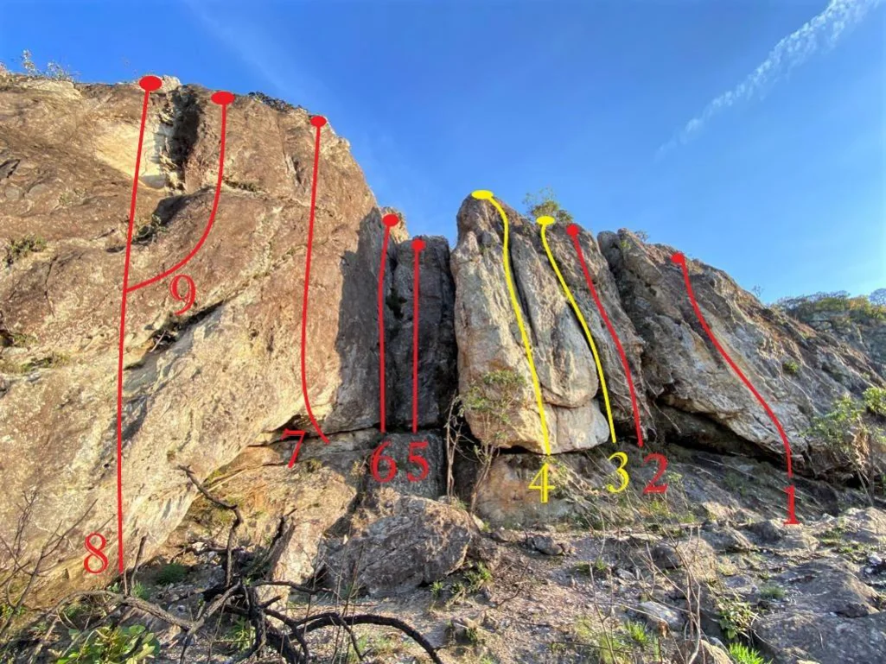
    - **largura_mapa**: 1025
    - **altura_mapa**: 769
    - **pontos_de_interesse**:
      - **[0]**:
        - **id**: 1
        - **label**: 1
        - **circulo**:
          - **x**: 915
          - **y**: 584
          - **raio**: 25
      - **[1]**:
        - **id**: 2
        - **label**: 2
        - **circulo**:
          - **x**: 759
          - **y**: 548
          - **raio**: 27
      - **[2]**:
        - **id**: 3
        - **label**: 3
        - **circulo**:
          - **x**: 715
          - **y**: 547
          - **raio**: 25
      - **[3]**:
        - **id**: 4
        - **label**: 4
        - **circulo**:
          - **x**: 628
          - **y**: 559
          - **raio**: 27
      - **[4]**:
        - **id**: 5
        - **label**: 5
        - **circulo**:
          - **x**: 486
          - **y**: 533
          - **raio**: 27
      - **[5]**:
        - **id**: 6
        - **label**: 6
        - **circulo**:
          - **x**: 444
          - **y**: 534
          - **raio**: 27
      - **[6]**:
        - **id**: 7
        - **label**: 7
        - **circulo**:
          - **x**: 341
          - **y**: 518
          - **raio**: 31
      - **[7]**:
        - **id**: 8
        - **label**: 8
        - **circulo**:
          - **x**: 111
          - **y**: 640
          - **raio**: 29
      - **[8]**:
        - **id**: 9
        - **label**: 9
        - **circulo**:
          - **x**: 213
          - **y**: 340
          - **raio**: 28
    - **referencias**:
      - **[0]**:
        - **escalada**: Mágico de Oz
        - **ids**:
          - 1
      - **[1]**:
        - **escalada**: Espantalho
        - **ids**:
          - 2
      - **[2]**:
        - **escalada**: Pindorama
        - **ids**:
          - 3
      - **[3]**:
        - **escalada**: Tupã
        - **ids**:
          - 4
      - **[4]**:
        - **escalada**: Leão Covarde
        - **ids**:
          - 5
      - **[5]**:
        - **escalada**: Chapeleiro Maluco
        - **ids**:
          - 6
      - **[6]**:
        - **escalada**: Rainha de Copas
        - **ids**:
          - 7
      - **[7]**:
        - **escalada**: A Brisa da Lagarta
        - **ids**:
          - 8
      - **[8]**:
        - **escalada**: Tanto Faz
        - **ids**:
          - 9
- **escaladas**:
  - **[0]**:
    - **via_esportiva**:
      - **descricao**: Bela via num belo sistema de chorreiras, formando um estilo diferente do padrão local. 4 chapas e top duplo.
      - **nome**: Mágico de Oz
      - **dificuldade**: BR_7B
      - **extensao**: 15
      - **quantidade_protecoes_intermediarias**: 4
      - **quantidade_protecoes_parada**: 2
      - **tipo_ancoragem**: Top duplo
      - **conquistadores**:
        - Pablo Veloso
        - Carlos Pádua
      - **data_abertura**: 2021-09-16
  - **[1]**:
    - **via_esportiva**:
      - **descricao**: Via de pinças e agarras escorridas
      - **nome**: Espantalho
      - **dificuldade**: BR_7A
      - **extensao**: 12
      - **conquistadores**:
        - Carlos Pádua
        - Pablo Veloso
      - **data_abertura**: 2021-09-25
  - **[2]**:
    - **via_movel**:
      - **descricao**: Via levemente negativa com crux na saída, passa por lances de chaminé. Friends diversos. Top numa árvore.
      - **nome**: Pindorama
      - **dificuldade**: BR_6SUP
      - **extensao**: 15
      - **protecoes_moveis**: Friends diversos
      - **tipo_ancoragem**: Top numa árvore
      - **conquistadores**:
        - André Ilha
        - Lúcia Duarte
      - **data_abertura**: 1990-09-09
  - **[3]**:
    - **via_movel**:
      - **descricao**: Bela fissura com colocações perfeitas. Um jogo de friends até BD#4. Parada móvel no cume e saída por trilha.
      - **nome**: Tupã
      - **dificuldade**: BR_6
      - **extensao**: 15
      - **protecoes_moveis**: Um jogo de friends até BD#4
      - **tipo_ancoragem**: Parada móvel no cume
      - **conquistadores**:
        - André Ilha
        - Lúcia Duarte
      - **data_abertura**: 1990-02-27
  - **[4]**:
    - **via_esportiva**:
      - **nome**: Leão Covarde
      - **dificuldade**: BR_6
      - **extensao**: 12
      - **conquistadores**:
        - Carlos Pádua
        - Pablo Veloso
      - **data_abertura**: 2021-10-23
  - **[5]**:
    - **via_esportiva**:
      - **nome**: Chapeleiro Maluco
      - **dificuldade**: BR_5
      - **extensao**: 17
      - **conquistadores**:
        - Pablo Veloso
        - Carlos Pádua
      - **data_abertura**: 2021-09-18
  - **[6]**:
    - **via_esportiva**:
      - **descricao**: Via técnica com uma saída no estilo boulder e segue por agarras escorridas e movimentação complexa.
      - **nome**: Rainha de Copas
      - **dificuldade**: BR_8A
      - **extensao**: 17
      - **conquistadores**:
        - Pablo Veloso
        - Carlos Pádua
      - **data_abertura**: 2022
  - **[7]**:
    - **via_esportiva**:
      - **nome**: A Brisa da Lagarta
      - **dificuldade**: BR_6
      - **extensao**: 15
      - **conquistadores**:
        - Carlos Pádua
        - Pablo Veloso
      - **data_abertura**: 2022
  - **[8]**:
    - **via_esportiva**:
      - **descricao**: Variante da via anterior.
      - **nome**: Tanto Faz
      - **dificuldade**: BR_6
      - **extensao**: 15
      - **conquistadores**:
        - Carlos Pádua
        - Pablo Veloso
      - **data_abertura**: 2022
- **precomputados**:
  - **total_escaladas**: 9
  - **total_esportivas**: 7

## Parte: setor_teatro_de_operacoes

### Setor (Pico: Serra do Lenheiro)

- **descricao**:
    # Setor Teatro de Operações
    
    Este setor conta com diversas vias esportivas, abertas com a intenção de serem aproveitadas em sua maioria nos cursos militares aplicados pelo 11ºBiMth. É possível encontrar vias com diversas características e graduações. Os melhores horários para escalar as vias são no início da manhã, até ás 10:00 e no fim da tarde a partir das 16:00. Além disso, o setor conta com um salão onde é possível obter sombra em boa parte do dia, além de ser um ótimo abrigo.
    
    ## Acesso
    
    O setor fica situado na direção oeste, em uma das partes mais altas do complexo rochoso à esquerda da estrada de quem sobe a serra. O acesso é por uma trilha de uns 10 minutos, que inicia-se após o setor dos Dois Dedos, mesmo acesso do setor Toca do Coelho. Ao chegar próximo da Toca do Coelho, continuar pra direita por aproximadamente duzentos metros onde já será possível avistar o setor à esquerda da trilha conforme o mapa. Seguir os totens.
    
    Este setor conta com diversas vias esportivas, abertas com a intenção de serem aproveitadas em sua maioria nos cursos militares aplicados pelo 11ºBiMth. É possível encontrar vias com diversas características e graduações. Os melhores horários para escalar as vias são no início da manhã, até ás 10:00 e no fim da tarde a partir das 16:00. Além disso, o setor conta com um salão onde é possível obter sombra em boa parte do dia, além de ser um ótimo abrigo.
    
    O setor fica situado na direção oeste, em uma das partes mais altas do complexo rochoso à esquerda da estrada de quem sobe a serra. O acesso é por uma trilha de uns 10 minutos, que inicia-se após o setor dos Dois Dedos, mesmo acesso do setor Toca do Coelho. Ao chegar próximo da Toca do Coelho, continuar pra direita por aproximadamente duzentos metros onde já será possível avistar o setor à esquerda da trilha conforme o mapa. Seguir os totens.
- **nome**: Setor Teatro de Operações
- **mapas**:
  - **[0]**:
    - **caminho_imagem_mapa**: 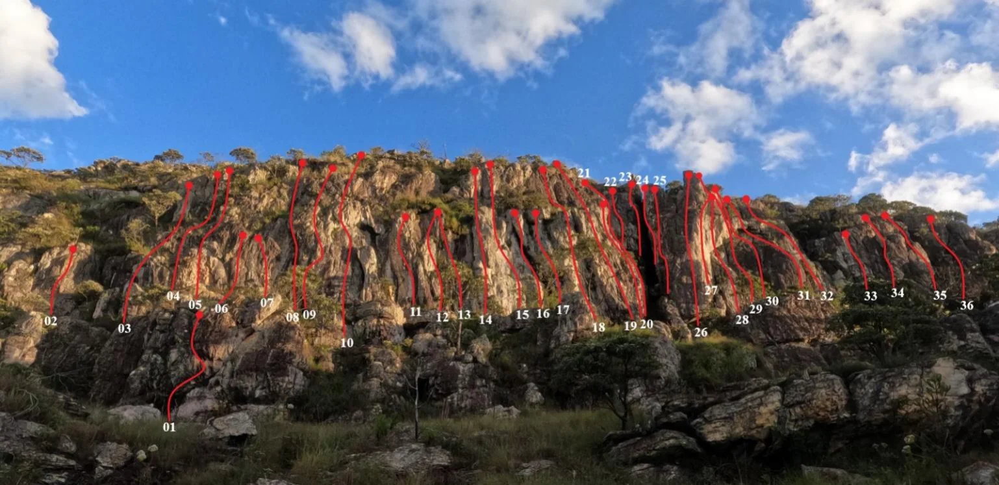
    - **largura_mapa**: 1538
    - **altura_mapa**: 747
    - **referencias**:
      - **[0]**:
        - **escalada**: Portão das Armas
        - **ids**:
          - 1
      - **[1]**:
        - **escalada**: Flanco Esquerdo
        - **ids**:
          - 2
      - **[2]**:
        - **escalada**: Campo Minado
        - **ids**:
          - 3
      - **[3]**:
        - **escalada**: Grau de Sigilo
        - **ids**:
          - 4
      - **[4]**:
        - **escalada**: Ponto Crítico
        - **ids**:
          - 5
      - **[5]**:
        - **escalada**: Carro de Combate
        - **ids**:
          - 6
      - **[6]**:
        - **escalada**: Cortina de Fumaça
        - **ids**:
          - 7
      - **[7]**:
        - **escalada**: Dano Colateral
        - **ids**:
          - 8
      - **[8]**:
        - **escalada**: Demonstração de Força
        - **ids**:
          - 9
      - **[9]**:
        - **escalada**: Ação de Choque
        - **ids**:
          - 10
      - **[10]**:
        - **escalada**: Esclarecedores
        - **ids**:
          - 11
      - **[11]**:
        - **escalada**: Navio de Guerra
        - **ids**:
          - 12
      - **[12]**:
        - **escalada**: Assalto Anfíbio
        - **ids**:
          - 13
      - **[13]**:
        - **escalada**: Operações Psicológicas
        - **ids**:
          - 14
      - **[14]**:
        - **escalada**: Ato de Serviço
        - **ids**:
          - 15
      - **[15]**:
        - **escalada**: Conflito Armado
        - **ids**:
          - 16
      - **[16]**:
        - **escalada**: Forças Especiais
        - **ids**:
          - 17
      - **[17]**:
        - **escalada**: Faixa de Infiltração
        - **ids**:
          - 18
      - **[18]**:
        - **escalada**: Atirador de Elite
        - **ids**:
          - 19
      - **[19]**:
        - **escalada**: Sentinela da Hora
        - **ids**:
          - 20
      - **[20]**:
        - **escalada**: Operação Continuada
        - **ids**:
          - 21
      - **[21]**:
        - **escalada**: Observador Avançado
        - **ids**:
          - 22
      - **[22]**:
        - **escalada**: Técnicas Especiais
        - **ids**:
          - 23
      - **[23]**:
        - **escalada**: Prisioneiro de Guerra
        - **ids**:
          - 24
      - **[24]**:
        - **escalada**: Estudo de Situação
        - **ids**:
          - 25
      - **[25]**:
        - **escalada**: Torre de Controle
        - **ids**:
          - 26
      - **[26]**:
        - **escalada**: Garantia da Lei e da Ordem
        - **ids**:
          - 27
      - **[27]**:
        - **escalada**: Estímulo Estressor
        - **ids**:
          - 28
      - **[28]**:
        - **escalada**: Controle de Distúrbio
        - **ids**:
          - 29
      - **[29]**:
        - **escalada**: Interrogatório
        - **ids**:
          - 30
      - **[30]**:
        - **escalada**: Cabeça de Ponte
        - **ids**:
          - 31
      - **[31]**:
        - **escalada**: Meios de Fortuna
        - **ids**:
          - 32
      - **[32]**:
        - **escalada**: Zona de Conforto
        - **ids**:
          - 33
      - **[33]**:
        - **escalada**: Zona de Controle
        - **ids**:
          - 34
      - **[34]**:
        - **escalada**: Zona de Perigo
        - **ids**:
          - 35
      - **[35]**:
        - **escalada**: Flanco Direito
        - **ids**:
          - 36
    - **pontos_de_interesse**:
      - **[0]**:
        - **id**: 1
        - **label**: 01
        - **circulo**:
          - **x**: 260
          - **y**: 657
          - **raio**: 13
      - **[1]**:
        - **id**: 2
        - **label**: 02
        - **circulo**:
          - **x**: 78
          - **y**: 494
          - **raio**: 13
      - **[2]**:
        - **id**: 3
        - **label**: 03
        - **circulo**:
          - **x**: 191
          - **y**: 505
          - **raio**: 13
      - **[3]**:
        - **id**: 4
        - **label**: 04
        - **circulo**:
          - **x**: 266
          - **y**: 455
          - **raio**: 13
      - **[4]**:
        - **id**: 5
        - **label**: 05
        - **circulo**:
          - **x**: 300
          - **y**: 468
          - **raio**: 13
      - **[5]**:
        - **id**: 6
        - **label**: 06
        - **circulo**:
          - **x**: 338
          - **y**: 474
          - **raio**: 14
      - **[6]**:
        - **id**: 7
        - **label**: 07
        - **circulo**:
          - **x**: 411
          - **y**: 466
          - **raio**: 13
      - **[7]**:
        - **id**: 8
        - **label**: 08
        - **circulo**:
          - **x**: 450
          - **y**: 488
          - **raio**: 13
      - **[8]**:
        - **id**: 9
        - **label**: 09
        - **circulo**:
          - **x**: 476
          - **y**: 484
          - **raio**: 13
      - **[9]**:
        - **id**: 10
        - **label**: 10
        - **circulo**:
          - **x**: 534
          - **y**: 528
          - **raio**: 13
      - **[10]**:
        - **id**: 11
        - **label**: 11
        - **circulo**:
          - **x**: 639
          - **y**: 480
          - **raio**: 13
      - **[11]**:
        - **id**: 12
        - **label**: 12
        - **circulo**:
          - **x**: 682
          - **y**: 488
          - **raio**: 13
      - **[12]**:
        - **id**: 13
        - **label**: 13
        - **circulo**:
          - **x**: 715
          - **y**: 484
          - **raio**: 13
      - **[13]**:
        - **id**: 14
        - **label**: 14
        - **circulo**:
          - **x**: 748
          - **y**: 492
          - **raio**: 13
      - **[14]**:
        - **id**: 15
        - **label**: 15
        - **circulo**:
          - **x**: 804
          - **y**: 484
          - **raio**: 13
      - **[15]**:
        - **id**: 16
        - **label**: 16
        - **circulo**:
          - **x**: 836
          - **y**: 482
          - **raio**: 13
      - **[16]**:
        - **id**: 17
        - **label**: 17
        - **circulo**:
          - **x**: 867
          - **y**: 476
          - **raio**: 13
      - **[17]**:
        - **id**: 18
        - **label**: 18
        - **circulo**:
          - **x**: 922
          - **y**: 504
          - **raio**: 13
      - **[18]**:
        - **id**: 19
        - **label**: 19
        - **circulo**:
          - **x**: 971
          - **y**: 502
          - **raio**: 13
      - **[19]**:
        - **id**: 20
        - **label**: 20
        - **circulo**:
          - **x**: 996
          - **y**: 499
          - **raio**: 13
      - **[20]**:
        - **id**: 21
        - **label**: 21
        - **circulo**:
          - **x**: 897
          - **y**: 267
          - **raio**: 13
      - **[21]**:
        - **id**: 22
        - **label**: 22
        - **circulo**:
          - **x**: 940
          - **y**: 279
          - **raio**: 13
      - **[22]**:
        - **id**: 23
        - **label**: 23
        - **circulo**:
          - **x**: 964
          - **y**: 272
          - **raio**: 14
      - **[23]**:
        - **id**: 24
        - **label**: 24
        - **circulo**:
          - **x**: 989
          - **y**: 277
          - **raio**: 14
      - **[24]**:
        - **id**: 25
        - **label**: 25
        - **circulo**:
          - **x**: 1015
          - **y**: 278
          - **raio**: 14
      - **[25]**:
        - **id**: 26
        - **label**: 26
        - **circulo**:
          - **x**: 1079
          - **y**: 511
          - **raio**: 13
      - **[26]**:
        - **id**: 27
        - **label**: 27
        - **circulo**:
          - **x**: 1094
          - **y**: 446
          - **raio**: 13
      - **[27]**:
        - **id**: 28
        - **label**: 28
        - **circulo**:
          - **x**: 1142
          - **y**: 492
          - **raio**: 13
      - **[28]**:
        - **id**: 29
        - **label**: 29
        - **circulo**:
          - **x**: 1164
          - **y**: 476
          - **raio**: 14
      - **[29]**:
        - **id**: 30
        - **label**: 30
        - **circulo**:
          - **x**: 1190
          - **y**: 463
          - **raio**: 13
      - **[30]**:
        - **id**: 31
        - **label**: 31
        - **circulo**:
          - **x**: 1236
          - **y**: 454
          - **raio**: 13
      - **[31]**:
        - **id**: 32
        - **label**: 32
        - **circulo**:
          - **x**: 1272
          - **y**: 456
          - **raio**: 13
      - **[32]**:
        - **id**: 33
        - **label**: 33
        - **circulo**:
          - **x**: 1339
          - **y**: 455
          - **raio**: 13
      - **[33]**:
        - **id**: 34
        - **label**: 34
        - **circulo**:
          - **x**: 1382
          - **y**: 450
          - **raio**: 13
      - **[34]**:
        - **id**: 35
        - **label**: 35
        - **circulo**:
          - **x**: 1447
          - **y**: 454
          - **raio**: 13
      - **[35]**:
        - **id**: 36
        - **label**: 36
        - **circulo**:
          - **x**: 1488
          - **y**: 470
          - **raio**: 13
- **escaladas**:
  - **[0]**:
    - **via_esportiva**:
      - **descricao**: Primeira via em um bloco curto e isolado na chegada do setor que pode ser realizada em tope rope.
      - **nome**: Portão das Armas
      - **dificuldade**: BR_4SUP
      - **conquistadores**:
        - Michel Rodrigues
        - Douglas Vaz
      - **data_abertura**: 2024
  - **[1]**:
    - **via_esportiva**:
      - **descricao**: Via curta localizada à extrema esquerda do bloco rochoso. Possui duas chapeletas e uma parada dupla.
      - **nome**: Flanco Esquerdo
      - **dificuldade**: BR_4
      - **quantidade_protecoes_intermediarias**: 2
      - **quantidade_protecoes_parada**: 2
      - **tipo_ancoragem**: Parada dupla
      - **conquistadores**:
        - Michel Rodrigues
        - Douglas Vaz
      - **data_abertura**: 2024
  - **[2]**:
    - **via_esportiva**:
      - **descricao**: Via com alguns platôs no decorrer da escalada.
      - **nome**: Campo Minado
      - **dificuldade**: BR_4
      - **conquistadores**:
        - Michel Rodrigues
        - Douglas Vaz
      - **data_abertura**: 2024
  - **[3]**:
    - **via_esportiva**:
      - **descricao**: Via com um maior grau de exposição após a terceira chapeleta.
      - **nome**: Grau de Sigilo
      - **dificuldade**: BR_4SUP
      - **conquistadores**:
        - Michel Rodrigues
        - Douglas Vaz
      - **data_abertura**: 2024
  - **[4]**:
    - **via_esportiva**:
      - **descricao**: Via em uma faixa amarela com boas agarras no início.
      - **nome**: Ponto Crítico
      - **dificuldade**: BR_4SUP
      - **conquistadores**:
        - Michel Rodrigues
        - Douglas Vaz
      - **data_abertura**: 2024
  - **[5]**:
    - **via_esportiva**:
      - **descricao**: Via curta situada em uma faixa escura que compartilha a parada com a via cortina de fumaça.
      - **nome**: Carro de Combate
      - **dificuldade**: BR_5
      - **conquistadores**:
        - Michel Rodrigues
        - Douglas Vaz
      - **data_abertura**: 2024
  - **[6]**:
    - **via_esportiva**:
      - **descricao**: Via curta com saída em boas agarras que compartilha a parada com a via carro de combate.
      - **nome**: Cortina de Fumaça
      - **dificuldade**: BR_7A_BARRA_7B
      - **conquistadores**:
        - Michel Rodrigues
        - Douglas Vaz
      - **data_abertura**: 2024
  - **[7]**:
    - **via_esportiva**:
      - **descricao**: Via que percorre toda a canaleta, com agarras médias e passando por alguns abaulados e platôs.
      - **nome**: Dano Colateral
      - **dificuldade**: BR_7A
      - **conquistadores**:
        - Michel Rodrigues
        - Douglas Vaz
      - **data_abertura**: 2024
  - **[8]**:
    - **via_esportiva**:
      - **descricao**: Via situada em uma faixa amarela com boas agarras na saída ao lado de uma canaleta.
      - **nome**: Demonstração de Força
      - **dificuldade**: BR_7A
      - **conquistadores**:
        - Michel Rodrigues
        - Douglas Vaz
      - **data_abertura**: 2024
  - **[9]**:
    - **via_esportiva**:
      - **descricao**: Via com um crux bem definido.
      - **nome**: Ação de Choque
      - **dificuldade**: BR_6
      - **conquistadores**:
        - Michel Rodrigues
        - Douglas Vaz
      - **data_abertura**: 2024
  - **[10]**:
    - **via_esportiva**:
      - **descricao**: Via curta com apenas duas chapeletas e com uma leve inclinação negativa.
      - **nome**: Esclarecedores
      - **dificuldade**: BR_5SUP
      - **quantidade_protecoes_intermediarias**: 2
      - **conquistadores**:
        - Michel Rodrigues
        - Douglas Vaz
      - **data_abertura**: 2024
  - **[11]**:
    - **via_esportiva**:
      - **descricao**: Via com saída técnica, seguindo para um pequeno platô onde encontra-se a parada.
      - **nome**: Navio de Guerra
      - **dificuldade**: BR_5SUP
      - **conquistadores**:
        - Michel Rodrigues
        - Douglas Vaz
      - **data_abertura**: 2024
  - **[12]**:
    - **via_esportiva**:
      - **descricao**: Via com saída em uma faixa escura e com possível umidade em época de chuva.
      - **nome**: Assalto Anfíbio
      - **dificuldade**: BR_5
      - **conquistadores**:
        - Michel Rodrigues
        - Douglas Vaz
      - **data_abertura**: 2024
  - **[13]**:
    - **via_esportiva**:
      - **descricao**: Via com saída ao lado uma fenda vertical até a parada, próximo a via Ato de Serviço. Abelhas à esquerda.
      - **nome**: Operações Psicológicas
      - **dificuldade**: BR_6SUP
      - **conquistadores**:
        - Michel Rodrigues
        - Douglas Vaz
      - **data_abertura**: 2024
  - **[14]**:
    - **via_esportiva**:
      - **descricao**: Possível via clássica do setor, que passa por uma bancada e percorre a linha em boas agarras.
      - **nome**: Ato de Serviço
      - **dificuldade**: BR_5SUP
      - **conquistadores**:
        - Michel Rodrigues
        - Douglas Vaz
      - **data_abertura**: 2024
  - **[15]**:
    - **via_esportiva**:
      - **descricao**: Via com uma saída em agarras pequenas que percorre a lateral de uma canaleta.
      - **nome**: Conflito Armado
      - **dificuldade**: BR_6SUP
      - **conquistadores**:
        - Michel Rodrigues
        - Douglas Vaz
      - **data_abertura**: 2024
  - **[16]**:
    - **via_esportiva**:
      - **descricao**: Via com saída debaixo de um arco ao lado de uma canaleta.
      - **nome**: Forças Especiais
      - **dificuldade**: BR_8A
      - **conquistadores**:
        - Michel Rodrigues
        - Douglas Vaz
      - **data_abertura**: 2024
  - **[17]**:
    - **via_esportiva**:
      - **descricao**: Via em uma faixa com algumas agarras duvidosas.
      - **nome**: Faixa de Infiltração
      - **dificuldade**: BR_6
      - **conquistadores**:
        - Michel Rodrigues
        - Douglas Vaz
      - **data_abertura**: 2024
  - **[18]**:
    - **via_esportiva**:
      - **descricao**: Via em uma leve diagonal para a esquerda na saída e um platô próximo ao cume.
      - **nome**: Atirador de Elite
      - **dificuldade**: BR_5
      - **conquistadores**:
        - Michel Rodrigues
        - Douglas Vaz
      - **data_abertura**: 2024
  - **[19]**:
    - **via_esportiva**:
      - **descricao**: Via com a saída em agarras grandes próximo à entrada do salão.
      - **nome**: Sentinela da Hora
      - **dificuldade**: BR_4SUP
      - **conquistadores**:
        - Michel Rodrigues
        - Douglas Vaz
      - **data_abertura**: 2024
  - **[20]**:
    - **via_esportiva**:
      - **descricao**: Entrando no salão, a via encontra-se à esquerda, uma escalada fácil com um crux bem definido no final.
      - **nome**: Operação Continuada
      - **dificuldade**: BR_5
      - **conquistadores**:
        - Michel Rodrigues
        - Douglas Vaz
      - **data_abertura**: 2024
  - **[21]**:
    - **via_esportiva**:
      - **descricao**: Via com uma saída vertical, passa ao lado de um teto e com boas agarras no decorrer da via.
      - **nome**: Observador Avançado
      - **dificuldade**: BR_5SUP
      - **conquistadores**:
        - Michel Rodrigues
        - Douglas Vaz
      - **data_abertura**: 2024
  - **[22]**:
    - **via_esportiva**:
      - **descricao**: Via mais ao fundo do salão, com uma saída forte e movimentos complexos até o cume.
      - **nome**: Técnicas Especiais
      - **dificuldade**: BR_7B
      - **conquistadores**:
        - Michel Rodrigues
        - Douglas Vaz
      - **data_abertura**: 2024
  - **[23]**:
    - **via_esportiva**:
      - **descricao**: Atenção ao escalar esta via devido à quedas próximas à parede atrás do escalador.
      - **nome**: Prisioneiro de Guerra
      - **dificuldade**: BR_7B
      - **conquistadores**:
        - Michel Rodrigues
        - Douglas Vaz
      - **data_abertura**: 2024
  - **[24]**:
    - **via_esportiva**:
      - **descricao**: Via que exige uma boa leitura do escalador para vencer o crux.
      - **nome**: Estudo de Situação
      - **dificuldade**: BR_7B
      - **conquistadores**:
        - Michel Rodrigues
        - Douglas Vaz
      - **data_abertura**: 2024
  - **[25]**:
    - **via_esportiva**:
      - **descricao**: Via mais clássica do setor que oferece belos registros fotográficos. Aconselha-se sair com a 1ª costurada.
      - **nome**: Torre de Controle
      - **dificuldade**: BR_7A
      - **conquistadores**:
        - Michel Rodrigues
        - Douglas Vaz
      - **data_abertura**: 2024
  - **[26]**:
    - **via_esportiva**:
      - **descricao**: A escalada acompanha um arco natural da rocha passando por lances técnicos no decorrer da via.
      - **nome**: Garantia da Lei e da Ordem
      - **dificuldade**: BR_6SUP
      - **conquistadores**:
        - Michel Rodrigues
        - Douglas Vaz
      - **data_abertura**: 2024
  - **[27]**:
    - **via_esportiva**:
      - **descricao**: Via imponente com início técnico. Após o vertical amarelo vem a parada compartilhada com a via anterior.
      - **nome**: Estímulo Estressor
      - **dificuldade**: BR_7B
  - **[28]**:
    - **via_esportiva**:
      - **descricao**: Via fácil com bons descansos, estilo tradicional com um certo grau de exposição na parte final.
      - **nome**: Controle de Distúrbio
      - **dificuldade**: BR_5SUP
      - **conquistadores**:
        - Michel Rodrigues
        - Douglas Vaz
      - **data_abertura**: 2024
  - **[29]**:
    - **via_esportiva**:
      - **descricao**: Escalada fácil no início e exigente no final. Aconselha-se sair com a primeira proteção costurada.
      - **nome**: Interrogatório
      - **dificuldade**: BR_7C
      - **conquistadores**:
        - Michel Rodrigues
        - Douglas Vaz
      - **data_abertura**: 2024
  - **[30]**:
    - **via_esportiva**:
      - **descricao**: Via peculiar do setor, saída técnica e depois no positivo passa por uma formação semelhante à uma ponte.
      - **nome**: Cabeça de Ponte
      - **dificuldade**: BR_5SUP
      - **conquistadores**:
        - Michel Rodrigues
        - Douglas Vaz
      - **data_abertura**: 2024
  - **[31]**:
    - **via_esportiva**:
      - **descricao**: Via mais fácil do setor. Passa por diversos platôs até o cume.
      - **nome**: Meios de Fortuna
      - **dificuldade**: BR_3SUP
      - **conquistadores**:
        - Michel Rodrigues
        - Douglas Vaz
      - **data_abertura**: 2024
  - **[32]**:
    - **via_esportiva**:
      - **descricao**: Via curta e fácil de ser escalada.
      - **nome**: Zona de Conforto
      - **dificuldade**: BR_4SUP
      - **conquistadores**:
        - Michel Rodrigues
        - Douglas Vaz
      - **data_abertura**: 2024
  - **[33]**:
    - **via_esportiva**:
      - **descricao**: Escalada em agarras boas no decorrer da via.
      - **nome**: Zona de Controle
      - **dificuldade**: BR_5SUP
      - **conquistadores**:
        - Michel Rodrigues
        - Douglas Vaz
      - **data_abertura**: 2024
  - **[34]**:
    - **via_esportiva**:
      - **descricao**: Via curta com uma exigência maior a anterior. Atenção ao costurar a segunda chapeleta devido à exposição.
      - **nome**: Zona de Perigo
      - **dificuldade**: BR_6
      - **conquistadores**:
        - Michel Rodrigues
        - Douglas Vaz
      - **data_abertura**: 2024
  - **[35]**:
    - **via_esportiva**:
      - **descricao**: Via curta e fácil, tendo uma inclinação mais positiva em sua parte final.
      - **nome**: Flanco Direito
      - **dificuldade**: BR_4SUP
      - **conquistadores**:
        - Michel Rodrigues
        - Douglas Vaz
      - **data_abertura**: 2024
- **precomputados**:
  - **total_escaladas**: 36
  - **total_esportivas**: 36

## Parte: setor_grutinha

### Setor (Pico: Serra do Lenheiro)

- **descricao**:
    # Grutinha
    
    Pequeno setor em uma gruta do lado direito da estrada de quem sobe, logo após um mata-burro. Conta com apenas três vias, sendo duas fixas em seu interior e uma móvel do lado de fora na parte de trás. Seu entorno também conta com vários boulders de ótima qualidade.
- **nome**: Grutinha
- **mapas**:
  - **[0]**:
    - **caminho_imagem_mapa**: 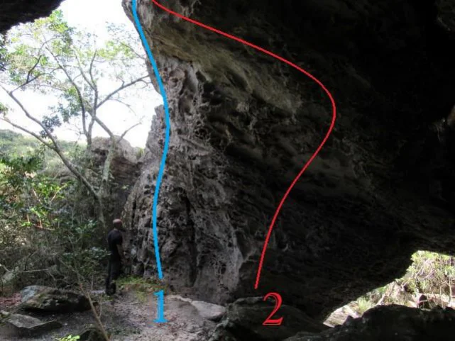
    - **largura_mapa**: 641
    - **altura_mapa**: 481
    - **pontos_de_interesse**:
      - **[0]**:
        - **id**: 1
        - **label**: 1
        - **circulo**:
          - **x**: 226
          - **y**: 432
          - **raio**: 26
      - **[1]**:
        - **id**: 2
        - **label**: 2
        - **circulo**:
          - **x**: 384
          - **y**: 435
          - **raio**: 26
    - **referencias**:
      - **[0]**:
        - **escalada**: Via do Tetinho
        - **ids**:
          - 1
      - **[1]**:
        - **escalada**: Imagina Eu
        - **ids**:
          - 2
  - **[1]**:
    - **caminho_imagem_mapa**: 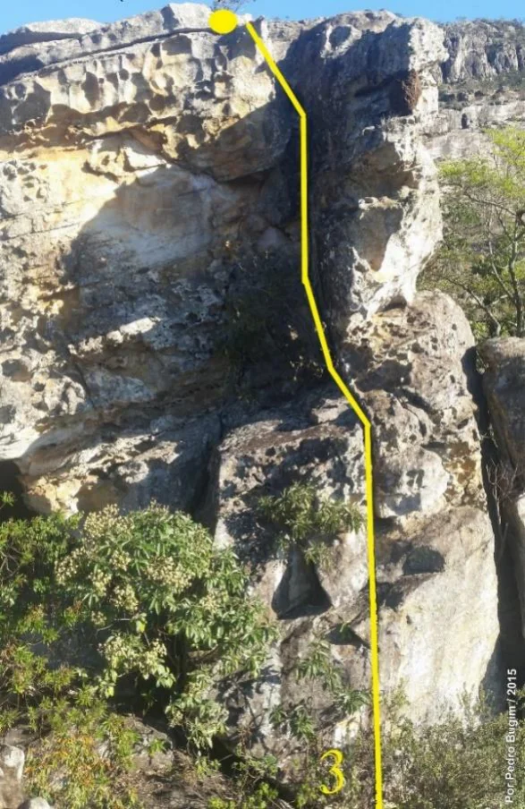
    - **largura_mapa**: 587
    - **altura_mapa**: 904
    - **pontos_de_interesse**:
      - **[0]**:
        - **id**: 3
        - **label**: 3
        - **circulo**:
          - **x**: 371
          - **y**: 862
          - **raio**: 31
    - **referencias**:
      - **[0]**:
        - **escalada**: Diedro Oculto
        - **ids**:
          - 3
- **escaladas**:
  - **[0]**:
    - **via_movel**:
      - **descricao**: Via localizada na coluna de entrada da gruta. Móvel só na saída.
      - **nome**: Via do Tetinho
      - **dificuldade**: BR_7A
      - **extensao**: 15
      - **protecoes_moveis**: Móvel só na saída
      - **conquistadores**:
        - Centro Excursionista Lenheiro
  - **[1]**:
    - **via_esportiva**:
      - **descricao**: Também entra no time das primeiras vias esportivas do lenheiro. Curta e explosiva, com passadas pelo teto, torna essa via uma clássica, encontra-se em um local muito agradável e exótico. Opção para dias de chuva.
      - **nome**: Imagina Eu
      - **dificuldade**: BR_7C
      - **extensao**: 15
  - **[2]**:
    - **via_movel**:
      - **descricao**: Via curta e de baixa graduação, sendo indicada para aqueles que estejam começando a escalar em móvel.
      - **nome**: Diedro Oculto
      - **dificuldade**: BR_3
      - **extensao**: 15
      - **conquistadores**:
        - Pedro Bugim
        - Liane Leobons
      - **data_abertura**: 2008
- **precomputados**:
  - **total_escaladas**: 3
  - **total_esportivas**: 1

## Parte: setor_falesias_do_lenheiro

### Setor (Pico: Serra do Lenheiro)

- **descricao**:
    # Falésias do Lenheiro
    
    Este não é exatamente um setor, é na verdade o corpo rochoso que vai desde o Bloco dos Dois Dedos até os Três Pontões e contém várias vias espalhadas em pequenos setores ou isoladas. Aqui estão também setores de treinamentos militares denominados Paredão 1, 2, 2½, 3 e 4 (este último encontra-se na parte de trás da montanha) e podem ser visualizados no mapa no início deste guia. As rotas de treinamento estão pintadas na rocha com numeração de 1 a 10 e são em geral móveis ou top-rope/rapel de baixa graduação e podem ser usadas por quem se interessar.
    
    | 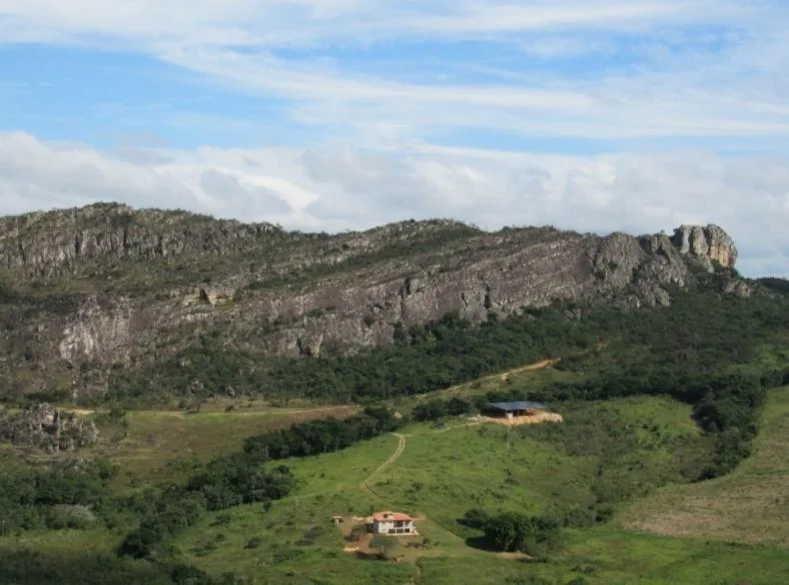 |
    | :--: |
    | *Vista geral das Falésias do Lenheiro* |
    
    ## Paredão 2,5
    
    Bloco que faz parte das Falésias do Lenheiro.
    
    ## Bloco Oculto
    
    Belo bloco que fica bem escondido na parte alta da falésia e com acesso um pouco complicado, visualizar no mapa no início deste guia. Pode-se acessar pelo Cemonta, percorrendo o Paredão 1 para a esquerda até o final e depois subindo um trepa pedras ou através do Paredão 2, subindo a falésia em diagonal pra direita.
- **nome**: Falésias do Lenheiro
- **mapas**:
  - **[0]**:
    - **caminho_imagem_mapa**: 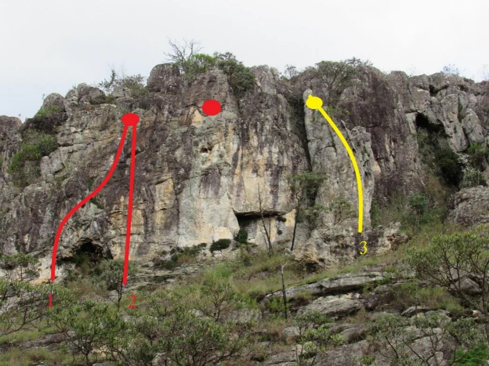
    - **largura_mapa**: 1043
    - **altura_mapa**: 782
    - **pontos_de_interesse**:
      - **[0]**:
        - **id**: 1
        - **label**: 1
        - **circulo**:
          - **x**: 108
          - **y**: 641
          - **raio**: 19
      - **[1]**:
        - **id**: 2
        - **label**: 2
        - **circulo**:
          - **x**: 282
          - **y**: 644
          - **raio**: 19
      - **[2]**:
        - **id**: 3
        - **label**: 3
        - **circulo**:
          - **x**: 775
          - **y**: 529
          - **raio**: 19
    - **referencias**:
      - **[0]**:
        - **escalada**: Esqueleto do Tempo
        - **ids**:
          - 1
      - **[1]**:
        - **escalada**: Parou Mofô
        - **ids**:
          - 2
      - **[2]**:
        - **escalada**: Via Normal da Agulhinha Pequeno Polegar
        - **ids**:
          - 3
  - **[1]**:
    - **caminho_imagem_mapa**: 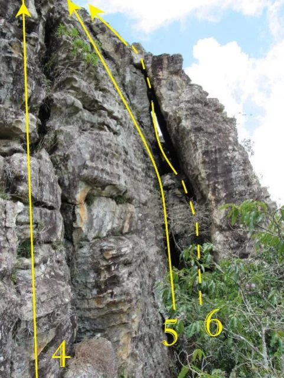
    - **largura_mapa**: 481
    - **altura_mapa**: 641
    - **pontos_de_interesse**:
      - **[0]**:
        - **id**: 4
        - **label**: 4
        - **circulo**:
          - **x**: 103
          - **y**: 599
          - **raio**: 27
      - **[1]**:
        - **id**: 5
        - **label**: 5
        - **circulo**:
          - **x**: 289
          - **y**: 563
          - **raio**: 27
      - **[2]**:
        - **id**: 6
        - **label**: 6
        - **circulo**:
          - **x**: 363
          - **y**: 546
          - **raio**: 27
    - **referencias**:
      - **[0]**:
        - **escalada**: Miosótis
        - **ids**:
          - 4
      - **[1]**:
        - **escalada**: Chá das Cinco
        - **ids**:
          - 5
      - **[2]**:
        - **escalada**: Dança dos Vampiros
        - **ids**:
          - 6
  - **[2]**:
    - **caminho_imagem_mapa**: 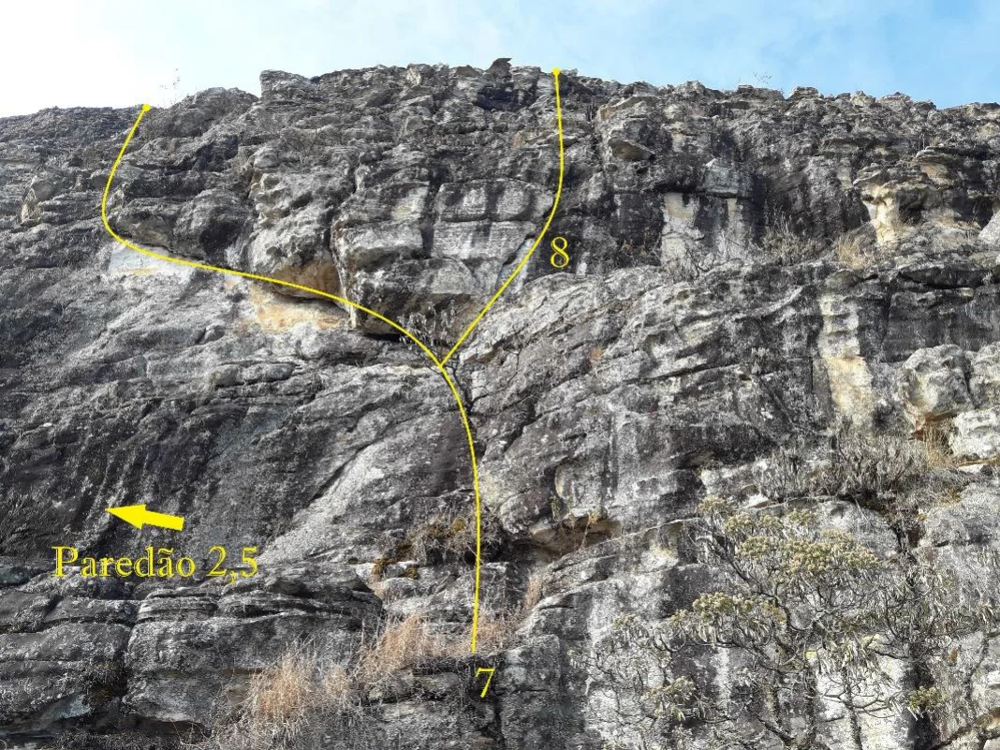
    - **largura_mapa**: 1068
    - **altura_mapa**: 801
    - **pontos_de_interesse**:
      - **[0]**:
        - **id**: 7
        - **label**: 7
        - **circulo**:
          - **x**: 518
          - **y**: 726
          - **raio**: 20
      - **[1]**:
        - **id**: 8
        - **label**: 8
        - **circulo**:
          - **x**: 594
          - **y**: 263
          - **raio**: 22
      - **[2]**:
        - **id**: paredao_2_5
        - **label**: Paredão 2,5
        - **retangulo**:
          - **x**: 166
          - **y**: 601
          - **comprimento**: 226
          - **largura**: 45
    - **referencias**:
      - **[0]**:
        - **escalada**: Deixa a Fenda Me Levar
        - **ids**:
          - 7
      - **[1]**:
        - **escalada**: Brassavola
        - **ids**:
          - 8
      - **[2]**:
        - **ids**:
          - paredao_2_5
  - **[3]**:
    - **caminho_imagem_mapa**: 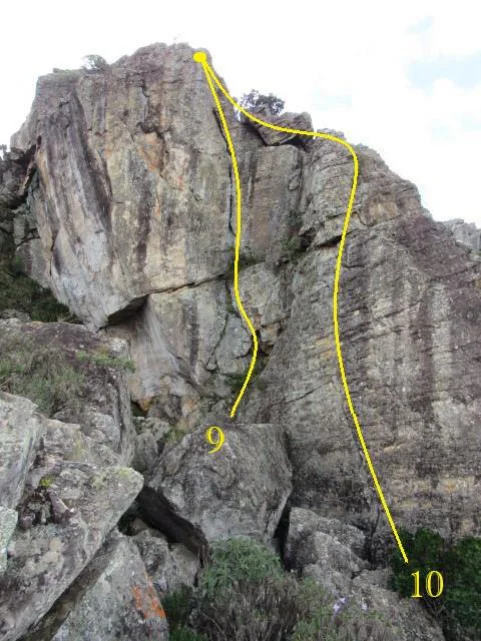
    - **largura_mapa**: 481
    - **altura_mapa**: 641
    - **pontos_de_interesse**:
      - **[0]**:
        - **id**: 9
        - **label**: 9
        - **circulo**:
          - **x**: 215
          - **y**: 439
          - **raio**: 20
      - **[1]**:
        - **id**: 10
        - **label**: 10
        - **circulo**:
          - **x**: 427
          - **y**: 585
          - **raio**: 25
    - **referencias**:
      - **[0]**:
        - **escalada**: Feliz Aniversário
        - **ids**:
          - 9
      - **[1]**:
        - **escalada**: Juízo Final
        - **ids**:
          - 10
  - **[4]**:
    - **caminho_imagem_mapa**: 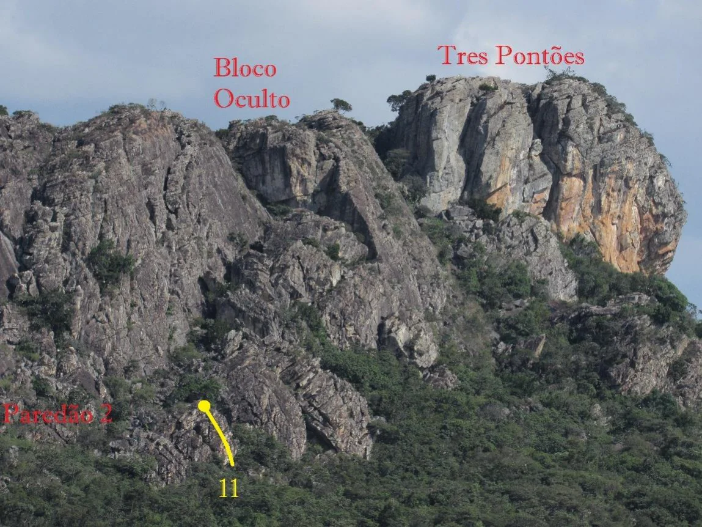
    - **largura_mapa**: 1149
    - **altura_mapa**: 862
    - **pontos_de_interesse**:
      - **[0]**:
        - **id**: 11
        - **label**: 11
        - **circulo**:
          - **x**: 374
          - **y**: 798
          - **raio**: 28
      - **[1]**:
        - **id**: tres_pontoes
        - **label**: Três Pontões
        - **retangulo**:
          - **x**: 836
          - **y**: 90
          - **comprimento**: 256
          - **largura**: 42
    - **referencias**:
      - **[0]**:
        - **escalada**: Por Favor Me Esqueça
        - **ids**:
          - 11
      - **[1]**:
        - **grupo**: Três Pontões (CEMONTA)
        - **ids**:
          - tres_pontoes
- **escaladas**:
  - **[0]**:
    - **via_esportiva**:
      - **descricao**: Saída levemente negativa e depois pega uma diagonal pra direita, são 7 chapas e mais o top.
      - **nome**: Esqueleto do Tempo
      - **dificuldade**: BR_6SUP_BARRA_7A
      - **extensao**: 15
      - **quantidade_protecoes_intermediarias**: 7
      - **quantidade_protecoes_parada**: 1
      - **conquistadores**:
        - Antônio Gilmar (Tonhão)
        - João Vagli
      - **data_abertura**: 2025-03-15
  - **[1]**:
    - **via_esportiva**:
      - **descricao**: Via reta que termina na mesma parada da via anterior, são 4 chapas e mais o top.
      - **nome**: Parou Mofô
      - **dificuldade**: BR_5SUP_BARRA_6
      - **extensao**: 15
      - **quantidade_protecoes_intermediarias**: 4
      - **quantidade_protecoes_parada**: 1
      - **conquistadores**:
        - Antônio Gilmar (Tonhão)
        - João Vagli
      - **data_abertura**: 2025-03-15
  - **[2]**:
    - **via_movel**:
      - **descricao**: Pequena via localizada ao final da falésia do Bloco dos Dois Dedos à direita. À partir da via Suco de Laranja acompanhar a rocha pra direita até o final. Saindo da estrada, subir alguns metros após os Dois Dedos e subir um rampado de pedras e mato à esquerda.
      - **nome**: Via Normal da Agulhinha Pequeno Polegar
      - **dificuldade**: BR_4
      - **extensao**: 15
      - **conquistadores**:
        - Tonico Magalhães
        - André Ilha
      - **data_abertura**: 1984-04-28
  - **[3]**:
    - **via_movel**:
      - **descricao**: Via muito fácil que sobe por agarras entre duas fendas em formato de V, localizada no Paredão 2,5 à direita das rotas de treinamento.
      - **nome**: Miosótis
      - **dificuldade**: BR_1SUP
      - **extensao**: 35
      - **conquistadores**:
        - André Ilha
        - Lúcia Duarte
      - **data_abertura**: 1984-07-23
  - **[4]**:
    - **via_movel**:
      - **descricao**: Início em chaminé pelo lado esquerdo do grande bloco que há entre as rochas. Uma vez em cima dele, segue para a óbvia fenda acima, voltada para a esquerda. Ao final da fenda segue por um trecho meio quebrado, com lances curtos e fáceis até a base do lance final de agarras, que é belíssimo e ligeiramente negativo.
      - **nome**: Chá das Cinco
      - **dificuldade**: BR_3
      - **extensao**: 35
      - **conquistadores**:
        - André Ilha
        - Kate Benedict
        - Boris Flegr
      - **data_abertura**: 2004-10-10
  - **[5]**:
    - **via_movel**:
      - **descricao**: Seu início fica atrás de um grande bloco e por isso não pode ser visto de fora. Começa em uma chaminé média até atingir um platô, passando para uma chaminé larga até sair por entre os blocos de rocha. Depois segue por agarras.
      - **nome**: Dança dos Vampiros
      - **dificuldade**: BR_2SUP
      - **extensao**: 45
      - **conquistadores**:
        - André Ilha
        - Lúcia Duarte
      - **data_abertura**: 1984-07-23
  - **[6]**:
    - **via_movel**:
      - **descricao**: Via à direita das vias anteriores e possui um bonito diedro no início.
      - **nome**: Deixa a Fenda Me Levar
      - **dificuldade**: BR_5
      - **conquistadores**:
        - Márcio Andrade
        - Rodolfo Campos
      - **data_abertura**: 2004-10-10
  - **[7]**:
    - **via_movel**:
      - **descricao**: Variante da via anterior.
      - **nome**: Brassavola
      - **dificuldade**: BR_4
  - **[8]**:
    - **via_movel**:
      - **descricao**: Linha através de um bonito sistema de fendas, levemente negativa em alguns pontos. Descida por caminhada à direita.
      - **nome**: Feliz Aniversário
      - **dificuldade**: BR_7B
      - **conquistadores**:
        - Ronaldo Franzen "Nativo"
  - **[9]**:
    - **via_movel**:
      - **descricao**: Bela fissura que percorre boa parte da via, intercalando com lances de boas agarras.
      - **nome**: Juízo Final
      - **dificuldade**: BR_4
      - **extensao**: 25
      - **conquistadores**:
        - André Ilha
        - Lúcia Duarte
      - **data_abertura**: 1984-07-27
  - **[10]**:
    - **via_movel**:
      - **descricao**: Via bem divertida. Pegar a segunda trilha descendo a estrada a partir do portão do Cemonta. Após cerca de 50m abandonar a trilha principal e pegar um corte de agua meio fechado pra direita e transpor uns blocos.
      - **nome**: Por Favor Me Esqueça
      - **dificuldade**: BR_5
      - **extensao**: 20
      - **conquistadores**:
        - Eduardo Rodrigues (Edu RC)
        - Marcello Goulart
      - **data_abertura**: 2024-08-07
- **precomputados**:
  - **total_escaladas**: 11
  - **total_esportivas**: 2

## Parte: setor_pedra_negra

### Setor (Pico: Serra do Lenheiro)

- **descricao**:
    # Pedra Negra
    
    Este setor encontra-se na frente do Cemonta, no fundo do vale, mas sua face é voltada para o lado oposto, portanto não pode ser vista de nenhum ponto até que se chegue lá. Sua formação é diferente de todas as rochas do restante da Serra do Lenheiro, é um Gnaisse, porém bem menos abrasivo que outros.
    
    ## Acesso
    
    Seu acesso se dá pela estrada que passa ao lado da antena em frente ao Cemonta (mesmo acesso da Ave Maria). Logo após a antena haverá uma porteira onde antes se parava os veículos, porém isso mudou, agora deve-se entrar nessa porteira e seguir pela principal até o final da estrada onde haverá um estacionamento. Haverá placas indicando o caminho, leva-se cerca de 10 minutos até o setor em trilha leve.
    
    ## Características
    
    O setor é bem agradável, com base boa e sombreada por árvores. Mas o melhor período pra se escalar é pela manhã, quando todas as vias estão na sombra, de tarde o sol pega de frente. Porém, tem algumas vias na sombra das árvores, portanto é possível escalar o dia todo.
    
    Sua graduação é bem diversificada com vias dos mais variados estilos, agradando a todos os tipos de escaladores. As vias em geral são bem protegidas, mas quase todas tem como característica a primeira chapeleta alta, portanto é obrigatório sair com a primeira costurada!
    
    Há clip-stick no local, favor usar, pois já houveram acidentes com quem não usou!!
    
    |  |
    | :--: |
    | *Carlos Pádua na via Seja O Que Deus Quiser* |
- **nome**: Pedra Negra
- **mapas**:
  - **[0]**:
    - **caminho_imagem_mapa**: 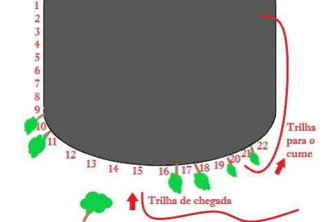
    - **largura_mapa**: 482
    - **altura_mapa**: 322
    - **pontos_de_interesse**:
      - **[0]**:
        - **id**: 1
        - **label**: 1
        - **circulo**:
          - **x**: 53
          - **y**: 8
          - **raio**: 9
      - **[1]**:
        - **id**: 2
        - **label**: 2
        - **circulo**:
          - **x**: 54
          - **y**: 26
          - **raio**: 9
      - **[2]**:
        - **id**: 3
        - **label**: 3
        - **circulo**:
          - **x**: 54
          - **y**: 45
          - **raio**: 9
      - **[3]**:
        - **id**: 4
        - **label**: 4
        - **circulo**:
          - **x**: 54
          - **y**: 64
          - **raio**: 9
      - **[4]**:
        - **id**: 5
        - **label**: 5
        - **circulo**:
          - **x**: 54
          - **y**: 82
          - **raio**: 9
      - **[5]**:
        - **id**: 6
        - **label**: 6
        - **circulo**:
          - **x**: 54
          - **y**: 102
          - **raio**: 9
      - **[6]**:
        - **id**: 7
        - **label**: 7
        - **circulo**:
          - **x**: 54
          - **y**: 121
          - **raio**: 9
      - **[7]**:
        - **id**: 8
        - **label**: 8
        - **circulo**:
          - **x**: 54
          - **y**: 140
          - **raio**: 9
      - **[8]**:
        - **id**: 9
        - **label**: 9
        - **circulo**:
          - **x**: 54
          - **y**: 159
          - **raio**: 9
      - **[9]**:
        - **id**: 10
        - **label**: 10
        - **circulo**:
          - **x**: 59
          - **y**: 183
          - **raio**: 11
      - **[10]**:
        - **id**: 11
        - **label**: 11
        - **circulo**:
          - **x**: 75
          - **y**: 205
          - **raio**: 11
      - **[11]**:
        - **id**: 12
        - **label**: 12
        - **circulo**:
          - **x**: 102
          - **y**: 224
          - **raio**: 11
      - **[12]**:
        - **id**: 13
        - **label**: 13
        - **circulo**:
          - **x**: 133
          - **y**: 237
          - **raio**: 11
      - **[13]**:
        - **id**: 14
        - **label**: 14
        - **circulo**:
          - **x**: 165
          - **y**: 245
          - **raio**: 11
      - **[14]**:
        - **id**: 15
        - **label**: 15
        - **circulo**:
          - **x**: 200
          - **y**: 247
          - **raio**: 11
      - **[15]**:
        - **id**: 16
        - **label**: 16
        - **circulo**:
          - **x**: 238
          - **y**: 248
          - **raio**: 11
      - **[16]**:
        - **id**: 17
        - **label**: 17
        - **circulo**:
          - **x**: 270
          - **y**: 246
          - **raio**: 11
      - **[17]**:
        - **id**: 18
        - **label**: 18
        - **circulo**:
          - **x**: 296
          - **y**: 245
          - **raio**: 11
      - **[18]**:
        - **id**: 19
        - **label**: 19
        - **circulo**:
          - **x**: 318
          - **y**: 239
          - **raio**: 11
      - **[19]**:
        - **id**: 20
        - **label**: 20
        - **circulo**:
          - **x**: 341
          - **y**: 230
          - **raio**: 10
      - **[20]**:
        - **id**: 21
        - **label**: 21
        - **circulo**:
          - **x**: 358
          - **y**: 222
          - **raio**: 10
      - **[21]**:
        - **id**: 22
        - **label**: 22
        - **circulo**:
          - **x**: 381
          - **y**: 211
          - **raio**: 11
    - **referencias**:
      - **[0]**:
        - **escalada**: Ripa Um
        - **ids**:
          - 1
      - **[1]**:
        - **escalada**: Ossos do Ofício
        - **ids**:
          - 2
      - **[2]**:
        - **escalada**: Lei do Retorno
        - **ids**:
          - 3
      - **[3]**:
        - **escalada**: Realidade Paralela
        - **ids**:
          - 4
      - **[4]**:
        - **escalada**: Quando a Cabeça Falha
        - **ids**:
          - 5
      - **[5]**:
        - **escalada**: Calangos Molhados
        - **ids**:
          - 6
      - **[6]**:
        - **escalada**: Calango Camuflado
        - **ids**:
          - 7
      - **[7]**:
        - **escalada**: Fio de Cabelo
        - **ids**:
          - 8
      - **[8]**:
        - **escalada**: Docinho do Tio Nem
        - **ids**:
          - 9
      - **[9]**:
        - **escalada**: Heróis da Persistência
        - **ids**:
          - 10
      - **[10]**:
        - **escalada**: Matrix
        - **ids**:
          - 11
      - **[11]**:
        - **escalada**: A Senha
        - **ids**:
          - 12
      - **[12]**:
        - **escalada**: Atividade Paranormal
        - **ids**:
          - 13
      - **[13]**:
        - **escalada**: Berbaridade
        - **ids**:
          - 14
      - **[14]**:
        - **escalada**: Lontra Radical
        - **ids**:
          - 15
      - **[15]**:
        - **escalada**: Diamante Negro
        - **ids**:
          - 16
      - **[16]**:
        - **escalada**: Proteção da Flora
        - **ids**:
          - 17
      - **[17]**:
        - **escalada**: JL Projeto
        - **ids**:
          - 18
      - **[18]**:
        - **escalada**: Seja O Que Deus Quiser
        - **ids**:
          - 19
      - **[19]**:
        - **escalada**: Viabilizoou
        - **ids**:
          - 20
      - **[20]**:
        - **escalada**: Professor Pardal
        - **ids**:
          - 21
      - **[21]**:
        - **escalada**: Pretinha
        - **ids**:
          - 22
- **escaladas**:
  - **[0]**:
    - **via_esportiva**:
      - **descricao**: Via localizada à extrema esquerda do bloco rochoso. Curta e concentrada.
      - **nome**: Ripa Um
      - **dificuldade**: BR_7B
      - **conquistadores**:
        - Pedro Naves
        - Heider Ribeiro (Tio Nem)
      - **data_abertura**: 2024
  - **[1]**:
    - **via_esportiva**:
      - **descricao**: Via explosiva e de difícil leitura, estilo boulder.
      - **nome**: Ossos do Ofício
      - **dificuldade**: BR_7B
      - **conquistadores**:
        - Webert (Beto) Resende
        - Heider Ribeiro (Tio Nem)
      - **data_abertura**: 2016
  - **[2]**:
    - **via_esportiva**:
      - **descricao**: Via ainda sem cadena até a data de publicação desta edição do guia.
      - **nome**: Lei do Retorno
      - **dificuldade**: PROJETO
      - **conquistadores**:
        - Webert (Beto) Resende
        - Heider Ribeiro (Tio Nem)
      - **data_abertura**: 2024-09-07
  - **[3]**:
    - **via_esportiva**:
      - **descricao**: Via com um crux bem concentrado em pequenos regletes duros com movimentação complexa.
      - **nome**: Realidade Paralela
      - **dificuldade**: BR_8C
      - **conquistadores**:
        - Webert (Beto) Resende
        - Heider Ribeiro (Tio Nem)
      - **data_abertura**: 2016
  - **[4]**:
    - **via_esportiva**:
      - **descricao**: Via constante levemente negativa com boas agarras. São 5 chapas mais duas no top.
      - **nome**: Quando a Cabeça Falha
      - **dificuldade**: BR_7B
      - **quantidade_protecoes_intermediarias**: 5
      - **quantidade_protecoes_parada**: 2
      - **conquistadores**:
        - Fábio Fernandes
        - Luiz Cláudio
        - Márcio Andrade
      - **data_abertura**: 2002
  - **[5]**:
    - **via_esportiva**:
      - **descricao**: Via levemente negativa, mas com boas agarras. Sugere-se colocar a segunda costura antes de entrar. 5+2.
      - **nome**: Calangos Molhados
      - **dificuldade**: BR_7B
      - **quantidade_protecoes_intermediarias**: 5
      - **quantidade_protecoes_parada**: 2
      - **conquistadores**:
        - Jonatas Lima
        - Fabricio Nascimento
        - Carlos Pádua
  - **[6]**:
    - **via_esportiva**:
      - **descricao**: Uma das mais frequentadas do local, com um crux concentrado. São 5+2 chapas.
      - **nome**: Calango Camuflado
      - **dificuldade**: BR_6
      - **quantidade_protecoes_intermediarias**: 5
      - **quantidade_protecoes_parada**: 2
      - **conquistadores**:
        - Jonatas Lima
        - Fabricio Nascimento
        - Carlos Pádua
      - **data_abertura**: 2012
  - **[7]**:
    - **via_esportiva**:
      - **descricao**: Primeira via do setor. Via técnica, exige boa leitura pra não perder a cadena. 5+2 chapas.
      - **nome**: Fio de Cabelo
      - **dificuldade**: BR_5SUP_BARRA_6
      - **quantidade_protecoes_intermediarias**: 5
      - **quantidade_protecoes_parada**: 2
      - **conquistadores**:
        - Luiz Cláudio
        - Leonardo Rodrigues
        - Márcio Andrade
      - **data_abertura**: 2000
  - **[8]**:
    - **via_esportiva**:
      - **descricao**: Via muito repetida por ser uma das mais fáceis e ao mesmo tempo longa. Boa para top-rope. 6+2 chapas.
      - **nome**: Docinho do Tio Nem
      - **dificuldade**: BR_5SUP
      - **quantidade_protecoes_intermediarias**: 6
      - **quantidade_protecoes_parada**: 2
      - **conquistadores**:
        - Jonatas Lima
  - **[9]**:
    - **via_esportiva**:
      - **descricao**: Via longa, completa e bem protegida. Também bastante frequentada por ser a única do grau no setor. 7+2.
      - **nome**: Heróis da Persistência
      - **dificuldade**: BR_6SUP
      - **quantidade_protecoes_intermediarias**: 7
      - **quantidade_protecoes_parada**: 2
      - **conquistadores**:
        - Luiz Cláudio
        - Leonardo Rodrigues
      - **data_abertura**: 2014
  - **[10]**:
    - **via_esportiva**:
      - **descricao**: Via com crux bem definido e boas agarras no geral. 5+2.
      - **nome**: Matrix
      - **dificuldade**: BR_7A
      - **quantidade_protecoes_intermediarias**: 5
      - **quantidade_protecoes_parada**: 2
      - **conquistadores**:
        - Luiz Cláudio
        - Leonardo Rodrigues
        - Rodrigo Araújo
        - Márcio Andrade
      - **data_abertura**: 2000
  - **[11]**:
    - **via_esportiva**:
      - **descricao**: Uma das vias mais clássicas do setor, possui o movimento mais impressionante!
      - **nome**: A Senha
      - **dificuldade**: BR_7B
      - **conquistadores**:
        - Luiz Cláudio
        - Leonardo Rodrigues
        - Gelson Feliciano
        - Márcio Andrade
      - **data_abertura**: 2000
  - **[12]**:
    - **via_esportiva**:
      - **descricao**: Via mais difícil do setor, possui apenas uma cadena até o momento, favor avisar os locais em caso de cadena.
      - **nome**: Atividade Paranormal
      - **dificuldade**: BR_9A_BARRA_9B
      - **conquistadores**:
        - Webert (Beto) Resende
        - Heider Ribeiro (Tio Nem)
      - **data_abertura**: 2012
  - **[13]**:
    - **via_esportiva**:
      - **descricao**: Via com um crux muito técnico e de difícil leitura. Também exige um pouco do psicológico. 6+2.
      - **nome**: Berbaridade
      - **dificuldade**: BR_7A_BARRA_7B
      - **quantidade_protecoes_intermediarias**: 6
      - **quantidade_protecoes_parada**: 2
      - **conquistadores**:
        - Jonatas Lima
        - Carlos Pádua
      - **data_abertura**: 2015
  - **[14]**:
    - **via_esportiva**:
      - **descricao**: Uma das mais clássicas e talvez a mais repetida do setor. Via técnica que exige boa leitura e resistência. 6+2.
      - **nome**: Lontra Radical
      - **dificuldade**: BR_5SUP_BARRA_6
      - **quantidade_protecoes_intermediarias**: 6
      - **quantidade_protecoes_parada**: 2
      - **conquistadores**:
        - Luiz Cláudio
        - Leonardo Rodrigues
        - Márcio Andrade
      - **data_abertura**: 2000
  - **[15]**:
    - **via_esportiva**:
      - **descricao**: Lances de pequenos regletes e algumas costuradas ruins. 6+2.
      - **nome**: Diamante Negro
      - **dificuldade**: BR_8A
      - **quantidade_protecoes_intermediarias**: 6
      - **quantidade_protecoes_parada**: 2
      - **conquistadores**:
        - Jonatas Lima
  - **[16]**:
    - **via_esportiva**:
      - **descricao**: Possui um estilo bem diferente de batentes escorridos, alternando lances de força e lances de equilíbrio. 5+2.
      - **nome**: Proteção da Flora
      - **dificuldade**: BR_7C
      - **quantidade_protecoes_intermediarias**: 5
      - **quantidade_protecoes_parada**: 2
      - **conquistadores**:
        - Pedro Naves
        - Mariana Fiche
        - Flora Fiche Naves
      - **data_abertura**: 2024-09-14
  - **[17]**:
    - **via_esportiva**:
      - **descricao**: Via sem cadena até a data de publicação desta edição do guia.
      - **nome**: JL Projeto
      - **dificuldade**: PROJETO
      - **conquistadores**:
        - Jonatas Lima
  - **[18]**:
    - **via_esportiva**:
      - **descricao**: Outra clássica, com movimentação complexa. Crux peculiar de força e resistência em agarras escorridas 5+2.
      - **nome**: Seja O Que Deus Quiser
      - **dificuldade**: BR_8B
      - **quantidade_protecoes_intermediarias**: 5
      - **quantidade_protecoes_parada**: 2
      - **conquistadores**:
        - Luiz Cláudio
        - Leonardo Rodrigues
        - Gelson Feliciano
      - **data_abertura**: 2005
  - **[19]**:
    - **via_esportiva**:
      - **descricao**: Via com movimentação variada alternando leve negativo em agarras escorridas com positivo de equilíbrio. São 3+2 chapas.
      - **nome**: Viabilizoou
      - **dificuldade**: BR_7A
      - **quantidade_protecoes_intermediarias**: 3
      - **quantidade_protecoes_parada**: 2
      - **conquistadores**:
        - Pedro Naves
        - Lucas Agostini
      - **data_abertura**: 2024-10-06
  - **[20]**:
    - **via_esportiva**:
      - **descricao**: Via que fica com sombra o dia todo.
      - **nome**: Professor Pardal
      - **dificuldade**: BR_5SUP
      - **conquistadores**:
        - Jonatas Lima
        - Carlos Pádua
      - **data_abertura**: 2015
  - **[21]**:
    - **via_esportiva**:
      - **descricao**: Via mais fácil do setor. Última via lá pra direita. Boa opção pra um primeiro contato com a escalada. São duas chapas mais parada dupla.
      - **nome**: Pretinha
      - **dificuldade**: BR_4SUP
      - **quantidade_protecoes_intermediarias**: 2
      - **quantidade_protecoes_parada**: 2
      - **tipo_ancoragem**: Parada dupla
      - **conquistadores**:
        - Jonatas Lima
        - Heider Ribeiro (Tio Nem)
      - **data_abertura**: 2014
- **precomputados**:
  - **total_escaladas**: 22
  - **total_esportivas**: 22

## Parte: setor_cruz_credo

### Setor (Pico: Serra do Lenheiro)

- **descricao**:
    # Setor Cruz Credo
    
    Setor localizado atrás do setor da Ave Maria, ainda com boas possibilidades de novas vias. Atualmente, possui cinco vias e uma variante, quase todas mistas e apenas uma fixa.
    
    Tem como característica os grandes buracos que conferem às vias, agarras impressionantes, tornando a graduação não muito elevada, apesar dos lances levemente negativos. As proteções nem sempre são óbvias, obrigando o escalador e “garimpar” fendas e buracos. Importante ficar atento à agarras quebrando, por se tratar de um setor relativamente novo. Todas as vias possuem grampo no topo, para segurança, top-rope e rapel.
    
    ## Acesso
    
    Para acessar o setor do Cruz Credo, deve-se passar pela trilha que segue adiante do setor da Ave Maria, pela esquerda. Deste ponto já será possível avistar as paredes do Cruz Credo. Antes da trilha tornar a subir, deve-se seguir um pequeno rio (em geral, seco), para a direita, para chegar ao setor frontal. Deste rio, pegar para a esquerda, para chegar ao setor oculto.
    
    ## Sub-setores e Paredes
    
    ### Setor Principal
    
    Paredão frontal onde estão localizadas as vias:
    1. **Quinto dos Infernos** (5º – 20m - Fixa)
    2. **Deus me Livre** (IV – 15m - Mista)
    3. **Cruz Credo** (V – 25m - Mista)
    
    ### Setor Oculto do Cruz Credo
    
    Setor localizado à esquerda seguindo o pequeno leito de rio seco:
    4. **Jesus Humilha o Satanás** (V – 20m - Mista)
    5. **Praga Divina** (V – 15m - Mista)
    6. **Variante Pedra na Cruz** (III – 8m - Móvel)
    
    |  |
    | :--: |
    | *Pedro Bugim conquistando a via Cruz Credo* |
    
    Setor localizado atrás do setor da Ave Maria, ainda com boas possibilidades de novas vias. Atualmente, possui cinco vias e uma variante, quase todas mistas e apenas uma fixa.
    
    Tem como característica os grandes buracos que conferem às vias, agarras impressionantes, tornando a graduação não muito elevada, apesar dos lances levemente negativos. As proteções nem sempre são óbvias, obrigando o escalador e “garimpar” fendas e buracos. Importante ficar atento à agarras quebrando, por se tratar de um setor relativamente novo. Todas as vias possuem grampo no topo, para segurança, top-rope e rapel.
- **nome**: Cruz Credo
- **mapas**:
  - **[0]**:
    - **caminho_imagem_mapa**: 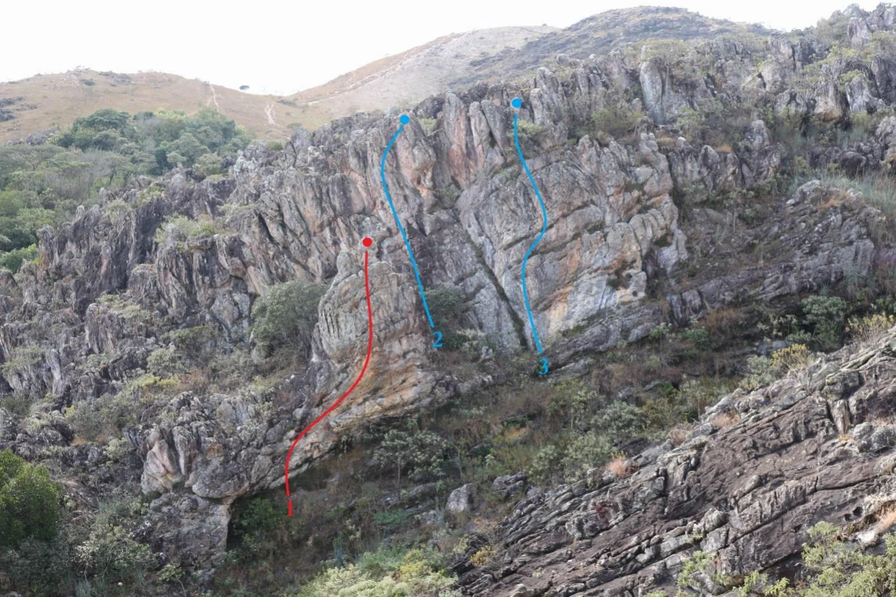
    - **largura_mapa**: 1351
    - **altura_mapa**: 901
    - **pontos_de_interesse**:
      - **[0]**:
        - **id**: 1
        - **label**: 1
        - **circulo**:
          - **x**: 437
          - **y**: 768
          - **raio**: 17
      - **[1]**:
        - **id**: 2
        - **label**: 2
        - **circulo**:
          - **x**: 659
          - **y**: 512
          - **raio**: 19
      - **[2]**:
        - **id**: 3
        - **label**: 3
        - **circulo**:
          - **x**: 819
          - **y**: 553
          - **raio**: 18
    - **referencias**:
      - **[0]**:
        - **escalada**: Quinto dos Infernos
        - **ids**:
          - 1
      - **[1]**:
        - **escalada**: Deus me Livre
        - **ids**:
          - 2
      - **[2]**:
        - **escalada**: Cruz Credo
        - **ids**:
          - 3
  - **[1]**:
    - **caminho_imagem_mapa**: 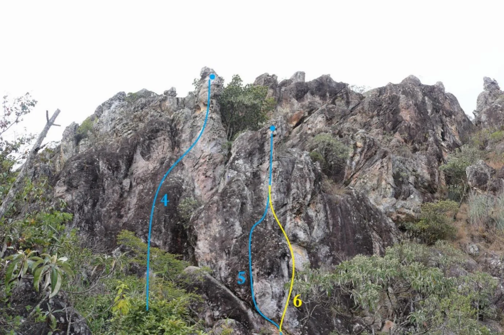
    - **largura_mapa**: 1376
    - **altura_mapa**: 917
    - **pontos_de_interesse**:
      - **[0]**:
        - **id**: 4
        - **label**: 4
        - **circulo**:
          - **x**: 450
          - **y**: 547
          - **raio**: 23
      - **[1]**:
        - **id**: 5
        - **label**: 5
        - **circulo**:
          - **x**: 659
          - **y**: 760
          - **raio**: 23
      - **[2]**:
        - **id**: 6
        - **label**: 6
        - **circulo**:
          - **x**: 812
          - **y**: 822
          - **raio**: 23
    - **referencias**:
      - **[0]**:
        - **escalada**: Jesus Humilha o Satanás
        - **ids**:
          - 4
      - **[1]**:
        - **escalada**: Praga Divina
        - **ids**:
          - 5
      - **[2]**:
        - **escalada**: Variante Pedra na Cruz
        - **ids**:
          - 6
- **escaladas**:
  - **[0]**:
    - **via_esportiva**:
      - **descricao**: Única via completamente em proteções fixas do setor (grampos de 1/2 polegada). Seu crux encontra-se logo na saída, em um negativo com bons regletes, até alcançar um platô à direita. Deste ponto em diante, enormes buracos servem de agarras, na parede levemente negativa.
      - **nome**: Quinto dos Infernos
      - **dificuldade**: BR_5
      - **extensao**: 20
      - **quantidade_protecoes_parada**: 1
      - **conquistadores**:
        - Pedro Bugim
        - Vivianne Sawczuk
      - **data_abertura**: 2015-04-25
  - **[1]**:
    - **via_movel**:
      - **descricao**: Via curta, que conta com um grampo logo na saída – e crux da via – feita em lance de agarras. Logo após, encontra boas fendas para proteção móvel com friends médios e grandes até o grampo de topo.
      - **nome**: Deus me Livre
      - **dificuldade**: BR_4
      - **extensao**: 15
      - **quantidade_protecoes_intermediarias**: 1
      - **quantidade_protecoes_parada**: 1
      - **protecoes_moveis**: Friends médios e grandes
      - **conquistadores**:
        - Pedro Bugim
        - Vivianne Sawczuk
      - **data_abertura**: 2015-03-22
  - **[2]**:
    - **via_movel**:
      - **descricao**: Bonita via que possui um grampo em sua saída, colocado após a conquista, devido à via ter ficado bem exposta sem o mesmo. Após este grampo inicial, a via segue em móvel até o topo, com algumas boas fendas e buracos para proteção com friends médios, embora não muito óbvios. Grampo no topo.
      - **nome**: Cruz Credo
      - **dificuldade**: BR_5
      - **extensao**: 25
      - **quantidade_protecoes_intermediarias**: 1
      - **quantidade_protecoes_parada**: 1
      - **protecoes_moveis**: Friends médios
      - **conquistadores**:
        - Pedro Bugim
        - Vivianne Sawczuk
      - **data_abertura**: 2015-03-22
  - **[3]**:
    - **via_movel**:
      - **descricao**: Inicia em uma belíssima sequência de fendas feitas em oposição, com ótima proteção em friends pequenos e médios. Evolui para pequenas agarras, em lances protegidos por dois grampos. Em seu final, nova sequência de fendas esporádicas, em lances mais fáceis até o grampo do topo.
      - **nome**: Jesus Humilha o Satanás
      - **dificuldade**: BR_5
      - **extensao**: 20
      - **quantidade_protecoes_intermediarias**: 2
      - **quantidade_protecoes_parada**: 1
      - **protecoes_moveis**: Friends pequenos e médios
      - **conquistadores**:
        - Pedro Bugim
        - Vivianne Sawczuk
      - **data_abertura**: 2015-05-24
  - **[4]**:
    - **via_movel**:
      - **descricao**: Inicia em um lance levemente negativo, com boas agarras e segue para a esquerda, passando por uma barriga com uma fenda fina, bem protegida por friends pequenos (crux da via). Evolui para agarras e possui um grampo intermediando o lance que leva ao topo do bloco. Grampo de topo para segurança / rapel.
      - **nome**: Praga Divina
      - **dificuldade**: BR_5
      - **extensao**: 15
      - **quantidade_protecoes_intermediarias**: 1
      - **quantidade_protecoes_parada**: 1
      - **protecoes_moveis**: Friends pequenos
      - **conquistadores**:
        - Pedro Bugim
        - Vivianne Sawczuk
      - **data_abertura**: 2015-05-24
  - **[5]**:
    - **via_movel**:
      - **descricao**: Pequena variante que evita o crux da via “Praga Divina”, seguindo por uma boa canaleta à direita da via principal, com boas proteções de friends médios e grandes.
      - **nome**: Variante Pedra na Cruz
      - **dificuldade**: BR_3
      - **extensao**: 8
      - **quantidade_protecoes_parada**: 1
      - **protecoes_moveis**: Friends médios e grandes
      - **conquistadores**:
        - Pedro Bugim
        - Vivianne Sawczuk
      - **data_abertura**: 2015-05-24
- **precomputados**:
  - **total_escaladas**: 6
  - **total_esportivas**: 1

## Parte: setor_rapadura

### Setor (Pico: Serra do Lenheiro)

- **descricao**:
    # Rapadura
    
    Pequeno bloco localizado próximo à Ave Maria e possui apenas vias móveis.
    
    Para acessar basta seguir as mesmas indicações de acesso ao Setor Ave Maria citado acima, a única diferença é que ao invés de virar à direita após o muro de pedra, deve-se seguir mais cerca de 200m pela trilha principal e sair para à esquerda. Como é um setor pouco frequentado, a trilha pode estar bem apagada.
- **nome**: Rapadura
- **mapas**:
  - **[0]**:
    - **caminho_imagem_mapa**: 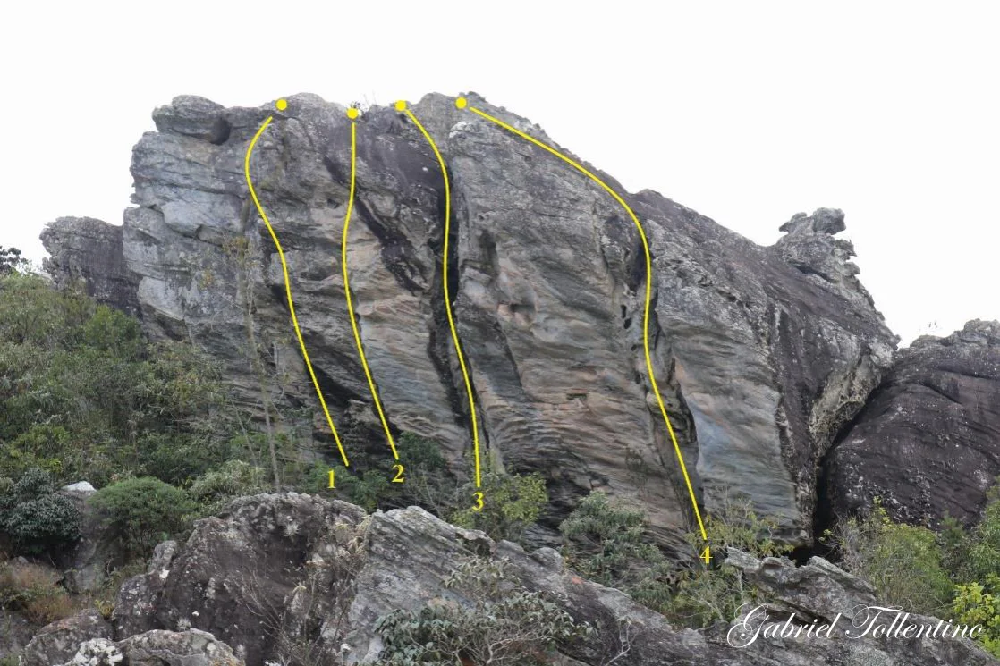
    - **largura_mapa**: 1118
    - **altura_mapa**: 745
    - **pontos_de_interesse**:
      - **[0]**:
        - **id**: 1
        - **label**: 1
        - **circulo**:
          - **x**: 370
          - **y**: 535
          - **raio**: 16
      - **[1]**:
        - **id**: 2
        - **label**: 2
        - **circulo**:
          - **x**: 445
          - **y**: 530
          - **raio**: 16
      - **[2]**:
        - **id**: 3
        - **label**: 3
        - **circulo**:
          - **x**: 535
          - **y**: 560
          - **raio**: 16
      - **[3]**:
        - **id**: 4
        - **label**: 4
        - **circulo**:
          - **x**: 790
          - **y**: 620
          - **raio**: 16
    - **referencias**:
      - **[0]**:
        - **escalada**: Os Hereges
        - **ids**:
          - 1
      - **[1]**:
        - **escalada**: Doce de Leite
        - **ids**:
          - 2
      - **[2]**:
        - **escalada**: Ainda Bem Que o André Não Viu
        - **ids**:
          - 3
      - **[3]**:
        - **escalada**: O Doce da Rapadura
        - **ids**:
          - 4
- **escaladas**:
  - **[0]**:
    - **via_movel**:
      - **nome**: Os Hereges
      - **dificuldade**: BR_7A
      - **conquistadores**:
        - Leonardo Rodrigues
        - Luiz Cláudio
  - **[1]**:
    - **via_movel**:
      - **nome**: Doce de Leite
      - **dificuldade**: PROJETO
      - **conquistadores**:
        - Leonardo Rodrigues
        - Luiz Cláudio
  - **[2]**:
    - **via_movel**:
      - **nome**: Ainda Bem Que o André Não Viu
      - **dificuldade**: BR_4SUP
      - **conquistadores**:
        - Leonardo Rodrigues
        - Luiz Cláudio
  - **[3]**:
    - **via_movel**:
      - **nome**: O Doce da Rapadura
      - **dificuldade**: BR_4
      - **conquistadores**:
        - Leonardo Rodrigues
        - Luiz Cláudio
- **precomputados**:
  - **total_escaladas**: 4

## Parte: setor_pedra_do_livro

### Setor (Pico: Serra do Lenheiro)

- **descricao**:
    # Pedra do Livro
    
    Pequeno setor localizado no lado oposto do vale de quem sobe a estrada para o Cemonta, próximo à Pedra da Boina, porém mais na parte baixa da serra, perto do chalé. Para acessar, usar as referências da Boina (abaixo), mas após o riacho manter à esquerda pela parte baixa.
- **nome**: Pedra do Livro
- **mapas**:
  - **[0]**:
    - **caminho_imagem_mapa**: 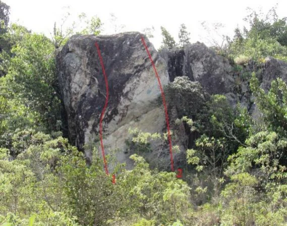
    - **largura_mapa**: 569
    - **altura_mapa**: 448
    - **pontos_de_interesse**:
      - **[0]**:
        - **id**: 1
        - **label**: 1
        - **circulo**:
          - **x**: 225
          - **y**: 355
          - **raio**: 12
      - **[1]**:
        - **id**: 2
        - **label**: 2
        - **circulo**:
          - **x**: 355
          - **y**: 345
          - **raio**: 12
    - **referencias**:
      - **[0]**:
        - **escalada**: Via 01
        - **ids**:
          - 1
      - **[1]**:
        - **escalada**: Via 02
        - **ids**:
          - 2
- **escaladas**:
  - **[0]**:
    - **via_esportiva**:
      - **descricao**: Crux na saída e um pouco exposto. Aconselha-se levar um clip-stick.
      - **nome**: Via 01
      - **dificuldade**: BR_7A
      - **extensao**: 10
      - **conquistadores**:
        - Eliseu Frechou
  - **[1]**:
    - **via_esportiva**:
      - **nome**: Via 02
      - **dificuldade**: BR_6
      - **extensao**: 12
      - **conquistadores**:
        - Eliseu Frechou
- **precomputados**:
  - **total_escaladas**: 2
  - **total_esportivas**: 2

## Parte: setor_pedra_da_boina

### Setor (Pico: Serra do Lenheiro)

- **descricao**:
    # Pedra da Boina
    
    Bloco bem peculiar com aspecto de uma “pedra que pode rolar” ao ser vista por quem está subindo a estrada para o CEMONTA do lado oposto do vale. Porém, seu acesso fica logo no início da subida, após passar pela ponte de ferro, tem um areal com um campinho de futebol onde pode-se deixar os veículos e pegar a trilha que começa bem na lateral do campo.
    
    Um pouco depois de atravessar o riacho a trilha vai um pouco esquerda e depois pra direita, mas logo vira de novo pra esquerda pra subir a serra em diagonal por um tempo. Já mais no alto, após uma parede um pouco mais vertical na direita, haverá dois blocos na esquerda, descer a trilha apagada por entre os blocos, em alguns pontos desescalando partes da rocha.
- **nome**: Pedra da Boina
- **mapas**:
  - **[0]**:
    - **caminho_imagem_mapa**: 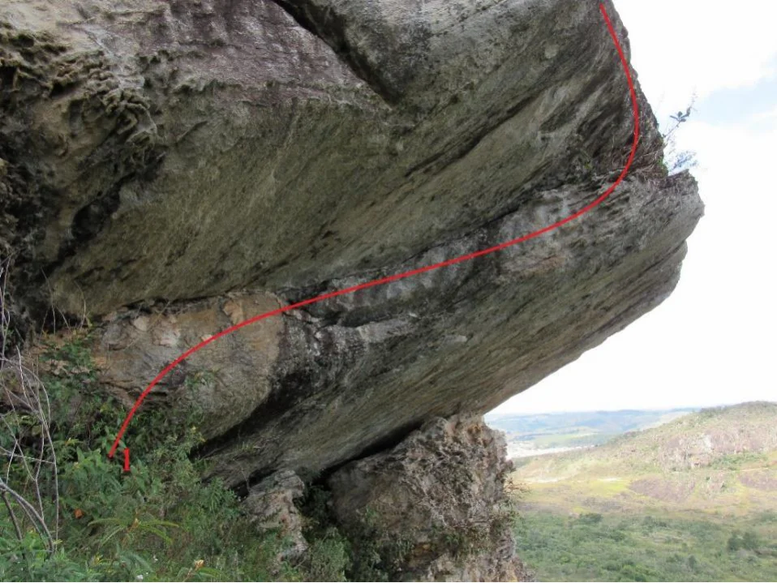
    - **largura_mapa**: 958
    - **altura_mapa**: 719
    - **pontos_de_interesse**:
      - **[0]**:
        - **id**: 1
        - **label**: 1
        - **circulo**:
          - **x**: 158
          - **y**: 566
          - **raio**: 22
    - **referencias**:
      - **[0]**:
        - **escalada**: Hábito Noturno
        - **ids**:
          - 1
  - **[1]**:
    - **caminho_imagem_mapa**: 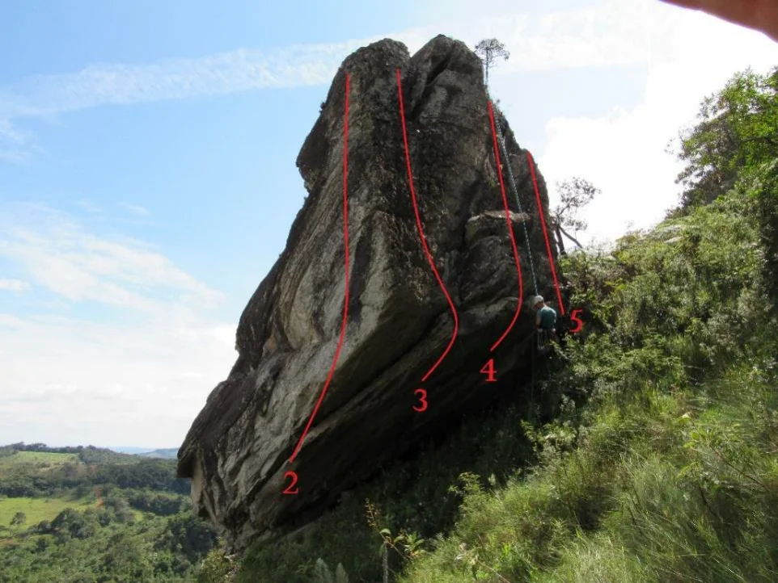
    - **largura_mapa**: 962
    - **altura_mapa**: 722
    - **pontos_de_interesse**:
      - **[0]**:
        - **id**: 2
        - **label**: 2
        - **circulo**:
          - **x**: 359
          - **y**: 598
          - **raio**: 22
      - **[1]**:
        - **id**: 3
        - **label**: 3
        - **circulo**:
          - **x**: 520
          - **y**: 495
          - **raio**: 22
      - **[2]**:
        - **id**: 4
        - **label**: 4
        - **circulo**:
          - **x**: 604
          - **y**: 458
          - **raio**: 22
      - **[3]**:
        - **id**: 5
        - **label**: 5
        - **circulo**:
          - **x**: 711
          - **y**: 397
          - **raio**: 22
    - **referencias**:
      - **[0]**:
        - **escalada**: Mestre Xifu
        - **ids**:
          - 2
      - **[1]**:
        - **escalada**: Boina Cinza
        - **ids**:
          - 3
      - **[2]**:
        - **escalada**: Gorro Cinza
        - **ids**:
          - 4
      - **[3]**:
        - **escalada**: Recruta Zero
        - **ids**:
          - 5
- **escaladas**:
  - **[0]**:
    - **via_esportiva**:
      - **descricao**: Foi a primeira via conquistada no setor, um estilo parecido com do setor da Ave Maria, impressiona pela beleza e proporciona fotos lindas. Conquistada em data desconhecida.
      - **nome**: Hábito Noturno
      - **dificuldade**: BR_7B
      - **conquistadores**:
        - Jonatas Lima
        - Maurício dos Santos
  - **[1]**:
    - **via_esportiva**:
      - **descricao**: Sem FA. Via sem cadena até a data de publicação.
      - **nome**: Mestre Xifu
      - **dificuldade**: PROJETO
      - **conquistadores**:
        - Jonatas Lima
      - **data_abertura**: 2018
  - **[2]**:
    - **via_esportiva**:
      - **descricao**: Sua saída bem negativa com agarras afiadas dá o grau da via, depois segue vertical com agarras menores.
      - **nome**: Boina Cinza
      - **dificuldade**: BR_6SUP
      - **conquistadores**:
        - Jonatas Lima
        - Michel Rodrigues
      - **data_abertura**: 2018
  - **[3]**:
    - **via_esportiva**:
      - **descricao**: Saída com uma rápida passagem em negativo onde se encontra o crux.
      - **nome**: Gorro Cinza
      - **dificuldade**: BR_6
      - **conquistadores**:
        - Jonatas Lima
        - Michel Rodrigues
      - **data_abertura**: 2018
  - **[4]**:
    - **via_esportiva**:
      - **descricao**: Conquistada em solo. Esta via encontra-se sem chapeletas.
      - **nome**: Recruta Zero
      - **dificuldade**: BR_3
      - **conquistadores**:
        - Jonatas Lima
      - **data_abertura**: 2018
- **precomputados**:
  - **total_escaladas**: 5
  - **total_esportivas**: 5

## Parte: grupo_rio_das_mortes

### Grupo (Pico: Serra do Lenheiro)

- **descricao**:
    # Setores do Rio das Mortes
    
    Mais recente área de escalada da cidade, descoberta em 2017, vem se tornando muito popular pelo fato de ter vias bastante variadas em grau, altura e estilo, além de ter sombra o dia inteiro devido à uma agradável floresta. Outro fato positivo é o fácil acesso (são 10min de carro apenas em asfalto e mais 20min de trilha leve). Seus setores ficam muito próximos.
    
    ## Como Chegar
    
    Saindo de São João pegar a BR 265 sentido Lavras. Do último trevo (Tejuco) são exatos 5km até o trevo do Rio das Mortes, entrar no trevo. Ao entrar na “cidade” virar à direita após a escola e depois virar novamente à direita na avenida principal. Seguir sempre reto na avenida até acabar o canteiro central, onde começa estrada de terra. A trilha começa à esquerda 150 metros após o início da terra, pode-se estacionar veículos nesse ponto no canto da estrada.
    
    |  |
    | :--: |
    | *Mapa de acesso e localização dos setores do Rio das Mortes* |
    
    **Legenda do mapa:**
    - **Linha vermelha contínua:** Trilha
    - **Linha vermelha tracejada:** Trilha apagada
    - **Linha amarela:** Cerca
    - **Setores indicados:**
      - **1:** Setor De Cima
      - **2:** Setor Thundercats
      - **3:** Setor Salão
      - **4:** Setor Namata
    - **Pontos de referência:** Avenida Principal do Rio das Mortes, Asfalto, Terra (Estrada Real), Ponte, Riacho, Fazendinha, Cerca, Floresta, Clareira.
    
    ## Trilha de Acesso aos Setores
    
    **Atenção:** Uns 50m após a fazendinha vá se afastando da cerca para pegar a trilha que sobe o morro mais forte mais pro meio do pasto e depois contorna a cerca de cima. Já na floresta, depois de 200m que adentrar nela, haverá uma trilha subindo à direita ao lado de um atoleiro com cipós grossos, que leva direto para os setores Namata(4) e Salão(3). Ou pode-se seguir reto caso queira ir primeiro nos setores De Cima(1) e Thundercats(2). Para essa segunda opção, quando estiver no pasto próximo ao setor, pegar uma trilha mais apagada pra direita.
    
    Existe uma trilha que liga direto o Setor Salão (3) ao setor Thundercats(2).
- **nome**: Rio das Mortes
- **setores**:
  - **[0]**:
    - **conteudo**:
      - **descricao**:
          # Setor de Cima
          
          Setor de vias baixas, levemente negativas e graus variados. Boa para se treinar técnicas e procedimentos (fácil acesso ao top por trás), um bom campo-escola. Sombra só até 11:00.
          
          Setor de vias baixas, levemente negativas e graus variados. Boa para se treinar técnicas e procedimentos (fácil acesso ao top por trás), um bom campo-escola. Sombra só até 11:00.
      - **nome**: Setor de Cima
      - **mapas**:
        - **[0]**:
          - **caminho_imagem_mapa**: 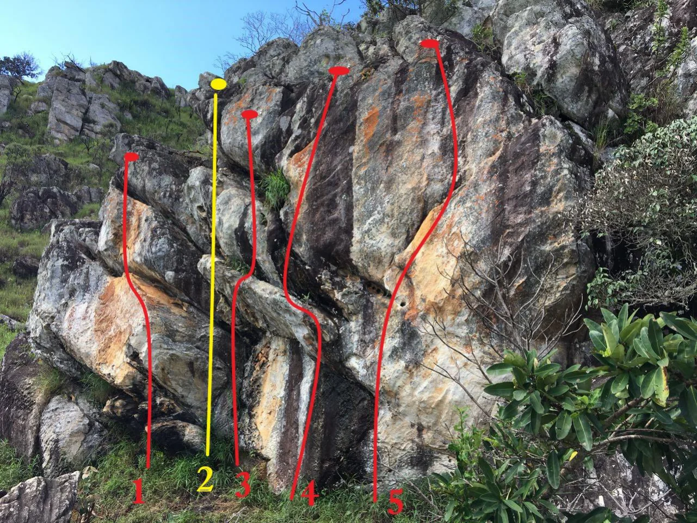
          - **largura_mapa**: 1281
          - **altura_mapa**: 961
          - **pontos_de_interesse**:
            - **[0]**:
              - **id**: 1
              - **label**: 1
              - **circulo**:
                - **x**: 255
                - **y**: 902
                - **raio**: 31
            - **[1]**:
              - **id**: 2
              - **label**: 2
              - **circulo**:
                - **x**: 377
                - **y**: 881
                - **raio**: 31
            - **[2]**:
              - **id**: 3
              - **label**: 3
              - **circulo**:
                - **x**: 447
                - **y**: 891
                - **raio**: 31
            - **[3]**:
              - **id**: 4
              - **label**: 4
              - **circulo**:
                - **x**: 570
                - **y**: 906
                - **raio**: 31
            - **[4]**:
              - **id**: 5
              - **label**: 5
              - **circulo**:
                - **x**: 727
                - **y**: 922
                - **raio**: 31
          - **referencias**:
            - **[0]**:
              - **escalada**: Vermelha
              - **ids**:
                - 1
            - **[1]**:
              - **escalada**: No Pelo
              - **ids**:
                - 2
            - **[2]**:
              - **escalada**: Quarteto Fantástico
              - **ids**:
                - 3
            - **[3]**:
              - **escalada**: Calcâneo
              - **ids**:
                - 4
            - **[4]**:
              - **escalada**: Tudo Virgem
              - **ids**:
                - 5
      - **escaladas**:
        - **[0]**:
          - **via_esportiva**:
            - **descricao**: Via boa para um primeiro contato com a escalada e pra treinar procedimentos, pois tem acesso por cima.
            - **nome**: Vermelha
            - **dificuldade**: BR_4SUP
            - **extensao**: 7
            - **conquistadores**:
              - Pedro Naves
              - Mariana Fiche
            - **data_abertura**: 2018
        - **[1]**:
          - **via_movel**:
            - **descricao**: Boa para treinar colocação de peças móveis. Parada móvel no top e saída por caminhada.
            - **nome**: No Pelo
            - **dificuldade**: BR_3
            - **extensao**: 8
            - **conquistadores**:
              - Antônio Gilmar (Tonhão)
              - Germano Rezende
            - **data_abertura**: 2018
        - **[2]**:
          - **via_esportiva**:
            - **nome**: Quarteto Fantástico
            - **dificuldade**: BR_6
            - **extensao**: 8
            - **conquistadores**:
              - Paulo Martins
              - Linda Evangelista
            - **data_abertura**: 2018
        - **[3]**:
          - **via_esportiva**:
            - **descricao**: Boa para treinar técnica de uso de calcanhar em via negativa.
            - **nome**: Calcâneo
            - **dificuldade**: BR_5SUP
            - **extensao**: 8
            - **conquistadores**:
              - Pedro Naves
              - Mariana Fiche
            - **data_abertura**: 2018
        - **[4]**:
          - **via_esportiva**:
            - **descricao**: Via boulderística e bem técnica, trabalha diferentes técnicas como reglete, dinâmico e negativo.
            - **nome**: Tudo Virgem
            - **dificuldade**: BR_7A
            - **extensao**: 8
            - **conquistadores**:
              - Pedro Naves
              - Mariana Fiche
            - **data_abertura**: 2017
      - **precomputados**:
        - **total_escaladas**: 5
        - **total_esportivas**: 4
  - **[1]**:
    - **conteudo**:
      - **descricao**:
          # Setor Thundercats
          
          Bem ao lado do setor anterior, descendo alguns metros pra direita. Possui apenas duas vias bem bonitas e com vista incrível do top. Sombra o dia todo na base, sol na via de tarde.
          
          ## Vias
          
          ### 6 – Thundercats (5º – 17m – fixa)
          **Conquistadores:** Pedro Naves, Mariana Fiche e Paulo Martins
          
          Via muito boa para iniciantes. Além de fácil, proporciona um lindo visual e uma foto incrível do escalador se for tirada da trilha que sobe pro Setor de Cima. Boa para top-rope e primeiras guiadas. 5 + 2 chapas.
          
          ### 7 – Cracuda (VI – 17m – móvel)
          **Conquistadores:** Pedro Naves, Mariana Fiche e Frederico Araújo
          
          Interessante via móvel com boas colocações. Um jogo de friends e nuts (caso não tenha micro-friends).
          
          | 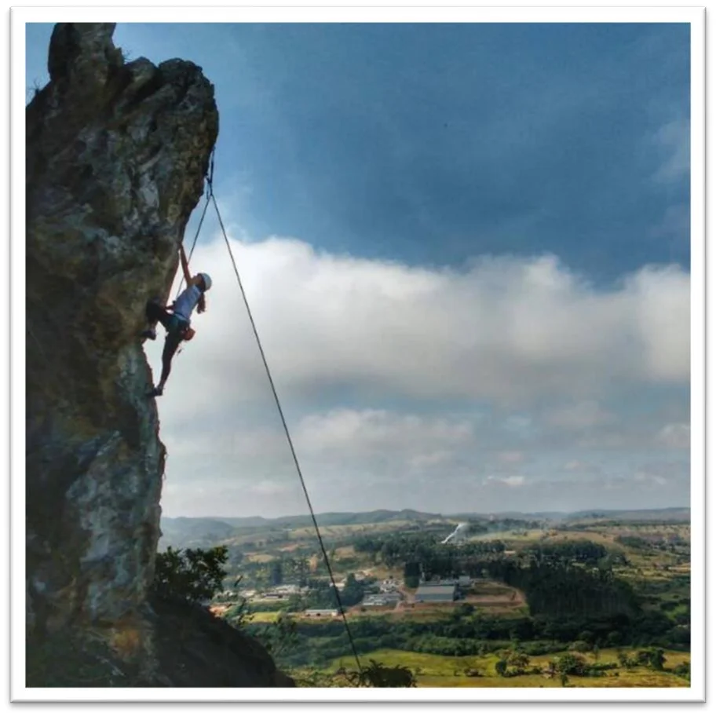 |
          | :--: |
          | *Mariana Fiche na via Thundercats* |
          
          Bem ao lado do setor anterior, descendo alguns metros pra direita. Possui apenas duas vias bem bonitas e com vista incrível do top. Sombra o dia todo na base, sol na via de tarde.
      - **nome**: Thundercats
      - **mapas**:
        - **[0]**:
          - **caminho_imagem_mapa**: 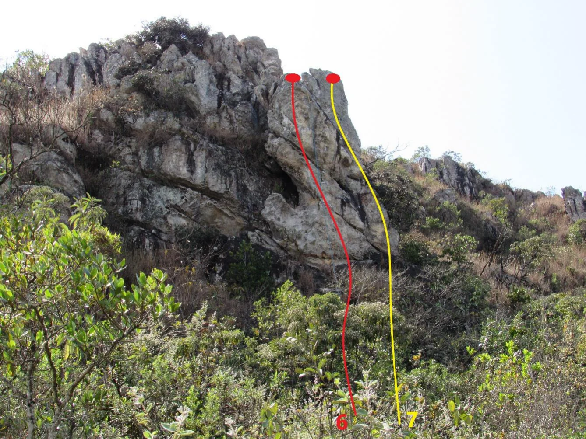
          - **largura_mapa**: 1338
          - **altura_mapa**: 1004
          - **pontos_de_interesse**:
            - **[0]**:
              - **id**: 6
              - **label**: 6
              - **circulo**:
                - **x**: 780
                - **y**: 964
                - **raio**: 27
            - **[1]**:
              - **id**: 7
              - **label**: 7
              - **circulo**:
                - **x**: 940
                - **y**: 958
                - **raio**: 27
          - **referencias**:
            - **[0]**:
              - **escalada**: Thundercats
              - **ids**:
                - 6
            - **[1]**:
              - **escalada**: Cracuda
              - **ids**:
                - 7
      - **escaladas**:
        - **[0]**:
          - **via_esportiva**:
            - **descricao**: Via muito boa para iniciantes. Além de fácil, proporciona um lindo visual e uma foto incrível do escalador se for tirada da trilha que sobe pro Setor de Cima. Boa para top-rope e primeiras guiadas. 5 + 2 chapas.
            - **nome**: Thundercats
            - **dificuldade**: BR_5
            - **extensao**: 17
            - **quantidade_protecoes_intermediarias**: 5
            - **quantidade_protecoes_parada**: 2
            - **conquistadores**:
              - Pedro Naves
              - Mariana Fiche
              - Paulo Martins
        - **[1]**:
          - **via_movel**:
            - **descricao**: Interessante via móvel com boas colocações. Um jogo de friends e nuts (caso não tenha micro-friends).
            - **nome**: Cracuda
            - **dificuldade**: BR_6
            - **extensao**: 17
            - **protecoes_moveis**: Um jogo de friends e nuts (caso não tenha micro-friends)
            - **conquistadores**:
              - Pedro Naves
              - Mariana Fiche
              - Frederico Araújo
      - **precomputados**:
        - **total_escaladas**: 2
        - **total_esportivas**: 1
  - **[2]**:
    - **conteudo**:
      - **descricao**:
          # Setor Salão
          
          Setor dentro de um salão formado entre duas paredes de rocha, atrás do Setor Namata. Estes dois setores foram separados apenas para melhor visualização no croqui, mas na prática estão no mesmo local. Na parte alta à esquerda sai a trilha que dá acesso aos outros setores.
          
          Base e vias na sombra o dia todo. Embaixo da pedra tem algumas ferramentas e clip-stick.
      - **nome**: Setor Salão
      - **mapas**:
        - **[0]**:
          - **caminho_imagem_mapa**: 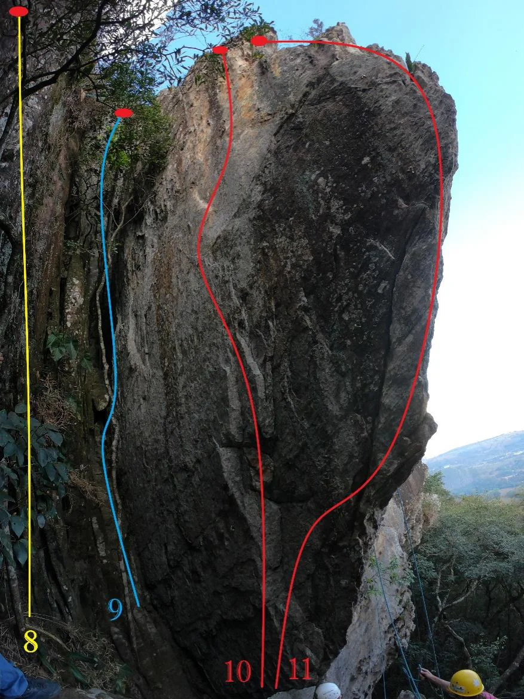
          - **largura_mapa**: 877
          - **altura_mapa**: 1169
          - **pontos_de_interesse**:
            - **[0]**:
              - **id**: 8
              - **label**: 8
              - **circulo**:
                - **x**: 50
                - **y**: 1072
                - **raio**: 27
            - **[1]**:
              - **id**: 9
              - **label**: 9
              - **circulo**:
                - **x**: 190
                - **y**: 1016
                - **raio**: 27
            - **[2]**:
              - **id**: 10
              - **label**: 10
              - **circulo**:
                - **x**: 398
                - **y**: 1122
                - **raio**: 31
            - **[3]**:
              - **id**: 11
              - **label**: 11
              - **circulo**:
                - **x**: 505
                - **y**: 1118
                - **raio**: 29
          - **referencias**:
            - **[0]**:
              - **escalada**: Quatro e Vinte
              - **ids**:
                - 8
            - **[1]**:
              - **escalada**: Chaminé Africana
              - **ids**:
                - 9
            - **[2]**:
              - **escalada**: Dança do Salão
              - **ids**:
                - 10
            - **[3]**:
              - **escalada**: Risca da Lista
              - **ids**:
                - 11
      - **escaladas**:
        - **[0]**:
          - **via_movel**:
            - **descricao**: Via curta, mas com movimentação interessante usa apenas dois friends (.3 e 1 BD)
            - **nome**: Quatro e Vinte
            - **dificuldade**: BR_6
            - **extensao**: 8
            - **conquistadores**:
              - Pedro Naves
              - Heider Ribeiro (Tio Nem)
            - **data_abertura**: 2020
            - **protecoes_moveis**: Dois friends (.3 e 1 BD)
        - **[1]**:
          - **via_movel**:
            - **descricao**: Via inteira em técnica de chaminé com 3 chapas no início e mais um friend médio. Evitar caso haja presença de abelhas próximo do top.
            - **nome**: Chaminé Africana
            - **dificuldade**: BR_4
            - **extensao**: 12
            - **quantidade_protecoes_intermediarias**: 3
            - **protecoes_moveis**: 1 friend médio
            - **conquistadores**:
              - Pedro Naves
              - Frederico Araújo
            - **data_abertura**: 2018
        - **[2]**:
          - **via_esportiva**:
            - **descricao**: Via clássica, muito cobiçada por sua estética e beleza dos movimentos que precisam encaixar como uma dança, pois não permite erros. Sua constância testa a resistência do escalador.
            - **nome**: Dança do Salão
            - **dificuldade**: BR_7B
            - **extensao**: 12
            - **conquistadores**:
              - Pedro Naves
              - Paulo Martins
            - **data_abertura**: 2018
        - **[3]**:
          - **via_esportiva**:
            - **descricao**: Via que utiliza a mesma saída da via anterior, mas logo no segundo lance já vai pra direita até a bonita aresta onde se encontra o crux.
            - **nome**: Risca da Lista
            - **dificuldade**: BR_7C
            - **extensao**: 12
            - **conquistadores**:
              - Paulo Martins
              - Pedro Naves
            - **data_abertura**: 2018
        - **[4]**:
          - **via_esportiva**:
            - **descricao**: Essa via fica à esquerda da Quatro e Vinte, mas como não pôde ser enquadrada na mesma foto, aparece apenas na foto abaixo (Setor Namata). Via muito interessante, com estilo diferente do padrão local, seu positivo de equilíbrio e micro-regletes lembra vias de parede. Apesar de curta possui uma movimentação complexa, o que faz parecer mais longa do que realmente é.
            - **nome**: Curta e Grossa
            - **dificuldade**: BR_7B
            - **extensao**: 8
            - **tipo_parede**: POSITIVO
            - **conquistadores**:
              - Pedro Naves
              - Jefferson Lara
            - **data_abertura**: 2020
      - **precomputados**:
        - **total_escaladas**: 5
        - **total_esportivas**: 3
  - **[3]**:
    - **conteudo**:
      - **descricao**:
          # Setor Namata
          
          Setor com maior altura e quantidade de vias. É por onde chega a trilha principal. Por estar dentro de uma mata tem sombra o dia todo na base, mas de tarde partes das vias pega sol.
          
          | 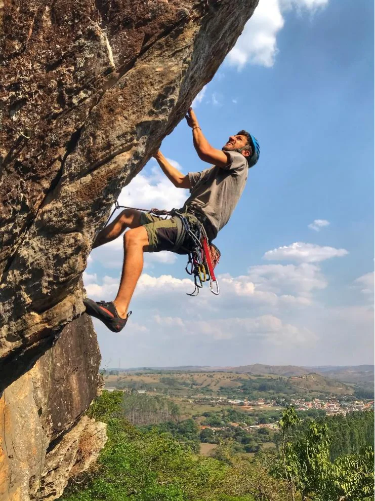 |
          | :--: |
          | *Pedro Naves na via Liberdade Vigiada* |
          
          | 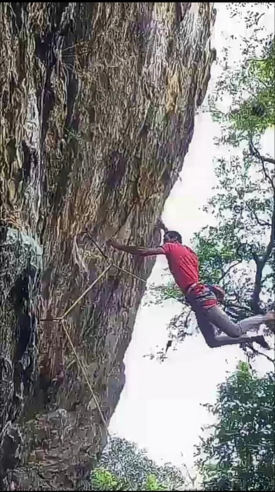 |
          | :--: |
          | *Beto no teto da Corona Vírus* |
      - **nome**: Setor Namata
      - **mapas**:
        - **[0]**:
          - **caminho_imagem_mapa**: 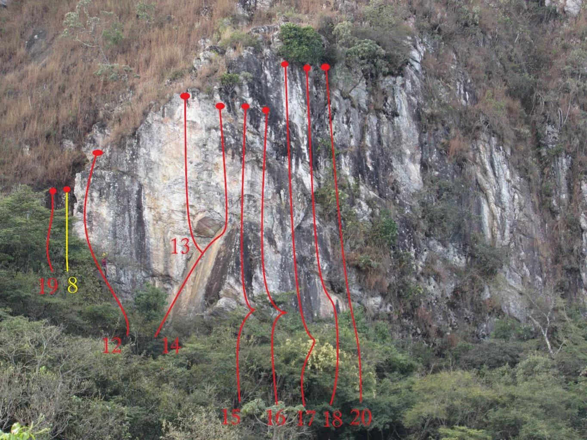
          - **largura_mapa**: 1364
          - **altura_mapa**: 1024
          - **pontos_de_interesse**:
            - **[0]**:
              - **id**: 19
              - **label**: 19
              - **circulo**:
                - **x**: 112
                - **y**: 664
                - **raio**: 30
            - **[1]**:
              - **id**: 8
              - **label**: 8
              - **circulo**:
                - **x**: 169
                - **y**: 663
                - **raio**: 26
            - **[2]**:
              - **id**: 12
              - **label**: 12
              - **circulo**:
                - **x**: 259
                - **y**: 803
                - **raio**: 30
            - **[3]**:
              - **id**: 13
              - **label**: 13
              - **circulo**:
                - **x**: 418
                - **y**: 572
                - **raio**: 30
            - **[4]**:
              - **id**: 14
              - **label**: 14
              - **circulo**:
                - **x**: 400
                - **y**: 804
                - **raio**: 31
            - **[5]**:
              - **id**: 15
              - **label**: 15
              - **circulo**:
                - **x**: 537
                - **y**: 970
                - **raio**: 31
            - **[6]**:
              - **id**: 16
              - **label**: 16
              - **circulo**:
                - **x**: 640
                - **y**: 971
                - **raio**: 31
            - **[7]**:
              - **id**: 17
              - **label**: 17
              - **circulo**:
                - **x**: 711
                - **y**: 973
                - **raio**: 31
            - **[8]**:
              - **id**: 18
              - **label**: 18
              - **circulo**:
                - **x**: 775
                - **y**: 975
                - **raio**: 31
            - **[9]**:
              - **id**: 20
              - **label**: 20
              - **circulo**:
                - **x**: 840
                - **y**: 970
                - **raio**: 31
          - **referencias**:
            - **[0]**:
              - **escalada**: Curta e Grossa
              - **ids**:
                - 19
              - **setor**: Setor Salão
            - **[1]**:
              - **escalada**: Quatro e Vinte
              - **ids**:
                - 8
              - **setor**: Setor Salão
            - **[2]**:
              - **escalada**: Liberdade Vigiada
              - **ids**:
                - 12
            - **[3]**:
              - **escalada**: Própolis
              - **ids**:
                - 13
            - **[4]**:
              - **escalada**: Pão de Mel
              - **ids**:
                - 14
            - **[5]**:
              - **escalada**: Sombra
              - **ids**:
                - 15
            - **[6]**:
              - **escalada**: Corona Vírus
              - **ids**:
                - 16
            - **[7]**:
              - **escalada**: Quarentena
              - **ids**:
                - 17
            - **[8]**:
              - **escalada**: Terra à Vista
              - **ids**:
                - 18
            - **[9]**:
              - **escalada**: Jardineiro
              - **ids**:
                - 20
        - **[1]**:
          - **caminho_imagem_mapa**: 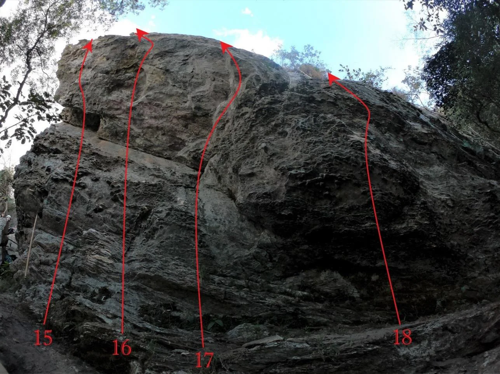
          - **largura_mapa**: 1287
          - **altura_mapa**: 965
          - **pontos_de_interesse**:
            - **[0]**:
              - **id**: 15
              - **label**: 15
              - **circulo**:
                - **x**: 111
                - **y**: 871
                - **raio**: 32
            - **[1]**:
              - **id**: 16
              - **label**: 16
              - **circulo**:
                - **x**: 314
                - **y**: 895
                - **raio**: 32
            - **[2]**:
              - **id**: 17
              - **label**: 17
              - **circulo**:
                - **x**: 526
                - **y**: 928
                - **raio**: 32
            - **[3]**:
              - **id**: 18
              - **label**: 18
              - **circulo**:
                - **x**: 1036
                - **y**: 869
                - **raio**: 32
          - **referencias**:
            - **[0]**:
              - **escalada**: Sombra
              - **ids**:
                - 15
            - **[1]**:
              - **escalada**: Corona Vírus
              - **ids**:
                - 16
            - **[2]**:
              - **escalada**: Quarentena
              - **ids**:
                - 17
            - **[3]**:
              - **escalada**: Terra à Vista
              - **ids**:
                - 18
      - **escaladas**:
        - **[0]**:
          - **via_esportiva**:
            - **descricao**: Via que percorre a parte de fora da grande aresta. Proporciona belas fotos de dentro do Salão. Possui 5 chapeletas e mais duas argolas no top.
            - **nome**: Liberdade Vigiada
            - **dificuldade**: BR_7B
            - **extensao**: 15
            - **quantidade_protecoes_intermediarias**: 5
            - **quantidade_protecoes_parada**: 2
            - **tipo_ancoragem**: Duas argolas
            - **conquistadores**:
              - Heider Ribeiro (Tio Nem)
              - Webert (Beto) Resende
            - **data_abertura**: 2020
        - **[1]**:
          - **via_esportiva**:
            - **descricao**: Variante da via a seguir, compartilha as duas primeiras chapas e sai pra esquerda do tetinho. Acima passa por uma grande laca sólida. São 5 chapas e mais 2 no top.
            - **nome**: Própolis
            - **dificuldade**: BR_6SUP
            - **extensao**: 17
            - **quantidade_protecoes_intermediarias**: 5
            - **quantidade_protecoes_parada**: 2
            - **conquistadores**:
              - Pedro Naves
              - Mariana Fiche
            - **data_abertura**: 2018
        - **[2]**:
          - **via_esportiva**:
            - **descricao**: Via mais popular da área por ser acessível, bonita e bem protegida. Possui 5 chapas e mais duas no top.
            - **nome**: Pão de Mel
            - **dificuldade**: BR_5SUP
            - **extensao**: 17
            - **quantidade_protecoes_intermediarias**: 5
            - **quantidade_protecoes_parada**: 2
            - **conquistadores**:
              - Antônio Gilmar (Tonhão)
              - Germano Rezende
            - **data_abertura**: 2018
        - **[3]**:
          - **via_esportiva**:
            - **descricao**: Via sem cadena até a data de publicação desse guia.
            - **nome**: Sombra
            - **dificuldade**: PROJETO
            - **extensao**: 20
            - **conquistadores**:
              - Heider Ribeiro (Tio Nem)
              - Pedro Naves
            - **data_abertura**: 2020
        - **[4]**:
          - **via_esportiva**:
            - **descricao**: Até o momento a via mais difícil do Rio das Mortes. Passa pelo meio do grande teto e depois segue por boas agarras.
            - **nome**: Corona Vírus
            - **dificuldade**: BR_8A
            - **extensao**: 20
            - **conquistadores**:
              - Pedro Naves
              - Heider Ribeiro (Tio Nem)
            - **data_abertura**: 2020-02-08
        - **[5]**:
          - **via_esportiva**:
            - **descricao**: Via longa e bonita. Saída no diedro e logo passa pra aresta, desbordando-a até virar pra positivo de agarra. 9 + 2 chapas.
            - **nome**: Quarentena
            - **dificuldade**: BR_6SUP
            - **extensao**: 25
            - **quantidade_protecoes_intermediarias**: 9
            - **quantidade_protecoes_parada**: 2
            - **conquistadores**:
              - Webert (Beto) Resende
              - Pedro Naves
              - Heider Ribeiro (Tio Nem)
              - Michel Rodrigues
            - **data_abertura**: 2020
        - **[6]**:
          - **via_esportiva**:
            - **descricao**: Talvez a via mais clássica da área, pois além de longa, possui uma grande variedade de estilos como negativos, positivo de equilíbrio, esticão e aresta. 7 chapas e mais 2 argolas no top.
            - **nome**: Terra à Vista
            - **destaque**: True
            - **dificuldade**: BR_7A
            - **extensao**: 25
            - **quantidade_protecoes_intermediarias**: 7
            - **quantidade_protecoes_parada**: 2
            - **tipo_ancoragem**: Duas argolas
            - **conquistadores**:
              - Pedro Naves
              - Mariana Fiche
            - **data_abertura**: 2019
        - **[7]**:
          - **via_esportiva**:
            - **descricao**: Via dura no início com negativo de agarras seguido de aderência com micro-regletes, segunda metade fácil.
            - **nome**: Jardineiro
            - **dificuldade**: BR_7C
            - **extensao**: 25
            - **conquistadores**:
              - Pedro Naves
              - Guilherme Otoni
              - Mariana Fiche
            - **data_abertura**: 2022-03-20
      - **precomputados**:
        - **total_escaladas**: 8
        - **total_esportivas**: 8
- **precomputados**:
  - **total_escaladas**: 20
  - **total_esportivas**: 16

## Parte: grupo_caburu

### Grupo (Pico: Serra do Lenheiro)

- **descricao**:
    # Setores do Caburu
    
    Esta área de escalada conta com 2 setores que se dividem em 2 blocos. Eles estão localizados na parte de trás da serra que fica do outro lado do vale do Cemonta.
    
    ## Caburu Debaixo
    
    Setor formado por um belo Quartzito de boa qualidade e vias que variam de 10 a 25 metros. Possui vias fixas e móveis. Point democrático, pois possui graus variados. Local arborizado, fazendo com que todas as bases tenham sombra o dia todo, já as vias pegam sol à tarde.
    
    Existem dois acessos, um chega por baixo do setor vindo do povoado do Cunha e outro por cima vindo pelo Lenheiro usando a trilha do setor Campina do Caburu, cruzando o topo da serra e descendo a trilha até o sopé, este último tem menos estrada mas caminha bem mais.
    
    ### Trilha do Cunha (mais curta)
    
    Em São João Del Rei pegar rodovia BR494 sentido Ritápolis, zerar o odômetro no posto de gasolina que tem à direita bem no início da rodovia. Andar 3Km e sair à esquerda onde tem placas para Pousada Flor de Iris e Caburu/Fé/Cunha. Um pouco depois que sair da rodovia haverá um cruzamento, seguir reto. Andar mais 3Km até uma bifurcação em um ponto de ónibus onde deverá entrar à esquerda seguindo a placa para Povoado do Cunha. Ir pela principal mais 3Km até uma porteira de ferro, estacionar antes da porteira. O início da trilha está em uma matinha logo ao lado esquerdo da porteira onde há uma passagem por baixo da cerca. Subir o pasto em direção aos eucaliptos, cruzar por dentro do eucaliptal e sair pela tronqueira. No pasto seguir a cerca até encontrar outra tronqueira e atravessá-la, andar alguns metros procurando a outra cerca, em uma baixada há uma passagem por baixo da cerca em um corte d’agua. Após a cerca subir o pasto para a esquerda até encontrar uma trilha, seguir a trilha até entrar na mata, dentro da mata andar cerca de 50 metros e pegar uma trilha à esquerda beirando um pequeno bloco de pedra retangular e chegará no setor. Foram amarrados plásticos nas arvores em pontos de dúvida.
    
    |  |
    | :--: |
    | *Mapa de acesso pela Trilha do Cunha* |
    
    **Legenda do mapa:**
    - **Linha marrom clara:** Estrada
    - **Linha vermelha contínua:** Trilha forte
    - **Linha vermelha tracejada:** Trilha apagada
    - **Pontos de referência:** Estrada Principal, Porteira, Início trilha / Cerca, Eucaliptos, Tronqueira, Cerca, Setor
- **nome**: Caburu
- **setores**:
  - **[0]**:
    - **conteudo**:
      - **descricao**:
          # Caburu Debaixo
          
          ## Setores do Caburu
          
          Esta área de escalada conta com 2 setores que se dividem em 2 blocos. Eles estão localizados na parte de trás da serra que fica do outro lado do vale do Cemonta.
          
          ## Apresentação
          
          Setor formado por um belo Quartzito de boa qualidade e vias que variam de 10 a 25 metros. Possui vias fixas e móveis. Point democrático, pois possui graus variados. Local arborizado, fazendo com que todas as bases tenham sombra o dia todo, já as vias pegam sol à tarde.
          
          Existem dois acessos, um chega por baixo do setor vindo do povoado do Cunha e outro por cima vindo pelo Lenheiro usando a trilha do setor Campina do Caburu, cruzando o topo da serra e descendo a trilha até o sopé, este último tem menos estrada mas caminha bem mais.
          
          ## Acesso e Trilha
          
          ### Trilha do Cunha (mais curta)
          
          Em São João Del Rei pegar rodovia BR494 sentido Ritápolis, zerar o odômetro no posto de gasolina que tem à direita bem no início da rodovia. Andar 3Km e sair à esquerda onde tem placas para Pousada Flor de Iris e Caburu/Fé/Cunha. Um pouco depois que sair da rodovia haverá um cruzamento, seguir reto. Andar mais 3Km até uma bifurcação em um ponto de ónibus onde deverá entrar à esquerda seguindo a placa para Povoado do Cunha. Ir pela principal mais 3Km até uma porteira de ferro, estacionar antes da porteira. O início da trilha está em uma matinha logo ao lado esquerdo da porteira onde há uma passagem por baixo da cerca. Subir o pasto em direção aos eucaliptos, cruzar por dentro do eucaliptal e sair pela tronqueira. No pasto seguir a cerca até encontrar outra tronqueira e atravessá-la, andar alguns metros procurando a outra cerca, em uma baixada há uma passagem por baixo da cerca em um corte d’agua. Após a cerca subir o pasto para a esquerda até encontrar uma trilha, seguir a trilha até entrar na mata, dentro da mata andar cerca de 50 metros e pegar uma trilha à esquerda beirando um pequeno bloco de pedra retangular e chegará no setor. Foram amarrados plásticos nas arvores em pontos de dúvida.
          
          | 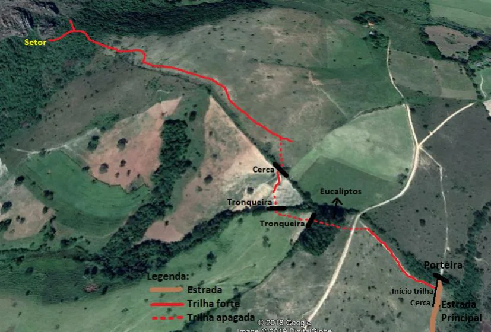 |
          | :--: |
          | *Trilha de acesso do Cunha* |
          
          ## Fotos
          
          |  |
          | :--: |
          | *Tio Nem conquistando a via Verdinho Cabuloso* |
      - **nome**: Caburu Debaixo
      - **mapas**:
        - **[0]**:
          - **caminho_imagem_mapa**: 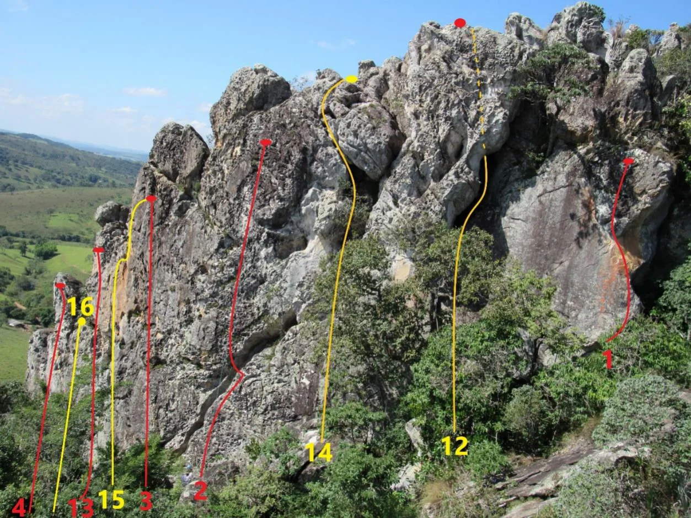
          - **largura_mapa**: 1253
          - **altura_mapa**: 940
          - **referencias**:
            - **[0]**:
              - **escalada**: Trio Canabis
              - **ids**:
                - 1
            - **[1]**:
              - **escalada**: Quem Tem Ovos Tem Medo
              - **ids**:
                - 2
            - **[2]**:
              - **escalada**: Bela da Tarde
              - **ids**:
                - 3
            - **[3]**:
              - **escalada**: Ironia do Destino
              - **ids**:
                - 4
            - **[4]**:
              - **escalada**: Diedrim
              - **ids**:
                - 12
            - **[5]**:
              - **escalada**: Indecisão
              - **ids**:
                - 13
            - **[6]**:
              - **escalada**: A Ajuda Vem de Cima
              - **ids**:
                - 14
            - **[7]**:
              - **escalada**: Rolling Stones
              - **ids**:
                - 15
            - **[8]**:
              - **escalada**: Via do Felipin
              - **ids**:
                - 16
          - **pontos_de_interesse**:
            - **[0]**:
              - **id**: 1
              - **label**: 1
              - **circulo**:
                - **x**: 1102
                - **y**: 652
                - **raio**: 24
            - **[1]**:
              - **id**: 2
              - **label**: 2
              - **circulo**:
                - **x**: 364
                - **y**: 890
                - **raio**: 24
            - **[2]**:
              - **id**: 3
              - **label**: 3
              - **circulo**:
                - **x**: 265
                - **y**: 908
                - **raio**: 24
            - **[3]**:
              - **id**: 4
              - **label**: 4
              - **circulo**:
                - **x**: 34
                - **y**: 920
                - **raio**: 24
            - **[4]**:
              - **id**: 12
              - **label**: 12
              - **circulo**:
                - **x**: 825
                - **y**: 810
                - **raio**: 31
            - **[5]**:
              - **id**: 13
              - **label**: 13
              - **circulo**:
                - **x**: 147
                - **y**: 922
                - **raio**: 31
            - **[6]**:
              - **id**: 14
              - **label**: 14
              - **circulo**:
                - **x**: 580
                - **y**: 820
                - **raio**: 31
            - **[7]**:
              - **id**: 15
              - **label**: 15
              - **circulo**:
                - **x**: 203
                - **y**: 906
                - **raio**: 31
            - **[8]**:
              - **id**: 16
              - **label**: 16
              - **circulo**:
                - **x**: 146
                - **y**: 556
                - **raio**: 31
        - **[1]**:
          - **caminho_imagem_mapa**: 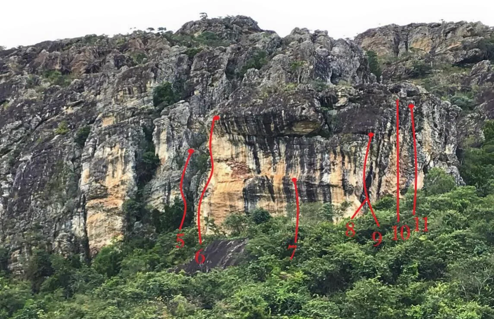
          - **largura_mapa**: 1144
          - **altura_mapa**: 740
          - **referencias**:
            - **[0]**:
              - **escalada**: Amigo Oculto
              - **ids**:
                - 5
            - **[1]**:
              - **escalada**: Verdinho Cabuloso
              - **ids**:
                - 6
            - **[2]**:
              - **escalada**: Maluco Beleza
              - **ids**:
                - 7
            - **[3]**:
              - **escalada**: Solimões
              - **ids**:
                - 8
            - **[4]**:
              - **escalada**: Rio Negro
              - **ids**:
                - 9
            - **[5]**:
              - **escalada**: Eliseu Frechou
              - **ids**:
                - 10
            - **[6]**:
              - **escalada**: Patacas Me Mordam
              - **ids**:
                - 11
          - **pontos_de_interesse**:
            - **[0]**:
              - **id**: 5
              - **label**: 5
              - **circulo**:
                - **x**: 419
                - **y**: 559
                - **raio**: 21
            - **[1]**:
              - **id**: 6
              - **label**: 6
              - **circulo**:
                - **x**: 464
                - **y**: 595
                - **raio**: 24
            - **[2]**:
              - **id**: 7
              - **label**: 7
              - **circulo**:
                - **x**: 678
                - **y**: 584
                - **raio**: 21
            - **[3]**:
              - **id**: 8
              - **label**: 8
              - **circulo**:
                - **x**: 812
                - **y**: 532
                - **raio**: 24
            - **[4]**:
              - **id**: 9
              - **label**: 9
              - **circulo**:
                - **x**: 874
                - **y**: 553
                - **raio**: 24
            - **[5]**:
              - **id**: 10
              - **label**: 10
              - **circulo**:
                - **x**: 930
                - **y**: 539
                - **raio**: 26
            - **[6]**:
              - **id**: 11
              - **label**: 11
              - **circulo**:
                - **x**: 976
                - **y**: 520
                - **raio**: 25
        - **[2]**:
          - **caminho_imagem_mapa**: 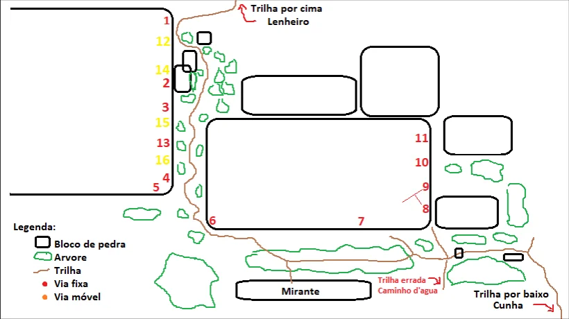
          - **largura_mapa**: 820
          - **altura_mapa**: 460
          - **referencias**:
            - **[0]**:
              - **escalada**: Trio Canabis
              - **ids**:
                - 1
            - **[1]**:
              - **escalada**: Quem Tem Ovos Tem Medo
              - **ids**:
                - 2
            - **[2]**:
              - **escalada**: Bela da Tarde
              - **ids**:
                - 3
            - **[3]**:
              - **escalada**: Ironia do Destino
              - **ids**:
                - 4
            - **[4]**:
              - **escalada**: Amigo Oculto
              - **ids**:
                - 5
            - **[5]**:
              - **escalada**: Verdinho Cabuloso
              - **ids**:
                - 6
            - **[6]**:
              - **escalada**: Maluco Beleza
              - **ids**:
                - 7
            - **[7]**:
              - **escalada**: Solimões
              - **ids**:
                - 8
            - **[8]**:
              - **escalada**: Rio Negro
              - **ids**:
                - 9
            - **[9]**:
              - **escalada**: Eliseu Frechou
              - **ids**:
                - 10
            - **[10]**:
              - **escalada**: Patacas Me Mordam
              - **ids**:
                - 11
            - **[11]**:
              - **escalada**: Diedrim
              - **ids**:
                - 12
            - **[12]**:
              - **escalada**: Indecisão
              - **ids**:
                - 13
            - **[13]**:
              - **escalada**: A Ajuda Vem de Cima
              - **ids**:
                - 14
            - **[14]**:
              - **escalada**: Rolling Stones
              - **ids**:
                - 15
            - **[15]**:
              - **escalada**: Via do Felipin
              - **ids**:
                - 16
          - **pontos_de_interesse**:
            - **[0]**:
              - **id**: 1
              - **label**: 1
              - **circulo**:
                - **x**: 240
                - **y**: 29
                - **raio**: 10
            - **[1]**:
              - **id**: 2
              - **label**: 2
              - **circulo**:
                - **x**: 240
                - **y**: 120
                - **raio**: 10
            - **[2]**:
              - **id**: 3
              - **label**: 3
              - **circulo**:
                - **x**: 238
                - **y**: 154
                - **raio**: 10
            - **[3]**:
              - **id**: 4
              - **label**: 4
              - **circulo**:
                - **x**: 240
                - **y**: 256
                - **raio**: 10
            - **[4]**:
              - **id**: 5
              - **label**: 5
              - **circulo**:
                - **x**: 225
                - **y**: 270
                - **raio**: 10
            - **[5]**:
              - **id**: 6
              - **label**: 6
              - **circulo**:
                - **x**: 307
                - **y**: 318
                - **raio**: 10
            - **[6]**:
              - **id**: 7
              - **label**: 7
              - **circulo**:
                - **x**: 520
                - **y**: 319
                - **raio**: 10
            - **[7]**:
              - **id**: 8
              - **label**: 8
              - **circulo**:
                - **x**: 614
                - **y**: 301
                - **raio**: 10
            - **[8]**:
              - **id**: 9
              - **label**: 9
              - **circulo**:
                - **x**: 614
                - **y**: 269
                - **raio**: 10
            - **[9]**:
              - **id**: 10
              - **label**: 10
              - **circulo**:
                - **x**: 608
                - **y**: 234
                - **raio**: 13
            - **[10]**:
              - **id**: 11
              - **label**: 11
              - **circulo**:
                - **x**: 608
                - **y**: 199
                - **raio**: 13
            - **[11]**:
              - **id**: 12
              - **label**: 12
              - **circulo**:
                - **x**: 235
                - **y**: 60
                - **raio**: 13
            - **[12]**:
              - **id**: 13
              - **label**: 13
              - **circulo**:
                - **x**: 236
                - **y**: 206
                - **raio**: 12
            - **[13]**:
              - **id**: 14
              - **label**: 14
              - **circulo**:
                - **x**: 235
                - **y**: 100
                - **raio**: 12
            - **[14]**:
              - **id**: 15
              - **label**: 15
              - **circulo**:
                - **x**: 235
                - **y**: 176
                - **raio**: 12
            - **[15]**:
              - **id**: 16
              - **label**: 16
              - **circulo**:
                - **x**: 235
                - **y**: 230
                - **raio**: 12
      - **escaladas**:
        - **[0]**:
          - **via_esportiva**:
            - **nome**: Trio Canabis
            - **dificuldade**: BR_7B
            - **extensao**: 12
            - **conquistadores**:
              - Heider Ribeiro (Tio Nem)
              - Fabio Bernardes
              - Fabiola Miranda
            - **data_abertura**: 2018-06-16
        - **[1]**:
          - **via_esportiva**:
            - **descricao**: 6 grampos e mais parada dupla no top.
            - **nome**: Quem Tem Ovos Tem Medo
            - **dificuldade**: BR_4
            - **extensao**: 20
            - **quantidade_protecoes_intermediarias**: 6
            - **quantidade_protecoes_parada**: 2
            - **tipo_ancoragem**: Parada dupla
            - **conquistadores**:
              - Márcio Andrade
              - Daniel Baiano
              - Faclei
        - **[2]**:
          - **via_esportiva**:
            - **descricao**: 7 chapeletas e mais duas argolas no top.
            - **nome**: Bela da Tarde
            - **dificuldade**: BR_5SUP
            - **extensao**: 20
            - **quantidade_protecoes_intermediarias**: 7
            - **quantidade_protecoes_parada**: 2
            - **tipo_ancoragem**: Duas argolas
            - **conquistadores**:
              - Fabio Bernardes
              - Fabiola Miranda
              - Heider Ribeiro (Tio Nem)
            - **data_abertura**: 2018-06-16
        - **[3]**:
          - **via_esportiva**:
            - **descricao**: 6 + 2 chapas.
            - **nome**: Ironia do Destino
            - **dificuldade**: BR_6
            - **quantidade_protecoes_intermediarias**: 6
            - **quantidade_protecoes_parada**: 2
            - **conquistadores**:
              - Pedro Naves
              - Mariana Fiche
            - **data_abertura**: 2018-09-08
        - **[4]**:
          - **via_esportiva**:
            - **descricao**: 6 chapas + duas no top.
            - **nome**: Amigo Oculto
            - **dificuldade**: BR_6SUP
            - **extensao**: 18
            - **quantidade_protecoes_intermediarias**: 6
            - **quantidade_protecoes_parada**: 2
            - **conquistadores**:
              - Pedro Naves
              - Heider Ribeiro (Tio Nem)
            - **data_abertura**: 2018-12-23
        - **[5]**:
          - **via_esportiva**:
            - **descricao**: Via mais alta e mais clássica da área. Saída em uma bela sequência negativa no melhor estilo boulder, depois segue por uma linda aresta até o final em um forte negativo. São 11 chapeletas mais 2 argolas no top. Costuras mais longas (30 e 60) são aconselháveis.
            - **nome**: Verdinho Cabuloso
            - **destaque**: True
            - **dificuldade**: BR_7C
            - **extensao**: 25
            - **quantidade_protecoes_intermediarias**: 11
            - **quantidade_protecoes_parada**: 2
            - **tipo_ancoragem**: Duas argolas
            - **conquistadores**:
              - Heider Ribeiro (Tio Nem)
              - Pedro Naves
            - **data_abertura**: 2018-07-14
        - **[6]**:
          - **via_esportiva**:
            - **descricao**: Sem FA (sem primeira ascensão).
            - **nome**: Maluco Beleza
            - **dificuldade**: PROJETO
            - **extensao**: 15
            - **conquistadores**:
              - Beto Resende
              - Nem Ribeiro
              - Carolina Chagas
              - Fabiola Miranda
            - **data_abertura**: 2018
        - **[7]**:
          - **via_esportiva**:
            - **nome**: Solimões
            - **dificuldade**: BR_6
            - **extensao**: 15
            - **conquistadores**:
              - Eliseu Frechou e amigos
        - **[8]**:
          - **via_esportiva**:
            - **descricao**: Variante da via anterior (Solimões), tornou a linha mais reta. São 6 chapas mais duas argolas no top.
            - **nome**: Rio Negro
            - **dificuldade**: BR_6
            - **extensao**: 17
            - **quantidade_protecoes_intermediarias**: 6
            - **quantidade_protecoes_parada**: 2
            - **tipo_ancoragem**: Duas argolas
            - **conquistadores**:
              - Heider Ribeiro (Tio Nem)
              - Pedro Naves
            - **data_abertura**: 2019-02-15
        - **[9]**:
          - **via_esportiva**:
            - **nome**: Eliseu Frechou
            - **dificuldade**: BR_7A
            - **extensao**: 17
            - **conquistadores**:
              - Eliseu Frechou
              - Luiz Cláudio
              - Vitor Frechou
        - **[10]**:
          - **via_esportiva**:
            - **nome**: Patacas Me Mordam
            - **dificuldade**: BR_6SUP
            - **conquistadores**:
              - Jonatas Lima
              - Fabio Rufino
            - **data_abertura**: 2018
        - **[11]**:
          - **via_movel**:
            - **descricao**: Via em um belo diedro fendado. Ao final do diedro passa para dentro da grande cavidade na rocha e chega no cume por entre os blocos de rocha onde há um grampo. Um jogo de friends (BD 5 ou 6 protege melhor).
            - **nome**: Diedrim
            - **dificuldade**: BR_5
            - **quantidade_protecoes_parada**: 1
            - **protecoes_moveis**: Um jogo de friends (BD 5 ou 6 protege melhor)
            - **tipo_ancoragem**: Grampo
            - **conquistadores**:
              - Luiz Cláudio
              - Leonardo Rodrigues
        - **[12]**:
          - **via_esportiva**:
            - **descricao**: Crux técnico na saída. 6 + 2 chapas.
            - **nome**: Indecisão
            - **dificuldade**: BR_6SUP
            - **quantidade_protecoes_intermediarias**: 6
            - **quantidade_protecoes_parada**: 2
            - **conquistadores**:
              - Pedro Naves
              - Bruno Bastos
            - **data_abertura**: 2019
        - **[13]**:
          - **via_movel**:
            - **nome**: A Ajuda Vem de Cima
            - **dificuldade**: BR_7A
            - **conquistadores**:
              - Luiz Cláudio
              - Leonardo Rodrigues
        - **[14]**:
          - **via_movel**:
            - **descricao**: Via interessante, saída com proteções escassas em buracos e depois com boas fendas. Top com a via Bela da Tarde (via 3).
            - **nome**: Rolling Stones
            - **dificuldade**: BR_5SUP
            - **extensao**: 20
            - **quantidade_protecoes_parada**: 2
            - **protecoes_moveis**: Saída com proteções escassas em buracos e depois com boas fendas
            - **tipo_ancoragem**: Argolas (parada compartilhada com a via Bela da Tarde)
            - **conquistadores**:
              - Leonardo Rodrigues
              - João Felipin
        - **[15]**:
          - **via_movel**:
            - **nome**: Via do Felipin
            - **dificuldade**: PROJETO
            - **conquistadores**:
              - João Felipin
      - **precomputados**:
        - **total_escaladas**: 16
        - **total_esportivas**: 12
  - **[1]**:
    - **conteudo**:
      - **descricao**:
          # Campina do Caburu
          
          O setor Caburu divide-se em dois blocos principais, os quais possuem vias móveis e esportivas.
          
          É o setor mais distante por ficar no alto da serra e longe de estradas, são cerca de 40 min de caminhada. Para acessar basta seguir as orientações de acesso ao setor Ave Maria até a bifurcação da tronqueira, é nesse ponto onde as trilhas se dividem e deve-se seguir reto na trilha bem apagada em leve descida, que logo cruza um corte de água e começa a subir a serra em diagonal (esta parte pode ser vista da bifurcação). Quase no topo da serra, quando a trilha começa a querer descer, deve-se pegar uma saída para a direita e cruzar o topo da serra, iniciando a descida para o lado oposto. Descendo um pouco chegará num campo aberto, à esquerda estará o Bloco 1 e à direita o Bloco 2. Ver também mapa no início do guia.
          
          | 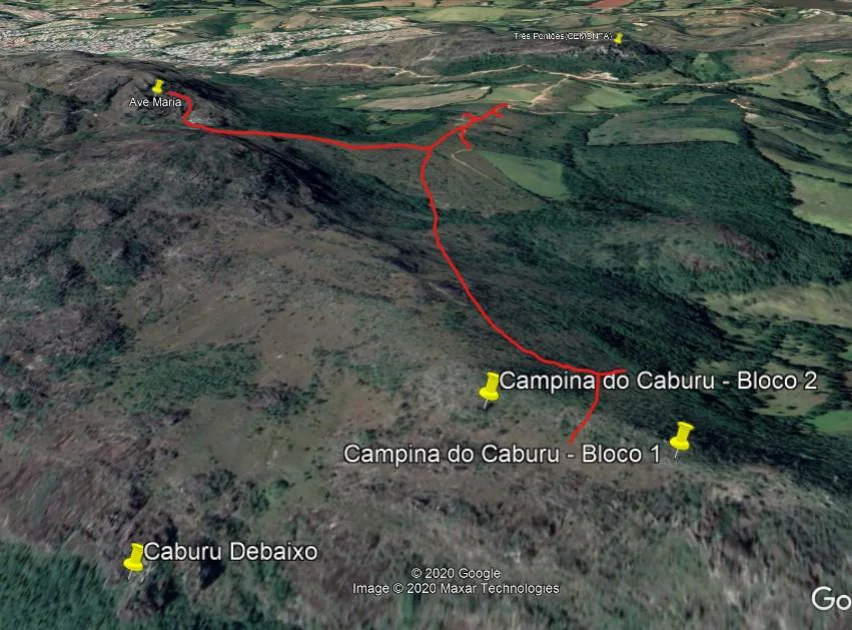 |
          | :--: |
          | *Mapa de acesso aos blocos da Campina do Caburu* |
          
          ## Bloco 1
          
          No bloco 1 do setor encontram-se vias de graduações baixas, ideais para escaladores iniciantes. A maioria de suas vias possuem um único grampo ou proteção para rapel. Outra característica do Bloco 1 é a exposição ao sol durante a maior parte do dia, exceto bem cedo, o ideal é escalar em dias nublados nesse local.
          
          ## Bloco 2
          
          Este bloco encontra-se ao lado esquerdo do bloco 1, possuindo poucas vias de escalada. Quando se chega no campo aberto vindo da trilha principal, caminha-se à direita até o bloco.
      - **nome**: Campina do Caburu
      - **mapas**:
        - **[0]**:
          - **caminho_imagem_mapa**: 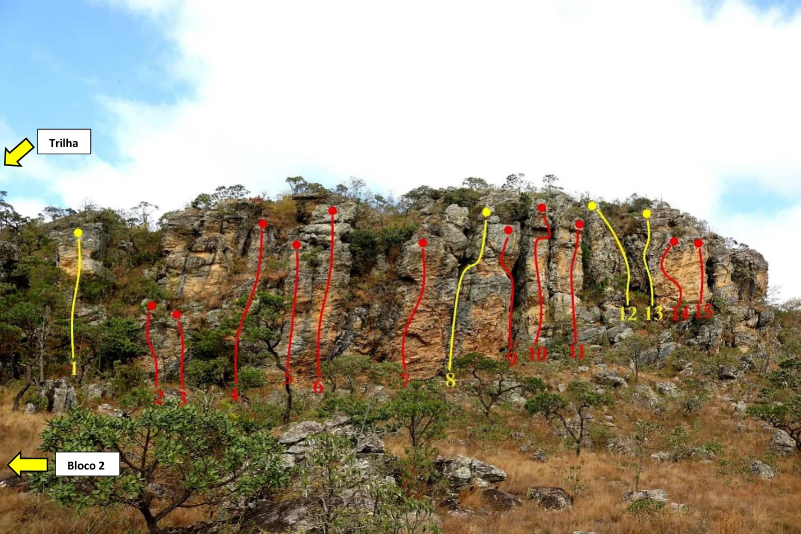
          - **largura_mapa**: 1427
          - **altura_mapa**: 952
          - **referencias**:
            - **[0]**:
              - **escalada**: Ao Grande Mestre
              - **ids**:
                - 1
            - **[1]**:
              - **escalada**: Step
              - **ids**:
                - 2
            - **[2]**:
              - **escalada**: Tudo é Vaidade
              - **ids**:
                - 3
            - **[3]**:
              - **escalada**: Zoação Física
              - **ids**:
                - 4
            - **[4]**:
              - **escalada**: Bongô
              - **ids**:
                - 5
            - **[5]**:
              - **escalada**: Pai e Filho
              - **ids**:
                - 6
            - **[6]**:
              - **escalada**: Podre dos Poderes
              - **ids**:
                - 7
            - **[7]**:
              - **escalada**: Pisando em Ovos
              - **ids**:
                - 8
            - **[8]**:
              - **escalada**: Até o Fim dos Dias
              - **ids**:
                - 9
            - **[9]**:
              - **escalada**: Insolação
              - **ids**:
                - 10
            - **[10]**:
              - **escalada**: Só pra Elas
              - **ids**:
                - 11
            - **[11]**:
              - **escalada**: Empregando Meios
              - **ids**:
                - 12
            - **[12]**:
              - **escalada**: Tubarão martelo
              - **ids**:
                - 13
            - **[13]**:
              - **escalada**: No Sossego
              - **ids**:
                - 14
            - **[14]**:
              - **escalada**: Catira
              - **ids**:
                - 15
          - **pontos_de_interesse**:
            - **[0]**:
              - **id**: 1
              - **label**: 1
              - **circulo**:
                - **x**: 132
                - **y**: 659
                - **raio**: 19
            - **[1]**:
              - **id**: 2
              - **label**: 2
              - **circulo**:
                - **x**: 283
                - **y**: 707
                - **raio**: 19
            - **[2]**:
              - **id**: 3
              - **label**: 3
              - **circulo**:
                - **x**: 326
                - **y**: 708
                - **raio**: 19
            - **[3]**:
              - **id**: 4
              - **label**: 4
              - **circulo**:
                - **x**: 417
                - **y**: 706
                - **raio**: 19
            - **[4]**:
              - **id**: 5
              - **label**: 5
              - **circulo**:
                - **x**: 517
                - **y**: 676
                - **raio**: 19
            - **[5]**:
              - **id**: 6
              - **label**: 6
              - **circulo**:
                - **x**: 564
                - **y**: 688
                - **raio**: 19
            - **[6]**:
              - **id**: 7
              - **label**: 7
              - **circulo**:
                - **x**: 722
                - **y**: 672
                - **raio**: 19
            - **[7]**:
              - **id**: 8
              - **label**: 8
              - **circulo**:
                - **x**: 803
                - **y**: 678
                - **raio**: 19
            - **[8]**:
              - **id**: 9
              - **label**: 9
              - **circulo**:
                - **x**: 916
                - **y**: 640
                - **raio**: 19
            - **[9]**:
              - **id**: 10
              - **label**: 10
              - **circulo**:
                - **x**: 958
                - **y**: 630
                - **raio**: 24
            - **[10]**:
              - **id**: 11
              - **label**: 11
              - **circulo**:
                - **x**: 1028
                - **y**: 626
                - **raio**: 24
            - **[11]**:
              - **id**: 12
              - **label**: 12
              - **circulo**:
                - **x**: 1122
                - **y**: 560
                - **raio**: 21
            - **[12]**:
              - **id**: 13
              - **label**: 13
              - **circulo**:
                - **x**: 1165
                - **y**: 556
                - **raio**: 21
            - **[13]**:
              - **id**: 14
              - **label**: 14
              - **circulo**:
                - **x**: 1212
                - **y**: 557
                - **raio**: 21
            - **[14]**:
              - **id**: 15
              - **label**: 15
              - **circulo**:
                - **x**: 1254
                - **y**: 555
                - **raio**: 21
        - **[1]**:
          - **caminho_imagem_mapa**: 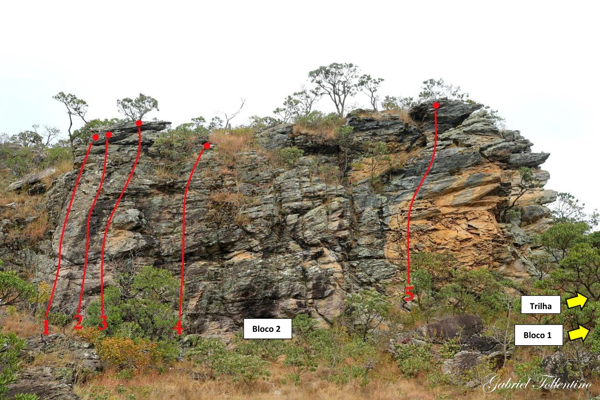
          - **largura_mapa**: 1531
          - **altura_mapa**: 1021
          - **referencias**:
            - **[0]**:
              - **escalada**: Sem Pai nem Mãe
              - **ids**:
                - 1
            - **[1]**:
              - **escalada**: Queixo Duro
              - **ids**:
                - 2
            - **[2]**:
              - **escalada**: 30 Segundos
              - **ids**:
                - 3
            - **[3]**:
              - **escalada**: Perdido no Tempo
              - **ids**:
                - 4
            - **[4]**:
              - **escalada**: Paçoquinha
              - **ids**:
                - 5
          - **pontos_de_interesse**:
            - **[0]**:
              - **id**: 1
              - **label**: 1
              - **circulo**:
                - **x**: 118
                - **y**: 835
                - **raio**: 26
            - **[1]**:
              - **id**: 2
              - **label**: 2
              - **circulo**:
                - **x**: 200
                - **y**: 821
                - **raio**: 26
            - **[2]**:
              - **id**: 3
              - **label**: 3
              - **circulo**:
                - **x**: 264
                - **y**: 823
                - **raio**: 26
            - **[3]**:
              - **id**: 4
              - **label**: 4
              - **circulo**:
                - **x**: 455
                - **y**: 837
                - **raio**: 29
            - **[4]**:
              - **id**: 5
              - **label**: 5
              - **circulo**:
                - **x**: 1044
                - **y**: 751
                - **raio**: 26
      - **escaladas**:
        - **[0]**:
          - **via_movel**:
            - **nome**: Ao Grande Mestre
            - **dificuldade**: BR_4
            - **conquistadores**:
              - Germano
              - Antônio Gilmar (Tonhão)
            - **data_abertura**: 2013
        - **[1]**:
          - **via_esportiva**:
            - **descricao**: Via curta com proteções próximas.
            - **nome**: Step
            - **dificuldade**: BR_4
            - **conquistadores**:
              - Antônio Gilmar (Tonhão)
              - Fabiana
            - **data_abertura**: 2013
        - **[2]**:
          - **via_esportiva**:
            - **descricao**: Via curta com proteções próximas.
            - **nome**: Tudo é Vaidade
            - **dificuldade**: BR_4
            - **conquistadores**:
              - Antônio Gilmar (Tonhão)
              - Fabiana
            - **data_abertura**: 2013
        - **[3]**:
          - **via_esportiva**:
            - **nome**: Zoação Física
            - **dificuldade**: BR_5
            - **conquistadores**:
              - Antônio Gilmar (Tonhão)
              - Fabiana
            - **data_abertura**: 2013
        - **[4]**:
          - **via_esportiva**:
            - **nome**: Bongô
            - **dificuldade**: BR_5
            - **conquistadores**:
              - Jonatas Lima
              - Maurício dos Santos
            - **data_abertura**: 2004
        - **[5]**:
          - **via_esportiva**:
            - **descricao**: Ótima via, com uma saída negativa e posteriormente vertical.
            - **nome**: Pai e Filho
            - **dificuldade**: BR_5
            - **conquistadores**:
              - Mauricio dos Santos
              - Jonatas Lima
            - **data_abertura**: 2015
        - **[6]**:
          - **via_esportiva**:
            - **nome**: Podre dos Poderes
            - **dificuldade**: BR_5
            - **conquistadores**:
              - Eustáquio Júnior
              - Juan Kempen
        - **[7]**:
          - **via_movel**:
            - **nome**: Pisando em Ovos
            - **dificuldade**: BR_5
            - **conquistadores**:
              - Márcio Andrade
        - **[8]**:
          - **via_esportiva**:
            - **descricao**: Via delicada, bastante agarra podre.
            - **nome**: Até o Fim dos Dias
            - **dificuldade**: BR_4
            - **conquistadores**:
              - Jonatas Lima
              - Carlos Pádua
            - **data_abertura**: 2012
        - **[9]**:
          - **via_esportiva**:
            - **descricao**: Primeira proteção relativamente alta.
            - **nome**: Insolação
            - **dificuldade**: BR_4SUP
            - **conquistadores**:
              - Jonatas Lima
              - Maurício dos Santos
            - **data_abertura**: 2004
        - **[10]**:
          - **via_esportiva**:
            - **descricao**: Primeira proteção relativamente alta.
            - **nome**: Só pra Elas
            - **dificuldade**: BR_4
            - **conquistadores**:
              - Luiz Cláudio
        - **[11]**:
          - **via_movel**:
            - **nome**: Empregando Meios
            - **dificuldade**: BR_5
            - **conquistadores**:
              - Jonatas Lima
              - Gelson
            - **data_abertura**: 2003
        - **[12]**:
          - **via_movel**:
            - **nome**: Tubarão martelo
            - **dificuldade**: BR_4SUP
            - **conquistadores**:
              - Germano
              - Antônio Gilmar (Tonhão)
            - **data_abertura**: 2013
        - **[13]**:
          - **via_esportiva**:
            - **nome**: No Sossego
            - **dificuldade**: BR_4SUP
            - **conquistadores**:
              - Antônio Gilmar (Tonhão)
              - Germano
              - Pitt
            - **data_abertura**: 2013
        - **[14]**:
          - **via_esportiva**:
            - **nome**: Catira
            - **dificuldade**: BR_5
            - **conquistadores**:
              - Antônio Gilmar (Tonhão)
              - Germano
              - Pitt
            - **data_abertura**: 2013
        - **[15]**:
          - **via_esportiva**:
            - **nome**: Sem Pai nem Mãe
            - **dificuldade**: BR_3
        - **[16]**:
          - **via_esportiva**:
            - **descricao**: Via curta com proteções próximas.
            - **nome**: Queixo Duro
            - **dificuldade**: BR_3
            - **conquistadores**:
              - Instrutores do CIOpMth
            - **data_abertura**: 2014
        - **[17]**:
          - **via_esportiva**:
            - **nome**: 30 Segundos
            - **dificuldade**: BR_3SUP
            - **conquistadores**:
              - Instrutores do CIOpMth
            - **data_abertura**: 2014
        - **[18]**:
          - **via_esportiva**:
            - **nome**: Perdido no Tempo
            - **dificuldade**: BR_4
        - **[19]**:
          - **via_esportiva**:
            - **nome**: Paçoquinha
            - **dificuldade**: BR_5
            - **conquistadores**:
              - Jonatas Lima
              - Carlos Pádua
            - **data_abertura**: 2015
      - **precomputados**:
        - **total_escaladas**: 20
        - **total_esportivas**: 16
- **precomputados**:
  - **total_escaladas**: 36
  - **total_esportivas**: 28

## Parte: grupo_serra_de_sao_jose

### Grupo (Pico: Serra do Lenheiro)

- **descricao**:
    # Serra de São José
    
    Apesar do guia ser sobre a Serra do Lenheiro, vale a pena incluir aqui algumas escaladas da sua vizinha São José, que na verdade são afloramentos diferentes da mesma formação rochosa, sendo separadas por poucos quilômetros (perímetro urbano de São João Del Rei).
    
    ## Cachoeira Pedra do Índio (Marco Zero)
    
    Setor localizado bem ao lado da queda da Pedra do Índio, no complexo de cachoeiras do Bom Despacho, conhecido também como Marco Zero, devido a marco da Estrada Real na entrada.
    
    Fica bem ao lado da Estrada Velha que liga São João Del Rei à Tiradentes, mas está no munícipio de Santa Cruz de Minas, que é na verdade um bairro de Tiradentes que emancipou.
    
    Este local fica muito próximo da cidade, dependendo de onde se está partindo fica até mais próximo que a própria Serra do Lenheiro. Para se chegar basta digitar Totem Marco Zero no Google Maps. A pequena trilha de acesso às vias fica ao lado esquerdo das primeiras quedas.
    
    |  |
    | :--: |
    | *Setor Cachoeira Pedra do Índio (Marco Zero)* |
- **nome**: Serra de São José
- **setores**:
  - **[0]**:
    - **conteudo**:
      - **descricao**:
          # Cachoeira Pedra do Índio (Marco Zero)
          
          Setor localizado bem ao lado da queda da Pedra do Índio, no complexo de cachoeiras do Bom Despacho, conhecido também como Marco Zero, devido a marco da Estrada Real na entrada.
          
          Fica bem ao lado da Estrada Velha que liga São João Del Rei à Tiradentes, mas está no munícipio de Santa Cruz de Minas, que é na verdade um bairro de Tiradentes que emancipou.
          
          Este local fica muito próximo da cidade, dependendo de onde se está partindo fica até mais próximo que a própria Serra do Lenheiro. Para se chegar basta digitar Totem Marco Zero no Google Maps. A pequena trilha de acesso às vias fica ao lado esquerdo das primeiras quedas.
          
          | 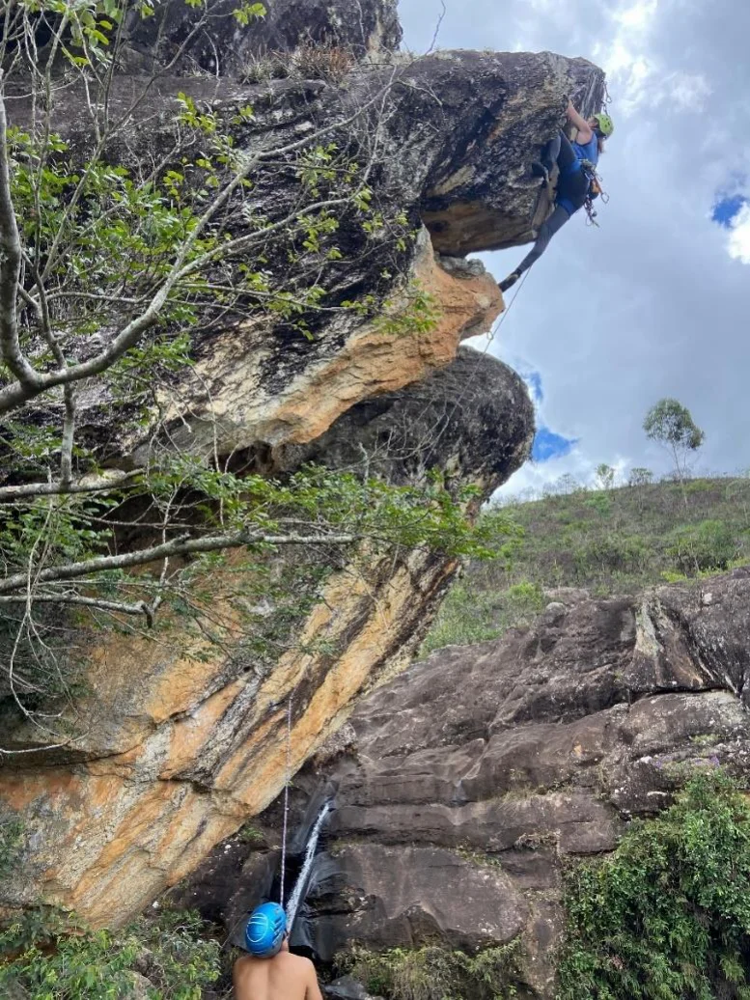 |
          | :--: |
          | *Lucas Agostini escalando a via Cacique* |
          
          *Lucas Agostini escalando a via Cacique*
      - **nome**: Cachoeira Pedra do Índio (Marco Zero)
      - **mapas**:
        - **[0]**:
          - **caminho_imagem_mapa**: 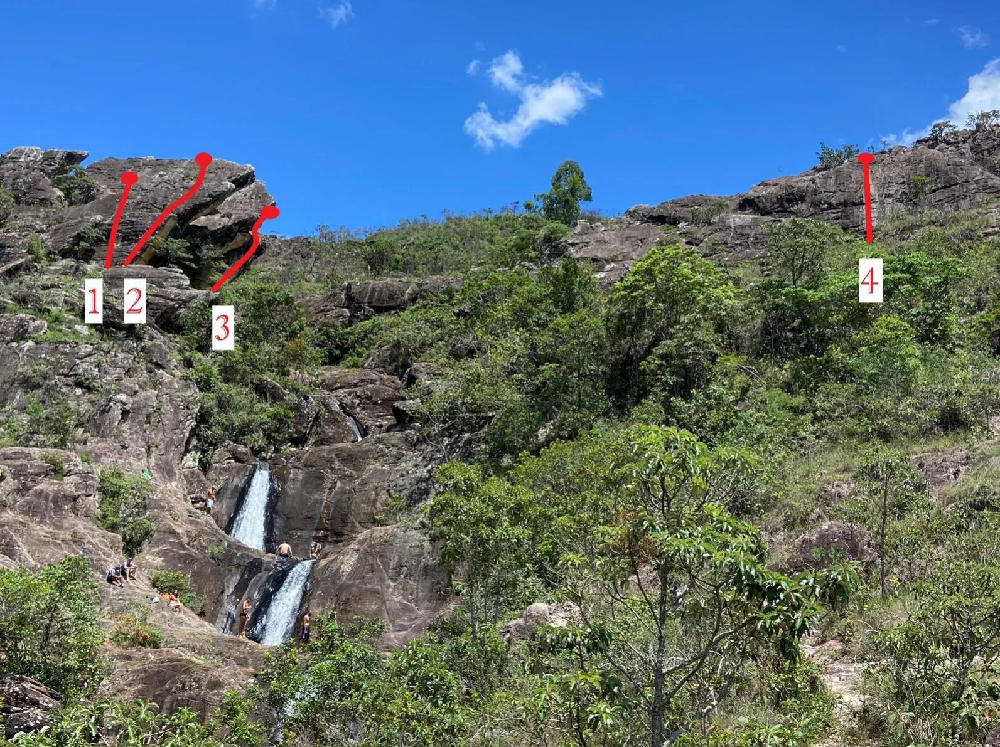
          - **largura_mapa**: 1593
          - **altura_mapa**: 1191
          - **pontos_de_interesse**:
            - **[0]**:
              - **id**: 1
              - **label**: 1
              - **retangulo**:
                - **x**: 150
                - **y**: 480
                - **comprimento**: 27
                - **largura**: 72
            - **[1]**:
              - **id**: 2
              - **label**: 2
              - **retangulo**:
                - **x**: 214
                - **y**: 480
                - **comprimento**: 34
                - **largura**: 72
            - **[2]**:
              - **id**: 3
              - **label**: 3
              - **retangulo**:
                - **x**: 355
                - **y**: 523
                - **comprimento**: 34
                - **largura**: 72
            - **[3]**:
              - **id**: 4
              - **label**: 4
              - **retangulo**:
                - **x**: 1388
                - **y**: 447
                - **comprimento**: 37
                - **largura**: 70
          - **referencias**:
            - **[0]**:
              - **escalada**: Marco Zero
              - **ids**:
                - 1
            - **[1]**:
              - **escalada**: Quininício
              - **ids**:
                - 2
            - **[2]**:
              - **escalada**: Cacique
              - **ids**:
                - 3
            - **[3]**:
              - **escalada**: Chapa Quente
              - **ids**:
                - 4
        - **[1]**:
          - **caminho_imagem_mapa**: 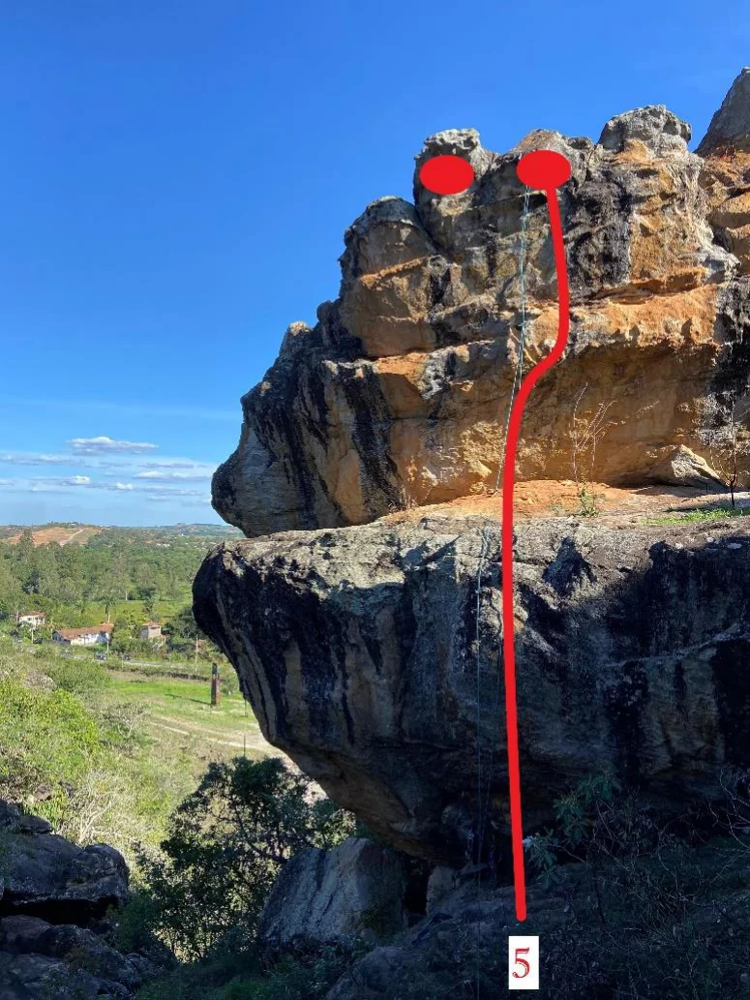
          - **largura_mapa**: 775
          - **altura_mapa**: 1033
          - **pontos_de_interesse**:
            - **[0]**:
              - **id**: 5
              - **label**: 5
              - **retangulo**:
                - **x**: 541
                - **y**: 995
                - **comprimento**: 32
                - **largura**: 54
          - **referencias**:
            - **[0]**:
              - **escalada**: Casika
              - **ids**:
                - 5
            - **[1]**:
              - **escalada**: Casikinha
              - **ids**:
                - 5
      - **escaladas**:
        - **[0]**:
          - **via_esportiva**:
            - **descricao**: Primeira via do setor e também a mais fácil. Um crux de equilíbrio na saída que dificulta um pouco pra quem é mais baixo e depois segue bem fácil até o final. Essa e sua vizinha ficam com sombra de tarde.
            - **nome**: Marco Zero
            - **dificuldade**: BR_4
            - **extensao**: 12
            - **conquistadores**:
              - Lucas Agostini
              - Pedro Naves
            - **data_abertura**: 2024-11-03
        - **[1]**:
          - **via_esportiva**:
            - **descricao**: Via com crux "Aqui no início", por isso o seu nome. É um lance delicado que dificulta muito quem é baixo. Ainda possui mais um lance interessante logo acima e depois é escalada tranquila até o final.
            - **nome**: Quininício
            - **dificuldade**: BR_5SUP
            - **extensao**: 17
            - **conquistadores**:
              - Pedro Naves
              - Mariana Fiche
            - **data_abertura**: 2024-11-23
        - **[2]**:
          - **via_esportiva**:
            - **descricao**: Via clássica! Uma linha bem exótica, alterna lances positivos e negativos que cruzam os imponentes bicos de pedra com um final aéreo que dá uma apimentada. Seguindo o padrão local, é outra que favorece quem é mais alto, principalmente na saída onde chega a subir um grau pra quem é baixo. Ela possui a vantagem de ficar na sombra o dia todo. São 5+2 chapas.
            - **nome**: Cacique
            - **dificuldade**: BR_7A
            - **destaque**: True
            - **extensao**: 15
            - **quantidade_protecoes_intermediarias**: 5
            - **quantidade_protecoes_parada**: 2
            - **conquistadores**:
              - Pedro Naves
              - Lucas Agostini
            - **data_abertura**: 2024-11-23
        - **[3]**:
          - **via_esportiva**:
            - **descricao**: Via positiva localizada do outro lado da cachoeira.
            - **nome**: Chapa Quente
            - **dificuldade**: BR_4SUP
            - **tipo_parede**: POSITIVO
            - **extensao**: 12
            - **conquistadores**:
              - Márcio Andrade
              - Halle
            - **data_abertura**: 2024-11-30
        - **[4]**:
          - **via_esportiva**:
            - **descricao**: Via ainda sem cadena. Saída com crux bem concentrado e duro usando uma agarra colada com Sika, por isso seu nome. A parte após o platô possui um lance de boulder onde possivelmente é o crux. Fica na sombra pela manhã e sol de tarde no verão.
            - **nome**: Casika
            - **dificuldade**: PROJETO
            - **extensao**: 15
            - **conquistadores**:
              - Pedro Naves
              - Lucas Agostini
            - **data_abertura**: 2024-11-30
        - **[5]**:
          - **via_esportiva**:
            - **descricao**: Início da via Casika, terminando no platô e descendo por caminhada. Para desmontar é possível subir pelo lado direito até o top da Casika e montar rapel de cima.
            - **nome**: Casikinha
            - **dificuldade**: BR_7B_BARRA_7C
            - **extensao**: 10
            - **conquistadores**:
              - Pedro Naves
              - Lucas Agostini
            - **data_abertura**: 2024-11-30
      - **precomputados**:
        - **total_escaladas**: 6
        - **total_esportivas**: 6
- **precomputados**:
  - **total_escaladas**: 6
  - **total_esportivas**: 6

## Arquivos Externos

- **arquivos_externos**:
  - **[0]**:
    - **caminho**: 
    - **checksum_sha256**: ee5b1405fa318ec077bbeb0138f1643f2073045f822e2ca84410ff10fe3845a0
  - **[1]**:
    - **caminho**: 
    - **checksum_sha256**: 135e2d1dec3a0da59c29f011143bdb6f6bf4f7b5d0a5e585ce3f210c7f748a26
  - **[2]**:
    - **caminho**: 
    - **checksum_sha256**: 809180236dfacc1529b9ed7ffbcba764b5cf77aff5ffdda8d9b536aec29eab19
  - **[3]**:
    - **caminho**: 
    - **checksum_sha256**: 8c63556dbf34411226f732907dd729a752d735d5e853854917a200cfeb2564ab
  - **[4]**:
    - **caminho**: 
    - **checksum_sha256**: 05c0764490341239f84ac1328af55d348a655ea4ec13f67b19479a59cd5c955f
  - **[5]**:
    - **caminho**: 
    - **checksum_sha256**: 055a704e82649ede24cc4e5b2e222af6da3673297accc49b4518fb6d4936a5b8
  - **[6]**:
    - **caminho**: 
    - **checksum_sha256**: 055a704e82649ede24cc4e5b2e222af6da3673297accc49b4518fb6d4936a5b8
  - **[7]**:
    - **caminho**: 
    - **checksum_sha256**: 00b6c7d1bb2dbbdbdf979728bb872695f315f630edc46327219ff33a168f3a0b
  - **[8]**:
    - **caminho**: 
    - **checksum_sha256**: 4a9c2ef58b7ea6a7ecbaae0ec92ed828214d0f34e76f333042e8bd76c3f57c71
  - **[9]**:
    - **caminho**: 
    - **checksum_sha256**: 541df459c8d82d5707629f14fe5c5035f7f36ce8b1e94b302764c2fc318c933c
  - **[10]**:
    - **caminho**: 
    - **checksum_sha256**: a0ace7f824c1f5e2d311e8c5d21ca95457066405a9c722d5d2e78e6822674ce3
  - **[11]**:
    - **caminho**: 
    - **checksum_sha256**: 2a95f233f4f656a36dfd3b24e4710792319a943173dce170efbbda19e1c29144
  - **[12]**:
    - **caminho**: 
    - **checksum_sha256**: 8752d423b1fbec3a88c16092c7184701d883bcabfa810e131486b76e038f8856
  - **[13]**:
    - **caminho**: 
    - **checksum_sha256**: bd4a2cb30252bd8a68cd9082edd893647fbd6213889af7fd90991af0025d0801
  - **[14]**:
    - **caminho**: 
    - **checksum_sha256**: b78fb011d5d05c9cd4ce9af8cc44e92565827c5a0e4a40772f8e68dbf5ca31d1
  - **[15]**:
    - **caminho**: 
    - **checksum_sha256**: 2ddf89d49922429e1004d4e6a0b6284d80c081363cabf539293b5ef1692de18f
  - **[16]**:
    - **caminho**: 
    - **checksum_sha256**: ee2438d87aaa0c23f92750c0fa7fb7249c02f29afe7eac64a1874e44a66ece83
  - **[17]**:
    - **caminho**: 
    - **checksum_sha256**: d9578eaa3ebe449ae0dd502a9b92a76e4bc632348b4c9f121888dbbf20a598bc
  - **[18]**:
    - **caminho**: 
    - **checksum_sha256**: a77a7a0857a04a967b6f27a2e221c036ae612381cd621b98c94ffedb07b3ae04
  - **[19]**:
    - **caminho**: 
    - **checksum_sha256**: 4e68eb4687bf5bfc9f420e7bc1323a0044b99b00feb8cc6f0086ca1279482b94
  - **[20]**:
    - **caminho**: 
    - **checksum_sha256**: 494d50c1472e1de8a54c1c6d4987a3f91071f2e03d0caf286dd8f16fdda73738
  - **[21]**:
    - **caminho**: 
    - **checksum_sha256**: aa0c37f05770ed29b82ac4eeed237fe189a4b108408705db413ed6d5da347773
  - **[22]**:
    - **caminho**: 
    - **checksum_sha256**: 7ecfacf8cc2db9696f37268a2d49dee1efbd3d3c95d6ccb91d6fefc9e9d61c9c
  - **[23]**:
    - **caminho**: 
    - **checksum_sha256**: e3d4f1f53924bb6ec167569fc7fd17f97c6164f6b0fc48b4164bc7d1e0962458
  - **[24]**:
    - **caminho**: 
    - **checksum_sha256**: e3d4f1f53924bb6ec167569fc7fd17f97c6164f6b0fc48b4164bc7d1e0962458
  - **[25]**:
    - **caminho**: 
    - **checksum_sha256**: 77968ff1411f0a3063053ef8a0cb902d1e465784134374eeddddf0090cdd636e
  - **[26]**:
    - **caminho**: 
    - **checksum_sha256**: d769d3af063f16bf20cccce9621aad445790740384cc9afe06d0e00368180530
  - **[27]**:
    - **caminho**: 
    - **checksum_sha256**: f8b5fef7004d984e4c0b230d9bd1364cec6b9e01a1a8e47c70d0e2053c280f3f
  - **[28]**:
    - **caminho**: 
    - **checksum_sha256**: a8f1061de02c17fec64346067f2db32fc5b7e7714ca8f59b527a65d2b4b8db24
  - **[29]**:
    - **caminho**: 
    - **checksum_sha256**: 4eb61cb7306937043f19489549887ed7b1f260303b50c078ea2fdeb2afc6f678
  - **[30]**:
    - **caminho**: 
    - **checksum_sha256**: a4894dc9a3919180f8677998c17b5df9b00ec6e0fcc91a5bccbb0c0463314c1b
  - **[31]**:
    - **caminho**: 
    - **checksum_sha256**: e695ca632b7cb24d423d931b17a43d739655ffe43dd222c12fe69f400ecde7af
  - **[32]**:
    - **caminho**: 
    - **checksum_sha256**: 71f0bc2c9834e31c7c24957a066184fe993af7651af7d969279ed724883492a7
  - **[33]**:
    - **caminho**: 
    - **checksum_sha256**: 2952c1893c8e22f7c235af6ed9320d094860167fb4d2173ffd68adc8d1f16ca1
  - **[34]**:
    - **caminho**: 
    - **checksum_sha256**: fdfa4586f0b15c50e18b9176f9b3395391adf449d7104812bd754b842228ee97
  - **[35]**:
    - **caminho**: 
    - **checksum_sha256**: feb6b5c8e32682c4137349b29b897d8c8e2c60c49726f7c72f80e65f6ca3d7e9
  - **[36]**:
    - **caminho**: 
    - **checksum_sha256**: 7b8ca73722a06bb7b650f911e95fe08c1e2dd0941e5ee5aaaf2cbbf01dd695f1
  - **[37]**:
    - **caminho**: 
    - **checksum_sha256**: 84a7b229c062ba3743509693003cba8cdfa7e57485faf685b29941274a4f3d9f
  - **[38]**:
    - **caminho**: 
    - **checksum_sha256**: 44c2fcec11a3cf28134805fc9c1c3a5309a62bb17daec2fd220dd538f3a186af
  - **[39]**:
    - **caminho**: 
    - **checksum_sha256**: 7d9e539726781b1929e33c9d3c097ff1d6d3660fa64d1c678523269739baa91e
  - **[40]**:
    - **caminho**: 
    - **checksum_sha256**: b7c64f1a0e1b119f4e10fcbb7386f6d42a6b6011690f89a7db17478949048cd3
  - **[41]**:
    - **caminho**: 
    - **checksum_sha256**: 06fb314402f4a95a50fdf57af875183df70dd323a4d3143047af5121a5e9e44f
  - **[42]**:
    - **caminho**: 
    - **checksum_sha256**: 8bf8c8f66b943364e91726609f7e21da74b0dd2bb5b30d36215d9d35deb5e960
  - **[43]**:
    - **caminho**: 
    - **checksum_sha256**: 03bd769b73c6c63892f96ae79d8c752c58f294a3c4a34e48e2e577d9dc119f2b
  - **[44]**:
    - **caminho**: 
    - **checksum_sha256**: a1ee7d4be88688072d5e711b85a1df133dbde3377b21bf634065142ab8e36c33
  - **[45]**:
    - **caminho**: 
    - **checksum_sha256**: 9bd400dd8790f9b5d8aa15035f746e95c4c52870279a4330ff5412dc0220849d
  - **[46]**:
    - **caminho**: 
    - **checksum_sha256**: 62840f289319d10e6883dc48d3ba33d362c11e2b870a63dbbd02bab2554b96d1
  - **[47]**:
    - **caminho**: 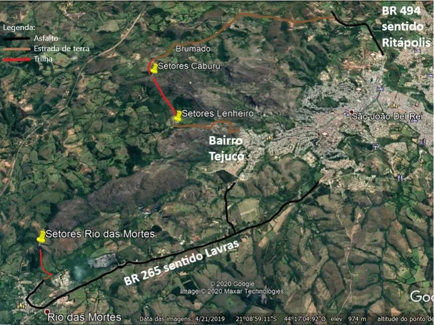
    - **checksum_sha256**: 6e61502cf94333f345886a32d3d7701e314c55ab6882a7b91311e0804fc4fe34
  - **[48]**:
    - **caminho**: 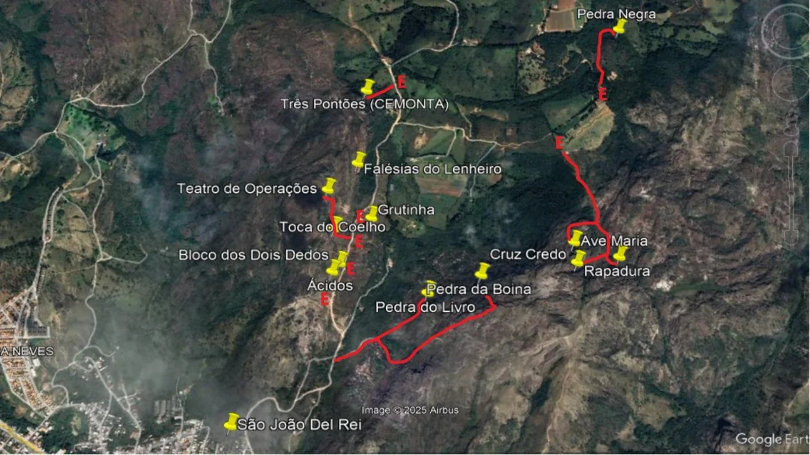
    - **checksum_sha256**: fc09b9680b69b3874572d4f5c052746b2b309b70729f724724d8f3c56ecfc3ee
  - **[49]**:
    - **caminho**: 
    - **checksum_sha256**: 7f0d7e6443292ef5426b7b913d29fcc0f8d68379bed772b4453e37468837fa18
  - **[50]**:
    - **caminho**: 
    - **checksum_sha256**: 536690015d1446bff59a657508a64de7975b172a5e3359854ee325eeb3f82b9f
  - **[51]**:
    - **caminho**: 
    - **checksum_sha256**: 54d4f76d9169daa5ca309cb80098835ec0ab9f612be2caa7b2a88c2f3062d79f
  - **[52]**:
    - **caminho**: 
    - **checksum_sha256**: 45e697db28ceeda3f5da17ed95eaa9f76235bda71795f1a797d6f95e193877d2
  - **[53]**:
    - **caminho**: 
    - **checksum_sha256**: c9c8e9ee67387986e6e5b659edd1e846ddae3e81dcbed626f257c9f58049136d
  - **[54]**:
    - **caminho**: 
    - **checksum_sha256**: 315b099e7d70ad234a90b8b77fc4eba9ba82b3c31d503114555a9b4d59474609
  - **[55]**:
    - **caminho**: 
    - **checksum_sha256**: bee46f15f6f160e4ef2f0364305a3f588543638983ca4401d3caa3011184d109
  - **[56]**:
    - **caminho**: 
    - **checksum_sha256**: 0e71fedf27e0a2435c839ec110f37c5586ced118f31ef2117bb6138392b45d23
  - **[57]**:
    - **caminho**: 
    - **checksum_sha256**: 79bcbb08c567c1b0a204c9c435ac82689b77382b564a20b0a737be124442685f
  - **[58]**:
    - **caminho**: 
    - **checksum_sha256**: bb10e077903a55a9b69a064ef7765f7635062dd21400d4d15e168ea7677743bc
  - **[59]**:
    - **caminho**: 
    - **checksum_sha256**: ce74537bb371ad329ed574368ac66380bc5fd3ae7ca86598f71a427157f249ab
  - **[60]**:
    - **caminho**: 
    - **checksum_sha256**: dfbe4cd4046c8db5ee3ac098394b489c49400286ec828b496394d0da9481ab31
  - **[61]**:
    - **caminho**: 
    - **checksum_sha256**: 2cbff7089c9d4c849a6b33159e95fab022a33fe7168f87069a513b810fad4e64
  - **[62]**:
    - **caminho**: 
    - **checksum_sha256**: 00e1175028b45e34e91bef9e9563e18b865e32bb2cee1380e7f7e933f1f5b7ce
  - **[63]**:
    - **caminho**: 
    - **checksum_sha256**: dcacdb7b18705386eaed11d0c7c11938b84edce03501bc971d5b50f7a23414cd
  - **[64]**:
    - **caminho**: 
    - **checksum_sha256**: ed6a4a840ab916368c5cd23f2bcc62f567d3556a870bccf558e6cd96049b7535
  - **[65]**:
    - **caminho**: 
    - **checksum_sha256**: c355fc8812c26739c0dbc86ee53ba30b24b2384c07b2a92abaa9a27f2551774f
  - **[66]**:
    - **caminho**: 
    - **checksum_sha256**: 9ee0a6d78042a4baf96ae36c6804cb0eb83b8ff305ffee54d8c6b0c8b9ac750b
  - **[67]**:
    - **caminho**: 
    - **checksum_sha256**: d0bf26bda73f9d6a9821f3a3bd04eaf03489054785f3ccc94fa5e0864d550345
  - **[68]**:
    - **caminho**: 
    - **checksum_sha256**: 7074b43e57bb6f32971fb5fd19cebd5a3692ceee0fc9310d5d1fa85fd5ad470e
  - **[69]**:
    - **caminho**: 
    - **checksum_sha256**: 86f0b905ca2c288448498680417515d2917d51ea9283cc0c9833173209d98026
  - **[70]**:
    - **caminho**: 
    - **checksum_sha256**: 8161249161bb47acf62ce1a2d01f1bbcdfffef183dc056e151fd6b6d28b7b4c3
  - **[71]**:
    - **caminho**: 
    - **checksum_sha256**: 32d0c5161ea54ea8b43c3c8878cf587b4e66bcfa96228eaf75c2b61718517b0d
  - **[72]**:
    - **caminho**: 
    - **checksum_sha256**: 0200c0c4e149c72086c6d807457d6d3287bb24b73f7b6359e18679814b8c532d
  - **[73]**:
    - **caminho**: 
    - **checksum_sha256**: 6df9ae29a5bcb901ec427b336cd574a3bb39cf861df72a3b8ecac7f933b0dd47
  - **[74]**:
    - **caminho**: 
    - **checksum_sha256**: 95b118a29409a4979e8a9cf694f7c3cd572c7de09e410a89a59820c9f93fc70f
  - **[75]**:
    - **caminho**: 
    - **checksum_sha256**: 83706aa113cfdb85a9c3470f25956fcfc87bbc3edd91da0b9eecb6381ee5e8e9
  - **[76]**:
    - **caminho**: 
    - **checksum_sha256**: 7db111eeb8cc4feec4ae6bf83c77bdd4af6936621f219f0fa3e3ef5509798603
  - **[77]**:
    - **caminho**: 
    - **checksum_sha256**: 958422959ad31b8f36974685ffad5cccd0326b72183b208b272bf46cd403fcd1
  - **[78]**:
    - **caminho**: 
    - **checksum_sha256**: 4573f84a1f04f632879644f331f91a656e2c8c26d18fc5ab5b6e4f49a1de52c9
  - **[79]**:
    - **caminho**: 
    - **checksum_sha256**: 5af7ec5d3f403b3cbf8e16678f51013eb06e4e826586befd0fc9c5488f6cfa21
  - **[80]**:
    - **caminho**: 
    - **checksum_sha256**: 0318280b19ef4784020cbaee7cc8be4dbfc6a3399d13b28fdd5e263dede68fd2
  - **[81]**:
    - **caminho**: 
    - **checksum_sha256**: 0359280f80840d16cfc26cc9255d0657f6a1c5b47511cc0ccd1952d001ec4872
  - **[82]**:
    - **caminho**: 
    - **checksum_sha256**: 2eebd9627807b701bf31af70221531eb751eb1fb4c4c601e60cb07ad0638c765
  - **[83]**:
    - **caminho**: anexos/ficha_autorizacao_cemonta.pdf
    - **checksum_sha256**: 42e90ef6bd47e74045407c8726a24f40bb37637aeb1a89eafaa825a79068bf96
  - **[84]**:
    - **caminho**: anexos/termo_reconhecimento_riscos_cemonta.pdf
    - **checksum_sha256**: de3e2bb6918d2e08b58354e1f20e948a6ec47ef9d4547769b099d9f526d34ef1

