# Croqui: Boulders da Ave Maria - Serra do Lenheiro

## Informações Gerais

- **descricao**: Guia de escalada em boulder do setor Ave Maria, na Serra do Lenheiro em São João del Rei - MG (1ª Edição, 2017).
- **id**: br_mg_sao_joao_del_rei_serra_do_lenheiro_boulders_ave_maria_2017
- **nome**: Boulders da Ave Maria - Serra do Lenheiro
- **uid**: AIgxBVTTkHODSK
- **creditos**:
  - Flora Kesselring Zugaib
  - Klauss Castanheira
  - Thomás Alexandre Kämpf (Tomi)
  - Webert Resende (Beto)
- **caminho_thumbnail**: 
- **ultima_migracao**: 5
- **botoes**:
  - **[0]**:
    - **uid**: U7HtTUr1omr1JC
    - **texto**: Capa
    - **destino**:
      - **secao_textual**:
        - **conteudo**:
            # Boulders da Ave Maria
            
            ## Serra do Lenheiro - MG
            
            |  |
            | :--: |
            | *Boulders da Ave Maria - Serra do Lenheiro - MG* |
  - **[1]**:
    - **uid**: E4523NeHY2Doqh
    - **texto**: Apresentação
    - **destino**:
      - **secao_textual**:
        - **conteudo**:
            # Boulders da Ave Maria
            
            ## Serra do Lenheiro - MG
            
            | 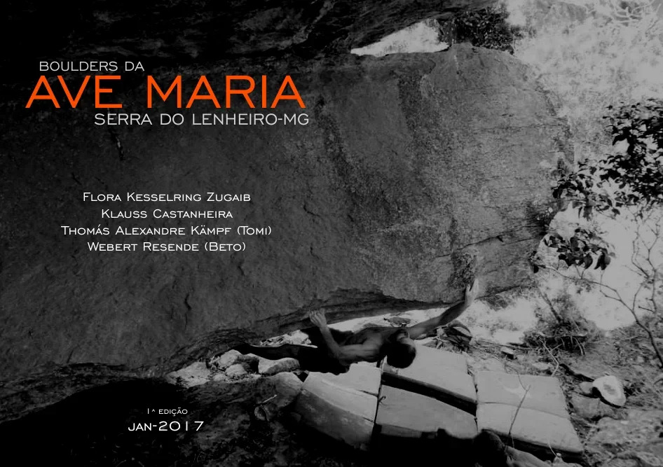 |
            | :--: |
            | *Boulders da Ave Maria - Serra do Lenheiro* |
            
            **Flora Kesselring Zugaib**  
            **Klauss Castanheira**  
            **Thomás Alexandre Kämpf (Tomi)**  
            **Webert Resende (Beto)**  
            
            1ª edição  
            jan-2017  
            
            ---
            
            # Apresentação
            
            **Por: Flora Kesselring Zugaib**
            
            Tomi e eu passamos dois anos tentando conhecer as escaladas de São João Del Rei-MG. Vamos sempre pra lá porque minha mãe mora na cidade vizinha, Tiradentes, mas não encontrávamos escaladores para nos apresentar às escaladas da região... Só em 2012 conseguimos. O escalador Claudio Matsuzaki, foi quem nos recebeu e nos apresentou o setor Ave Maria, até então um setor de vias irado, com alguns boulders abertos.
            
            Quando fomos chegando no setor vimos muitOOOs blocos e perguntávamos pra galera " lá tem boulder?" eles diziam "não"... A pergunta se repetia e a resposta também... Desfrutamos das vias, mas de olho no que tinha ao redor...
            
            No Ave Maria reencontramos um escalador que já tínhamos conhecido na Serra do Cipó, Webert (Beto) Resente "Betão", ele nos apresentou alguns bons boulders já abertos, muitos por ele inclusive, escalamos e começamos os trabalhos de abertura... Logo chamamos o casal de amigos Carlera e Paulinha, que vieram com o Christian Fernandes e Ayra. Com os amigos abrimos alguns bons boulders. Em parceria com o Beto abrimos desta vez e nos anos seguintes, até agora, 2015, mais de 100 linhas de boulders de V0 a projeto!! Linhas francas!!!
            
            Arrumando sempre a base e catalogando, o que virou um croqui "roots", que no momento mora no bloco do boulder Reza Braba, para que todos possam usar e se localizar! Fizemos isso para que não fosse aberto um boulder em cima do outro e para a informação não se perder, pois nesta modalidade quando se abre uma linha, só fica o magnésio, que a chuva lava... Em 2014 o pessoal de BH, com Felipe Alvares e Roberta Resende foram conhecer o pico e confirmaram o potencial do local!!! Tetos e negativos de Quartzito, com agarras sólidas, perfeito para ser escalado!!! Abriram mais 30 ótimas linhas.
            
            A área do setor é particular de acesso livre, para que continuemos desfrutando e outros escaladores possam conhecer, contamos com a BOA EDUCAÇÃO dos escaladores!!! Por isso cabem as regras de boa conduta!!!
            
            Mais informações sobre o setor pode ser conosco, com o Webert Beto Resende ou com o Klauss Castanheira, também parceiro nosso. Para quem quiser escalar lá e ficar por alguns dias, tem a opção de ficar no CEMONTA, área militar com toda infraestrutura, mediante a um pedido de autorização, com certo tempo de antecedência ou podem também consultar hospedagem na HOSPEDARIA CASA DA ANITA!!!
            
            Viva o Ave Maria!!! Flora e Tomi tem o apoio da Quatro Ventos, Flor Roupas Esportivas, Campo Base, Alto Estilo, Capituva Agroflorestal e Marunbeer e Hospedaria Casa da Anita!!!
  - **[2]**:
    - **uid**: Z7o5R9q53NarqA
    - **texto**: Ética e Regras
    - **destino**:
      - **secao_textual**:
        - **conteudo**:
            # ATENÇÃO
            
            Respeite a ética e regras locais:
            
            - É EXPRESSAMENTE PROIBIDO cavar, melhorar, quebrar ou adicionar agarras.
            - O Hih Ball é uma forte característica do setor. NÃO FIXE PROTEÇÕES NOS BLOCOS.
            - Utilize as trilhas existentes.
            - Traga seu lixo de volta.
            - Não corte árvores ou arranque plantas. Respeite os animais.
            - Evite fogo, fogueiras.
            
            Lembre-se, você está em uma área particular:
            
            - Trate os moradores da área com cortesia e respeito.
            - Deixe os carros e motos no espaço delimitado para estacionamento.
            - Atenção às porteiras. Se abriu feche!
            - Evite concentração de grandes grupos, e cuidado com barulho, principalmente no Nightclimb.
  - **[3]**:
    - **uid**: VoKkrjwISahAVx
    - **texto**: Como Chegar
    - **destino**:
      - **secao_textual**:
        - **conteudo**:
            # Como Chegar
            
            Em São João del Rei, saindo da Praça Frei Orlando-Centro (A), siga pela rua Padre José Maria Xavier (B) em direção à Ponte do Rosário. Vire à esquerda na Av. Gen. Osório (C) e continue pela rua São José Operário (D). Ao final desta, faça a curva à direita para rua Mario Mazoni (E). Aproximadamente 300m depois vire à direita na Paulo Severino (F) até o fim da rua virando à esquerda na Geraldo Batista Alves até a Estrada Caburu (estrada de terra) e siga sentido ao Campo Escola de Montanhismo (CEMONTA). Deixe os carros na área de estacionamento determinada e siga caminhando até o setor de escalada.
            
            | 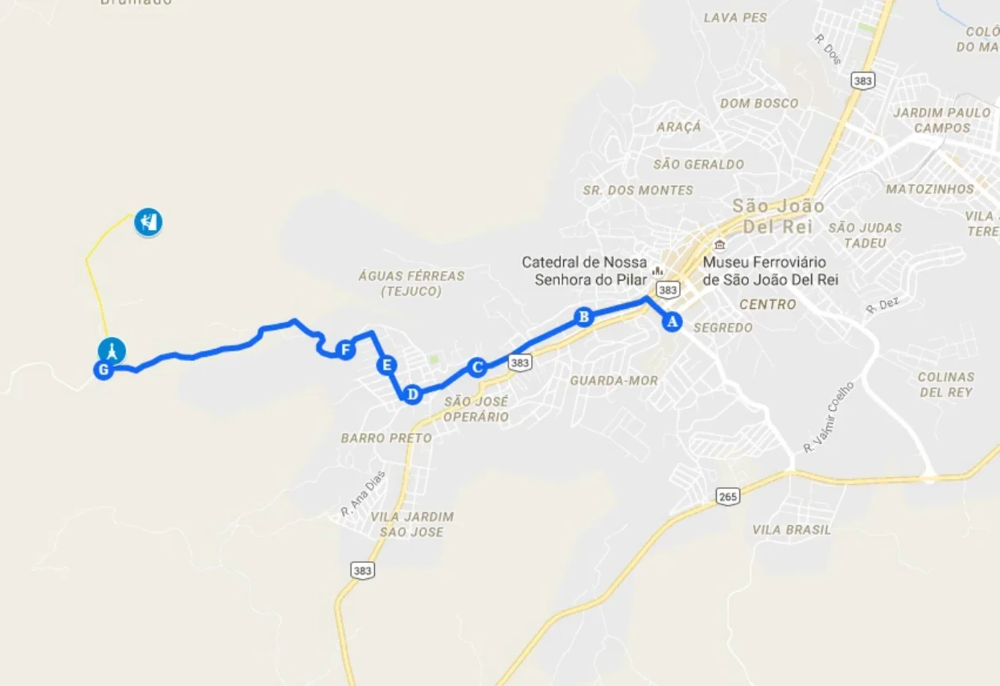 |
            | :--: |
            | *Mapa de Acesso* |
  - **[4]**:
    - **uid**: hfW2o15CJtyT99
    - **texto**: Apoiadores
    - **destino**:
      - **secao_textual**:
        - **conteudo**:
            # Apoiadores e Patrocinadores
            
            ## Quatro Ventos
            Costura especializada em montanha.
            - Contato: florabelhas@yahoo.com.br | (41) 99138-0256
            - Foto: Paola Gonçalves | Fotografia
            - Facebook: Quatro Ventos
            
            |  |
            | :--: |
            | *Quatro Ventos* |
            
            ---
            
            ## Bonier
            Equipamentos de Segurança e Resgate. Sempre na seg!
            - Website: [www.bonier.com.br](http://www.bonier.com.br)
            
            | 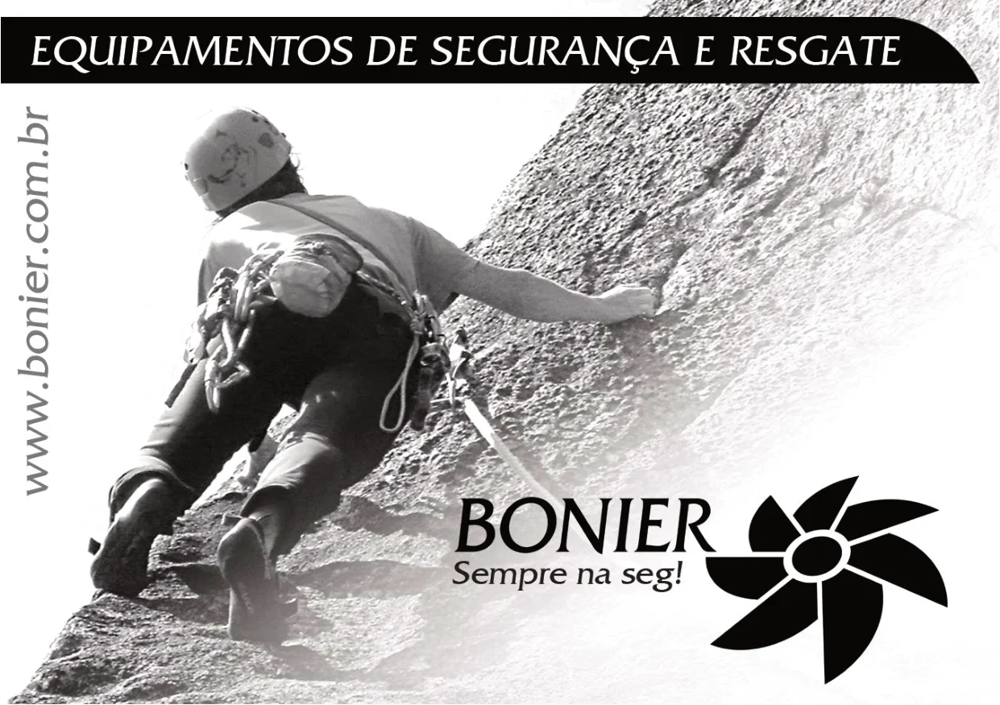 |
            | :--: |
            | *Bonier* |
            
            ---
            
            ## Alto Estilo
            Apoiando suas aventuras desde 1988.
            - Website: [www.altoestilo.com](http://www.altoestilo.com)
            
            |  |
            | :--: |
            | *Alto Estilo* |
            
            ---
            
            ## Capituva
            Produtos Ecológicos.
            - Contato: (41) 99865-7109
            
            |  |
            | :--: |
            | *Capituva* |
            
            ---
            
            ## Campo Base
            Ginásio de escalada e loja de equipamentos de aventura.
            - Website: [www.lojacampobase.com](http://www.lojacampobase.com)
            
            |  |
            | :--: |
            | *Campo Base* |
- **revisado_manualmente**: True
- **publicar_croqui**: True
- **revisado_bounding_circle**: True
- **status_desenho_extraivel**: DESENHO_EXTRAIDO

## Parte: grupo_frigideira

### Grupo (Pico: Serra do Lenheiro)

- **descricao**:
    **Bloco: Frigideira**
    Localizado à esquerda da trilha antes do muro de pedra.
    
    **Principais blocos:** O Dedo, Escondendo Leite, Barba Ruiva, Casa da Sogra, Rosquinha da Sogra.
- **nome**: Frigideira
- **uid**: mTfwQRCospbvFu
- **mapas**:
  - **[0]**:
    - **caminho_imagem_mapa**: 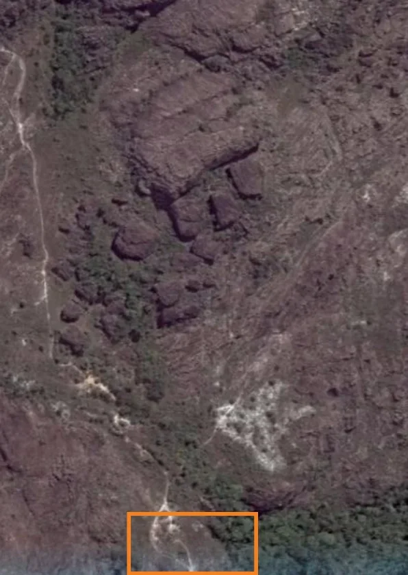
    - **largura_mapa**: 596
    - **altura_mapa**: 839
    - **pontos_de_interesse**:
      - **[0]**:
        - **id**: bJb7xVraRyvZyx
        - **uid**: bJb7xVraRyvZyx
        - **rotulo**: Bloco Frigideira
        - **retangulo**:
          - **x**: 281
          - **y**: 793
          - **comprimento**: 189
          - **largura**: 91
        - **label**: Bloco Frigideira
    - **referencias**:
      - **[0]**:
        - **alvo_uid**: mjhTMRRTRYEupM
        - **pontos_uids**:
          - bJb7xVraRyvZyx
        - **setor**: Setor Frigideira
        - **ids**:
          - bJb7xVraRyvZyx
- **setores**:
  - **[0]**:
    - **conteudo**:
      - **descricao**: 
      - **nome**: Setor Frigideira
      - **uid**: mjhTMRRTRYEupM
      - **mapas**:
        - **[0]**:
          - **caminho_imagem_mapa**: 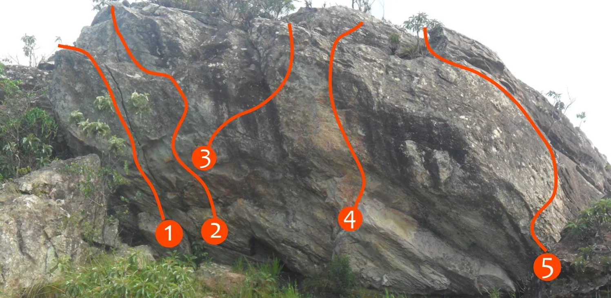
          - **largura_mapa**: 1497
          - **altura_mapa**: 731
          - **pontos_de_interesse**:
            - **[0]**:
              - **id**: LWaAcJwJdysZkL
              - **uid**: LWaAcJwJdysZkL
              - **rotulo**: 1
              - **circulo**:
                - **x**: 414
                - **y**: 574
                - **raio**: 34
              - **label**: 1
            - **[1]**:
              - **id**: HZ2Ai0822hLioK
              - **uid**: HZ2Ai0822hLioK
              - **rotulo**: 2
              - **circulo**:
                - **x**: 525
                - **y**: 568
                - **raio**: 33
              - **label**: 2
            - **[2]**:
              - **id**: zhx6e4b8hqgoLk
              - **uid**: zhx6e4b8hqgoLk
              - **rotulo**: 3
              - **circulo**:
                - **x**: 500
                - **y**: 388
                - **raio**: 31
              - **label**: 3
            - **[3]**:
              - **id**: ozo7pJ2jXMskCk
              - **uid**: ozo7pJ2jXMskCk
              - **rotulo**: 4
              - **circulo**:
                - **x**: 858
                - **y**: 537
                - **raio**: 31
              - **label**: 4
            - **[4]**:
              - **id**: JKuLpJLLaTEL0Y
              - **uid**: JKuLpJLLaTEL0Y
              - **rotulo**: 5
              - **circulo**:
                - **x**: 1341
                - **y**: 656
                - **raio**: 34
              - **label**: 5
          - **referencias**:
            - **[0]**:
              - **alvo_uid**: 2qhbyKPJTCKxKC
              - **pontos_uids**:
                - LWaAcJwJdysZkL
              - **escalada**: Fendinha
              - **ids**:
                - LWaAcJwJdysZkL
            - **[1]**:
              - **alvo_uid**: zcNkZoD2iqgHWd
              - **pontos_uids**:
                - HZ2Ai0822hLioK
              - **escalada**: Frigideira
              - **ids**:
                - HZ2Ai0822hLioK
            - **[2]**:
              - **alvo_uid**: eZE1qvDkcLI7Tl
              - **pontos_uids**:
                - zhx6e4b8hqgoLk
              - **escalada**: Teflon
              - **ids**:
                - zhx6e4b8hqgoLk
            - **[3]**:
              - **alvo_uid**: XaFalUtyD8FKjo
              - **pontos_uids**:
                - ozo7pJ2jXMskCk
              - **escalada**: Por do sol
              - **ids**:
                - ozo7pJ2jXMskCk
            - **[4]**:
              - **alvo_uid**: k7GJ29HJvjUeB3
              - **pontos_uids**:
                - JKuLpJLLaTEL0Y
              - **escalada**: Passageiros
              - **ids**:
                - JKuLpJLLaTEL0Y
      - **escaladas**:
        - **[0]**:
          - **uid**: 2qhbyKPJTCKxKC
          - **boulder**:
            - **nome**: Fendinha
            - **dificuldade**: V1
        - **[1]**:
          - **uid**: zcNkZoD2iqgHWd
          - **boulder**:
            - **descricao**: Projeto
            - **nome**: Frigideira
        - **[2]**:
          - **uid**: eZE1qvDkcLI7Tl
          - **boulder**:
            - **descricao**: Projeto
            - **nome**: Teflon
        - **[3]**:
          - **uid**: XaFalUtyD8FKjo
          - **boulder**:
            - **nome**: Por do sol
            - **dificuldade**: V3
        - **[4]**:
          - **uid**: k7GJ29HJvjUeB3
          - **boulder**:
            - **nome**: Passageiros
            - **dificuldade**: V1
      - **precomputados**:
        - **total_escaladas**: 5
        - **total_boulders**: 5
  - **[1]**:
    - **conteudo**:
      - **descricao**: 
      - **nome**: Setor Barba Ruiva
      - **uid**: msOVbYnmbHbFNG
      - **mapas**:
        - **[0]**:
          - **caminho_imagem_mapa**: 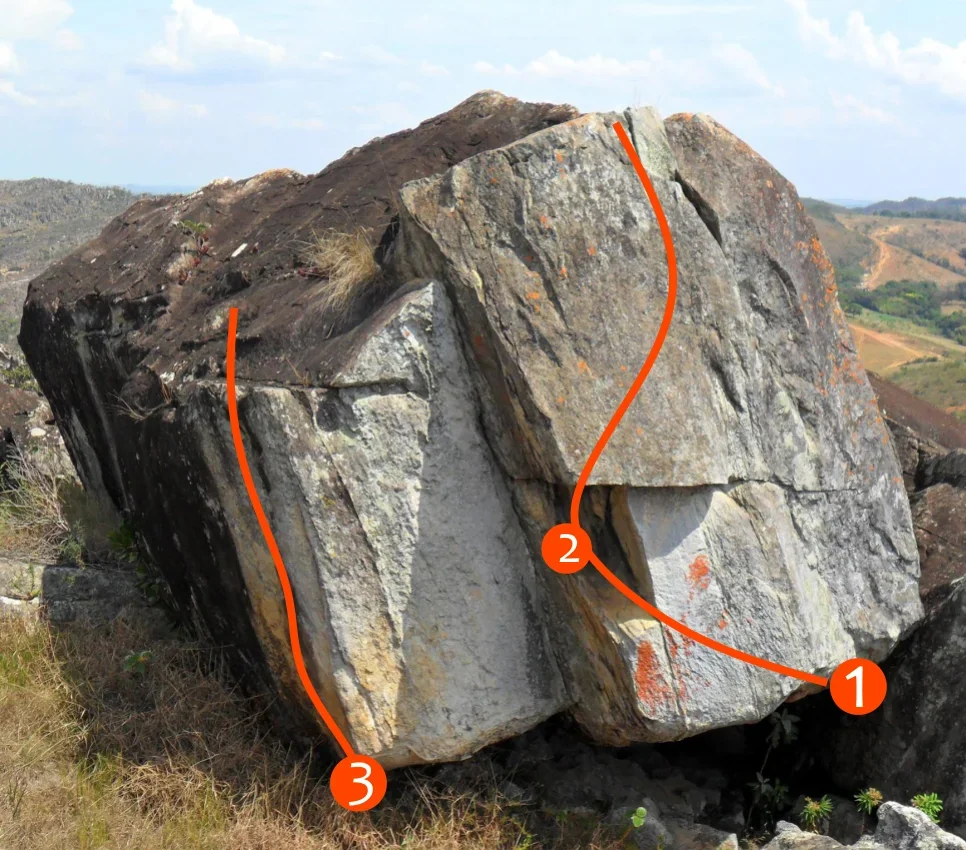
          - **largura_mapa**: 966
          - **altura_mapa**: 850
          - **pontos_de_interesse**:
            - **[0]**:
              - **id**: cXrbUyStnz6mPb
              - **uid**: cXrbUyStnz6mPb
              - **rotulo**: 1
              - **circulo**:
                - **x**: 858
                - **y**: 687
                - **raio**: 29
              - **label**: 1
            - **[1]**:
              - **id**: DZ4CApDj9zo9bV
              - **uid**: DZ4CApDj9zo9bV
              - **rotulo**: 2
              - **circulo**:
                - **x**: 567
                - **y**: 548
                - **raio**: 26
              - **label**: 2
            - **[2]**:
              - **id**: lcaCvH4Eh5zSsS
              - **uid**: lcaCvH4Eh5zSsS
              - **rotulo**: 3
              - **circulo**:
                - **x**: 359
                - **y**: 783
                - **raio**: 29
              - **label**: 3
          - **referencias**:
            - **[0]**:
              - **alvo_uid**: vIvxLYfrcfsst9
              - **pontos_uids**:
                - cXrbUyStnz6mPb
              - **escalada**: Barba Ruiva SDS
              - **ids**:
                - cXrbUyStnz6mPb
            - **[1]**:
              - **alvo_uid**: KD20dM1RQ3qYOZ
              - **pontos_uids**:
                - DZ4CApDj9zo9bV
              - **escalada**: Barba Ruiva
              - **ids**:
                - DZ4CApDj9zo9bV
            - **[2]**:
              - **alvo_uid**: YsJqgIkeNBjeBz
              - **pontos_uids**:
                - lcaCvH4Eh5zSsS
              - **escalada**: Barba Aresta
              - **ids**:
                - lcaCvH4Eh5zSsS
        - **[1]**:
          - **caminho_imagem_mapa**: 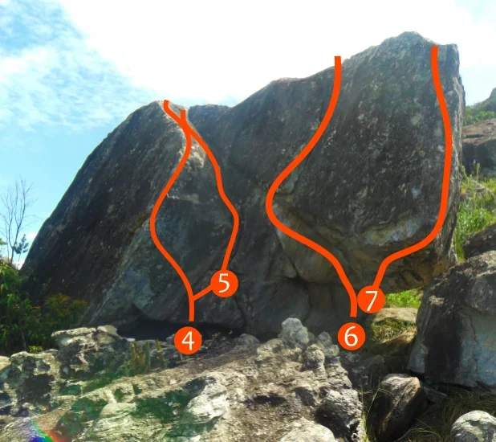
          - **largura_mapa**: 618
          - **altura_mapa**: 550
          - **pontos_de_interesse**:
            - **[0]**:
              - **id**: 1lPfn9SUaXlVGg
              - **uid**: 1lPfn9SUaXlVGg
              - **rotulo**: 4
              - **circulo**:
                - **x**: 234
                - **y**: 424
                - **raio**: 18
              - **label**: 4
            - **[1]**:
              - **id**: 6lb1yo9kdmWOAh
              - **uid**: 6lb1yo9kdmWOAh
              - **rotulo**: 5
              - **circulo**:
                - **x**: 279
                - **y**: 353
                - **raio**: 18
              - **label**: 5
            - **[2]**:
              - **id**: LJQhK9oGgHVCpJ
              - **uid**: LJQhK9oGgHVCpJ
              - **rotulo**: 6
              - **circulo**:
                - **x**: 438
                - **y**: 419
                - **raio**: 18
              - **label**: 6
            - **[3]**:
              - **id**: LHokKOgwiy90ON
              - **uid**: LHokKOgwiy90ON
              - **rotulo**: 7
              - **circulo**:
                - **x**: 463
                - **y**: 373
                - **raio**: 18
              - **label**: 7
          - **referencias**:
            - **[0]**:
              - **alvo_uid**: GCWOOFXptfrBac
              - **pontos_uids**:
                - 1lPfn9SUaXlVGg
              - **escalada**: Vira Folha
              - **ids**:
                - 1lPfn9SUaXlVGg
            - **[1]**:
              - **alvo_uid**: awPdr8vatFACua
              - **pontos_uids**:
                - 6lb1yo9kdmWOAh
              - **escalada**: Indecisão
              - **ids**:
                - 6lb1yo9kdmWOAh
            - **[2]**:
              - **alvo_uid**: A72B02F6R7qXtw
              - **pontos_uids**:
                - LJQhK9oGgHVCpJ
              - **escalada**: Revolução Feminina
              - **ids**:
                - LJQhK9oGgHVCpJ
            - **[3]**:
              - **alvo_uid**: hJw872ZCvz42WC
              - **pontos_uids**:
                - LHokKOgwiy90ON
              - **escalada**: Direitos Iguais
              - **ids**:
                - LHokKOgwiy90ON
      - **escaladas**:
        - **[0]**:
          - **uid**: vIvxLYfrcfsst9
          - **boulder**:
            - **nome**: Barba Ruiva SDS
            - **dificuldade**: V6
        - **[1]**:
          - **uid**: KD20dM1RQ3qYOZ
          - **boulder**:
            - **nome**: Barba Ruiva
            - **dificuldade**: V2
        - **[2]**:
          - **uid**: YsJqgIkeNBjeBz
          - **boulder**:
            - **nome**: Barba Aresta
            - **dificuldade**: V3
        - **[3]**:
          - **uid**: GCWOOFXptfrBac
          - **boulder**:
            - **nome**: Vira Folha
            - **dificuldade**: V2
        - **[4]**:
          - **uid**: awPdr8vatFACua
          - **boulder**:
            - **nome**: Indecisão
            - **dificuldade**: V2
        - **[5]**:
          - **uid**: A72B02F6R7qXtw
          - **boulder**:
            - **nome**: Revolução Feminina
            - **dificuldade**: V5
        - **[6]**:
          - **uid**: hJw872ZCvz42WC
          - **boulder**:
            - **nome**: Direitos Iguais
            - **dificuldade**: V6
      - **precomputados**:
        - **total_escaladas**: 7
        - **total_boulders**: 7
  - **[2]**:
    - **conteudo**:
      - **descricao**: 
      - **nome**: Setor Escondendo Leite
      - **uid**: NcIvLGbZlLw50z
      - **mapas**:
        - **[0]**:
          - **caminho_imagem_mapa**: 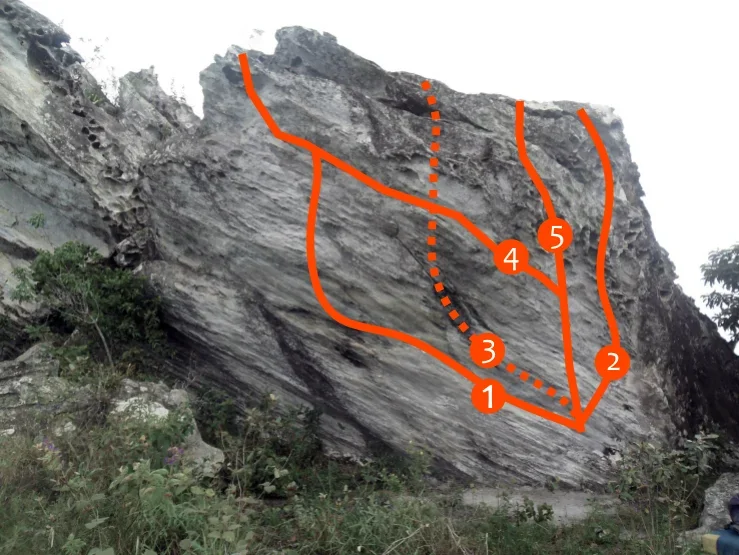
          - **largura_mapa**: 739
          - **altura_mapa**: 555
          - **pontos_de_interesse**:
            - **[0]**:
              - **id**: X6xcftbyNN9PRk
              - **uid**: X6xcftbyNN9PRk
              - **rotulo**: 01
              - **circulo**:
                - **x**: 488
                - **y**: 396
                - **raio**: 18
              - **label**: 01
            - **[1]**:
              - **id**: iYBabGzCPGjPDB
              - **uid**: iYBabGzCPGjPDB
              - **rotulo**: 02
              - **circulo**:
                - **x**: 613
                - **y**: 362
                - **raio**: 18
              - **label**: 02
            - **[2]**:
              - **id**: h4enafcdBNwA4h
              - **uid**: h4enafcdBNwA4h
              - **rotulo**: 03
              - **circulo**:
                - **x**: 488
                - **y**: 350
                - **raio**: 18
              - **label**: 03
            - **[3]**:
              - **id**: 2EMBbCNnLNtDSH
              - **uid**: 2EMBbCNnLNtDSH
              - **rotulo**: 04
              - **circulo**:
                - **x**: 511
                - **y**: 257
                - **raio**: 18
              - **label**: 04
            - **[4]**:
              - **id**: pCZRFe8KTC9ZI3
              - **uid**: pCZRFe8KTC9ZI3
              - **rotulo**: 05
              - **circulo**:
                - **x**: 555
                - **y**: 235
                - **raio**: 18
              - **label**: 05
          - **referencias**:
            - **[0]**:
              - **alvo_uid**: Tt42EOkakTcck0
              - **pontos_uids**:
                - X6xcftbyNN9PRk
              - **escalada**: Escondendo Leite
              - **ids**:
                - X6xcftbyNN9PRk
            - **[1]**:
              - **alvo_uid**: oP9XQrwfWjfPhd
              - **pontos_uids**:
                - iYBabGzCPGjPDB
              - **escalada**: Principiante
              - **ids**:
                - iYBabGzCPGjPDB
            - **[2]**:
              - **alvo_uid**: CPQNcaFo4ws3sv
              - **pontos_uids**:
                - h4enafcdBNwA4h
              - **escalada**: Tá o Néctar
              - **ids**:
                - h4enafcdBNwA4h
            - **[3]**:
              - **alvo_uid**: yEtg5JZcYRmea5
              - **pontos_uids**:
                - 2EMBbCNnLNtDSH
              - **escalada**: Leite Condensado
              - **ids**:
                - 2EMBbCNnLNtDSH
            - **[4]**:
              - **alvo_uid**: Cj0fYbs4aucBTV
              - **pontos_uids**:
                - pCZRFe8KTC9ZI3
              - **escalada**: Leite Ninho
              - **ids**:
                - pCZRFe8KTC9ZI3
      - **escaladas**:
        - **[0]**:
          - **uid**: Tt42EOkakTcck0
          - **boulder**:
            - **nome**: Escondendo Leite
            - **dificuldade**: V5
        - **[1]**:
          - **uid**: oP9XQrwfWjfPhd
          - **boulder**:
            - **nome**: Principiante
            - **dificuldade**: V0
        - **[2]**:
          - **uid**: CPQNcaFo4ws3sv
          - **boulder**:
            - **nome**: Tá o Néctar
            - **dificuldade**: V5
        - **[3]**:
          - **uid**: yEtg5JZcYRmea5
          - **boulder**:
            - **nome**: Leite Condensado
            - **dificuldade**: V5
        - **[4]**:
          - **uid**: Cj0fYbs4aucBTV
          - **boulder**:
            - **nome**: Leite Ninho
            - **dificuldade**: V3
      - **precomputados**:
        - **total_escaladas**: 5
        - **total_boulders**: 5
  - **[3]**:
    - **conteudo**:
      - **descricao**: 
      - **nome**: Setor Rosquinha da Sogra
      - **uid**: 4digHEeV3xxXiv
      - **mapas**:
        - **[0]**:
          - **caminho_imagem_mapa**: 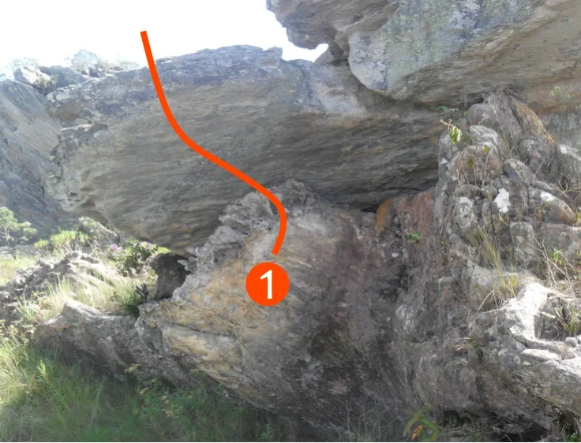
          - **largura_mapa**: 736
          - **altura_mapa**: 562
          - **pontos_de_interesse**:
            - **[0]**:
              - **id**: giMcFIJN7voj9J
              - **uid**: giMcFIJN7voj9J
              - **rotulo**: 1
              - **circulo**:
                - **x**: 339
                - **y**: 361
                - **raio**: 28
              - **label**: 1
          - **referencias**:
            - **[0]**:
              - **alvo_uid**: lDz2OK0FaXYXNi
              - **pontos_uids**:
                - giMcFIJN7voj9J
              - **escalada**: Rosquinha da Sogra
              - **ids**:
                - giMcFIJN7voj9J
      - **escaladas**:
        - **[0]**:
          - **uid**: lDz2OK0FaXYXNi
          - **boulder**:
            - **nome**: Rosquinha da Sogra
            - **dificuldade**: V2
      - **precomputados**:
        - **total_escaladas**: 1
        - **total_boulders**: 1
  - **[4]**:
    - **conteudo**:
      - **descricao**: 
      - **nome**: Setor Casa da Sogra
      - **uid**: j3Wp4AMXPaa4og
      - **mapas**:
        - **[0]**:
          - **caminho_imagem_mapa**: 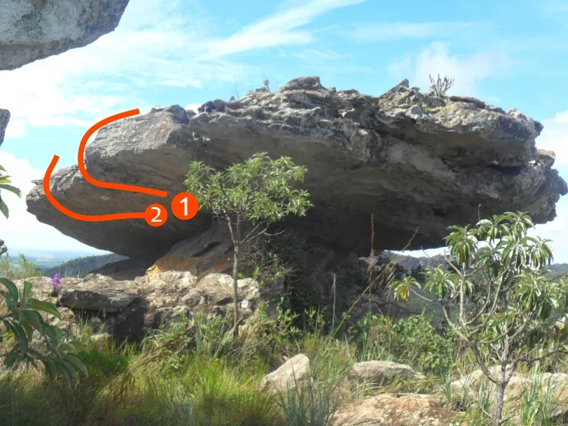
          - **largura_mapa**: 811
          - **altura_mapa**: 609
          - **pontos_de_interesse**:
            - **[0]**:
              - **id**: efZPanVjt4l7dl
              - **uid**: efZPanVjt4l7dl
              - **rotulo**: 1
              - **circulo**:
                - **x**: 264
                - **y**: 294
                - **raio**: 20
              - **label**: 1
            - **[1]**:
              - **id**: C9jmVGazQd1gX4
              - **uid**: C9jmVGazQd1gX4
              - **rotulo**: 2
              - **circulo**:
                - **x**: 223
                - **y**: 307
                - **raio**: 17
              - **label**: 2
          - **referencias**:
            - **[0]**:
              - **alvo_uid**: HZCrLxvqAxr83g
              - **pontos_uids**:
                - efZPanVjt4l7dl
              - **escalada**: Casa da Sogra
              - **ids**:
                - efZPanVjt4l7dl
            - **[1]**:
              - **alvo_uid**: qLmh2KNOl2yqMo
              - **pontos_uids**:
                - C9jmVGazQd1gX4
              - **escalada**: Energia
              - **ids**:
                - C9jmVGazQd1gX4
      - **escaladas**:
        - **[0]**:
          - **uid**: HZCrLxvqAxr83g
          - **boulder**:
            - **nome**: Casa da Sogra
            - **dificuldade**: V3
        - **[1]**:
          - **uid**: qLmh2KNOl2yqMo
          - **boulder**:
            - **nome**: Energia
            - **dificuldade**: V8
      - **precomputados**:
        - **total_escaladas**: 2
        - **total_boulders**: 2
  - **[5]**:
    - **conteudo**:
      - **descricao**: 
      - **nome**: Setor O Dedo
      - **uid**: O9shMYbO4wwfHk
      - **mapas**:
        - **[0]**:
          - **caminho_imagem_mapa**: 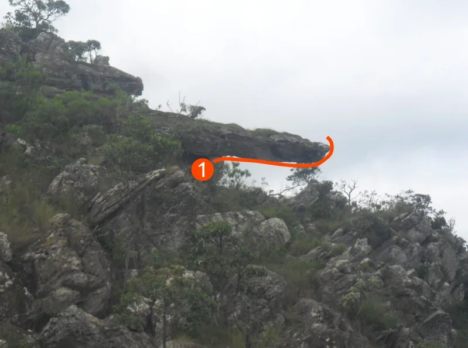
          - **largura_mapa**: 799
          - **altura_mapa**: 594
          - **pontos_de_interesse**:
            - **[0]**:
              - **id**: wtNmOGwwmeROYc
              - **uid**: wtNmOGwwmeROYc
              - **rotulo**: 1
              - **circulo**:
                - **x**: 346
                - **y**: 289
                - **raio**: 19
              - **label**: 1
          - **referencias**:
            - **[0]**:
              - **alvo_uid**: B1nUgxoeNMK8oH
              - **pontos_uids**:
                - wtNmOGwwmeROYc
              - **escalada**: O Dedo
              - **ids**:
                - wtNmOGwwmeROYc
      - **escaladas**:
        - **[0]**:
          - **uid**: B1nUgxoeNMK8oH
          - **boulder**:
            - **nome**: O Dedo
            - **dificuldade**: V1
      - **precomputados**:
        - **total_escaladas**: 1
        - **total_boulders**: 1
- **precomputados**:
  - **total_escaladas**: 21
  - **total_boulders**: 21

## Parte: grupo_reza

### Grupo (Pico: Serra do Lenheiro)

- **descricao**: **Principais blocos:** Reza, Profeta, Locomotiva, Bat-Caverna, Almadém, Busão.
- **nome**: Reza
- **uid**: av1HS7SXs2NGyy
- **mapas**:
  - **[0]**:
    - **caminho_imagem_mapa**: 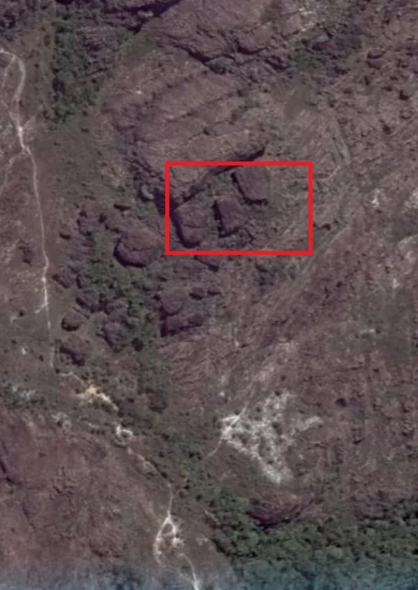
    - **largura_mapa**: 595
    - **altura_mapa**: 839
    - **pontos_de_interesse**:
      - **[0]**:
        - **id**: GOiz0aXeybkq4u
        - **uid**: GOiz0aXeybkq4u
        - **rotulo**: Reza
        - **retangulo**:
          - **x**: 340
          - **y**: 296
          - **comprimento**: 210
          - **largura**: 134
        - **label**: Reza
- **setores**:
  - **[0]**:
    - **conteudo**:
      - **descricao**: 
      - **nome**: Setor O Profeta
      - **uid**: QmZl7skoXRvunn
      - **mapas**:
        - **[0]**:
          - **caminho_imagem_mapa**: 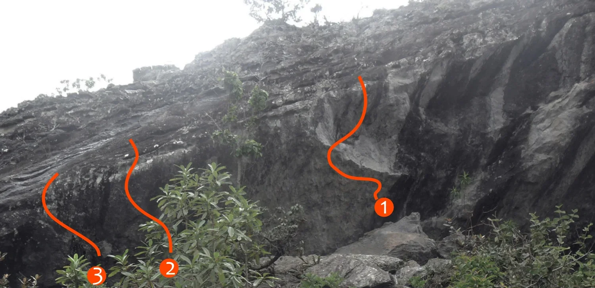
          - **largura_mapa**: 1500
          - **altura_mapa**: 727
          - **pontos_de_interesse**:
            - **[0]**:
              - **id**: d9xKgaIhYYcFNM
              - **uid**: d9xKgaIhYYcFNM
              - **rotulo**: 1
              - **circulo**:
                - **x**: 968
                - **y**: 523
                - **raio**: 24
              - **label**: 1
            - **[1]**:
              - **id**: 4o1g6JRVdtPlas
              - **uid**: 4o1g6JRVdtPlas
              - **rotulo**: 2
              - **circulo**:
                - **x**: 426
                - **y**: 676
                - **raio**: 24
              - **label**: 2
            - **[2]**:
              - **id**: EwGHLyKQKNOqmD
              - **uid**: EwGHLyKQKNOqmD
              - **rotulo**: 3
              - **circulo**:
                - **x**: 243
                - **y**: 695
                - **raio**: 24
              - **label**: 3
          - **referencias**:
            - **[0]**:
              - **alvo_uid**: 1N9kVG6c7WyxSi
              - **pontos_uids**:
                - d9xKgaIhYYcFNM
              - **escalada**: O Profeta
              - **ids**:
                - d9xKgaIhYYcFNM
            - **[1]**:
              - **alvo_uid**: CP3FjWHMY69ivC
              - **pontos_uids**:
                - 4o1g6JRVdtPlas
              - **escalada**: Êxodos
              - **ids**:
                - 4o1g6JRVdtPlas
            - **[2]**:
              - **alvo_uid**: 8YTtnmSvIVKDGe
              - **pontos_uids**:
                - EwGHLyKQKNOqmD
              - **escalada**: Maomé
              - **ids**:
                - EwGHLyKQKNOqmD
      - **escaladas**:
        - **[0]**:
          - **uid**: 1N9kVG6c7WyxSi
          - **boulder**:
            - **nome**: O Profeta
            - **dificuldade**: V4
        - **[1]**:
          - **uid**: CP3FjWHMY69ivC
          - **boulder**:
            - **nome**: Êxodos
            - **dificuldade**: V7
        - **[2]**:
          - **uid**: 8YTtnmSvIVKDGe
          - **boulder**:
            - **descricao**: Projeto
            - **nome**: Maomé
            - **dificuldade**: INDEFINIDO
      - **precomputados**:
        - **total_escaladas**: 3
        - **total_boulders**: 3
  - **[1]**:
    - **conteudo**:
      - **descricao**: 
      - **nome**: Setor Reza
      - **uid**: WawtekZcKgAb5I
      - **mapas**:
        - **[0]**:
          - **caminho_imagem_mapa**: 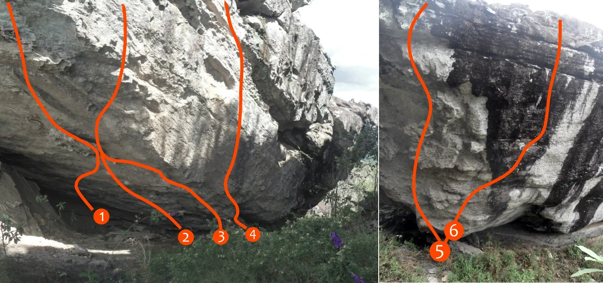
          - **largura_mapa**: 1513
          - **altura_mapa**: 712
          - **pontos_de_interesse**:
            - **[0]**:
              - **id**: 3Fec0nII1QMcHC
              - **uid**: 3Fec0nII1QMcHC
              - **rotulo**: 1
              - **circulo**:
                - **x**: 254
                - **y**: 545
                - **raio**: 20
              - **label**: 1
            - **[1]**:
              - **id**: P8UbIqr28Pwcvu
              - **uid**: P8UbIqr28Pwcvu
              - **rotulo**: 2
              - **circulo**:
                - **x**: 466
                - **y**: 597
                - **raio**: 20
              - **label**: 2
            - **[2]**:
              - **id**: Y5Kwg2PZ3Nwv8o
              - **uid**: Y5Kwg2PZ3Nwv8o
              - **rotulo**: 3
              - **circulo**:
                - **x**: 554
                - **y**: 596
                - **raio**: 20
              - **label**: 3
            - **[3]**:
              - **id**: KkOG6H7BHylSwO
              - **uid**: KkOG6H7BHylSwO
              - **rotulo**: 4
              - **circulo**:
                - **x**: 634
                - **y**: 589
                - **raio**: 19
              - **label**: 4
            - **[4]**:
              - **id**: KelirNRIglgX1p
              - **uid**: KelirNRIglgX1p
              - **rotulo**: 5
              - **circulo**:
                - **x**: 1104
                - **y**: 631
                - **raio**: 26
              - **label**: 5
            - **[5]**:
              - **id**: 1gPOGG2kLtp0vb
              - **uid**: 1gPOGG2kLtp0vb
              - **rotulo**: 6
              - **circulo**:
                - **x**: 1138
                - **y**: 581
                - **raio**: 25
              - **label**: 6
          - **referencias**:
            - **[0]**:
              - **alvo_uid**: sejRQoz9QyermH
              - **pontos_uids**:
                - 3Fec0nII1QMcHC
              - **escalada**: Rezando pra São Longuinho
              - **ids**:
                - 3Fec0nII1QMcHC
            - **[1]**:
              - **alvo_uid**: Co8rg9lkhJJhLq
              - **pontos_uids**:
                - P8UbIqr28Pwcvu
              - **escalada**: Reza Forte
              - **ids**:
                - P8UbIqr28Pwcvu
            - **[2]**:
              - **alvo_uid**: jsFal6nx7F9zYB
              - **pontos_uids**:
                - Y5Kwg2PZ3Nwv8o
              - **escalada**: Reza Braba
              - **ids**:
                - Y5Kwg2PZ3Nwv8o
            - **[3]**:
              - **alvo_uid**: 0kZigjb4mDm1IX
              - **pontos_uids**:
                - KkOG6H7BHylSwO
              - **escalada**: Padre Nosso
              - **ids**:
                - KkOG6H7BHylSwO
            - **[4]**:
              - **alvo_uid**: 692YObRDBb4TN3
              - **pontos_uids**:
                - KelirNRIglgX1p
              - **escalada**: Reza Fria
              - **ids**:
                - KelirNRIglgX1p
            - **[5]**:
              - **alvo_uid**: QXHLiDW0ZiGagb
              - **pontos_uids**:
                - 1gPOGG2kLtp0vb
              - **escalada**: Ave Maria
              - **ids**:
                - 1gPOGG2kLtp0vb
      - **escaladas**:
        - **[0]**:
          - **uid**: sejRQoz9QyermH
          - **boulder**:
            - **nome**: Rezando pra São Longuinho
            - **dificuldade**: V2
        - **[1]**:
          - **uid**: Co8rg9lkhJJhLq
          - **boulder**:
            - **nome**: Reza Forte
            - **dificuldade**: V7
        - **[2]**:
          - **uid**: jsFal6nx7F9zYB
          - **boulder**:
            - **nome**: Reza Braba
            - **dificuldade**: V9
        - **[3]**:
          - **uid**: 0kZigjb4mDm1IX
          - **boulder**:
            - **nome**: Padre Nosso
            - **dificuldade**: V1
        - **[4]**:
          - **uid**: 692YObRDBb4TN3
          - **boulder**:
            - **nome**: Reza Fria
            - **dificuldade**: V6
        - **[5]**:
          - **uid**: QXHLiDW0ZiGagb
          - **boulder**:
            - **nome**: Ave Maria
            - **dificuldade**: V7
      - **precomputados**:
        - **total_escaladas**: 6
        - **total_boulders**: 6
  - **[2]**:
    - **conteudo**:
      - **descricao**: 
      - **nome**: Setor Locomotiva
      - **uid**: EukNxu39n3k6EU
      - **mapas**:
        - **[0]**:
          - **caminho_imagem_mapa**: 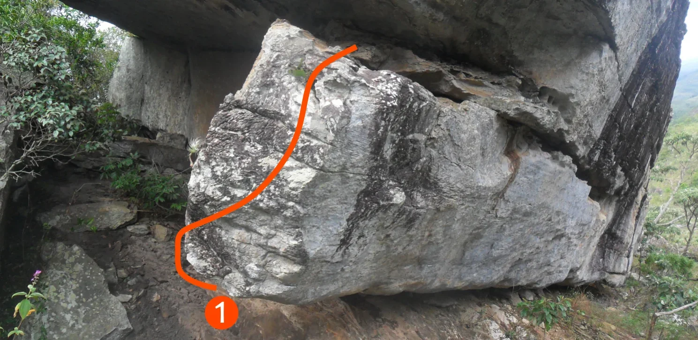
          - **largura_mapa**: 1489
          - **altura_mapa**: 726
          - **pontos_de_interesse**:
            - **[0]**:
              - **id**: 6NwW8ASp3TmHax
              - **uid**: 6NwW8ASp3TmHax
              - **rotulo**: 1
              - **circulo**:
                - **x**: 473
                - **y**: 667
                - **raio**: 36
              - **label**: 1
          - **referencias**:
            - **[0]**:
              - **alvo_uid**: 12sZVM6ddCAZKA
              - **pontos_uids**:
                - 6NwW8ASp3TmHax
              - **escalada**: Compressão
              - **ids**:
                - 6NwW8ASp3TmHax
        - **[1]**:
          - **caminho_imagem_mapa**: 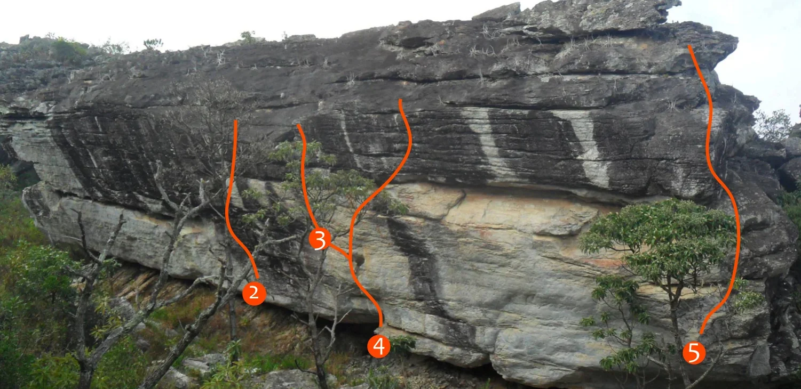
          - **largura_mapa**: 1501
          - **altura_mapa**: 730
          - **pontos_de_interesse**:
            - **[0]**:
              - **id**: q2g5hisJkefa4U
              - **uid**: q2g5hisJkefa4U
              - **rotulo**: 2
              - **circulo**:
                - **x**: 476
                - **y**: 551
                - **raio**: 23
              - **label**: 2
            - **[1]**:
              - **id**: hlyTHLiUolVec4
              - **uid**: hlyTHLiUolVec4
              - **rotulo**: 3
              - **circulo**:
                - **x**: 599
                - **y**: 448
                - **raio**: 22
              - **label**: 3
            - **[2]**:
              - **id**: AgB315uKlKnRjt
              - **uid**: AgB315uKlKnRjt
              - **rotulo**: 4
              - **circulo**:
                - **x**: 710
                - **y**: 650
                - **raio**: 22
              - **label**: 4
            - **[3]**:
              - **id**: xUvhYpDTSORHG0
              - **uid**: xUvhYpDTSORHG0
              - **rotulo**: 5
              - **circulo**:
                - **x**: 1301
                - **y**: 662
                - **raio**: 22
              - **label**: 5
          - **referencias**:
            - **[0]**:
              - **alvo_uid**: w413mJeCw6bB95
              - **pontos_uids**:
                - q2g5hisJkefa4U
              - **escalada**: Locomotiva
              - **ids**:
                - q2g5hisJkefa4U
            - **[1]**:
              - **alvo_uid**: g4DU0VfIFZvBDL
              - **pontos_uids**:
                - hlyTHLiUolVec4
              - **escalada**: Buraco
              - **ids**:
                - hlyTHLiUolVec4
            - **[2]**:
              - **alvo_uid**: iWjmPjJJ1r19NM
              - **pontos_uids**:
                - AgB315uKlKnRjt
              - **escalada**: Projeto (Locomotiva)
              - **ids**:
                - AgB315uKlKnRjt
            - **[3]**:
              - **alvo_uid**: qZPC3JCSBUQb3u
              - **pontos_uids**:
                - xUvhYpDTSORHG0
              - **escalada**: Desayuno
              - **ids**:
                - xUvhYpDTSORHG0
      - **escaladas**:
        - **[0]**:
          - **uid**: 12sZVM6ddCAZKA
          - **boulder**:
            - **nome**: Compressão
            - **dificuldade**: V9
        - **[1]**:
          - **uid**: w413mJeCw6bB95
          - **boulder**:
            - **nome**: Locomotiva
            - **dificuldade**: V7
        - **[2]**:
          - **uid**: g4DU0VfIFZvBDL
          - **boulder**:
            - **nome**: Buraco
            - **dificuldade**: V5
        - **[3]**:
          - **uid**: iWjmPjJJ1r19NM
          - **boulder**:
            - **nome**: Projeto (Locomotiva)
        - **[4]**:
          - **uid**: qZPC3JCSBUQb3u
          - **boulder**:
            - **nome**: Desayuno
            - **dificuldade**: V4
      - **precomputados**:
        - **total_escaladas**: 5
        - **total_boulders**: 5
  - **[3]**:
    - **conteudo**:
      - **descricao**: 
      - **nome**: Setor Batcaverna
      - **uid**: 5B86oNOyol7VlK
      - **mapas**:
        - **[0]**:
          - **caminho_imagem_mapa**: 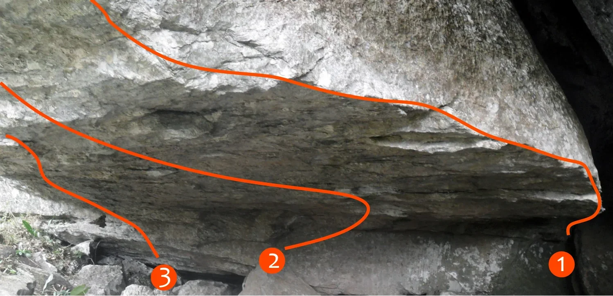
          - **largura_mapa**: 1498
          - **altura_mapa**: 726
          - **pontos_de_interesse**:
            - **[0]**:
              - **id**: eKzUwx2pfdsD2e
              - **uid**: eKzUwx2pfdsD2e
              - **rotulo**: 1
              - **circulo**:
                - **x**: 1372
                - **y**: 648
                - **raio**: 32
              - **label**: 1
            - **[1]**:
              - **id**: qTXm2W1cpeceRX
              - **uid**: qTXm2W1cpeceRX
              - **rotulo**: 2
              - **circulo**:
                - **x**: 664
                - **y**: 639
                - **raio**: 32
              - **label**: 2
            - **[2]**:
              - **id**: hwBoMLg22PhEtW
              - **uid**: hwBoMLg22PhEtW
              - **rotulo**: 3
              - **circulo**:
                - **x**: 400
                - **y**: 680
                - **raio**: 32
              - **label**: 3
          - **referencias**:
            - **[0]**:
              - **alvo_uid**: WFtP9OBCOtL1FS
              - **pontos_uids**:
                - eKzUwx2pfdsD2e
              - **escalada**: Batman Também Fuma
              - **ids**:
                - eKzUwx2pfdsD2e
            - **[1]**:
              - **alvo_uid**: 1nrEaENNT8In1R
              - **pontos_uids**:
                - qTXm2W1cpeceRX
              - **escalada**: Mulher Gato
              - **ids**:
                - qTXm2W1cpeceRX
            - **[2]**:
              - **alvo_uid**: GgmWn9q2FZwSTz
              - **pontos_uids**:
                - hwBoMLg22PhEtW
              - **escalada**: Robin Larica
              - **ids**:
                - hwBoMLg22PhEtW
      - **escaladas**:
        - **[0]**:
          - **uid**: WFtP9OBCOtL1FS
          - **boulder**:
            - **nome**: Batman Também Fuma
            - **dificuldade**: V4
        - **[1]**:
          - **uid**: 1nrEaENNT8In1R
          - **boulder**:
            - **nome**: Mulher Gato
            - **dificuldade**: V7
        - **[2]**:
          - **uid**: GgmWn9q2FZwSTz
          - **boulder**:
            - **nome**: Robin Larica
            - **dificuldade**: V4
      - **precomputados**:
        - **total_escaladas**: 3
        - **total_boulders**: 3
  - **[4]**:
    - **conteudo**:
      - **descricao**: (Face da Batcaverna)
      - **nome**: Setor Apoio Resende
      - **uid**: 9rTp4J89URZRPy
      - **mapas**:
        - **[0]**:
          - **caminho_imagem_mapa**: 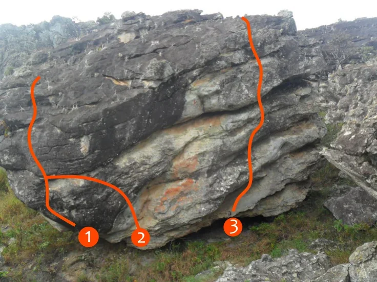
          - **largura_mapa**: 736
          - **altura_mapa**: 552
          - **pontos_de_interesse**:
            - **[0]**:
              - **id**: 6Qbotfl9SKgABd
              - **uid**: 6Qbotfl9SKgABd
              - **rotulo**: 1
              - **circulo**:
                - **x**: 173
                - **y**: 464
                - **raio**: 20
              - **label**: 1
            - **[1]**:
              - **id**: XdvJggNiQKYqTJ
              - **uid**: XdvJggNiQKYqTJ
              - **rotulo**: 2
              - **circulo**:
                - **x**: 275
                - **y**: 465
                - **raio**: 19
              - **label**: 2
            - **[2]**:
              - **id**: wUhteHAWEX7lrH
              - **uid**: wUhteHAWEX7lrH
              - **rotulo**: 3
              - **circulo**:
                - **x**: 455
                - **y**: 445
                - **raio**: 19
              - **label**: 3
          - **referencias**:
            - **[0]**:
              - **alvo_uid**: LR8OVGMxFlY0ir
              - **pontos_uids**:
                - 6Qbotfl9SKgABd
              - **escalada**: Apoio Resende
              - **ids**:
                - 6Qbotfl9SKgABd
            - **[1]**:
              - **alvo_uid**: rHRCMkC2mZZnqq
              - **pontos_uids**:
                - XdvJggNiQKYqTJ
              - **escalada**: Ranca Couro
              - **ids**:
                - XdvJggNiQKYqTJ
            - **[2]**:
              - **alvo_uid**: A4LmlMUUOv0BUb
              - **pontos_uids**:
                - wUhteHAWEX7lrH
              - **escalada**: Sagarana
              - **ids**:
                - wUhteHAWEX7lrH
      - **escaladas**:
        - **[0]**:
          - **uid**: LR8OVGMxFlY0ir
          - **boulder**:
            - **nome**: Apoio Resende
            - **dificuldade**: V2
        - **[1]**:
          - **uid**: rHRCMkC2mZZnqq
          - **boulder**:
            - **descricao**: Projeto
            - **nome**: Ranca Couro
            - **dificuldade**: INDEFINIDO
        - **[2]**:
          - **uid**: A4LmlMUUOv0BUb
          - **boulder**:
            - **nome**: Sagarana
            - **dificuldade**: V6
      - **precomputados**:
        - **total_escaladas**: 3
        - **total_boulders**: 3
  - **[5]**:
    - **conteudo**:
      - **descricao**: 
      - **nome**: Setor Busão
      - **uid**: eiipF4wsDuczUd
      - **mapas**:
        - **[0]**:
          - **caminho_imagem_mapa**: 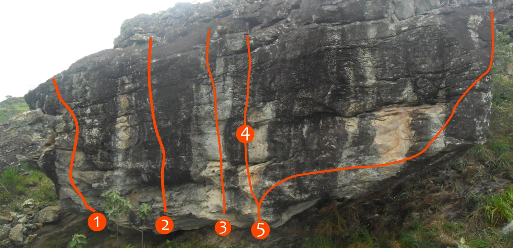
          - **largura_mapa**: 1495
          - **altura_mapa**: 724
          - **pontos_de_interesse**:
            - **[0]**:
              - **id**: BgTPPZT2isX7PY
              - **uid**: BgTPPZT2isX7PY
              - **rotulo**: 1
              - **circulo**:
                - **x**: 283
                - **y**: 648
                - **raio**: 27
              - **label**: 1
            - **[1]**:
              - **id**: tJNBswc4lpw6mn
              - **uid**: tJNBswc4lpw6mn
              - **rotulo**: 2
              - **circulo**:
                - **x**: 479
                - **y**: 657
                - **raio**: 27
              - **label**: 2
            - **[2]**:
              - **id**: PaSpuk4CWymXGh
              - **uid**: PaSpuk4CWymXGh
              - **rotulo**: 3
              - **circulo**:
                - **x**: 650
                - **y**: 664
                - **raio**: 24
              - **label**: 3
            - **[3]**:
              - **id**: Kmsg5lfvRakSMM
              - **uid**: Kmsg5lfvRakSMM
              - **rotulo**: 4
              - **circulo**:
                - **x**: 715
                - **y**: 391
                - **raio**: 27
              - **label**: 4
            - **[4]**:
              - **id**: Ul5hPtamjpt8CM
              - **uid**: Ul5hPtamjpt8CM
              - **rotulo**: 5
              - **circulo**:
                - **x**: 759
                - **y**: 671
                - **raio**: 27
              - **label**: 5
          - **referencias**:
            - **[0]**:
              - **alvo_uid**: 0u32jMw8OxHJCZ
              - **pontos_uids**:
                - BgTPPZT2isX7PY
              - **escalada**: Miranda
              - **ids**:
                - BgTPPZT2isX7PY
            - **[1]**:
              - **alvo_uid**: lXRXXCZeXJyC79
              - **pontos_uids**:
                - tJNBswc4lpw6mn
              - **escalada**: Projeto 2
              - **ids**:
                - tJNBswc4lpw6mn
            - **[2]**:
              - **alvo_uid**: 6D35eCoWGvKfN7
              - **pontos_uids**:
                - PaSpuk4CWymXGh
              - **escalada**: Projeto 3
              - **ids**:
                - PaSpuk4CWymXGh
            - **[3]**:
              - **alvo_uid**: cBWRjQPcV0VZ8G
              - **pontos_uids**:
                - Kmsg5lfvRakSMM
              - **escalada**: 8 de Março
              - **ids**:
                - Kmsg5lfvRakSMM
            - **[4]**:
              - **alvo_uid**: ydPQqO0svBBeiF
              - **pontos_uids**:
                - Ul5hPtamjpt8CM
              - **escalada**: 21 de Abril
              - **ids**:
                - Ul5hPtamjpt8CM
        - **[1]**:
          - **caminho_imagem_mapa**: 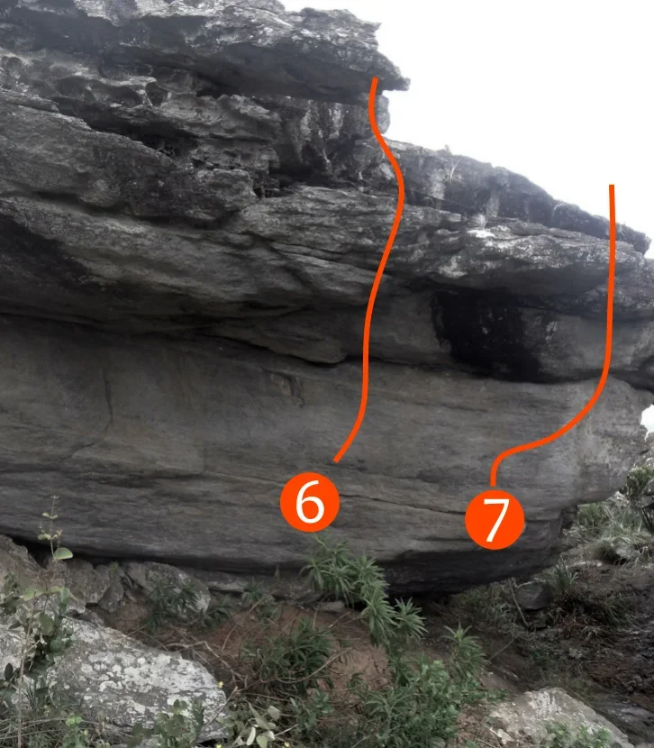
          - **largura_mapa**: 726
          - **altura_mapa**: 830
          - **pontos_de_interesse**:
            - **[0]**:
              - **id**: w78uHYy4NeLIwM
              - **uid**: w78uHYy4NeLIwM
              - **rotulo**: 6
              - **circulo**:
                - **x**: 344
                - **y**: 557
                - **raio**: 33
              - **label**: 6
            - **[1]**:
              - **id**: LANc22vlEgKD9S
              - **uid**: LANc22vlEgKD9S
              - **rotulo**: 7
              - **circulo**:
                - **x**: 549
                - **y**: 577
                - **raio**: 33
              - **label**: 7
          - **referencias**:
            - **[0]**:
              - **alvo_uid**: h2Yu8UyIkdbefS
              - **pontos_uids**:
                - w78uHYy4NeLIwM
              - **escalada**: Clichê
              - **ids**:
                - w78uHYy4NeLIwM
            - **[1]**:
              - **alvo_uid**: bFwUTiTfQISF1e
              - **pontos_uids**:
                - LANc22vlEgKD9S
              - **escalada**: Plágio
              - **ids**:
                - LANc22vlEgKD9S
        - **[2]**:
          - **caminho_imagem_mapa**: 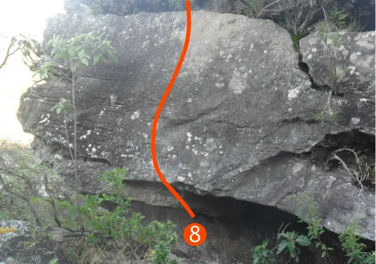
          - **largura_mapa**: 735
          - **altura_mapa**: 517
          - **pontos_de_interesse**:
            - **[0]**:
              - **id**: jGDLTVLCKcFCju
              - **uid**: jGDLTVLCKcFCju
              - **rotulo**: 8
              - **circulo**:
                - **x**: 381
                - **y**: 459
                - **raio**: 23
              - **label**: 8
          - **referencias**:
            - **[0]**:
              - **alvo_uid**: 3K0ipSXRT8Kv6o
              - **pontos_uids**:
                - jGDLTVLCKcFCju
              - **escalada**: Mancha Cinza
              - **ids**:
                - jGDLTVLCKcFCju
      - **escaladas**:
        - **[0]**:
          - **uid**: 0u32jMw8OxHJCZ
          - **boulder**:
            - **nome**: Miranda
            - **dificuldade**: V2
        - **[1]**:
          - **uid**: lXRXXCZeXJyC79
          - **boulder**:
            - **descricao**: Projeto
            - **nome**: Projeto 2
        - **[2]**:
          - **uid**: 6D35eCoWGvKfN7
          - **boulder**:
            - **descricao**: Projeto
            - **nome**: Projeto 3
        - **[3]**:
          - **uid**: cBWRjQPcV0VZ8G
          - **boulder**:
            - **nome**: 8 de Março
            - **dificuldade**: V3
        - **[4]**:
          - **uid**: ydPQqO0svBBeiF
          - **boulder**:
            - **nome**: 21 de Abril
            - **dificuldade**: V5
        - **[5]**:
          - **uid**: h2Yu8UyIkdbefS
          - **boulder**:
            - **descricao**: Projeto
            - **nome**: Clichê
        - **[6]**:
          - **uid**: bFwUTiTfQISF1e
          - **boulder**:
            - **nome**: Plágio
            - **dificuldade**: V5
        - **[7]**:
          - **uid**: 3K0ipSXRT8Kv6o
          - **boulder**:
            - **nome**: Mancha Cinza
            - **dificuldade**: V3
      - **precomputados**:
        - **total_escaladas**: 8
        - **total_boulders**: 8
  - **[6]**:
    - **conteudo**:
      - **descricao**: 
      - **nome**: Setor Almadém
      - **uid**: mn1SfA1bjNHJut
      - **mapas**:
        - **[0]**:
          - **caminho_imagem_mapa**: 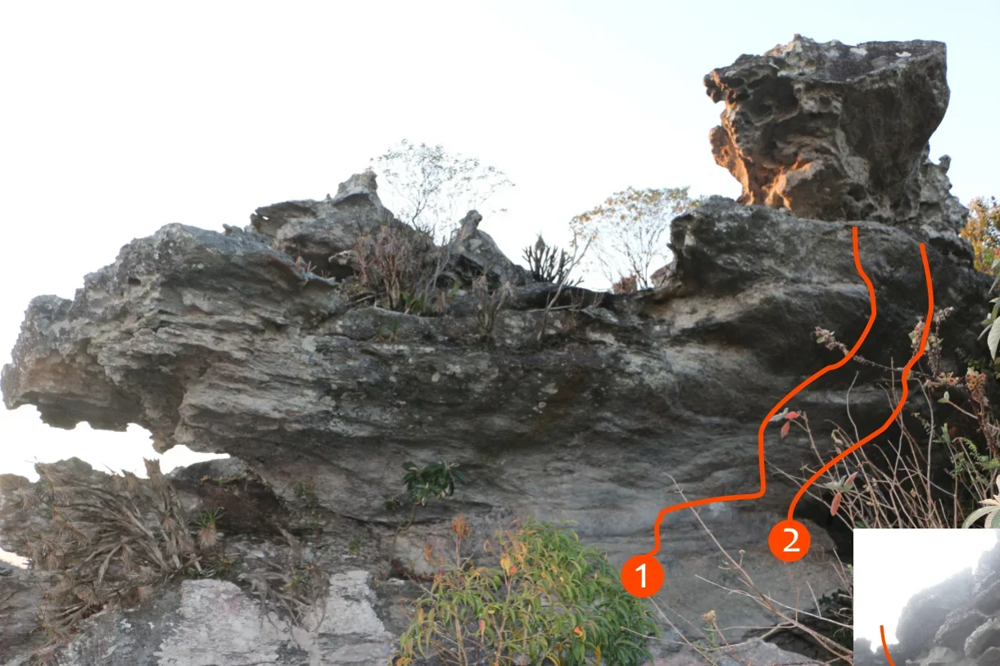
          - **largura_mapa**: 1221
          - **altura_mapa**: 814
          - **pontos_de_interesse**:
            - **[0]**:
              - **id**: YL1EH6IZkalKgy
              - **uid**: YL1EH6IZkalKgy
              - **rotulo**: 1
              - **circulo**:
                - **x**: 784
                - **y**: 704
                - **raio**: 26
              - **label**: 1
            - **[1]**:
              - **id**: QtUObTzYRUbRsH
              - **uid**: QtUObTzYRUbRsH
              - **rotulo**: 2
              - **circulo**:
                - **x**: 964
                - **y**: 661
                - **raio**: 26
              - **label**: 2
          - **referencias**:
            - **[0]**:
              - **alvo_uid**: IBFjVeOle6gf2x
              - **pontos_uids**:
                - YL1EH6IZkalKgy
              - **escalada**: Siriema
              - **ids**:
                - YL1EH6IZkalKgy
            - **[1]**:
              - **alvo_uid**: LfOldz5M6pAOH4
              - **pontos_uids**:
                - QtUObTzYRUbRsH
              - **escalada**: Mil Grau
              - **ids**:
                - QtUObTzYRUbRsH
        - **[1]**:
          - **caminho_imagem_mapa**: 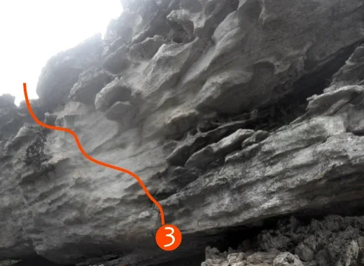
          - **largura_mapa**: 520
          - **altura_mapa**: 379
          - **pontos_de_interesse**:
            - **[0]**:
              - **id**: 9gjxCgCorZr9Xj
              - **uid**: 9gjxCgCorZr9Xj
              - **rotulo**: 3
              - **circulo**:
                - **x**: 241
                - **y**: 338
                - **raio**: 19
              - **label**: 3
          - **referencias**:
            - **[0]**:
              - **alvo_uid**: fdVtqneHTzepOT
              - **pontos_uids**:
                - 9gjxCgCorZr9Xj
              - **escalada**: Almadém
              - **ids**:
                - 9gjxCgCorZr9Xj
      - **escaladas**:
        - **[0]**:
          - **uid**: IBFjVeOle6gf2x
          - **boulder**:
            - **nome**: Siriema
            - **dificuldade**: V7
        - **[1]**:
          - **uid**: LfOldz5M6pAOH4
          - **boulder**:
            - **nome**: Mil Grau
            - **dificuldade**: V4
        - **[2]**:
          - **uid**: fdVtqneHTzepOT
          - **boulder**:
            - **nome**: Almadém
            - **dificuldade**: V4
      - **precomputados**:
        - **total_escaladas**: 3
        - **total_boulders**: 3
  - **[7]**:
    - **conteudo**:
      - **descricao**: 
      - **nome**: Setor Lek Pression
      - **uid**: PHpzXazAW8J5RO
      - **mapas**:
        - **[0]**:
          - **caminho_imagem_mapa**: 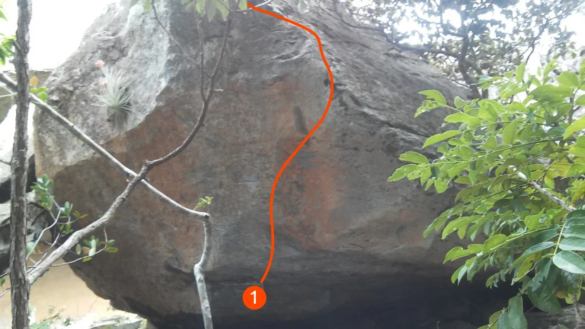
          - **largura_mapa**: 1294
          - **altura_mapa**: 729
          - **pontos_de_interesse**:
            - **[0]**:
              - **id**: RKFCPjyawfD90w
              - **uid**: RKFCPjyawfD90w
              - **rotulo**: 1
              - **circulo**:
                - **x**: 563
                - **y**: 660
                - **raio**: 27
              - **label**: 1
          - **referencias**:
            - **[0]**:
              - **alvo_uid**: z2fzSXWNVvyjWO
              - **pontos_uids**:
                - RKFCPjyawfD90w
              - **escalada**: Lek Pression
              - **ids**:
                - RKFCPjyawfD90w
      - **escaladas**:
        - **[0]**:
          - **uid**: z2fzSXWNVvyjWO
          - **boulder**:
            - **nome**: Lek Pression
            - **dificuldade**: V7
      - **precomputados**:
        - **total_escaladas**: 1
        - **total_boulders**: 1
- **precomputados**:
  - **total_escaladas**: 32
  - **total_boulders**: 32

## Parte: grupo_laranjinha

### Grupo (Pico: Serra do Lenheiro)

- **descricao**: **Principais blocos:** Laranjinha, Unha de Gato, Boca de Tubarão, Matsuzaki, Embutidos.
- **nome**: Laranjinha
- **uid**: egMiYDg1rPsLBu
- **mapas**:
  - **[0]**:
    - **caminho_imagem_mapa**: 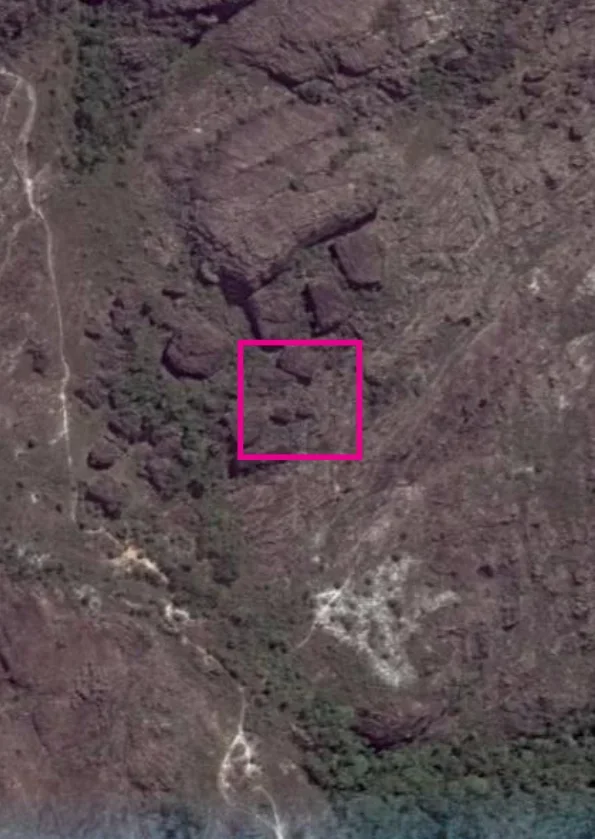
    - **largura_mapa**: 595
    - **altura_mapa**: 839
    - **pontos_de_interesse**:
      - **[0]**:
        - **id**: fVeO3NUfekG1x2
        - **uid**: fVeO3NUfekG1x2
        - **rotulo**: Laranjinha
        - **retangulo**:
          - **x**: 300
          - **y**: 400
          - **comprimento**: 130
          - **largura**: 124
        - **label**: Laranjinha
- **setores**:
  - **[0]**:
    - **conteudo**:
      - **descricao**: 
      - **nome**: Setor Matsuzaki
      - **uid**: lyJ9wythLTiXh7
      - **mapas**:
        - **[0]**:
          - **caminho_imagem_mapa**: 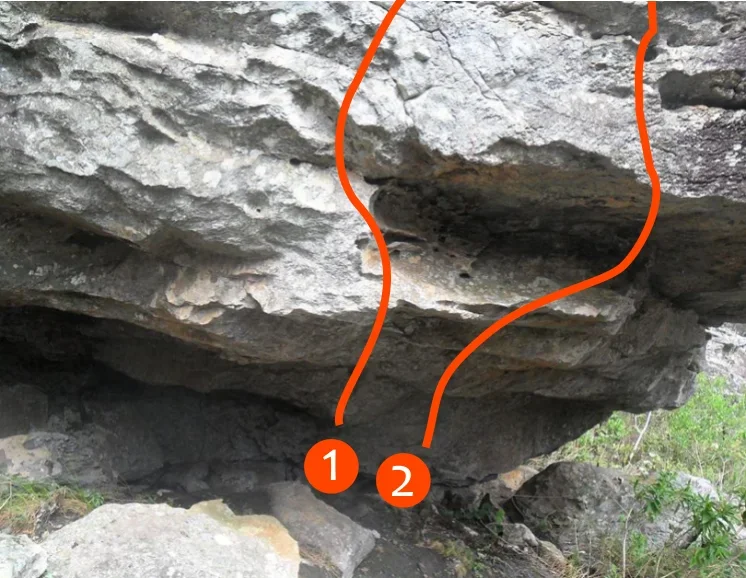
          - **largura_mapa**: 746
          - **altura_mapa**: 578
          - **pontos_de_interesse**:
            - **[0]**:
              - **id**: baUpEiXssh7BfE
              - **uid**: baUpEiXssh7BfE
              - **rotulo**: 1
              - **circulo**:
                - **x**: 331
                - **y**: 466
                - **raio**: 27
              - **label**: 1
            - **[1]**:
              - **id**: zXPVVpSgnqlSmg
              - **uid**: zXPVVpSgnqlSmg
              - **rotulo**: 2
              - **circulo**:
                - **x**: 403
                - **y**: 480
                - **raio**: 27
              - **label**: 2
          - **referencias**:
            - **[0]**:
              - **alvo_uid**: JgTcfT4YMAtElL
              - **pontos_uids**:
                - baUpEiXssh7BfE
              - **escalada**: Matsuzaki
              - **ids**:
                - baUpEiXssh7BfE
            - **[1]**:
              - **alvo_uid**: npotygkkijSGjv
              - **pontos_uids**:
                - zXPVVpSgnqlSmg
              - **escalada**: Agente Laranja
              - **ids**:
                - zXPVVpSgnqlSmg
      - **escaladas**:
        - **[0]**:
          - **uid**: JgTcfT4YMAtElL
          - **boulder**:
            - **nome**: Matsuzaki
            - **dificuldade**: V4
        - **[1]**:
          - **uid**: npotygkkijSGjv
          - **boulder**:
            - **nome**: Agente Laranja
            - **dificuldade**: V4
      - **precomputados**:
        - **total_escaladas**: 2
        - **total_boulders**: 2
  - **[1]**:
    - **conteudo**:
      - **descricao**: 
      - **nome**: Setor Embutidos
      - **uid**: 6c6dDcMXtYms7t
      - **mapas**:
        - **[0]**:
          - **caminho_imagem_mapa**: 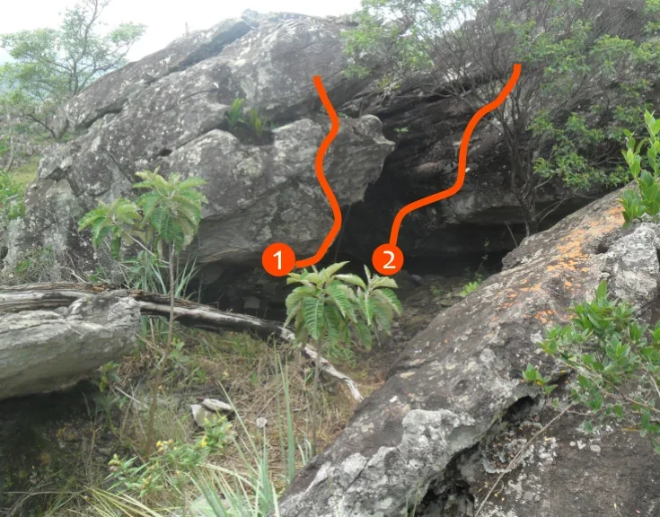
          - **largura_mapa**: 735
          - **altura_mapa**: 576
          - **pontos_de_interesse**:
            - **[0]**:
              - **id**: rNrwuqybgwmbci
              - **uid**: rNrwuqybgwmbci
              - **rotulo**: 1
              - **circulo**:
                - **x**: 310
                - **y**: 289
                - **raio**: 19
              - **label**: 1
            - **[1]**:
              - **id**: 3WFlT9LBUvD2gS
              - **uid**: 3WFlT9LBUvD2gS
              - **rotulo**: 2
              - **circulo**:
                - **x**: 432
                - **y**: 289
                - **raio**: 18
              - **label**: 2
          - **referencias**:
            - **[0]**:
              - **alvo_uid**: livl4zPDZ1unt2
              - **pontos_uids**:
                - rNrwuqybgwmbci
              - **escalada**: Embutidos Não
              - **ids**:
                - rNrwuqybgwmbci
            - **[1]**:
              - **alvo_uid**: sMpPhtJ9Jbyvsm
              - **pontos_uids**:
                - 3WFlT9LBUvD2gS
              - **escalada**: Costelinha
              - **ids**:
                - 3WFlT9LBUvD2gS
      - **escaladas**:
        - **[0]**:
          - **uid**: livl4zPDZ1unt2
          - **boulder**:
            - **nome**: Embutidos Não
            - **dificuldade**: V3
        - **[1]**:
          - **uid**: sMpPhtJ9Jbyvsm
          - **boulder**:
            - **nome**: Costelinha
            - **dificuldade**: V3
      - **precomputados**:
        - **total_escaladas**: 2
        - **total_boulders**: 2
  - **[2]**:
    - **conteudo**:
      - **descricao**: 
      - **nome**: Setor Boca de Tubarão
      - **uid**: 3o7gqRIGs09Mgp
      - **mapas**:
        - **[0]**:
          - **caminho_imagem_mapa**: 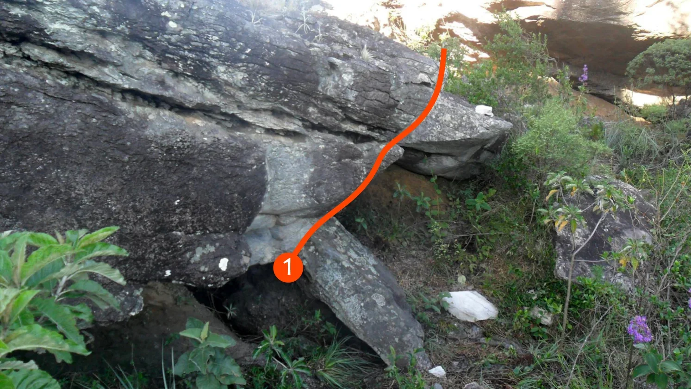
          - **largura_mapa**: 1493
          - **altura_mapa**: 841
          - **pontos_de_interesse**:
            - **[0]**:
              - **id**: OfbnDgsJO7ivu2
              - **uid**: OfbnDgsJO7ivu2
              - **rotulo**: 1
              - **circulo**:
                - **x**: 623
                - **y**: 578
                - **raio**: 33
              - **label**: 1
          - **referencias**:
            - **[0]**:
              - **alvo_uid**: PQ6SbtMkAygcwo
              - **pontos_uids**:
                - OfbnDgsJO7ivu2
              - **escalada**: Boca de Tubarão
              - **ids**:
                - OfbnDgsJO7ivu2
      - **escaladas**:
        - **[0]**:
          - **uid**: PQ6SbtMkAygcwo
          - **boulder**:
            - **nome**: Boca de Tubarão
            - **dificuldade**: V4
      - **precomputados**:
        - **total_escaladas**: 1
        - **total_boulders**: 1
  - **[3]**:
    - **conteudo**:
      - **descricao**: 
      - **nome**: Setor Laranjinha
      - **uid**: cEJi76gPJc0XV6
      - **mapas**:
        - **[0]**:
          - **caminho_imagem_mapa**: 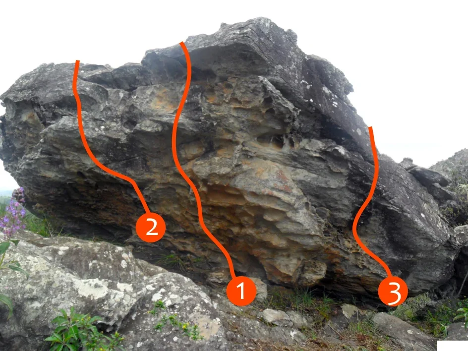
          - **largura_mapa**: 944
          - **altura_mapa**: 708
          - **pontos_de_interesse**:
            - **[0]**:
              - **id**: 3iBj3gXGhohtjZ
              - **uid**: 3iBj3gXGhohtjZ
              - **rotulo**: 1
              - **circulo**:
                - **x**: 487
                - **y**: 588
                - **raio**: 30
              - **label**: 1
            - **[1]**:
              - **id**: frX0BtX9GL5JXj
              - **uid**: frX0BtX9GL5JXj
              - **rotulo**: 2
              - **circulo**:
                - **x**: 304
                - **y**: 458
                - **raio**: 30
              - **label**: 2
            - **[2]**:
              - **id**: Dcayl5ZsIYnxjU
              - **uid**: Dcayl5ZsIYnxjU
              - **rotulo**: 3
              - **circulo**:
                - **x**: 793
                - **y**: 588
                - **raio**: 30
              - **label**: 3
          - **referencias**:
            - **[0]**:
              - **alvo_uid**: cP8ujoykiWXigI
              - **pontos_uids**:
                - 3iBj3gXGhohtjZ
              - **escalada**: Laranjinha
              - **ids**:
                - 3iBj3gXGhohtjZ
            - **[1]**:
              - **alvo_uid**: zg0r5Bf8IQbqzP
              - **pontos_uids**:
                - frX0BtX9GL5JXj
              - **escalada**: Sabotagem Feminina
              - **ids**:
                - frX0BtX9GL5JXj
            - **[2]**:
              - **alvo_uid**: P0r5i9fSUzLtG5
              - **pontos_uids**:
                - Dcayl5ZsIYnxjU
              - **escalada**: Laranja Preta
              - **ids**:
                - Dcayl5ZsIYnxjU
        - **[1]**:
          - **caminho_imagem_mapa**: 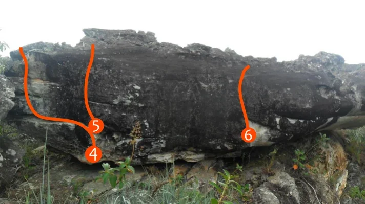
          - **largura_mapa**: 712
          - **altura_mapa**: 399
          - **pontos_de_interesse**:
            - **[0]**:
              - **id**: 1HU0XQ3kdEXG4P
              - **uid**: 1HU0XQ3kdEXG4P
              - **rotulo**: 4
              - **circulo**:
                - **x**: 183
                - **y**: 302
                - **raio**: 17
              - **label**: 4
            - **[1]**:
              - **id**: CKtW3ZSeZgFzGq
              - **uid**: CKtW3ZSeZgFzGq
              - **rotulo**: 5
              - **circulo**:
                - **x**: 187
                - **y**: 247
                - **raio**: 16
              - **label**: 5
            - **[2]**:
              - **id**: r5myCKPIVfZRjb
              - **uid**: r5myCKPIVfZRjb
              - **rotulo**: 6
              - **circulo**:
                - **x**: 485
                - **y**: 264
                - **raio**: 15
              - **label**: 6
          - **referencias**:
            - **[0]**:
              - **alvo_uid**: YfnQ26MwtcRNoi
              - **pontos_uids**:
                - 1HU0XQ3kdEXG4P
              - **escalada**: Laranja Lima
              - **ids**:
                - 1HU0XQ3kdEXG4P
            - **[1]**:
              - **alvo_uid**: yjnh3waFTCfdwr
              - **pontos_uids**:
                - CKtW3ZSeZgFzGq
              - **escalada**: Limão Capeta
              - **ids**:
                - CKtW3ZSeZgFzGq
            - **[2]**:
              - **alvo_uid**: rtw2yNhiVAEXJB
              - **pontos_uids**:
                - r5myCKPIVfZRjb
              - **escalada**: Quincan
              - **ids**:
                - r5myCKPIVfZRjb
      - **escaladas**:
        - **[0]**:
          - **uid**: cP8ujoykiWXigI
          - **boulder**:
            - **nome**: Laranjinha
            - **dificuldade**: V0
        - **[1]**:
          - **uid**: zg0r5Bf8IQbqzP
          - **boulder**:
            - **nome**: Sabotagem Feminina
            - **dificuldade**: V1
        - **[2]**:
          - **uid**: P0r5i9fSUzLtG5
          - **boulder**:
            - **nome**: Laranja Preta
            - **dificuldade**: V0
        - **[3]**:
          - **uid**: YfnQ26MwtcRNoi
          - **boulder**:
            - **nome**: Laranja Lima
            - **dificuldade**: V2
        - **[4]**:
          - **uid**: yjnh3waFTCfdwr
          - **boulder**:
            - **descricao**: Projeto.
            - **nome**: Limão Capeta
            - **dificuldade**: INDEFINIDO
        - **[5]**:
          - **uid**: rtw2yNhiVAEXJB
          - **boulder**:
            - **nome**: Quincan
            - **dificuldade**: V1
      - **precomputados**:
        - **total_escaladas**: 6
        - **total_boulders**: 6
  - **[4]**:
    - **conteudo**:
      - **descricao**: 
      - **nome**: Setor Unha de Gato
      - **uid**: 8YbwEOVUhJQ0SK
      - **mapas**:
        - **[0]**:
          - **caminho_imagem_mapa**: 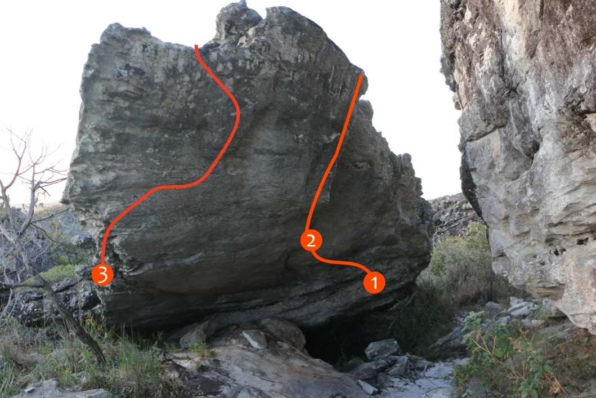
          - **largura_mapa**: 1059
          - **altura_mapa**: 707
          - **pontos_de_interesse**:
            - **[0]**:
              - **id**: iQCn8OUPdkDNqH
              - **uid**: iQCn8OUPdkDNqH
              - **rotulo**: 1
              - **circulo**:
                - **x**: 665
                - **y**: 502
                - **raio**: 19
              - **label**: 1
            - **[1]**:
              - **id**: uoWHOn0VRFLDjA
              - **uid**: uoWHOn0VRFLDjA
              - **rotulo**: 2
              - **circulo**:
                - **x**: 553
                - **y**: 427
                - **raio**: 20
              - **label**: 2
            - **[2]**:
              - **id**: jWhaBSpFehzvV3
              - **uid**: jWhaBSpFehzvV3
              - **rotulo**: 3
              - **circulo**:
                - **x**: 182
                - **y**: 488
                - **raio**: 19
              - **label**: 3
          - **referencias**:
            - **[0]**:
              - **alvo_uid**: ifhlC5UKRqbzYX
              - **pontos_uids**:
                - iQCn8OUPdkDNqH
              - **escalada**: Unha de Gato SDS
              - **ids**:
                - iQCn8OUPdkDNqH
            - **[1]**:
              - **alvo_uid**: f5PuMn5MZeiW7P
              - **pontos_uids**:
                - uoWHOn0VRFLDjA
              - **escalada**: Unha de Gato
              - **ids**:
                - uoWHOn0VRFLDjA
            - **[2]**:
              - **alvo_uid**: nGQgMXtXL3x40y
              - **pontos_uids**:
                - jWhaBSpFehzvV3
              - **escalada**: Roçadeira
              - **ids**:
                - jWhaBSpFehzvV3
        - **[1]**:
          - **caminho_imagem_mapa**: 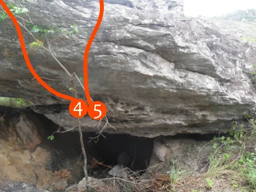
          - **largura_mapa**: 528
          - **altura_mapa**: 396
          - **pontos_de_interesse**:
            - **[0]**:
              - **id**: PtFxWDIe9yZwPC
              - **uid**: PtFxWDIe9yZwPC
              - **rotulo**: 4
              - **circulo**:
                - **x**: 162
                - **y**: 224
                - **raio**: 20
              - **label**: 4
            - **[1]**:
              - **id**: 8Ha8HZlwDLGzz7
              - **uid**: 8Ha8HZlwDLGzz7
              - **rotulo**: 5
              - **circulo**:
                - **x**: 201
                - **y**: 228
                - **raio**: 20
              - **label**: 5
          - **referencias**:
            - **[0]**:
              - **alvo_uid**: SfCLwJChGPsjKl
              - **pontos_uids**:
                - PtFxWDIe9yZwPC
              - **escalada**: Voilà
              - **ids**:
                - PtFxWDIe9yZwPC
            - **[1]**:
              - **alvo_uid**: bSeyubEIJlDXWJ
              - **pontos_uids**:
                - 8Ha8HZlwDLGzz7
              - **escalada**: Saída Pela Direita
              - **ids**:
                - 8Ha8HZlwDLGzz7
      - **escaladas**:
        - **[0]**:
          - **uid**: ifhlC5UKRqbzYX
          - **boulder**:
            - **descricao**: Projeto
            - **nome**: Unha de Gato SDS
            - **dificuldade**: INDEFINIDO
        - **[1]**:
          - **uid**: f5PuMn5MZeiW7P
          - **boulder**:
            - **nome**: Unha de Gato
            - **dificuldade**: V4
        - **[2]**:
          - **uid**: nGQgMXtXL3x40y
          - **boulder**:
            - **nome**: Roçadeira
            - **dificuldade**: V6
        - **[3]**:
          - **uid**: SfCLwJChGPsjKl
          - **boulder**:
            - **nome**: Voilà
            - **dificuldade**: V5
        - **[4]**:
          - **uid**: bSeyubEIJlDXWJ
          - **boulder**:
            - **nome**: Saída Pela Direita
            - **dificuldade**: V2
      - **precomputados**:
        - **total_escaladas**: 5
        - **total_boulders**: 5
- **precomputados**:
  - **total_escaladas**: 16
  - **total_boulders**: 16

## Parte: grupo_ditadura

### Grupo (Pico: Serra do Lenheiro)

- **descricao**: **Principais blocos:** Ditadura, Cabeça de Cachorro, Catatau, Espiga, Aero-Dinâmico, Coroinha, Iguana, Faixa Preta.
- **nome**: Ditadura
- **uid**: M8v6w3o5nlDeLU
- **mapas**:
  - **[0]**:
    - **caminho_imagem_mapa**: 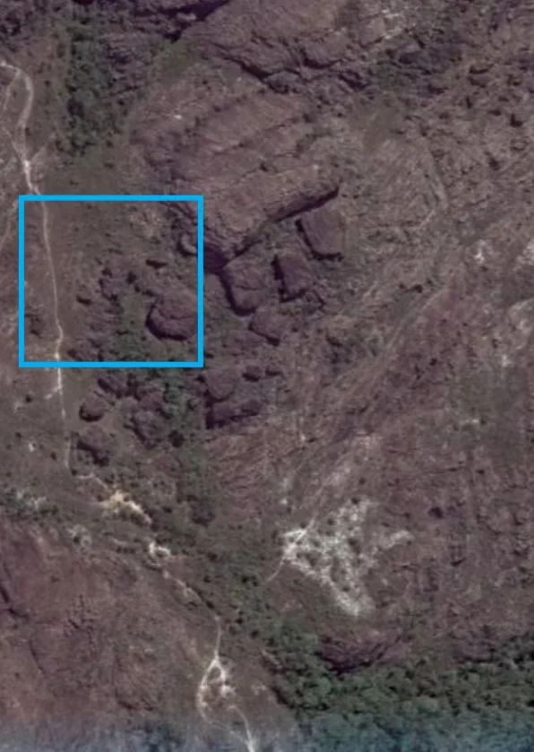
    - **largura_mapa**: 596
    - **altura_mapa**: 839
    - **pontos_de_interesse**:
      - **[0]**:
        - **id**: eGlUlN5b8DVOKi
        - **uid**: eGlUlN5b8DVOKi
        - **rotulo**: Ditadura
        - **retangulo**:
          - **x**: 124
          - **y**: 314
          - **comprimento**: 208
          - **largura**: 195
        - **label**: Ditadura
- **setores**:
  - **[0]**:
    - **conteudo**:
      - **descricao**: 
      - **nome**: Setor Ditadura
      - **uid**: CqXQ96HqOIWNgI
      - **mapas**:
        - **[0]**:
          - **caminho_imagem_mapa**: 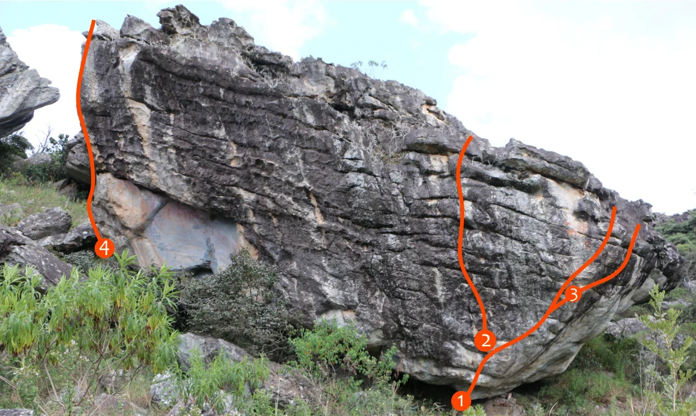
          - **largura_mapa**: 1420
          - **altura_mapa**: 848
          - **pontos_de_interesse**:
            - **[0]**:
              - **id**: e32vanOpvwMWbP
              - **uid**: e32vanOpvwMWbP
              - **rotulo**: 1
              - **circulo**:
                - **x**: 941
                - **y**: 817
                - **raio**: 20
              - **label**: 1
            - **[1]**:
              - **id**: nqBEu6wmbXfK7T
              - **uid**: nqBEu6wmbXfK7T
              - **rotulo**: 2
              - **circulo**:
                - **x**: 991
                - **y**: 694
                - **raio**: 23
              - **label**: 2
            - **[2]**:
              - **id**: x2Tx1RHKtSHFDY
              - **uid**: x2Tx1RHKtSHFDY
              - **rotulo**: 3
              - **circulo**:
                - **x**: 1170
                - **y**: 599
                - **raio**: 17
              - **label**: 3
            - **[3]**:
              - **id**: VX0UMCDoseMSW0
              - **uid**: VX0UMCDoseMSW0
              - **rotulo**: 4
              - **circulo**:
                - **x**: 214
                - **y**: 506
                - **raio**: 21
              - **label**: 4
          - **referencias**:
            - **[0]**:
              - **alvo_uid**: rKLDmGfVOifcb1
              - **pontos_uids**:
                - e32vanOpvwMWbP
              - **escalada**: Ditadura
              - **ids**:
                - e32vanOpvwMWbP
            - **[1]**:
              - **alvo_uid**: U1u381ykf2p62m
              - **pontos_uids**:
                - nqBEu6wmbXfK7T
              - **escalada**: Democracia
              - **ids**:
                - nqBEu6wmbXfK7T
            - **[2]**:
              - **alvo_uid**: VxK6UaACrh9GFC
              - **pontos_uids**:
                - x2Tx1RHKtSHFDY
              - **escalada**: Repressão
              - **ids**:
                - x2Tx1RHKtSHFDY
            - **[3]**:
              - **alvo_uid**: OvKPYE1IWaOCT2
              - **pontos_uids**:
                - VX0UMCDoseMSW0
              - **escalada**: Via Rupestre
              - **ids**:
                - VX0UMCDoseMSW0
      - **escaladas**:
        - **[0]**:
          - **uid**: rKLDmGfVOifcb1
          - **boulder**:
            - **nome**: Ditadura
            - **dificuldade**: V10
        - **[1]**:
          - **uid**: U1u381ykf2p62m
          - **boulder**:
            - **nome**: Democracia
            - **dificuldade**: V7
        - **[2]**:
          - **uid**: VxK6UaACrh9GFC
          - **boulder**:
            - **descricao**: Projeto
            - **nome**: Repressão
        - **[3]**:
          - **uid**: OvKPYE1IWaOCT2
          - **boulder**:
            - **descricao**: v0/6º sup (Proteções Móveis)
            - **nome**: Via Rupestre
            - **dificuldade**: V0
      - **precomputados**:
        - **total_escaladas**: 4
        - **total_boulders**: 4
  - **[1]**:
    - **conteudo**:
      - **descricao**: 
      - **nome**: Setor Cabeça de Cachorro
      - **uid**: CFkj135WS2iAFC
      - **mapas**:
        - **[0]**:
          - **caminho_imagem_mapa**: 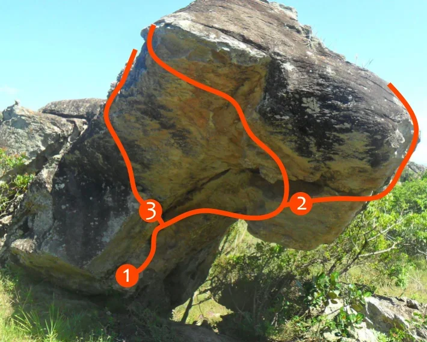
          - **largura_mapa**: 710
          - **altura_mapa**: 568
          - **pontos_de_interesse**:
            - **[0]**:
              - **id**: u6xSvrnGIwWmek
              - **uid**: u6xSvrnGIwWmek
              - **rotulo**: 1
              - **circulo**:
                - **x**: 211
                - **y**: 458
                - **raio**: 19
              - **label**: 1
            - **[1]**:
              - **id**: me2ybVX2OVDlF3
              - **uid**: me2ybVX2OVDlF3
              - **rotulo**: 2
              - **circulo**:
                - **x**: 500
                - **y**: 338
                - **raio**: 19
              - **label**: 2
            - **[2]**:
              - **id**: ZSqybiie5kR5xU
              - **uid**: ZSqybiie5kR5xU
              - **rotulo**: 3
              - **circulo**:
                - **x**: 250
                - **y**: 350
                - **raio**: 19
              - **label**: 3
          - **referencias**:
            - **[0]**:
              - **alvo_uid**: BYSoRYlPrPAHQl
              - **pontos_uids**:
                - u6xSvrnGIwWmek
              - **escalada**: Cachorro Louco
              - **ids**:
                - u6xSvrnGIwWmek
            - **[1]**:
              - **alvo_uid**: ukUfshvhz0vO8M
              - **pontos_uids**:
                - me2ybVX2OVDlF3
              - **escalada**: T-Rex
              - **ids**:
                - me2ybVX2OVDlF3
            - **[2]**:
              - **alvo_uid**: haGL6HOcQ5Otd5
              - **pontos_uids**:
                - ZSqybiie5kR5xU
              - **escalada**: Rex
              - **ids**:
                - ZSqybiie5kR5xU
      - **escaladas**:
        - **[0]**:
          - **uid**: BYSoRYlPrPAHQl
          - **boulder**:
            - **nome**: Cachorro Louco
            - **dificuldade**: V4
        - **[1]**:
          - **uid**: ukUfshvhz0vO8M
          - **boulder**:
            - **nome**: T-Rex
            - **dificuldade**: V2
        - **[2]**:
          - **uid**: haGL6HOcQ5Otd5
          - **boulder**:
            - **nome**: Rex
            - **dificuldade**: V0
      - **precomputados**:
        - **total_escaladas**: 3
        - **total_boulders**: 3
  - **[2]**:
    - **conteudo**:
      - **descricao**: 
      - **nome**: Setor Catatau
      - **uid**: fv8zxv4MMyBrJH
      - **mapas**:
        - **[0]**:
          - **caminho_imagem_mapa**: 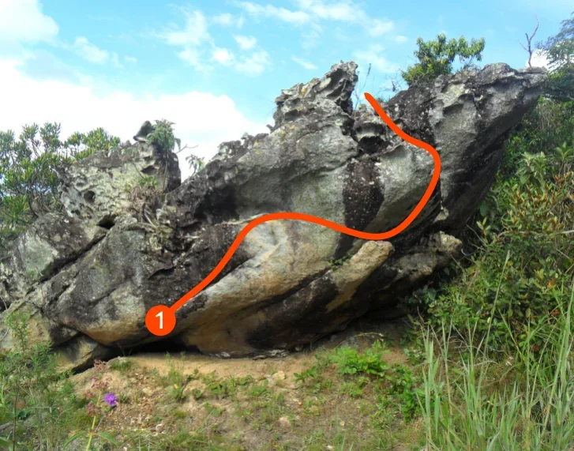
          - **largura_mapa**: 727
          - **altura_mapa**: 571
          - **pontos_de_interesse**:
            - **[0]**:
              - **id**: 1F5z4TrU9VnXvc
              - **uid**: 1F5z4TrU9VnXvc
              - **rotulo**: 1
              - **circulo**:
                - **x**: 203
                - **y**: 406
                - **raio**: 19
              - **label**: 1
          - **referencias**:
            - **[0]**:
              - **alvo_uid**: mgFnUFLUCCLQ6Q
              - **pontos_uids**:
                - 1F5z4TrU9VnXvc
              - **escalada**: Catatau
              - **ids**:
                - 1F5z4TrU9VnXvc
      - **escaladas**:
        - **[0]**:
          - **uid**: mgFnUFLUCCLQ6Q
          - **boulder**:
            - **nome**: Catatau
            - **dificuldade**: V2
      - **precomputados**:
        - **total_escaladas**: 1
        - **total_boulders**: 1
  - **[3]**:
    - **conteudo**:
      - **descricao**: 
      - **nome**: Setor Espiga
      - **uid**: W1JNrgMgl63jDJ
      - **mapas**:
        - **[0]**:
          - **caminho_imagem_mapa**: 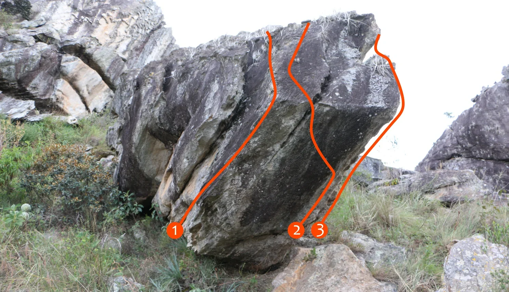
          - **largura_mapa**: 1488
          - **altura_mapa**: 854
          - **pontos_de_interesse**:
            - **[0]**:
              - **id**: bUInCDR1whPUvz
              - **uid**: bUInCDR1whPUvz
              - **rotulo**: 1
              - **circulo**:
                - **x**: 511
                - **y**: 674
                - **raio**: 24
              - **label**: 1
            - **[1]**:
              - **id**: rnIauQpdr2WeqG
              - **uid**: rnIauQpdr2WeqG
              - **rotulo**: 2
              - **circulo**:
                - **x**: 866
                - **y**: 673
                - **raio**: 25
              - **label**: 2
            - **[2]**:
              - **id**: mfAyTDj0GUHedC
              - **uid**: mfAyTDj0GUHedC
              - **rotulo**: 3
              - **circulo**:
                - **x**: 934
                - **y**: 673
                - **raio**: 25
              - **label**: 3
          - **referencias**:
            - **[0]**:
              - **alvo_uid**: HSFIlyh0RguSF3
              - **pontos_uids**:
                - bUInCDR1whPUvz
              - **escalada**: Espião
              - **ids**:
                - bUInCDR1whPUvz
            - **[1]**:
              - **alvo_uid**: 7i6ctOxJ46d3hu
              - **pontos_uids**:
                - rnIauQpdr2WeqG
              - **escalada**: Espiga
              - **ids**:
                - rnIauQpdr2WeqG
            - **[2]**:
              - **alvo_uid**: EY3t5LeIycv843
              - **pontos_uids**:
                - mfAyTDj0GUHedC
              - **escalada**: Sabugo
              - **ids**:
                - mfAyTDj0GUHedC
      - **escaladas**:
        - **[0]**:
          - **uid**: HSFIlyh0RguSF3
          - **boulder**:
            - **nome**: Espião
            - **dificuldade**: V2
        - **[1]**:
          - **uid**: 7i6ctOxJ46d3hu
          - **boulder**:
            - **nome**: Espiga
            - **dificuldade**: V6
        - **[2]**:
          - **uid**: EY3t5LeIycv843
          - **boulder**:
            - **nome**: Sabugo
            - **dificuldade**: V0
      - **precomputados**:
        - **total_escaladas**: 3
        - **total_boulders**: 3
  - **[4]**:
    - **conteudo**:
      - **descricao**: 
      - **nome**: Setor Aero Dinâmico
      - **uid**: a9RCi2qfPDv3xS
      - **mapas**:
        - **[0]**:
          - **caminho_imagem_mapa**: 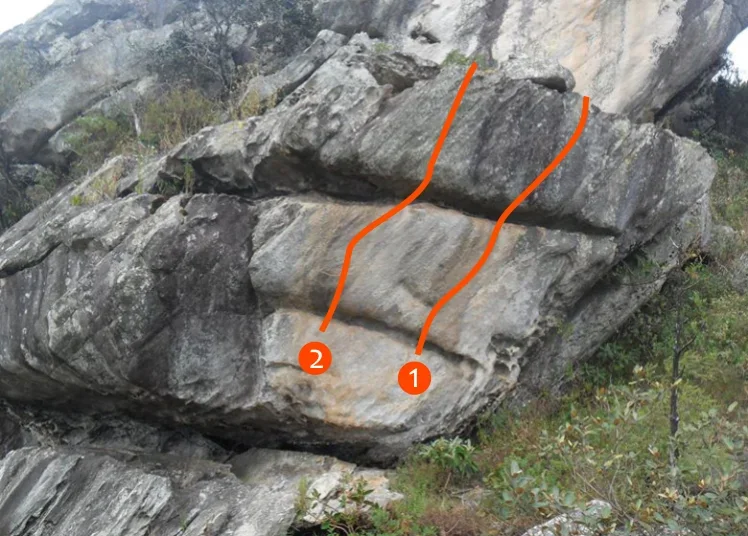
          - **largura_mapa**: 748
          - **altura_mapa**: 536
          - **pontos_de_interesse**:
            - **[0]**:
              - **id**: CLUecAHi8CThD2
              - **uid**: CLUecAHi8CThD2
              - **rotulo**: 1
              - **circulo**:
                - **x**: 415
                - **y**: 379
                - **raio**: 17
              - **label**: 1
            - **[1]**:
              - **id**: vFFK2M6i1sMm1M
              - **uid**: vFFK2M6i1sMm1M
              - **rotulo**: 2
              - **circulo**:
                - **x**: 315
                - **y**: 359
                - **raio**: 17
              - **label**: 2
          - **referencias**:
            - **[0]**:
              - **alvo_uid**: v9pmwzKS6kIvgI
              - **pontos_uids**:
                - CLUecAHi8CThD2
              - **escalada**: Aero Dinâmico
              - **ids**:
                - CLUecAHi8CThD2
            - **[1]**:
              - **alvo_uid**: Cfd1AWO1fA6mKu
              - **pontos_uids**:
                - vFFK2M6i1sMm1M
              - **escalada**: Projeto (Aero Dinâmico)
              - **ids**:
                - vFFK2M6i1sMm1M
      - **escaladas**:
        - **[0]**:
          - **uid**: v9pmwzKS6kIvgI
          - **boulder**:
            - **descricao**: Projeto
            - **nome**: Aero Dinâmico
        - **[1]**:
          - **uid**: Cfd1AWO1fA6mKu
          - **boulder**:
            - **nome**: Projeto (Aero Dinâmico)
      - **precomputados**:
        - **total_escaladas**: 2
        - **total_boulders**: 2
  - **[5]**:
    - **conteudo**:
      - **descricao**: 
      - **nome**: Setor Coroinha
      - **uid**: gXrhh04vwDtXUk
      - **mapas**:
        - **[0]**:
          - **caminho_imagem_mapa**: 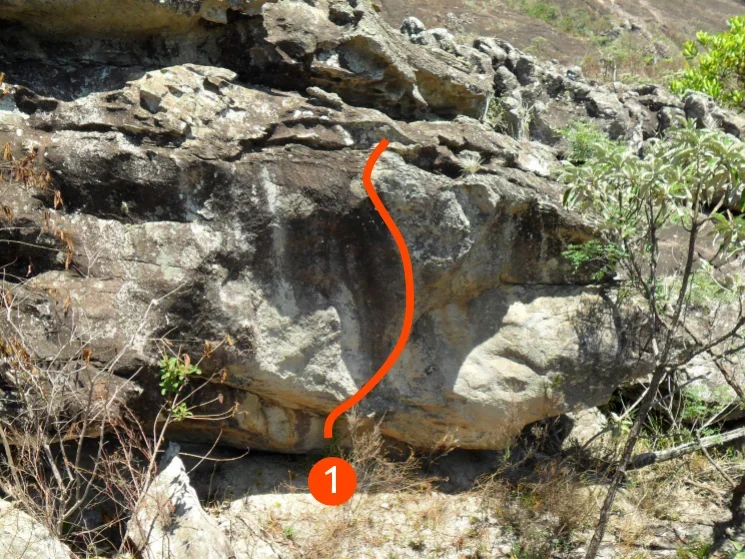
          - **largura_mapa**: 745
          - **altura_mapa**: 559
          - **pontos_de_interesse**:
            - **[0]**:
              - **id**: iKWXn6szYw7c7g
              - **uid**: iKWXn6szYw7c7g
              - **rotulo**: 1
              - **circulo**:
                - **x**: 333
                - **y**: 481
                - **raio**: 24
              - **label**: 1
          - **referencias**:
            - **[0]**:
              - **alvo_uid**: EH8c9NIsVlZ76V
              - **pontos_uids**:
                - iKWXn6szYw7c7g
              - **escalada**: Coroinha
              - **ids**:
                - iKWXn6szYw7c7g
      - **escaladas**:
        - **[0]**:
          - **uid**: EH8c9NIsVlZ76V
          - **boulder**:
            - **nome**: Coroinha
            - **dificuldade**: V1
      - **precomputados**:
        - **total_escaladas**: 1
        - **total_boulders**: 1
  - **[6]**:
    - **conteudo**:
      - **descricao**: 
      - **nome**: Setor Iguana
      - **uid**: pn8gTBpmwrR7Fv
      - **mapas**:
        - **[0]**:
          - **caminho_imagem_mapa**: 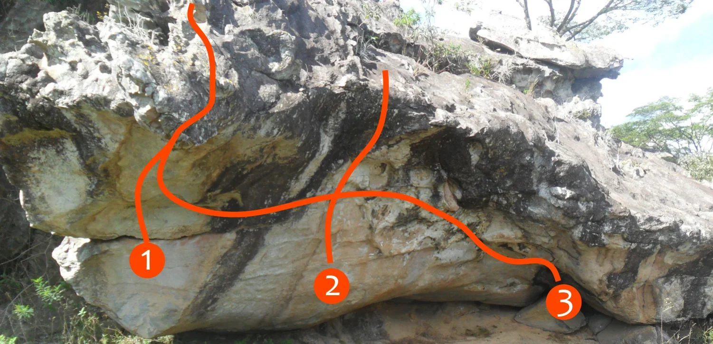
          - **largura_mapa**: 1501
          - **altura_mapa**: 726
          - **pontos_de_interesse**:
            - **[0]**:
              - **id**: kgLOVHVAm4VHXD
              - **uid**: kgLOVHVAm4VHXD
              - **rotulo**: 1
              - **circulo**:
                - **x**: 310
                - **y**: 549
                - **raio**: 38
              - **label**: 1
            - **[1]**:
              - **id**: ceHG2NJiORChEa
              - **uid**: ceHG2NJiORChEa
              - **rotulo**: 2
              - **circulo**:
                - **x**: 698
                - **y**: 605
                - **raio**: 39
              - **label**: 2
            - **[2]**:
              - **id**: naptkY9qMIZYQT
              - **uid**: naptkY9qMIZYQT
              - **rotulo**: 3
              - **circulo**:
                - **x**: 1187
                - **y**: 637
                - **raio**: 37
              - **label**: 3
          - **referencias**:
            - **[0]**:
              - **alvo_uid**: Xkb55lKkoqp03F
              - **pontos_uids**:
                - kgLOVHVAm4VHXD
              - **escalada**: Iguana
              - **ids**:
                - kgLOVHVAm4VHXD
            - **[1]**:
              - **alvo_uid**: wdHFTA0pMvDzYB
              - **pontos_uids**:
                - ceHG2NJiORChEa
              - **escalada**: Calango
              - **ids**:
                - ceHG2NJiORChEa
            - **[2]**:
              - **alvo_uid**: Rz78JroFxa0gW7
              - **pontos_uids**:
                - naptkY9qMIZYQT
              - **escalada**: Camaleão
              - **ids**:
                - naptkY9qMIZYQT
      - **escaladas**:
        - **[0]**:
          - **uid**: Xkb55lKkoqp03F
          - **boulder**:
            - **nome**: Iguana
            - **dificuldade**: V8
        - **[1]**:
          - **uid**: wdHFTA0pMvDzYB
          - **boulder**:
            - **nome**: Calango
            - **dificuldade**: V1
        - **[2]**:
          - **uid**: Rz78JroFxa0gW7
          - **boulder**:
            - **nome**: Camaleão
            - **dificuldade**: V4
      - **precomputados**:
        - **total_escaladas**: 3
        - **total_boulders**: 3
  - **[7]**:
    - **conteudo**:
      - **descricao**: 
      - **nome**: Setor Faixa Preta
      - **uid**: hLJeJsEOyHWdLg
      - **mapas**:
        - **[0]**:
          - **caminho_imagem_mapa**: 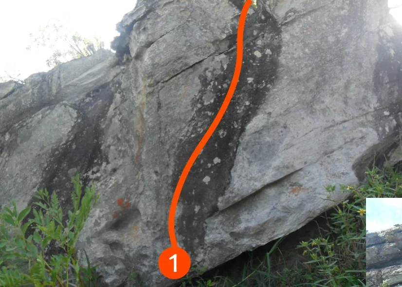
          - **largura_mapa**: 826
          - **altura_mapa**: 589
          - **pontos_de_interesse**:
            - **[0]**:
              - **id**: F5p66LwPCoLGrZ
              - **uid**: F5p66LwPCoLGrZ
              - **rotulo**: 1
              - **circulo**:
                - **x**: 358
                - **y**: 540
                - **raio**: 33
              - **label**: 1
          - **referencias**:
            - **[0]**:
              - **alvo_uid**: fJmfeMLddqLCAk
              - **pontos_uids**:
                - F5p66LwPCoLGrZ
              - **escalada**: Faixa Preta
              - **ids**:
                - F5p66LwPCoLGrZ
        - **[1]**:
          - **caminho_imagem_mapa**: 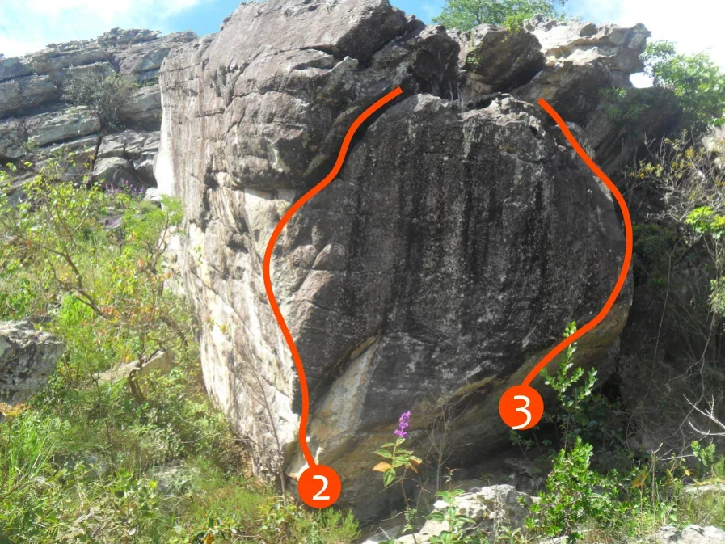
          - **largura_mapa**: 897
          - **altura_mapa**: 673
          - **pontos_de_interesse**:
            - **[0]**:
              - **id**: I8hW7pOVRPuvp9
              - **uid**: I8hW7pOVRPuvp9
              - **rotulo**: 2
              - **circulo**:
                - **x**: 395
                - **y**: 602
                - **raio**: 27
              - **label**: 2
            - **[1]**:
              - **id**: 4vwRVG4KXO4S2b
              - **uid**: 4vwRVG4KXO4S2b
              - **rotulo**: 3
              - **circulo**:
                - **x**: 645
                - **y**: 504
                - **raio**: 28
              - **label**: 3
          - **referencias**:
            - **[0]**:
              - **alvo_uid**: V2FgnTTFXtW6N1
              - **pontos_uids**:
                - I8hW7pOVRPuvp9
              - **escalada**: Aresta Dinâmica
              - **ids**:
                - I8hW7pOVRPuvp9
            - **[1]**:
              - **alvo_uid**: FpO6JFED68jJkK
              - **pontos_uids**:
                - 4vwRVG4KXO4S2b
              - **escalada**: Projeto (Faixa Preta)
              - **ids**:
                - 4vwRVG4KXO4S2b
      - **escaladas**:
        - **[0]**:
          - **uid**: fJmfeMLddqLCAk
          - **boulder**:
            - **nome**: Faixa Preta
            - **dificuldade**: V1
        - **[1]**:
          - **uid**: V2FgnTTFXtW6N1
          - **boulder**:
            - **nome**: Aresta Dinâmica
            - **dificuldade**: V3
        - **[2]**:
          - **uid**: FpO6JFED68jJkK
          - **boulder**:
            - **nome**: Projeto (Faixa Preta)
            - **dificuldade**: INDEFINIDO
      - **precomputados**:
        - **total_escaladas**: 3
        - **total_boulders**: 3
- **precomputados**:
  - **total_escaladas**: 20
  - **total_boulders**: 20

## Parte: grupo_mulher_de_bigode

### Grupo (Pico: Serra do Lenheiro)

- **descricao**: **Principais blocos:** Mulher de Bigode, Beiço, Diabinha, Eco, Meretríssimo, Ziriguidum, Viúva Negra, Carga pesada, Ota aranha, Fingerboard, Módulo.
- **nome**: Mulher de Bigode
- **uid**: iDCGYkAp0pUbMY
- **mapas**:
  - **[0]**:
    - **caminho_imagem_mapa**: 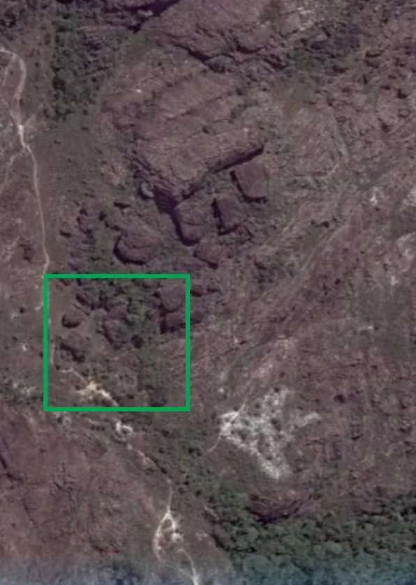
    - **largura_mapa**: 596
    - **altura_mapa**: 839
    - **pontos_de_interesse**:
      - **[0]**:
        - **id**: pQiH1jLUYu7ZP1
        - **uid**: pQiH1jLUYu7ZP1
        - **rotulo**: Mulher de Bigode
        - **retangulo**:
          - **x**: 166
          - **y**: 491
          - **comprimento**: 206
          - **largura**: 194
        - **label**: Mulher de Bigode
- **setores**:
  - **[0]**:
    - **conteudo**:
      - **descricao**: 
      - **nome**: Setor Mulher de Bigode
      - **uid**: PIXJYxedJscCy0
      - **mapas**:
        - **[0]**:
          - **caminho_imagem_mapa**: 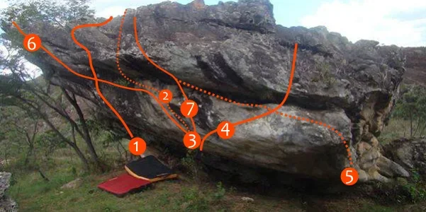
          - **largura_mapa**: 601
          - **altura_mapa**: 300
          - **pontos_de_interesse**:
            - **[0]**:
              - **id**: qwlJ5kQ1OwejeN
              - **uid**: qwlJ5kQ1OwejeN
              - **rotulo**: 01
              - **circulo**:
                - **x**: 194
                - **y**: 207
                - **raio**: 13
              - **label**: 01
            - **[1]**:
              - **id**: oyoPSpTAUlKYFT
              - **uid**: oyoPSpTAUlKYFT
              - **rotulo**: 02
              - **circulo**:
                - **x**: 233
                - **y**: 136
                - **raio**: 10
              - **label**: 02
            - **[2]**:
              - **id**: JV36xTjAAGsCEX
              - **uid**: JV36xTjAAGsCEX
              - **rotulo**: 03
              - **circulo**:
                - **x**: 271
                - **y**: 198
                - **raio**: 13
              - **label**: 03
            - **[3]**:
              - **id**: ex2Uxa4fZllV4H
              - **uid**: ex2Uxa4fZllV4H
              - **rotulo**: 04
              - **circulo**:
                - **x**: 318
                - **y**: 184
                - **raio**: 13
              - **label**: 04
            - **[4]**:
              - **id**: OKJ8vcL1nJ76us
              - **uid**: OKJ8vcL1nJ76us
              - **rotulo**: 05
              - **circulo**:
                - **x**: 493
                - **y**: 249
                - **raio**: 13
              - **label**: 05
            - **[5]**:
              - **id**: oVCDuK6K1qKzY6
              - **uid**: oVCDuK6K1qKzY6
              - **rotulo**: 06
              - **circulo**:
                - **x**: 45
                - **y**: 61
                - **raio**: 13
              - **label**: 06
            - **[6]**:
              - **id**: FA4rKyKOetQBYN
              - **uid**: FA4rKyKOetQBYN
              - **rotulo**: 07
              - **circulo**:
                - **x**: 267
                - **y**: 153
                - **raio**: 13
              - **label**: 07
          - **referencias**:
            - **[0]**:
              - **alvo_uid**: Z9mBQdZSTCz5xA
              - **pontos_uids**:
                - qwlJ5kQ1OwejeN
              - **escalada**: Liberdade de Expressão
              - **ids**:
                - qwlJ5kQ1OwejeN
            - **[1]**:
              - **alvo_uid**: 0K4Cuo4pZgsVZp
              - **pontos_uids**:
                - oyoPSpTAUlKYFT
              - **escalada**: Planta de Shiva
              - **ids**:
                - oyoPSpTAUlKYFT
            - **[2]**:
              - **alvo_uid**: avXvP6qR947tyu
              - **pontos_uids**:
                - JV36xTjAAGsCEX
              - **escalada**: Planta de Shiva SDS
              - **ids**:
                - JV36xTjAAGsCEX
            - **[3]**:
              - **alvo_uid**: dAyz6XAhuVtU6V
              - **pontos_uids**:
                - ex2Uxa4fZllV4H
              - **escalada**: Planta Rara
              - **ids**:
                - ex2Uxa4fZllV4H
            - **[4]**:
              - **alvo_uid**: ut4kyJt2IUxGZL
              - **pontos_uids**:
                - OKJ8vcL1nJ76us
              - **escalada**: Tendinite
              - **ids**:
                - OKJ8vcL1nJ76us
            - **[5]**:
              - **alvo_uid**: L8b8R7MLbOoBZO
              - **pontos_uids**:
                - oVCDuK6K1qKzY6
              - **escalada**: Burning
              - **ids**:
                - oVCDuK6K1qKzY6
            - **[6]**:
              - **alvo_uid**: BfeGK6AUWq9HJr
              - **pontos_uids**:
                - FA4rKyKOetQBYN
              - **escalada**: Albatroz
              - **ids**:
                - FA4rKyKOetQBYN
        - **[1]**:
          - **caminho_imagem_mapa**: 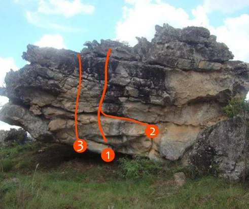
          - **largura_mapa**: 491
          - **altura_mapa**: 413
          - **pontos_de_interesse**:
            - **[0]**:
              - **id**: KRxYMV6lJgwJOA
              - **uid**: KRxYMV6lJgwJOA
              - **rotulo**: 01
              - **circulo**:
                - **x**: 213
                - **y**: 306
                - **raio**: 14
              - **label**: 01
            - **[1]**:
              - **id**: UCkechkwvtJYWn
              - **uid**: UCkechkwvtJYWn
              - **rotulo**: 02
              - **circulo**:
                - **x**: 300
                - **y**: 260
                - **raio**: 14
              - **label**: 02
            - **[2]**:
              - **id**: WstyEX8V1BU1HM
              - **uid**: WstyEX8V1BU1HM
              - **rotulo**: 03
              - **circulo**:
                - **x**: 158
                - **y**: 288
                - **raio**: 13
              - **label**: 03
          - **referencias**:
            - **[0]**:
              - **alvo_uid**: YkZLLNeUJjIEAz
              - **pontos_uids**:
                - KRxYMV6lJgwJOA
              - **escalada**: Mulher de Bigode
              - **ids**:
                - KRxYMV6lJgwJOA
            - **[1]**:
              - **alvo_uid**: xXruv8ZKYztt83
              - **pontos_uids**:
                - UCkechkwvtJYWn
              - **escalada**: Homem de Saia
              - **ids**:
                - UCkechkwvtJYWn
            - **[2]**:
              - **alvo_uid**: jkKES95IxzqsIN
              - **pontos_uids**:
                - WstyEX8V1BU1HM
              - **escalada**: Mais Facinha
              - **ids**:
                - WstyEX8V1BU1HM
        - **[2]**:
          - **caminho_imagem_mapa**: 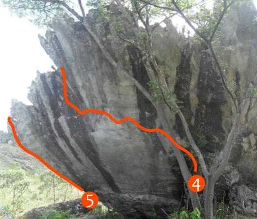
          - **largura_mapa**: 530
          - **altura_mapa**: 453
          - **pontos_de_interesse**:
            - **[0]**:
              - **id**: ccfsoSVx8XI9um
              - **uid**: ccfsoSVx8XI9um
              - **rotulo**: 04
              - **circulo**:
                - **x**: 405
                - **y**: 380
                - **raio**: 18
              - **label**: 04
            - **[1]**:
              - **id**: Rqfc8dqosMikI6
              - **uid**: Rqfc8dqosMikI6
              - **rotulo**: 05
              - **circulo**:
                - **x**: 185
                - **y**: 414
                - **raio**: 18
              - **label**: 05
          - **referencias**:
            - **[0]**:
              - **alvo_uid**: fHZtu1vXkG13bf
              - **pontos_uids**:
                - ccfsoSVx8XI9um
              - **escalada**: Reino Animal
              - **ids**:
                - ccfsoSVx8XI9um
            - **[1]**:
              - **alvo_uid**: jicqjOHb4al6Ue
              - **pontos_uids**:
                - Rqfc8dqosMikI6
              - **escalada**: Blue Cheese
              - **ids**:
                - Rqfc8dqosMikI6
      - **escaladas**:
        - **[0]**:
          - **uid**: Z9mBQdZSTCz5xA
          - **boulder**:
            - **nome**: Liberdade de Expressão
            - **dificuldade**: V4
        - **[1]**:
          - **uid**: 0K4Cuo4pZgsVZp
          - **boulder**:
            - **nome**: Planta de Shiva
            - **dificuldade**: V1
        - **[2]**:
          - **uid**: avXvP6qR947tyu
          - **boulder**:
            - **nome**: Planta de Shiva SDS
            - **dificuldade**: V5
        - **[3]**:
          - **uid**: dAyz6XAhuVtU6V
          - **boulder**:
            - **nome**: Planta Rara
            - **dificuldade**: V10
        - **[4]**:
          - **uid**: ut4kyJt2IUxGZL
          - **boulder**:
            - **nome**: Tendinite
            - **dificuldade**: V4
        - **[5]**:
          - **uid**: L8b8R7MLbOoBZO
          - **boulder**:
            - **nome**: Burning
            - **dificuldade**: V8
        - **[6]**:
          - **uid**: BfeGK6AUWq9HJr
          - **boulder**:
            - **nome**: Albatroz
            - **dificuldade**: V8
        - **[7]**:
          - **uid**: YkZLLNeUJjIEAz
          - **boulder**:
            - **nome**: Mulher de Bigode
            - **dificuldade**: V5
        - **[8]**:
          - **uid**: xXruv8ZKYztt83
          - **boulder**:
            - **nome**: Homem de Saia
            - **dificuldade**: V3
        - **[9]**:
          - **uid**: jkKES95IxzqsIN
          - **boulder**:
            - **nome**: Mais Facinha
            - **dificuldade**: V2
        - **[10]**:
          - **uid**: fHZtu1vXkG13bf
          - **boulder**:
            - **nome**: Reino Animal
            - **dificuldade**: V4
        - **[11]**:
          - **uid**: jicqjOHb4al6Ue
          - **boulder**:
            - **nome**: Blue Cheese
            - **dificuldade**: V2
      - **precomputados**:
        - **total_escaladas**: 12
        - **total_boulders**: 12
  - **[1]**:
    - **conteudo**:
      - **descricao**: 
      - **nome**: Setor Ziriguidum
      - **uid**: JZKC7a6UCkWjYn
      - **mapas**:
        - **[0]**:
          - **caminho_imagem_mapa**: 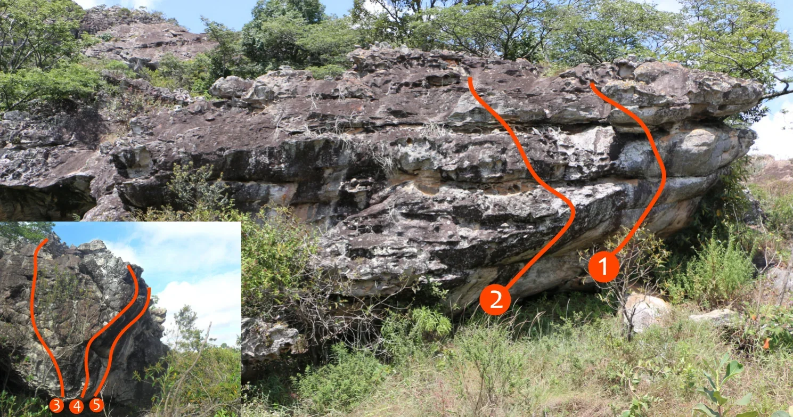
          - **largura_mapa**: 1489
          - **altura_mapa**: 783
          - **pontos_de_interesse**:
            - **[0]**:
              - **id**: YQsTqb0lyKDtOk
              - **uid**: YQsTqb0lyKDtOk
              - **rotulo**: 1
              - **circulo**:
                - **x**: 1134
                - **y**: 501
                - **raio**: 29
              - **label**: 1
            - **[1]**:
              - **id**: eJtWR8oqytD6R4
              - **uid**: eJtWR8oqytD6R4
              - **rotulo**: 2
              - **circulo**:
                - **x**: 930
                - **y**: 563
                - **raio**: 29
              - **label**: 2
            - **[2]**:
              - **id**: AhO7IsDApYPG4G
              - **uid**: AhO7IsDApYPG4G
              - **rotulo**: 3
              - **circulo**:
                - **x**: 106
                - **y**: 761
                - **raio**: 14
              - **label**: 3
            - **[3]**:
              - **id**: bpwVkgwK22ACwc
              - **uid**: bpwVkgwK22ACwc
              - **rotulo**: 4
              - **circulo**:
                - **x**: 143
                - **y**: 763
                - **raio**: 14
              - **label**: 4
            - **[4]**:
              - **id**: r6WDZNzFaYtAiR
              - **uid**: r6WDZNzFaYtAiR
              - **rotulo**: 5
              - **circulo**:
                - **x**: 181
                - **y**: 761
                - **raio**: 14
              - **label**: 5
          - **referencias**:
            - **[0]**:
              - **alvo_uid**: 36JaExr7FNAh6p
              - **pontos_uids**:
                - YQsTqb0lyKDtOk
              - **escalada**: Siricutico
              - **ids**:
                - YQsTqb0lyKDtOk
            - **[1]**:
              - **alvo_uid**: cfB4nSJDpm4TA7
              - **pontos_uids**:
                - eJtWR8oqytD6R4
              - **escalada**: Ziriguidum
              - **ids**:
                - eJtWR8oqytD6R4
            - **[2]**:
              - **alvo_uid**: huRcAwwUu6pKEj
              - **pontos_uids**:
                - AhO7IsDApYPG4G
              - **escalada**: Esticadinha
              - **ids**:
                - AhO7IsDApYPG4G
            - **[3]**:
              - **alvo_uid**: GzWKfqtV2KcjAo
              - **pontos_uids**:
                - bpwVkgwK22ACwc
              - **escalada**: Esquisitinha
              - **ids**:
                - bpwVkgwK22ACwc
            - **[4]**:
              - **alvo_uid**: 25YfaqfQwc55Ij
              - **pontos_uids**:
                - r6WDZNzFaYtAiR
              - **escalada**: Rapunzel
              - **ids**:
                - r6WDZNzFaYtAiR
        - **[1]**:
          - **caminho_imagem_mapa**: 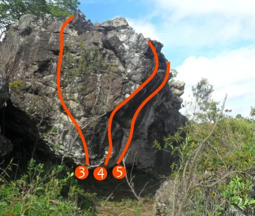
          - **largura_mapa**: 509
          - **altura_mapa**: 432
          - **pontos_de_interesse**:
            - **[0]**:
              - **id**: gWVaDETQ9TKqQl
              - **uid**: gWVaDETQ9TKqQl
              - **rotulo**: 3
              - **circulo**:
                - **x**: 163
                - **y**: 345
                - **raio**: 14
              - **label**: 3
            - **[1]**:
              - **id**: sRmh2jv9jIzVMC
              - **uid**: sRmh2jv9jIzVMC
              - **rotulo**: 4
              - **circulo**:
                - **x**: 200
                - **y**: 347
                - **raio**: 14
              - **label**: 4
            - **[2]**:
              - **id**: RNSZjKwD5Almvb
              - **uid**: RNSZjKwD5Almvb
              - **rotulo**: 5
              - **circulo**:
                - **x**: 238
                - **y**: 344
                - **raio**: 14
              - **label**: 5
          - **referencias**:
            - **[0]**:
              - **alvo_uid**: huRcAwwUu6pKEj
              - **pontos_uids**:
                - gWVaDETQ9TKqQl
              - **escalada**: Esticadinha
              - **ids**:
                - gWVaDETQ9TKqQl
            - **[1]**:
              - **alvo_uid**: GzWKfqtV2KcjAo
              - **pontos_uids**:
                - sRmh2jv9jIzVMC
              - **escalada**: Esquisitinha
              - **ids**:
                - sRmh2jv9jIzVMC
            - **[2]**:
              - **alvo_uid**: 25YfaqfQwc55Ij
              - **pontos_uids**:
                - RNSZjKwD5Almvb
              - **escalada**: Rapunzel
              - **ids**:
                - RNSZjKwD5Almvb
      - **escaladas**:
        - **[0]**:
          - **uid**: 36JaExr7FNAh6p
          - **boulder**:
            - **nome**: Siricutico
            - **dificuldade**: V2
        - **[1]**:
          - **uid**: cfB4nSJDpm4TA7
          - **boulder**:
            - **nome**: Ziriguidum
            - **dificuldade**: V5
        - **[2]**:
          - **uid**: huRcAwwUu6pKEj
          - **boulder**:
            - **nome**: Esticadinha
            - **dificuldade**: V3
        - **[3]**:
          - **uid**: GzWKfqtV2KcjAo
          - **boulder**:
            - **nome**: Esquisitinha
            - **dificuldade**: V2
        - **[4]**:
          - **uid**: 25YfaqfQwc55Ij
          - **boulder**:
            - **nome**: Rapunzel
            - **dificuldade**: V3
      - **precomputados**:
        - **total_escaladas**: 5
        - **total_boulders**: 5
  - **[2]**:
    - **conteudo**:
      - **descricao**: 
      - **nome**: Setor Eco
      - **uid**: yuPPXErIZPAcv3
      - **mapas**:
        - **[0]**:
          - **caminho_imagem_mapa**: 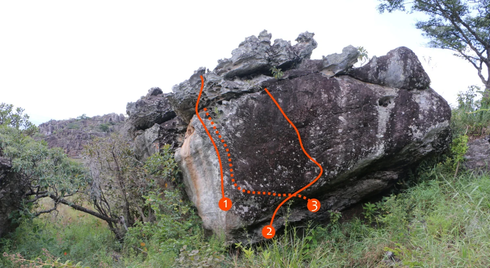
          - **largura_mapa**: 1498
          - **altura_mapa**: 818
          - **pontos_de_interesse**:
            - **[0]**:
              - **id**: pu9Yey6ykGQkWu
              - **uid**: pu9Yey6ykGQkWu
              - **rotulo**: 1
              - **circulo**:
                - **x**: 689
                - **y**: 623
                - **raio**: 21
              - **label**: 1
            - **[1]**:
              - **id**: WPqiS6Jj0Slrsg
              - **uid**: WPqiS6Jj0Slrsg
              - **rotulo**: 2
              - **circulo**:
                - **x**: 821
                - **y**: 708
                - **raio**: 21
              - **label**: 2
            - **[2]**:
              - **id**: JXh2fmXfHPEUoU
              - **uid**: JXh2fmXfHPEUoU
              - **rotulo**: 3
              - **circulo**:
                - **x**: 959
                - **y**: 627
                - **raio**: 21
              - **label**: 3
          - **referencias**:
            - **[0]**:
              - **alvo_uid**: y8KtNOKYkMPJ3t
              - **pontos_uids**:
                - pu9Yey6ykGQkWu
              - **escalada**: Baioneta
              - **ids**:
                - pu9Yey6ykGQkWu
            - **[1]**:
              - **alvo_uid**: OJhop79XvZ0mHc
              - **pontos_uids**:
                - WPqiS6Jj0Slrsg
              - **escalada**: Eco
              - **ids**:
                - WPqiS6Jj0Slrsg
            - **[2]**:
              - **alvo_uid**: Q6d7xHVLitHidA
              - **pontos_uids**:
                - JXh2fmXfHPEUoU
              - **escalada**: Escotilha
              - **ids**:
                - JXh2fmXfHPEUoU
      - **escaladas**:
        - **[0]**:
          - **uid**: y8KtNOKYkMPJ3t
          - **boulder**:
            - **nome**: Baioneta
            - **dificuldade**: V5
        - **[1]**:
          - **uid**: OJhop79XvZ0mHc
          - **boulder**:
            - **nome**: Eco
            - **dificuldade**: V3
        - **[2]**:
          - **uid**: Q6d7xHVLitHidA
          - **boulder**:
            - **nome**: Escotilha
            - **dificuldade**: V3
      - **precomputados**:
        - **total_escaladas**: 3
        - **total_boulders**: 3
  - **[3]**:
    - **conteudo**:
      - **descricao**: 
      - **nome**: Setor Meretríssimo
      - **uid**: KqHIgclXOMpIHp
      - **mapas**:
        - **[0]**:
          - **caminho_imagem_mapa**: 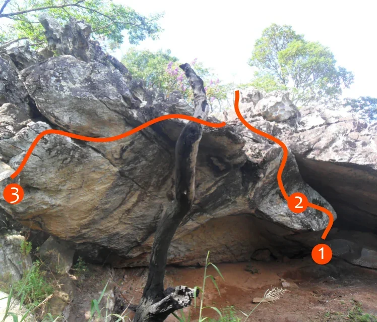
          - **largura_mapa**: 748
          - **altura_mapa**: 638
          - **pontos_de_interesse**:
            - **[0]**:
              - **id**: th3GmMB18XrsCd
              - **uid**: th3GmMB18XrsCd
              - **rotulo**: 1
              - **circulo**:
                - **x**: 638
                - **y**: 503
                - **raio**: 21
              - **label**: 1
            - **[1]**:
              - **id**: j1smOmpkCtlch1
              - **uid**: j1smOmpkCtlch1
              - **rotulo**: 2
              - **circulo**:
                - **x**: 591
                - **y**: 401
                - **raio**: 21
              - **label**: 2
            - **[2]**:
              - **id**: 6mSrLAL5jmfwe8
              - **uid**: 6mSrLAL5jmfwe8
              - **rotulo**: 3
              - **circulo**:
                - **x**: 27
                - **y**: 384
                - **raio**: 21
              - **label**: 3
          - **referencias**:
            - **[0]**:
              - **alvo_uid**: HTyqIQxkod8Va2
              - **pontos_uids**:
                - th3GmMB18XrsCd
              - **escalada**: Meretríssimo SDS
              - **ids**:
                - th3GmMB18XrsCd
            - **[1]**:
              - **alvo_uid**: mX6zlnERemq96A
              - **pontos_uids**:
                - j1smOmpkCtlch1
              - **escalada**: Meretríssimo
              - **ids**:
                - j1smOmpkCtlch1
            - **[2]**:
              - **alvo_uid**: R5SUGms1roTFF1
              - **pontos_uids**:
                - 6mSrLAL5jmfwe8
              - **escalada**: Toco Preto
              - **ids**:
                - 6mSrLAL5jmfwe8
      - **escaladas**:
        - **[0]**:
          - **uid**: HTyqIQxkod8Va2
          - **boulder**:
            - **descricao**: Projeto
            - **nome**: Meretríssimo SDS
            - **dificuldade**: INDEFINIDO
        - **[1]**:
          - **uid**: mX6zlnERemq96A
          - **boulder**:
            - **nome**: Meretríssimo
            - **dificuldade**: V4
        - **[2]**:
          - **uid**: R5SUGms1roTFF1
          - **boulder**:
            - **nome**: Toco Preto
            - **dificuldade**: V2
      - **precomputados**:
        - **total_escaladas**: 3
        - **total_boulders**: 3
  - **[4]**:
    - **conteudo**:
      - **descricao**: 
      - **nome**: Setor Diabinha
      - **uid**: 9CuBV3INHGsfir
      - **mapas**:
        - **[0]**:
          - **caminho_imagem_mapa**: 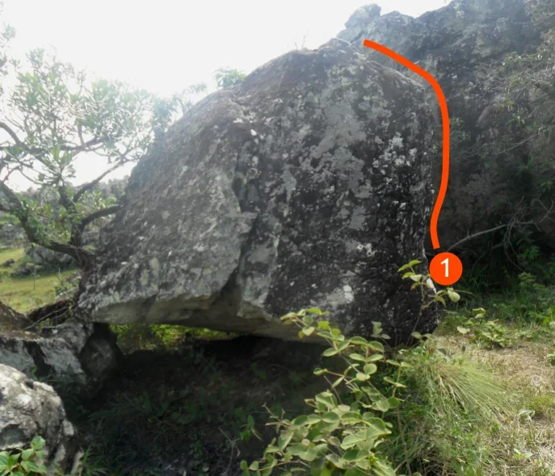
          - **largura_mapa**: 687
          - **altura_mapa**: 590
          - **referencias**:
            - **[0]**:
              - **alvo_uid**: bAAuLTvi4tU3cg
              - **pontos_uids**:
                - dxpJln3fC55fhU
              - **escalada**: Diabinha
              - **ids**:
                - dxpJln3fC55fhU
          - **pontos_de_interesse**:
            - **[0]**:
              - **id**: dxpJln3fC55fhU
              - **uid**: dxpJln3fC55fhU
              - **rotulo**: 1
              - **circulo**:
                - **x**: 551
                - **y**: 333
                - **raio**: 20
              - **label**: 1
      - **escaladas**:
        - **[0]**:
          - **uid**: bAAuLTvi4tU3cg
          - **boulder**:
            - **nome**: Diabinha
            - **dificuldade**: V0
      - **precomputados**:
        - **total_escaladas**: 1
        - **total_boulders**: 1
  - **[5]**:
    - **conteudo**:
      - **descricao**: 
      - **nome**: Setor Beiço
      - **uid**: Nb5NpumVgjymga
      - **mapas**:
        - **[0]**:
          - **caminho_imagem_mapa**: 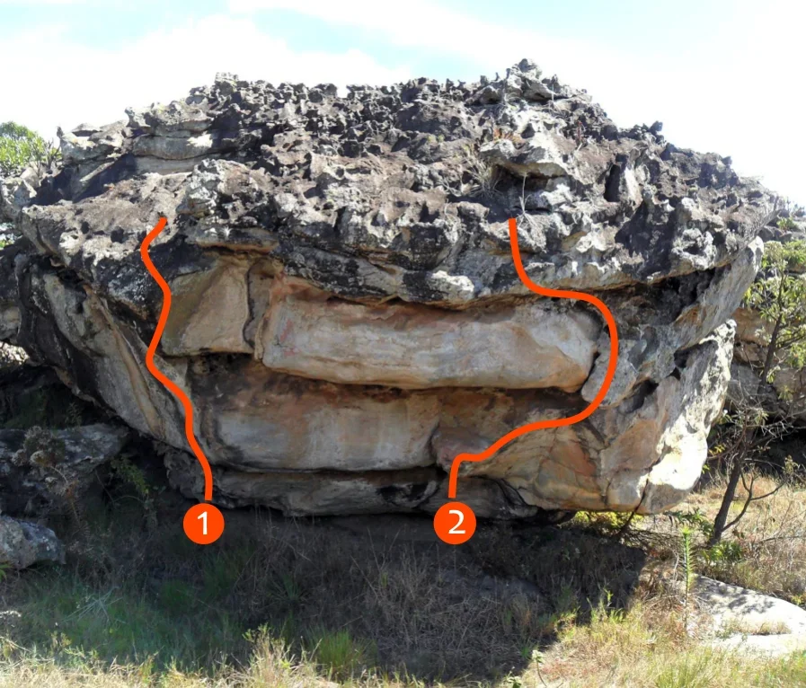
          - **largura_mapa**: 897
          - **altura_mapa**: 766
          - **pontos_de_interesse**:
            - **[0]**:
              - **id**: C4pXBQ4IbfuWyI
              - **uid**: C4pXBQ4IbfuWyI
              - **rotulo**: 1
              - **circulo**:
                - **x**: 227
                - **y**: 583
                - **raio**: 23
              - **label**: 1
            - **[1]**:
              - **id**: sEkwDpjChG7WDn
              - **uid**: sEkwDpjChG7WDn
              - **rotulo**: 2
              - **circulo**:
                - **x**: 506
                - **y**: 583
                - **raio**: 24
              - **label**: 2
          - **referencias**:
            - **[0]**:
              - **alvo_uid**: RHedK3Me2Fjage
              - **pontos_uids**:
                - C4pXBQ4IbfuWyI
              - **escalada**: Beiçudo
              - **ids**:
                - C4pXBQ4IbfuWyI
            - **[1]**:
              - **alvo_uid**: 4G1OUWnVQmd1zb
              - **pontos_uids**:
                - sEkwDpjChG7WDn
              - **escalada**: Beiçola
              - **ids**:
                - sEkwDpjChG7WDn
        - **[1]**:
          - **caminho_imagem_mapa**: 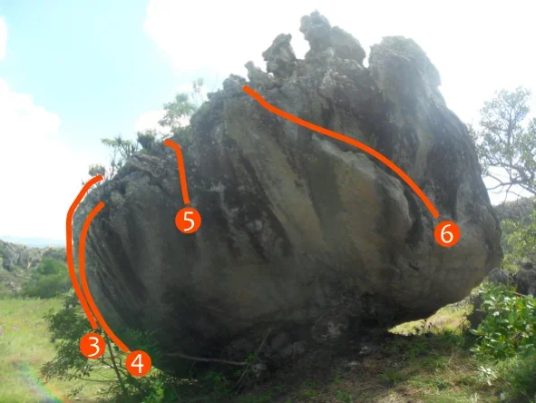
          - **largura_mapa**: 591
          - **altura_mapa**: 444
          - **pontos_de_interesse**:
            - **[0]**:
              - **id**: UWc1Xt3Fi7V0hy
              - **uid**: UWc1Xt3Fi7V0hy
              - **rotulo**: 3
              - **circulo**:
                - **x**: 102
                - **y**: 381
                - **raio**: 15
              - **label**: 3
            - **[1]**:
              - **id**: tUL6Ezw1Dqc511
              - **uid**: tUL6Ezw1Dqc511
              - **rotulo**: 4
              - **circulo**:
                - **x**: 153
                - **y**: 401
                - **raio**: 15
              - **label**: 4
            - **[2]**:
              - **id**: KEBm1xNL6dksFT
              - **uid**: KEBm1xNL6dksFT
              - **rotulo**: 5
              - **circulo**:
                - **x**: 208
                - **y**: 243
                - **raio**: 15
              - **label**: 5
            - **[3]**:
              - **id**: YhxI9sjMfFjqes
              - **uid**: YhxI9sjMfFjqes
              - **rotulo**: 6
              - **circulo**:
                - **x**: 493
                - **y**: 257
                - **raio**: 15
              - **label**: 6
          - **referencias**:
            - **[0]**:
              - **alvo_uid**: gJICFBx1hKJsly
              - **pontos_uids**:
                - UWc1Xt3Fi7V0hy
              - **escalada**: Boulder dos Buracos
              - **ids**:
                - UWc1Xt3Fi7V0hy
            - **[1]**:
              - **alvo_uid**: euig8hVhiXbzsh
              - **pontos_uids**:
                - tUL6Ezw1Dqc511
              - **escalada**: Zé Colméia
              - **ids**:
                - tUL6Ezw1Dqc511
            - **[2]**:
              - **alvo_uid**: I5h35zGNppQiH5
              - **pontos_uids**:
                - KEBm1xNL6dksFT
              - **escalada**: Charlie
              - **ids**:
                - KEBm1xNL6dksFT
            - **[3]**:
              - **alvo_uid**: wkP02LEhWXJnUP
              - **pontos_uids**:
                - YhxI9sjMfFjqes
              - **escalada**: Bravo
              - **ids**:
                - YhxI9sjMfFjqes
      - **escaladas**:
        - **[0]**:
          - **uid**: RHedK3Me2Fjage
          - **boulder**:
            - **nome**: Beiçudo
            - **dificuldade**: V2
        - **[1]**:
          - **uid**: 4G1OUWnVQmd1zb
          - **boulder**:
            - **nome**: Beiçola
            - **dificuldade**: V2
        - **[2]**:
          - **uid**: gJICFBx1hKJsly
          - **boulder**:
            - **nome**: Boulder dos Buracos
            - **dificuldade**: V0
        - **[3]**:
          - **uid**: euig8hVhiXbzsh
          - **boulder**:
            - **nome**: Zé Colméia
            - **dificuldade**: V2
        - **[4]**:
          - **uid**: I5h35zGNppQiH5
          - **boulder**:
            - **nome**: Charlie
            - **dificuldade**: V4
        - **[5]**:
          - **uid**: wkP02LEhWXJnUP
          - **boulder**:
            - **nome**: Bravo
            - **dificuldade**: V5
      - **precomputados**:
        - **total_escaladas**: 6
        - **total_boulders**: 6
  - **[6]**:
    - **conteudo**:
      - **descricao**: 
      - **nome**: Setor Fingerboard
      - **uid**: tsLPexCvGZbhiu
      - **mapas**:
        - **[0]**:
          - **caminho_imagem_mapa**: 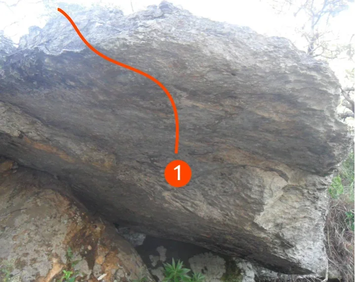
          - **largura_mapa**: 719
          - **altura_mapa**: 570
          - **pontos_de_interesse**:
            - **[0]**:
              - **id**: xYVVgkGF8cV8MA
              - **uid**: xYVVgkGF8cV8MA
              - **rotulo**: 1
              - **circulo**:
                - **x**: 360
                - **y**: 350
                - **raio**: 28
              - **label**: 1
          - **referencias**:
            - **[0]**:
              - **alvo_uid**: SHl29lnnUSsjet
              - **pontos_uids**:
                - xYVVgkGF8cV8MA
              - **escalada**: Fingerboard
              - **ids**:
                - xYVVgkGF8cV8MA
      - **escaladas**:
        - **[0]**:
          - **uid**: SHl29lnnUSsjet
          - **boulder**:
            - **nome**: Fingerboard
            - **dificuldade**: V0
      - **precomputados**:
        - **total_escaladas**: 1
        - **total_boulders**: 1
  - **[7]**:
    - **conteudo**:
      - **descricao**: 
      - **nome**: Setor Carga Pesada
      - **uid**: 0HG2zaGIDNfYkO
      - **mapas**:
        - **[0]**:
          - **caminho_imagem_mapa**: 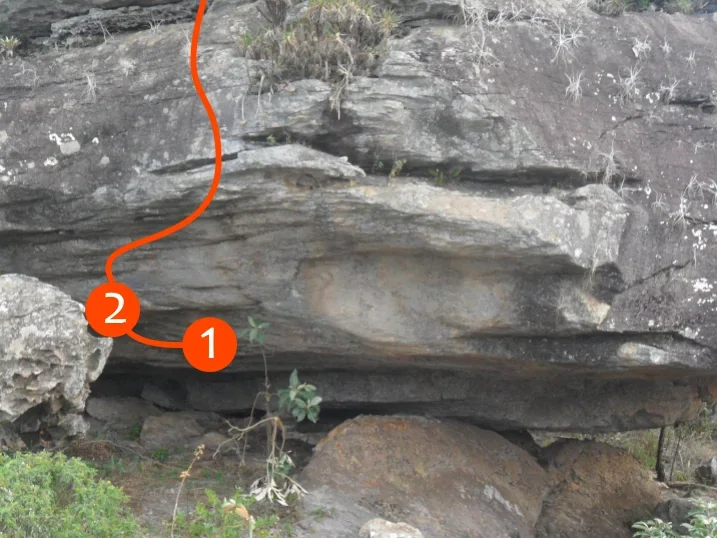
          - **largura_mapa**: 717
          - **altura_mapa**: 538
          - **pontos_de_interesse**:
            - **[0]**:
              - **id**: h9RJVgXydPFxc4
              - **uid**: h9RJVgXydPFxc4
              - **rotulo**: 1
              - **circulo**:
                - **x**: 209
                - **y**: 344
                - **raio**: 27
              - **label**: 1
            - **[1]**:
              - **id**: WmsVyLtK2yNie0
              - **uid**: WmsVyLtK2yNie0
              - **rotulo**: 2
              - **circulo**:
                - **x**: 113
                - **y**: 310
                - **raio**: 28
              - **label**: 2
          - **referencias**:
            - **[0]**:
              - **alvo_uid**: PmsXLCY0w8853F
              - **pontos_uids**:
                - h9RJVgXydPFxc4
              - **escalada**: Carga Pesada SDS
              - **ids**:
                - h9RJVgXydPFxc4
            - **[1]**:
              - **alvo_uid**: 0FQUCOmuLlYRhY
              - **pontos_uids**:
                - WmsVyLtK2yNie0
              - **escalada**: Carga Pesada
              - **ids**:
                - WmsVyLtK2yNie0
      - **escaladas**:
        - **[0]**:
          - **uid**: PmsXLCY0w8853F
          - **boulder**:
            - **descricao**: Projeto
            - **nome**: Carga Pesada SDS
            - **dificuldade**: INDEFINIDO
        - **[1]**:
          - **uid**: 0FQUCOmuLlYRhY
          - **boulder**:
            - **nome**: Carga Pesada
            - **dificuldade**: V6
      - **precomputados**:
        - **total_escaladas**: 2
        - **total_boulders**: 2
  - **[8]**:
    - **conteudo**:
      - **descricao**: 
      - **nome**: Setor Viúva Negra
      - **uid**: C97T2kD4KlLc5k
      - **mapas**:
        - **[0]**:
          - **caminho_imagem_mapa**: 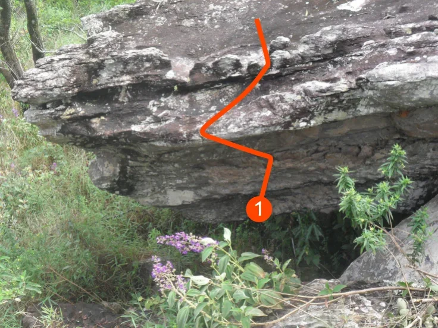
          - **largura_mapa**: 736
          - **altura_mapa**: 552
          - **pontos_de_interesse**:
            - **[0]**:
              - **id**: zqtJljem1Fmm3d
              - **uid**: zqtJljem1Fmm3d
              - **rotulo**: 01
              - **circulo**:
                - **x**: 436
                - **y**: 352
                - **raio**: 22
              - **label**: 01
          - **referencias**:
            - **[0]**:
              - **alvo_uid**: INSs0hRJpjXiZ1
              - **pontos_uids**:
                - zqtJljem1Fmm3d
              - **escalada**: Viúva Negra
              - **ids**:
                - zqtJljem1Fmm3d
      - **escaladas**:
        - **[0]**:
          - **uid**: INSs0hRJpjXiZ1
          - **boulder**:
            - **nome**: Viúva Negra
            - **dificuldade**: V1
      - **precomputados**:
        - **total_escaladas**: 1
        - **total_boulders**: 1
  - **[9]**:
    - **conteudo**:
      - **descricao**: 
      - **nome**: Setor Ota Aranha
      - **uid**: mR729A8fCLvODT
      - **mapas**:
        - **[0]**:
          - **caminho_imagem_mapa**: 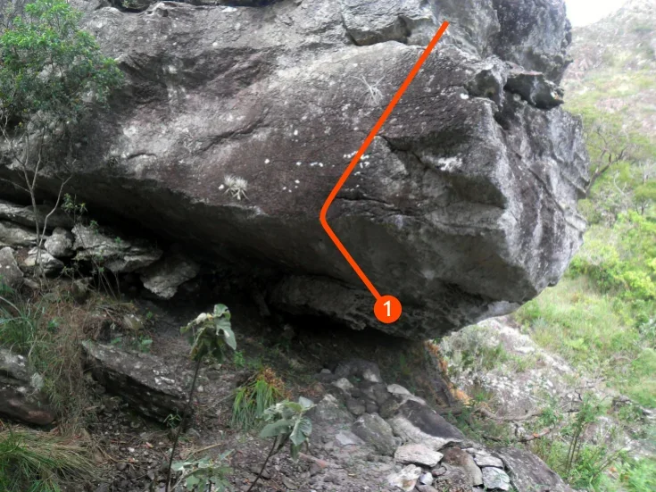
          - **largura_mapa**: 735
          - **altura_mapa**: 551
          - **pontos_de_interesse**:
            - **[0]**:
              - **id**: lqrx8KkR7WUYxh
              - **uid**: lqrx8KkR7WUYxh
              - **rotulo**: 1
              - **circulo**:
                - **x**: 435
                - **y**: 346
                - **raio**: 15
              - **label**: 1
          - **referencias**:
            - **[0]**:
              - **alvo_uid**: k39YipP1THFdye
              - **pontos_uids**:
                - lqrx8KkR7WUYxh
              - **escalada**: Ota Aranha
              - **ids**:
                - lqrx8KkR7WUYxh
      - **escaladas**:
        - **[0]**:
          - **uid**: k39YipP1THFdye
          - **boulder**:
            - **nome**: Ota Aranha
            - **dificuldade**: V9
      - **precomputados**:
        - **total_escaladas**: 1
        - **total_boulders**: 1
  - **[10]**:
    - **conteudo**:
      - **descricao**: 
      - **nome**: Setor Módulo
      - **uid**: j97CGXceBaTVAD
      - **mapas**:
        - **[0]**:
          - **caminho_imagem_mapa**: 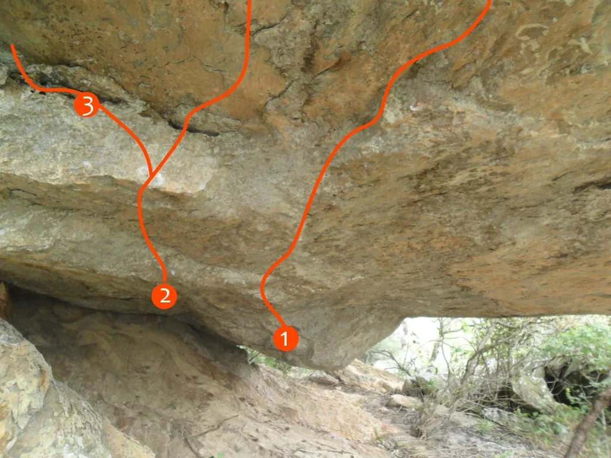
          - **largura_mapa**: 1044
          - **altura_mapa**: 783
          - **pontos_de_interesse**:
            - **[0]**:
              - **id**: RREQwWPsxzumzb
              - **uid**: RREQwWPsxzumzb
              - **rotulo**: 1
              - **circulo**:
                - **x**: 488
                - **y**: 579
                - **raio**: 22
              - **label**: 1
            - **[1]**:
              - **id**: C43QdEh24x2NnE
              - **uid**: C43QdEh24x2NnE
              - **rotulo**: 2
              - **circulo**:
                - **x**: 280
                - **y**: 507
                - **raio**: 22
              - **label**: 2
            - **[2]**:
              - **id**: nHQNQmsT9tZJQL
              - **uid**: nHQNQmsT9tZJQL
              - **rotulo**: 3
              - **circulo**:
                - **x**: 147
                - **y**: 179
                - **raio**: 22
              - **label**: 3
          - **referencias**:
            - **[0]**:
              - **alvo_uid**: U8CPEmbmO55mcF
              - **pontos_uids**:
                - RREQwWPsxzumzb
              - **escalada**: Módulo
              - **ids**:
                - RREQwWPsxzumzb
            - **[1]**:
              - **alvo_uid**: pTWKa2eTcq44c2
              - **pontos_uids**:
                - C43QdEh24x2NnE
              - **escalada**: Dilúvio
              - **ids**:
                - C43QdEh24x2NnE
            - **[2]**:
              - **alvo_uid**: oU9mlcIVjbZ3RC
              - **pontos_uids**:
                - nHQNQmsT9tZJQL
              - **escalada**: Tempestade
              - **ids**:
                - nHQNQmsT9tZJQL
      - **escaladas**:
        - **[0]**:
          - **uid**: U8CPEmbmO55mcF
          - **boulder**:
            - **descricao**: Projeto.
            - **nome**: Módulo
            - **dificuldade**: INDEFINIDO
        - **[1]**:
          - **uid**: pTWKa2eTcq44c2
          - **boulder**:
            - **nome**: Dilúvio
            - **dificuldade**: V4
        - **[2]**:
          - **uid**: oU9mlcIVjbZ3RC
          - **boulder**:
            - **nome**: Tempestade
            - **dificuldade**: V3
      - **precomputados**:
        - **total_escaladas**: 3
        - **total_boulders**: 3
- **precomputados**:
  - **total_escaladas**: 38
  - **total_boulders**: 38

## Arquivos Externos

- **arquivos_externos**:
  - **[0]**:
    - **caminho**: 
    - **checksum_sha256**: cf2249fdfb93f1d243846c8cea2592af9e74f8c3a04b79f5769cc4d555af6e51
  - **[1]**:
    - **caminho**: 
    - **checksum_sha256**: ba5b00a13c669a5fe06c71921f73b0b3b840fa491cd6f92278d98744b34dd8a3
  - **[2]**:
    - **caminho**: 
    - **checksum_sha256**: 73d7b465868dde1f1f024a176f2bea63e501e18027066f14564efec189d49dc8
  - **[3]**:
    - **caminho**: 
    - **checksum_sha256**: 28917e006488f18e75eb616c103211db0f85c73f337498a8d84039ba75b8cacb
  - **[4]**:
    - **caminho**: 
    - **checksum_sha256**: e112313ac0302c831dc4442542e0807ec542cc50370521f99b2a40f6f4db1cd9
  - **[5]**:
    - **caminho**: 
    - **checksum_sha256**: ac75c793cf80a57c919291b0a2a703d5ef0e36b726ee7a93471654d9dc6e34a6
  - **[6]**:
    - **caminho**: 
    - **checksum_sha256**: 329eb34f4bdb4e7944b5a4b9348b064d399d951f528b41e1b3957649b7138fa0
  - **[7]**:
    - **caminho**: 
    - **checksum_sha256**: 9f602c432e5bfe0a6a9a606f73fd03f2579b31e4f727cffe189d3bce465fe837
  - **[8]**:
    - **caminho**: 
    - **checksum_sha256**: 25af18a42d1eff1e7b0a344c4a0e1747bf1f66e3e7a2b683268d75c3f09d4910
  - **[9]**:
    - **caminho**: 
    - **checksum_sha256**: 16e0abe8fcadf5f44a9b3b7f97c92ab8ffc3f6bcbcf5e99bdc5d6eb1f405c7fc
  - **[10]**:
    - **caminho**: 
    - **checksum_sha256**: 06728b1f02c04fbed1ecd68c47de85d0274741d8a0362843d71c710dc58d3f03
  - **[11]**:
    - **caminho**: 
    - **checksum_sha256**: ac30643924a309a25b39e834251d9dca63b156fcba14859d18af1c82cf256755
  - **[12]**:
    - **caminho**: 
    - **checksum_sha256**: 2acd56cd8d92ede8e08d4fcda7f3974d791626199eb23ce4a47c7e42aa1c3efb
  - **[13]**:
    - **caminho**: 
    - **checksum_sha256**: d0614f7a5aa5969ec6478462473e42da9cb8315ee1e8f3c23f88f130015b2efa
  - **[14]**:
    - **caminho**: 
    - **checksum_sha256**: e2936e7cf18eb82de721e3975e9750192eaba5fb276bcbf760c5c9205b9188c1
  - **[15]**:
    - **caminho**: 
    - **checksum_sha256**: 37c60e7389ba5aeb199a294eb6b29a1c815ec5918b465245ca07307b012be882
  - **[16]**:
    - **caminho**: 
    - **checksum_sha256**: 33a72a9d1ce52ef9bfe4e824d9536d971bce0de6d58caaf2632096e6fdc35a0e
  - **[17]**:
    - **caminho**: 
    - **checksum_sha256**: bc37532b7225004450f5ac4a51fbba3574efa7e69311ea43a3869462fcfa1f94
  - **[18]**:
    - **caminho**: 
    - **checksum_sha256**: 9c0a44219ef659579e425036f19a92831b1bd74f1a32d2c4338e44e59bfb8620
  - **[19]**:
    - **caminho**: 
    - **checksum_sha256**: 288d0f2fbe2d5304faea37a70d03c73639540fd43c656a709742cd0126d1a97e
  - **[20]**:
    - **caminho**: 
    - **checksum_sha256**: 9d281dcc04f5923ebce36ed133c1a8e04a4edc86f31078d1e6da85449a9dd364
  - **[21]**:
    - **caminho**: 
    - **checksum_sha256**: 9bca8cd13ddfc1d12ed745347a78767239ff5345b87f52b88d5759efd9586cab
  - **[22]**:
    - **caminho**: 
    - **checksum_sha256**: 18a708c4433517adab1559d9c26a2b84ea78a0b40d4e6b9f1e8fdd962067746d
  - **[23]**:
    - **caminho**: 
    - **checksum_sha256**: 16f276176c139a8a824803dec0918089261539b9efe5e0d460e51f7aa5905009
  - **[24]**:
    - **caminho**: 
    - **checksum_sha256**: e6465a5e881ca27285874caa045e37cf94cb5c1f9c2b7b9eaee9ca12b9da385e
  - **[25]**:
    - **caminho**: 
    - **checksum_sha256**: efb15a71546c39c1ad245df24ce3252ff65d9622a9bc8e35df8604ce2a75edea
  - **[26]**:
    - **caminho**: 
    - **checksum_sha256**: eb0fce527356d117626469688d966999c9928df35c9287ca34226cfc94db0239
  - **[27]**:
    - **caminho**: 
    - **checksum_sha256**: 050ebfb636b57f861b891c4898c3d5f6de19b35b9e4ab61206e083ec3609a7a3
  - **[28]**:
    - **caminho**: 
    - **checksum_sha256**: 8db51aa9268bf9aa9da14543b6ec8741ac9eddafe79d5a9b8f1622dd9ac83cc9
  - **[29]**:
    - **caminho**: 
    - **checksum_sha256**: 7f0f892f14108079975f18522653eedb32692cac0053254859faa4597b522f63
  - **[30]**:
    - **caminho**: 
    - **checksum_sha256**: 931bb47ea6ea12feeb11465ce74c3472690eb4e500b3dd0121e691629c647ac1
  - **[31]**:
    - **caminho**: 
    - **checksum_sha256**: 599ecc799e83a22b4f52793ba456b053a466fb84c20e978a618b2e340c66b8ba
  - **[32]**:
    - **caminho**: 
    - **checksum_sha256**: f8be8b256f8b0d8ca28236643b0e2fd7d30579df46ad6bf3870a718e43f7ab0c
  - **[33]**:
    - **caminho**: 
    - **checksum_sha256**: 1b4f78ba7c68ac332e3bd8104ee00a7cb04217f6df873a6e2cd9e246f78ce788
  - **[34]**:
    - **caminho**: 
    - **checksum_sha256**: d056a2e908cd458d992f08afc65848f183e1cdc164b867e2c14d48bf7ca7aeb4
  - **[35]**:
    - **caminho**: 
    - **checksum_sha256**: fe47277b61c0f0bdab0698f63d81416151575066b1c3e0e2d3d485512cc2baf7
  - **[36]**:
    - **caminho**: 
    - **checksum_sha256**: 83098714b8edda3a8c93faace955c36ca194b796e81d7b14cfb1f56251a232aa
  - **[37]**:
    - **caminho**: 
    - **checksum_sha256**: ee0f06ab67421ceca3673ea3908e0f69bc162e0344a203c75ef638c4a0411c95
  - **[38]**:
    - **caminho**: 
    - **checksum_sha256**: 7dceecd4256df5fcbec295a1a33730257a1b28f84783351ee92056d49040e729
  - **[39]**:
    - **caminho**: 
    - **checksum_sha256**: d7f487f6f86ac492fa853a190ff06d48aa77bd49cd9439acd1bfc5d795521844
  - **[40]**:
    - **caminho**: 
    - **checksum_sha256**: 3f8b93c1c7d4c6a0264f6fb0e55b74cf5833963ccec122e77746b7c5127d5859
  - **[41]**:
    - **caminho**: 
    - **checksum_sha256**: 57029ba72f89b54941fbe106ba7e6bdfbf683f56ffa8710ce54ef5d863aa0db6
  - **[42]**:
    - **caminho**: 
    - **checksum_sha256**: 9024ef22b0d3dd42909665ba57c8cc20d4d03ee54327d3a14735ed3f886408d3
  - **[43]**:
    - **caminho**: 
    - **checksum_sha256**: 2d63d955a7083cd4f603ac840c28b161cc5df58bdca4dac870d6dca2cfe16e5e
  - **[44]**:
    - **caminho**: 
    - **checksum_sha256**: 0bbe7f5afc9669a801f6edcc83124844e19363b9c2631e61104f9baf7661a930
  - **[45]**:
    - **caminho**: 
    - **checksum_sha256**: c5fe731772b944f101e26b3b6675f936dfc234569b9a1111828c094d701db685
  - **[46]**:
    - **caminho**: 
    - **checksum_sha256**: a46770ddf07797d34703479b21f2d27600de3dd6a5c78e81478f6693ac9fd348
  - **[47]**:
    - **caminho**: 
    - **checksum_sha256**: 8cd80b190a2d7d09b928be225118fbcb2ebfd54d887562750daae5e929007f62
  - **[48]**:
    - **caminho**: 
    - **checksum_sha256**: 969fa99307a30930d9c6a9c916fccb6f5b2fa4d0404acf0e89a3c5abc3c7e5b9
  - **[49]**:
    - **caminho**: 
    - **checksum_sha256**: f9c039574cea76e4801c99aab8b6b6004dc96e9d7a3238e1b9da68cd402fd460
  - **[50]**:
    - **caminho**: 
    - **checksum_sha256**: bbf715d081f7fed27f70a2a16090044bf38cddc775761c14c09505e9ea6957c7
  - **[51]**:
    - **caminho**: 
    - **checksum_sha256**: 0821fbff8993f618f2c049b340cc672a9fe90c9eaa9bc971b38c4c492c8a8ab2
  - **[52]**:
    - **caminho**: 
    - **checksum_sha256**: f20351c5cc4d0b2ec213c8d1ee6f7fd20fb88ce4356413aea89edcf6de42bb85
  - **[53]**:
    - **caminho**: 
    - **checksum_sha256**: 83ca5023af5b11b614a01fbffab26315008d7622eeafd30786b10b81d3ed0fc9
  - **[54]**:
    - **caminho**: 
    - **checksum_sha256**: eeb5fb47f4535f7cae9ac151a0828cb293277636768cc43b5195939310f4f7f5
  - **[55]**:
    - **caminho**: 
    - **checksum_sha256**: e72823b8392effb762415f81b2df9cd5dd7c009c13032672eca66848d2d9194f
  - **[56]**:
    - **caminho**: 
    - **checksum_sha256**: fb2798c6dabcbd47215d87724ae5d43dc74def953ebc216ec8b237481492d488
  - **[57]**:
    - **caminho**: 
    - **checksum_sha256**: 4d076e7bbe31f7fbf576684adf098d78e8061fe282bf5b0793cbf9c034350458
  - **[58]**:
    - **caminho**: 
    - **checksum_sha256**: 164ef302aa4a6d89f965d4426262f43364d2c4878904ba564f91622f2035b7be
  - **[59]**:
    - **caminho**: 
    - **checksum_sha256**: bc2c0807d890fd9df595f67dff11fe669996b503cb27d928db8cfacad7da03b1
  - **[60]**:
    - **caminho**: 
    - **checksum_sha256**: 6e46579573e1314492b9d4e72a7c74c9f96e55658cda4580b3941d04eaab8ffa
  - **[61]**:
    - **caminho**: 
    - **checksum_sha256**: 91b2fc073200d15c8f6743035148b97370865bbf1d5b069e590c6e7aa95d7a2b
  - **[62]**:
    - **caminho**: 
    - **checksum_sha256**: f93da19e2d2359a441377b67cb7ce3a0c6aac0eb9d84f8dc8c1de5364e78479e
  - **[63]**:
    - **caminho**: 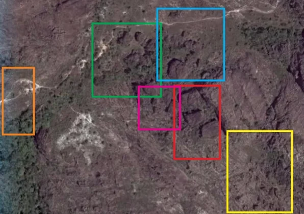
    - **checksum_sha256**: 97f723b8ffea3acbcc79df60b932ddea9a9df919f609d2a17993f8d24784a880

