# Croqui: Sinuosa

## Informações Gerais

- **id**: br_mg_sete_lagoas_sinuosa
- **nome**: Sinuosa
- **creditos**:
  - Jean Carlos
  - Luciana dos Anjos
  - Yuri Vieira
  - Hugo Aguiar
  - Henrique Barcelos
  - Ricardo "Animal"
  - Tadeu Rassi
  - Michel Ângelo
  - Carlos Souza
- **caminho_thumbnail**: 
- **revisado_manualmente**: True
- **status_desenho_extraivel**: NAO_TEM_DESENHO
- **botoes**:
  - **[0]**:
    - **texto**: Capa
    - **destino**:
      - **secao_textual**:
        - **conteudo**:
            # Croqui Sinuosa - Sete Lagoas, MG
            
            |  |
            | :--: |
            | *Capa* |
            
            Este é o croqui da Sinuosa, localizada em Sete Lagoas, MG.
  - **[1]**:
    - **texto**: Regras e Segurança
    - **destino**:
      - **secao_textual**:
        - **conteudo**:
            # Regras e Segurança
            
            **LEIA**
            
            - FIQUE ATENTO QUANTO À SEGURANÇA.
            - ASSINE O TERMO DE RESPONSABILIDADE.
            - ANDE SOMENTE PELAS TRILHAS EXISTENTES.
            - ATENÇÃO QUANTO À VIAS INACABADAS.
            - NUNCA FAÇA FOGUEIRAS.
            - EVITE AGLOMERAÇÕES E ALGAZARRAS.
            - LEVE O SEU LIXO E SE O SEU AMIGO DEIXAR, LEVE O DELE TAMBÉM.
            - ATENÇÃO À ABELHAS E ANIMAIS PEÇONHENTOS.
            - MENORES DEVEM ESTAR ACOMPANHADOS DE UM RESPONSÁVEL LEGAL.
  - **[2]**:
    - **texto**: Turismo e Equipamentos
    - **destino**:
      - **secao_textual**:
        - **conteudo**:
            # Informações ao Turista
            
            ## Melhor Época
            Na Sinuosa o melhor período de visitação é entre os meses de maio a setembro. O clima da região se torna perfeito para a prática.
            
            ## Onde Ficar
            A cidade de Sete Lagoas/MG conta com variadas opções de hospedagem, como: hotéis, pousadas e hostel. A cidade ainda não tem abrigo para escaladores.
            
            ## Alimentação
            Supermercado e restaurante bem ao lado do acesso do pico, no Shopping Sete Lagoas.
            
            ---
            
            ## Lugares para Visitar
            - **Serra Santa Helena:** Ótima opção para passeios com a família e amigos.
            - **Gruta Rei do Mato:** Monumento Estadual Natural, uma das mais importantes grutas do Brasil, com pinturas rupestres e formações únicas encontradas somente aqui e na Espanha.
            - **Lagoas da Cidade:** Grande importância cultural, conhecidas como "A cidade dos Lagos Encantados".
            - **Museu do Ferroviário:** Da antiga Estação do Brasil.
            - **Museu Municipal:** Conta a história da cidade desde a época dos tropeiros de Fernão Dias.
            - **Museu de Mineralogia:** Um dos mais sofisticados do país.
            
            ---
            
            ## Equipamento Sugerido
            - Kit esportivo.
            - Corda de 60m é suficiente, mas a de 70m facilita nas poucas vias mais altas.
            - Para quem curte escalada em móvel, há algumas possibilidades na Sinuosa.
            
            ## Tipo de Rocha
            Calcário
            
            ---
            
            ## Áreas de Escalada Próximos à Sete Lagoas
            - **Gruta do Baú:** 48 km
            - **Gruta da Lapinha:** 55 km
            - **Lapa do Seu Antão:** 51 km
            - **Sítio do Rod:** 58 km
            - **Serra do Cipó:** 112 km
            - **Pedra Rachada:** 102 km
  - **[3]**:
    - **texto**: Curiosidades
    - **destino**:
      - **secao_textual**:
        - **conteudo**:
            # Curiosidades sobre o local
            
            A área de escalada está situada na **Fazenda Arizona**, propriedade privada localizada no meio urbano da cidade de Sete Lagoas, Minas Gerais. A área está inserida a meia encosta da **APA Serra de Santa Helena** (Latitude: 19°27'38.39"S Longitude: 44°16'42.95"O), onde há a presença de Metacalcarenitos e afloramentos calcários, tendo como cobertura vegetal a floresta estacional semidecidual e a parte baixa recoberta por sedimentos onde predomina a vegetação característica do Cerrado.
            
            Em 1937, na primeira edição do livro "As Grutas de Minas Gerais" do antigo IBGE, a área em questão é denominada de **"Lapa Arizona"**, onde são descritas várias informações do afloramento.
            
            O nome **"Sinuosa"** foi dado por escaladores locais em meados da década de 90 devido à curiosa forma da árvore que fica no Setor Primórdios. As primeiras vias do pico foram conquistadas há mais de 20 anos, mas só em 2013 o pico voltou a ser desenvolvido com abertura de novas vias.
            
            Existe um tipo de **caverna vertical** explorada por espeleólogos com mais de 100 metros de profundidade, com vários salões em seu decorrer, formações impressionantes de "esponjas calcárias", entre outras curiosidades sobre o terreno "karst".
  - **[4]**:
    - **texto**: Considerações Finais
    - **destino**:
      - **secao_textual**:
        - **conteudo**:
            # Considerações Finais
            
            | 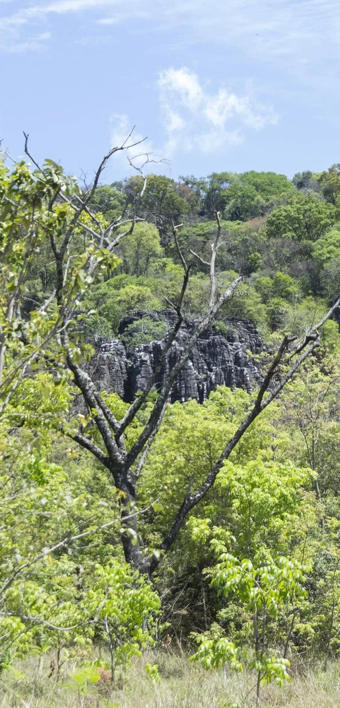 |
            | :--: |
            | *Considerações Finais* |
            
            A área de escalada esportiva **"Sinuosa"** apresenta baixos índices de degradação ambiental relacionados à prática do esporte. Entre os aspectos ambientais analisados, a abertura de trilhas e novos setores é o que apresenta um maior coeficiente de intervenção, devido ao fato da supressão de vegetação e exposição do solo.
            
            Conclui-se ainda que a área apresenta grande potencial para aberturas de novos setores, sendo feita uma estimativa da possibilidade de chegar a **mais de 150 vias**. É importante ressaltar que a presença de escaladores no local contribui de forma positiva, inibindo a presença de caçadores, vândalos e a depredação da fauna, flora e do patrimônio espeleológico.
            
            Além da área mencionada, existem outros locais de destaque no cenário nacional para a prática da escalada na cidade de Sete Lagoas, sendo eles: a **"Área de Escalada Gruta Rei do Mato"**, localizada no Monumento Natural Estadual Gruta Rei do Mato, e a **"Área de Escalada Esportiva Roxane"**, localizada em propriedade particular na zona rural do município. Porém, em ambas a prática da escalada está proibida. Devido a este fato, a possibilidade de novos trabalhos envolvendo a questão ambiental e a prática do esporte se mostra promissora.
  - **[5]**:
    - **texto**: Ficha Técnica
    - **destino**:
      - **secao_textual**:
        - **conteudo**:
            # FICHA TÉCNICA
            
            | 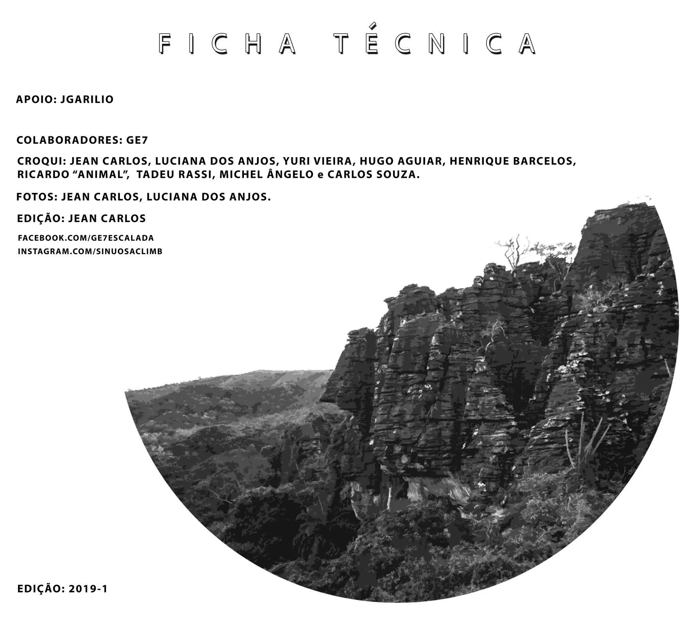 |
            | :--: |
            | *Ficha Técnica* |
            
            **APOIO:** JGARILIO
            
            **COLABORADORES:** GE7
            
            **CROQUI:** JEAN CARLOS, LUCIANA DOS ANJOS, YURI VIEIRA, HUGO AGUIAR, HENRIQUE BARCELOS, RICARDO "ANIMAL", TADEU RASSI, MICHEL ÂNGELO e CARLOS SOUZA.
            
            **FOTOS:** JEAN CARLOS, LUCIANA DOS ANJOS.
            
            **EDIÇÃO:** JEAN CARLOS
            
            **REDES SOCIAIS:**
            - Facebook: [facebook.com/ge7escalada](https://facebook.com/ge7escalada)
            - Instagram: [@sinuosaclimb](https://instagram.com/sinuosaclimb)
            
            **EDIÇÃO:** 2019-1
- **ultima_migracao**: 4
- **publicar_croqui**: True
- **revisado_bounding_circle**: True

## Parte: setor_de_esquerda

### Setor (Pico: Sinuosa)

- **descricao**:
    # Setor de Esquerda
    
    Um dos mais novos setores a ser desenvolvidos no pico, o "Setor de Esquerda"
    é composto por uma bela parede de coloração clara, amarela e avermelhada que se
    caracteriza com concreções e cristais coloridos, a parede é relativamente baixa
    com vias até 15 metros. Destaque para a via "Inimigos do Estado, 6º sup", a primeira
    via do setor.
    
    O sol tem maior incidência no setor, então dê preferência para escalar
    nele nas horas mais amenas do dia.
    
    O setor é ideal para grupos de até 8 pessoas.
    
    Por ser um setor com vias de graduação baixa e estar ao lado do setor "Panelinhas"
    é ideal para os iniciantes.
    
    | 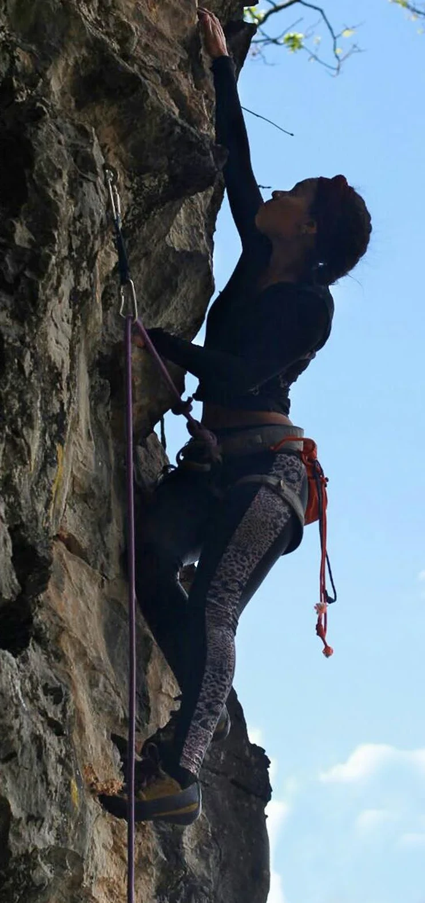 |
    | :--: |
    | *Setor de Esquerda* |
    
    | 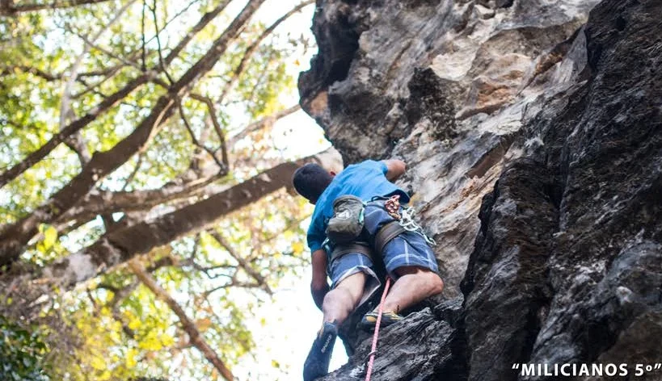 |
    | :--: |
    | *Milicianos 5º* |
    
    |  |
    | :--: |
    | *Inimigos do Estado 6º sup* |
    
    | 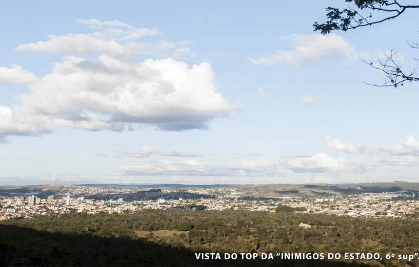 |
    | :--: |
    | *Vista do Top da "Inimigos do Estado" 6º sup* |
- **nome**: Setor de Esquerda
- **mapas**:
  - **[0]**:
    - **caminho_imagem_mapa**: 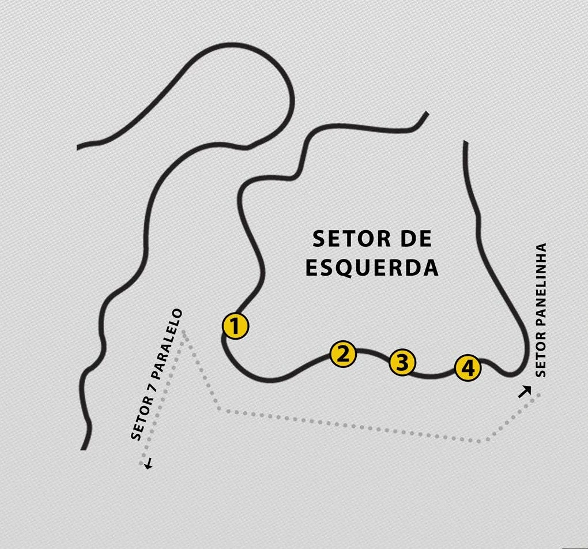
    - **largura_mapa**: 1020
    - **altura_mapa**: 952
    - **pontos_de_interesse**:
      - **[0]**:
        - **id**: 1
        - **label**: 1
        - **circulo**:
          - **x**: 409
          - **y**: 565
          - **raio**: 22
      - **[1]**:
        - **id**: 2
        - **label**: 2
        - **circulo**:
          - **x**: 595
          - **y**: 614
          - **raio**: 22
      - **[2]**:
        - **id**: 3
        - **label**: 3
        - **circulo**:
          - **x**: 698
          - **y**: 628
          - **raio**: 22
      - **[3]**:
        - **id**: 4
        - **label**: 4
        - **circulo**:
          - **x**: 812
          - **y**: 638
          - **raio**: 22
      - **[4]**:
        - **id**: Setor_7_Paralelo
        - **label**: ← SETOR 7 PARALELO
        - **retangulo**:
          - **x**: 269
          - **y**: 648
          - **comprimento**: 36
          - **largura**: 252
          - **angulo_graus_x100**: 1813
      - **[5]**:
        - **id**: Setor_Panelinha
        - **label**: SETOR PANELINHA →
        - **retangulo**:
          - **x**: 937
          - **y**: 537
          - **comprimento**: 34
          - **largura**: 260
    - **referencias**:
      - **[0]**:
        - **escalada**: Milicianos
        - **ids**:
          - 1
      - **[1]**:
        - **escalada**: Inimigos do Estado
        - **ids**:
          - 2
      - **[2]**:
        - **escalada**: Libera a Moça
        - **ids**:
          - 3
      - **[3]**:
        - **escalada**: Moça de 100 Anos
        - **ids**:
          - 4
      - **[4]**:
        - **ids**:
          - Setor_7_Paralelo
        - **setor**: Setor 7 Paralelo
      - **[5]**:
        - **ids**:
          - Setor_Panelinha
        - **setor**: Setor Panelinha
- **escaladas**:
  - **[0]**:
    - **via_esportiva**:
      - **nome**: Milicianos
      - **dificuldade**: BR_5
      - **quantidade_protecoes_intermediarias**: 5
      - **extensao**: 15
  - **[1]**:
    - **via_esportiva**:
      - **descricao**: A primeira via do setor.
      - **nome**: Inimigos do Estado
      - **dificuldade**: BR_6SUP
      - **quantidade_protecoes_intermediarias**: 6
      - **extensao**: 15
  - **[2]**:
    - **via_esportiva**:
      - **nome**: Libera a Moça
      - **dificuldade**: BR_6
      - **quantidade_protecoes_intermediarias**: 6
      - **extensao**: 15
  - **[3]**:
    - **via_esportiva**:
      - **nome**: Moça de 100 Anos
      - **dificuldade**: BR_5SUP
      - **quantidade_protecoes_intermediarias**: 6
      - **extensao**: 15
- **precomputados**:
  - **total_escaladas**: 4
  - **total_esportivas**: 4
  - **total_moveis**: 0
  - **total_boulders**: 0
  - **total_multiplas_enfiadas**: 0
  - **total_highlines**: 0

## Parte: setor_panelinha

### Setor (Pico: Sinuosa)

- **descricao**:
    # Setor Panelinha
    
    O "Panelinha" é composto por paredes escuras em formas circulares que lembram
    "panelas" e teve como objetivo principal nas conquistas, aumentar a possibilidade
    para os iniciantes por serem paredes curtas, verticais e com grande variedades de
    agarras mas que exigem movimentos de escalada bem interessantes.
    
    O setor tem ótima ventilação e tem mais sombra durante as horas fortes do sol que
    o setor abaixo (Setor de Esquerda).
    
    É possível dar a volta na pedra e ter acesso ao top das vias, para
    alguns instrutores esta é uma facilidade na aplicação de ensino de procedimentos
    de ancoragem e desmontagem de vias.
    
    Vista panorâmica do pico e da cidade.
    
    |  |
    | :--: |
    | *Setor Panelinha* |
    
    |  |
    | :--: |
    | *Caipora - 5º* |
    
    |  |
    | :--: |
    | *Vista do Mirante* |
- **nome**: Setor Panelinha
- **mapas**:
  - **[0]**:
    - **caminho_imagem_mapa**: 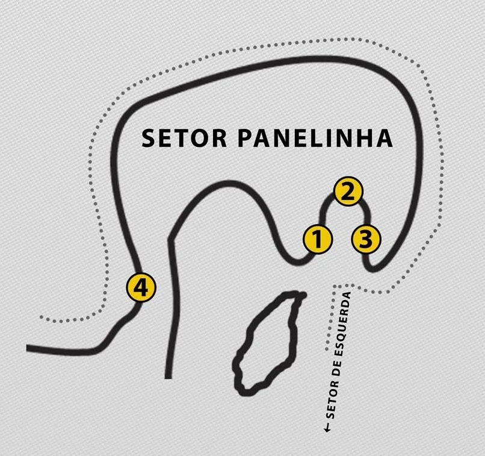
    - **largura_mapa**: 806
    - **altura_mapa**: 757
    - **pontos_de_interesse**:
      - **[0]**:
        - **id**: 1
        - **label**: 1
        - **circulo**:
          - **x**: 528
          - **y**: 397
          - **raio**: 24
      - **[1]**:
        - **id**: 2
        - **label**: 2
        - **circulo**:
          - **x**: 579
          - **y**: 317
          - **raio**: 23
      - **[2]**:
        - **id**: 3
        - **label**: 3
        - **circulo**:
          - **x**: 609
          - **y**: 397
          - **raio**: 23
      - **[3]**:
        - **id**: 4
        - **label**: 4
        - **circulo**:
          - **x**: 235
          - **y**: 477
          - **raio**: 24
      - **[4]**:
        - **id**: Setor_de_Esquerda
        - **label**: ↑ SETOR DE ESQUERDA
        - **retangulo**:
          - **x**: 560
          - **y**: 597
          - **comprimento**: 37
          - **largura**: 248
          - **angulo_graus_x100**: 666
    - **referencias**:
      - **[0]**:
        - **escalada**: Caipora
        - **ids**:
          - 1
      - **[1]**:
        - **escalada**: Tap-Flap
        - **ids**:
          - 2
      - **[2]**:
        - **escalada**: Rá-Tim-Bum
        - **ids**:
          - 3
      - **[3]**:
        - **escalada**: Corda de Violão
        - **ids**:
          - 4
      - **[4]**:
        - **ids**:
          - Setor_de_Esquerda
        - **setor**: Setor de Esquerda
- **escaladas**:
  - **[0]**:
    - **via_esportiva**:
      - **nome**: Caipora
      - **dificuldade**: BR_5
      - **quantidade_protecoes_intermediarias**: 4
  - **[1]**:
    - **via_movel**:
      - **descricao**: Via em móvel.
      - **nome**: Tap-Flap
      - **dificuldade**: BR_4
  - **[2]**:
    - **via_esportiva**:
      - **nome**: Rá-Tim-Bum
      - **dificuldade**: BR_5
      - **quantidade_protecoes_intermediarias**: 5
  - **[3]**:
    - **via_esportiva**:
      - **nome**: Corda de Violão
      - **dificuldade**: BR_5
      - **quantidade_protecoes_intermediarias**: 4
- **precomputados**:
  - **total_escaladas**: 4
  - **total_esportivas**: 3
  - **total_moveis**: 0
  - **total_boulders**: 0
  - **total_multiplas_enfiadas**: 0
  - **total_highlines**: 0

## Parte: setor_7_paralelo

### Setor (Pico: Sinuosa)

- **descricao**:
    # Setor 7 Paralelo
    
    Setor com grande concentração de vias, predomínio de vias de sétimo grau,
    com altura média entre 15 e 25 metros.
    
    Vias fortes com possibilidades de escalada
    bem variada, que exigem bom repertório de movimentos e resistência. O início do
    setor é mais amplo e tem bases limpas, mas em direção às escadas que dão acesso
    ao setor "Sentinela" deve-se tomar cuidado para evitar acidentes, pois este trecho
    é bastante íngreme.
    
    Atenção para a base de algumas vias no final do setor.
    
    Também no final do setor, a maioria das vias é indicado sair com a primeira proteção clipada.
    
    | 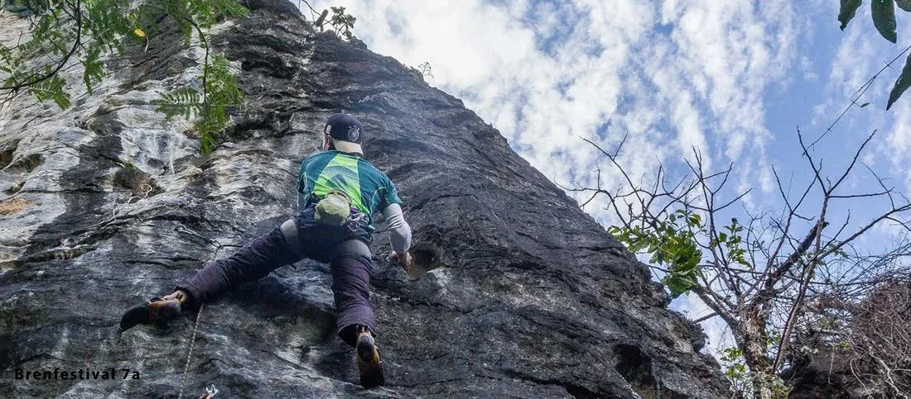 |
    | :--: |
    | *Brenfestival 7a* |
    
    |  |
    | :--: |
    | *Classe Social 8c/9a* |
    
    |  |
    | :--: |
    | *Até mas amigos 6º sup* |
    
    | 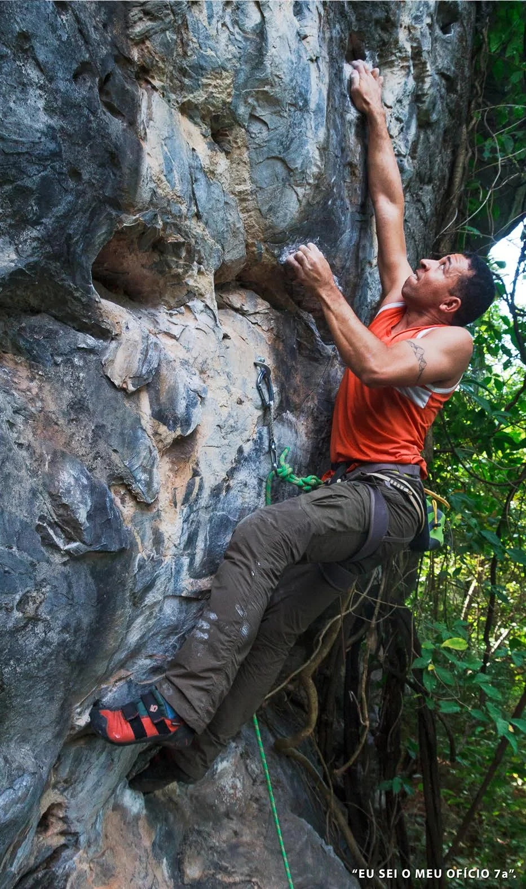 |
    | :--: |
    | *Eu sei o meu ofício 7a* |
    
    | 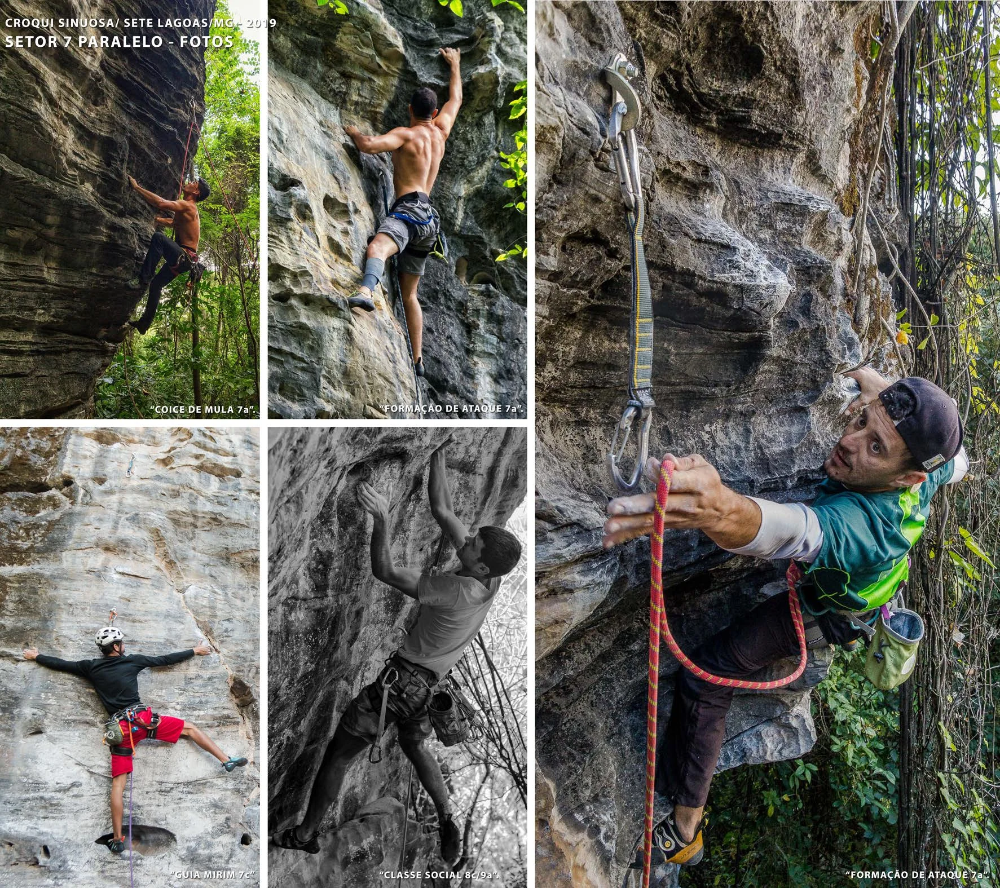 |
    | :--: |
    | *Mais Fotos* |
- **nome**: Setor 7 Paralelo
- **mapas**:
  - **[0]**:
    - **caminho_imagem_mapa**: 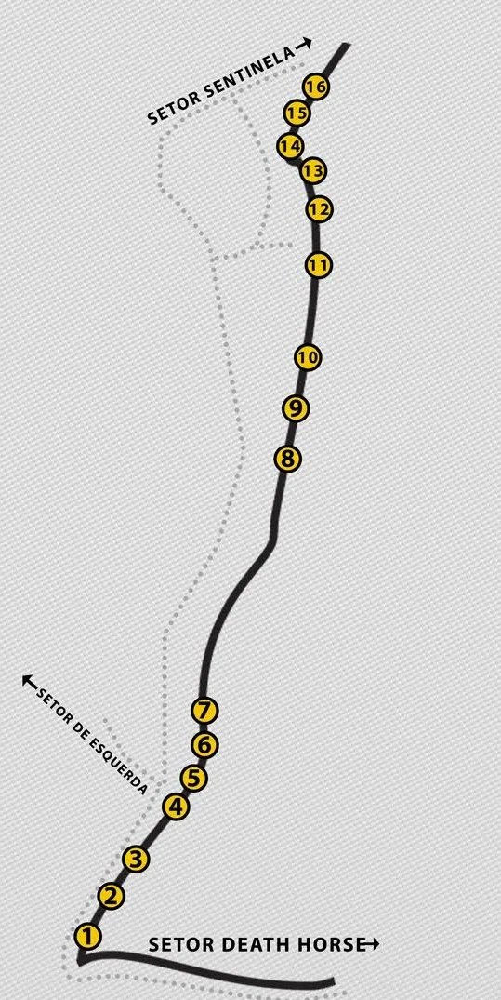
    - **largura_mapa**: 539
    - **altura_mapa**: 1075
    - **pontos_de_interesse**:
      - **[0]**:
        - **id**: 1
        - **label**: 1
        - **circulo**:
          - **x**: 95
          - **y**: 1007
          - **raio**: 14
      - **[1]**:
        - **id**: 2
        - **label**: 2
        - **circulo**:
          - **x**: 120
          - **y**: 963
          - **raio**: 14
      - **[2]**:
        - **id**: 3
        - **label**: 3
        - **circulo**:
          - **x**: 146
          - **y**: 924
          - **raio**: 14
      - **[3]**:
        - **id**: 4
        - **label**: 4
        - **circulo**:
          - **x**: 189
          - **y**: 867
          - **raio**: 14
      - **[4]**:
        - **id**: 5
        - **label**: 5
        - **circulo**:
          - **x**: 209
          - **y**: 837
          - **raio**: 14
      - **[5]**:
        - **id**: 6
        - **label**: 6
        - **circulo**:
          - **x**: 220
          - **y**: 801
          - **raio**: 14
      - **[6]**:
        - **id**: 7
        - **label**: 7
        - **circulo**:
          - **x**: 220
          - **y**: 764
          - **raio**: 14
      - **[7]**:
        - **id**: 8
        - **label**: 8
        - **circulo**:
          - **x**: 310
          - **y**: 493
          - **raio**: 14
      - **[8]**:
        - **id**: 9
        - **label**: 9
        - **circulo**:
          - **x**: 318
          - **y**: 439
          - **raio**: 14
      - **[9]**:
        - **id**: 10
        - **label**: 10
        - **circulo**:
          - **x**: 331
          - **y**: 384
          - **raio**: 14
      - **[10]**:
        - **id**: 11
        - **label**: 11
        - **circulo**:
          - **x**: 343
          - **y**: 285
          - **raio**: 14
      - **[11]**:
        - **id**: 12
        - **label**: 12
        - **circulo**:
          - **x**: 344
          - **y**: 225
          - **raio**: 14
      - **[12]**:
        - **id**: 13
        - **label**: 13
        - **circulo**:
          - **x**: 337
          - **y**: 183
          - **raio**: 14
      - **[13]**:
        - **id**: 14
        - **label**: 14
        - **circulo**:
          - **x**: 312
          - **y**: 157
          - **raio**: 14
      - **[14]**:
        - **id**: 15
        - **label**: 15
        - **circulo**:
          - **x**: 320
          - **y**: 121
          - **raio**: 14
      - **[15]**:
        - **id**: 16
        - **label**: 16
        - **circulo**:
          - **x**: 340
          - **y**: 93
          - **raio**: 14
      - **[16]**:
        - **id**: Setor_Death_Horse
        - **label**: SETOR DEATH HORSE→
        - **retangulo**:
          - **x**: 282
          - **y**: 1014
          - **comprimento**: 265
          - **largura**: 33
      - **[17]**:
        - **id**: Setor_Sentinela
        - **label**: SETOR SENTINELA →
        - **retangulo**:
          - **x**: 246
          - **y**: 86
          - **comprimento**: 203
          - **largura**: 24
          - **angulo_graus_x100**: -2606
      - **[18]**:
        - **id**: Setor_De_Esquerda
        - **label**: ← SETOR DE ESQUERDA
        - **retangulo**:
          - **x**: 90
          - **y**: 786
          - **comprimento**: 195
          - **largura**: 28
          - **angulo_graus_x100**: 4342
    - **referencias**:
      - **[0]**:
        - **escalada**: Eu Sei Meu Ofício
        - **ids**:
          - 1
      - **[1]**:
        - **escalada**: Formação de Ataque
        - **ids**:
          - 2
      - **[2]**:
        - **escalada**: Guia Mirim
        - **ids**:
          - 3
      - **[3]**:
        - **escalada**: Mão de Obra
        - **ids**:
          - 4
      - **[4]**:
        - **escalada**: Coice de Mula
        - **ids**:
          - 5
      - **[5]**:
        - **escalada**: Bebê à Bordo
        - **ids**:
          - 6
      - **[6]**:
        - **escalada**: Micuins Me Mordam
        - **ids**:
          - 7
      - **[7]**:
        - **escalada**: Classe Social
        - **ids**:
          - 8
      - **[8]**:
        - **escalada**: Fobia Social
        - **ids**:
          - 9
      - **[9]**:
        - **escalada**: Vaca Berrante
        - **ids**:
          - 10
      - **[10]**:
        - **escalada**: Até Mas Amigos
        - **ids**:
          - 11
      - **[11]**:
        - **escalada**: Inconfidentes
        - **ids**:
          - 12
      - **[12]**:
        - **escalada**: Brenfestival
        - **ids**:
          - 13
      - **[13]**:
        - **escalada**: Sociedade dos Insetos
        - **ids**:
          - 14
      - **[14]**:
        - **escalada**: Dilemas do Futuro
        - **ids**:
          - 15
      - **[15]**:
        - **escalada**: Plano Paralelo
        - **ids**:
          - 16
      - **[16]**:
        - **ids**:
          - Setor_Death_Horse
        - **setor**: Setor Death Horse
      - **[17]**:
        - **ids**:
          - Setor_De_Esquerda
        - **setor**: Setor de Esquerda
      - **[18]**:
        - **ids**:
          - Setor_Sentinela
        - **setor**: Setor Sentinela
- **escaladas**:
  - **[0]**:
    - **via_esportiva**:
      - **nome**: Eu Sei Meu Ofício
      - **dificuldade**: BR_7B
      - **quantidade_protecoes_intermediarias**: 6
      - **extensao**: 25
  - **[1]**:
    - **via_esportiva**:
      - **nome**: Formação de Ataque
      - **dificuldade**: BR_7A
      - **quantidade_protecoes_intermediarias**: 7
      - **extensao**: 25
  - **[2]**:
    - **via_esportiva**:
      - **nome**: Guia Mirim
      - **dificuldade**: BR_7C
      - **quantidade_protecoes_intermediarias**: 7
      - **extensao**: 25
  - **[3]**:
    - **via_esportiva**:
      - **nome**: Mão de Obra
      - **dificuldade**: BR_6SUP
      - **quantidade_protecoes_intermediarias**: 6
      - **extensao**: 20
  - **[4]**:
    - **via_esportiva**:
      - **nome**: Coice de Mula
      - **dificuldade**: BR_7A
      - **quantidade_protecoes_intermediarias**: 6
      - **extensao**: 20
  - **[5]**:
    - **via_esportiva**:
      - **nome**: Bebê à Bordo
      - **dificuldade**: BR_7A
      - **quantidade_protecoes_intermediarias**: 8
      - **extensao**: 20
  - **[6]**:
    - **via_movel**:
      - **nome**: Micuins Me Mordam
      - **dificuldade**: BR_8A
      - **protecoes_moveis**: Equipo móvel. 1 chapa + 2 top.
      - **extensao**: 20
  - **[7]**:
    - **via_esportiva**:
      - **nome**: Classe Social
      - **dificuldade**: BR_8C_BARRA_9A
      - **quantidade_protecoes_intermediarias**: 10
      - **extensao**: 20
  - **[8]**:
    - **via_esportiva**:
      - **descricao**: Projeto (Sem F/A).
      - **nome**: Fobia Social
      - **quantidade_protecoes_intermediarias**: 6
  - **[9]**:
    - **via_esportiva**:
      - **descricao**: Projeto (Sem F/A).
      - **nome**: Vaca Berrante
      - **quantidade_protecoes_intermediarias**: 6
  - **[10]**:
    - **via_esportiva**:
      - **nome**: Até Mas Amigos
      - **dificuldade**: BR_7A
      - **quantidade_protecoes_intermediarias**: 6
      - **extensao**: 15
  - **[11]**:
    - **via_esportiva**:
      - **nome**: Inconfidentes
      - **dificuldade**: BR_6
      - **quantidade_protecoes_intermediarias**: 6
      - **extensao**: 15
  - **[12]**:
    - **via_esportiva**:
      - **nome**: Brenfestival
      - **dificuldade**: BR_7A
      - **quantidade_protecoes_intermediarias**: 9
      - **extensao**: 15
  - **[13]**:
    - **via_esportiva**:
      - **nome**: Sociedade dos Insetos
      - **dificuldade**: BR_7C
      - **quantidade_protecoes_intermediarias**: 8
      - **extensao**: 15
  - **[14]**:
    - **via_esportiva**:
      - **nome**: Dilemas do Futuro
      - **dificuldade**: BR_7B
      - **quantidade_protecoes_intermediarias**: 8
      - **extensao**: 15
  - **[15]**:
    - **via_esportiva**:
      - **nome**: Plano Paralelo
      - **dificuldade**: BR_7A
      - **quantidade_protecoes_intermediarias**: 7
      - **extensao**: 15
- **precomputados**:
  - **total_escaladas**: 16
  - **total_esportivas**: 15
  - **total_moveis**: 0
  - **total_boulders**: 0
  - **total_multiplas_enfiadas**: 0
  - **total_highlines**: 0

## Parte: setor_sentinela

### Setor (Pico: Sinuosa)

- **descricao**:
    # Setor Sentinela
    
    Setor um pouco mais afastado, localizado após subir as escadas do setor
    "7 Paralelo". Setor com grande incidência do sol entre 11:00 e 15:00 hrs.
    
    Do setor é possível acessar a passagem para o mirante do cume da Sinuosa.
    
    Parede bonita, de
    cor amarelada, com excelente variação de agarras e característica esportiva. Apesar
    de serem mais baixas, as vias deste setor são exigentes devido a leve negatividade
    da pedra.
    
    | 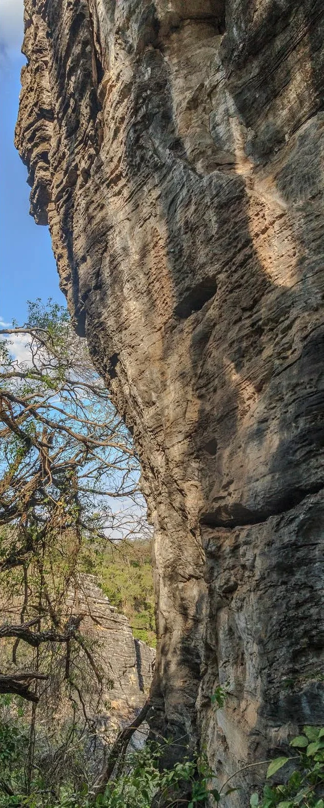 |
    | :--: |
    | *Setor Sentinela* |
    
    |  |
    | :--: |
    | *Foto 2* |
    
    | 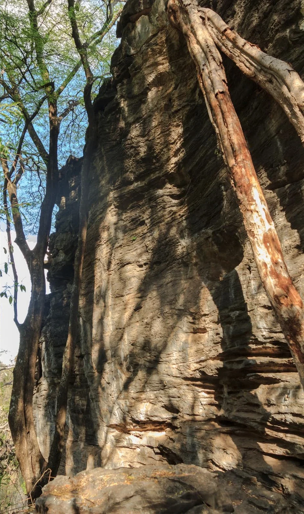 |
    | :--: |
    | *Foto 3* |
    
    | 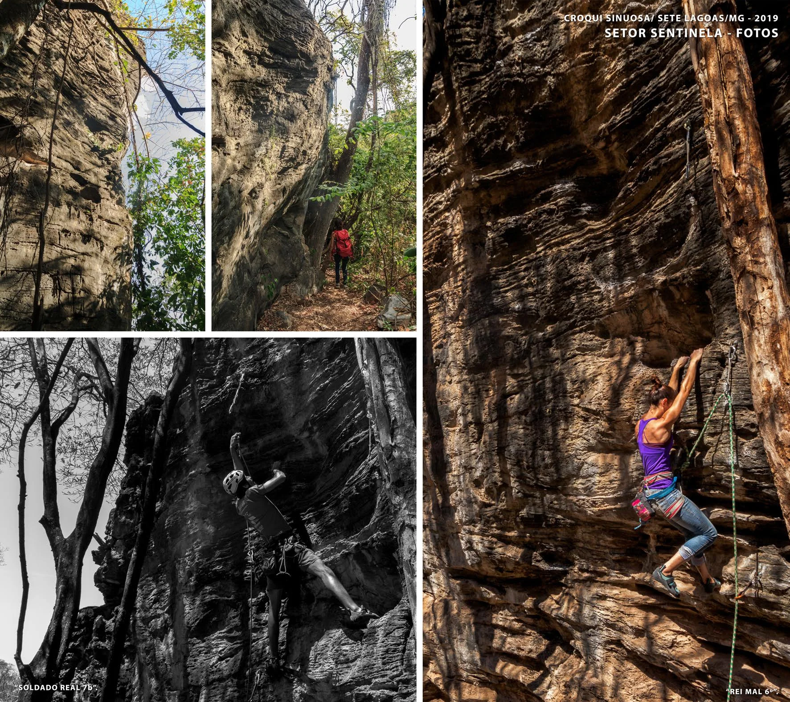 |
    | :--: |
    | *Mais fotos* |
- **nome**: Setor Sentinela
- **mapas**:
  - **[0]**:
    - **caminho_imagem_mapa**: 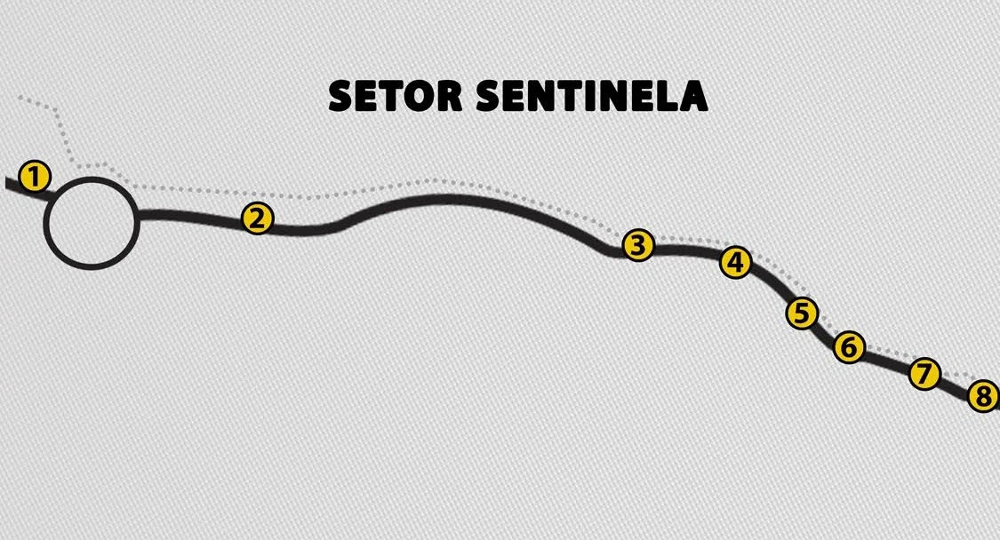
    - **largura_mapa**: 1125
    - **altura_mapa**: 608
    - **pontos_de_interesse**:
      - **[0]**:
        - **id**: 1
        - **label**: 1
        - **circulo**:
          - **x**: 39
          - **y**: 198
          - **raio**: 18
      - **[1]**:
        - **id**: 2
        - **label**: 2
        - **circulo**:
          - **x**: 290
          - **y**: 246
          - **raio**: 18
      - **[2]**:
        - **id**: 3
        - **label**: 3
        - **circulo**:
          - **x**: 718
          - **y**: 276
          - **raio**: 18
      - **[3]**:
        - **id**: 4
        - **label**: 4
        - **circulo**:
          - **x**: 828
          - **y**: 295
          - **raio**: 18
      - **[4]**:
        - **id**: 5
        - **label**: 5
        - **circulo**:
          - **x**: 903
          - **y**: 352
          - **raio**: 18
      - **[5]**:
        - **id**: 6
        - **label**: 6
        - **circulo**:
          - **x**: 955
          - **y**: 391
          - **raio**: 18
      - **[6]**:
        - **id**: 7
        - **label**: 7
        - **circulo**:
          - **x**: 1040
          - **y**: 421
          - **raio**: 18
      - **[7]**:
        - **id**: 8
        - **label**: 8
        - **circulo**:
          - **x**: 1107
          - **y**: 446
          - **raio**: 18
    - **referencias**:
      - **[0]**:
        - **escalada**: Brenfoterapia
        - **ids**:
          - 1
      - **[1]**:
        - **escalada**: Na Hora Certa
        - **ids**:
          - 2
      - **[2]**:
        - **escalada**: Nós Contra o Resto
        - **ids**:
          - 3
      - **[3]**:
        - **escalada**: Divisa dos Reinos
        - **ids**:
          - 4
      - **[4]**:
        - **escalada**: Rei Mal
        - **ids**:
          - 5
      - **[5]**:
        - **escalada**: Soldado Real
        - **ids**:
          - 6
      - **[6]**:
        - **escalada**: Nosso Rei
        - **ids**:
          - 7
      - **[7]**:
        - **escalada**: Vitamina M
        - **ids**:
          - 8
- **escaladas**:
  - **[0]**:
    - **via_movel**:
      - **nome**: Brenfoterapia
      - **dificuldade**: BR_5SUP
      - **protecoes_moveis**: Móvel. Rapel da chapa com cordelete.
  - **[1]**:
    - **via_esportiva**:
      - **nome**: Na Hora Certa
      - **dificuldade**: BR_4
      - **quantidade_protecoes_intermediarias**: 4
  - **[2]**:
    - **via_esportiva**:
      - **nome**: Nós Contra o Resto
      - **dificuldade**: BR_6SUP
      - **quantidade_protecoes_intermediarias**: 4
  - **[3]**:
    - **via_esportiva**:
      - **nome**: Divisa dos Reinos
      - **dificuldade**: BR_6
      - **quantidade_protecoes_intermediarias**: 6
  - **[4]**:
    - **via_esportiva**:
      - **nome**: Rei Mal
      - **dificuldade**: BR_6
      - **quantidade_protecoes_intermediarias**: 5
  - **[5]**:
    - **via_esportiva**:
      - **nome**: Soldado Real
      - **dificuldade**: BR_7B
      - **quantidade_protecoes_intermediarias**: 6
  - **[6]**:
    - **via_esportiva**:
      - **nome**: Nosso Rei
      - **dificuldade**: BR_7A
      - **quantidade_protecoes_intermediarias**: 6
  - **[7]**:
    - **via_movel**:
      - **nome**: Vitamina M
      - **dificuldade**: BR_5
      - **protecoes_moveis**: Móvel. Rapel da chapa com cordelete.
- **precomputados**:
  - **total_escaladas**: 8
  - **total_esportivas**: 6
  - **total_moveis**: 0
  - **total_boulders**: 0
  - **total_multiplas_enfiadas**: 0
  - **total_highlines**: 0

## Parte: setor_death_horse

### Setor (Pico: Sinuosa)

- **descricao**:
    # Setor Death Horse
    
    Setor que fica logo na entrada. Parede extensa, alta e com trechos muito
    negativos. A beleza da formação da parede impressiona pelas cores, formas curiosas
    e pela magnitude do teto. A base do setor é limpa, ampla e comporta grupos maiores,
    também é ótimo para colocação de redes por estar na sombra durante o dia inteiro,
    local bem arejado.
    
    Na chuva é possível escalar algumas vias. Setor ainda pouco explorado,
    apesar do enorme potencial para vias de alta graduação.
    
    | 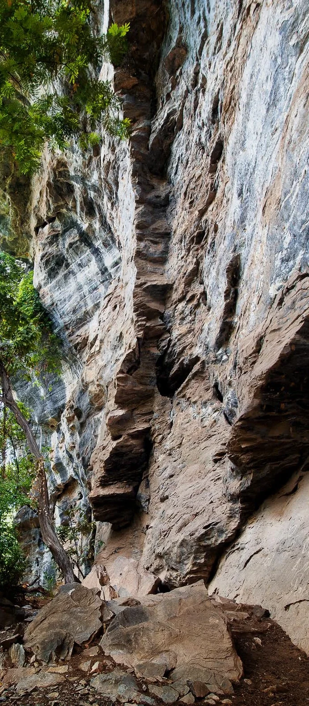 |
    | :--: |
    | *Setor Death Horse* |
    
    |  |
    | :--: |
    | *Sabbath Blood Sabbath 9a* |
    
    | 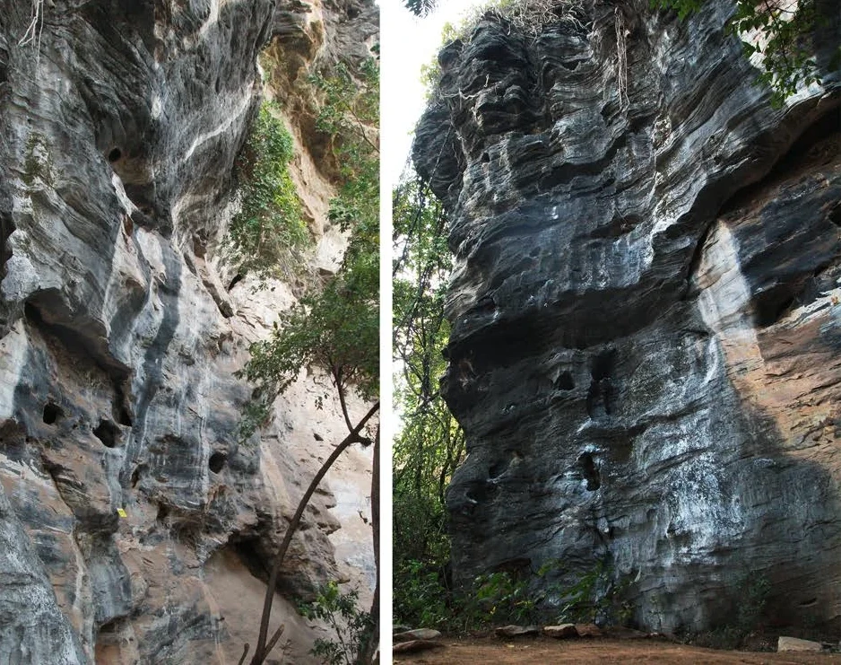 |
    | :--: |
    | *Mais fotos* |
- **nome**: Setor Death Horse
- **mapas**:
  - **[0]**:
    - **caminho_imagem_mapa**: 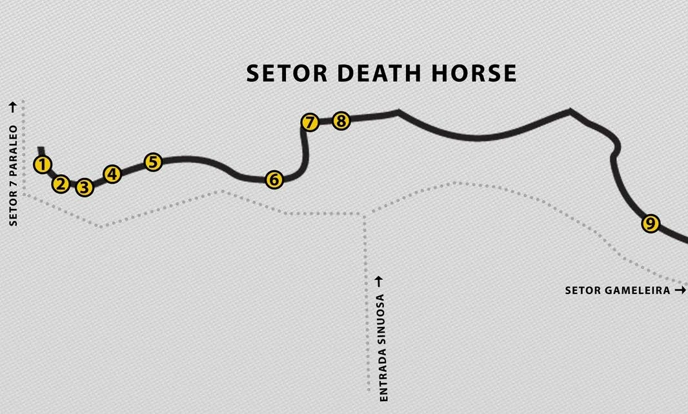
    - **largura_mapa**: 1066
    - **altura_mapa**: 642
    - **pontos_de_interesse**:
      - **[0]**:
        - **id**: 1
        - **label**: 1
        - **circulo**:
          - **x**: 66
          - **y**: 255
          - **raio**: 13
      - **[1]**:
        - **id**: 2
        - **label**: 2
        - **circulo**:
          - **x**: 94
          - **y**: 286
          - **raio**: 13
      - **[2]**:
        - **id**: 3
        - **label**: 3
        - **circulo**:
          - **x**: 131
          - **y**: 291
          - **raio**: 14
      - **[3]**:
        - **id**: 4
        - **label**: 4
        - **circulo**:
          - **x**: 174
          - **y**: 270
          - **raio**: 14
      - **[4]**:
        - **id**: 5
        - **label**: 5
        - **circulo**:
          - **x**: 238
          - **y**: 252
          - **raio**: 14
      - **[5]**:
        - **id**: 6
        - **label**: 6
        - **circulo**:
          - **x**: 425
          - **y**: 279
          - **raio**: 14
      - **[6]**:
        - **id**: 7
        - **label**: 7
        - **circulo**:
          - **x**: 480
          - **y**: 189
          - **raio**: 14
      - **[7]**:
        - **id**: 8
        - **label**: 8
        - **circulo**:
          - **x**: 529
          - **y**: 187
          - **raio**: 14
      - **[8]**:
        - **id**: 9
        - **label**: 9
        - **circulo**:
          - **x**: 1008
          - **y**: 347
          - **raio**: 14
      - **[9]**:
        - **id**: Setor_7_Paralelo
        - **label**: ↑ SETOR 7 PARALELO
        - **retangulo**:
          - **x**: 20
          - **y**: 254
          - **comprimento**: 26
          - **largura**: 211
      - **[10]**:
        - **id**: Entrada_Sinuosa
        - **label**: ENTRADA SINUOSA ↑
        - **retangulo**:
          - **x**: 592
          - **y**: 526
          - **comprimento**: 30
          - **largura**: 207
          - **angulo_graus_x100**: -215
      - **[11]**:
        - **id**: Setor_Gameleira
        - **label**: SETOR GAMELEIRA →
        - **retangulo**:
          - **x**: 968
          - **y**: 450
          - **comprimento**: 193
          - **largura**: 28
    - **referencias**:
      - **[0]**:
        - **escalada**: Mary Jane
        - **ids**:
          - 1
      - **[1]**:
        - **escalada**: Nhen-hen-hen
        - **ids**:
          - 2
      - **[2]**:
        - **escalada**: Oleoduto
        - **ids**:
          - 3
      - **[3]**:
        - **escalada**: Território Demarcado
        - **ids**:
          - 4
      - **[4]**:
        - **escalada**: Abaeta
        - **ids**:
          - 5
      - **[5]**:
        - **escalada**: Sinuosa
        - **ids**:
          - 6
      - **[6]**:
        - **escalada**: Sabbath Blood Sabbath/Carrapatos
        - **ids**:
          - 7
      - **[7]**:
        - **escalada**: Secos e Molhados
        - **ids**:
          - 8
      - **[8]**:
        - **escalada**: Araticum
        - **ids**:
          - 9
      - **[9]**:
        - **ids**:
          - Setor_7_Paralelo
        - **setor**: Setor 7 Paralelo
      - **[10]**:
        - **ids**:
          - Setor_Gameleira
        - **setor**: Setor Gameleira
- **escaladas**:
  - **[0]**:
    - **via_esportiva**:
      - **nome**: Mary Jane
      - **dificuldade**: BR_7A
      - **quantidade_protecoes_intermediarias**: 7
  - **[1]**:
    - **via_esportiva**:
      - **nome**: Nhen-hen-hen
      - **dificuldade**: BR_6SUP
      - **quantidade_protecoes_intermediarias**: 6
  - **[2]**:
    - **via_esportiva**:
      - **nome**: Oleoduto
      - **dificuldade**: BR_6SUP
      - **quantidade_protecoes_intermediarias**: 5
  - **[3]**:
    - **via_esportiva**:
      - **nome**: Território Demarcado
      - **dificuldade**: BR_7B
      - **quantidade_protecoes_intermediarias**: 7
  - **[4]**:
    - **via_esportiva**:
      - **descricao**: Projeto.
      - **nome**: Abaeta
  - **[5]**:
    - **via_esportiva**:
      - **descricao**: Projeto (Sem F/A).
      - **nome**: Sinuosa
      - **quantidade_protecoes_intermediarias**: 20
  - **[6]**:
    - **via_esportiva**:
      - **nome**: Sabbath Blood Sabbath/Carrapatos
      - **dificuldade**: BR_9A
      - **quantidade_protecoes_intermediarias**: 16
  - **[7]**:
    - **via_esportiva**:
      - **nome**: Secos e Molhados
      - **dificuldade**: BR_7B
      - **quantidade_protecoes_intermediarias**: 6
  - **[8]**:
    - **via_esportiva**:
      - **descricao**: Projeto (Sem F/A).
      - **nome**: Araticum
      - **quantidade_protecoes_intermediarias**: 14
- **precomputados**:
  - **total_escaladas**: 9
  - **total_esportivas**: 9
  - **total_moveis**: 0
  - **total_boulders**: 0
  - **total_multiplas_enfiadas**: 0
  - **total_highlines**: 0

## Parte: setor_gameleira

### Setor (Pico: Sinuosa)

- **descricao**:
    # Setor Gameleira
    
    Conta com poucas vias e mesmo assim abriga um dos maiores desafios do pico
    até o momento, a "Sou Fria 9a". Via em uma aresta muito negativa, de encaixe e técnica.
    Impressiona pela beleza da linha e pelo crux que é uma problema de boulder especulado
    em V4/5.
    
    A via "Mordida de Égua 5º" é muito repetida por iniciantes e faz parte
    das vias mais elogiadas da Sinuosa.
    
    |  |
    | :--: |
    | *Setor Gameleira* |
    
    | 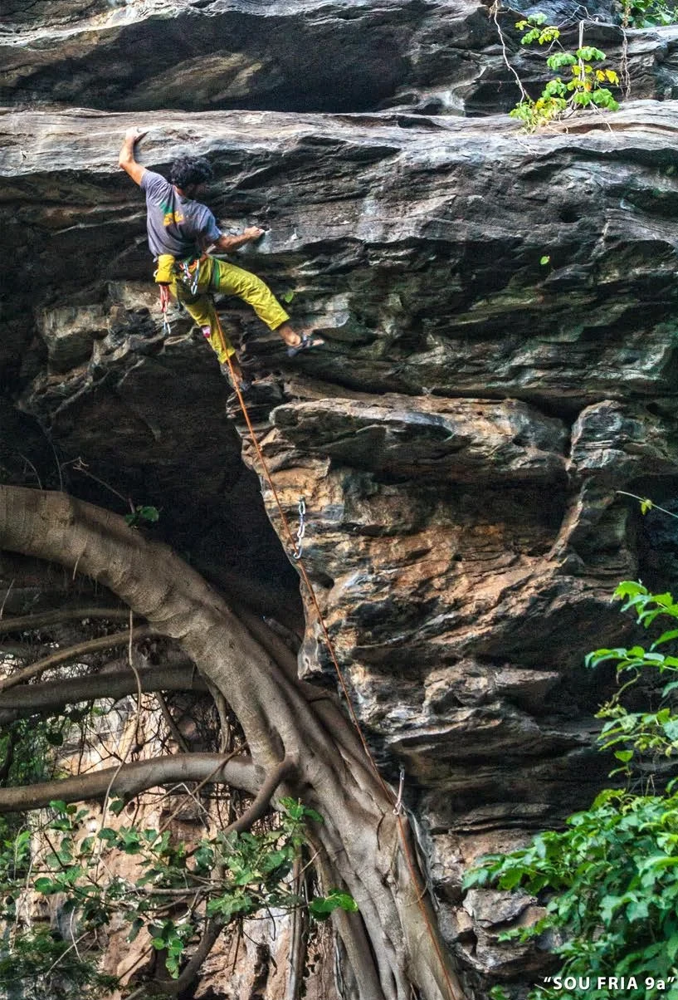 |
    | :--: |
    | *Sou Fria 9a* |
    
    | 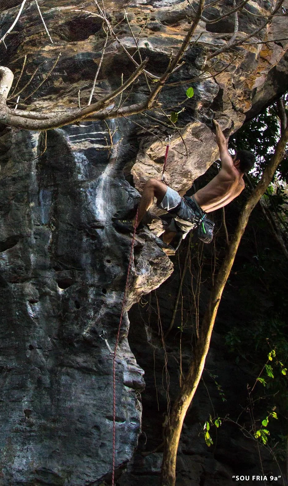 |
    | :--: |
    | *Sou Fria 9a Foto 2* |
- **nome**: Setor Gameleira
- **mapas**:
  - **[0]**:
    - **caminho_imagem_mapa**: 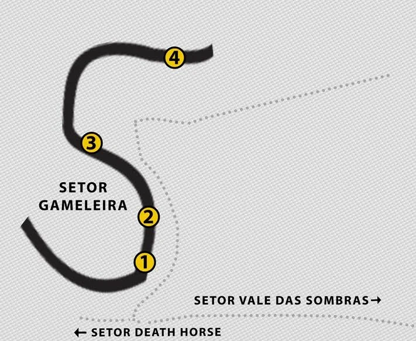
    - **largura_mapa**: 711
    - **altura_mapa**: 582
    - **pontos_de_interesse**:
      - **[0]**:
        - **id**: 1
        - **label**: 1
        - **circulo**:
          - **x**: 248
          - **y**: 447
          - **raio**: 17
      - **[1]**:
        - **id**: 2
        - **label**: 2
        - **circulo**:
          - **x**: 254
          - **y**: 370
          - **raio**: 17
      - **[2]**:
        - **id**: 3
        - **label**: 3
        - **circulo**:
          - **x**: 157
          - **y**: 244
          - **raio**: 17
      - **[3]**:
        - **id**: 4
        - **label**: 4
        - **circulo**:
          - **x**: 299
          - **y**: 99
          - **raio**: 17
      - **[4]**:
        - **id**: Setor_Vale_das_Sombras
        - **label**: SETOR VALE DAS SOMBRAS →
        - **retangulo**:
          - **x**: 492
          - **y**: 512
          - **comprimento**: 325
          - **largura**: 25
      - **[5]**:
        - **id**: Setor_Death_Horse
        - **label**: ← SETOR DEATH HORSE
        - **retangulo**:
          - **x**: 252
          - **y**: 566
          - **comprimento**: 265
          - **largura**: 24
    - **referencias**:
      - **[0]**:
        - **escalada**: Sou Fria
        - **ids**:
          - 1
      - **[1]**:
        - **escalada**: Revivência
        - **ids**:
          - 2
      - **[2]**:
        - **escalada**: Mordida de Égua
        - **ids**:
          - 3
      - **[3]**:
        - **escalada**: Girassol
        - **ids**:
          - 4
      - **[4]**:
        - **ids**:
          - Setor_Death_Horse
        - **setor**: Setor Death Horse
      - **[5]**:
        - **ids**:
          - Setor_Vale_das_Sombras
        - **setor**: Setor Vale das Sombras
- **escaladas**:
  - **[0]**:
    - **via_esportiva**:
      - **nome**: Sou Fria
      - **dificuldade**: BR_9A
      - **quantidade_protecoes_intermediarias**: 7
  - **[1]**:
    - **via_esportiva**:
      - **nome**: Revivência
      - **dificuldade**: BR_7A
      - **quantidade_protecoes_intermediarias**: 6
  - **[2]**:
    - **via_esportiva**:
      - **nome**: Mordida de Égua
      - **dificuldade**: BR_5
      - **quantidade_protecoes_intermediarias**: 7
  - **[3]**:
    - **via_esportiva**:
      - **nome**: Girassol
      - **dificuldade**: BR_6SUP
      - **quantidade_protecoes_intermediarias**: 6
- **precomputados**:
  - **total_escaladas**: 4
  - **total_esportivas**: 4
  - **total_moveis**: 0
  - **total_boulders**: 0
  - **total_multiplas_enfiadas**: 0
  - **total_highlines**: 0

## Parte: setor_vale_das_sombras

### Setor (Pico: Sinuosa)

- **descricao**:
    # Setor Vale das Sombras
    
    Setor com maior concentração de vias, predominância de vias mais altas e verticais
    com saídas ou lances curtos em negativo, algumas vias de resistência e outras de
    crux, ou seja, garantia de escalada diferenciada o dia todo.
    
    O vale é o setor com
    maior espaço para vários grupos, bom para armar redes e dar aquela pausa no climb.
    
    Pela manhã é bom para escalar até as 10h e após as 15h o sol é mais brando na parte
    mais alta das vias.
    
    O setor é o segundo a ser aberto pelos precursores da Sinuosa
    na década de 90.
    
    | 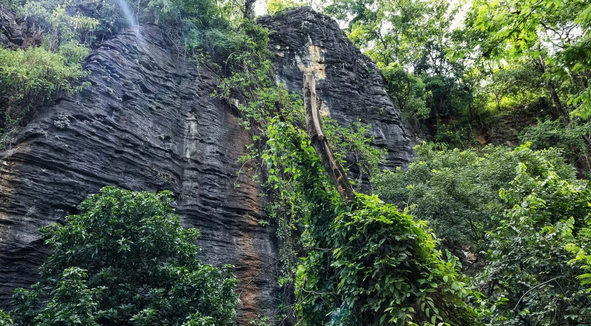 |
    | :--: |
    | *Vale das Sombras* |
    
    | 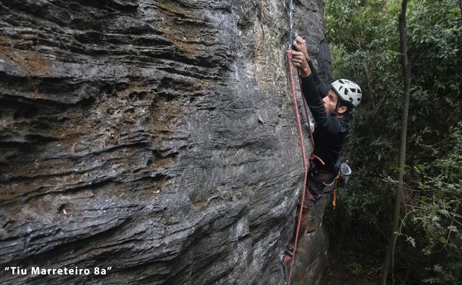 |
    | :--: |
    | *Tiu Marreteiro 8a* |
    
    |  |
    | :--: |
    | *Fotos* |
- **nome**: Setor Vale das Sombras
- **mapas**:
  - **[0]**:
    - **caminho_imagem_mapa**: 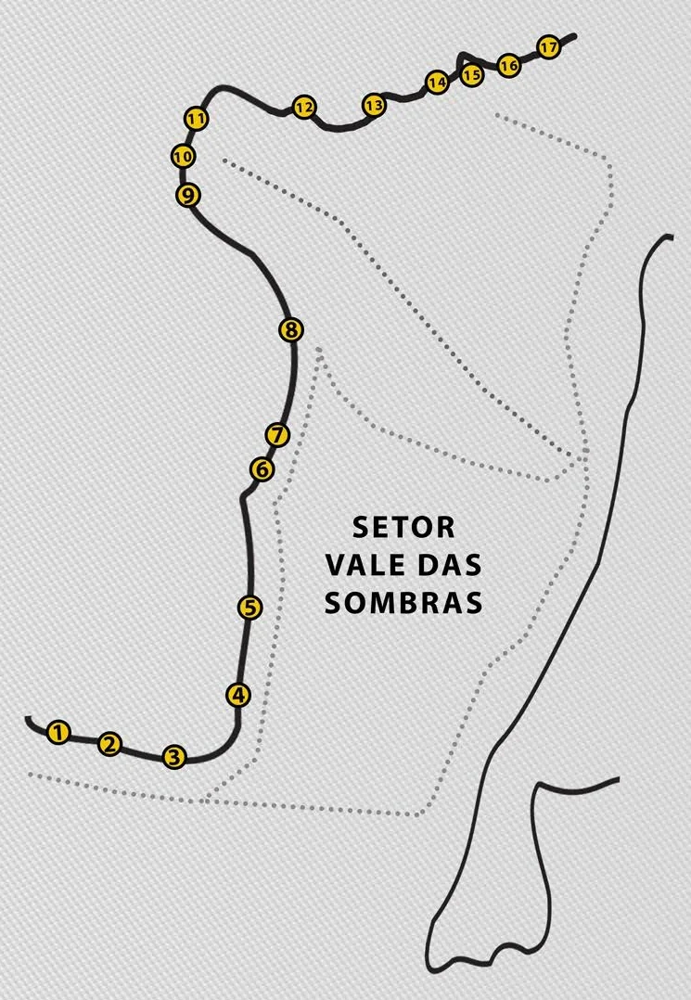
    - **largura_mapa**: 745
    - **altura_mapa**: 1078
    - **pontos_de_interesse**:
      - **[0]**:
        - **id**: 1
        - **label**: 1
        - **circulo**:
          - **x**: 63
          - **y**: 790
          - **raio**: 12
      - **[1]**:
        - **id**: 2
        - **label**: 2
        - **circulo**:
          - **x**: 118
          - **y**: 802
          - **raio**: 12
      - **[2]**:
        - **id**: 3
        - **label**: 3
        - **circulo**:
          - **x**: 188
          - **y**: 816
          - **raio**: 12
      - **[3]**:
        - **id**: 4
        - **label**: 4
        - **circulo**:
          - **x**: 257
          - **y**: 749
          - **raio**: 12
      - **[4]**:
        - **id**: 5
        - **label**: 5
        - **circulo**:
          - **x**: 270
          - **y**: 655
          - **raio**: 13
      - **[5]**:
        - **id**: 6
        - **label**: 6
        - **circulo**:
          - **x**: 283
          - **y**: 506
          - **raio**: 12
      - **[6]**:
        - **id**: 7
        - **label**: 7
        - **circulo**:
          - **x**: 299
          - **y**: 469
          - **raio**: 12
      - **[7]**:
        - **id**: 8
        - **label**: 8
        - **circulo**:
          - **x**: 314
          - **y**: 356
          - **raio**: 12
      - **[8]**:
        - **id**: 9
        - **label**: 9
        - **circulo**:
          - **x**: 203
          - **y**: 210
          - **raio**: 12
      - **[9]**:
        - **id**: 10
        - **label**: 10
        - **circulo**:
          - **x**: 198
          - **y**: 168
          - **raio**: 12
      - **[10]**:
        - **id**: 11
        - **label**: 11
        - **circulo**:
          - **x**: 212
          - **y**: 128
          - **raio**: 12
      - **[11]**:
        - **id**: 12
        - **label**: 12
        - **circulo**:
          - **x**: 328
          - **y**: 115
          - **raio**: 12
      - **[12]**:
        - **id**: 13
        - **label**: 13
        - **circulo**:
          - **x**: 404
          - **y**: 113
          - **raio**: 12
      - **[13]**:
        - **id**: 14
        - **label**: 14
        - **circulo**:
          - **x**: 472
          - **y**: 89
          - **raio**: 12
      - **[14]**:
        - **id**: 15
        - **label**: 15
        - **circulo**:
          - **x**: 509
          - **y**: 81
          - **raio**: 12
      - **[15]**:
        - **id**: 16
        - **label**: 16
        - **circulo**:
          - **x**: 549
          - **y**: 71
          - **raio**: 12
      - **[16]**:
        - **id**: 17
        - **label**: 17
        - **circulo**:
          - **x**: 592
          - **y**: 51
          - **raio**: 12
    - **referencias**:
      - **[0]**:
        - **escalada**: Curta e Grossa
        - **ids**:
          - 1
      - **[1]**:
        - **escalada**: Trabalhosa
        - **ids**:
          - 2
      - **[2]**:
        - **escalada**: Revolução dos Insetos
        - **ids**:
          - 3
      - **[3]**:
        - **escalada**: Frango com Quiabo
        - **ids**:
          - 4
      - **[4]**:
        - **escalada**: É Proibido Furar
        - **ids**:
          - 5
      - **[5]**:
        - **escalada**: Bafin de Leite
        - **ids**:
          - 6
      - **[6]**:
        - **escalada**: ?
        - **ids**:
          - 7
      - **[7]**:
        - **escalada**: Sujismunda
        - **ids**:
          - 8
      - **[8]**:
        - **escalada**: Samurai
        - **ids**:
          - 9
      - **[9]**:
        - **escalada**: Ninja
        - **ids**:
          - 10
      - **[10]**:
        - **escalada**: Fly Monkeys
        - **ids**:
          - 11
      - **[11]**:
        - **escalada**: Lado A Lado B
        - **ids**:
          - 12
      - **[12]**:
        - **escalada**: Meu Nome Não é Lero
        - **ids**:
          - 13
      - **[13]**:
        - **escalada**: Nosso Mestre
        - **ids**:
          - 14
      - **[14]**:
        - **escalada**: Segunda Já Tá í
        - **ids**:
          - 15
      - **[15]**:
        - **escalada**: Brincadeira de Criança
        - **ids**:
          - 16
      - **[16]**:
        - **escalada**: Peripécias do Climb
        - **ids**:
          - 17
      - **[17]**:
        - **escalada**: Lelê Café
        - **ids**:
          - 17
  - **[1]**:
    - **caminho_imagem_mapa**: 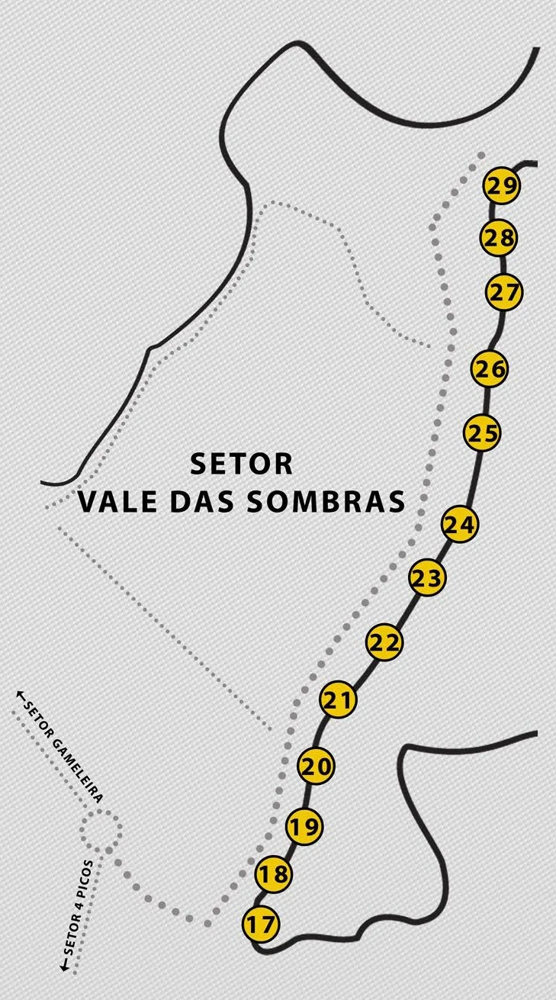
    - **largura_mapa**: 729
    - **altura_mapa**: 1311
    - **pontos_de_interesse**:
      - **[0]**:
        - **id**: 17
        - **label**: 17
        - **circulo**:
          - **x**: 342
          - **y**: 1211
          - **raio**: 23
      - **[1]**:
        - **id**: 18
        - **label**: 18
        - **circulo**:
          - **x**: 359
          - **y**: 1146
          - **raio**: 23
      - **[2]**:
        - **id**: 19
        - **label**: 19
        - **circulo**:
          - **x**: 399
          - **y**: 1084
          - **raio**: 23
      - **[3]**:
        - **id**: 20
        - **label**: 20
        - **circulo**:
          - **x**: 414
          - **y**: 1004
          - **raio**: 24
      - **[4]**:
        - **id**: 21
        - **label**: 21
        - **circulo**:
          - **x**: 443
          - **y**: 917
          - **raio**: 24
      - **[5]**:
        - **id**: 22
        - **label**: 22
        - **circulo**:
          - **x**: 504
          - **y**: 842
          - **raio**: 23
      - **[6]**:
        - **id**: 23
        - **label**: 23
        - **circulo**:
          - **x**: 560
          - **y**: 757
          - **raio**: 24
      - **[7]**:
        - **id**: 24
        - **label**: 24
        - **circulo**:
          - **x**: 603
          - **y**: 687
          - **raio**: 24
      - **[8]**:
        - **id**: 25
        - **label**: 25
        - **circulo**:
          - **x**: 632
          - **y**: 567
          - **raio**: 24
      - **[9]**:
        - **id**: 26
        - **label**: 26
        - **circulo**:
          - **x**: 642
          - **y**: 483
          - **raio**: 24
      - **[10]**:
        - **id**: 27
        - **label**: 27
        - **circulo**:
          - **x**: 661
          - **y**: 383
          - **raio**: 24
      - **[11]**:
        - **id**: 28
        - **label**: 28
        - **circulo**:
          - **x**: 654
          - **y**: 312
          - **raio**: 24
      - **[12]**:
        - **id**: 29
        - **label**: 29
        - **circulo**:
          - **x**: 658
          - **y**: 243
          - **raio**: 23
      - **[13]**:
        - **id**: Setor_Gameleira
        - **label**: ← SETOR GAMELEIRA
        - **retangulo**:
          - **x**: 76
          - **y**: 976
          - **comprimento**: 31
          - **largura**: 201
          - **angulo_graus_x100**: -3782
      - **[14]**:
        - **id**: Setor_4_Picos
        - **label**: ← SETOR 4 PICOS
        - **retangulo**:
          - **x**: 100
          - **y**: 1200
          - **comprimento**: 31
          - **largura**: 165
          - **angulo_graus_x100**: 1162
    - **referencias**:
      - **[0]**:
        - **escalada**: Peripécias do Climb
        - **ids**:
          - 17
      - **[1]**:
        - **escalada**: Lelê Café
        - **ids**:
          - 17
      - **[2]**:
        - **escalada**: Tiu Marreteiro
        - **ids**:
          - 18
      - **[3]**:
        - **escalada**: Animáquina
        - **ids**:
          - 19
      - **[4]**:
        - **escalada**: Moça do Sapo
        - **ids**:
          - 20
      - **[5]**:
        - **escalada**: Over Tênis
        - **ids**:
          - 21
      - **[6]**:
        - **escalada**: Fita No Calcário
        - **ids**:
          - 22
      - **[7]**:
        - **escalada**: Só de 70
        - **ids**:
          - 23
      - **[8]**:
        - **escalada**: Black Dog
        - **ids**:
          - 24
      - **[9]**:
        - **escalada**: Variante Mum-hhazinha
        - **ids**:
          - 25
      - **[10]**:
        - **escalada**: Pedras e Espinhos
        - **ids**:
          - 26
      - **[11]**:
        - **escalada**: Pé de Oreia
        - **ids**:
          - 27
      - **[12]**:
        - **escalada**: Perdidos
        - **ids**:
          - 28
      - **[13]**:
        - **escalada**: Velhos Novatos
        - **ids**:
          - 29
      - **[14]**:
        - **ids**:
          - Setor_4_Picos
        - **setor**: Setor 4 Picos
      - **[15]**:
        - **ids**:
          - Setor_Gameleira
        - **setor**: Setor Gameleira
- **escaladas**:
  - **[0]**:
    - **via_esportiva**:
      - **nome**: Curta e Grossa
      - **dificuldade**: BR_7A
      - **quantidade_protecoes_intermediarias**: 6
  - **[1]**:
    - **via_esportiva**:
      - **nome**: Trabalhosa
      - **dificuldade**: BR_6SUP
      - **quantidade_protecoes_intermediarias**: 7
  - **[2]**:
    - **via_esportiva**:
      - **nome**: Revolução dos Insetos
      - **dificuldade**: BR_7A
      - **quantidade_protecoes_intermediarias**: 5
  - **[3]**:
    - **via_esportiva**:
      - **nome**: Frango com Quiabo
      - **dificuldade**: BR_7A
      - **quantidade_protecoes_intermediarias**: 6
  - **[4]**:
    - **via_esportiva**:
      - **nome**: É Proibido Furar
      - **dificuldade**: BR_7C
      - **quantidade_protecoes_intermediarias**: 7
  - **[5]**:
    - **via_esportiva**:
      - **descricao**: Inacabada.
      - **nome**: Bafin de Leite
  - **[6]**:
    - **via_esportiva**:
      - **descricao**: Inacabada.
      - **nome**: ?
  - **[7]**:
    - **via_esportiva**:
      - **descricao**: Inacabada.
      - **nome**: Sujismunda
  - **[8]**:
    - **via_esportiva**:
      - **nome**: Samurai
      - **dificuldade**: BR_6SUP
      - **quantidade_protecoes_intermediarias**: 13
  - **[9]**:
    - **via_esportiva**:
      - **nome**: Ninja
      - **dificuldade**: BR_7A
      - **quantidade_protecoes_intermediarias**: 16
  - **[10]**:
    - **via_esportiva**:
      - **nome**: Fly Monkeys
      - **dificuldade**: BR_6SUP
      - **quantidade_protecoes_intermediarias**: 10
  - **[11]**:
    - **via_esportiva**:
      - **nome**: Lado A Lado B
      - **dificuldade**: BR_7A_BARRA_7B
      - **quantidade_protecoes_intermediarias**: 7
  - **[12]**:
    - **via_esportiva**:
      - **nome**: Meu Nome Não é Lero
      - **dificuldade**: BR_7B
      - **quantidade_protecoes_intermediarias**: 8
  - **[13]**:
    - **via_esportiva**:
      - **nome**: Nosso Mestre
      - **dificuldade**: BR_5
      - **quantidade_protecoes_intermediarias**: 6
  - **[14]**:
    - **via_esportiva**:
      - **nome**: Segunda Já Tá í
      - **dificuldade**: BR_7A
      - **quantidade_protecoes_intermediarias**: 6
  - **[15]**:
    - **via_esportiva**:
      - **nome**: Brincadeira de Criança
      - **dificuldade**: BR_6SUP
      - **quantidade_protecoes_intermediarias**: 6
  - **[16]**:
    - **via_esportiva**:
      - **nome**: Peripécias do Climb
      - **dificuldade**: BR_6
      - **quantidade_protecoes_intermediarias**: 4
  - **[17]**:
    - **via_esportiva**:
      - **descricao**: Número 17 no segundo mapa do setor.
      - **nome**: Lelê Café
      - **dificuldade**: BR_7A
      - **quantidade_protecoes_intermediarias**: 10
  - **[18]**:
    - **via_esportiva**:
      - **nome**: Tiu Marreteiro
      - **dificuldade**: BR_8A
      - **quantidade_protecoes_intermediarias**: 9
  - **[19]**:
    - **via_esportiva**:
      - **nome**: Animáquina
      - **dificuldade**: BR_6SUP
      - **quantidade_protecoes_intermediarias**: 10
  - **[20]**:
    - **via_esportiva**:
      - **nome**: Moça do Sapo
      - **dificuldade**: BR_6
      - **quantidade_protecoes_intermediarias**: 10
  - **[21]**:
    - **via_movel**:
      - **nome**: Over Tênis
      - **dificuldade**: BR_6
      - **protecoes_moveis**: Móvel / Top Duplo.
  - **[22]**:
    - **via_movel**:
      - **nome**: Fita No Calcário
      - **dificuldade**: BR_6
      - **protecoes_moveis**: Móvel, Top da "Só de 70".
  - **[23]**:
    - **via_esportiva**:
      - **nome**: Só de 70
      - **dificuldade**: BR_6SUP
      - **quantidade_protecoes_intermediarias**: 13
  - **[24]**:
    - **via_esportiva**:
      - **descricao**: Mista / 4 Fixas + Top Duplo.
      - **nome**: Black Dog
      - **dificuldade**: BR_6SUP
  - **[25]**:
    - **via_esportiva**:
      - **nome**: Variante Mum-hhazinha
      - **dificuldade**: BR_6SUP
      - **quantidade_protecoes_intermediarias**: 10
  - **[26]**:
    - **via_esportiva**:
      - **nome**: Pedras e Espinhos
      - **dificuldade**: BR_7A
      - **quantidade_protecoes_intermediarias**: 10
  - **[27]**:
    - **via_esportiva**:
      - **nome**: Pé de Oreia
      - **dificuldade**: BR_6
      - **quantidade_protecoes_intermediarias**: 5
  - **[28]**:
    - **via_esportiva**:
      - **nome**: Perdidos
      - **dificuldade**: BR_6
      - **quantidade_protecoes_intermediarias**: 5
  - **[29]**:
    - **via_esportiva**:
      - **nome**: Velhos Novatos
      - **dificuldade**: BR_4
      - **quantidade_protecoes_intermediarias**: 5
- **precomputados**:
  - **total_escaladas**: 30
  - **total_esportivas**: 28
  - **total_moveis**: 0
  - **total_boulders**: 0
  - **total_multiplas_enfiadas**: 0
  - **total_highlines**: 0

## Parte: setor_imigrantes

### Setor (Pico: Sinuosa)

- **descricao**: # Setor Imigrantes
- **nome**: Setor Imigrantes
- **mapas**:
  - **[0]**:
    - **caminho_imagem_mapa**: 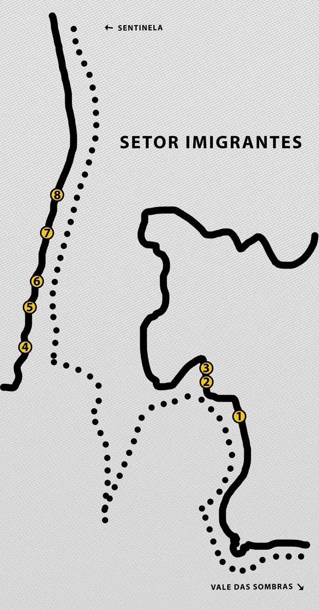
    - **largura_mapa**: 684
    - **altura_mapa**: 1306
    - **pontos_de_interesse**:
      - **[0]**:
        - **id**: 1
        - **label**: 1
        - **circulo**:
          - **x**: 513
          - **y**: 891
          - **raio**: 13
      - **[1]**:
        - **id**: 2
        - **label**: 2
        - **circulo**:
          - **x**: 443
          - **y**: 818
          - **raio**: 13
      - **[2]**:
        - **id**: 3
        - **label**: 3
        - **circulo**:
          - **x**: 443
          - **y**: 788
          - **raio**: 13
      - **[3]**:
        - **id**: 4
        - **label**: 4
        - **circulo**:
          - **x**: 54
          - **y**: 743
          - **raio**: 13
      - **[4]**:
        - **id**: 5
        - **label**: 5
        - **circulo**:
          - **x**: 64
          - **y**: 658
          - **raio**: 13
      - **[5]**:
        - **id**: 6
        - **label**: 6
        - **circulo**:
          - **x**: 79
          - **y**: 602
          - **raio**: 13
      - **[6]**:
        - **id**: 7
        - **label**: 7
        - **circulo**:
          - **x**: 101
          - **y**: 499
          - **raio**: 13
      - **[7]**:
        - **id**: 8
        - **label**: 8
        - **circulo**:
          - **x**: 123
          - **y**: 417
          - **raio**: 13
      - **[8]**:
        - **id**: Sentinela
        - **label**: ← SENTINELA
        - **retangulo**:
          - **x**: 288
          - **y**: 60
          - **comprimento**: 133
          - **largura**: 30
      - **[9]**:
        - **id**: Vale_das_Sombras
        - **label**: VALE DAS SOMBRAS ↘
        - **retangulo**:
          - **x**: 548
          - **y**: 1255
          - **comprimento**: 215
          - **largura**: 30
    - **referencias**:
      - **[0]**:
        - **escalada**: Ressucita Makita
        - **ids**:
          - 1
      - **[1]**:
        - **escalada**: Saporra
        - **ids**:
          - 2
      - **[2]**:
        - **escalada**: Tudo Pra Trás
        - **ids**:
          - 3
      - **[3]**:
        - **escalada**: Lamurias de Um Ex Casado
        - **ids**:
          - 4
      - **[4]**:
        - **escalada**: Nunca Se Engane
        - **ids**:
          - 5
      - **[5]**:
        - **escalada**: Chuva na Careca
        - **ids**:
          - 6
      - **[6]**:
        - **escalada**: Cuei Teimoso
        - **ids**:
          - 7
      - **[7]**:
        - **escalada**: Escalada Eclética
        - **ids**:
          - 8
      - **[8]**:
        - **ids**:
          - Sentinela
        - **setor**: Setor Sentinela
      - **[9]**:
        - **ids**:
          - Vale_das_Sombras
        - **setor**: Setor Vale das Sombras
- **escaladas**:
  - **[0]**:
    - **via_esportiva**:
      - **nome**: Ressucita Makita
      - **dificuldade**: BR_6SUP
      - **quantidade_protecoes_intermediarias**: 6
  - **[1]**:
    - **via_esportiva**:
      - **nome**: Saporra
      - **dificuldade**: BR_5SUP
      - **quantidade_protecoes_intermediarias**: 6
  - **[2]**:
    - **via_esportiva**:
      - **nome**: Tudo Pra Trás
      - **dificuldade**: BR_5
      - **quantidade_protecoes_intermediarias**: 5
  - **[3]**:
    - **via_esportiva**:
      - **nome**: Lamurias de Um Ex Casado
      - **dificuldade**: BR_6
      - **quantidade_protecoes_intermediarias**: 6
  - **[4]**:
    - **via_esportiva**:
      - **nome**: Nunca Se Engane
      - **dificuldade**: BR_6SUP
      - **quantidade_protecoes_intermediarias**: 6
  - **[5]**:
    - **via_esportiva**:
      - **nome**: Chuva na Careca
      - **dificuldade**: BR_7A
      - **quantidade_protecoes_intermediarias**: 7
  - **[6]**:
    - **via_esportiva**:
      - **nome**: Cuei Teimoso
      - **dificuldade**: BR_7B
      - **quantidade_protecoes_intermediarias**: 7
  - **[7]**:
    - **via_esportiva**:
      - **nome**: Escalada Eclética
      - **dificuldade**: BR_5SUP
      - **quantidade_protecoes_intermediarias**: 6
- **precomputados**:
  - **total_escaladas**: 8
  - **total_esportivas**: 8
  - **total_moveis**: 0
  - **total_boulders**: 0
  - **total_multiplas_enfiadas**: 0
  - **total_highlines**: 0

## Parte: setor_vale_zela

### Setor (Pico: Sinuosa)

- **descricao**:
    # Setor Vale Zela
    
    | 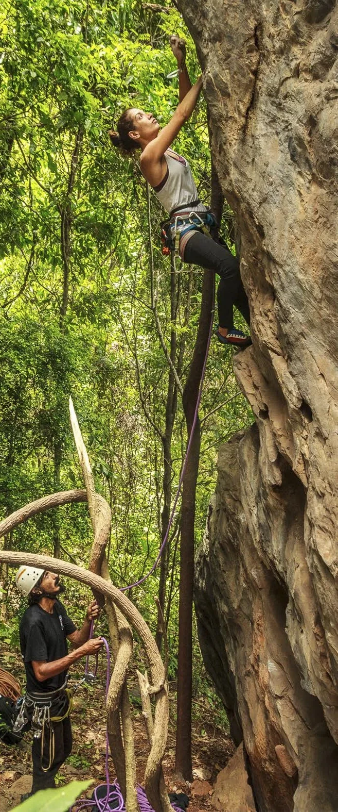 |
    | :--: |
    | *Vale Zela* |
- **nome**: Setor Vale Zela
- **mapas**:
  - **[0]**:
    - **caminho_imagem_mapa**: 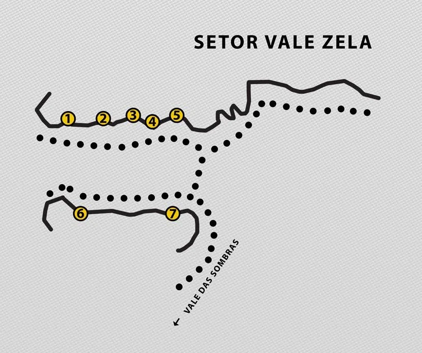
    - **largura_mapa**: 831
    - **altura_mapa**: 696
    - **pontos_de_interesse**:
      - **[0]**:
        - **id**: 1
        - **label**: 1
        - **circulo**:
          - **x**: 134
          - **y**: 234
          - **raio**: 13
      - **[1]**:
        - **id**: 2
        - **label**: 2
        - **circulo**:
          - **x**: 203
          - **y**: 234
          - **raio**: 13
      - **[2]**:
        - **id**: 3
        - **label**: 3
        - **circulo**:
          - **x**: 262
          - **y**: 227
          - **raio**: 13
      - **[3]**:
        - **id**: 4
        - **label**: 4
        - **circulo**:
          - **x**: 300
          - **y**: 240
          - **raio**: 13
      - **[4]**:
        - **id**: 5
        - **label**: 5
        - **circulo**:
          - **x**: 348
          - **y**: 227
          - **raio**: 13
      - **[5]**:
        - **id**: 6
        - **label**: 6
        - **circulo**:
          - **x**: 159
          - **y**: 421
          - **raio**: 13
      - **[6]**:
        - **id**: 7
        - **label**: 7
        - **circulo**:
          - **x**: 340
          - **y**: 421
          - **raio**: 13
      - **[7]**:
        - **id**: Vale_das_Sombras
        - **label**: ↙ VALE DAS SOMBRAS
        - **retangulo**:
          - **x**: 406
          - **y**: 559
          - **comprimento**: 33
          - **largura**: 218
          - **angulo_graus_x100**: 3372
    - **referencias**:
      - **[0]**:
        - **escalada**: Hugossauro
        - **ids**:
          - 1
      - **[1]**:
        - **escalada**: A Busca
        - **ids**:
          - 2
      - **[2]**:
        - **escalada**: Gancho na Orelha
        - **ids**:
          - 3
      - **[3]**:
        - **escalada**: Tios Metralha
        - **ids**:
          - 4
      - **[4]**:
        - **escalada**: Sociedade Alternativa
        - **ids**:
          - 5
      - **[5]**:
        - **escalada**: Travessia de Pedestre
        - **ids**:
          - 6
      - **[6]**:
        - **escalada**: De Menor
        - **ids**:
          - 7
      - **[7]**:
        - **ids**:
          - Vale_das_Sombras
        - **setor**: Setor Vale das Sombras
- **escaladas**:
  - **[0]**:
    - **via_esportiva**:
      - **nome**: Hugossauro
      - **dificuldade**: BR_5SUP
      - **quantidade_protecoes_intermediarias**: 6
  - **[1]**:
    - **via_esportiva**:
      - **nome**: A Busca
      - **dificuldade**: BR_7B
      - **quantidade_protecoes_intermediarias**: 6
  - **[2]**:
    - **via_esportiva**:
      - **nome**: Gancho na Orelha
      - **dificuldade**: BR_7A
      - **quantidade_protecoes_intermediarias**: 6
  - **[3]**:
    - **via_esportiva**:
      - **nome**: Tios Metralha
      - **dificuldade**: BR_6SUP
      - **quantidade_protecoes_intermediarias**: 6
  - **[4]**:
    - **via_esportiva**:
      - **nome**: Sociedade Alternativa
      - **dificuldade**: BR_7C
      - **quantidade_protecoes_intermediarias**: 5
  - **[5]**:
    - **via_esportiva**:
      - **nome**: Travessia de Pedestre
      - **dificuldade**: BR_5
      - **quantidade_protecoes_intermediarias**: 6
  - **[6]**:
    - **via_esportiva**:
      - **nome**: De Menor
      - **dificuldade**: BR_4
      - **quantidade_protecoes_intermediarias**: 4
- **precomputados**:
  - **total_escaladas**: 7
  - **total_esportivas**: 7
  - **total_moveis**: 0
  - **total_boulders**: 0
  - **total_multiplas_enfiadas**: 0
  - **total_highlines**: 0

## Parte: setor_macaubas

### Setor (Pico: Sinuosa)

- **descricao**:
    # Setor Macaúbas
    
    | 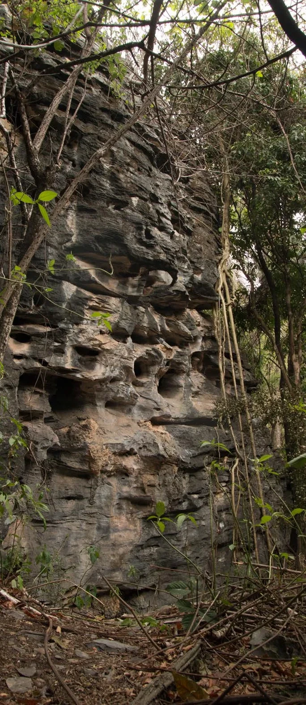 |
    | :--: |
    | *Setor Macaúbas* |
- **nome**: Setor Macaúbas
- **mapas**:
  - **[0]**:
    - **caminho_imagem_mapa**: 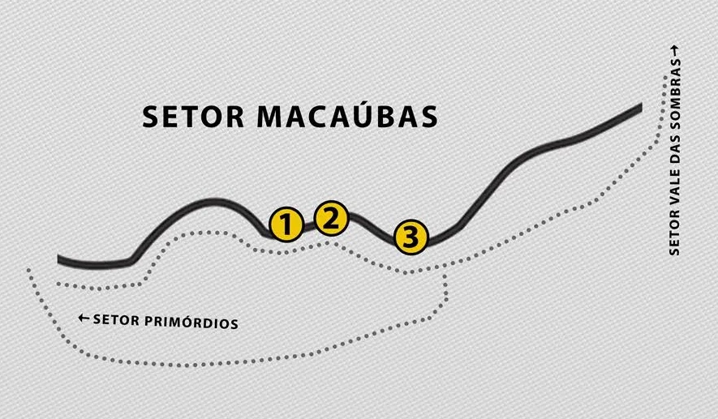
    - **largura_mapa**: 885
    - **altura_mapa**: 517
    - **pontos_de_interesse**:
      - **[0]**:
        - **id**: 1
        - **label**: 1
        - **circulo**:
          - **x**: 353
          - **y**: 277
          - **raio**: 20
      - **[1]**:
        - **id**: 2
        - **label**: 2
        - **circulo**:
          - **x**: 409
          - **y**: 269
          - **raio**: 20
      - **[2]**:
        - **id**: 3
        - **label**: 3
        - **circulo**:
          - **x**: 507
          - **y**: 293
          - **raio**: 20
      - **[3]**:
        - **id**: Setor_Primordios
        - **label**: ← SETOR PRIMÓRDIOS
        - **retangulo**:
          - **x**: 196
          - **y**: 394
          - **comprimento**: 212
          - **largura**: 35
          - **angulo_graus_x100**: 194
      - **[4]**:
        - **id**: Setor_Vale_das_Sombras
        - **label**: SETOR VALE DAS SOMBRAS →
        - **retangulo**:
          - **x**: 832
          - **y**: 184
          - **comprimento**: 33
          - **largura**: 266
    - **referencias**:
      - **[0]**:
        - **escalada**: Cobra Caoia
        - **ids**:
          - 1
      - **[1]**:
        - **escalada**: Lembranças de Mariazinha
        - **ids**:
          - 2
      - **[2]**:
        - **escalada**: Anfitriões do Dia
        - **ids**:
          - 3
      - **[3]**:
        - **ids**:
          - Setor_Primordios
        - **setor**: Setor Primórdios
      - **[4]**:
        - **ids**:
          - Setor_Vale_das_Sombras
        - **setor**: Setor Vale das Sombras
- **escaladas**:
  - **[0]**:
    - **via_esportiva**:
      - **nome**: Cobra Caoia
      - **dificuldade**: BR_5
      - **quantidade_protecoes_intermediarias**: 5
  - **[1]**:
    - **via_esportiva**:
      - **nome**: Lembranças de Mariazinha
      - **dificuldade**: BR_5
      - **quantidade_protecoes_intermediarias**: 5
  - **[2]**:
    - **via_esportiva**:
      - **nome**: Anfitriões do Dia
      - **dificuldade**: BR_5
      - **quantidade_protecoes_intermediarias**: 5
- **precomputados**:
  - **total_escaladas**: 3
  - **total_esportivas**: 3
  - **total_moveis**: 0
  - **total_boulders**: 0
  - **total_multiplas_enfiadas**: 0
  - **total_highlines**: 0

## Parte: setor_primordios

### Setor (Pico: Sinuosa)

- **descricao**:
    # Setor Primórdios
    
    Setor onde tudo começou na década de 90, parede com grande concentração
    de vias e de características bem diferentes. As vias possuem ótimas base e bastante
    espaço para grupos, bom para armar redes e descansar, pois o setor possui sombra
    o dia todo.
    
    | 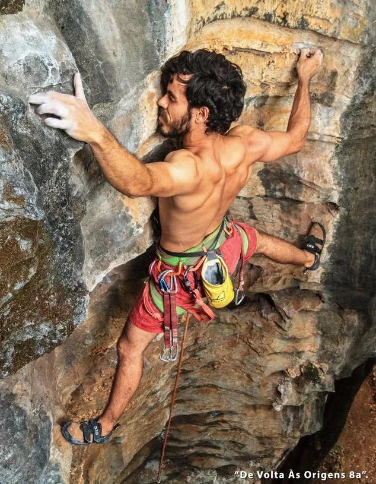 |
    | :--: |
    | *De volta às origens 8a* |
    
    |  |
    | :--: |
    | *De volta às origens 8a foto 2* |
    
    |  |
    | :--: |
    | *Chaminé Retinida 6º sup* |
    
    | 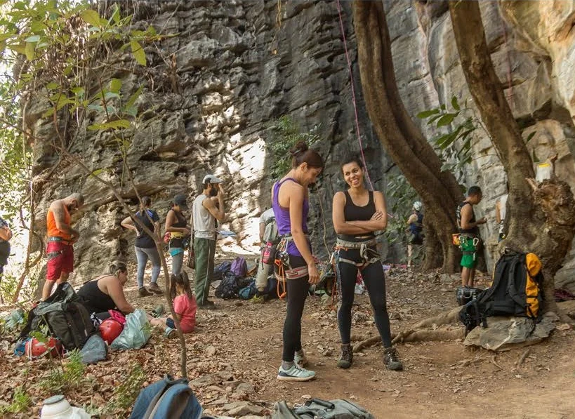 |
    | :--: |
    | *Foto 4* |
    
    | 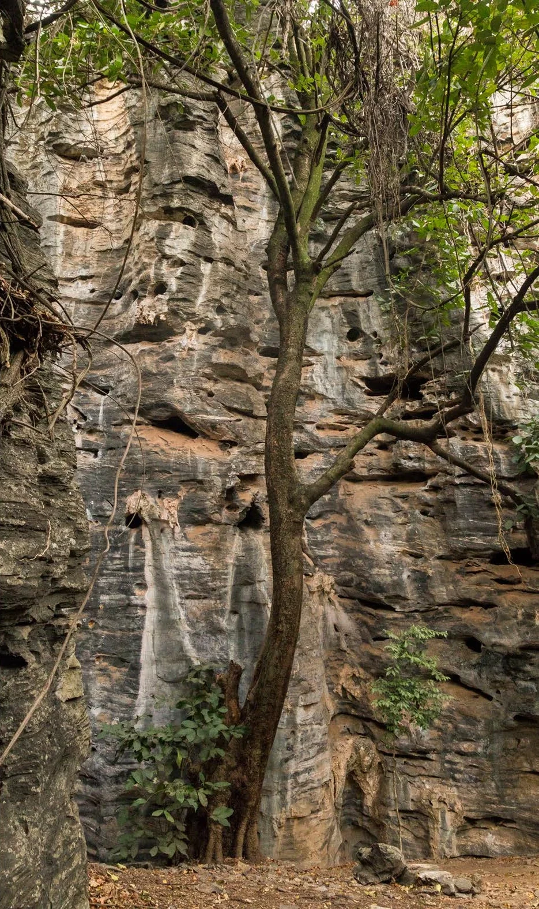 |
    | :--: |
    | *Foto 5* |
    
    | 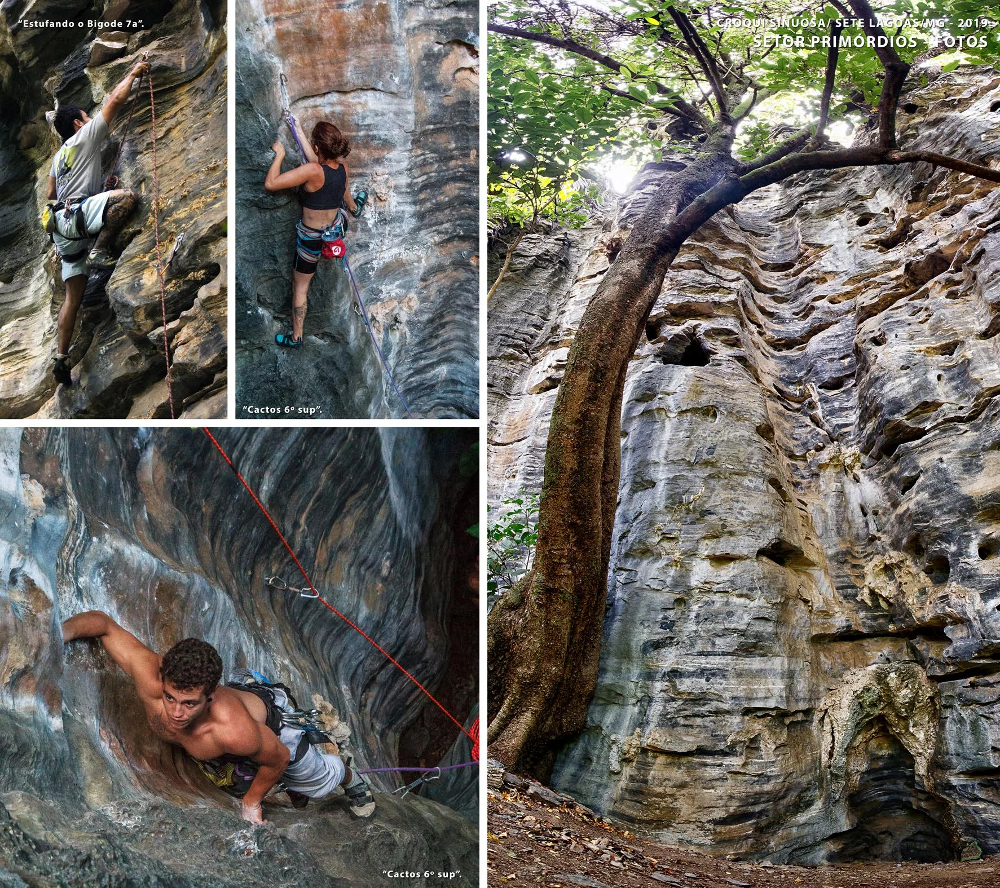 |
    | :--: |
    | *Mais Fotos* |
- **nome**: Setor Primórdios
- **mapas**:
  - **[0]**:
    - **caminho_imagem_mapa**: 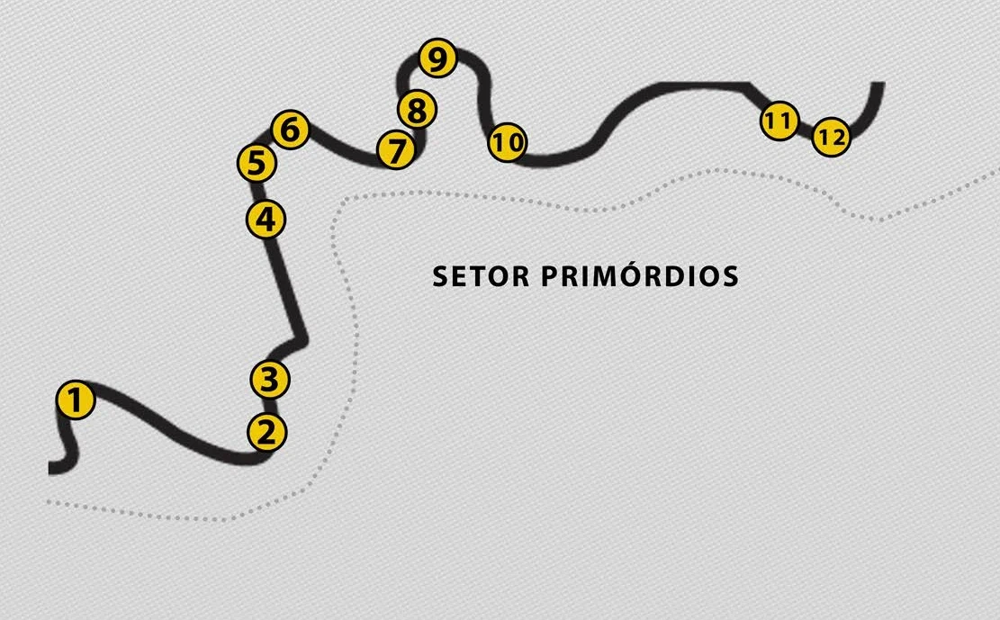
    - **largura_mapa**: 1111
    - **altura_mapa**: 689
    - **pontos_de_interesse**:
      - **[0]**:
        - **id**: 1
        - **label**: 1
        - **circulo**:
          - **x**: 84
          - **y**: 444
          - **raio**: 20
      - **[1]**:
        - **id**: 2
        - **label**: 2
        - **circulo**:
          - **x**: 297
          - **y**: 480
          - **raio**: 20
      - **[2]**:
        - **id**: 3
        - **label**: 3
        - **circulo**:
          - **x**: 300
          - **y**: 422
          - **raio**: 20
      - **[3]**:
        - **id**: 4
        - **label**: 4
        - **circulo**:
          - **x**: 296
          - **y**: 244
          - **raio**: 21
      - **[4]**:
        - **id**: 5
        - **label**: 5
        - **circulo**:
          - **x**: 286
          - **y**: 181
          - **raio**: 21
      - **[5]**:
        - **id**: 6
        - **label**: 6
        - **circulo**:
          - **x**: 323
          - **y**: 144
          - **raio**: 21
      - **[6]**:
        - **id**: 7
        - **label**: 7
        - **circulo**:
          - **x**: 441
          - **y**: 166
          - **raio**: 21
      - **[7]**:
        - **id**: 8
        - **label**: 8
        - **circulo**:
          - **x**: 463
          - **y**: 121
          - **raio**: 21
      - **[8]**:
        - **id**: 9
        - **label**: 9
        - **circulo**:
          - **x**: 487
          - **y**: 64
          - **raio**: 21
      - **[9]**:
        - **id**: 10
        - **label**: 10
        - **circulo**:
          - **x**: 564
          - **y**: 158
          - **raio**: 21
      - **[10]**:
        - **id**: 11
        - **label**: 11
        - **circulo**:
          - **x**: 866
          - **y**: 134
          - **raio**: 21
      - **[11]**:
        - **id**: 12
        - **label**: 12
        - **circulo**:
          - **x**: 924
          - **y**: 153
          - **raio**: 21
    - **referencias**:
      - **[0]**:
        - **escalada**: No Pulso
        - **ids**:
          - 1
      - **[1]**:
        - **escalada**: Cascavel
        - **ids**:
          - 2
      - **[2]**:
        - **escalada**: Marimbondos
        - **ids**:
          - 3
      - **[3]**:
        - **escalada**: Cobra Coral
        - **ids**:
          - 4
      - **[4]**:
        - **escalada**: Cactos
        - **ids**:
          - 5
      - **[5]**:
        - **escalada**: De Voltas Às Origens
        - **ids**:
          - 6
      - **[6]**:
        - **escalada**: Velha Guarda
        - **ids**:
          - 7
      - **[7]**:
        - **escalada**: Chaminé Retinida
        - **ids**:
          - 8
      - **[8]**:
        - **escalada**: Tempos Modernos
        - **ids**:
          - 9
      - **[9]**:
        - **escalada**: Buraco Louco
        - **ids**:
          - 10
      - **[10]**:
        - **escalada**: Estufando o Bigode
        - **ids**:
          - 11
      - **[11]**:
        - **escalada**: Não Deu Bigode
        - **ids**:
          - 12
- **escaladas**:
  - **[0]**:
    - **via_esportiva**:
      - **nome**: No Pulso
      - **dificuldade**: BR_5
      - **quantidade_protecoes_intermediarias**: 7
  - **[1]**:
    - **via_esportiva**:
      - **nome**: Cascavel
      - **dificuldade**: BR_4
      - **quantidade_protecoes_intermediarias**: 5
  - **[2]**:
    - **via_esportiva**:
      - **nome**: Marimbondos
      - **dificuldade**: BR_4
      - **quantidade_protecoes_intermediarias**: 4
  - **[3]**:
    - **via_esportiva**:
      - **nome**: Cobra Coral
      - **dificuldade**: BR_5
      - **quantidade_protecoes_intermediarias**: 7
  - **[4]**:
    - **via_esportiva**:
      - **nome**: Cactos
      - **dificuldade**: BR_6SUP
      - **quantidade_protecoes_intermediarias**: 8
  - **[5]**:
    - **via_esportiva**:
      - **nome**: De Voltas Às Origens
      - **dificuldade**: BR_8A
      - **quantidade_protecoes_intermediarias**: 8
  - **[6]**:
    - **via_esportiva**:
      - **nome**: Velha Guarda
      - **dificuldade**: BR_7B
      - **quantidade_protecoes_intermediarias**: 8
  - **[7]**:
    - **via_esportiva**:
      - **nome**: Chaminé Retinida
      - **dificuldade**: BR_6SUP
      - **quantidade_protecoes_intermediarias**: 8
  - **[8]**:
    - **via_esportiva**:
      - **nome**: Tempos Modernos
      - **dificuldade**: BR_7B
      - **quantidade_protecoes_intermediarias**: 8
  - **[9]**:
    - **via_esportiva**:
      - **nome**: Buraco Louco
      - **dificuldade**: BR_7B
      - **quantidade_protecoes_intermediarias**: 8
  - **[10]**:
    - **via_esportiva**:
      - **nome**: Estufando o Bigode
      - **dificuldade**: BR_7A
      - **quantidade_protecoes_intermediarias**: 7
  - **[11]**:
    - **via_esportiva**:
      - **nome**: Não Deu Bigode
      - **dificuldade**: BR_7B
      - **quantidade_protecoes_intermediarias**: 7
- **precomputados**:
  - **total_escaladas**: 12
  - **total_esportivas**: 12
  - **total_moveis**: 0
  - **total_boulders**: 0
  - **total_multiplas_enfiadas**: 0
  - **total_highlines**: 0

## Parte: setor_4_picos

### Setor (Pico: Sinuosa)

- **descricao**:
    # Setor 4 Picos
    
    |  |
    | :--: |
    | *4 Picos* |
- **nome**: Setor 4 Picos
- **mapas**:
  - **[0]**:
    - **caminho_imagem_mapa**: 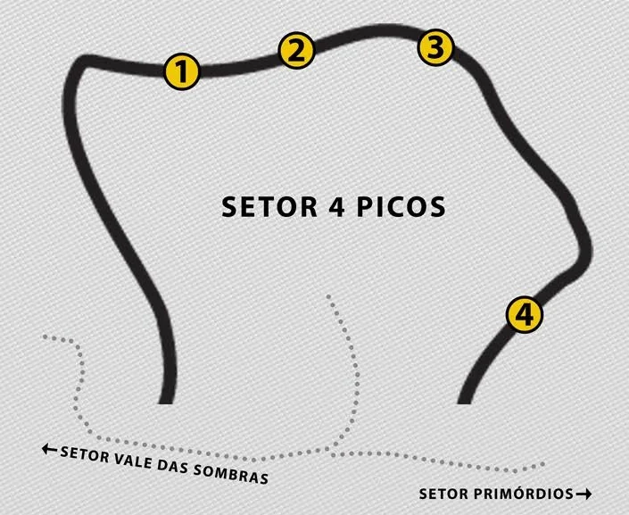
    - **largura_mapa**: 705
    - **altura_mapa**: 577
    - **pontos_de_interesse**:
      - **[0]**:
        - **id**: 1
        - **label**: 1
        - **circulo**:
          - **x**: 204
          - **y**: 80
          - **raio**: 20
      - **[1]**:
        - **id**: 2
        - **label**: 2
        - **circulo**:
          - **x**: 333
          - **y**: 57
          - **raio**: 19
      - **[2]**:
        - **id**: 3
        - **label**: 3
        - **circulo**:
          - **x**: 489
          - **y**: 53
          - **raio**: 19
      - **[3]**:
        - **id**: 4
        - **label**: 4
        - **circulo**:
          - **x**: 588
          - **y**: 353
          - **raio**: 20
      - **[4]**:
        - **id**: Setor_Vale_das_Sombras
        - **label**: ← SETOR VALE DAS SOMBRAS
        - **retangulo**:
          - **x**: 174
          - **y**: 518
          - **comprimento**: 267
          - **largura**: 29
          - **angulo_graus_x100**: 779
      - **[5]**:
        - **id**: Setor_Primordios
        - **label**: SETOR PRIMÓRDIOS →
        - **retangulo**:
          - **x**: 567
          - **y**: 552
          - **comprimento**: 204
          - **largura**: 22
    - **referencias**:
      - **[0]**:
        - **escalada**: Pais e Filhas
        - **ids**:
          - 1
      - **[1]**:
        - **escalada**: Morcegos Sinuosos
        - **ids**:
          - 2
      - **[2]**:
        - **escalada**: Sintoniza Lá
        - **ids**:
          - 3
      - **[3]**:
        - **escalada**: ???
        - **ids**:
          - 4
      - **[4]**:
        - **ids**:
          - Setor_Vale_das_Sombras
        - **setor**: Setor Vale das Sombras
      - **[5]**:
        - **ids**:
          - Setor_Primordios
        - **setor**: Setor Primórdios
- **escaladas**:
  - **[0]**:
    - **via_esportiva**:
      - **nome**: Pais e Filhas
      - **dificuldade**: BR_5
      - **quantidade_protecoes_intermediarias**: 7
  - **[1]**:
    - **via_esportiva**:
      - **nome**: Morcegos Sinuosos
      - **dificuldade**: BR_6SUP
      - **quantidade_protecoes_intermediarias**: 6
  - **[2]**:
    - **via_esportiva**:
      - **nome**: Sintoniza Lá
      - **dificuldade**: BR_6SUP
      - **quantidade_protecoes_intermediarias**: 6
  - **[3]**:
    - **via_esportiva**:
      - **nome**: ???
      - **dificuldade**: PROJETO
- **precomputados**:
  - **total_escaladas**: 4
  - **total_esportivas**: 4
  - **total_moveis**: 0
  - **total_boulders**: 0
  - **total_multiplas_enfiadas**: 0
  - **total_highlines**: 0

## Parte: grupo_vale_oculto

### Grupo (Pico: Sinuosa)

- **descricao**:
    # Vale Oculto Sinuosa
    
    | 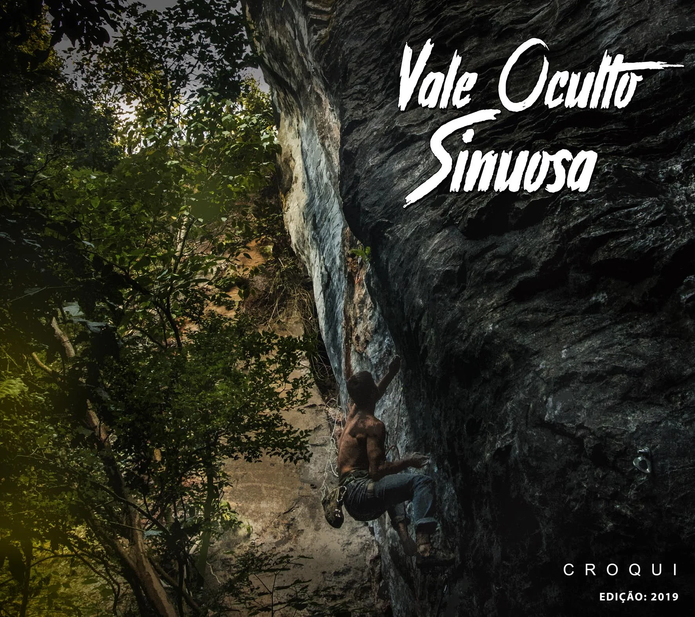 |
    | :--: |
    | *Capa Vale Oculto* |
    
    A área recém descoberta por escaladores locais em 2018, o local deu origem a três sub-setores, chamados: **"De Cara"**, **"Laranja"** e **"Anfiteatro"**.
    
    O Local tem acesso diferente da parte já conhecida dos escaladores. O acesso está ilustrado neste croqui.
    
    Já foram conquistadas **33 vias** e ainda existem algumas possibilidades.
    
    Os três sub-setores tem características bem diferentes: negativos constantes e arestas, vias como **"Face Oculta 7a"**, **"Negativos 6º SUP"**, **"Quebrando o Silêncio 8b"**, **"Recepção Venenosa 7a"** e **"Dono do Pico 7c"** já são a candidatas a vias clássicas da Sinuosa.
    
    | 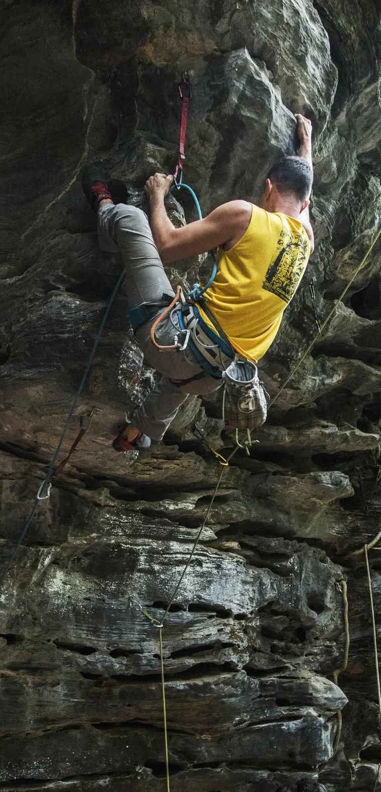 |
    | :--: |
    | *Escalador no Vale Oculto* |
    
    # Trilha de Acesso Vale Oculto
    
    |  |
    | :--: |
    | *Mapa de Acesso Vale Oculto* |
    
    O mapa acima ilustra a trilha de acesso para o Vale Oculto, partindo das proximidades do Shopping Sete Lagoas.
- **nome**: Vale Oculto
- **setores**:
  - **[0]**:
    - **conteudo**:
      - **descricao**:
          # Setor Vale Oculto - Sub Setor de Cara
          
          |  |
          | :--: |
          | *Sub Setor de Cara* |
      - **nome**: Sub Setor de Cara
      - **mapas**:
        - **[0]**:
          - **caminho_imagem_mapa**: 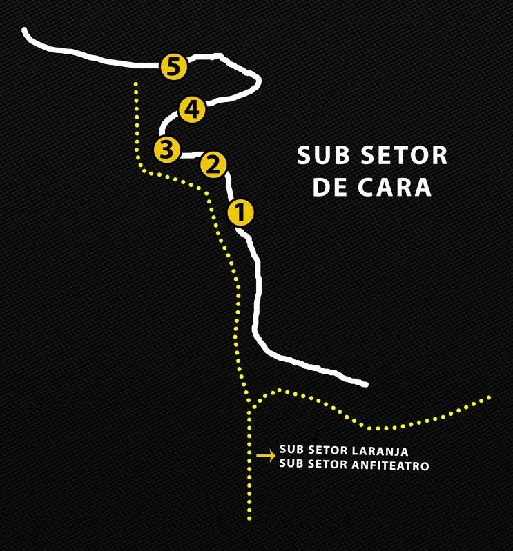
          - **largura_mapa**: 743
          - **altura_mapa**: 799
          - **pontos_de_interesse**:
            - **[0]**:
              - **id**: 1
              - **label**: 1
              - **circulo**:
                - **x**: 349
                - **y**: 308
                - **raio**: 20
            - **[1]**:
              - **id**: 2
              - **label**: 2
              - **circulo**:
                - **x**: 309
                - **y**: 238
                - **raio**: 20
            - **[2]**:
              - **id**: 3
              - **label**: 3
              - **circulo**:
                - **x**: 242
                - **y**: 216
                - **raio**: 19
            - **[3]**:
              - **id**: 4
              - **label**: 4
              - **circulo**:
                - **x**: 279
                - **y**: 159
                - **raio**: 20
            - **[4]**:
              - **id**: 5
              - **label**: 5
              - **circulo**:
                - **x**: 252
                - **y**: 96
                - **raio**: 20
            - **[5]**:
              - **id**: Setores_Laranja_Anfiteatro
              - **label**: SUB SETOR LARANJA / ANFITEATRO →
              - **retangulo**:
                - **x**: 498
                - **y**: 664
                - **comprimento**: 263
                - **largura**: 50
                - **angulo_graus_x100**: 132
          - **referencias**:
            - **[0]**:
              - **escalada**: Facão Traiçoeiro
              - **ids**:
                - 1
            - **[1]**:
              - **escalada**: Negatios
              - **ids**:
                - 2
            - **[2]**:
              - **escalada**: Face Oculta
              - **ids**:
                - 3
            - **[3]**:
              - **escalada**: Lado Sombrio
              - **ids**:
                - 4
            - **[4]**:
              - **escalada**: Tio Ativo
              - **ids**:
                - 5
            - **[5]**:
              - **ids**:
                - Setores_Laranja_Anfiteatro
              - **grupo**: Vale Oculto
              - **setor**: Sub Setor Laranja
            - **[6]**:
              - **ids**:
                - Setores_Laranja_Anfiteatro
              - **grupo**: Vale Oculto
              - **setor**: Sub Setor Anfiteatro
      - **escaladas**:
        - **[0]**:
          - **via_esportiva**:
            - **nome**: Facão Traiçoeiro
            - **dificuldade**: BR_6
            - **quantidade_protecoes_intermediarias**: 3
            - **quantidade_protecoes_parada**: 2
        - **[1]**:
          - **via_esportiva**:
            - **nome**: Negatios
            - **dificuldade**: BR_6SUP
            - **quantidade_protecoes_intermediarias**: 4
            - **quantidade_protecoes_parada**: 2
        - **[2]**:
          - **via_esportiva**:
            - **nome**: Face Oculta
            - **dificuldade**: BR_7A
            - **quantidade_protecoes_intermediarias**: 6
            - **quantidade_protecoes_parada**: 2
        - **[3]**:
          - **via_esportiva**:
            - **nome**: Lado Sombrio
            - **dificuldade**: BR_7C
            - **quantidade_protecoes_intermediarias**: 7
            - **quantidade_protecoes_parada**: 2
        - **[4]**:
          - **via_esportiva**:
            - **nome**: Tio Ativo
            - **dificuldade**: BR_6SUP
            - **quantidade_protecoes_intermediarias**: 3
            - **quantidade_protecoes_parada**: 1
      - **precomputados**:
        - **total_escaladas**: 5
        - **total_esportivas**: 5
        - **total_moveis**: 0
        - **total_boulders**: 0
        - **total_multiplas_enfiadas**: 0
        - **total_highlines**: 0
  - **[1]**:
    - **conteudo**:
      - **descricao**:
          # Setor Vale Oculto - Sub Setor Laranja
          
          |  |
          | :--: |
          | *Sub Setor Laranja* |
      - **nome**: Sub Setor Laranja
      - **mapas**:
        - **[0]**:
          - **caminho_imagem_mapa**: 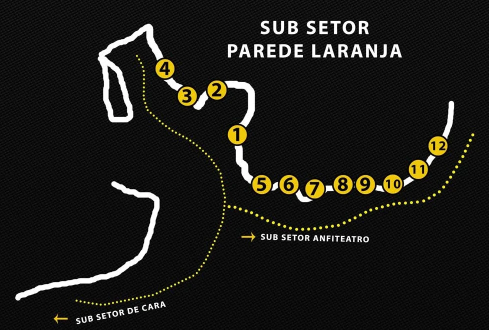
          - **largura_mapa**: 978
          - **altura_mapa**: 660
          - **pontos_de_interesse**:
            - **[0]**:
              - **id**: 1
              - **label**: 1
              - **circulo**:
                - **x**: 475
                - **y**: 269
                - **raio**: 20
            - **[1]**:
              - **id**: 2
              - **label**: 2
              - **circulo**:
                - **x**: 434
                - **y**: 180
                - **raio**: 20
            - **[2]**:
              - **id**: 3
              - **label**: 3
              - **circulo**:
                - **x**: 375
                - **y**: 192
                - **raio**: 20
            - **[3]**:
              - **id**: 4
              - **label**: 4
              - **circulo**:
                - **x**: 330
                - **y**: 137
                - **raio**: 20
            - **[4]**:
              - **id**: 5
              - **label**: 5
              - **circulo**:
                - **x**: 524
                - **y**: 369
                - **raio**: 20
            - **[5]**:
              - **id**: 6
              - **label**: 6
              - **circulo**:
                - **x**: 578
                - **y**: 369
                - **raio**: 20
            - **[6]**:
              - **id**: 7
              - **label**: 7
              - **circulo**:
                - **x**: 630
                - **y**: 378
                - **raio**: 20
            - **[7]**:
              - **id**: 8
              - **label**: 8
              - **circulo**:
                - **x**: 686
                - **y**: 369
                - **raio**: 20
            - **[8]**:
              - **id**: 9
              - **label**: 9
              - **circulo**:
                - **x**: 731
                - **y**: 369
                - **raio**: 20
            - **[9]**:
              - **id**: 10
              - **label**: 10
              - **circulo**:
                - **x**: 786
                - **y**: 368
                - **raio**: 20
            - **[10]**:
              - **id**: 11
              - **label**: 11
              - **circulo**:
                - **x**: 837
                - **y**: 339
                - **raio**: 20
            - **[11]**:
              - **id**: 12
              - **label**: 12
              - **circulo**:
                - **x**: 876
                - **y**: 292
                - **raio**: 20
            - **[12]**:
              - **id**: Sub_Setor_Anfiteatro
              - **label**: SUB SETOR ANFITEATRO →
              - **retangulo**:
                - **x**: 628
                - **y**: 476
                - **comprimento**: 221
                - **largura**: 23
                - **angulo_graus_x100**: 114
            - **[13]**:
              - **id**: Sub_Setor_de_Cara
              - **label**: SUB SETOR DE CARA ↙
              - **retangulo**:
                - **x**: 243
                - **y**: 622
                - **comprimento**: 200
                - **largura**: 30
                - **angulo_graus_x100**: -1211
          - **referencias**:
            - **[0]**:
              - **escalada**: Interação Nativa
              - **ids**:
                - 1
            - **[1]**:
              - **escalada**: Trabalhador Brasileiro
              - **ids**:
                - 2
            - **[2]**:
              - **escalada**: Quebrando O Silêncio
              - **ids**:
                - 3
            - **[3]**:
              - **escalada**: Laranja Mecânica
              - **ids**:
                - 4
            - **[4]**:
              - **escalada**: Jardineiro
              - **ids**:
                - 5
            - **[5]**:
              - **escalada**: Escovação
              - **ids**:
                - 6
            - **[6]**:
              - **escalada**: Ataque em Massa
              - **ids**:
                - 7
            - **[7]**:
              - **escalada**: Zelador
              - **ids**:
                - 8
            - **[8]**:
              - **escalada**: Faxina Russa
              - **ids**:
                - 9
            - **[9]**:
              - **escalada**: Mandela
              - **ids**:
                - 10
            - **[10]**:
              - **escalada**: Patriotas Hipócritas
              - **ids**:
                - 11
            - **[11]**:
              - **escalada**: Dr. Máquina
              - **ids**:
                - 12
            - **[12]**:
              - **ids**:
                - Sub_Setor_de_Cara
              - **grupo**: Vale Oculto
              - **setor**: Sub Setor de Cara
            - **[13]**:
              - **ids**:
                - Sub_Setor_Anfiteatro
              - **grupo**: Vale Oculto
              - **setor**: Sub Setor Anfiteatro
      - **escaladas**:
        - **[0]**:
          - **via_esportiva**:
            - **nome**: Interação Nativa
            - **dificuldade**: BR_5SUP
            - **quantidade_protecoes_intermediarias**: 8
            - **quantidade_protecoes_parada**: 1
        - **[1]**:
          - **via_esportiva**:
            - **nome**: Trabalhador Brasileiro
            - **dificuldade**: BR_7A
            - **quantidade_protecoes_intermediarias**: 8
            - **quantidade_protecoes_parada**: 1
        - **[2]**:
          - **via_esportiva**:
            - **nome**: Quebrando O Silêncio
            - **dificuldade**: BR_8B
            - **quantidade_protecoes_intermediarias**: 9
            - **quantidade_protecoes_parada**: 2
        - **[3]**:
          - **via_esportiva**:
            - **nome**: Laranja Mecânica
            - **dificuldade**: PROJETO
            - **quantidade_protecoes_intermediarias**: 10
            - **quantidade_protecoes_parada**: 2
        - **[4]**:
          - **via_esportiva**:
            - **nome**: Jardineiro
            - **dificuldade**: BR_5
            - **quantidade_protecoes_intermediarias**: 3
            - **quantidade_protecoes_parada**: 1
        - **[5]**:
          - **via_esportiva**:
            - **nome**: Escovação
            - **dificuldade**: BR_5
            - **quantidade_protecoes_intermediarias**: 3
            - **quantidade_protecoes_parada**: 1
        - **[6]**:
          - **via_esportiva**:
            - **nome**: Ataque em Massa
            - **dificuldade**: BR_6SUP
            - **quantidade_protecoes_intermediarias**: 4
            - **quantidade_protecoes_parada**: 1
        - **[7]**:
          - **via_esportiva**:
            - **nome**: Zelador
            - **dificuldade**: BR_7A
            - **quantidade_protecoes_intermediarias**: 4
            - **quantidade_protecoes_parada**: 2
        - **[8]**:
          - **via_esportiva**:
            - **nome**: Faxina Russa
            - **dificuldade**: BR_6SUP
            - **quantidade_protecoes_intermediarias**: 5
            - **quantidade_protecoes_parada**: 1
        - **[9]**:
          - **via_esportiva**:
            - **nome**: Mandela
            - **dificuldade**: BR_6
            - **quantidade_protecoes_intermediarias**: 4
            - **quantidade_protecoes_parada**: 1
        - **[10]**:
          - **via_esportiva**:
            - **nome**: Patriotas Hipócritas
            - **dificuldade**: BR_7B
            - **quantidade_protecoes_intermediarias**: 4
            - **quantidade_protecoes_parada**: 2
        - **[11]**:
          - **via_esportiva**:
            - **nome**: Dr. Máquina
            - **dificuldade**: BR_6SUP
            - **quantidade_protecoes_intermediarias**: 4
            - **quantidade_protecoes_parada**: 1
      - **precomputados**:
        - **total_escaladas**: 12
        - **total_esportivas**: 12
        - **total_moveis**: 0
        - **total_boulders**: 0
        - **total_multiplas_enfiadas**: 0
        - **total_highlines**: 0
  - **[2]**:
    - **conteudo**:
      - **descricao**:
          # Setor Vale Oculto - Sub Setor Anfiteatro
          
          |  |
          | :--: |
          | *Sub Setor Anfiteatro* |
      - **nome**: Sub Setor Anfiteatro
      - **mapas**:
        - **[0]**:
          - **caminho_imagem_mapa**: 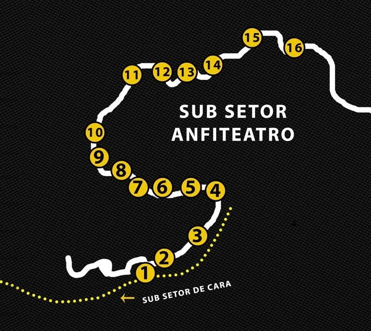
          - **largura_mapa**: 752
          - **altura_mapa**: 671
          - **pontos_de_interesse**:
            - **[0]**:
              - **id**: 1
              - **label**: 1
              - **circulo**:
                - **x**: 295
                - **y**: 553
                - **raio**: 20
            - **[1]**:
              - **id**: 2
              - **label**: 2
              - **circulo**:
                - **x**: 333
                - **y**: 523
                - **raio**: 20
            - **[2]**:
              - **id**: 3
              - **label**: 3
              - **circulo**:
                - **x**: 401
                - **y**: 478
                - **raio**: 20
            - **[3]**:
              - **id**: 4
              - **label**: 4
              - **circulo**:
                - **x**: 438
                - **y**: 386
                - **raio**: 20
            - **[4]**:
              - **id**: 5
              - **label**: 5
              - **circulo**:
                - **x**: 387
                - **y**: 380
                - **raio**: 20
            - **[5]**:
              - **id**: 6
              - **label**: 6
              - **circulo**:
                - **x**: 330
                - **y**: 380
                - **raio**: 20
            - **[6]**:
              - **id**: 7
              - **label**: 7
              - **circulo**:
                - **x**: 280
                - **y**: 380
                - **raio**: 20
            - **[7]**:
              - **id**: 8
              - **label**: 8
              - **circulo**:
                - **x**: 246
                - **y**: 345
                - **raio**: 20
            - **[8]**:
              - **id**: 9
              - **label**: 9
              - **circulo**:
                - **x**: 201
                - **y**: 319
                - **raio**: 20
            - **[9]**:
              - **id**: 10
              - **label**: 10
              - **circulo**:
                - **x**: 193
                - **y**: 269
                - **raio**: 20
            - **[10]**:
              - **id**: 11
              - **label**: 11
              - **circulo**:
                - **x**: 268
                - **y**: 151
                - **raio**: 20
            - **[11]**:
              - **id**: 12
              - **label**: 12
              - **circulo**:
                - **x**: 329
                - **y**: 146
                - **raio**: 20
            - **[12]**:
              - **id**: 13
              - **label**: 13
              - **circulo**:
                - **x**: 379
                - **y**: 146
                - **raio**: 20
            - **[13]**:
              - **id**: 14
              - **label**: 14
              - **circulo**:
                - **x**: 432
                - **y**: 132
                - **raio**: 20
            - **[14]**:
              - **id**: 15
              - **label**: 15
              - **circulo**:
                - **x**: 511
                - **y**: 76
                - **raio**: 20
            - **[15]**:
              - **id**: 16
              - **label**: 16
              - **circulo**:
                - **x**: 597
                - **y**: 97
                - **raio**: 20
            - **[16]**:
              - **id**: Sub_Setor_de_Cara
              - **label**: SUB SETOR DE CARA ↗
              - **retangulo**:
                - **x**: 380
                - **y**: 592
                - **comprimento**: 196
                - **largura**: 31
                - **angulo_graus_x100**: -1091
          - **referencias**:
            - **[0]**:
              - **escalada**: A Cara do Tia
              - **ids**:
                - 1
            - **[1]**:
              - **escalada**: Pedra no Caminho
              - **ids**:
                - 2
            - **[2]**:
              - **escalada**: Hora Marcada
              - **ids**:
                - 3
            - **[3]**:
              - **escalada**: Funcionário do Mês
              - **ids**:
                - 4
            - **[4]**:
              - **escalada**: Mancha Preta
              - **ids**:
                - 5
            - **[5]**:
              - **escalada**: Recepção Venenosa
              - **ids**:
                - 6
            - **[6]**:
              - **escalada**: Achados e Perdidos
              - **ids**:
                - 7
            - **[7]**:
              - **escalada**: Pelotão de Elite
              - **ids**:
                - 8
            - **[8]**:
              - **escalada**: Dono do Pico
              - **ids**:
                - 10
            - **[9]**:
              - **escalada**: Tio Certeiro
              - **ids**:
                - 11
            - **[10]**:
              - **escalada**: Tios Goró
              - **ids**:
                - 12
            - **[11]**:
              - **escalada**: Tioradentes
              - **ids**:
                - 13
            - **[12]**:
              - **escalada**: Tios D'Jah
              - **ids**:
                - 14
            - **[13]**:
              - **escalada**: Velho Tio
              - **ids**:
                - 15
            - **[14]**:
              - **escalada**: Tio Tonhas
              - **ids**:
                - 16
            - **[15]**:
              - **ids**:
                - Sub_Setor_de_Cara
              - **grupo**: Vale Oculto
              - **setor**: Sub Setor de Cara
      - **escaladas**:
        - **[0]**:
          - **via_esportiva**:
            - **nome**: A Cara do Tia
            - **dificuldade**: BR_6SUP
            - **quantidade_protecoes_intermediarias**: 6
            - **quantidade_protecoes_parada**: 2
        - **[1]**:
          - **via_esportiva**:
            - **nome**: Pedra no Caminho
            - **dificuldade**: BR_7A
            - **quantidade_protecoes_intermediarias**: 3
            - **quantidade_protecoes_parada**: 2
        - **[2]**:
          - **via_esportiva**:
            - **nome**: Hora Marcada
            - **dificuldade**: BR_6
            - **quantidade_protecoes_intermediarias**: 3
            - **quantidade_protecoes_parada**: 1
        - **[3]**:
          - **via_esportiva**:
            - **nome**: Funcionário do Mês
            - **dificuldade**: BR_6SUP
            - **quantidade_protecoes_intermediarias**: 4
            - **quantidade_protecoes_parada**: 2
        - **[4]**:
          - **via_esportiva**:
            - **nome**: Mancha Preta
            - **dificuldade**: BR_7B
            - **quantidade_protecoes_intermediarias**: 6
            - **quantidade_protecoes_parada**: 2
        - **[5]**:
          - **via_esportiva**:
            - **nome**: Recepção Venenosa
            - **dificuldade**: BR_7A
            - **quantidade_protecoes_intermediarias**: 4
            - **quantidade_protecoes_parada**: 2
        - **[6]**:
          - **via_esportiva**:
            - **nome**: Achados e Perdidos
            - **dificuldade**: BR_6SUP
            - **quantidade_protecoes_intermediarias**: 6
            - **quantidade_protecoes_parada**: 2
        - **[7]**:
          - **via_esportiva**:
            - **nome**: Pelotão de Elite
            - **dificuldade**: BR_6SUP
            - **quantidade_protecoes_intermediarias**: 5
            - **quantidade_protecoes_parada**: 2
        - **[8]**:
          - **via_esportiva**:
            - **nome**: Dono do Pico
            - **dificuldade**: BR_7C
            - **quantidade_protecoes_intermediarias**: 8
            - **quantidade_protecoes_parada**: 2
        - **[9]**:
          - **via_esportiva**:
            - **nome**: Tio Certeiro
            - **dificuldade**: BR_6
            - **quantidade_protecoes_intermediarias**: 5
            - **quantidade_protecoes_parada**: 2
        - **[10]**:
          - **via_esportiva**:
            - **nome**: Tios Goró
            - **dificuldade**: BR_6
            - **quantidade_protecoes_intermediarias**: 5
            - **quantidade_protecoes_parada**: 2
        - **[11]**:
          - **via_esportiva**:
            - **nome**: Tioradentes
            - **dificuldade**: BR_6
            - **quantidade_protecoes_intermediarias**: 5
            - **quantidade_protecoes_parada**: 2
        - **[12]**:
          - **via_esportiva**:
            - **nome**: Tios D'Jah
            - **dificuldade**: BR_6SUP
            - **quantidade_protecoes_intermediarias**: 6
            - **quantidade_protecoes_parada**: 2
        - **[13]**:
          - **via_esportiva**:
            - **nome**: Velho Tio
            - **dificuldade**: BR_6SUP
            - **quantidade_protecoes_intermediarias**: 5
            - **quantidade_protecoes_parada**: 2
        - **[14]**:
          - **via_esportiva**:
            - **nome**: Tio Tonhas
            - **dificuldade**: BR_6SUP
            - **quantidade_protecoes_intermediarias**: 6
            - **quantidade_protecoes_parada**: 1
      - **precomputados**:
        - **total_escaladas**: 15
        - **total_esportivas**: 15
        - **total_moveis**: 0
        - **total_boulders**: 0
        - **total_multiplas_enfiadas**: 0
        - **total_highlines**: 0
- **precomputados**:
  - **total_escaladas**: 32
  - **total_esportivas**: 32
  - **total_moveis**: 0
  - **total_boulders**: 0
  - **total_multiplas_enfiadas**: 0
  - **total_highlines**: 0

## Arquivos Externos

- **arquivos_externos**:
  - **[0]**:
    - **caminho**: 
    - **checksum_sha256**: 726e932831b4baa61931df02ed761202e50ab989afd52b0f0bdb0940bd053b02
  - **[1]**:
    - **caminho**: 
    - **checksum_sha256**: ac33891f4198021148c737e76c5080369113ddafb3e1f9801e9a2c6c3a1a8798
  - **[2]**:
    - **caminho**: 
    - **checksum_sha256**: 242293db56ac2ac2cd4909e16c2ab224fd7c5877c1e9beb0082a16831d1e4d08
  - **[3]**:
    - **caminho**: 
    - **checksum_sha256**: d6dc71d018a0168e2d2bd9ff89013002a85a74880740cf82e7d519bbdeccc5fc
  - **[4]**:
    - **caminho**: 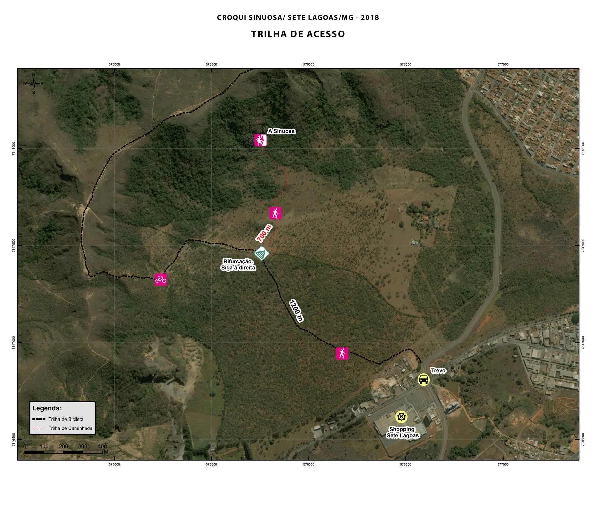
    - **checksum_sha256**: afe1b2c527bf1c937040f0e4a2b9083fcf8338f9facdb0f16663773db9f2c3ee
  - **[5]**:
    - **caminho**: 
    - **checksum_sha256**: 2c9a58d34d460f68d664e7ee49881beaaf97daf09c5780bd55e524159fd51f54
  - **[6]**:
    - **caminho**: 
    - **checksum_sha256**: 04bf6771127f68cdaf7a3ccdb25a9a166a9c0bf946a0d169e96d5d7effbea8e5
  - **[7]**:
    - **caminho**: 
    - **checksum_sha256**: 819d207759f59ec5f998ea635e4d69ff45b276abbce278712f174f6253f1f7f0
  - **[8]**:
    - **caminho**: 
    - **checksum_sha256**: e2611b1dd7bf66bbf46e233d00c21a49eda304d50a9d34cdd4e252764d52744a
  - **[9]**:
    - **caminho**: 
    - **checksum_sha256**: 880b143aa8d94a70fd189f2628c38de7e4a399b183a8665361cd18219d4a36e7
  - **[10]**:
    - **caminho**: 
    - **checksum_sha256**: b38ffcb2bba799acd6006356559aec98f2af017df5c5a83adf3f94a7fb10c967
  - **[11]**:
    - **caminho**: 
    - **checksum_sha256**: 94a33e9451eb5b7e48498603022d8ff2c2aea67a073819f235b2f83d797fea9c
  - **[12]**:
    - **caminho**: 
    - **checksum_sha256**: da677eb0276b82d98482b2a03f5440e79c95b571aa461af16cd3cb0bc3284c3c
  - **[13]**:
    - **caminho**: 
    - **checksum_sha256**: 94453b0a37bd267563c11037b2792fdd8129cff564f008f45271d47e723e7d31
  - **[14]**:
    - **caminho**: 
    - **checksum_sha256**: 41a44f0ae119d6004e88427a9a93126029d271595a380b382e46702b62438342
  - **[15]**:
    - **caminho**: 
    - **checksum_sha256**: a72e71ba5cd31bfc9a07b1bea1edb8ced9cf0142ce73bdfb23b97d33a6a7f449
  - **[16]**:
    - **caminho**: 
    - **checksum_sha256**: b4a97a62b6aba29129715cced05500d9dd1e7d8d4184218365bc25ada7d9c1c0
  - **[17]**:
    - **caminho**: 
    - **checksum_sha256**: a969dc5f3a1277f20f4fb67d115ae7155c738cdcfb78c3bcb710c3fd84880d53
  - **[18]**:
    - **caminho**: 
    - **checksum_sha256**: 0515b72272721e9dd939a45099d98a1d2e0ca73da0b5981479b3f2d4fee7f2fb
  - **[19]**:
    - **caminho**: 
    - **checksum_sha256**: 8740659abb98efe5487787583fc1e5d819724bda9dc960b5de901aa787d8eff8
  - **[20]**:
    - **caminho**: 
    - **checksum_sha256**: c15c5fef62a57100a52e56f5aa5ef531c7160b60188ff8596a4fc928bce5c788
  - **[21]**:
    - **caminho**: 
    - **checksum_sha256**: 88cec07d27eea0ed34638ec717bb6128b94aa1da61770ab4fa69129bb4b670ad
  - **[22]**:
    - **caminho**: 
    - **checksum_sha256**: bf539ff7a007288bcbe0394505515b469f28c6b0f094c4f50d92f6b059adc286
  - **[23]**:
    - **caminho**: 
    - **checksum_sha256**: 931c57b1dc14bfc40802f81eaf7caa2c800779c453ba1f4412e06c7656a4f644
  - **[24]**:
    - **caminho**: 
    - **checksum_sha256**: 88a8f485c10b90c849aee037ebd1de3b939336053dba886bb0c0f01c42fb2713
  - **[25]**:
    - **caminho**: 
    - **checksum_sha256**: 31d892315d5c92dc46e1de2cf595c585990a8047b64d077333baf453c707036d
  - **[26]**:
    - **caminho**: 
    - **checksum_sha256**: 2c248cb40a0f2d445a9ee145e5795f202ece5ecdf55c495b9d09c96ae07e7f43
  - **[27]**:
    - **caminho**: 
    - **checksum_sha256**: 4409dbb50221ba5ef959e50de3edfcf4c78f8a482cc360061babb68de98016f0
  - **[28]**:
    - **caminho**: 
    - **checksum_sha256**: bbeec037fad97983096efbb191e70be5740957f9128c40afe003748073e730c6
  - **[29]**:
    - **caminho**: 
    - **checksum_sha256**: 407f984c9ab3ea77c6d12384dfc0600efd5b7c6638087284695e55d0caa5baaa
  - **[30]**:
    - **caminho**: 
    - **checksum_sha256**: 75c24f6a1f5703b55d9c16f4f35d71f09e1c4e6bc63db2736fbc13569f785c24
  - **[31]**:
    - **caminho**: 
    - **checksum_sha256**: a412ba2f86ce35a4c2f6e1a83c61cd502e04017c83c2b92262668265595072d6
  - **[32]**:
    - **caminho**: 
    - **checksum_sha256**: 895d5d6bd7a82ce2f821395f2458ceda70af8af5727bbead831e9bfb662325d7
  - **[33]**:
    - **caminho**: 
    - **checksum_sha256**: c1138b4fcc69962fdd779773430f6b978d6ca08d71a9c9b4eab89bc100cf7bee
  - **[34]**:
    - **caminho**: 
    - **checksum_sha256**: a9f796ac1a40823ea0455a8412e9dfebc9ca18135ec2704c54a47bf32b387561
  - **[35]**:
    - **caminho**: 
    - **checksum_sha256**: 83c3d1ee891adba8a36fb00bc710da03bb3c72ca9152e4141758363031156471
  - **[36]**:
    - **caminho**: 
    - **checksum_sha256**: 19d7794a801ba0ab72e339da1ca9bfa5dcb398cb9e88f10f49737d9359634261
  - **[37]**:
    - **caminho**: 
    - **checksum_sha256**: c0c06eb5a3a20499148717361a40ee8a5d333a9f4219eda85cd96cfcdb6f8786
  - **[38]**:
    - **caminho**: 
    - **checksum_sha256**: 7e2715763c82deedd52c81a001dac19c57a5d5c110daabc50f0954d75c08ce30
  - **[39]**:
    - **caminho**: 
    - **checksum_sha256**: 00bb7c4e8b230e9203a8013940a00d908994efb769f9c3ccccd40e2c62293794
  - **[40]**:
    - **caminho**: 
    - **checksum_sha256**: 05b3a0aec2f0a4d300c024f2f9def8411e0f26a42c29767b7ef97802adc6201f
  - **[41]**:
    - **caminho**: 
    - **checksum_sha256**: bb9e3918738292918763c5bff0b0ac949e699a4613056e48c98a0c0055a561f6
  - **[42]**:
    - **caminho**: 
    - **checksum_sha256**: 72a755f4496081b8dfa6df689e22f9387b6557c9f321afe3674e3ceb4d1ad86c
  - **[43]**:
    - **caminho**: 
    - **checksum_sha256**: 0683891f1fdcafaaeaa85cee7d850b66fff02e1a2009c150c755f4afb48900c9
  - **[44]**:
    - **caminho**: 
    - **checksum_sha256**: 78d662c020d503bf45c5163e41594017becc821f3b4300f2afcb4ef8c1dc1938
  - **[45]**:
    - **caminho**: 
    - **checksum_sha256**: ba9f48da5900eecf26f1a369638b542db633ba7bd82409eca81705fa6561ded5
  - **[46]**:
    - **caminho**: 
    - **checksum_sha256**: 86565029265d94021d06744b344287595c9fab2618750d43967de543b803a6de
  - **[47]**:
    - **caminho**: 
    - **checksum_sha256**: a1e605f115d789b2881f024cf98e23b2e823cc106c0479c39831809d10094810
  - **[48]**:
    - **caminho**: 
    - **checksum_sha256**: 953a46fea9f730fecad4dc2bb308595c3fb02919bc226ac073c7d90293de7005
  - **[49]**:
    - **caminho**: 
    - **checksum_sha256**: d4f86d0b5001fe48aa9c246b5320b95a9096cf759691bce4eafab814a00d3823
  - **[50]**:
    - **caminho**: 
    - **checksum_sha256**: fc3e4b490888236b4e740800928718a1275fa9549fa12ca7a1b8f07b4c2eb310
  - **[51]**:
    - **caminho**: 
    - **checksum_sha256**: 175e2a74b4d8c81863424cd5f312ad907425bd2100cbfb38ccdc381e54c55bf5
  - **[52]**:
    - **caminho**: 
    - **checksum_sha256**: 23ce02c8a7e0977a8cfe4dccf8939b0065d783d0f0b0307e4cc5482d1139d146
  - **[53]**:
    - **caminho**: 
    - **checksum_sha256**: fa37a8141db8c044789367904bfbccc8d51c6aebf2082a384aa037d6d5d2bc0b
  - **[54]**:
    - **caminho**: 
    - **checksum_sha256**: 4a696bbe565d823542fe32c3b2775ea79a9c4a843125879c05ca34d4fc1a4d5e
  - **[55]**:
    - **caminho**: 
    - **checksum_sha256**: 5b616b889ff927ed0913a651eb90c581011e38671a5be227c870f9ef2a2c1797
  - **[56]**:
    - **caminho**: 
    - **checksum_sha256**: 1109fc5389e3ed74d4335506eaaac658b7bdcfb8267c84a9b1fe603edb640f8c
  - **[57]**:
    - **caminho**: 
    - **checksum_sha256**: b7d67ab78015d734f60b07c1abded1e5bfbdf8f0a494b532b574c2cf49cc0de0
  - **[58]**:
    - **caminho**: 
    - **checksum_sha256**: 19bd3a36a84e04924e226b0977802d21862852f09a9a573ae89b3016d16ce9b5
  - **[59]**:
    - **caminho**: 
    - **checksum_sha256**: ddd9a200ea5b6dca267ed2ab15135e387663b02ff2cf5ab01f56f62fa22845b7
  - **[60]**:
    - **caminho**: 
    - **checksum_sha256**: 67074b10d3c48ae76b98aa0f780432cd7daa4efd4b4cdaae7f62bac9422dc50d
  - **[61]**:
    - **caminho**: 
    - **checksum_sha256**: b3f58c2bb35e9505cf32469055205168eb32bb58cbfec573ea3fa0aed04464c6

