# Croqui: Sinuosa

## Informações Gerais

- **id**: br_mg_sete_lagoas_sinuosa
- **nome**: Sinuosa
- **uid**: X6OTknRVmaiSvG
- **creditos**:
  - Jean Carlos
  - Luciana dos Anjos
  - Yuri Vieira
  - Hugo Aguiar
  - Henrique Barcelos
  - Ricardo "Animal"
  - Tadeu Rassi
  - Michel Ângelo
  - Carlos Souza
- **caminho_thumbnail**: 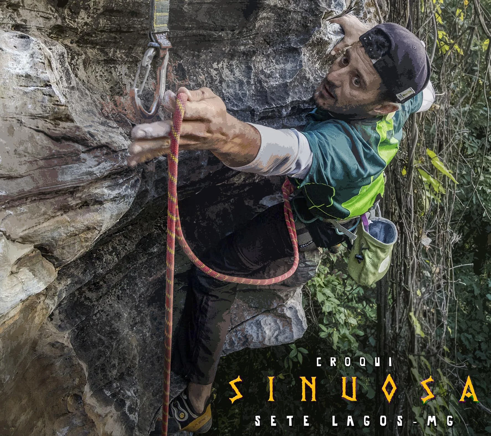
- **revisado_manualmente**: True
- **status_desenho_extraivel**: NAO_TEM_DESENHO
- **botoes**:
  - **[0]**:
    - **uid**: lgmqCXFyiCB9CF
    - **texto**: Capa
    - **destino**:
      - **secao_textual**:
        - **conteudo**:
            # Croqui Sinuosa - Sete Lagoas, MG
            
            |  |
            | :--: |
            | *Capa* |
            
            Este é o croqui da Sinuosa, localizada em Sete Lagoas, MG.
  - **[1]**:
    - **uid**: 2T3JPY6L85n0k0
    - **texto**: Regras e Segurança
    - **destino**:
      - **secao_textual**:
        - **conteudo**:
            # Regras e Segurança
            
            **LEIA**
            
            - FIQUE ATENTO QUANTO À SEGURANÇA.
            - ASSINE O TERMO DE RESPONSABILIDADE.
            - ANDE SOMENTE PELAS TRILHAS EXISTENTES.
            - ATENÇÃO QUANTO À VIAS INACABADAS.
            - NUNCA FAÇA FOGUEIRAS.
            - EVITE AGLOMERAÇÕES E ALGAZARRAS.
            - LEVE O SEU LIXO E SE O SEU AMIGO DEIXAR, LEVE O DELE TAMBÉM.
            - ATENÇÃO À ABELHAS E ANIMAIS PEÇONHENTOS.
            - MENORES DEVEM ESTAR ACOMPANHADOS DE UM RESPONSÁVEL LEGAL.
  - **[2]**:
    - **uid**: gx7Ewcn5YCbgCs
    - **texto**: Turismo e Equipamentos
    - **destino**:
      - **secao_textual**:
        - **conteudo**:
            # Informações ao Turista
            
            ## Melhor Época
            Na Sinuosa o melhor período de visitação é entre os meses de maio a setembro. O clima da região se torna perfeito para a prática.
            
            ## Onde Ficar
            A cidade de Sete Lagoas/MG conta com variadas opções de hospedagem, como: hotéis, pousadas e hostel. A cidade ainda não tem abrigo para escaladores.
            
            ## Alimentação
            Supermercado e restaurante bem ao lado do acesso do pico, no Shopping Sete Lagoas.
            
            ---
            
            ## Lugares para Visitar
            - **Serra Santa Helena:** Ótima opção para passeios com a família e amigos.
            - **Gruta Rei do Mato:** Monumento Estadual Natural, uma das mais importantes grutas do Brasil, com pinturas rupestres e formações únicas encontradas somente aqui e na Espanha.
            - **Lagoas da Cidade:** Grande importância cultural, conhecidas como "A cidade dos Lagos Encantados".
            - **Museu do Ferroviário:** Da antiga Estação do Brasil.
            - **Museu Municipal:** Conta a história da cidade desde a época dos tropeiros de Fernão Dias.
            - **Museu de Mineralogia:** Um dos mais sofisticados do país.
            
            ---
            
            ## Equipamento Sugerido
            - Kit esportivo.
            - Corda de 60m é suficiente, mas a de 70m facilita nas poucas vias mais altas.
            - Para quem curte escalada em móvel, há algumas possibilidades na Sinuosa.
            
            ## Tipo de Rocha
            Calcário
            
            ---
            
            ## Áreas de Escalada Próximos à Sete Lagoas
            - **Gruta do Baú:** 48 km
            - **Gruta da Lapinha:** 55 km
            - **Lapa do Seu Antão:** 51 km
            - **Sítio do Rod:** 58 km
            - **Serra do Cipó:** 112 km
            - **Pedra Rachada:** 102 km
  - **[3]**:
    - **uid**: o4WxaBe8QFiyJ4
    - **texto**: Curiosidades
    - **destino**:
      - **secao_textual**:
        - **conteudo**:
            # Curiosidades sobre o local
            
            A área de escalada está situada na **Fazenda Arizona**, propriedade privada localizada no meio urbano da cidade de Sete Lagoas, Minas Gerais. A área está inserida a meia encosta da **APA Serra de Santa Helena** (Latitude: 19°27'38.39"S Longitude: 44°16'42.95"O), onde há a presença de Metacalcarenitos e afloramentos calcários, tendo como cobertura vegetal a floresta estacional semidecidual e a parte baixa recoberta por sedimentos onde predomina a vegetação característica do Cerrado.
            
            Em 1937, na primeira edição do livro "As Grutas de Minas Gerais" do antigo IBGE, a área em questão é denominada de **"Lapa Arizona"**, onde são descritas várias informações do afloramento.
            
            O nome **"Sinuosa"** foi dado por escaladores locais em meados da década de 90 devido à curiosa forma da árvore que fica no Setor Primórdios. As primeiras vias do pico foram conquistadas há mais de 20 anos, mas só em 2013 o pico voltou a ser desenvolvido com abertura de novas vias.
            
            Existe um tipo de **caverna vertical** explorada por espeleólogos com mais de 100 metros de profundidade, com vários salões em seu decorrer, formações impressionantes de "esponjas calcárias", entre outras curiosidades sobre o terreno "karst".
  - **[4]**:
    - **uid**: y5spqBYWeiVQxh
    - **texto**: Considerações Finais
    - **destino**:
      - **secao_textual**:
        - **conteudo**:
            # Considerações Finais
            
            | 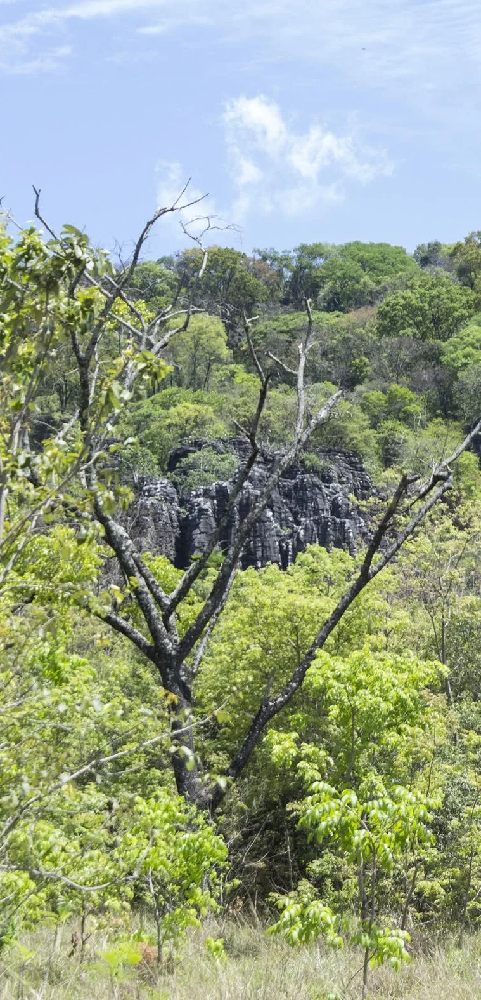 |
            | :--: |
            | *Considerações Finais* |
            
            A área de escalada esportiva **"Sinuosa"** apresenta baixos índices de degradação ambiental relacionados à prática do esporte. Entre os aspectos ambientais analisados, a abertura de trilhas e novos setores é o que apresenta um maior coeficiente de intervenção, devido ao fato da supressão de vegetação e exposição do solo.
            
            Conclui-se ainda que a área apresenta grande potencial para aberturas de novos setores, sendo feita uma estimativa da possibilidade de chegar a **mais de 150 vias**. É importante ressaltar que a presença de escaladores no local contribui de forma positiva, inibindo a presença de caçadores, vândalos e a depredação da fauna, flora e do patrimônio espeleológico.
            
            Além da área mencionada, existem outros locais de destaque no cenário nacional para a prática da escalada na cidade de Sete Lagoas, sendo eles: a **"Área de Escalada Gruta Rei do Mato"**, localizada no Monumento Natural Estadual Gruta Rei do Mato, e a **"Área de Escalada Esportiva Roxane"**, localizada em propriedade particular na zona rural do município. Porém, em ambas a prática da escalada está proibida. Devido a este fato, a possibilidade de novos trabalhos envolvendo a questão ambiental e a prática do esporte se mostra promissora.
  - **[5]**:
    - **uid**: rOYRb92wSEHenV
    - **texto**: Ficha Técnica
    - **destino**:
      - **secao_textual**:
        - **conteudo**:
            # FICHA TÉCNICA
            
            | 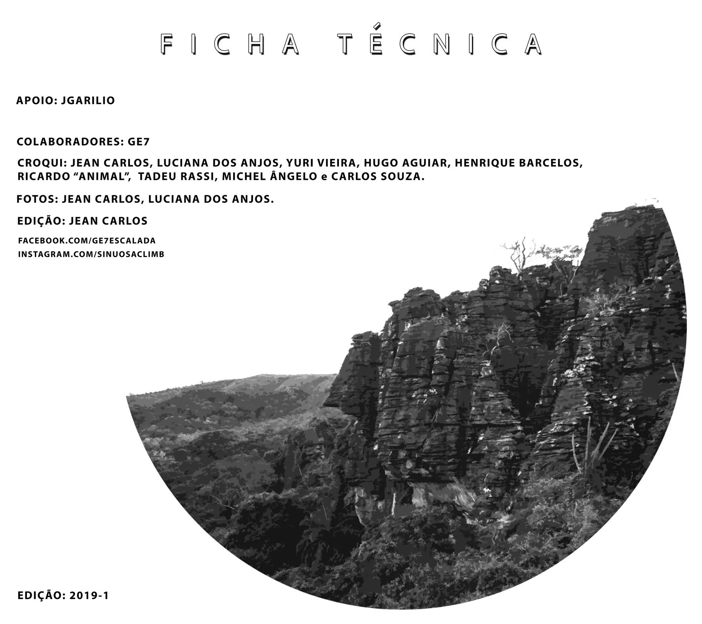 |
            | :--: |
            | *Ficha Técnica* |
            
            **APOIO:** JGARILIO
            
            **COLABORADORES:** GE7
            
            **CROQUI:** JEAN CARLOS, LUCIANA DOS ANJOS, YURI VIEIRA, HUGO AGUIAR, HENRIQUE BARCELOS, RICARDO "ANIMAL", TADEU RASSI, MICHEL ÂNGELO e CARLOS SOUZA.
            
            **FOTOS:** JEAN CARLOS, LUCIANA DOS ANJOS.
            
            **EDIÇÃO:** JEAN CARLOS
            
            **REDES SOCIAIS:**
            - Facebook: [facebook.com/ge7escalada](https://facebook.com/ge7escalada)
            - Instagram: [@sinuosaclimb](https://instagram.com/sinuosaclimb)
            
            **EDIÇÃO:** 2019-1
- **ultima_migracao**: 5
- **publicar_croqui**: True
- **revisado_bounding_circle**: True

## Parte: setor_de_esquerda

### Setor (Pico: Sinuosa)

- **descricao**:
    # Setor de Esquerda
    
    Um dos mais novos setores a ser desenvolvidos no pico, o "Setor de Esquerda"
    é composto por uma bela parede de coloração clara, amarela e avermelhada que se
    caracteriza com concreções e cristais coloridos, a parede é relativamente baixa
    com vias até 15 metros. Destaque para a via "Inimigos do Estado, 6º sup", a primeira
    via do setor.
    
    O sol tem maior incidência no setor, então dê preferência para escalar
    nele nas horas mais amenas do dia.
    
    O setor é ideal para grupos de até 8 pessoas.
    
    Por ser um setor com vias de graduação baixa e estar ao lado do setor "Panelinhas"
    é ideal para os iniciantes.
    
    |  |
    | :--: |
    | *Milicianos 5º* |
    
    |  |
    | :--: |
    | *Inimigos do Estado 6º sup* |
    
    | 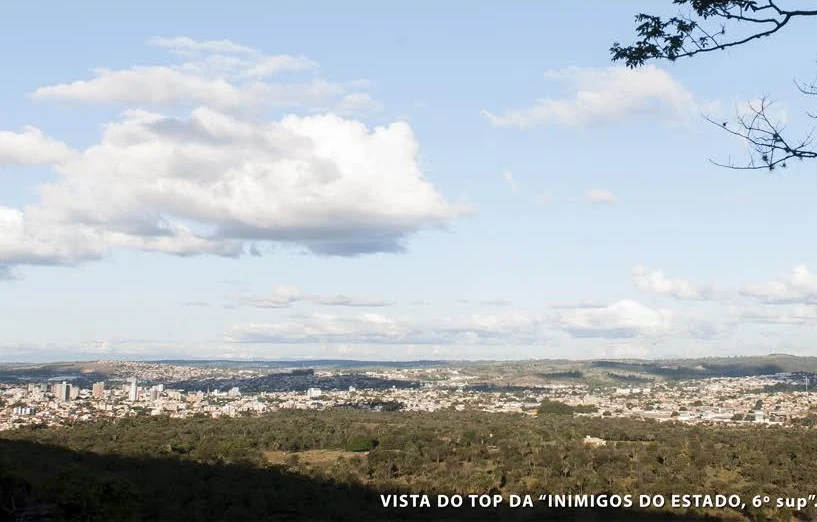 |
    | :--: |
    | *Vista do Top da "Inimigos do Estado" 6º sup* |
- **nome**: Setor de Esquerda
- **uid**: V04iCo3Npy8O8F
- **caminho_imagem_capa**: 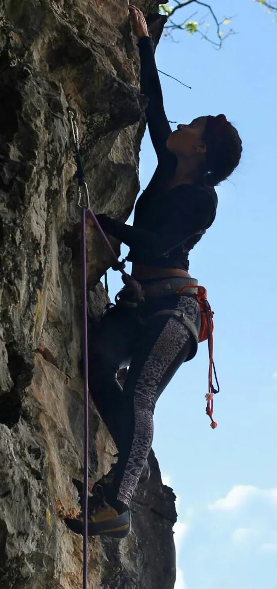
- **mapas**:
  - **[0]**:
    - **caminho_imagem_mapa**: 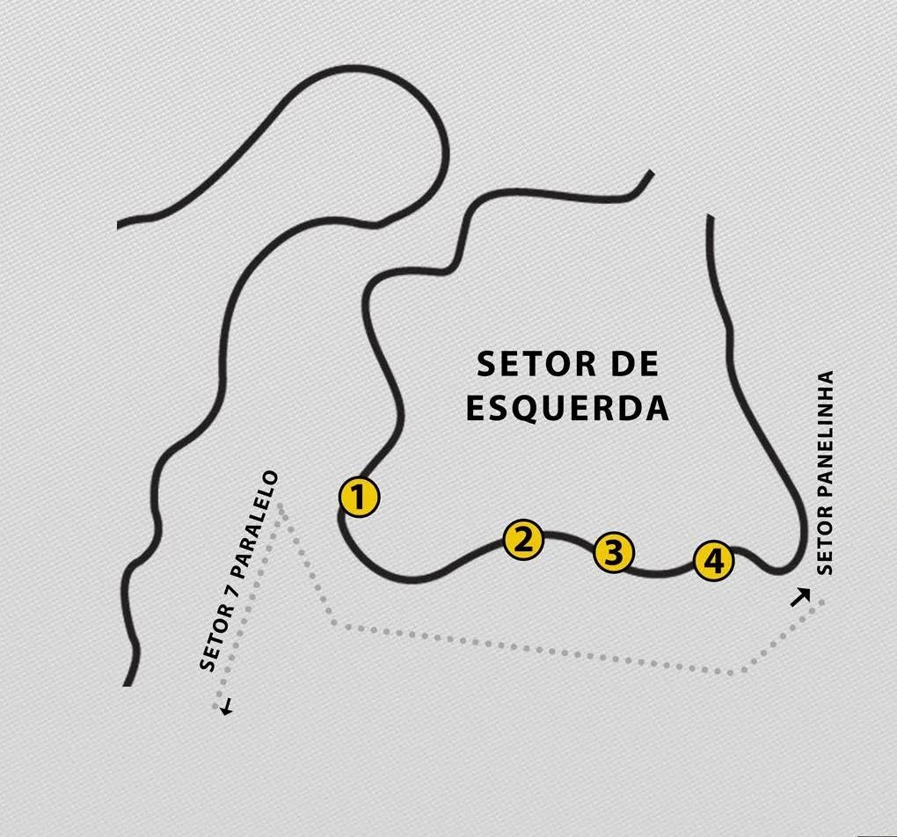
    - **largura_mapa**: 1020
    - **altura_mapa**: 952
    - **pontos_de_interesse**:
      - **[0]**:
        - **id**: w0SkL5sGbskend
        - **uid**: w0SkL5sGbskend
        - **rotulo**: 1
        - **circulo**:
          - **x**: 409
          - **y**: 565
          - **raio**: 22
        - **label**: 1
      - **[1]**:
        - **id**: aKGitOhxoSFExm
        - **uid**: aKGitOhxoSFExm
        - **rotulo**: 2
        - **circulo**:
          - **x**: 595
          - **y**: 614
          - **raio**: 22
        - **label**: 2
      - **[2]**:
        - **id**: JfHzrbWZPMTGpu
        - **uid**: JfHzrbWZPMTGpu
        - **rotulo**: 3
        - **circulo**:
          - **x**: 698
          - **y**: 628
          - **raio**: 22
        - **label**: 3
      - **[3]**:
        - **id**: KCGYr2s75ozt1O
        - **uid**: KCGYr2s75ozt1O
        - **rotulo**: 4
        - **circulo**:
          - **x**: 812
          - **y**: 638
          - **raio**: 22
        - **label**: 4
      - **[4]**:
        - **id**: qRwxiySBPpfqvj
        - **uid**: qRwxiySBPpfqvj
        - **rotulo**: ← SETOR 7 PARALELO
        - **retangulo**:
          - **x**: 269
          - **y**: 648
          - **comprimento**: 36
          - **largura**: 252
          - **angulo_graus_x100**: 1813
        - **label**: ← SETOR 7 PARALELO
      - **[5]**:
        - **id**: g5J8S6sgXTbWdK
        - **uid**: g5J8S6sgXTbWdK
        - **rotulo**: SETOR PANELINHA →
        - **retangulo**:
          - **x**: 937
          - **y**: 537
          - **comprimento**: 34
          - **largura**: 260
        - **label**: SETOR PANELINHA →
    - **referencias**:
      - **[0]**:
        - **alvo_uid**: mHfWj3NIADr4Js
        - **pontos_uids**:
          - w0SkL5sGbskend
        - **escalada**: Milicianos
        - **ids**:
          - w0SkL5sGbskend
      - **[1]**:
        - **alvo_uid**: Iv6LZSwx9Zu7I1
        - **pontos_uids**:
          - aKGitOhxoSFExm
        - **escalada**: Inimigos do Estado
        - **ids**:
          - aKGitOhxoSFExm
      - **[2]**:
        - **alvo_uid**: 0KyvQpBMAGSwjA
        - **pontos_uids**:
          - JfHzrbWZPMTGpu
        - **escalada**: Libera a Moça
        - **ids**:
          - JfHzrbWZPMTGpu
      - **[3]**:
        - **alvo_uid**: 98SB8Sg5vCzbcB
        - **pontos_uids**:
          - KCGYr2s75ozt1O
        - **escalada**: Moça de 100 Anos
        - **ids**:
          - KCGYr2s75ozt1O
      - **[4]**:
        - **alvo_uid**: Ac3qdS73pE0QaJ
        - **pontos_uids**:
          - qRwxiySBPpfqvj
        - **setor**: Setor 7 Paralelo
        - **ids**:
          - qRwxiySBPpfqvj
      - **[5]**:
        - **alvo_uid**: ASLKnxeEws2kaG
        - **pontos_uids**:
          - g5J8S6sgXTbWdK
        - **setor**: Setor Panelinha
        - **ids**:
          - g5J8S6sgXTbWdK
- **escaladas**:
  - **[0]**:
    - **uid**: mHfWj3NIADr4Js
    - **via_esportiva**:
      - **nome**: Milicianos
      - **dificuldade**: BR_5
      - **quantidade_protecoes_intermediarias**: 5
      - **extensao**: 15
  - **[1]**:
    - **uid**: Iv6LZSwx9Zu7I1
    - **via_esportiva**:
      - **descricao**: A primeira via do setor.
      - **nome**: Inimigos do Estado
      - **dificuldade**: BR_6SUP
      - **quantidade_protecoes_intermediarias**: 6
      - **extensao**: 15
  - **[2]**:
    - **uid**: 0KyvQpBMAGSwjA
    - **via_esportiva**:
      - **nome**: Libera a Moça
      - **dificuldade**: BR_6
      - **quantidade_protecoes_intermediarias**: 6
      - **extensao**: 15
  - **[3]**:
    - **uid**: 98SB8Sg5vCzbcB
    - **via_esportiva**:
      - **nome**: Moça de 100 Anos
      - **dificuldade**: BR_5SUP
      - **quantidade_protecoes_intermediarias**: 6
      - **extensao**: 15
- **precomputados**:
  - **total_escaladas**: 4
  - **total_esportivas**: 4

## Parte: setor_panelinha

### Setor (Pico: Sinuosa)

- **descricao**:
    # Setor Panelinha
    
    O "Panelinha" é composto por paredes escuras em formas circulares que lembram
    "panelas" e teve como objetivo principal nas conquistas, aumentar a possibilidade
    para os iniciantes por serem paredes curtas, verticais e com grande variedades de
    agarras mas que exigem movimentos de escalada bem interessantes.
    
    O setor tem ótima ventilação e tem mais sombra durante as horas fortes do sol que
    o setor abaixo (Setor de Esquerda).
    
    É possível dar a volta na pedra e ter acesso ao top das vias, para
    alguns instrutores esta é uma facilidade na aplicação de ensino de procedimentos
    de ancoragem e desmontagem de vias.
    
    Vista panorâmica do pico e da cidade.
    
    | 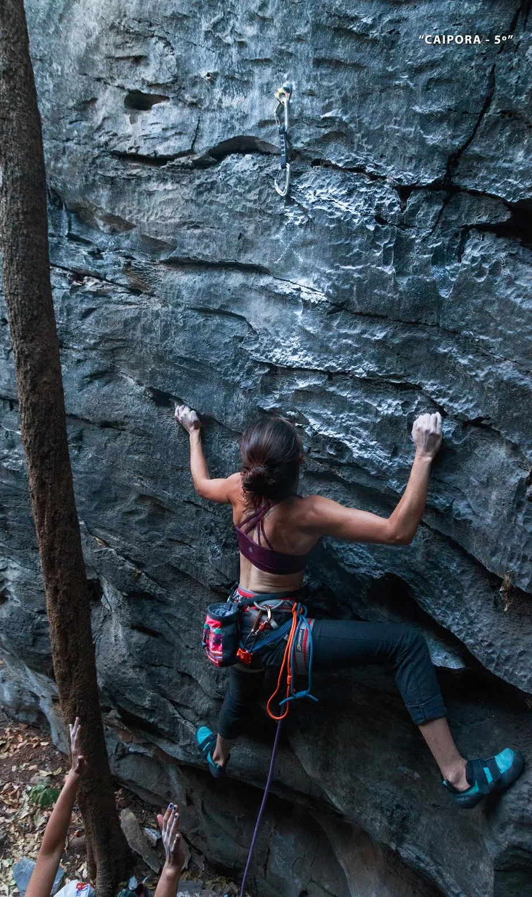 |
    | :--: |
    | *Caipora - 5º* |
    
    |  |
    | :--: |
    | *Vista do Mirante* |
- **nome**: Setor Panelinha
- **uid**: ASLKnxeEws2kaG
- **caminho_imagem_capa**: 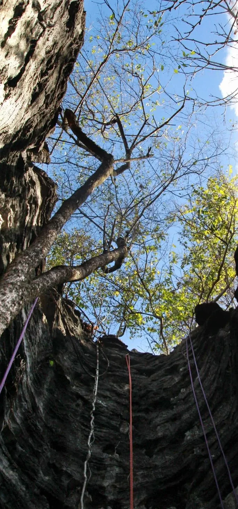
- **mapas**:
  - **[0]**:
    - **caminho_imagem_mapa**: 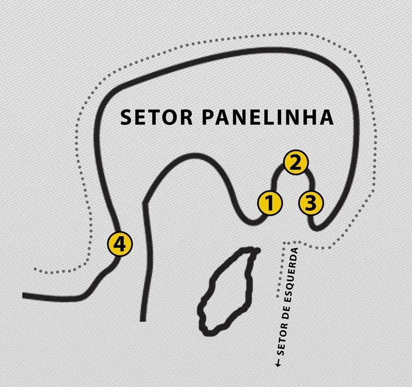
    - **largura_mapa**: 806
    - **altura_mapa**: 757
    - **pontos_de_interesse**:
      - **[0]**:
        - **id**: gC4PbuJ2abf2W7
        - **uid**: gC4PbuJ2abf2W7
        - **rotulo**: 1
        - **circulo**:
          - **x**: 528
          - **y**: 397
          - **raio**: 24
        - **label**: 1
      - **[1]**:
        - **id**: iXkA3ttdNvKkCb
        - **uid**: iXkA3ttdNvKkCb
        - **rotulo**: 2
        - **circulo**:
          - **x**: 579
          - **y**: 317
          - **raio**: 23
        - **label**: 2
      - **[2]**:
        - **id**: z6oYOQS2froavx
        - **uid**: z6oYOQS2froavx
        - **rotulo**: 3
        - **circulo**:
          - **x**: 609
          - **y**: 397
          - **raio**: 23
        - **label**: 3
      - **[3]**:
        - **id**: CbapBCQQQIR78T
        - **uid**: CbapBCQQQIR78T
        - **rotulo**: 4
        - **circulo**:
          - **x**: 235
          - **y**: 477
          - **raio**: 24
        - **label**: 4
      - **[4]**:
        - **id**: SNzc7krLLXThHX
        - **uid**: SNzc7krLLXThHX
        - **rotulo**: ↑ SETOR DE ESQUERDA
        - **retangulo**:
          - **x**: 560
          - **y**: 597
          - **comprimento**: 37
          - **largura**: 248
          - **angulo_graus_x100**: 666
        - **label**: ↑ SETOR DE ESQUERDA
    - **referencias**:
      - **[0]**:
        - **alvo_uid**: 2HGAOAOpgsjyKb
        - **pontos_uids**:
          - gC4PbuJ2abf2W7
        - **escalada**: Caipora
        - **ids**:
          - gC4PbuJ2abf2W7
      - **[1]**:
        - **alvo_uid**: tCgWqjavzFU2ic
        - **pontos_uids**:
          - iXkA3ttdNvKkCb
        - **escalada**: Tap-Flap
        - **ids**:
          - iXkA3ttdNvKkCb
      - **[2]**:
        - **alvo_uid**: FJCKmwye0bWz5d
        - **pontos_uids**:
          - z6oYOQS2froavx
        - **escalada**: Rá-Tim-Bum
        - **ids**:
          - z6oYOQS2froavx
      - **[3]**:
        - **alvo_uid**: b0d7VtmDXqs5X8
        - **pontos_uids**:
          - CbapBCQQQIR78T
        - **escalada**: Corda de Violão
        - **ids**:
          - CbapBCQQQIR78T
      - **[4]**:
        - **alvo_uid**: V04iCo3Npy8O8F
        - **pontos_uids**:
          - SNzc7krLLXThHX
        - **setor**: Setor de Esquerda
        - **ids**:
          - SNzc7krLLXThHX
- **escaladas**:
  - **[0]**:
    - **uid**: 2HGAOAOpgsjyKb
    - **via_esportiva**:
      - **nome**: Caipora
      - **dificuldade**: BR_5
      - **quantidade_protecoes_intermediarias**: 4
  - **[1]**:
    - **uid**: tCgWqjavzFU2ic
    - **via_movel**:
      - **descricao**: Via em móvel.
      - **nome**: Tap-Flap
      - **dificuldade**: BR_4
  - **[2]**:
    - **uid**: FJCKmwye0bWz5d
    - **via_esportiva**:
      - **nome**: Rá-Tim-Bum
      - **dificuldade**: BR_5
      - **quantidade_protecoes_intermediarias**: 5
  - **[3]**:
    - **uid**: b0d7VtmDXqs5X8
    - **via_esportiva**:
      - **nome**: Corda de Violão
      - **dificuldade**: BR_5
      - **quantidade_protecoes_intermediarias**: 4
- **precomputados**:
  - **total_escaladas**: 4
  - **total_esportivas**: 3

## Parte: setor_7_paralelo

### Setor (Pico: Sinuosa)

- **descricao**:
    # Setor 7 Paralelo
    
    Setor com grande concentração de vias, predomínio de vias de sétimo grau,
    com altura média entre 15 e 25 metros.
    
    Vias fortes com possibilidades de escalada
    bem variada, que exigem bom repertório de movimentos e resistência. O início do
    setor é mais amplo e tem bases limpas, mas em direção às escadas que dão acesso
    ao setor "Sentinela" deve-se tomar cuidado para evitar acidentes, pois este trecho
    é bastante íngreme.
    
    Atenção para a base de algumas vias no final do setor.
    
    Também no final do setor, a maioria das vias é indicado sair com a primeira proteção clipada.
    
    | 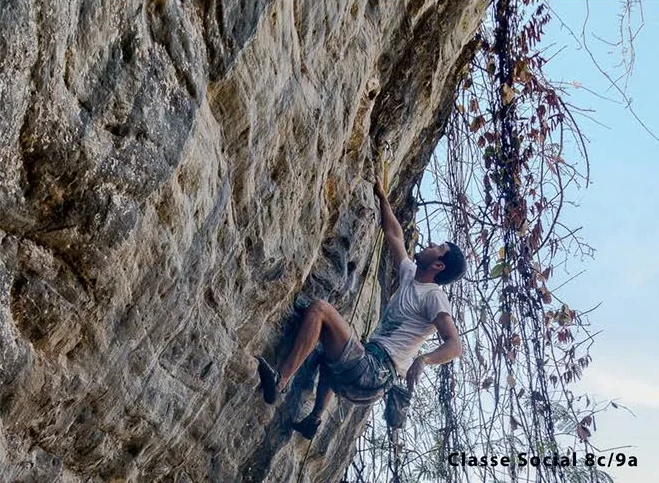 |
    | :--: |
    | *Classe Social 8c/9a* |
    
    |  |
    | :--: |
    | *Até mas amigos 6º sup* |
    
    | 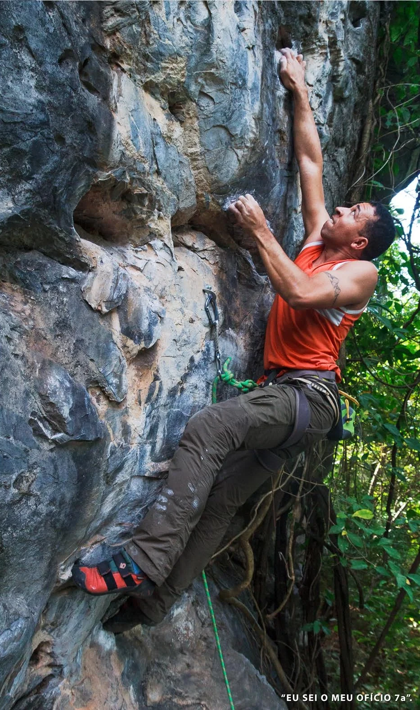 |
    | :--: |
    | *Eu sei o meu ofício 7a* |
    
    |  |
    | :--: |
    | *Mais Fotos* |
- **nome**: Setor 7 Paralelo
- **uid**: Ac3qdS73pE0QaJ
- **caminho_imagem_capa**: 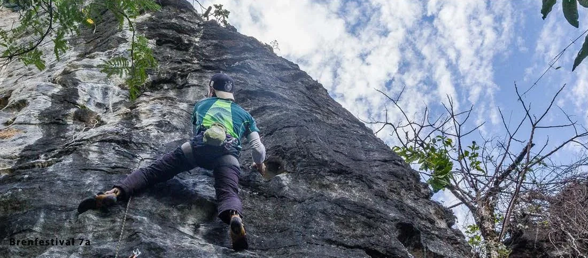
- **mapas**:
  - **[0]**:
    - **caminho_imagem_mapa**: 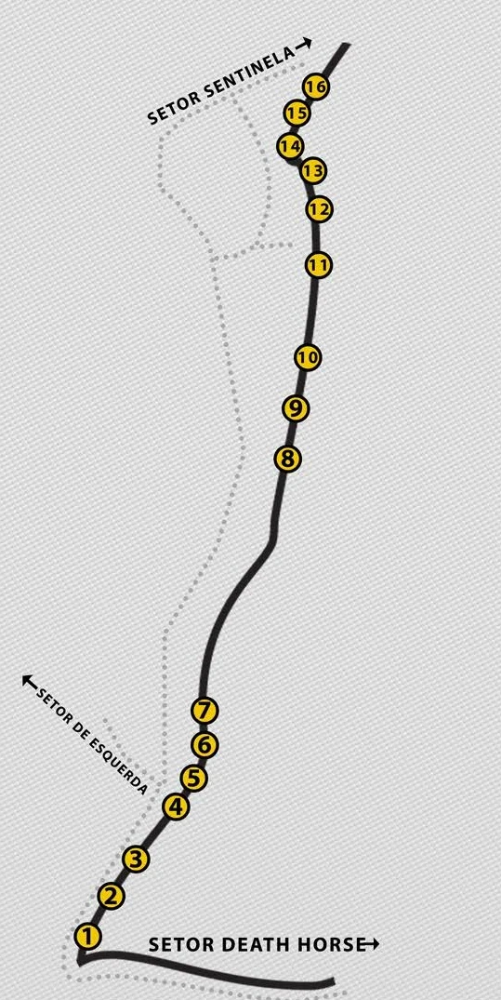
    - **largura_mapa**: 539
    - **altura_mapa**: 1075
    - **pontos_de_interesse**:
      - **[0]**:
        - **id**: RhnH4HyGokyg2Y
        - **uid**: RhnH4HyGokyg2Y
        - **rotulo**: 1
        - **circulo**:
          - **x**: 95
          - **y**: 1007
          - **raio**: 14
        - **label**: 1
      - **[1]**:
        - **id**: MJraTCaTNQ2PD7
        - **uid**: MJraTCaTNQ2PD7
        - **rotulo**: 2
        - **circulo**:
          - **x**: 120
          - **y**: 963
          - **raio**: 14
        - **label**: 2
      - **[2]**:
        - **id**: FNeN4vBT00eLuB
        - **uid**: FNeN4vBT00eLuB
        - **rotulo**: 3
        - **circulo**:
          - **x**: 146
          - **y**: 924
          - **raio**: 14
        - **label**: 3
      - **[3]**:
        - **id**: PgRXN3C41KRiNw
        - **uid**: PgRXN3C41KRiNw
        - **rotulo**: 4
        - **circulo**:
          - **x**: 189
          - **y**: 867
          - **raio**: 14
        - **label**: 4
      - **[4]**:
        - **id**: ax24wHk51Eb8LP
        - **uid**: ax24wHk51Eb8LP
        - **rotulo**: 5
        - **circulo**:
          - **x**: 209
          - **y**: 837
          - **raio**: 14
        - **label**: 5
      - **[5]**:
        - **id**: 5zvn6kUKm0DHNv
        - **uid**: 5zvn6kUKm0DHNv
        - **rotulo**: 6
        - **circulo**:
          - **x**: 220
          - **y**: 801
          - **raio**: 14
        - **label**: 6
      - **[6]**:
        - **id**: EQAqEckXbFYZR0
        - **uid**: EQAqEckXbFYZR0
        - **rotulo**: 7
        - **circulo**:
          - **x**: 220
          - **y**: 764
          - **raio**: 14
        - **label**: 7
      - **[7]**:
        - **id**: 3fB4Y3Qd86phuZ
        - **uid**: 3fB4Y3Qd86phuZ
        - **rotulo**: 8
        - **circulo**:
          - **x**: 310
          - **y**: 493
          - **raio**: 14
        - **label**: 8
      - **[8]**:
        - **id**: T7GUIEya67Om3O
        - **uid**: T7GUIEya67Om3O
        - **rotulo**: 9
        - **circulo**:
          - **x**: 318
          - **y**: 439
          - **raio**: 14
        - **label**: 9
      - **[9]**:
        - **id**: mgPgZoW8BIRxcB
        - **uid**: mgPgZoW8BIRxcB
        - **rotulo**: 10
        - **circulo**:
          - **x**: 331
          - **y**: 384
          - **raio**: 14
        - **label**: 10
      - **[10]**:
        - **id**: om2oL12nMpq5mC
        - **uid**: om2oL12nMpq5mC
        - **rotulo**: 11
        - **circulo**:
          - **x**: 343
          - **y**: 285
          - **raio**: 14
        - **label**: 11
      - **[11]**:
        - **id**: OlgfxQLBpbR7Im
        - **uid**: OlgfxQLBpbR7Im
        - **rotulo**: 12
        - **circulo**:
          - **x**: 344
          - **y**: 225
          - **raio**: 14
        - **label**: 12
      - **[12]**:
        - **id**: RrWO1N11MxYjPO
        - **uid**: RrWO1N11MxYjPO
        - **rotulo**: 13
        - **circulo**:
          - **x**: 337
          - **y**: 183
          - **raio**: 14
        - **label**: 13
      - **[13]**:
        - **id**: 5Jxcp0JvuA8JRG
        - **uid**: 5Jxcp0JvuA8JRG
        - **rotulo**: 14
        - **circulo**:
          - **x**: 312
          - **y**: 157
          - **raio**: 14
        - **label**: 14
      - **[14]**:
        - **id**: qZ41nouuW0A1ZD
        - **uid**: qZ41nouuW0A1ZD
        - **rotulo**: 15
        - **circulo**:
          - **x**: 320
          - **y**: 121
          - **raio**: 14
        - **label**: 15
      - **[15]**:
        - **id**: EcGitfs4E51leF
        - **uid**: EcGitfs4E51leF
        - **rotulo**: 16
        - **circulo**:
          - **x**: 340
          - **y**: 93
          - **raio**: 14
        - **label**: 16
      - **[16]**:
        - **id**: iBVyPpyUf6PcCh
        - **uid**: iBVyPpyUf6PcCh
        - **rotulo**: SETOR DEATH HORSE→
        - **retangulo**:
          - **x**: 282
          - **y**: 1014
          - **comprimento**: 265
          - **largura**: 33
        - **label**: SETOR DEATH HORSE→
      - **[17]**:
        - **id**: EVhi4hIegm5QW6
        - **uid**: EVhi4hIegm5QW6
        - **rotulo**: SETOR SENTINELA →
        - **retangulo**:
          - **x**: 246
          - **y**: 86
          - **comprimento**: 203
          - **largura**: 24
          - **angulo_graus_x100**: -2606
        - **label**: SETOR SENTINELA →
      - **[18]**:
        - **id**: 7BDniPBfg0bltR
        - **uid**: 7BDniPBfg0bltR
        - **rotulo**: ← SETOR DE ESQUERDA
        - **retangulo**:
          - **x**: 90
          - **y**: 786
          - **comprimento**: 195
          - **largura**: 28
          - **angulo_graus_x100**: 4342
        - **label**: ← SETOR DE ESQUERDA
    - **referencias**:
      - **[0]**:
        - **alvo_uid**: uraCAUk9vKK6cm
        - **pontos_uids**:
          - RhnH4HyGokyg2Y
        - **escalada**: Eu Sei Meu Ofício
        - **ids**:
          - RhnH4HyGokyg2Y
      - **[1]**:
        - **alvo_uid**: 4WM76LuBPyqgGH
        - **pontos_uids**:
          - MJraTCaTNQ2PD7
        - **escalada**: Formação de Ataque
        - **ids**:
          - MJraTCaTNQ2PD7
      - **[2]**:
        - **alvo_uid**: wxJtC0k3EiiQCh
        - **pontos_uids**:
          - FNeN4vBT00eLuB
        - **escalada**: Guia Mirim
        - **ids**:
          - FNeN4vBT00eLuB
      - **[3]**:
        - **alvo_uid**: 4qvY3PuRCP7hPa
        - **pontos_uids**:
          - PgRXN3C41KRiNw
        - **escalada**: Mão de Obra
        - **ids**:
          - PgRXN3C41KRiNw
      - **[4]**:
        - **alvo_uid**: wmvwfYAvZPvQHx
        - **pontos_uids**:
          - ax24wHk51Eb8LP
        - **escalada**: Coice de Mula
        - **ids**:
          - ax24wHk51Eb8LP
      - **[5]**:
        - **alvo_uid**: ja8R6XqV1Gqvnb
        - **pontos_uids**:
          - 5zvn6kUKm0DHNv
        - **escalada**: Bebê à Bordo
        - **ids**:
          - 5zvn6kUKm0DHNv
      - **[6]**:
        - **alvo_uid**: Y0HfMhKKS4XTWG
        - **pontos_uids**:
          - EQAqEckXbFYZR0
        - **escalada**: Micuins Me Mordam
        - **ids**:
          - EQAqEckXbFYZR0
      - **[7]**:
        - **alvo_uid**: ItmGtbO9VJBuQj
        - **pontos_uids**:
          - 3fB4Y3Qd86phuZ
        - **escalada**: Classe Social
        - **ids**:
          - 3fB4Y3Qd86phuZ
      - **[8]**:
        - **alvo_uid**: fyfKwpjia4v9mZ
        - **pontos_uids**:
          - T7GUIEya67Om3O
        - **escalada**: Fobia Social
        - **ids**:
          - T7GUIEya67Om3O
      - **[9]**:
        - **alvo_uid**: WzxHHWWHXEWeGH
        - **pontos_uids**:
          - mgPgZoW8BIRxcB
        - **escalada**: Vaca Berrante
        - **ids**:
          - mgPgZoW8BIRxcB
      - **[10]**:
        - **alvo_uid**: l9bk6RtODaWr8Z
        - **pontos_uids**:
          - om2oL12nMpq5mC
        - **escalada**: Até Mas Amigos
        - **ids**:
          - om2oL12nMpq5mC
      - **[11]**:
        - **alvo_uid**: d5PhP6y1WGq6Wn
        - **pontos_uids**:
          - OlgfxQLBpbR7Im
        - **escalada**: Inconfidentes
        - **ids**:
          - OlgfxQLBpbR7Im
      - **[12]**:
        - **alvo_uid**: URJ73aClt1JVOB
        - **pontos_uids**:
          - RrWO1N11MxYjPO
        - **escalada**: Brenfestival
        - **ids**:
          - RrWO1N11MxYjPO
      - **[13]**:
        - **alvo_uid**: z15r9Lx9fyk8Sj
        - **pontos_uids**:
          - 5Jxcp0JvuA8JRG
        - **escalada**: Sociedade dos Insetos
        - **ids**:
          - 5Jxcp0JvuA8JRG
      - **[14]**:
        - **alvo_uid**: VkEbqfsaD8EZmT
        - **pontos_uids**:
          - qZ41nouuW0A1ZD
        - **escalada**: Dilemas do Futuro
        - **ids**:
          - qZ41nouuW0A1ZD
      - **[15]**:
        - **alvo_uid**: b0mOHRT5osLcZq
        - **pontos_uids**:
          - EcGitfs4E51leF
        - **escalada**: Plano Paralelo
        - **ids**:
          - EcGitfs4E51leF
      - **[16]**:
        - **alvo_uid**: YDntm65nIZs31H
        - **pontos_uids**:
          - iBVyPpyUf6PcCh
        - **setor**: Setor Death Horse
        - **ids**:
          - iBVyPpyUf6PcCh
      - **[17]**:
        - **alvo_uid**: V04iCo3Npy8O8F
        - **pontos_uids**:
          - 7BDniPBfg0bltR
        - **setor**: Setor de Esquerda
        - **ids**:
          - 7BDniPBfg0bltR
      - **[18]**:
        - **alvo_uid**: EaM54aq9IJD36r
        - **pontos_uids**:
          - EVhi4hIegm5QW6
        - **setor**: Setor Sentinela
        - **ids**:
          - EVhi4hIegm5QW6
- **escaladas**:
  - **[0]**:
    - **uid**: uraCAUk9vKK6cm
    - **via_esportiva**:
      - **nome**: Eu Sei Meu Ofício
      - **dificuldade**: BR_7B
      - **quantidade_protecoes_intermediarias**: 6
      - **extensao**: 25
  - **[1]**:
    - **uid**: 4WM76LuBPyqgGH
    - **via_esportiva**:
      - **nome**: Formação de Ataque
      - **dificuldade**: BR_7A
      - **quantidade_protecoes_intermediarias**: 7
      - **extensao**: 25
  - **[2]**:
    - **uid**: wxJtC0k3EiiQCh
    - **via_esportiva**:
      - **nome**: Guia Mirim
      - **dificuldade**: BR_7C
      - **quantidade_protecoes_intermediarias**: 7
      - **extensao**: 25
  - **[3]**:
    - **uid**: 4qvY3PuRCP7hPa
    - **via_esportiva**:
      - **nome**: Mão de Obra
      - **dificuldade**: BR_6SUP
      - **quantidade_protecoes_intermediarias**: 6
      - **extensao**: 20
  - **[4]**:
    - **uid**: wmvwfYAvZPvQHx
    - **via_esportiva**:
      - **nome**: Coice de Mula
      - **dificuldade**: BR_7A
      - **quantidade_protecoes_intermediarias**: 6
      - **extensao**: 20
  - **[5]**:
    - **uid**: ja8R6XqV1Gqvnb
    - **via_esportiva**:
      - **nome**: Bebê à Bordo
      - **dificuldade**: BR_7A
      - **quantidade_protecoes_intermediarias**: 8
      - **extensao**: 20
  - **[6]**:
    - **uid**: Y0HfMhKKS4XTWG
    - **via_movel**:
      - **nome**: Micuins Me Mordam
      - **dificuldade**: BR_8A
      - **protecoes_moveis**: Equipo móvel. 1 chapa + 2 top.
      - **extensao**: 20
  - **[7]**:
    - **uid**: ItmGtbO9VJBuQj
    - **via_esportiva**:
      - **nome**: Classe Social
      - **dificuldade**: BR_8C_BARRA_9A
      - **quantidade_protecoes_intermediarias**: 10
      - **extensao**: 20
  - **[8]**:
    - **uid**: fyfKwpjia4v9mZ
    - **via_esportiva**:
      - **descricao**: Projeto (Sem F/A).
      - **nome**: Fobia Social
      - **quantidade_protecoes_intermediarias**: 6
  - **[9]**:
    - **uid**: WzxHHWWHXEWeGH
    - **via_esportiva**:
      - **descricao**: Projeto (Sem F/A).
      - **nome**: Vaca Berrante
      - **quantidade_protecoes_intermediarias**: 6
  - **[10]**:
    - **uid**: l9bk6RtODaWr8Z
    - **via_esportiva**:
      - **nome**: Até Mas Amigos
      - **dificuldade**: BR_7A
      - **quantidade_protecoes_intermediarias**: 6
      - **extensao**: 15
  - **[11]**:
    - **uid**: d5PhP6y1WGq6Wn
    - **via_esportiva**:
      - **nome**: Inconfidentes
      - **dificuldade**: BR_6
      - **quantidade_protecoes_intermediarias**: 6
      - **extensao**: 15
  - **[12]**:
    - **uid**: URJ73aClt1JVOB
    - **via_esportiva**:
      - **nome**: Brenfestival
      - **dificuldade**: BR_7A
      - **quantidade_protecoes_intermediarias**: 9
      - **extensao**: 15
  - **[13]**:
    - **uid**: z15r9Lx9fyk8Sj
    - **via_esportiva**:
      - **nome**: Sociedade dos Insetos
      - **dificuldade**: BR_7C
      - **quantidade_protecoes_intermediarias**: 8
      - **extensao**: 15
  - **[14]**:
    - **uid**: VkEbqfsaD8EZmT
    - **via_esportiva**:
      - **nome**: Dilemas do Futuro
      - **dificuldade**: BR_7B
      - **quantidade_protecoes_intermediarias**: 8
      - **extensao**: 15
  - **[15]**:
    - **uid**: b0mOHRT5osLcZq
    - **via_esportiva**:
      - **nome**: Plano Paralelo
      - **dificuldade**: BR_7A
      - **quantidade_protecoes_intermediarias**: 7
      - **extensao**: 15
- **precomputados**:
  - **total_escaladas**: 16
  - **total_esportivas**: 15

## Parte: setor_sentinela

### Setor (Pico: Sinuosa)

- **descricao**:
    # Setor Sentinela
    
    Setor um pouco mais afastado, localizado após subir as escadas do setor
    "7 Paralelo". Setor com grande incidência do sol entre 11:00 e 15:00 hrs.
    
    Do setor é possível acessar a passagem para o mirante do cume da Sinuosa.
    
    Parede bonita, de
    cor amarelada, com excelente variação de agarras e característica esportiva. Apesar
    de serem mais baixas, as vias deste setor são exigentes devido a leve negatividade
    da pedra.
    
    |  |
    | :--: |
    | *Foto 2* |
    
    |  |
    | :--: |
    | *Foto 3* |
    
    | 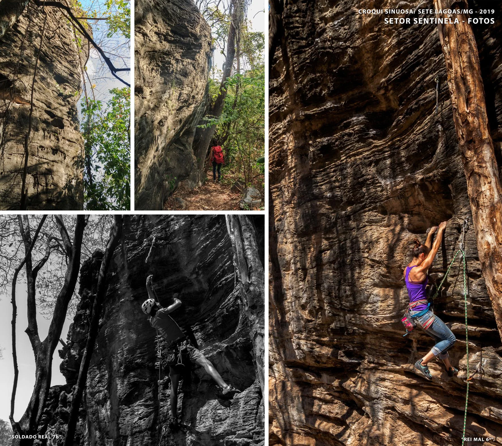 |
    | :--: |
    | *Mais fotos* |
- **nome**: Setor Sentinela
- **uid**: EaM54aq9IJD36r
- **caminho_imagem_capa**: 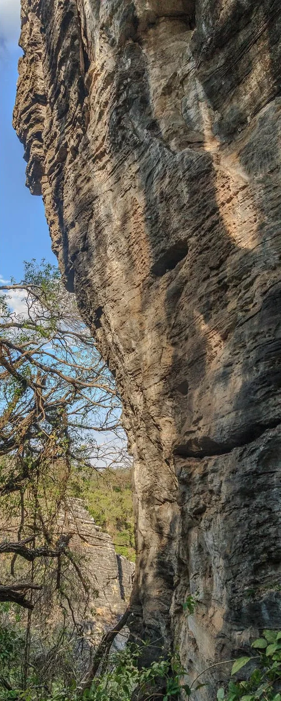
- **mapas**:
  - **[0]**:
    - **caminho_imagem_mapa**: 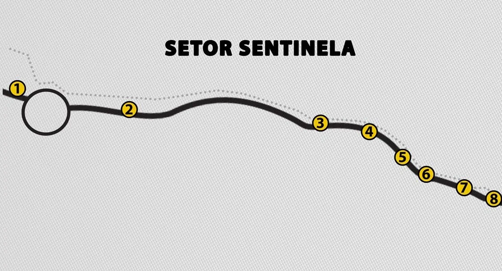
    - **largura_mapa**: 1125
    - **altura_mapa**: 608
    - **pontos_de_interesse**:
      - **[0]**:
        - **id**: MANHE0WzYLO7W0
        - **uid**: MANHE0WzYLO7W0
        - **rotulo**: 1
        - **circulo**:
          - **x**: 39
          - **y**: 198
          - **raio**: 18
        - **label**: 1
      - **[1]**:
        - **id**: nbxfPtGAIj3sGB
        - **uid**: nbxfPtGAIj3sGB
        - **rotulo**: 2
        - **circulo**:
          - **x**: 290
          - **y**: 246
          - **raio**: 18
        - **label**: 2
      - **[2]**:
        - **id**: DWLxIHInI4ArAp
        - **uid**: DWLxIHInI4ArAp
        - **rotulo**: 3
        - **circulo**:
          - **x**: 718
          - **y**: 276
          - **raio**: 18
        - **label**: 3
      - **[3]**:
        - **id**: yVx5PoAyLJZNWu
        - **uid**: yVx5PoAyLJZNWu
        - **rotulo**: 4
        - **circulo**:
          - **x**: 828
          - **y**: 295
          - **raio**: 18
        - **label**: 4
      - **[4]**:
        - **id**: bRbIvmWEaUGhFR
        - **uid**: bRbIvmWEaUGhFR
        - **rotulo**: 5
        - **circulo**:
          - **x**: 903
          - **y**: 352
          - **raio**: 18
        - **label**: 5
      - **[5]**:
        - **id**: 0XCwTz5VvrIv8I
        - **uid**: 0XCwTz5VvrIv8I
        - **rotulo**: 6
        - **circulo**:
          - **x**: 955
          - **y**: 391
          - **raio**: 18
        - **label**: 6
      - **[6]**:
        - **id**: Gf1Cs1Gd6Q3N1o
        - **uid**: Gf1Cs1Gd6Q3N1o
        - **rotulo**: 7
        - **circulo**:
          - **x**: 1040
          - **y**: 421
          - **raio**: 18
        - **label**: 7
      - **[7]**:
        - **id**: K5BiMGNJ59qiZj
        - **uid**: K5BiMGNJ59qiZj
        - **rotulo**: 8
        - **circulo**:
          - **x**: 1107
          - **y**: 446
          - **raio**: 18
        - **label**: 8
    - **referencias**:
      - **[0]**:
        - **alvo_uid**: 11SkoWxjy0dJmt
        - **pontos_uids**:
          - MANHE0WzYLO7W0
        - **escalada**: Brenfoterapia
        - **ids**:
          - MANHE0WzYLO7W0
      - **[1]**:
        - **alvo_uid**: nFV31uL34L4EER
        - **pontos_uids**:
          - nbxfPtGAIj3sGB
        - **escalada**: Na Hora Certa
        - **ids**:
          - nbxfPtGAIj3sGB
      - **[2]**:
        - **alvo_uid**: V3fkKx23nX3wbu
        - **pontos_uids**:
          - DWLxIHInI4ArAp
        - **escalada**: Nós Contra o Resto
        - **ids**:
          - DWLxIHInI4ArAp
      - **[3]**:
        - **alvo_uid**: z6UVFd9JnC81EL
        - **pontos_uids**:
          - yVx5PoAyLJZNWu
        - **escalada**: Divisa dos Reinos
        - **ids**:
          - yVx5PoAyLJZNWu
      - **[4]**:
        - **alvo_uid**: jBVI7lWiyafer9
        - **pontos_uids**:
          - bRbIvmWEaUGhFR
        - **escalada**: Rei Mal
        - **ids**:
          - bRbIvmWEaUGhFR
      - **[5]**:
        - **alvo_uid**: 9mty5VWIk9PAtr
        - **pontos_uids**:
          - 0XCwTz5VvrIv8I
        - **escalada**: Soldado Real
        - **ids**:
          - 0XCwTz5VvrIv8I
      - **[6]**:
        - **alvo_uid**: pxQeLIFsTrZDbO
        - **pontos_uids**:
          - Gf1Cs1Gd6Q3N1o
        - **escalada**: Nosso Rei
        - **ids**:
          - Gf1Cs1Gd6Q3N1o
      - **[7]**:
        - **alvo_uid**: MS2eRZzzrBzAxC
        - **pontos_uids**:
          - K5BiMGNJ59qiZj
        - **escalada**: Vitamina M
        - **ids**:
          - K5BiMGNJ59qiZj
- **escaladas**:
  - **[0]**:
    - **uid**: 11SkoWxjy0dJmt
    - **via_movel**:
      - **nome**: Brenfoterapia
      - **dificuldade**: BR_5SUP
      - **protecoes_moveis**: Móvel. Rapel da chapa com cordelete.
  - **[1]**:
    - **uid**: nFV31uL34L4EER
    - **via_esportiva**:
      - **nome**: Na Hora Certa
      - **dificuldade**: BR_4
      - **quantidade_protecoes_intermediarias**: 4
  - **[2]**:
    - **uid**: V3fkKx23nX3wbu
    - **via_esportiva**:
      - **nome**: Nós Contra o Resto
      - **dificuldade**: BR_6SUP
      - **quantidade_protecoes_intermediarias**: 4
  - **[3]**:
    - **uid**: z6UVFd9JnC81EL
    - **via_esportiva**:
      - **nome**: Divisa dos Reinos
      - **dificuldade**: BR_6
      - **quantidade_protecoes_intermediarias**: 6
  - **[4]**:
    - **uid**: jBVI7lWiyafer9
    - **via_esportiva**:
      - **nome**: Rei Mal
      - **dificuldade**: BR_6
      - **quantidade_protecoes_intermediarias**: 5
  - **[5]**:
    - **uid**: 9mty5VWIk9PAtr
    - **via_esportiva**:
      - **nome**: Soldado Real
      - **dificuldade**: BR_7B
      - **quantidade_protecoes_intermediarias**: 6
  - **[6]**:
    - **uid**: pxQeLIFsTrZDbO
    - **via_esportiva**:
      - **nome**: Nosso Rei
      - **dificuldade**: BR_7A
      - **quantidade_protecoes_intermediarias**: 6
  - **[7]**:
    - **uid**: MS2eRZzzrBzAxC
    - **via_movel**:
      - **nome**: Vitamina M
      - **dificuldade**: BR_5
      - **protecoes_moveis**: Móvel. Rapel da chapa com cordelete.
- **precomputados**:
  - **total_escaladas**: 8
  - **total_esportivas**: 6

## Parte: setor_death_horse

### Setor (Pico: Sinuosa)

- **descricao**:
    # Setor Death Horse
    
    Setor que fica logo na entrada. Parede extensa, alta e com trechos muito
    negativos. A beleza da formação da parede impressiona pelas cores, formas curiosas
    e pela magnitude do teto. A base do setor é limpa, ampla e comporta grupos maiores,
    também é ótimo para colocação de redes por estar na sombra durante o dia inteiro,
    local bem arejado.
    
    Na chuva é possível escalar algumas vias. Setor ainda pouco explorado,
    apesar do enorme potencial para vias de alta graduação.
    
    |  |
    | :--: |
    | *Sabbath Blood Sabbath 9a* |
    
    | 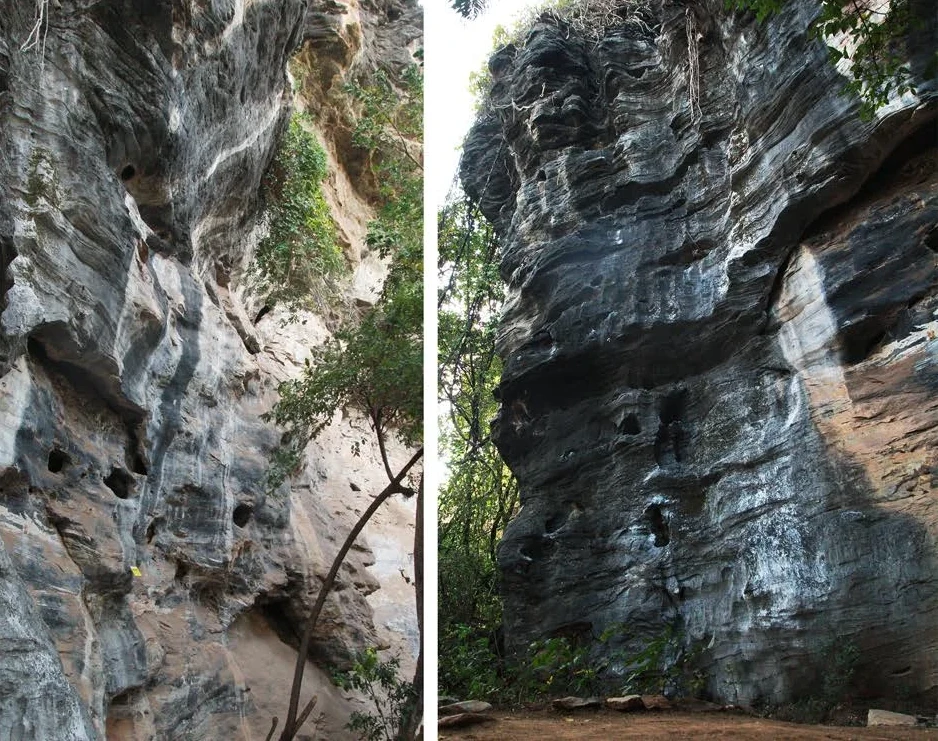 |
    | :--: |
    | *Mais fotos* |
- **nome**: Setor Death Horse
- **uid**: YDntm65nIZs31H
- **caminho_imagem_capa**: 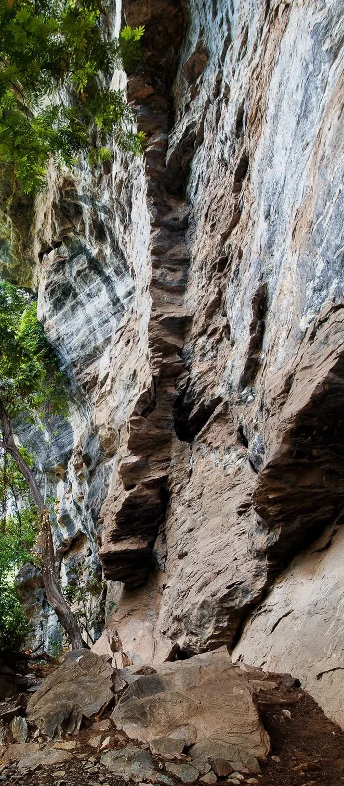
- **mapas**:
  - **[0]**:
    - **caminho_imagem_mapa**: 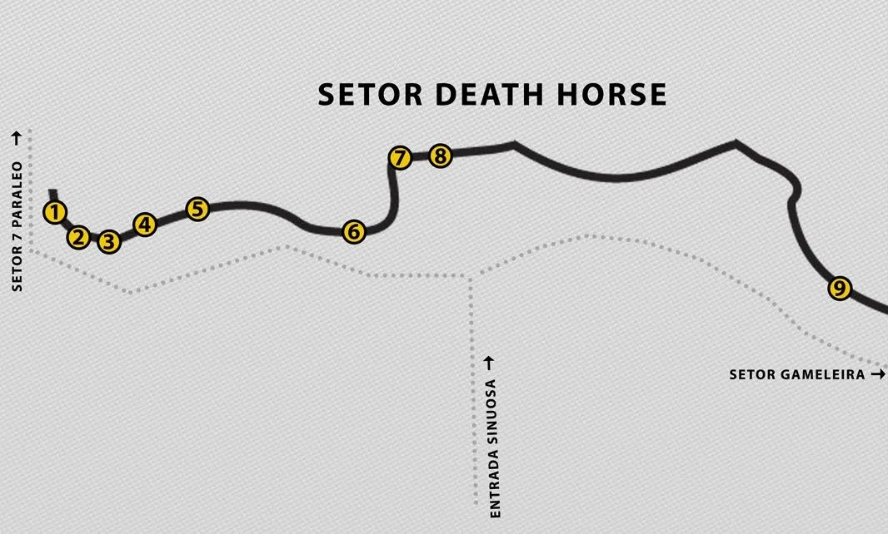
    - **largura_mapa**: 1066
    - **altura_mapa**: 642
    - **pontos_de_interesse**:
      - **[0]**:
        - **id**: y4ApcVMHMiYlht
        - **uid**: y4ApcVMHMiYlht
        - **rotulo**: 1
        - **circulo**:
          - **x**: 66
          - **y**: 255
          - **raio**: 13
        - **label**: 1
      - **[1]**:
        - **id**: 4cu6BCpZfDFxPG
        - **uid**: 4cu6BCpZfDFxPG
        - **rotulo**: 2
        - **circulo**:
          - **x**: 94
          - **y**: 286
          - **raio**: 13
        - **label**: 2
      - **[2]**:
        - **id**: IdGbo7P0ctPlqc
        - **uid**: IdGbo7P0ctPlqc
        - **rotulo**: 3
        - **circulo**:
          - **x**: 131
          - **y**: 291
          - **raio**: 14
        - **label**: 3
      - **[3]**:
        - **id**: 6DGo7re5kZzCIN
        - **uid**: 6DGo7re5kZzCIN
        - **rotulo**: 4
        - **circulo**:
          - **x**: 174
          - **y**: 270
          - **raio**: 14
        - **label**: 4
      - **[4]**:
        - **id**: Q2L0A3Lq1ZIsMl
        - **uid**: Q2L0A3Lq1ZIsMl
        - **rotulo**: 5
        - **circulo**:
          - **x**: 238
          - **y**: 252
          - **raio**: 14
        - **label**: 5
      - **[5]**:
        - **id**: mOoWcdLmuwxPLL
        - **uid**: mOoWcdLmuwxPLL
        - **rotulo**: 6
        - **circulo**:
          - **x**: 425
          - **y**: 279
          - **raio**: 14
        - **label**: 6
      - **[6]**:
        - **id**: zvt7dlNEtz5C6J
        - **uid**: zvt7dlNEtz5C6J
        - **rotulo**: 7
        - **circulo**:
          - **x**: 480
          - **y**: 189
          - **raio**: 14
        - **label**: 7
      - **[7]**:
        - **id**: U9WLbiA7AC06CT
        - **uid**: U9WLbiA7AC06CT
        - **rotulo**: 8
        - **circulo**:
          - **x**: 529
          - **y**: 187
          - **raio**: 14
        - **label**: 8
      - **[8]**:
        - **id**: 39lU4TjrNJLuFz
        - **uid**: 39lU4TjrNJLuFz
        - **rotulo**: 9
        - **circulo**:
          - **x**: 1008
          - **y**: 347
          - **raio**: 14
        - **label**: 9
      - **[9]**:
        - **id**: 5hm1ZRkPZ8qWdz
        - **uid**: 5hm1ZRkPZ8qWdz
        - **rotulo**: ↑ SETOR 7 PARALELO
        - **retangulo**:
          - **x**: 20
          - **y**: 254
          - **comprimento**: 26
          - **largura**: 211
        - **label**: ↑ SETOR 7 PARALELO
      - **[10]**:
        - **id**: Oge0fm7uumdZ2J
        - **uid**: Oge0fm7uumdZ2J
        - **rotulo**: ENTRADA SINUOSA ↑
        - **retangulo**:
          - **x**: 592
          - **y**: 526
          - **comprimento**: 30
          - **largura**: 207
          - **angulo_graus_x100**: -215
        - **label**: ENTRADA SINUOSA ↑
      - **[11]**:
        - **id**: EGnoWLV0KliMsx
        - **uid**: EGnoWLV0KliMsx
        - **rotulo**: SETOR GAMELEIRA →
        - **retangulo**:
          - **x**: 968
          - **y**: 450
          - **comprimento**: 193
          - **largura**: 28
        - **label**: SETOR GAMELEIRA →
    - **referencias**:
      - **[0]**:
        - **alvo_uid**: YP56Axu8MBB4GS
        - **pontos_uids**:
          - y4ApcVMHMiYlht
        - **escalada**: Mary Jane
        - **ids**:
          - y4ApcVMHMiYlht
      - **[1]**:
        - **alvo_uid**: gCrlm3Dqm6L4x3
        - **pontos_uids**:
          - 4cu6BCpZfDFxPG
        - **escalada**: Nhen-hen-hen
        - **ids**:
          - 4cu6BCpZfDFxPG
      - **[2]**:
        - **alvo_uid**: G7LbzfLMVLPoyk
        - **pontos_uids**:
          - IdGbo7P0ctPlqc
        - **escalada**: Oleoduto
        - **ids**:
          - IdGbo7P0ctPlqc
      - **[3]**:
        - **alvo_uid**: dH4LXtWZx6qini
        - **pontos_uids**:
          - 6DGo7re5kZzCIN
        - **escalada**: Território Demarcado
        - **ids**:
          - 6DGo7re5kZzCIN
      - **[4]**:
        - **alvo_uid**: sBwvh9i7PSOnXZ
        - **pontos_uids**:
          - Q2L0A3Lq1ZIsMl
        - **escalada**: Abaeta
        - **ids**:
          - Q2L0A3Lq1ZIsMl
      - **[5]**:
        - **alvo_uid**: EuvGinSxRRc3MY
        - **pontos_uids**:
          - mOoWcdLmuwxPLL
        - **escalada**: Sinuosa
        - **ids**:
          - mOoWcdLmuwxPLL
      - **[6]**:
        - **alvo_uid**: ue6GuOQj38yrRg
        - **pontos_uids**:
          - zvt7dlNEtz5C6J
        - **escalada**: Sabbath Blood Sabbath/Carrapatos
        - **ids**:
          - zvt7dlNEtz5C6J
      - **[7]**:
        - **alvo_uid**: 2yZzlcjhvMC3ZH
        - **pontos_uids**:
          - U9WLbiA7AC06CT
        - **escalada**: Secos e Molhados
        - **ids**:
          - U9WLbiA7AC06CT
      - **[8]**:
        - **alvo_uid**: UAZlMeVtpCroSZ
        - **pontos_uids**:
          - 39lU4TjrNJLuFz
        - **escalada**: Araticum
        - **ids**:
          - 39lU4TjrNJLuFz
      - **[9]**:
        - **alvo_uid**: Ac3qdS73pE0QaJ
        - **pontos_uids**:
          - 5hm1ZRkPZ8qWdz
        - **setor**: Setor 7 Paralelo
        - **ids**:
          - 5hm1ZRkPZ8qWdz
      - **[10]**:
        - **alvo_uid**: TU7ksiizSIZqH4
        - **pontos_uids**:
          - EGnoWLV0KliMsx
        - **setor**: Setor Gameleira
        - **ids**:
          - EGnoWLV0KliMsx
- **escaladas**:
  - **[0]**:
    - **uid**: YP56Axu8MBB4GS
    - **via_esportiva**:
      - **nome**: Mary Jane
      - **dificuldade**: BR_7A
      - **quantidade_protecoes_intermediarias**: 7
  - **[1]**:
    - **uid**: gCrlm3Dqm6L4x3
    - **via_esportiva**:
      - **nome**: Nhen-hen-hen
      - **dificuldade**: BR_6SUP
      - **quantidade_protecoes_intermediarias**: 6
  - **[2]**:
    - **uid**: G7LbzfLMVLPoyk
    - **via_esportiva**:
      - **nome**: Oleoduto
      - **dificuldade**: BR_6SUP
      - **quantidade_protecoes_intermediarias**: 5
  - **[3]**:
    - **uid**: dH4LXtWZx6qini
    - **via_esportiva**:
      - **nome**: Território Demarcado
      - **dificuldade**: BR_7B
      - **quantidade_protecoes_intermediarias**: 7
  - **[4]**:
    - **uid**: sBwvh9i7PSOnXZ
    - **via_esportiva**:
      - **descricao**: Projeto.
      - **nome**: Abaeta
  - **[5]**:
    - **uid**: EuvGinSxRRc3MY
    - **via_esportiva**:
      - **descricao**: Projeto (Sem F/A).
      - **nome**: Sinuosa
      - **quantidade_protecoes_intermediarias**: 20
  - **[6]**:
    - **uid**: ue6GuOQj38yrRg
    - **via_esportiva**:
      - **nome**: Sabbath Blood Sabbath/Carrapatos
      - **dificuldade**: BR_9A
      - **quantidade_protecoes_intermediarias**: 16
  - **[7]**:
    - **uid**: 2yZzlcjhvMC3ZH
    - **via_esportiva**:
      - **nome**: Secos e Molhados
      - **dificuldade**: BR_7B
      - **quantidade_protecoes_intermediarias**: 6
  - **[8]**:
    - **uid**: UAZlMeVtpCroSZ
    - **via_esportiva**:
      - **descricao**: Projeto (Sem F/A).
      - **nome**: Araticum
      - **quantidade_protecoes_intermediarias**: 14
- **precomputados**:
  - **total_escaladas**: 9
  - **total_esportivas**: 9

## Parte: setor_gameleira

### Setor (Pico: Sinuosa)

- **descricao**:
    # Setor Gameleira
    
    Conta com poucas vias e mesmo assim abriga um dos maiores desafios do pico
    até o momento, a "Sou Fria 9a". Via em uma aresta muito negativa, de encaixe e técnica.
    Impressiona pela beleza da linha e pelo crux que é uma problema de boulder especulado
    em V4/5.
    
    A via "Mordida de Égua 5º" é muito repetida por iniciantes e faz parte
    das vias mais elogiadas da Sinuosa.
    
    |  |
    | :--: |
    | *Sou Fria 9a* |
    
    |  |
    | :--: |
    | *Sou Fria 9a Foto 2* |
- **nome**: Setor Gameleira
- **uid**: TU7ksiizSIZqH4
- **caminho_imagem_capa**: 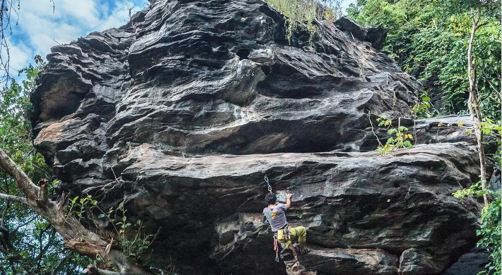
- **mapas**:
  - **[0]**:
    - **caminho_imagem_mapa**: 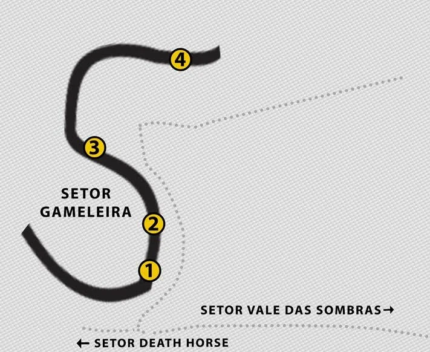
    - **largura_mapa**: 711
    - **altura_mapa**: 582
    - **pontos_de_interesse**:
      - **[0]**:
        - **id**: zpvDRd1r3y2MNE
        - **uid**: zpvDRd1r3y2MNE
        - **rotulo**: 1
        - **circulo**:
          - **x**: 248
          - **y**: 447
          - **raio**: 17
        - **label**: 1
      - **[1]**:
        - **id**: g9yx6zoR5Jew2A
        - **uid**: g9yx6zoR5Jew2A
        - **rotulo**: 2
        - **circulo**:
          - **x**: 254
          - **y**: 370
          - **raio**: 17
        - **label**: 2
      - **[2]**:
        - **id**: dczqywvgxUfDb6
        - **uid**: dczqywvgxUfDb6
        - **rotulo**: 3
        - **circulo**:
          - **x**: 157
          - **y**: 244
          - **raio**: 17
        - **label**: 3
      - **[3]**:
        - **id**: SxWDOrg8c5Fwis
        - **uid**: SxWDOrg8c5Fwis
        - **rotulo**: 4
        - **circulo**:
          - **x**: 299
          - **y**: 99
          - **raio**: 17
        - **label**: 4
      - **[4]**:
        - **id**: VyUTgXbJbUkzcZ
        - **uid**: VyUTgXbJbUkzcZ
        - **rotulo**: SETOR VALE DAS SOMBRAS →
        - **retangulo**:
          - **x**: 492
          - **y**: 512
          - **comprimento**: 325
          - **largura**: 25
        - **label**: SETOR VALE DAS SOMBRAS →
      - **[5]**:
        - **id**: 2ZbqjP8qK3ObPL
        - **uid**: 2ZbqjP8qK3ObPL
        - **rotulo**: ← SETOR DEATH HORSE
        - **retangulo**:
          - **x**: 252
          - **y**: 566
          - **comprimento**: 265
          - **largura**: 24
        - **label**: ← SETOR DEATH HORSE
    - **referencias**:
      - **[0]**:
        - **alvo_uid**: yI8nxikFh9tMjw
        - **pontos_uids**:
          - zpvDRd1r3y2MNE
        - **escalada**: Sou Fria
        - **ids**:
          - zpvDRd1r3y2MNE
      - **[1]**:
        - **alvo_uid**: 9erVbTGCqi6xaf
        - **pontos_uids**:
          - g9yx6zoR5Jew2A
        - **escalada**: Revivência
        - **ids**:
          - g9yx6zoR5Jew2A
      - **[2]**:
        - **alvo_uid**: OZc5KFYB0Xhd7J
        - **pontos_uids**:
          - dczqywvgxUfDb6
        - **escalada**: Mordida de Égua
        - **ids**:
          - dczqywvgxUfDb6
      - **[3]**:
        - **alvo_uid**: MHllFz7aY8Ec0k
        - **pontos_uids**:
          - SxWDOrg8c5Fwis
        - **escalada**: Girassol
        - **ids**:
          - SxWDOrg8c5Fwis
      - **[4]**:
        - **alvo_uid**: YDntm65nIZs31H
        - **pontos_uids**:
          - 2ZbqjP8qK3ObPL
        - **setor**: Setor Death Horse
        - **ids**:
          - 2ZbqjP8qK3ObPL
      - **[5]**:
        - **alvo_uid**: fueKv7mvJ5Mon2
        - **pontos_uids**:
          - VyUTgXbJbUkzcZ
        - **setor**: Setor Vale das Sombras
        - **ids**:
          - VyUTgXbJbUkzcZ
- **escaladas**:
  - **[0]**:
    - **uid**: yI8nxikFh9tMjw
    - **via_esportiva**:
      - **nome**: Sou Fria
      - **dificuldade**: BR_9A
      - **quantidade_protecoes_intermediarias**: 7
  - **[1]**:
    - **uid**: 9erVbTGCqi6xaf
    - **via_esportiva**:
      - **nome**: Revivência
      - **dificuldade**: BR_7A
      - **quantidade_protecoes_intermediarias**: 6
  - **[2]**:
    - **uid**: OZc5KFYB0Xhd7J
    - **via_esportiva**:
      - **nome**: Mordida de Égua
      - **dificuldade**: BR_5
      - **quantidade_protecoes_intermediarias**: 7
  - **[3]**:
    - **uid**: MHllFz7aY8Ec0k
    - **via_esportiva**:
      - **nome**: Girassol
      - **dificuldade**: BR_6SUP
      - **quantidade_protecoes_intermediarias**: 6
- **precomputados**:
  - **total_escaladas**: 4
  - **total_esportivas**: 4

## Parte: setor_vale_das_sombras

### Setor (Pico: Sinuosa)

- **descricao**:
    # Setor Vale das Sombras
    
    Setor com maior concentração de vias, predominância de vias mais altas e verticais
    com saídas ou lances curtos em negativo, algumas vias de resistência e outras de
    crux, ou seja, garantia de escalada diferenciada o dia todo.
    
    O vale é o setor com
    maior espaço para vários grupos, bom para armar redes e dar aquela pausa no climb.
    
    Pela manhã é bom para escalar até as 10h e após as 15h o sol é mais brando na parte
    mais alta das vias.
    
    O setor é o segundo a ser aberto pelos precursores da Sinuosa
    na década de 90.
    
    | 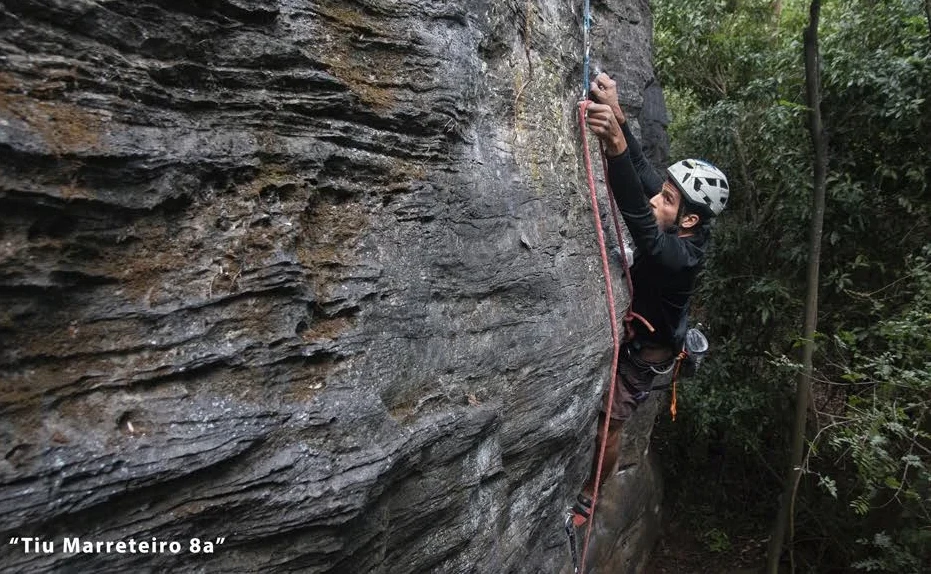 |
    | :--: |
    | *Tiu Marreteiro 8a* |
    
    |  |
    | :--: |
    | *Fotos* |
- **nome**: Setor Vale das Sombras
- **uid**: fueKv7mvJ5Mon2
- **caminho_imagem_capa**: 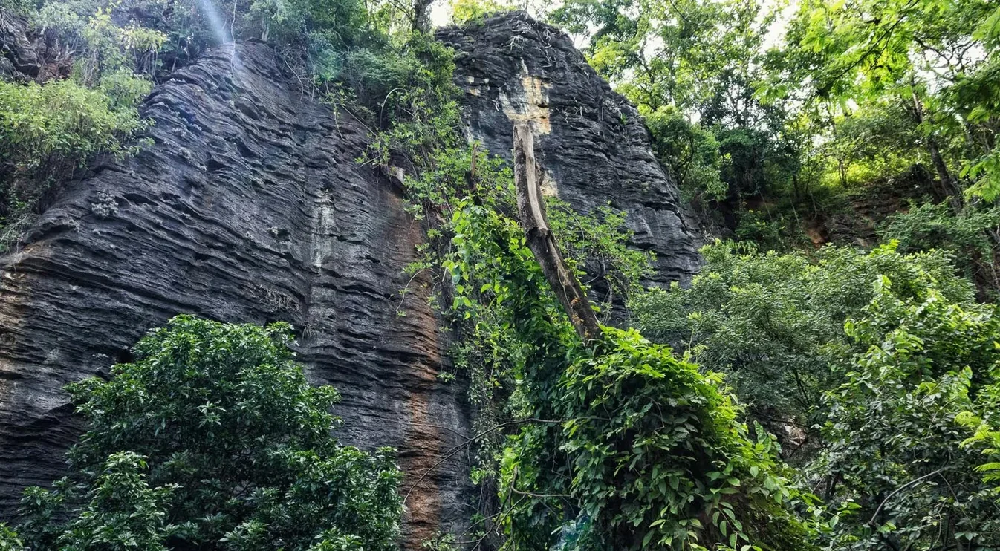
- **mapas**:
  - **[0]**:
    - **caminho_imagem_mapa**: 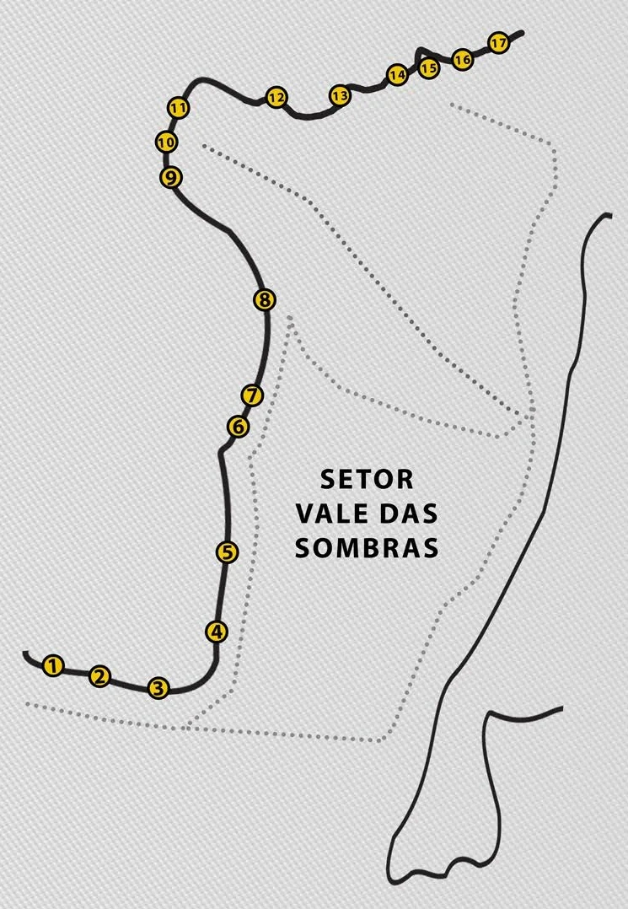
    - **largura_mapa**: 745
    - **altura_mapa**: 1078
    - **pontos_de_interesse**:
      - **[0]**:
        - **id**: Fy8s1oxrgBwLLh
        - **uid**: Fy8s1oxrgBwLLh
        - **rotulo**: 1
        - **circulo**:
          - **x**: 63
          - **y**: 790
          - **raio**: 12
        - **label**: 1
      - **[1]**:
        - **id**: rXHNACJzD3gDEw
        - **uid**: rXHNACJzD3gDEw
        - **rotulo**: 2
        - **circulo**:
          - **x**: 118
          - **y**: 802
          - **raio**: 12
        - **label**: 2
      - **[2]**:
        - **id**: nn0f6DSAdeDHcZ
        - **uid**: nn0f6DSAdeDHcZ
        - **rotulo**: 3
        - **circulo**:
          - **x**: 188
          - **y**: 816
          - **raio**: 12
        - **label**: 3
      - **[3]**:
        - **id**: wy9S1yyp2V5F0k
        - **uid**: wy9S1yyp2V5F0k
        - **rotulo**: 4
        - **circulo**:
          - **x**: 257
          - **y**: 749
          - **raio**: 12
        - **label**: 4
      - **[4]**:
        - **id**: H0fjPMYfVsINci
        - **uid**: H0fjPMYfVsINci
        - **rotulo**: 5
        - **circulo**:
          - **x**: 270
          - **y**: 655
          - **raio**: 13
        - **label**: 5
      - **[5]**:
        - **id**: XAjnH8ddLvZS2V
        - **uid**: XAjnH8ddLvZS2V
        - **rotulo**: 6
        - **circulo**:
          - **x**: 283
          - **y**: 506
          - **raio**: 12
        - **label**: 6
      - **[6]**:
        - **id**: DuYphnIUHlPJ4z
        - **uid**: DuYphnIUHlPJ4z
        - **rotulo**: 7
        - **circulo**:
          - **x**: 299
          - **y**: 469
          - **raio**: 12
        - **label**: 7
      - **[7]**:
        - **id**: 7hSvD0NnCmiuBp
        - **uid**: 7hSvD0NnCmiuBp
        - **rotulo**: 8
        - **circulo**:
          - **x**: 314
          - **y**: 356
          - **raio**: 12
        - **label**: 8
      - **[8]**:
        - **id**: VlFNIwsenq51Bq
        - **uid**: VlFNIwsenq51Bq
        - **rotulo**: 9
        - **circulo**:
          - **x**: 203
          - **y**: 210
          - **raio**: 12
        - **label**: 9
      - **[9]**:
        - **id**: fL5qXSOtOB4Jlx
        - **uid**: fL5qXSOtOB4Jlx
        - **rotulo**: 10
        - **circulo**:
          - **x**: 198
          - **y**: 168
          - **raio**: 12
        - **label**: 10
      - **[10]**:
        - **id**: 0oW5ZiJWnkvI08
        - **uid**: 0oW5ZiJWnkvI08
        - **rotulo**: 11
        - **circulo**:
          - **x**: 212
          - **y**: 128
          - **raio**: 12
        - **label**: 11
      - **[11]**:
        - **id**: gjN5270CpvjjYs
        - **uid**: gjN5270CpvjjYs
        - **rotulo**: 12
        - **circulo**:
          - **x**: 328
          - **y**: 115
          - **raio**: 12
        - **label**: 12
      - **[12]**:
        - **id**: RAJxymLXkcHCxL
        - **uid**: RAJxymLXkcHCxL
        - **rotulo**: 13
        - **circulo**:
          - **x**: 404
          - **y**: 113
          - **raio**: 12
        - **label**: 13
      - **[13]**:
        - **id**: a767R0rUkJB0eY
        - **uid**: a767R0rUkJB0eY
        - **rotulo**: 14
        - **circulo**:
          - **x**: 472
          - **y**: 89
          - **raio**: 12
        - **label**: 14
      - **[14]**:
        - **id**: jtr8YSTI408yM1
        - **uid**: jtr8YSTI408yM1
        - **rotulo**: 15
        - **circulo**:
          - **x**: 509
          - **y**: 81
          - **raio**: 12
        - **label**: 15
      - **[15]**:
        - **id**: 6UIu9Ld3PWvabm
        - **uid**: 6UIu9Ld3PWvabm
        - **rotulo**: 16
        - **circulo**:
          - **x**: 549
          - **y**: 71
          - **raio**: 12
        - **label**: 16
      - **[16]**:
        - **id**: IuSHQAav6fxmzj
        - **uid**: IuSHQAav6fxmzj
        - **rotulo**: 17
        - **circulo**:
          - **x**: 592
          - **y**: 51
          - **raio**: 12
        - **label**: 17
    - **referencias**:
      - **[0]**:
        - **alvo_uid**: jCGleAfbp7oTIy
        - **pontos_uids**:
          - Fy8s1oxrgBwLLh
        - **escalada**: Curta e Grossa
        - **ids**:
          - Fy8s1oxrgBwLLh
      - **[1]**:
        - **alvo_uid**: B7PNm5PTndXwRY
        - **pontos_uids**:
          - rXHNACJzD3gDEw
        - **escalada**: Trabalhosa
        - **ids**:
          - rXHNACJzD3gDEw
      - **[2]**:
        - **alvo_uid**: qyjblNci9wD6uI
        - **pontos_uids**:
          - nn0f6DSAdeDHcZ
        - **escalada**: Revolução dos Insetos
        - **ids**:
          - nn0f6DSAdeDHcZ
      - **[3]**:
        - **alvo_uid**: d4zX7shNhr2gtY
        - **pontos_uids**:
          - wy9S1yyp2V5F0k
        - **escalada**: Frango com Quiabo
        - **ids**:
          - wy9S1yyp2V5F0k
      - **[4]**:
        - **alvo_uid**: LoMDotNpLKQzhx
        - **pontos_uids**:
          - H0fjPMYfVsINci
        - **escalada**: É Proibido Furar
        - **ids**:
          - H0fjPMYfVsINci
      - **[5]**:
        - **alvo_uid**: HkYXUalaj3JLcz
        - **pontos_uids**:
          - XAjnH8ddLvZS2V
        - **escalada**: Bafin de Leite
        - **ids**:
          - XAjnH8ddLvZS2V
      - **[6]**:
        - **alvo_uid**: zqxp5W0FpciE3Z
        - **pontos_uids**:
          - DuYphnIUHlPJ4z
        - **escalada**: ?
        - **ids**:
          - DuYphnIUHlPJ4z
      - **[7]**:
        - **alvo_uid**: 7pHoINM0yFCJ1V
        - **pontos_uids**:
          - 7hSvD0NnCmiuBp
        - **escalada**: Sujismunda
        - **ids**:
          - 7hSvD0NnCmiuBp
      - **[8]**:
        - **alvo_uid**: VyfnuyF70I3L5c
        - **pontos_uids**:
          - VlFNIwsenq51Bq
        - **escalada**: Samurai
        - **ids**:
          - VlFNIwsenq51Bq
      - **[9]**:
        - **alvo_uid**: 1LMmIEI5mXAqqu
        - **pontos_uids**:
          - fL5qXSOtOB4Jlx
        - **escalada**: Ninja
        - **ids**:
          - fL5qXSOtOB4Jlx
      - **[10]**:
        - **alvo_uid**: 2QEoUWDhIYo1uX
        - **pontos_uids**:
          - 0oW5ZiJWnkvI08
        - **escalada**: Fly Monkeys
        - **ids**:
          - 0oW5ZiJWnkvI08
      - **[11]**:
        - **alvo_uid**: mH6Av5mEfpnmF7
        - **pontos_uids**:
          - gjN5270CpvjjYs
        - **escalada**: Lado A Lado B
        - **ids**:
          - gjN5270CpvjjYs
      - **[12]**:
        - **alvo_uid**: vEpsbrlfDSnjTe
        - **pontos_uids**:
          - RAJxymLXkcHCxL
        - **escalada**: Meu Nome Não é Lero
        - **ids**:
          - RAJxymLXkcHCxL
      - **[13]**:
        - **alvo_uid**: DTxHZkgZqL57DZ
        - **pontos_uids**:
          - a767R0rUkJB0eY
        - **escalada**: Nosso Mestre
        - **ids**:
          - a767R0rUkJB0eY
      - **[14]**:
        - **alvo_uid**: FIb3dppL3KaKA9
        - **pontos_uids**:
          - jtr8YSTI408yM1
        - **escalada**: Segunda Já Tá í
        - **ids**:
          - jtr8YSTI408yM1
      - **[15]**:
        - **alvo_uid**: gPBwwpjst9j3th
        - **pontos_uids**:
          - 6UIu9Ld3PWvabm
        - **escalada**: Brincadeira de Criança
        - **ids**:
          - 6UIu9Ld3PWvabm
      - **[16]**:
        - **alvo_uid**: EVAXPsjYIgrpoP
        - **pontos_uids**:
          - IuSHQAav6fxmzj
        - **escalada**: Peripécias do Climb
        - **ids**:
          - IuSHQAav6fxmzj
      - **[17]**:
        - **alvo_uid**: yRDiY6TFvD2zvh
        - **pontos_uids**:
          - IuSHQAav6fxmzj
        - **escalada**: Lelê Café
        - **ids**:
          - IuSHQAav6fxmzj
  - **[1]**:
    - **caminho_imagem_mapa**: 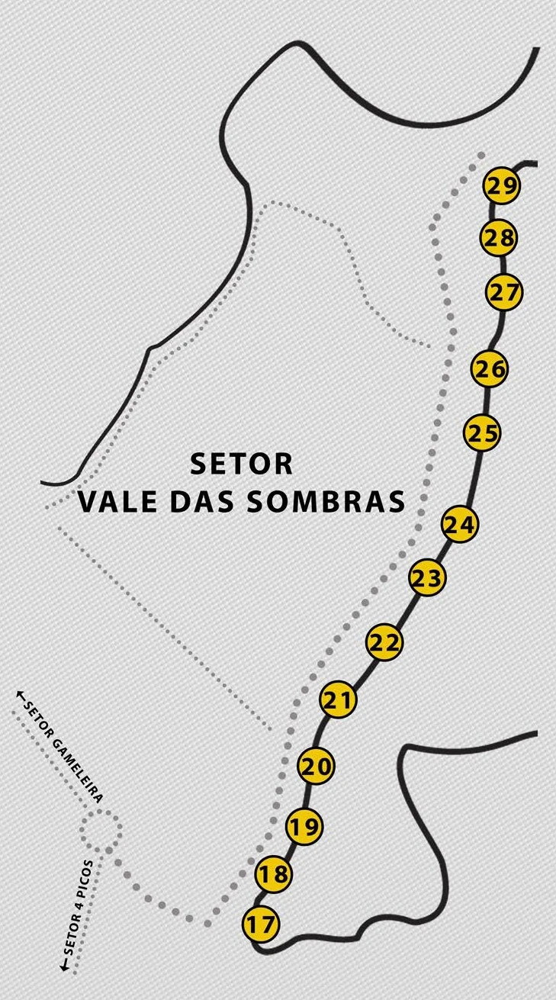
    - **largura_mapa**: 729
    - **altura_mapa**: 1311
    - **pontos_de_interesse**:
      - **[0]**:
        - **id**: yr75iWdRDTAwQN
        - **uid**: yr75iWdRDTAwQN
        - **rotulo**: 17
        - **circulo**:
          - **x**: 342
          - **y**: 1211
          - **raio**: 23
        - **label**: 17
      - **[1]**:
        - **id**: dDlsjaE4n92vYU
        - **uid**: dDlsjaE4n92vYU
        - **rotulo**: 18
        - **circulo**:
          - **x**: 359
          - **y**: 1146
          - **raio**: 23
        - **label**: 18
      - **[2]**:
        - **id**: hTOQZZkoq5d8Mv
        - **uid**: hTOQZZkoq5d8Mv
        - **rotulo**: 19
        - **circulo**:
          - **x**: 399
          - **y**: 1084
          - **raio**: 23
        - **label**: 19
      - **[3]**:
        - **id**: l1Mhz8Q65c4mlr
        - **uid**: l1Mhz8Q65c4mlr
        - **rotulo**: 20
        - **circulo**:
          - **x**: 414
          - **y**: 1004
          - **raio**: 24
        - **label**: 20
      - **[4]**:
        - **id**: hFRXQOpIZfu7TE
        - **uid**: hFRXQOpIZfu7TE
        - **rotulo**: 21
        - **circulo**:
          - **x**: 443
          - **y**: 917
          - **raio**: 24
        - **label**: 21
      - **[5]**:
        - **id**: WcQFcUHe25B1wT
        - **uid**: WcQFcUHe25B1wT
        - **rotulo**: 22
        - **circulo**:
          - **x**: 504
          - **y**: 842
          - **raio**: 23
        - **label**: 22
      - **[6]**:
        - **id**: QQf1Hhb5mwimQo
        - **uid**: QQf1Hhb5mwimQo
        - **rotulo**: 23
        - **circulo**:
          - **x**: 560
          - **y**: 757
          - **raio**: 24
        - **label**: 23
      - **[7]**:
        - **id**: F89xHOIC1y3Slq
        - **uid**: F89xHOIC1y3Slq
        - **rotulo**: 24
        - **circulo**:
          - **x**: 603
          - **y**: 687
          - **raio**: 24
        - **label**: 24
      - **[8]**:
        - **id**: tUGxxinaX0Ux9c
        - **uid**: tUGxxinaX0Ux9c
        - **rotulo**: 25
        - **circulo**:
          - **x**: 632
          - **y**: 567
          - **raio**: 24
        - **label**: 25
      - **[9]**:
        - **id**: AopiFxU1JY3u1z
        - **uid**: AopiFxU1JY3u1z
        - **rotulo**: 26
        - **circulo**:
          - **x**: 642
          - **y**: 483
          - **raio**: 24
        - **label**: 26
      - **[10]**:
        - **id**: uhdn0DXHQ3EPvK
        - **uid**: uhdn0DXHQ3EPvK
        - **rotulo**: 27
        - **circulo**:
          - **x**: 661
          - **y**: 383
          - **raio**: 24
        - **label**: 27
      - **[11]**:
        - **id**: ZKw8SmZghKZn4T
        - **uid**: ZKw8SmZghKZn4T
        - **rotulo**: 28
        - **circulo**:
          - **x**: 654
          - **y**: 312
          - **raio**: 24
        - **label**: 28
      - **[12]**:
        - **id**: tIhEaOQSqDJghO
        - **uid**: tIhEaOQSqDJghO
        - **rotulo**: 29
        - **circulo**:
          - **x**: 658
          - **y**: 243
          - **raio**: 23
        - **label**: 29
      - **[13]**:
        - **id**: 1UcLZwI7VG83Ue
        - **uid**: 1UcLZwI7VG83Ue
        - **rotulo**: ← SETOR GAMELEIRA
        - **retangulo**:
          - **x**: 76
          - **y**: 976
          - **comprimento**: 31
          - **largura**: 201
          - **angulo_graus_x100**: -3782
        - **label**: ← SETOR GAMELEIRA
      - **[14]**:
        - **id**: fLvkXNI7YUbuLm
        - **uid**: fLvkXNI7YUbuLm
        - **rotulo**: ← SETOR 4 PICOS
        - **retangulo**:
          - **x**: 100
          - **y**: 1200
          - **comprimento**: 31
          - **largura**: 165
          - **angulo_graus_x100**: 1162
        - **label**: ← SETOR 4 PICOS
    - **referencias**:
      - **[0]**:
        - **alvo_uid**: EVAXPsjYIgrpoP
        - **pontos_uids**:
          - yr75iWdRDTAwQN
        - **escalada**: Peripécias do Climb
        - **ids**:
          - yr75iWdRDTAwQN
      - **[1]**:
        - **alvo_uid**: yRDiY6TFvD2zvh
        - **pontos_uids**:
          - yr75iWdRDTAwQN
        - **escalada**: Lelê Café
        - **ids**:
          - yr75iWdRDTAwQN
      - **[2]**:
        - **alvo_uid**: RtVKfqXU4d2O5H
        - **pontos_uids**:
          - dDlsjaE4n92vYU
        - **escalada**: Tiu Marreteiro
        - **ids**:
          - dDlsjaE4n92vYU
      - **[3]**:
        - **alvo_uid**: SfpssMXcaPCDhx
        - **pontos_uids**:
          - hTOQZZkoq5d8Mv
        - **escalada**: Animáquina
        - **ids**:
          - hTOQZZkoq5d8Mv
      - **[4]**:
        - **alvo_uid**: cFe6d8p9VeVR2S
        - **pontos_uids**:
          - l1Mhz8Q65c4mlr
        - **escalada**: Moça do Sapo
        - **ids**:
          - l1Mhz8Q65c4mlr
      - **[5]**:
        - **alvo_uid**: sOiNJJZ6QIc3SN
        - **pontos_uids**:
          - hFRXQOpIZfu7TE
        - **escalada**: Over Tênis
        - **ids**:
          - hFRXQOpIZfu7TE
      - **[6]**:
        - **alvo_uid**: hlXiBaHK9X6edI
        - **pontos_uids**:
          - WcQFcUHe25B1wT
        - **escalada**: Fita No Calcário
        - **ids**:
          - WcQFcUHe25B1wT
      - **[7]**:
        - **alvo_uid**: OCS3JhgG0wwJU4
        - **pontos_uids**:
          - QQf1Hhb5mwimQo
        - **escalada**: Só de 70
        - **ids**:
          - QQf1Hhb5mwimQo
      - **[8]**:
        - **alvo_uid**: Ct2zGJzzBPgpOs
        - **pontos_uids**:
          - F89xHOIC1y3Slq
        - **escalada**: Black Dog
        - **ids**:
          - F89xHOIC1y3Slq
      - **[9]**:
        - **alvo_uid**: 4API2aIOMSUsrP
        - **pontos_uids**:
          - tUGxxinaX0Ux9c
        - **escalada**: Variante Mum-hhazinha
        - **ids**:
          - tUGxxinaX0Ux9c
      - **[10]**:
        - **alvo_uid**: 8wskz89uCipecq
        - **pontos_uids**:
          - AopiFxU1JY3u1z
        - **escalada**: Pedras e Espinhos
        - **ids**:
          - AopiFxU1JY3u1z
      - **[11]**:
        - **alvo_uid**: S2tUYBjwIBwoCm
        - **pontos_uids**:
          - uhdn0DXHQ3EPvK
        - **escalada**: Pé de Oreia
        - **ids**:
          - uhdn0DXHQ3EPvK
      - **[12]**:
        - **alvo_uid**: inpIbAmbxswoXb
        - **pontos_uids**:
          - ZKw8SmZghKZn4T
        - **escalada**: Perdidos
        - **ids**:
          - ZKw8SmZghKZn4T
      - **[13]**:
        - **alvo_uid**: E2P3yMlwW0p8DG
        - **pontos_uids**:
          - tIhEaOQSqDJghO
        - **escalada**: Velhos Novatos
        - **ids**:
          - tIhEaOQSqDJghO
      - **[14]**:
        - **alvo_uid**: imSvcK2q24F9DV
        - **pontos_uids**:
          - fLvkXNI7YUbuLm
        - **setor**: Setor 4 Picos
        - **ids**:
          - fLvkXNI7YUbuLm
      - **[15]**:
        - **alvo_uid**: TU7ksiizSIZqH4
        - **pontos_uids**:
          - 1UcLZwI7VG83Ue
        - **setor**: Setor Gameleira
        - **ids**:
          - 1UcLZwI7VG83Ue
- **escaladas**:
  - **[0]**:
    - **uid**: jCGleAfbp7oTIy
    - **via_esportiva**:
      - **nome**: Curta e Grossa
      - **dificuldade**: BR_7A
      - **quantidade_protecoes_intermediarias**: 6
  - **[1]**:
    - **uid**: B7PNm5PTndXwRY
    - **via_esportiva**:
      - **nome**: Trabalhosa
      - **dificuldade**: BR_6SUP
      - **quantidade_protecoes_intermediarias**: 7
  - **[2]**:
    - **uid**: qyjblNci9wD6uI
    - **via_esportiva**:
      - **nome**: Revolução dos Insetos
      - **dificuldade**: BR_7A
      - **quantidade_protecoes_intermediarias**: 5
  - **[3]**:
    - **uid**: d4zX7shNhr2gtY
    - **via_esportiva**:
      - **nome**: Frango com Quiabo
      - **dificuldade**: BR_7A
      - **quantidade_protecoes_intermediarias**: 6
  - **[4]**:
    - **uid**: LoMDotNpLKQzhx
    - **via_esportiva**:
      - **nome**: É Proibido Furar
      - **dificuldade**: BR_7C
      - **quantidade_protecoes_intermediarias**: 7
  - **[5]**:
    - **uid**: HkYXUalaj3JLcz
    - **via_esportiva**:
      - **descricao**: Inacabada.
      - **nome**: Bafin de Leite
  - **[6]**:
    - **uid**: zqxp5W0FpciE3Z
    - **via_esportiva**:
      - **descricao**: Inacabada.
      - **nome**: ?
  - **[7]**:
    - **uid**: 7pHoINM0yFCJ1V
    - **via_esportiva**:
      - **descricao**: Inacabada.
      - **nome**: Sujismunda
  - **[8]**:
    - **uid**: VyfnuyF70I3L5c
    - **via_esportiva**:
      - **nome**: Samurai
      - **dificuldade**: BR_6SUP
      - **quantidade_protecoes_intermediarias**: 13
  - **[9]**:
    - **uid**: 1LMmIEI5mXAqqu
    - **via_esportiva**:
      - **nome**: Ninja
      - **dificuldade**: BR_7A
      - **quantidade_protecoes_intermediarias**: 16
  - **[10]**:
    - **uid**: 2QEoUWDhIYo1uX
    - **via_esportiva**:
      - **nome**: Fly Monkeys
      - **dificuldade**: BR_6SUP
      - **quantidade_protecoes_intermediarias**: 10
  - **[11]**:
    - **uid**: mH6Av5mEfpnmF7
    - **via_esportiva**:
      - **nome**: Lado A Lado B
      - **dificuldade**: BR_7A_BARRA_7B
      - **quantidade_protecoes_intermediarias**: 7
  - **[12]**:
    - **uid**: vEpsbrlfDSnjTe
    - **via_esportiva**:
      - **nome**: Meu Nome Não é Lero
      - **dificuldade**: BR_7B
      - **quantidade_protecoes_intermediarias**: 8
  - **[13]**:
    - **uid**: DTxHZkgZqL57DZ
    - **via_esportiva**:
      - **nome**: Nosso Mestre
      - **dificuldade**: BR_5
      - **quantidade_protecoes_intermediarias**: 6
  - **[14]**:
    - **uid**: FIb3dppL3KaKA9
    - **via_esportiva**:
      - **nome**: Segunda Já Tá í
      - **dificuldade**: BR_7A
      - **quantidade_protecoes_intermediarias**: 6
  - **[15]**:
    - **uid**: gPBwwpjst9j3th
    - **via_esportiva**:
      - **nome**: Brincadeira de Criança
      - **dificuldade**: BR_6SUP
      - **quantidade_protecoes_intermediarias**: 6
  - **[16]**:
    - **uid**: EVAXPsjYIgrpoP
    - **via_esportiva**:
      - **nome**: Peripécias do Climb
      - **dificuldade**: BR_6
      - **quantidade_protecoes_intermediarias**: 4
  - **[17]**:
    - **uid**: yRDiY6TFvD2zvh
    - **via_esportiva**:
      - **descricao**: Número 17 no segundo mapa do setor.
      - **nome**: Lelê Café
      - **dificuldade**: BR_7A
      - **quantidade_protecoes_intermediarias**: 10
  - **[18]**:
    - **uid**: RtVKfqXU4d2O5H
    - **via_esportiva**:
      - **nome**: Tiu Marreteiro
      - **dificuldade**: BR_8A
      - **quantidade_protecoes_intermediarias**: 9
  - **[19]**:
    - **uid**: SfpssMXcaPCDhx
    - **via_esportiva**:
      - **nome**: Animáquina
      - **dificuldade**: BR_6SUP
      - **quantidade_protecoes_intermediarias**: 10
  - **[20]**:
    - **uid**: cFe6d8p9VeVR2S
    - **via_esportiva**:
      - **nome**: Moça do Sapo
      - **dificuldade**: BR_6
      - **quantidade_protecoes_intermediarias**: 10
  - **[21]**:
    - **uid**: sOiNJJZ6QIc3SN
    - **via_movel**:
      - **nome**: Over Tênis
      - **dificuldade**: BR_6
      - **protecoes_moveis**: Móvel / Top Duplo.
  - **[22]**:
    - **uid**: hlXiBaHK9X6edI
    - **via_movel**:
      - **nome**: Fita No Calcário
      - **dificuldade**: BR_6
      - **protecoes_moveis**: Móvel, Top da "Só de 70".
  - **[23]**:
    - **uid**: OCS3JhgG0wwJU4
    - **via_esportiva**:
      - **nome**: Só de 70
      - **dificuldade**: BR_6SUP
      - **quantidade_protecoes_intermediarias**: 13
  - **[24]**:
    - **uid**: Ct2zGJzzBPgpOs
    - **via_esportiva**:
      - **descricao**: Mista / 4 Fixas + Top Duplo.
      - **nome**: Black Dog
      - **dificuldade**: BR_6SUP
  - **[25]**:
    - **uid**: 4API2aIOMSUsrP
    - **via_esportiva**:
      - **nome**: Variante Mum-hhazinha
      - **dificuldade**: BR_6SUP
      - **quantidade_protecoes_intermediarias**: 10
  - **[26]**:
    - **uid**: 8wskz89uCipecq
    - **via_esportiva**:
      - **nome**: Pedras e Espinhos
      - **dificuldade**: BR_7A
      - **quantidade_protecoes_intermediarias**: 10
  - **[27]**:
    - **uid**: S2tUYBjwIBwoCm
    - **via_esportiva**:
      - **nome**: Pé de Oreia
      - **dificuldade**: BR_6
      - **quantidade_protecoes_intermediarias**: 5
  - **[28]**:
    - **uid**: inpIbAmbxswoXb
    - **via_esportiva**:
      - **nome**: Perdidos
      - **dificuldade**: BR_6
      - **quantidade_protecoes_intermediarias**: 5
  - **[29]**:
    - **uid**: E2P3yMlwW0p8DG
    - **via_esportiva**:
      - **nome**: Velhos Novatos
      - **dificuldade**: BR_4
      - **quantidade_protecoes_intermediarias**: 5
- **precomputados**:
  - **total_escaladas**: 30
  - **total_esportivas**: 28

## Parte: setor_imigrantes

### Setor (Pico: Sinuosa)

- **descricao**: # Setor Imigrantes
- **nome**: Setor Imigrantes
- **uid**: GjARqXDXyIGp2W
- **mapas**:
  - **[0]**:
    - **caminho_imagem_mapa**: 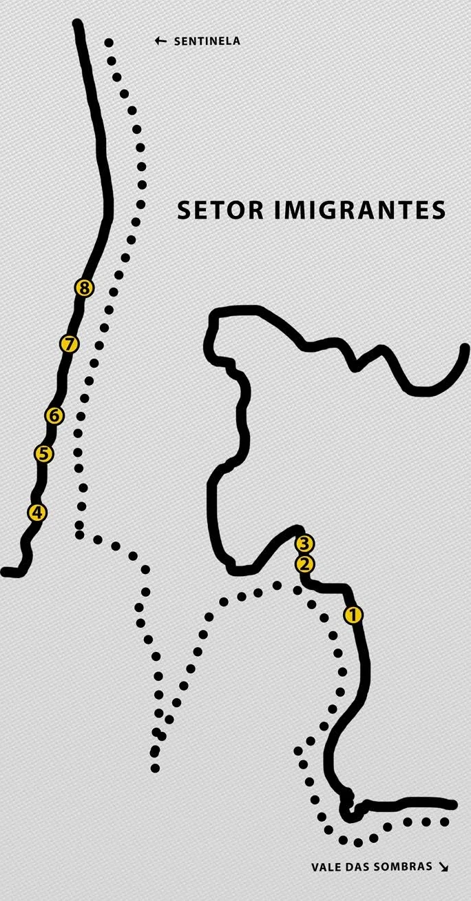
    - **largura_mapa**: 684
    - **altura_mapa**: 1306
    - **pontos_de_interesse**:
      - **[0]**:
        - **id**: suzX8V0vps3Xd0
        - **uid**: suzX8V0vps3Xd0
        - **rotulo**: 1
        - **circulo**:
          - **x**: 513
          - **y**: 891
          - **raio**: 13
        - **label**: 1
      - **[1]**:
        - **id**: Dt3muZpJ6Fzlgx
        - **uid**: Dt3muZpJ6Fzlgx
        - **rotulo**: 2
        - **circulo**:
          - **x**: 443
          - **y**: 818
          - **raio**: 13
        - **label**: 2
      - **[2]**:
        - **id**: ub6NbOkLBamVP3
        - **uid**: ub6NbOkLBamVP3
        - **rotulo**: 3
        - **circulo**:
          - **x**: 443
          - **y**: 788
          - **raio**: 13
        - **label**: 3
      - **[3]**:
        - **id**: FifrIK2SGnkQXH
        - **uid**: FifrIK2SGnkQXH
        - **rotulo**: 4
        - **circulo**:
          - **x**: 54
          - **y**: 743
          - **raio**: 13
        - **label**: 4
      - **[4]**:
        - **id**: Svf3YwVgY55s2I
        - **uid**: Svf3YwVgY55s2I
        - **rotulo**: 5
        - **circulo**:
          - **x**: 64
          - **y**: 658
          - **raio**: 13
        - **label**: 5
      - **[5]**:
        - **id**: ov35DaF0CeSP0c
        - **uid**: ov35DaF0CeSP0c
        - **rotulo**: 6
        - **circulo**:
          - **x**: 79
          - **y**: 602
          - **raio**: 13
        - **label**: 6
      - **[6]**:
        - **id**: swj2fQ26Kfd8Si
        - **uid**: swj2fQ26Kfd8Si
        - **rotulo**: 7
        - **circulo**:
          - **x**: 101
          - **y**: 499
          - **raio**: 13
        - **label**: 7
      - **[7]**:
        - **id**: JEW3vKM2CZECE4
        - **uid**: JEW3vKM2CZECE4
        - **rotulo**: 8
        - **circulo**:
          - **x**: 123
          - **y**: 417
          - **raio**: 13
        - **label**: 8
      - **[8]**:
        - **id**: YfB2sMYcMXNfTh
        - **uid**: YfB2sMYcMXNfTh
        - **rotulo**: ← SENTINELA
        - **retangulo**:
          - **x**: 288
          - **y**: 60
          - **comprimento**: 133
          - **largura**: 30
        - **label**: ← SENTINELA
      - **[9]**:
        - **id**: Tww7J9fBRV9R85
        - **uid**: Tww7J9fBRV9R85
        - **rotulo**: VALE DAS SOMBRAS ↘
        - **retangulo**:
          - **x**: 548
          - **y**: 1255
          - **comprimento**: 215
          - **largura**: 30
        - **label**: VALE DAS SOMBRAS ↘
    - **referencias**:
      - **[0]**:
        - **alvo_uid**: 0en8mNc6hr93zC
        - **pontos_uids**:
          - suzX8V0vps3Xd0
        - **escalada**: Ressucita Makita
        - **ids**:
          - suzX8V0vps3Xd0
      - **[1]**:
        - **alvo_uid**: 5G1mWkyRjRLJ7n
        - **pontos_uids**:
          - Dt3muZpJ6Fzlgx
        - **escalada**: Saporra
        - **ids**:
          - Dt3muZpJ6Fzlgx
      - **[2]**:
        - **alvo_uid**: Fd8iVKCQQQOgE8
        - **pontos_uids**:
          - ub6NbOkLBamVP3
        - **escalada**: Tudo Pra Trás
        - **ids**:
          - ub6NbOkLBamVP3
      - **[3]**:
        - **alvo_uid**: gReIh1VjRupfoW
        - **pontos_uids**:
          - FifrIK2SGnkQXH
        - **escalada**: Lamurias de Um Ex Casado
        - **ids**:
          - FifrIK2SGnkQXH
      - **[4]**:
        - **alvo_uid**: zFz9M6zadVEt17
        - **pontos_uids**:
          - Svf3YwVgY55s2I
        - **escalada**: Nunca Se Engane
        - **ids**:
          - Svf3YwVgY55s2I
      - **[5]**:
        - **alvo_uid**: y4d7JSfeRMEgwX
        - **pontos_uids**:
          - ov35DaF0CeSP0c
        - **escalada**: Chuva na Careca
        - **ids**:
          - ov35DaF0CeSP0c
      - **[6]**:
        - **alvo_uid**: fnVJ6k0XIqQBxC
        - **pontos_uids**:
          - swj2fQ26Kfd8Si
        - **escalada**: Cuei Teimoso
        - **ids**:
          - swj2fQ26Kfd8Si
      - **[7]**:
        - **alvo_uid**: Gn5wA2whGSAmTD
        - **pontos_uids**:
          - JEW3vKM2CZECE4
        - **escalada**: Escalada Eclética
        - **ids**:
          - JEW3vKM2CZECE4
      - **[8]**:
        - **alvo_uid**: EaM54aq9IJD36r
        - **pontos_uids**:
          - YfB2sMYcMXNfTh
        - **setor**: Setor Sentinela
        - **ids**:
          - YfB2sMYcMXNfTh
      - **[9]**:
        - **alvo_uid**: fueKv7mvJ5Mon2
        - **pontos_uids**:
          - Tww7J9fBRV9R85
        - **setor**: Setor Vale das Sombras
        - **ids**:
          - Tww7J9fBRV9R85
- **escaladas**:
  - **[0]**:
    - **uid**: 0en8mNc6hr93zC
    - **via_esportiva**:
      - **nome**: Ressucita Makita
      - **dificuldade**: BR_6SUP
      - **quantidade_protecoes_intermediarias**: 6
  - **[1]**:
    - **uid**: 5G1mWkyRjRLJ7n
    - **via_esportiva**:
      - **nome**: Saporra
      - **dificuldade**: BR_5SUP
      - **quantidade_protecoes_intermediarias**: 6
  - **[2]**:
    - **uid**: Fd8iVKCQQQOgE8
    - **via_esportiva**:
      - **nome**: Tudo Pra Trás
      - **dificuldade**: BR_5
      - **quantidade_protecoes_intermediarias**: 5
  - **[3]**:
    - **uid**: gReIh1VjRupfoW
    - **via_esportiva**:
      - **nome**: Lamurias de Um Ex Casado
      - **dificuldade**: BR_6
      - **quantidade_protecoes_intermediarias**: 6
  - **[4]**:
    - **uid**: zFz9M6zadVEt17
    - **via_esportiva**:
      - **nome**: Nunca Se Engane
      - **dificuldade**: BR_6SUP
      - **quantidade_protecoes_intermediarias**: 6
  - **[5]**:
    - **uid**: y4d7JSfeRMEgwX
    - **via_esportiva**:
      - **nome**: Chuva na Careca
      - **dificuldade**: BR_7A
      - **quantidade_protecoes_intermediarias**: 7
  - **[6]**:
    - **uid**: fnVJ6k0XIqQBxC
    - **via_esportiva**:
      - **nome**: Cuei Teimoso
      - **dificuldade**: BR_7B
      - **quantidade_protecoes_intermediarias**: 7
  - **[7]**:
    - **uid**: Gn5wA2whGSAmTD
    - **via_esportiva**:
      - **nome**: Escalada Eclética
      - **dificuldade**: BR_5SUP
      - **quantidade_protecoes_intermediarias**: 6
- **precomputados**:
  - **total_escaladas**: 8
  - **total_esportivas**: 8

## Parte: setor_vale_zela

### Setor (Pico: Sinuosa)

- **descricao**: # Setor Vale Zela
- **nome**: Setor Vale Zela
- **uid**: MWoo8hRjlRntGq
- **caminho_imagem_capa**: 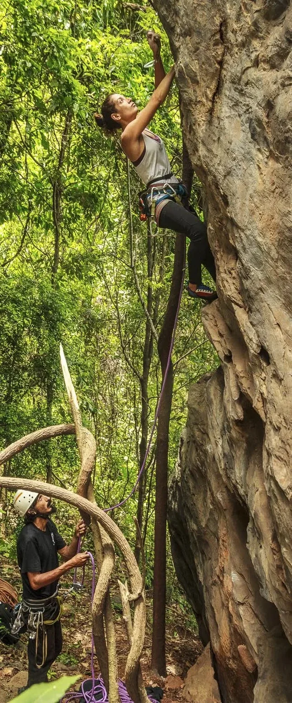
- **mapas**:
  - **[0]**:
    - **caminho_imagem_mapa**: 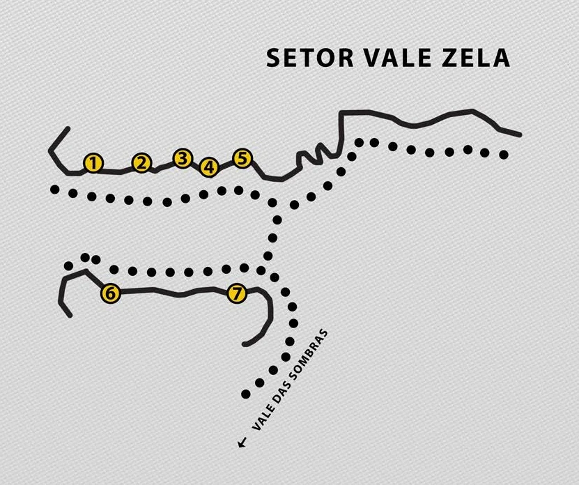
    - **largura_mapa**: 831
    - **altura_mapa**: 696
    - **pontos_de_interesse**:
      - **[0]**:
        - **id**: WHzx9I2jExQBP4
        - **uid**: WHzx9I2jExQBP4
        - **rotulo**: 1
        - **circulo**:
          - **x**: 134
          - **y**: 234
          - **raio**: 13
        - **label**: 1
      - **[1]**:
        - **id**: KoLmftzneezCvu
        - **uid**: KoLmftzneezCvu
        - **rotulo**: 2
        - **circulo**:
          - **x**: 203
          - **y**: 234
          - **raio**: 13
        - **label**: 2
      - **[2]**:
        - **id**: ZxLrZl06Dihiuw
        - **uid**: ZxLrZl06Dihiuw
        - **rotulo**: 3
        - **circulo**:
          - **x**: 262
          - **y**: 227
          - **raio**: 13
        - **label**: 3
      - **[3]**:
        - **id**: Ziv2oElmQmN2ga
        - **uid**: Ziv2oElmQmN2ga
        - **rotulo**: 4
        - **circulo**:
          - **x**: 300
          - **y**: 240
          - **raio**: 13
        - **label**: 4
      - **[4]**:
        - **id**: W3n8Osli6p0ESk
        - **uid**: W3n8Osli6p0ESk
        - **rotulo**: 5
        - **circulo**:
          - **x**: 348
          - **y**: 227
          - **raio**: 13
        - **label**: 5
      - **[5]**:
        - **id**: VYDFjPSvVkTjGz
        - **uid**: VYDFjPSvVkTjGz
        - **rotulo**: 6
        - **circulo**:
          - **x**: 159
          - **y**: 421
          - **raio**: 13
        - **label**: 6
      - **[6]**:
        - **id**: tQo1ArqMq71sUW
        - **uid**: tQo1ArqMq71sUW
        - **rotulo**: 7
        - **circulo**:
          - **x**: 340
          - **y**: 421
          - **raio**: 13
        - **label**: 7
      - **[7]**:
        - **id**: l9RKGms93JS9u9
        - **uid**: l9RKGms93JS9u9
        - **rotulo**: ↙ VALE DAS SOMBRAS
        - **retangulo**:
          - **x**: 406
          - **y**: 559
          - **comprimento**: 33
          - **largura**: 218
          - **angulo_graus_x100**: 3372
        - **label**: ↙ VALE DAS SOMBRAS
    - **referencias**:
      - **[0]**:
        - **alvo_uid**: jfwhCoOAIB9T2Q
        - **pontos_uids**:
          - WHzx9I2jExQBP4
        - **escalada**: Hugossauro
        - **ids**:
          - WHzx9I2jExQBP4
      - **[1]**:
        - **alvo_uid**: V9G7HxMSRLFUTs
        - **pontos_uids**:
          - KoLmftzneezCvu
        - **escalada**: A Busca
        - **ids**:
          - KoLmftzneezCvu
      - **[2]**:
        - **alvo_uid**: DFpFQFAjTD9LtJ
        - **pontos_uids**:
          - ZxLrZl06Dihiuw
        - **escalada**: Gancho na Orelha
        - **ids**:
          - ZxLrZl06Dihiuw
      - **[3]**:
        - **alvo_uid**: 59prY8371phOk3
        - **pontos_uids**:
          - Ziv2oElmQmN2ga
        - **escalada**: Tios Metralha
        - **ids**:
          - Ziv2oElmQmN2ga
      - **[4]**:
        - **alvo_uid**: Jlzt8XeVxvULR6
        - **pontos_uids**:
          - W3n8Osli6p0ESk
        - **escalada**: Sociedade Alternativa
        - **ids**:
          - W3n8Osli6p0ESk
      - **[5]**:
        - **alvo_uid**: OBWFwdDZuMCFHu
        - **pontos_uids**:
          - VYDFjPSvVkTjGz
        - **escalada**: Travessia de Pedestre
        - **ids**:
          - VYDFjPSvVkTjGz
      - **[6]**:
        - **alvo_uid**: gfqw2QoR8b9e6u
        - **pontos_uids**:
          - tQo1ArqMq71sUW
        - **escalada**: De Menor
        - **ids**:
          - tQo1ArqMq71sUW
      - **[7]**:
        - **alvo_uid**: fueKv7mvJ5Mon2
        - **pontos_uids**:
          - l9RKGms93JS9u9
        - **setor**: Setor Vale das Sombras
        - **ids**:
          - l9RKGms93JS9u9
- **escaladas**:
  - **[0]**:
    - **uid**: jfwhCoOAIB9T2Q
    - **via_esportiva**:
      - **nome**: Hugossauro
      - **dificuldade**: BR_5SUP
      - **quantidade_protecoes_intermediarias**: 6
  - **[1]**:
    - **uid**: V9G7HxMSRLFUTs
    - **via_esportiva**:
      - **nome**: A Busca
      - **dificuldade**: BR_7B
      - **quantidade_protecoes_intermediarias**: 6
  - **[2]**:
    - **uid**: DFpFQFAjTD9LtJ
    - **via_esportiva**:
      - **nome**: Gancho na Orelha
      - **dificuldade**: BR_7A
      - **quantidade_protecoes_intermediarias**: 6
  - **[3]**:
    - **uid**: 59prY8371phOk3
    - **via_esportiva**:
      - **nome**: Tios Metralha
      - **dificuldade**: BR_6SUP
      - **quantidade_protecoes_intermediarias**: 6
  - **[4]**:
    - **uid**: Jlzt8XeVxvULR6
    - **via_esportiva**:
      - **nome**: Sociedade Alternativa
      - **dificuldade**: BR_7C
      - **quantidade_protecoes_intermediarias**: 5
  - **[5]**:
    - **uid**: OBWFwdDZuMCFHu
    - **via_esportiva**:
      - **nome**: Travessia de Pedestre
      - **dificuldade**: BR_5
      - **quantidade_protecoes_intermediarias**: 6
  - **[6]**:
    - **uid**: gfqw2QoR8b9e6u
    - **via_esportiva**:
      - **nome**: De Menor
      - **dificuldade**: BR_4
      - **quantidade_protecoes_intermediarias**: 4
- **precomputados**:
  - **total_escaladas**: 7
  - **total_esportivas**: 7

## Parte: setor_macaubas

### Setor (Pico: Sinuosa)

- **descricao**: # Setor Macaúbas
- **nome**: Setor Macaúbas
- **uid**: IOfSlf58GTdE9g
- **caminho_imagem_capa**: 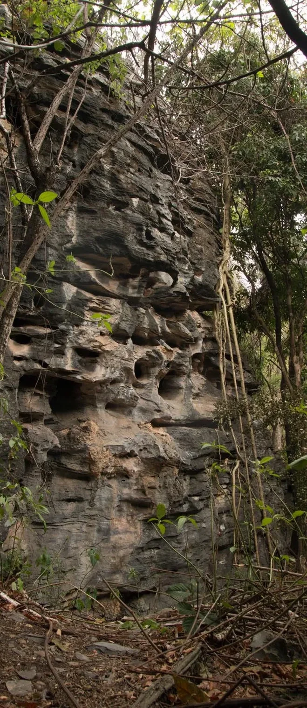
- **mapas**:
  - **[0]**:
    - **caminho_imagem_mapa**: 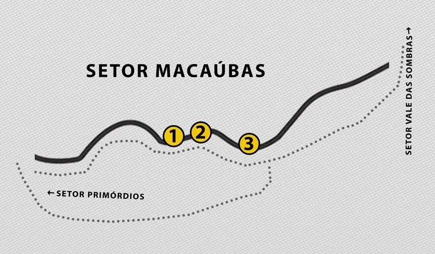
    - **largura_mapa**: 885
    - **altura_mapa**: 517
    - **pontos_de_interesse**:
      - **[0]**:
        - **id**: xEztd5gcQMPGIi
        - **uid**: xEztd5gcQMPGIi
        - **rotulo**: 1
        - **circulo**:
          - **x**: 353
          - **y**: 277
          - **raio**: 20
        - **label**: 1
      - **[1]**:
        - **id**: 80WLKTdHwuWa48
        - **uid**: 80WLKTdHwuWa48
        - **rotulo**: 2
        - **circulo**:
          - **x**: 409
          - **y**: 269
          - **raio**: 20
        - **label**: 2
      - **[2]**:
        - **id**: MmobUJw2GKdGry
        - **uid**: MmobUJw2GKdGry
        - **rotulo**: 3
        - **circulo**:
          - **x**: 507
          - **y**: 293
          - **raio**: 20
        - **label**: 3
      - **[3]**:
        - **id**: LbHKwa6bG4pWq9
        - **uid**: LbHKwa6bG4pWq9
        - **rotulo**: ← SETOR PRIMÓRDIOS
        - **retangulo**:
          - **x**: 196
          - **y**: 394
          - **comprimento**: 212
          - **largura**: 35
          - **angulo_graus_x100**: 194
        - **label**: ← SETOR PRIMÓRDIOS
      - **[4]**:
        - **id**: cvB4j9GtVi8KXy
        - **uid**: cvB4j9GtVi8KXy
        - **rotulo**: SETOR VALE DAS SOMBRAS →
        - **retangulo**:
          - **x**: 832
          - **y**: 184
          - **comprimento**: 33
          - **largura**: 266
        - **label**: SETOR VALE DAS SOMBRAS →
    - **referencias**:
      - **[0]**:
        - **alvo_uid**: RihK7SsKF5IlBf
        - **pontos_uids**:
          - xEztd5gcQMPGIi
        - **escalada**: Cobra Caoia
        - **ids**:
          - xEztd5gcQMPGIi
      - **[1]**:
        - **alvo_uid**: peuRqMqXsIGkn9
        - **pontos_uids**:
          - 80WLKTdHwuWa48
        - **escalada**: Lembranças de Mariazinha
        - **ids**:
          - 80WLKTdHwuWa48
      - **[2]**:
        - **alvo_uid**: pQR3eJWRIVoNAU
        - **pontos_uids**:
          - MmobUJw2GKdGry
        - **escalada**: Anfitriões do Dia
        - **ids**:
          - MmobUJw2GKdGry
      - **[3]**:
        - **alvo_uid**: qey8xcqcLCOOwp
        - **pontos_uids**:
          - LbHKwa6bG4pWq9
        - **setor**: Setor Primórdios
        - **ids**:
          - LbHKwa6bG4pWq9
      - **[4]**:
        - **alvo_uid**: fueKv7mvJ5Mon2
        - **pontos_uids**:
          - cvB4j9GtVi8KXy
        - **setor**: Setor Vale das Sombras
        - **ids**:
          - cvB4j9GtVi8KXy
- **escaladas**:
  - **[0]**:
    - **uid**: RihK7SsKF5IlBf
    - **via_esportiva**:
      - **nome**: Cobra Caoia
      - **dificuldade**: BR_5
      - **quantidade_protecoes_intermediarias**: 5
  - **[1]**:
    - **uid**: peuRqMqXsIGkn9
    - **via_esportiva**:
      - **nome**: Lembranças de Mariazinha
      - **dificuldade**: BR_5
      - **quantidade_protecoes_intermediarias**: 5
  - **[2]**:
    - **uid**: pQR3eJWRIVoNAU
    - **via_esportiva**:
      - **nome**: Anfitriões do Dia
      - **dificuldade**: BR_5
      - **quantidade_protecoes_intermediarias**: 5
- **precomputados**:
  - **total_escaladas**: 3
  - **total_esportivas**: 3

## Parte: setor_primordios

### Setor (Pico: Sinuosa)

- **descricao**:
    # Setor Primórdios
    
    Setor onde tudo começou na década de 90, parede com grande concentração
    de vias e de características bem diferentes. As vias possuem ótimas base e bastante
    espaço para grupos, bom para armar redes e descansar, pois o setor possui sombra
    o dia todo.
    
    |  |
    | :--: |
    | *De volta às origens 8a foto 2* |
    
    |  |
    | :--: |
    | *Chaminé Retinida 6º sup* |
    
    | 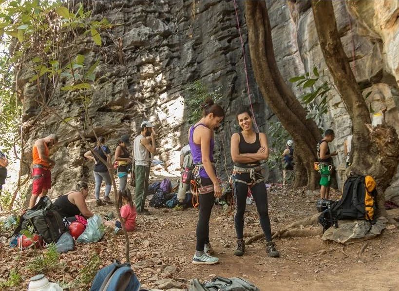 |
    | :--: |
    | *Foto 4* |
    
    |  |
    | :--: |
    | *Foto 5* |
    
    |  |
    | :--: |
    | *Mais Fotos* |
- **nome**: Setor Primórdios
- **uid**: qey8xcqcLCOOwp
- **caminho_imagem_capa**: 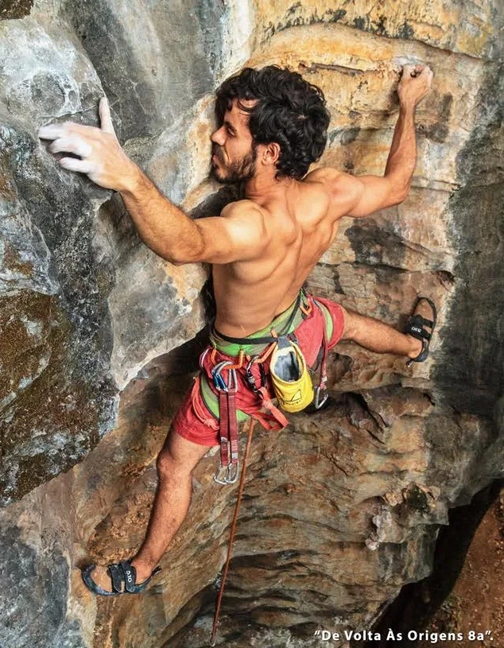
- **mapas**:
  - **[0]**:
    - **caminho_imagem_mapa**: 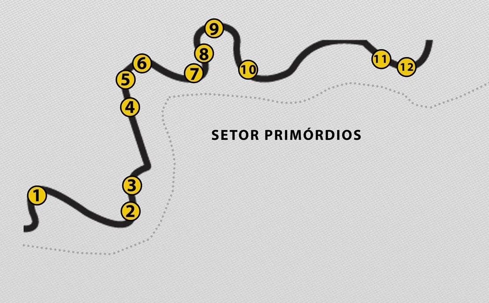
    - **largura_mapa**: 1111
    - **altura_mapa**: 689
    - **pontos_de_interesse**:
      - **[0]**:
        - **id**: vjYXd1RjFBI01B
        - **uid**: vjYXd1RjFBI01B
        - **rotulo**: 1
        - **circulo**:
          - **x**: 84
          - **y**: 444
          - **raio**: 20
        - **label**: 1
      - **[1]**:
        - **id**: k8XZ2tvE01wNzc
        - **uid**: k8XZ2tvE01wNzc
        - **rotulo**: 2
        - **circulo**:
          - **x**: 297
          - **y**: 480
          - **raio**: 20
        - **label**: 2
      - **[2]**:
        - **id**: c2WomyPdeCmV6F
        - **uid**: c2WomyPdeCmV6F
        - **rotulo**: 3
        - **circulo**:
          - **x**: 300
          - **y**: 422
          - **raio**: 20
        - **label**: 3
      - **[3]**:
        - **id**: 2wa5J9IKfM9vRa
        - **uid**: 2wa5J9IKfM9vRa
        - **rotulo**: 4
        - **circulo**:
          - **x**: 296
          - **y**: 244
          - **raio**: 21
        - **label**: 4
      - **[4]**:
        - **id**: me9UttXto3uM6n
        - **uid**: me9UttXto3uM6n
        - **rotulo**: 5
        - **circulo**:
          - **x**: 286
          - **y**: 181
          - **raio**: 21
        - **label**: 5
      - **[5]**:
        - **id**: 9ePUmT21QdWZDQ
        - **uid**: 9ePUmT21QdWZDQ
        - **rotulo**: 6
        - **circulo**:
          - **x**: 323
          - **y**: 144
          - **raio**: 21
        - **label**: 6
      - **[6]**:
        - **id**: 3LDpyXeklCjwgd
        - **uid**: 3LDpyXeklCjwgd
        - **rotulo**: 7
        - **circulo**:
          - **x**: 441
          - **y**: 166
          - **raio**: 21
        - **label**: 7
      - **[7]**:
        - **id**: lZszqFmO8OE418
        - **uid**: lZszqFmO8OE418
        - **rotulo**: 8
        - **circulo**:
          - **x**: 463
          - **y**: 121
          - **raio**: 21
        - **label**: 8
      - **[8]**:
        - **id**: 7TFOBvJ9d974Ak
        - **uid**: 7TFOBvJ9d974Ak
        - **rotulo**: 9
        - **circulo**:
          - **x**: 487
          - **y**: 64
          - **raio**: 21
        - **label**: 9
      - **[9]**:
        - **id**: fJE4CRnsKKfDRE
        - **uid**: fJE4CRnsKKfDRE
        - **rotulo**: 10
        - **circulo**:
          - **x**: 564
          - **y**: 158
          - **raio**: 21
        - **label**: 10
      - **[10]**:
        - **id**: mnWAxFMWED2gAf
        - **uid**: mnWAxFMWED2gAf
        - **rotulo**: 11
        - **circulo**:
          - **x**: 866
          - **y**: 134
          - **raio**: 21
        - **label**: 11
      - **[11]**:
        - **id**: aoOxblBL3x1Wk7
        - **uid**: aoOxblBL3x1Wk7
        - **rotulo**: 12
        - **circulo**:
          - **x**: 924
          - **y**: 153
          - **raio**: 21
        - **label**: 12
    - **referencias**:
      - **[0]**:
        - **alvo_uid**: cfyBOpUArq4qqv
        - **pontos_uids**:
          - vjYXd1RjFBI01B
        - **escalada**: No Pulso
        - **ids**:
          - vjYXd1RjFBI01B
      - **[1]**:
        - **alvo_uid**: vQL0M07LFpzvYG
        - **pontos_uids**:
          - k8XZ2tvE01wNzc
        - **escalada**: Cascavel
        - **ids**:
          - k8XZ2tvE01wNzc
      - **[2]**:
        - **alvo_uid**: y0IsszE2znJF1R
        - **pontos_uids**:
          - c2WomyPdeCmV6F
        - **escalada**: Marimbondos
        - **ids**:
          - c2WomyPdeCmV6F
      - **[3]**:
        - **alvo_uid**: hNlLXJL3I3q2Jt
        - **pontos_uids**:
          - 2wa5J9IKfM9vRa
        - **escalada**: Cobra Coral
        - **ids**:
          - 2wa5J9IKfM9vRa
      - **[4]**:
        - **alvo_uid**: 5TKP48dQA03ZaA
        - **pontos_uids**:
          - me9UttXto3uM6n
        - **escalada**: Cactos
        - **ids**:
          - me9UttXto3uM6n
      - **[5]**:
        - **alvo_uid**: nsaLORjDADYTwt
        - **pontos_uids**:
          - 9ePUmT21QdWZDQ
        - **escalada**: De Voltas Às Origens
        - **ids**:
          - 9ePUmT21QdWZDQ
      - **[6]**:
        - **alvo_uid**: lv7SJvayR9EvZk
        - **pontos_uids**:
          - 3LDpyXeklCjwgd
        - **escalada**: Velha Guarda
        - **ids**:
          - 3LDpyXeklCjwgd
      - **[7]**:
        - **alvo_uid**: 2ZGVuwKAsbRN4m
        - **pontos_uids**:
          - lZszqFmO8OE418
        - **escalada**: Chaminé Retinida
        - **ids**:
          - lZszqFmO8OE418
      - **[8]**:
        - **alvo_uid**: iGE0gNDwKkZmRi
        - **pontos_uids**:
          - 7TFOBvJ9d974Ak
        - **escalada**: Tempos Modernos
        - **ids**:
          - 7TFOBvJ9d974Ak
      - **[9]**:
        - **alvo_uid**: 6p1iB73iXZ16E1
        - **pontos_uids**:
          - fJE4CRnsKKfDRE
        - **escalada**: Buraco Louco
        - **ids**:
          - fJE4CRnsKKfDRE
      - **[10]**:
        - **alvo_uid**: O9Qtjh351VqT1j
        - **pontos_uids**:
          - mnWAxFMWED2gAf
        - **escalada**: Estufando o Bigode
        - **ids**:
          - mnWAxFMWED2gAf
      - **[11]**:
        - **alvo_uid**: fFwXE2OxmSAqZR
        - **pontos_uids**:
          - aoOxblBL3x1Wk7
        - **escalada**: Não Deu Bigode
        - **ids**:
          - aoOxblBL3x1Wk7
- **escaladas**:
  - **[0]**:
    - **uid**: cfyBOpUArq4qqv
    - **via_esportiva**:
      - **nome**: No Pulso
      - **dificuldade**: BR_5
      - **quantidade_protecoes_intermediarias**: 7
  - **[1]**:
    - **uid**: vQL0M07LFpzvYG
    - **via_esportiva**:
      - **nome**: Cascavel
      - **dificuldade**: BR_4
      - **quantidade_protecoes_intermediarias**: 5
  - **[2]**:
    - **uid**: y0IsszE2znJF1R
    - **via_esportiva**:
      - **nome**: Marimbondos
      - **dificuldade**: BR_4
      - **quantidade_protecoes_intermediarias**: 4
  - **[3]**:
    - **uid**: hNlLXJL3I3q2Jt
    - **via_esportiva**:
      - **nome**: Cobra Coral
      - **dificuldade**: BR_5
      - **quantidade_protecoes_intermediarias**: 7
  - **[4]**:
    - **uid**: 5TKP48dQA03ZaA
    - **via_esportiva**:
      - **nome**: Cactos
      - **dificuldade**: BR_6SUP
      - **quantidade_protecoes_intermediarias**: 8
  - **[5]**:
    - **uid**: nsaLORjDADYTwt
    - **via_esportiva**:
      - **nome**: De Voltas Às Origens
      - **dificuldade**: BR_8A
      - **quantidade_protecoes_intermediarias**: 8
  - **[6]**:
    - **uid**: lv7SJvayR9EvZk
    - **via_esportiva**:
      - **nome**: Velha Guarda
      - **dificuldade**: BR_7B
      - **quantidade_protecoes_intermediarias**: 8
  - **[7]**:
    - **uid**: 2ZGVuwKAsbRN4m
    - **via_esportiva**:
      - **nome**: Chaminé Retinida
      - **dificuldade**: BR_6SUP
      - **quantidade_protecoes_intermediarias**: 8
  - **[8]**:
    - **uid**: iGE0gNDwKkZmRi
    - **via_esportiva**:
      - **nome**: Tempos Modernos
      - **dificuldade**: BR_7B
      - **quantidade_protecoes_intermediarias**: 8
  - **[9]**:
    - **uid**: 6p1iB73iXZ16E1
    - **via_esportiva**:
      - **nome**: Buraco Louco
      - **dificuldade**: BR_7B
      - **quantidade_protecoes_intermediarias**: 8
  - **[10]**:
    - **uid**: O9Qtjh351VqT1j
    - **via_esportiva**:
      - **nome**: Estufando o Bigode
      - **dificuldade**: BR_7A
      - **quantidade_protecoes_intermediarias**: 7
  - **[11]**:
    - **uid**: fFwXE2OxmSAqZR
    - **via_esportiva**:
      - **nome**: Não Deu Bigode
      - **dificuldade**: BR_7B
      - **quantidade_protecoes_intermediarias**: 7
- **precomputados**:
  - **total_escaladas**: 12
  - **total_esportivas**: 12

## Parte: setor_4_picos

### Setor (Pico: Sinuosa)

- **descricao**: # Setor 4 Picos
- **nome**: Setor 4 Picos
- **uid**: imSvcK2q24F9DV
- **caminho_imagem_capa**: 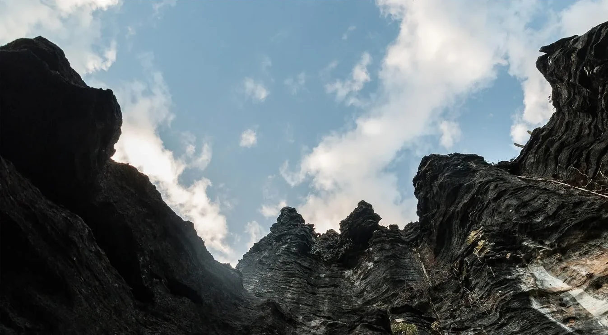
- **mapas**:
  - **[0]**:
    - **caminho_imagem_mapa**: 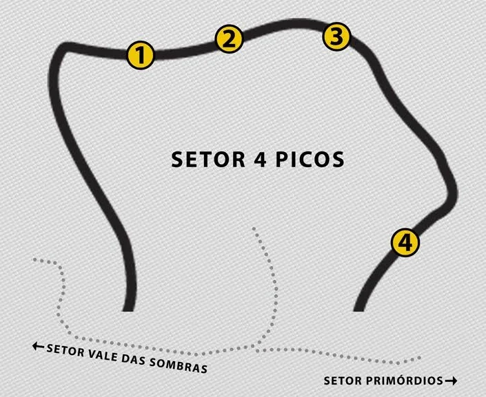
    - **largura_mapa**: 705
    - **altura_mapa**: 577
    - **pontos_de_interesse**:
      - **[0]**:
        - **id**: sYClr2YcirKbmt
        - **uid**: sYClr2YcirKbmt
        - **rotulo**: 1
        - **circulo**:
          - **x**: 204
          - **y**: 80
          - **raio**: 20
        - **label**: 1
      - **[1]**:
        - **id**: 1Oi0nSOj3ckjhr
        - **uid**: 1Oi0nSOj3ckjhr
        - **rotulo**: 2
        - **circulo**:
          - **x**: 333
          - **y**: 57
          - **raio**: 19
        - **label**: 2
      - **[2]**:
        - **id**: MZB7tEVe1jqmkH
        - **uid**: MZB7tEVe1jqmkH
        - **rotulo**: 3
        - **circulo**:
          - **x**: 489
          - **y**: 53
          - **raio**: 19
        - **label**: 3
      - **[3]**:
        - **id**: il798y9aIJSc7I
        - **uid**: il798y9aIJSc7I
        - **rotulo**: 4
        - **circulo**:
          - **x**: 588
          - **y**: 353
          - **raio**: 20
        - **label**: 4
      - **[4]**:
        - **id**: S43crAZaWVRrNv
        - **uid**: S43crAZaWVRrNv
        - **rotulo**: ← SETOR VALE DAS SOMBRAS
        - **retangulo**:
          - **x**: 174
          - **y**: 518
          - **comprimento**: 267
          - **largura**: 29
          - **angulo_graus_x100**: 779
        - **label**: ← SETOR VALE DAS SOMBRAS
      - **[5]**:
        - **id**: g5sr9LKjWvRJM7
        - **uid**: g5sr9LKjWvRJM7
        - **rotulo**: SETOR PRIMÓRDIOS →
        - **retangulo**:
          - **x**: 567
          - **y**: 552
          - **comprimento**: 204
          - **largura**: 22
        - **label**: SETOR PRIMÓRDIOS →
    - **referencias**:
      - **[0]**:
        - **alvo_uid**: POx1tS9AZs7lxr
        - **pontos_uids**:
          - sYClr2YcirKbmt
        - **escalada**: Pais e Filhas
        - **ids**:
          - sYClr2YcirKbmt
      - **[1]**:
        - **alvo_uid**: bk07KwoUTlXhPp
        - **pontos_uids**:
          - 1Oi0nSOj3ckjhr
        - **escalada**: Morcegos Sinuosos
        - **ids**:
          - 1Oi0nSOj3ckjhr
      - **[2]**:
        - **alvo_uid**: YaLSSJDCOuH2Bu
        - **pontos_uids**:
          - MZB7tEVe1jqmkH
        - **escalada**: Sintoniza Lá
        - **ids**:
          - MZB7tEVe1jqmkH
      - **[3]**:
        - **alvo_uid**: 14AJXjjTteqOLZ
        - **pontos_uids**:
          - il798y9aIJSc7I
        - **escalada**: ???
        - **ids**:
          - il798y9aIJSc7I
      - **[4]**:
        - **alvo_uid**: fueKv7mvJ5Mon2
        - **pontos_uids**:
          - S43crAZaWVRrNv
        - **setor**: Setor Vale das Sombras
        - **ids**:
          - S43crAZaWVRrNv
      - **[5]**:
        - **alvo_uid**: qey8xcqcLCOOwp
        - **pontos_uids**:
          - g5sr9LKjWvRJM7
        - **setor**: Setor Primórdios
        - **ids**:
          - g5sr9LKjWvRJM7
- **escaladas**:
  - **[0]**:
    - **uid**: POx1tS9AZs7lxr
    - **via_esportiva**:
      - **nome**: Pais e Filhas
      - **dificuldade**: BR_5
      - **quantidade_protecoes_intermediarias**: 7
  - **[1]**:
    - **uid**: bk07KwoUTlXhPp
    - **via_esportiva**:
      - **nome**: Morcegos Sinuosos
      - **dificuldade**: BR_6SUP
      - **quantidade_protecoes_intermediarias**: 6
  - **[2]**:
    - **uid**: YaLSSJDCOuH2Bu
    - **via_esportiva**:
      - **nome**: Sintoniza Lá
      - **dificuldade**: BR_6SUP
      - **quantidade_protecoes_intermediarias**: 6
  - **[3]**:
    - **uid**: 14AJXjjTteqOLZ
    - **via_esportiva**:
      - **nome**: ???
      - **dificuldade**: PROJETO
- **precomputados**:
  - **total_escaladas**: 4
  - **total_esportivas**: 4

## Parte: grupo_vale_oculto

### Grupo (Pico: Sinuosa)

- **descricao**:
    # Vale Oculto Sinuosa
    
    A área recém descoberta por escaladores locais em 2018, o local deu origem a três sub-setores, chamados: **"De Cara"**, **"Laranja"** e **"Anfiteatro"**.
    
    O Local tem acesso diferente da parte já conhecida dos escaladores. O acesso está ilustrado neste croqui.
    
    Já foram conquistadas **33 vias** e ainda existem algumas possibilidades.
    
    Os três sub-setores tem características bem diferentes: negativos constantes e arestas, vias como **"Face Oculta 7a"**, **"Negativos 6º SUP"**, **"Quebrando o Silêncio 8b"**, **"Recepção Venenosa 7a"** e **"Dono do Pico 7c"** já são a candidatas a vias clássicas da Sinuosa.
    
    | 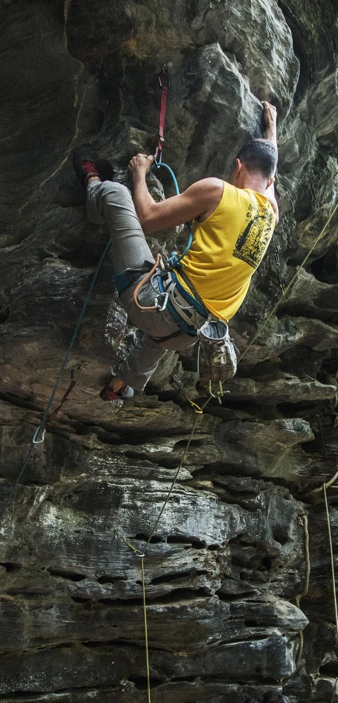 |
    | :--: |
    | *Escalador no Vale Oculto* |
    
    # Trilha de Acesso Vale Oculto
    
    | 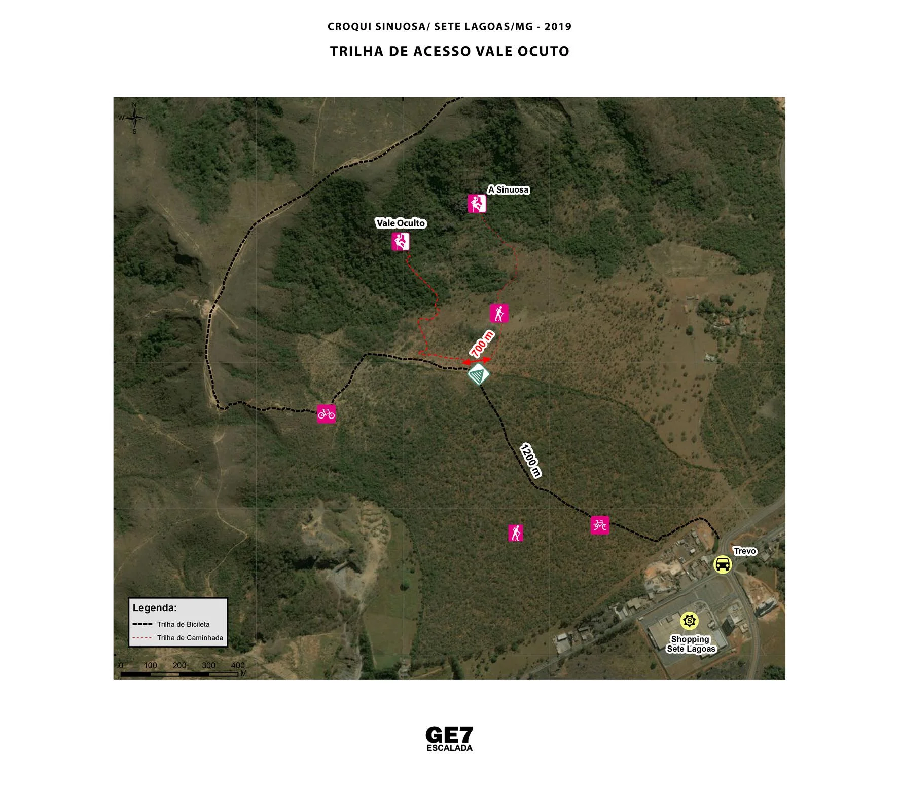 |
    | :--: |
    | *Mapa de Acesso Vale Oculto* |
    
    O mapa acima ilustra a trilha de acesso para o Vale Oculto, partindo das proximidades do Shopping Sete Lagoas.
- **nome**: Vale Oculto
- **uid**: ygIGAaiKPCRu5G
- **caminho_imagem_capa**: 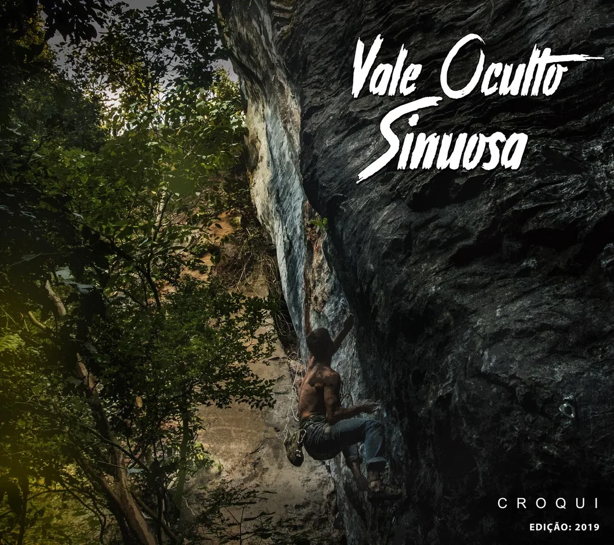
- **setores**:
  - **[0]**:
    - **conteudo**:
      - **descricao**: # Setor Vale Oculto - Sub Setor de Cara
      - **nome**: Sub Setor de Cara
      - **uid**: jwrhx8dZTo5fU7
      - **caminho_imagem_capa**: 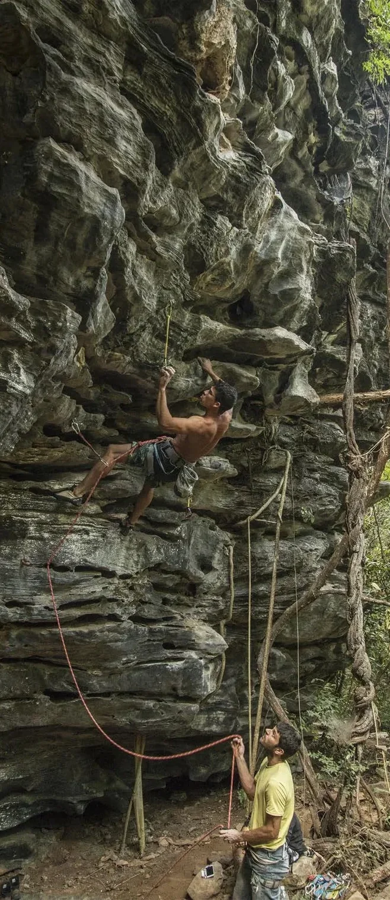
      - **mapas**:
        - **[0]**:
          - **caminho_imagem_mapa**: 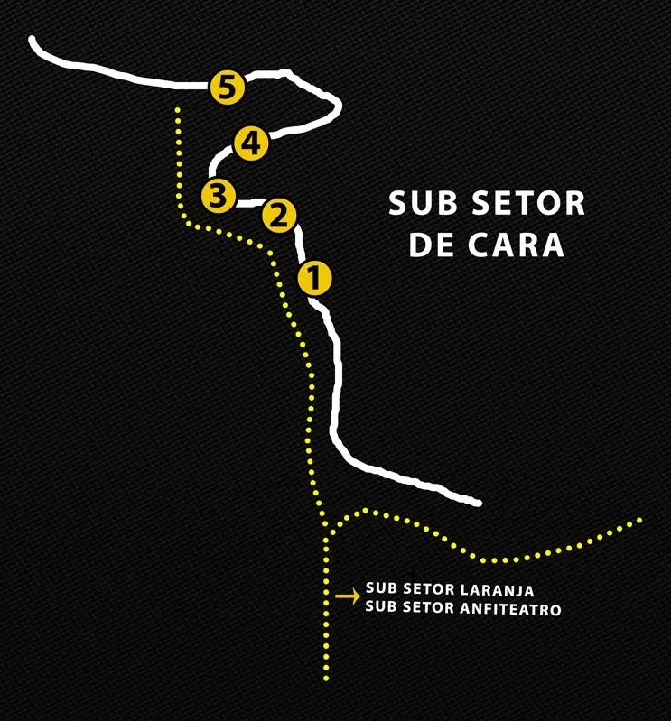
          - **largura_mapa**: 743
          - **altura_mapa**: 799
          - **pontos_de_interesse**:
            - **[0]**:
              - **id**: 5UjHkfUeONwGqT
              - **uid**: 5UjHkfUeONwGqT
              - **rotulo**: 1
              - **circulo**:
                - **x**: 349
                - **y**: 308
                - **raio**: 20
              - **label**: 1
            - **[1]**:
              - **id**: sDyhE0VgD77F03
              - **uid**: sDyhE0VgD77F03
              - **rotulo**: 2
              - **circulo**:
                - **x**: 309
                - **y**: 238
                - **raio**: 20
              - **label**: 2
            - **[2]**:
              - **id**: nRS8yeWXKSRNdu
              - **uid**: nRS8yeWXKSRNdu
              - **rotulo**: 3
              - **circulo**:
                - **x**: 242
                - **y**: 216
                - **raio**: 19
              - **label**: 3
            - **[3]**:
              - **id**: xpG9p0ois3WVX9
              - **uid**: xpG9p0ois3WVX9
              - **rotulo**: 4
              - **circulo**:
                - **x**: 279
                - **y**: 159
                - **raio**: 20
              - **label**: 4
            - **[4]**:
              - **id**: e9nIv6njQdi7iQ
              - **uid**: e9nIv6njQdi7iQ
              - **rotulo**: 5
              - **circulo**:
                - **x**: 252
                - **y**: 96
                - **raio**: 20
              - **label**: 5
            - **[5]**:
              - **id**: 96aIAA9mpFZPix
              - **uid**: 96aIAA9mpFZPix
              - **rotulo**: SUB SETOR LARANJA / ANFITEATRO →
              - **retangulo**:
                - **x**: 498
                - **y**: 664
                - **comprimento**: 263
                - **largura**: 50
                - **angulo_graus_x100**: 132
              - **label**: SUB SETOR LARANJA / ANFITEATRO →
          - **referencias**:
            - **[0]**:
              - **alvo_uid**: unIWWHWHvC692h
              - **pontos_uids**:
                - 5UjHkfUeONwGqT
              - **escalada**: Facão Traiçoeiro
              - **ids**:
                - 5UjHkfUeONwGqT
            - **[1]**:
              - **alvo_uid**: daU1dxG1WAtjRx
              - **pontos_uids**:
                - sDyhE0VgD77F03
              - **escalada**: Negatios
              - **ids**:
                - sDyhE0VgD77F03
            - **[2]**:
              - **alvo_uid**: QJoCninWUfTzRX
              - **pontos_uids**:
                - nRS8yeWXKSRNdu
              - **escalada**: Face Oculta
              - **ids**:
                - nRS8yeWXKSRNdu
            - **[3]**:
              - **alvo_uid**: Gi1L9BmkBZYYyO
              - **pontos_uids**:
                - xpG9p0ois3WVX9
              - **escalada**: Lado Sombrio
              - **ids**:
                - xpG9p0ois3WVX9
            - **[4]**:
              - **alvo_uid**: 2WEDbjV44KLNJR
              - **pontos_uids**:
                - e9nIv6njQdi7iQ
              - **escalada**: Tio Ativo
              - **ids**:
                - e9nIv6njQdi7iQ
            - **[5]**:
              - **alvo_uid**: 7FF6sDYmesvSS1
              - **pontos_uids**:
                - 96aIAA9mpFZPix
              - **setor**: Sub Setor Laranja
              - **ids**:
                - 96aIAA9mpFZPix
            - **[6]**:
              - **alvo_uid**: N96kFSUPO2TSfE
              - **pontos_uids**:
                - 96aIAA9mpFZPix
              - **setor**: Sub Setor Anfiteatro
              - **ids**:
                - 96aIAA9mpFZPix
      - **escaladas**:
        - **[0]**:
          - **uid**: unIWWHWHvC692h
          - **via_esportiva**:
            - **nome**: Facão Traiçoeiro
            - **dificuldade**: BR_6
            - **quantidade_protecoes_intermediarias**: 3
            - **quantidade_protecoes_parada**: 2
        - **[1]**:
          - **uid**: daU1dxG1WAtjRx
          - **via_esportiva**:
            - **nome**: Negatios
            - **dificuldade**: BR_6SUP
            - **quantidade_protecoes_intermediarias**: 4
            - **quantidade_protecoes_parada**: 2
        - **[2]**:
          - **uid**: QJoCninWUfTzRX
          - **via_esportiva**:
            - **nome**: Face Oculta
            - **dificuldade**: BR_7A
            - **quantidade_protecoes_intermediarias**: 6
            - **quantidade_protecoes_parada**: 2
        - **[3]**:
          - **uid**: Gi1L9BmkBZYYyO
          - **via_esportiva**:
            - **nome**: Lado Sombrio
            - **dificuldade**: BR_7C
            - **quantidade_protecoes_intermediarias**: 7
            - **quantidade_protecoes_parada**: 2
        - **[4]**:
          - **uid**: 2WEDbjV44KLNJR
          - **via_esportiva**:
            - **nome**: Tio Ativo
            - **dificuldade**: BR_6SUP
            - **quantidade_protecoes_intermediarias**: 3
            - **quantidade_protecoes_parada**: 1
      - **precomputados**:
        - **total_escaladas**: 5
        - **total_esportivas**: 5
  - **[1]**:
    - **conteudo**:
      - **descricao**: # Setor Vale Oculto - Sub Setor Laranja
      - **nome**: Sub Setor Laranja
      - **uid**: 7FF6sDYmesvSS1
      - **caminho_imagem_capa**: 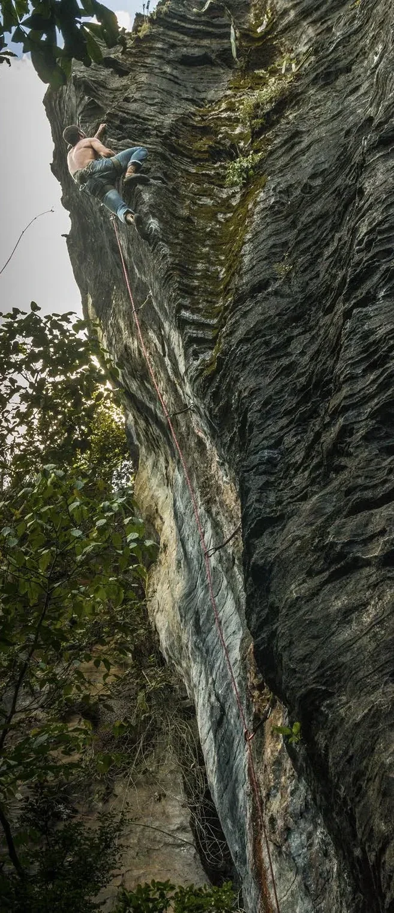
      - **mapas**:
        - **[0]**:
          - **caminho_imagem_mapa**: 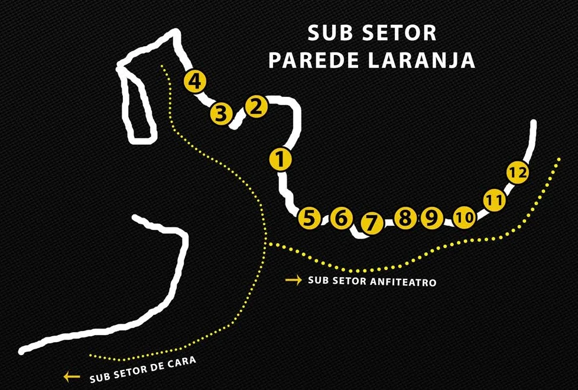
          - **largura_mapa**: 978
          - **altura_mapa**: 660
          - **pontos_de_interesse**:
            - **[0]**:
              - **id**: 0ZpLoeGL4zIgeE
              - **uid**: 0ZpLoeGL4zIgeE
              - **rotulo**: 1
              - **circulo**:
                - **x**: 475
                - **y**: 269
                - **raio**: 20
              - **label**: 1
            - **[1]**:
              - **id**: QbGfiZhFZoG2qO
              - **uid**: QbGfiZhFZoG2qO
              - **rotulo**: 2
              - **circulo**:
                - **x**: 434
                - **y**: 180
                - **raio**: 20
              - **label**: 2
            - **[2]**:
              - **id**: sxPTi5gs1I3yeK
              - **uid**: sxPTi5gs1I3yeK
              - **rotulo**: 3
              - **circulo**:
                - **x**: 375
                - **y**: 192
                - **raio**: 20
              - **label**: 3
            - **[3]**:
              - **id**: yIUsAKRddO2YJ7
              - **uid**: yIUsAKRddO2YJ7
              - **rotulo**: 4
              - **circulo**:
                - **x**: 330
                - **y**: 137
                - **raio**: 20
              - **label**: 4
            - **[4]**:
              - **id**: 0cTsjOt9sLUwkr
              - **uid**: 0cTsjOt9sLUwkr
              - **rotulo**: 5
              - **circulo**:
                - **x**: 524
                - **y**: 369
                - **raio**: 20
              - **label**: 5
            - **[5]**:
              - **id**: 2fBocVWxMYeYis
              - **uid**: 2fBocVWxMYeYis
              - **rotulo**: 6
              - **circulo**:
                - **x**: 578
                - **y**: 369
                - **raio**: 20
              - **label**: 6
            - **[6]**:
              - **id**: WWFBQnr12jxCwl
              - **uid**: WWFBQnr12jxCwl
              - **rotulo**: 7
              - **circulo**:
                - **x**: 630
                - **y**: 378
                - **raio**: 20
              - **label**: 7
            - **[7]**:
              - **id**: o11Z9JdNPGES95
              - **uid**: o11Z9JdNPGES95
              - **rotulo**: 8
              - **circulo**:
                - **x**: 686
                - **y**: 369
                - **raio**: 20
              - **label**: 8
            - **[8]**:
              - **id**: tKxkyoX4NjeDeY
              - **uid**: tKxkyoX4NjeDeY
              - **rotulo**: 9
              - **circulo**:
                - **x**: 731
                - **y**: 369
                - **raio**: 20
              - **label**: 9
            - **[9]**:
              - **id**: 6YTrcibKL8CNlE
              - **uid**: 6YTrcibKL8CNlE
              - **rotulo**: 10
              - **circulo**:
                - **x**: 786
                - **y**: 368
                - **raio**: 20
              - **label**: 10
            - **[10]**:
              - **id**: ONJkLnIwP2Y2nX
              - **uid**: ONJkLnIwP2Y2nX
              - **rotulo**: 11
              - **circulo**:
                - **x**: 837
                - **y**: 339
                - **raio**: 20
              - **label**: 11
            - **[11]**:
              - **id**: zU1bkMg05g4zOT
              - **uid**: zU1bkMg05g4zOT
              - **rotulo**: 12
              - **circulo**:
                - **x**: 876
                - **y**: 292
                - **raio**: 20
              - **label**: 12
            - **[12]**:
              - **id**: eSReHnuf0mycQp
              - **uid**: eSReHnuf0mycQp
              - **rotulo**: SUB SETOR ANFITEATRO →
              - **retangulo**:
                - **x**: 628
                - **y**: 476
                - **comprimento**: 221
                - **largura**: 23
                - **angulo_graus_x100**: 114
              - **label**: SUB SETOR ANFITEATRO →
            - **[13]**:
              - **id**: OQH4aZaKkghh6F
              - **uid**: OQH4aZaKkghh6F
              - **rotulo**: SUB SETOR DE CARA ↙
              - **retangulo**:
                - **x**: 243
                - **y**: 622
                - **comprimento**: 200
                - **largura**: 30
                - **angulo_graus_x100**: -1211
              - **label**: SUB SETOR DE CARA ↙
          - **referencias**:
            - **[0]**:
              - **alvo_uid**: YwtAF69xeT5xr4
              - **pontos_uids**:
                - 0ZpLoeGL4zIgeE
              - **escalada**: Interação Nativa
              - **ids**:
                - 0ZpLoeGL4zIgeE
            - **[1]**:
              - **alvo_uid**: UIJLoSDt00v645
              - **pontos_uids**:
                - QbGfiZhFZoG2qO
              - **escalada**: Trabalhador Brasileiro
              - **ids**:
                - QbGfiZhFZoG2qO
            - **[2]**:
              - **alvo_uid**: 0z5bu4BiSof2iH
              - **pontos_uids**:
                - sxPTi5gs1I3yeK
              - **escalada**: Quebrando O Silêncio
              - **ids**:
                - sxPTi5gs1I3yeK
            - **[3]**:
              - **alvo_uid**: 1N81wmBjqD4cVP
              - **pontos_uids**:
                - yIUsAKRddO2YJ7
              - **escalada**: Laranja Mecânica
              - **ids**:
                - yIUsAKRddO2YJ7
            - **[4]**:
              - **alvo_uid**: I8JFyCTHMs43Dj
              - **pontos_uids**:
                - 0cTsjOt9sLUwkr
              - **escalada**: Jardineiro
              - **ids**:
                - 0cTsjOt9sLUwkr
            - **[5]**:
              - **alvo_uid**: lFa4RRQ2Cmahid
              - **pontos_uids**:
                - 2fBocVWxMYeYis
              - **escalada**: Escovação
              - **ids**:
                - 2fBocVWxMYeYis
            - **[6]**:
              - **alvo_uid**: wWhtYhrJwIZj1w
              - **pontos_uids**:
                - WWFBQnr12jxCwl
              - **escalada**: Ataque em Massa
              - **ids**:
                - WWFBQnr12jxCwl
            - **[7]**:
              - **alvo_uid**: uHxXqkNwWN1nBz
              - **pontos_uids**:
                - o11Z9JdNPGES95
              - **escalada**: Zelador
              - **ids**:
                - o11Z9JdNPGES95
            - **[8]**:
              - **alvo_uid**: MEMDjckwEvDna9
              - **pontos_uids**:
                - tKxkyoX4NjeDeY
              - **escalada**: Faxina Russa
              - **ids**:
                - tKxkyoX4NjeDeY
            - **[9]**:
              - **alvo_uid**: cVlQUykJ1Y0kUM
              - **pontos_uids**:
                - 6YTrcibKL8CNlE
              - **escalada**: Mandela
              - **ids**:
                - 6YTrcibKL8CNlE
            - **[10]**:
              - **alvo_uid**: ASE9GqOX1HPgc1
              - **pontos_uids**:
                - ONJkLnIwP2Y2nX
              - **escalada**: Patriotas Hipócritas
              - **ids**:
                - ONJkLnIwP2Y2nX
            - **[11]**:
              - **alvo_uid**: QY4WBgBK5o59Gf
              - **pontos_uids**:
                - zU1bkMg05g4zOT
              - **escalada**: Dr. Máquina
              - **ids**:
                - zU1bkMg05g4zOT
            - **[12]**:
              - **alvo_uid**: jwrhx8dZTo5fU7
              - **pontos_uids**:
                - OQH4aZaKkghh6F
              - **setor**: Sub Setor de Cara
              - **ids**:
                - OQH4aZaKkghh6F
            - **[13]**:
              - **alvo_uid**: N96kFSUPO2TSfE
              - **pontos_uids**:
                - eSReHnuf0mycQp
              - **setor**: Sub Setor Anfiteatro
              - **ids**:
                - eSReHnuf0mycQp
      - **escaladas**:
        - **[0]**:
          - **uid**: YwtAF69xeT5xr4
          - **via_esportiva**:
            - **nome**: Interação Nativa
            - **dificuldade**: BR_5SUP
            - **quantidade_protecoes_intermediarias**: 8
            - **quantidade_protecoes_parada**: 1
        - **[1]**:
          - **uid**: UIJLoSDt00v645
          - **via_esportiva**:
            - **nome**: Trabalhador Brasileiro
            - **dificuldade**: BR_7A
            - **quantidade_protecoes_intermediarias**: 8
            - **quantidade_protecoes_parada**: 1
        - **[2]**:
          - **uid**: 0z5bu4BiSof2iH
          - **via_esportiva**:
            - **nome**: Quebrando O Silêncio
            - **dificuldade**: BR_8B
            - **quantidade_protecoes_intermediarias**: 9
            - **quantidade_protecoes_parada**: 2
        - **[3]**:
          - **uid**: 1N81wmBjqD4cVP
          - **via_esportiva**:
            - **nome**: Laranja Mecânica
            - **dificuldade**: PROJETO
            - **quantidade_protecoes_intermediarias**: 10
            - **quantidade_protecoes_parada**: 2
        - **[4]**:
          - **uid**: I8JFyCTHMs43Dj
          - **via_esportiva**:
            - **nome**: Jardineiro
            - **dificuldade**: BR_5
            - **quantidade_protecoes_intermediarias**: 3
            - **quantidade_protecoes_parada**: 1
        - **[5]**:
          - **uid**: lFa4RRQ2Cmahid
          - **via_esportiva**:
            - **nome**: Escovação
            - **dificuldade**: BR_5
            - **quantidade_protecoes_intermediarias**: 3
            - **quantidade_protecoes_parada**: 1
        - **[6]**:
          - **uid**: wWhtYhrJwIZj1w
          - **via_esportiva**:
            - **nome**: Ataque em Massa
            - **dificuldade**: BR_6SUP
            - **quantidade_protecoes_intermediarias**: 4
            - **quantidade_protecoes_parada**: 1
        - **[7]**:
          - **uid**: uHxXqkNwWN1nBz
          - **via_esportiva**:
            - **nome**: Zelador
            - **dificuldade**: BR_7A
            - **quantidade_protecoes_intermediarias**: 4
            - **quantidade_protecoes_parada**: 2
        - **[8]**:
          - **uid**: MEMDjckwEvDna9
          - **via_esportiva**:
            - **nome**: Faxina Russa
            - **dificuldade**: BR_6SUP
            - **quantidade_protecoes_intermediarias**: 5
            - **quantidade_protecoes_parada**: 1
        - **[9]**:
          - **uid**: cVlQUykJ1Y0kUM
          - **via_esportiva**:
            - **nome**: Mandela
            - **dificuldade**: BR_6
            - **quantidade_protecoes_intermediarias**: 4
            - **quantidade_protecoes_parada**: 1
        - **[10]**:
          - **uid**: ASE9GqOX1HPgc1
          - **via_esportiva**:
            - **nome**: Patriotas Hipócritas
            - **dificuldade**: BR_7B
            - **quantidade_protecoes_intermediarias**: 4
            - **quantidade_protecoes_parada**: 2
        - **[11]**:
          - **uid**: QY4WBgBK5o59Gf
          - **via_esportiva**:
            - **nome**: Dr. Máquina
            - **dificuldade**: BR_6SUP
            - **quantidade_protecoes_intermediarias**: 4
            - **quantidade_protecoes_parada**: 1
      - **precomputados**:
        - **total_escaladas**: 12
        - **total_esportivas**: 12
  - **[2]**:
    - **conteudo**:
      - **descricao**: # Setor Vale Oculto - Sub Setor Anfiteatro
      - **nome**: Sub Setor Anfiteatro
      - **uid**: N96kFSUPO2TSfE
      - **caminho_imagem_capa**: 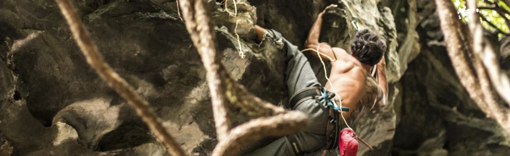
      - **mapas**:
        - **[0]**:
          - **caminho_imagem_mapa**: 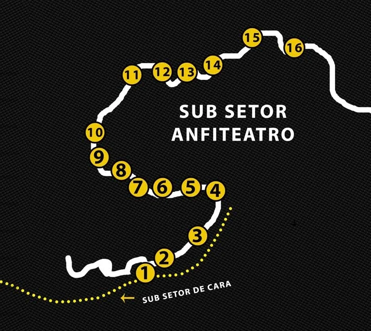
          - **largura_mapa**: 752
          - **altura_mapa**: 671
          - **pontos_de_interesse**:
            - **[0]**:
              - **id**: iEkcxcK0DMBWno
              - **uid**: iEkcxcK0DMBWno
              - **rotulo**: 1
              - **circulo**:
                - **x**: 295
                - **y**: 553
                - **raio**: 20
              - **label**: 1
            - **[1]**:
              - **id**: v3b5xPoUrlHbP4
              - **uid**: v3b5xPoUrlHbP4
              - **rotulo**: 2
              - **circulo**:
                - **x**: 333
                - **y**: 523
                - **raio**: 20
              - **label**: 2
            - **[2]**:
              - **id**: GWa6vKQYrgg1IH
              - **uid**: GWa6vKQYrgg1IH
              - **rotulo**: 3
              - **circulo**:
                - **x**: 401
                - **y**: 478
                - **raio**: 20
              - **label**: 3
            - **[3]**:
              - **id**: fIzNBGgVbmUX1b
              - **uid**: fIzNBGgVbmUX1b
              - **rotulo**: 4
              - **circulo**:
                - **x**: 438
                - **y**: 386
                - **raio**: 20
              - **label**: 4
            - **[4]**:
              - **id**: eU5gNJVc8sbCMc
              - **uid**: eU5gNJVc8sbCMc
              - **rotulo**: 5
              - **circulo**:
                - **x**: 387
                - **y**: 380
                - **raio**: 20
              - **label**: 5
            - **[5]**:
              - **id**: BbE2N9A7uTz0g2
              - **uid**: BbE2N9A7uTz0g2
              - **rotulo**: 6
              - **circulo**:
                - **x**: 330
                - **y**: 380
                - **raio**: 20
              - **label**: 6
            - **[6]**:
              - **id**: o4d9UYzMyQOa3o
              - **uid**: o4d9UYzMyQOa3o
              - **rotulo**: 7
              - **circulo**:
                - **x**: 280
                - **y**: 380
                - **raio**: 20
              - **label**: 7
            - **[7]**:
              - **id**: EYbb7MpZAKSt4W
              - **uid**: EYbb7MpZAKSt4W
              - **rotulo**: 8
              - **circulo**:
                - **x**: 246
                - **y**: 345
                - **raio**: 20
              - **label**: 8
            - **[8]**:
              - **id**: 7mMHADZJ3LOZpv
              - **uid**: 7mMHADZJ3LOZpv
              - **rotulo**: 9
              - **circulo**:
                - **x**: 201
                - **y**: 319
                - **raio**: 20
              - **label**: 9
            - **[9]**:
              - **id**: fYEV51ECXBhQZf
              - **uid**: fYEV51ECXBhQZf
              - **rotulo**: 10
              - **circulo**:
                - **x**: 193
                - **y**: 269
                - **raio**: 20
              - **label**: 10
            - **[10]**:
              - **id**: kJVdBHdaxD67O5
              - **uid**: kJVdBHdaxD67O5
              - **rotulo**: 11
              - **circulo**:
                - **x**: 268
                - **y**: 151
                - **raio**: 20
              - **label**: 11
            - **[11]**:
              - **id**: Sy64zP0O5VIXOa
              - **uid**: Sy64zP0O5VIXOa
              - **rotulo**: 12
              - **circulo**:
                - **x**: 329
                - **y**: 146
                - **raio**: 20
              - **label**: 12
            - **[12]**:
              - **id**: gS5QbfzZlt0pom
              - **uid**: gS5QbfzZlt0pom
              - **rotulo**: 13
              - **circulo**:
                - **x**: 379
                - **y**: 146
                - **raio**: 20
              - **label**: 13
            - **[13]**:
              - **id**: XNqLAVFcosVZqD
              - **uid**: XNqLAVFcosVZqD
              - **rotulo**: 14
              - **circulo**:
                - **x**: 432
                - **y**: 132
                - **raio**: 20
              - **label**: 14
            - **[14]**:
              - **id**: uQuwmlyVpGMMGh
              - **uid**: uQuwmlyVpGMMGh
              - **rotulo**: 15
              - **circulo**:
                - **x**: 511
                - **y**: 76
                - **raio**: 20
              - **label**: 15
            - **[15]**:
              - **id**: 6A0ccSXhx3xlgN
              - **uid**: 6A0ccSXhx3xlgN
              - **rotulo**: 16
              - **circulo**:
                - **x**: 597
                - **y**: 97
                - **raio**: 20
              - **label**: 16
            - **[16]**:
              - **id**: fX98VBxWNwQTzs
              - **uid**: fX98VBxWNwQTzs
              - **rotulo**: SUB SETOR DE CARA ↗
              - **retangulo**:
                - **x**: 380
                - **y**: 592
                - **comprimento**: 196
                - **largura**: 31
                - **angulo_graus_x100**: -1091
              - **label**: SUB SETOR DE CARA ↗
          - **referencias**:
            - **[0]**:
              - **alvo_uid**: 50qpMQkwluF2iy
              - **pontos_uids**:
                - iEkcxcK0DMBWno
              - **escalada**: A Cara do Tia
              - **ids**:
                - iEkcxcK0DMBWno
            - **[1]**:
              - **alvo_uid**: tTZ0BY9ZrJJrME
              - **pontos_uids**:
                - v3b5xPoUrlHbP4
              - **escalada**: Pedra no Caminho
              - **ids**:
                - v3b5xPoUrlHbP4
            - **[2]**:
              - **alvo_uid**: OW7xvzq11x4EVy
              - **pontos_uids**:
                - GWa6vKQYrgg1IH
              - **escalada**: Hora Marcada
              - **ids**:
                - GWa6vKQYrgg1IH
            - **[3]**:
              - **alvo_uid**: BBfvFk5lmO3oRT
              - **pontos_uids**:
                - fIzNBGgVbmUX1b
              - **escalada**: Funcionário do Mês
              - **ids**:
                - fIzNBGgVbmUX1b
            - **[4]**:
              - **alvo_uid**: hddwHJ16FyVaDu
              - **pontos_uids**:
                - eU5gNJVc8sbCMc
              - **escalada**: Mancha Preta
              - **ids**:
                - eU5gNJVc8sbCMc
            - **[5]**:
              - **alvo_uid**: Yz3hoWFyaEtP2a
              - **pontos_uids**:
                - BbE2N9A7uTz0g2
              - **escalada**: Recepção Venenosa
              - **ids**:
                - BbE2N9A7uTz0g2
            - **[6]**:
              - **alvo_uid**: K34S4jOx8u40JR
              - **pontos_uids**:
                - o4d9UYzMyQOa3o
              - **escalada**: Achados e Perdidos
              - **ids**:
                - o4d9UYzMyQOa3o
            - **[7]**:
              - **alvo_uid**: r7bOEJxRjeQmDL
              - **pontos_uids**:
                - EYbb7MpZAKSt4W
              - **escalada**: Pelotão de Elite
              - **ids**:
                - EYbb7MpZAKSt4W
            - **[8]**:
              - **alvo_uid**: rKKZxs1RikJkfg
              - **pontos_uids**:
                - fYEV51ECXBhQZf
              - **escalada**: Dono do Pico
              - **ids**:
                - fYEV51ECXBhQZf
            - **[9]**:
              - **alvo_uid**: YJt4y7ScRy5Q5H
              - **pontos_uids**:
                - kJVdBHdaxD67O5
              - **escalada**: Tio Certeiro
              - **ids**:
                - kJVdBHdaxD67O5
            - **[10]**:
              - **alvo_uid**: upqkR1QvIhg28M
              - **pontos_uids**:
                - Sy64zP0O5VIXOa
              - **escalada**: Tios Goró
              - **ids**:
                - Sy64zP0O5VIXOa
            - **[11]**:
              - **alvo_uid**: ciTDTOBYUZ4Xg3
              - **pontos_uids**:
                - gS5QbfzZlt0pom
              - **escalada**: Tioradentes
              - **ids**:
                - gS5QbfzZlt0pom
            - **[12]**:
              - **alvo_uid**: G3aqF8LwfqLYVX
              - **pontos_uids**:
                - XNqLAVFcosVZqD
              - **escalada**: Tios D'Jah
              - **ids**:
                - XNqLAVFcosVZqD
            - **[13]**:
              - **alvo_uid**: SEgtuDh2JA7efn
              - **pontos_uids**:
                - uQuwmlyVpGMMGh
              - **escalada**: Velho Tio
              - **ids**:
                - uQuwmlyVpGMMGh
            - **[14]**:
              - **alvo_uid**: WkAZF7VlcvXrtu
              - **pontos_uids**:
                - 6A0ccSXhx3xlgN
              - **escalada**: Tio Tonhas
              - **ids**:
                - 6A0ccSXhx3xlgN
            - **[15]**:
              - **alvo_uid**: jwrhx8dZTo5fU7
              - **pontos_uids**:
                - fX98VBxWNwQTzs
              - **setor**: Sub Setor de Cara
              - **ids**:
                - fX98VBxWNwQTzs
      - **escaladas**:
        - **[0]**:
          - **uid**: 50qpMQkwluF2iy
          - **via_esportiva**:
            - **nome**: A Cara do Tia
            - **dificuldade**: BR_6SUP
            - **quantidade_protecoes_intermediarias**: 6
            - **quantidade_protecoes_parada**: 2
        - **[1]**:
          - **uid**: tTZ0BY9ZrJJrME
          - **via_esportiva**:
            - **nome**: Pedra no Caminho
            - **dificuldade**: BR_7A
            - **quantidade_protecoes_intermediarias**: 3
            - **quantidade_protecoes_parada**: 2
        - **[2]**:
          - **uid**: OW7xvzq11x4EVy
          - **via_esportiva**:
            - **nome**: Hora Marcada
            - **dificuldade**: BR_6
            - **quantidade_protecoes_intermediarias**: 3
            - **quantidade_protecoes_parada**: 1
        - **[3]**:
          - **uid**: BBfvFk5lmO3oRT
          - **via_esportiva**:
            - **nome**: Funcionário do Mês
            - **dificuldade**: BR_6SUP
            - **quantidade_protecoes_intermediarias**: 4
            - **quantidade_protecoes_parada**: 2
        - **[4]**:
          - **uid**: hddwHJ16FyVaDu
          - **via_esportiva**:
            - **nome**: Mancha Preta
            - **dificuldade**: BR_7B
            - **quantidade_protecoes_intermediarias**: 6
            - **quantidade_protecoes_parada**: 2
        - **[5]**:
          - **uid**: Yz3hoWFyaEtP2a
          - **via_esportiva**:
            - **nome**: Recepção Venenosa
            - **dificuldade**: BR_7A
            - **quantidade_protecoes_intermediarias**: 4
            - **quantidade_protecoes_parada**: 2
        - **[6]**:
          - **uid**: K34S4jOx8u40JR
          - **via_esportiva**:
            - **nome**: Achados e Perdidos
            - **dificuldade**: BR_6SUP
            - **quantidade_protecoes_intermediarias**: 6
            - **quantidade_protecoes_parada**: 2
        - **[7]**:
          - **uid**: r7bOEJxRjeQmDL
          - **via_esportiva**:
            - **nome**: Pelotão de Elite
            - **dificuldade**: BR_6SUP
            - **quantidade_protecoes_intermediarias**: 5
            - **quantidade_protecoes_parada**: 2
        - **[8]**:
          - **uid**: rKKZxs1RikJkfg
          - **via_esportiva**:
            - **nome**: Dono do Pico
            - **dificuldade**: BR_7C
            - **quantidade_protecoes_intermediarias**: 8
            - **quantidade_protecoes_parada**: 2
        - **[9]**:
          - **uid**: YJt4y7ScRy5Q5H
          - **via_esportiva**:
            - **nome**: Tio Certeiro
            - **dificuldade**: BR_6
            - **quantidade_protecoes_intermediarias**: 5
            - **quantidade_protecoes_parada**: 2
        - **[10]**:
          - **uid**: upqkR1QvIhg28M
          - **via_esportiva**:
            - **nome**: Tios Goró
            - **dificuldade**: BR_6
            - **quantidade_protecoes_intermediarias**: 5
            - **quantidade_protecoes_parada**: 2
        - **[11]**:
          - **uid**: ciTDTOBYUZ4Xg3
          - **via_esportiva**:
            - **nome**: Tioradentes
            - **dificuldade**: BR_6
            - **quantidade_protecoes_intermediarias**: 5
            - **quantidade_protecoes_parada**: 2
        - **[12]**:
          - **uid**: G3aqF8LwfqLYVX
          - **via_esportiva**:
            - **nome**: Tios D'Jah
            - **dificuldade**: BR_6SUP
            - **quantidade_protecoes_intermediarias**: 6
            - **quantidade_protecoes_parada**: 2
        - **[13]**:
          - **uid**: SEgtuDh2JA7efn
          - **via_esportiva**:
            - **nome**: Velho Tio
            - **dificuldade**: BR_6SUP
            - **quantidade_protecoes_intermediarias**: 5
            - **quantidade_protecoes_parada**: 2
        - **[14]**:
          - **uid**: WkAZF7VlcvXrtu
          - **via_esportiva**:
            - **nome**: Tio Tonhas
            - **dificuldade**: BR_6SUP
            - **quantidade_protecoes_intermediarias**: 6
            - **quantidade_protecoes_parada**: 1
      - **precomputados**:
        - **total_escaladas**: 15
        - **total_esportivas**: 15
- **precomputados**:
  - **total_escaladas**: 32
  - **total_esportivas**: 32

## Arquivos Externos

- **arquivos_externos**:
  - **[0]**:
    - **caminho**: 
    - **checksum_sha256**: 726e932831b4baa61931df02ed761202e50ab989afd52b0f0bdb0940bd053b02
  - **[1]**:
    - **caminho**: 
    - **checksum_sha256**: ac33891f4198021148c737e76c5080369113ddafb3e1f9801e9a2c6c3a1a8798
  - **[2]**:
    - **caminho**: 
    - **checksum_sha256**: 242293db56ac2ac2cd4909e16c2ab224fd7c5877c1e9beb0082a16831d1e4d08
  - **[3]**:
    - **caminho**: 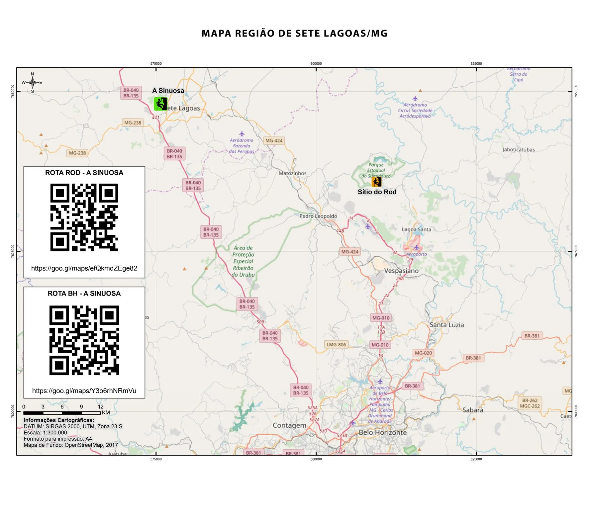
    - **checksum_sha256**: d6dc71d018a0168e2d2bd9ff89013002a85a74880740cf82e7d519bbdeccc5fc
  - **[4]**:
    - **caminho**: 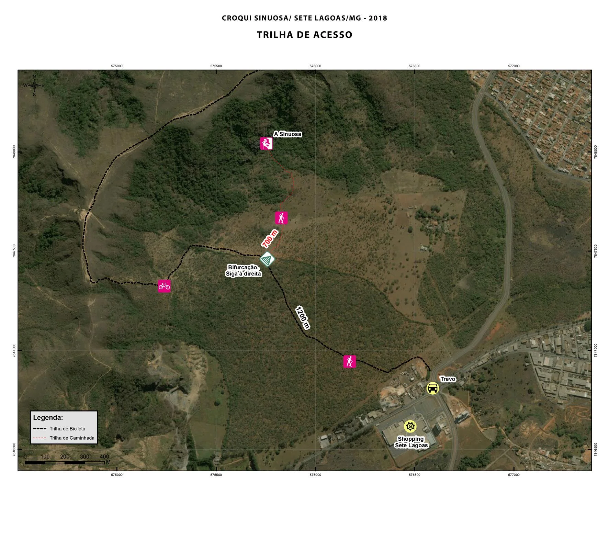
    - **checksum_sha256**: afe1b2c527bf1c937040f0e4a2b9083fcf8338f9facdb0f16663773db9f2c3ee
  - **[5]**:
    - **caminho**: 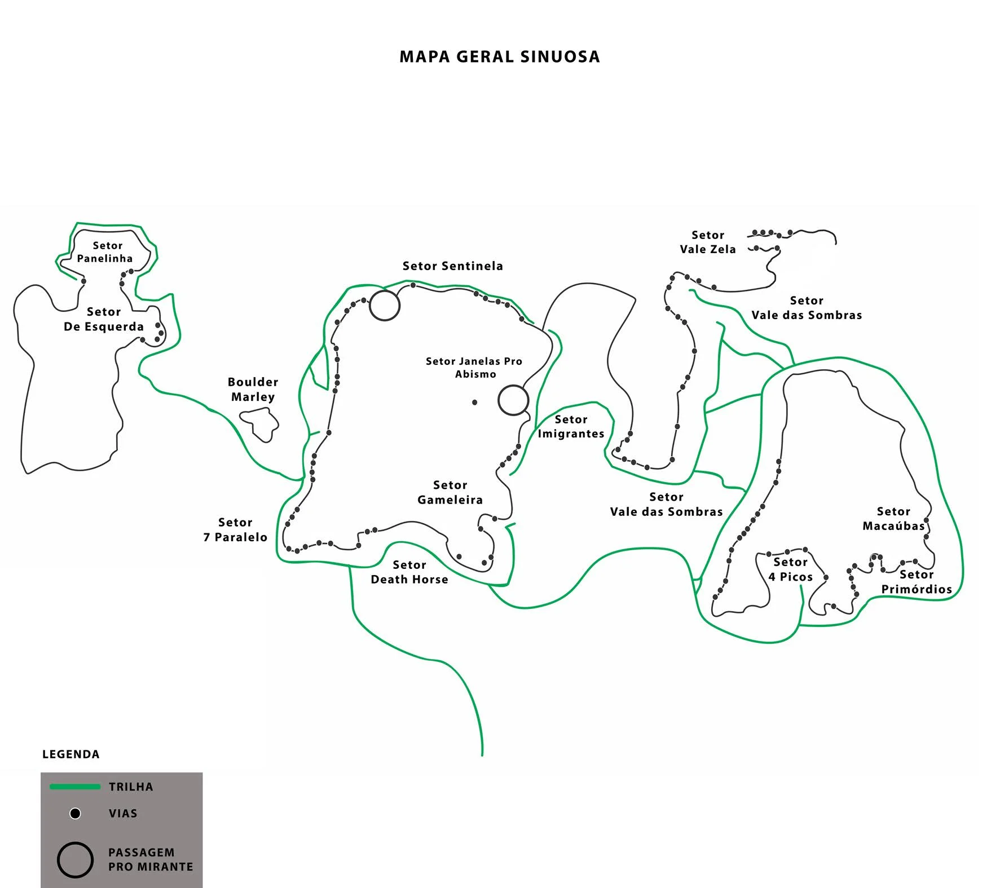
    - **checksum_sha256**: 2c9a58d34d460f68d664e7ee49881beaaf97daf09c5780bd55e524159fd51f54
  - **[6]**:
    - **caminho**: 
    - **checksum_sha256**: 04bf6771127f68cdaf7a3ccdb25a9a166a9c0bf946a0d169e96d5d7effbea8e5
  - **[7]**:
    - **caminho**: 
    - **checksum_sha256**: 26f8714410aac3bd99475307e38cc9e6a5798e0813dafb4bf4f437625d10ba6d
  - **[8]**:
    - **caminho**: 
    - **checksum_sha256**: e2611b1dd7bf66bbf46e233d00c21a49eda304d50a9d34cdd4e252764d52744a
  - **[9]**:
    - **caminho**: 
    - **checksum_sha256**: 880b143aa8d94a70fd189f2628c38de7e4a399b183a8665361cd18219d4a36e7
  - **[10]**:
    - **caminho**: 
    - **checksum_sha256**: b38ffcb2bba799acd6006356559aec98f2af017df5c5a83adf3f94a7fb10c967
  - **[11]**:
    - **caminho**: 
    - **checksum_sha256**: 94a33e9451eb5b7e48498603022d8ff2c2aea67a073819f235b2f83d797fea9c
  - **[12]**:
    - **caminho**: 
    - **checksum_sha256**: da677eb0276b82d98482b2a03f5440e79c95b571aa461af16cd3cb0bc3284c3c
  - **[13]**:
    - **caminho**: 
    - **checksum_sha256**: 94453b0a37bd267563c11037b2792fdd8129cff564f008f45271d47e723e7d31
  - **[14]**:
    - **caminho**: 
    - **checksum_sha256**: 41a44f0ae119d6004e88427a9a93126029d271595a380b382e46702b62438342
  - **[15]**:
    - **caminho**: 
    - **checksum_sha256**: 778a002f6254f011b5ff2b9f0eb0c0edf626af7b30a963daed25d5a3c9c4b7f8
  - **[16]**:
    - **caminho**: 
    - **checksum_sha256**: b4a97a62b6aba29129715cced05500d9dd1e7d8d4184218365bc25ada7d9c1c0
  - **[17]**:
    - **caminho**: 
    - **checksum_sha256**: a969dc5f3a1277f20f4fb67d115ae7155c738cdcfb78c3bcb710c3fd84880d53
  - **[18]**:
    - **caminho**: 
    - **checksum_sha256**: 0515b72272721e9dd939a45099d98a1d2e0ca73da0b5981479b3f2d4fee7f2fb
  - **[19]**:
    - **caminho**: 
    - **checksum_sha256**: 8740659abb98efe5487787583fc1e5d819724bda9dc960b5de901aa787d8eff8
  - **[20]**:
    - **caminho**: 
    - **checksum_sha256**: 67d71b4458137ab5695be7b5331a78a0ff480f7a7963a740637b944b502d1bf4
  - **[21]**:
    - **caminho**: 
    - **checksum_sha256**: 88cec07d27eea0ed34638ec717bb6128b94aa1da61770ab4fa69129bb4b670ad
  - **[22]**:
    - **caminho**: 
    - **checksum_sha256**: bf539ff7a007288bcbe0394505515b469f28c6b0f094c4f50d92f6b059adc286
  - **[23]**:
    - **caminho**: 
    - **checksum_sha256**: 931c57b1dc14bfc40802f81eaf7caa2c800779c453ba1f4412e06c7656a4f644
  - **[24]**:
    - **caminho**: 
    - **checksum_sha256**: c1737ee3a603494743f0336ed663f87e290cd03e3fe434cee471c005dcd032fd
  - **[25]**:
    - **caminho**: 
    - **checksum_sha256**: 31d892315d5c92dc46e1de2cf595c585990a8047b64d077333baf453c707036d
  - **[26]**:
    - **caminho**: 
    - **checksum_sha256**: 2c248cb40a0f2d445a9ee145e5795f202ece5ecdf55c495b9d09c96ae07e7f43
  - **[27]**:
    - **caminho**: 
    - **checksum_sha256**: 4409dbb50221ba5ef959e50de3edfcf4c78f8a482cc360061babb68de98016f0
  - **[28]**:
    - **caminho**: 
    - **checksum_sha256**: bbeec037fad97983096efbb191e70be5740957f9128c40afe003748073e730c6
  - **[29]**:
    - **caminho**: 
    - **checksum_sha256**: 6bf5a5e97783477aa693f465c07d3259a9ffb6d8c21b1ff6b570602edbef5b26
  - **[30]**:
    - **caminho**: 
    - **checksum_sha256**: 75c24f6a1f5703b55d9c16f4f35d71f09e1c4e6bc63db2736fbc13569f785c24
  - **[31]**:
    - **caminho**: 
    - **checksum_sha256**: 0615c9ba27e485e1a2a796252256c739672ad8ea5a09d91c72a5bbdaeaf2c563
  - **[32]**:
    - **caminho**: 
    - **checksum_sha256**: 895d5d6bd7a82ce2f821395f2458ceda70af8af5727bbead831e9bfb662325d7
  - **[33]**:
    - **caminho**: 
    - **checksum_sha256**: c1138b4fcc69962fdd779773430f6b978d6ca08d71a9c9b4eab89bc100cf7bee
  - **[34]**:
    - **caminho**: 
    - **checksum_sha256**: a9f796ac1a40823ea0455a8412e9dfebc9ca18135ec2704c54a47bf32b387561
  - **[35]**:
    - **caminho**: 
    - **checksum_sha256**: 83c3d1ee891adba8a36fb00bc710da03bb3c72ca9152e4141758363031156471
  - **[36]**:
    - **caminho**: 
    - **checksum_sha256**: 19d7794a801ba0ab72e339da1ca9bfa5dcb398cb9e88f10f49737d9359634261
  - **[37]**:
    - **caminho**: 
    - **checksum_sha256**: c0c06eb5a3a20499148717361a40ee8a5d333a9f4219eda85cd96cfcdb6f8786
  - **[38]**:
    - **caminho**: 
    - **checksum_sha256**: 7e2715763c82deedd52c81a001dac19c57a5d5c110daabc50f0954d75c08ce30
  - **[39]**:
    - **caminho**: 
    - **checksum_sha256**: 00bb7c4e8b230e9203a8013940a00d908994efb769f9c3ccccd40e2c62293794
  - **[40]**:
    - **caminho**: 
    - **checksum_sha256**: 05b3a0aec2f0a4d300c024f2f9def8411e0f26a42c29767b7ef97802adc6201f
  - **[41]**:
    - **caminho**: 
    - **checksum_sha256**: bb9e3918738292918763c5bff0b0ac949e699a4613056e48c98a0c0055a561f6
  - **[42]**:
    - **caminho**: 
    - **checksum_sha256**: 72a755f4496081b8dfa6df689e22f9387b6557c9f321afe3674e3ceb4d1ad86c
  - **[43]**:
    - **caminho**: 
    - **checksum_sha256**: 0683891f1fdcafaaeaa85cee7d850b66fff02e1a2009c150c755f4afb48900c9
  - **[44]**:
    - **caminho**: 
    - **checksum_sha256**: 78d662c020d503bf45c5163e41594017becc821f3b4300f2afcb4ef8c1dc1938
  - **[45]**:
    - **caminho**: 
    - **checksum_sha256**: ba9f48da5900eecf26f1a369638b542db633ba7bd82409eca81705fa6561ded5
  - **[46]**:
    - **caminho**: 
    - **checksum_sha256**: 86565029265d94021d06744b344287595c9fab2618750d43967de543b803a6de
  - **[47]**:
    - **caminho**: 
    - **checksum_sha256**: a1e605f115d789b2881f024cf98e23b2e823cc106c0479c39831809d10094810
  - **[48]**:
    - **caminho**: 
    - **checksum_sha256**: 4467f820ea2909ab397334034f2d50df9f66d2c5e421fd8af388269bb4bb9c7e
  - **[49]**:
    - **caminho**: 
    - **checksum_sha256**: d4f86d0b5001fe48aa9c246b5320b95a9096cf759691bce4eafab814a00d3823
  - **[50]**:
    - **caminho**: 
    - **checksum_sha256**: fc3e4b490888236b4e740800928718a1275fa9549fa12ca7a1b8f07b4c2eb310
  - **[51]**:
    - **caminho**: 
    - **checksum_sha256**: 175e2a74b4d8c81863424cd5f312ad907425bd2100cbfb38ccdc381e54c55bf5
  - **[52]**:
    - **caminho**: 
    - **checksum_sha256**: 23ce02c8a7e0977a8cfe4dccf8939b0065d783d0f0b0307e4cc5482d1139d146
  - **[53]**:
    - **caminho**: 
    - **checksum_sha256**: fa37a8141db8c044789367904bfbccc8d51c6aebf2082a384aa037d6d5d2bc0b
  - **[54]**:
    - **caminho**: 
    - **checksum_sha256**: 2ea956ba5c4f46530c8fb6514e34c7f60204f70d1b3ba7a738fdadbb169bcf98
  - **[55]**:
    - **caminho**: 
    - **checksum_sha256**: 5b616b889ff927ed0913a651eb90c581011e38671a5be227c870f9ef2a2c1797
  - **[56]**:
    - **caminho**: 
    - **checksum_sha256**: a94420a135d0a0866a7a9b3adbd0ac78f30e2e223ae00615ec9ba17b53566446
  - **[57]**:
    - **caminho**: 
    - **checksum_sha256**: 6ed6fe4fe56ff05ead526ea847c375ca305755846da3c259c0268b66d7c480d5
  - **[58]**:
    - **caminho**: 
    - **checksum_sha256**: 19bd3a36a84e04924e226b0977802d21862852f09a9a573ae89b3016d16ce9b5
  - **[59]**:
    - **caminho**: 
    - **checksum_sha256**: ddd9a200ea5b6dca267ed2ab15135e387663b02ff2cf5ab01f56f62fa22845b7
  - **[60]**:
    - **caminho**: 
    - **checksum_sha256**: 67074b10d3c48ae76b98aa0f780432cd7daa4efd4b4cdaae7f62bac9422dc50d
  - **[61]**:
    - **caminho**: 
    - **checksum_sha256**: c691a3d668fd943642c6e4a667634d949ecb99510eaddab97f147be0481a9f4d

