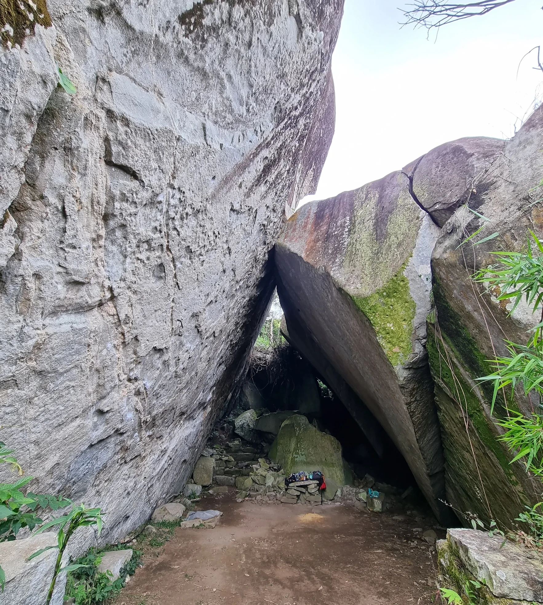
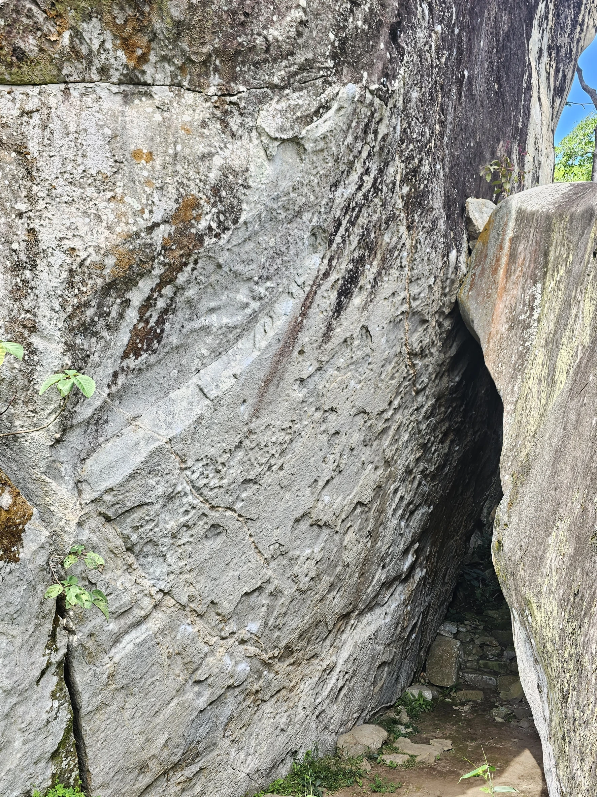
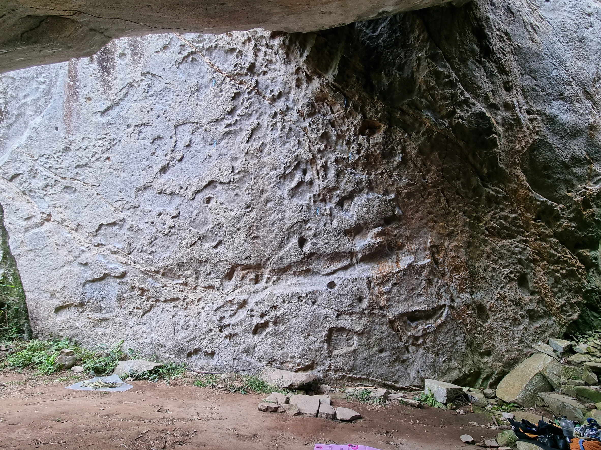
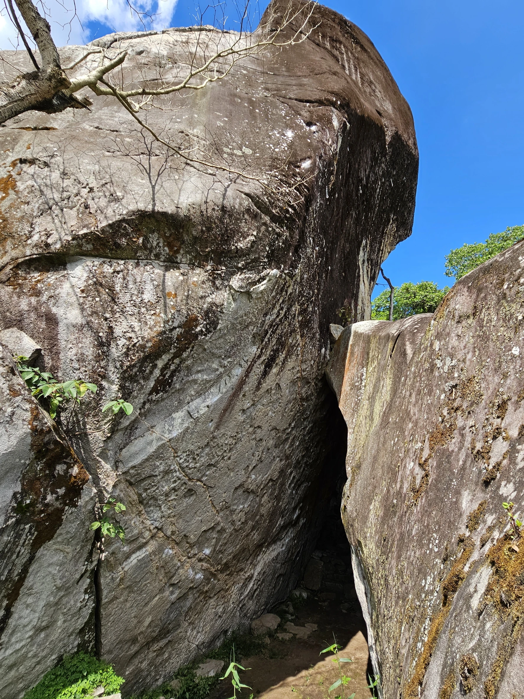
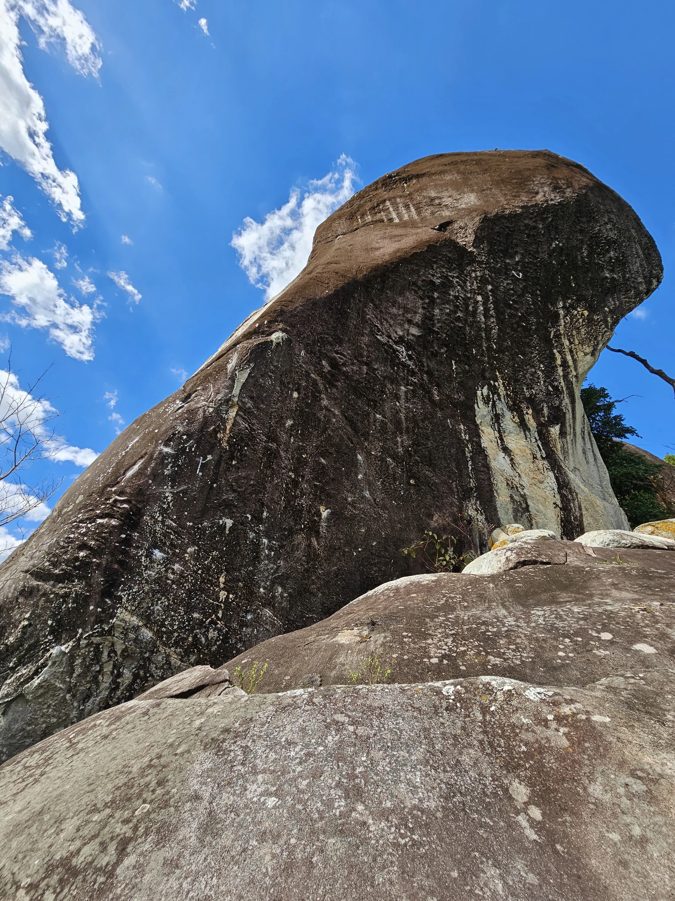

# Croqui: Capelinha

## Informações Gerais

- **descricao**: Setor Capelinha localizado entre os municipios de Nova Friburgo e Bom Jardim /RJ
- **id**: br_rj_nova_friburgobom_jardim_capelinha
- **nome**: Capelinha
- **ultima_migracao**: 4
- **caminho_thumbnail**: 
- **botoes**:
  - **[0]**:
    - **texto**: Recomendações
    - **destino**:
      - **secao_textual**:
        - **conteudo**:
            - Na parte de cima do setor, quando foram abertas as vias quebraram diversas agarras, mas ainda existe risco de quebrar alguma agarra que não foi utilizada. Desta forma recomendamos que o seg utilize capacete.
            
            - Ao estacionar o carro deixe a estrada o mais livre possível, o pessoal de extração de pedras passa com caminhão na estrada.
            
            - Em caso de lama, se não estiver com veículo 4x4 recomendamos que estacione antes da descida para o sertor em uma grande laje de pedra. Pois as vezes a subida fica bastante escorregadia.
            
            - Os moradores locais são bastante receptivos com os escaladores, sejam gentis com eles.
            
            - A trilha para a entrada do setor fica em uma porteira de arame, ao passar por baixo da porteira, pegue a trilha para a direita junto a cerca.
  - **[1]**:
    - **texto**: Como chegar
    - **destino**:
      - **secao_textual**:
        - **conteudo**: [Localização Google Maps](https://www.google.com/maps/place/22%C2%B013'43.3%22S+42%C2%B025'26.0%22W/@-22.228703,-42.423876,807m/data=!3m2!1e3!4b1!4m4!3m3!8m2!3d-22.228703!4d-42.423876!18m1!1e1?entry=ttu&g_ep=EgoyMDI2MDkyMC4wIKXMDSoASAFQAw%3D%3D)
  - **[2]**:
    - **texto**: Informações úteis
    - **destino**:
      - **secao_textual**:
        - **conteudo**:
            O melhor horário para escalar na capelinha é na parte da manhã que tem sombra em todas as vias.
            Na parte da tarde as vias de cima pegam sol e um pouco nas vias de baixo também (mas é possível continuar escalando).
            
            Em dias de chuva fraca da para escalar sem problemas, só molha quando chove bem forte.
            As vias secam bem rápido também após chuvas.
  - **[3]**:
    - **texto**: Comunidade
    - **destino**:
      - **secao_textual**:
        - **conteudo**: [Instagram @friburgo_climb](https://www.instagram.com/friburgo_climb?stkn=OHFmZnN4c2h5cmlt)
- **revisado_manualmente**: True
- **publicar_croqui**: True

## Parte: setor_de_baixo_caverna (não listada em partes.json)

### Setor (Pico: Capelinha)

- **descricao**:
    |  |
    | :--: |
    | *Visão Geral Capelinha* |
    
    É possível escalar nesse setor em dias de chuva fraca.
- **nome**: Setor principal
- **mapas**:
  - **[0]**:
    - **caminho_imagem_mapa**: 
    - **largura_mapa**: 1773
    - **altura_mapa**: 2364
    - **pontos_de_interesse**:
      - **[0]**:
        - **id**: linha_1
        - **label**: 
        - **linha**:
          - **estilo**: SOLIDO
          - **espessura**: 6
          - **compilado**:
            - **caminho_svg**: M 669 2069 C 670.7 2039.7, 684.7 2004.8, 674 1981 C 663.3 1957.2, 628.4 1946.7, 605 1926 C 578.5 1902.4, 548.0 1873.5, 524 1846 C 501.7 1820.4, 471.7 1794.0, 465 1767 C 459.3 1744.1, 466.5 1725.9, 476 1697 C 493.7 1642.9, 573.6 1544.4, 590 1476 C 602.7 1422.8, 574.4 1374.2, 589 1326 C 605.2 1272.4, 651.3 1228.1, 693 1172 C 747.1 1099.1, 854.9 1003.5, 891 929 C 915.7 877.9, 910.3 827.1, 923 785 C 933.3 750.8, 940.8 728.3, 958 694 C 983.2 643.9, 1051.5 577.0, 1069 518 C 1083.9 467.6, 1051.2 397.4, 1071 366 C 1085.9 342.4, 1124.7 340.2, 1148 328 C 1167.7 317.7, 1191.2 311.5, 1202 298 C 1211.0 286.8, 1209.6 274.8, 1214 257 C 1222.0 224.5, 1228.4 155.1, 1242 118 C 1252.0 90.7, 1265.0 71.2, 1279 51 C 1292.2 32.1, 1308.3 17.0, 1323 0
            - **caixa_delimitadora**:
              - **x**: 894
              - **y**: 1034
              - **comprimento**: 858
              - **largura**: 2069
            - **marcadores**:
              - **[0]**:
                - **tipo**: CIRCULO_IDENTIFICADOR
                - **x**: 669
                - **y**: 2069
                - **angulo_graus_x100**: -8675
                - **rotulo**: 1
              - **[1]**:
                - **tipo**: FIM_TOP
                - **x**: 1323
                - **y**: 0
                - **angulo_graus_x100**: -4921
                - **rotulo**: A
        - **cor**: #FF1744
      - **[1]**:
        - **id**: linha_2
        - **label**: 
        - **linha**:
          - **estilo**: SOLIDO
          - **espessura**: 6
          - **compilado**:
            - **caminho_svg**: M 701 2070 C 703.3 2045.3, 709.5 2021.8, 708 1996 C 706.4 1967.3, 689.0 1938.5, 689 1906 C 689.1 1867.5, 707.2 1823.9, 716 1780 C 725.6 1732.2, 740.8 1679.6, 744 1630 C 747.1 1582.0, 726.9 1535.9, 736 1487 C 746.5 1430.4, 789.1 1369.9, 815 1312 C 840.4 1255.2, 852.4 1187.2, 890 1143 C 926.3 1100.4, 1003.7 1092.3, 1034 1049 C 1063.9 1006.3, 1057.1 939.0, 1072 886 C 1086.5 834.4, 1104.7 785.1, 1122 735 C 1139.3 684.8, 1154.9 630.7, 1176 585 C 1195.1 543.5, 1229.4 514.7, 1241 471 C 1254.3 420.8, 1239.7 350.7, 1241 298 C 1242.1 253.5, 1236.9 213.5, 1247 175 C 1256.9 137.2, 1286.8 101.0, 1300 69 C 1310.4 43.9, 1315.3 23.0, 1323 0
            - **caixa_delimitadora**:
              - **x**: 1006
              - **y**: 1035
              - **comprimento**: 634
              - **largura**: 2070
            - **marcadores**:
              - **[0]**:
                - **tipo**: CIRCULO_IDENTIFICADOR
                - **x**: 701
                - **y**: 2070
                - **angulo_graus_x100**: -8460
                - **rotulo**: 2
              - **[1]**:
                - **tipo**: FIM_TOP
                - **x**: 1323
                - **y**: 0
                - **angulo_graus_x100**: -7157
                - **rotulo**: A
        - **cor**: #FF1744
      - **[2]**:
        - **id**: linha_3
        - **label**: 
        - **linha**:
          - **estilo**: SOLIDO
          - **espessura**: 6
          - **compilado**:
            - **caminho_svg**: M 736 2069 C 729.3 2015.0, 704.2 1951.7, 716 1907 C 725.9 1869.4, 760.1 1847.5, 785 1814 C 814.4 1774.5, 854.3 1723.9, 881 1685 C 902.0 1654.4, 921.3 1635.0, 934 1601 C 950.1 1557.9, 946.1 1496.7, 958 1443 C 970.8 1385.3, 993.8 1318.6, 1010 1266 C 1023.1 1223.5, 1030.8 1192.8, 1047 1151 C 1067.5 1098.4, 1103.7 1038.6, 1127 977 C 1151.9 911.1, 1162.6 824.2, 1190 767 C 1211.4 722.2, 1252.1 696.5, 1266 656 C 1279.7 616.1, 1268.8 571.1, 1274 526 C 1279.7 476.5, 1288.1 417.8, 1300 371 C 1310.3 330.7, 1325.3 297.7, 1338 261
            - **caixa_delimitadora**:
              - **x**: 1027
              - **y**: 1165
              - **comprimento**: 622
              - **largura**: 1808
            - **marcadores**:
              - **[0]**:
                - **tipo**: CIRCULO_IDENTIFICADOR
                - **x**: 736
                - **y**: 2069
                - **angulo_graus_x100**: -9704
                - **rotulo**: 3
              - **[1]**:
                - **tipo**: FIM_TOP
                - **x**: 1338
                - **y**: 261
                - **angulo_graus_x100**: -7094
                - **rotulo**: B
        - **cor**: #FF1744
      - **[3]**:
        - **id**: linha_4
        - **label**: 
        - **linha**:
          - **estilo**: SOLIDO
          - **espessura**: 6
          - **compilado**:
            - **caminho_svg**: M 765 2070 C 757.7 2039.7, 747.2 2007.6, 743 1979 C 739.3 1954.0, 733.7 1926.8, 739 1908 C 743.1 1893.4, 753.2 1886.1, 763 1873 C 776.6 1854.8, 796.0 1833.7, 814 1810 C 836.1 1781.0, 863.6 1741.9, 885 1711 C 903.4 1684.4, 921.1 1663.5, 935 1636 C 949.9 1606.6, 961.9 1566.7, 970 1539 C 975.9 1518.9, 971.2 1499.7, 982 1486 C 994.2 1470.5, 1025.2 1470.8, 1045 1455 C 1069.5 1435.4, 1094.1 1401.2, 1113 1371 C 1131.7 1341.1, 1148.9 1307.0, 1158 1275 C 1166.2 1246.0, 1159.9 1215.1, 1168 1188 C 1175.9 1161.8, 1193.0 1134.7, 1205 1115 C 1213.8 1100.5, 1222.9 1095.3, 1231 1079 C 1244.3 1052.2, 1261.1 996.6, 1266 964 C 1269.5 940.8, 1264.6 923.9, 1266 903 C 1267.5 880.7, 1268.9 859.6, 1275 834 C 1283.1 800.1, 1302.3 757.3, 1316 719
            - **caixa_delimitadora**:
              - **x**: 1028
              - **y**: 1394
              - **comprimento**: 577
              - **largura**: 1351
            - **marcadores**:
              - **[0]**:
                - **tipo**: CIRCULO_IDENTIFICADOR
                - **x**: 765
                - **y**: 2070
                - **angulo_graus_x100**: -10359
                - **rotulo**: 4
              - **[1]**:
                - **tipo**: FIM_TOP
                - **x**: 1316
                - **y**: 719
                - **angulo_graus_x100**: -7038
                - **rotulo**: C
        - **cor**: #FF1744
      - **[4]**:
        - **id**: linha_5
        - **label**: 
        - **linha**:
          - **estilo**: SOLIDO
          - **espessura**: 6
          - **compilado**:
            - **caminho_svg**: M 1139 1895 C 1143.0 1865.0, 1143.6 1835.8, 1151 1805 C 1159.2 1770.7, 1179.3 1728.4, 1188 1699 C 1194.1 1678.5, 1199.0 1665.6, 1201 1646 C 1203.4 1622.4, 1199.4 1592.2, 1198 1567 C 1196.7 1543.7, 1188.7 1525.0, 1193 1500 C 1199.0 1464.9, 1231.2 1416.0, 1246 1379 C 1258.3 1348.4, 1271.9 1322.0, 1277 1294 C 1281.7 1268.4, 1277.6 1239.1, 1278 1218 C 1278.3 1202.9, 1274.4 1192.3, 1279 1179 C 1285.0 1161.5, 1302.8 1143.9, 1319 1125 C 1339.2 1101.4, 1368.3 1075.0, 1393 1050
            - **caixa_delimitadora**:
              - **x**: 1266
              - **y**: 1472
              - **comprimento**: 254
              - **largura**: 845
            - **marcadores**:
              - **[0]**:
                - **tipo**: CIRCULO_IDENTIFICADOR
                - **x**: 1139
                - **y**: 1895
                - **angulo_graus_x100**: -8241
                - **rotulo**: 5
              - **[1]**:
                - **tipo**: FIM_TOP
                - **x**: 1393
                - **y**: 1050
                - **angulo_graus_x100**: -4538
                - **rotulo**: D
        - **cor**: #FF1744
      - **[5]**:
        - **id**: linha_6
        - **label**: 
        - **linha**:
          - **estilo**: SOLIDO
          - **espessura**: 6
          - **compilado**:
            - **caminho_svg**: M 1231 1871 C 1238.3 1836.0, 1249.3 1796.6, 1253 1766 C 1255.8 1742.8, 1257.9 1723.7, 1255 1704 C 1252.2 1685.1, 1236.9 1671.9, 1237 1650 C 1237.2 1615.6, 1266.9 1555.3, 1283 1518 C 1295.5 1489.0, 1311.8 1467.7, 1322 1443 C 1331.3 1420.5, 1334.1 1396.3, 1343 1376 C 1351.1 1357.6, 1361.0 1341.8, 1372 1326 C 1383.0 1310.1, 1401.0 1297.6, 1409 1281 C 1416.6 1265.1, 1417.1 1245.7, 1420 1229 C 1422.6 1213.8, 1425.7 1188.8, 1426 1185 C 1426.0 1184.4, 1426.0 1184.3, 1426 1184
            - **caixa_delimitadora**:
              - **x**: 1328
              - **y**: 1528
              - **comprimento**: 195
              - **largura**: 687
            - **marcadores**:
              - **[0]**:
                - **tipo**: CIRCULO_IDENTIFICADOR
                - **x**: 1231
                - **y**: 1871
                - **angulo_graus_x100**: -7817
                - **rotulo**: 6
              - **[1]**:
                - **tipo**: FIM_TOP
                - **x**: 1426
                - **y**: 1184
                - **angulo_graus_x100**: -9000
                - **rotulo**: E
        - **cor**: #FF1744
      - **[6]**:
        - **id**: linha_7
        - **label**: 
        - **linha**:
          - **estilo**: TRACEJADO
          - **espessura**: 6
          - **compilado**:
            - **caminho_svg**: M 1327 1775 C 1338.0 1741.7, 1353.6 1707.2, 1360 1675 C 1365.7 1646.4, 1360.4 1620.8, 1366 1592 C 1372.4 1559.2, 1391.9 1517.6, 1399 1489 C 1403.9 1469.2, 1405.0 1455.8, 1408 1438 C 1411.3 1418.6, 1413.3 1398.3, 1418 1377 C 1423.3 1352.9, 1431.5 1326.6, 1439 1301 C 1446.8 1274.6, 1455.7 1247.7, 1464 1221
            - **caixa_delimitadora**:
              - **x**: 1396
              - **y**: 1498
              - **comprimento**: 137
              - **largura**: 554
            - **marcadores**:
              - **[0]**:
                - **tipo**: CIRCULO_IDENTIFICADOR
                - **x**: 1327
                - **y**: 1775
                - **angulo_graus_x100**: -7174
                - **rotulo**: 7
              - **[1]**:
                - **tipo**: FIM_TOP
                - **x**: 1464
                - **y**: 1221
                - **angulo_graus_x100**: -7265
                - **rotulo**: F
        - **cor**: #00E676
    - **referencias**:
      - **[0]**:
        - **escalada**: Água Benta
        - **ids**:
          - linha_1
      - **[1]**:
        - **ids**:
          - linha_2
        - **escalada**: Misericórdia
      - **[2]**:
        - **ids**:
          - linha_3
        - **escalada**: Excomungado
      - **[3]**:
        - **ids**:
          - linha_4
        - **escalada**: Crisma
      - **[4]**:
        - **ids**:
          - linha_5
        - **escalada**: Primeira Comunhão
      - **[5]**:
        - **ids**:
          - linha_6
        - **escalada**: Tribunal da inquisição
      - **[6]**:
        - **ids**:
          - linha_7
        - **escalada**: Proj
  - **[1]**:
    - **caminho_imagem_mapa**: 
    - **largura_mapa**: 2364
    - **altura_mapa**: 1773
    - **pontos_de_interesse**:
      - **[0]**:
        - **id**: linha_8
        - **label**: 
        - **linha**:
          - **estilo**: SOLIDO
          - **espessura**: 6
          - **compilado**:
            - **caminho_svg**: M 502 1099 C 481.3 1076.3, 463.5 1049.0, 440 1031 C 417.3 1013.7, 388.7 1007.9, 364 992 C 337.3 974.8, 315.2 952.2, 286 930 C 250.1 902.7, 186.2 867.8, 164 841 C 151.7 826.1, 145.9 814.3, 144 799 C 141.9 782.2, 153.0 765.0, 155 744 C 157.6 716.3, 153.4 677.9, 154 647 C 154.6 618.8, 151.6 593.8, 158 566 C 165.5 533.8, 184.6 506.4, 201 466 C 225.7 405.1, 286.6 248.2, 289 235 C 289.2 233.8, 289.0 233.7, 289 233
            - **caixa_delimitadora**:
              - **x**: 323
              - **y**: 666
              - **comprimento**: 358
              - **largura**: 866
            - **marcadores**:
              - **[0]**:
                - **tipo**: CIRCULO_IDENTIFICADOR
                - **x**: 502
                - **y**: 1099
                - **angulo_graus_x100**: -13236
                - **rotulo**: 1
              - **[1]**:
                - **tipo**: FIM_TOP
                - **x**: 289
                - **y**: 233
                - **angulo_graus_x100**: -9000
                - **rotulo**: A
        - **cor**: #FF1744
      - **[1]**:
        - **id**: linha_9
        - **label**: 
        - **linha**:
          - **estilo**: SOLIDO
          - **espessura**: 6
          - **compilado**:
            - **caminho_svg**: M 531 1104 C 524.7 1090.3, 521.5 1075.5, 512 1063 C 501.1 1048.8, 480.2 1038.0, 467 1025 C 455.2 1013.3, 448.3 998.6, 436 989 C 423.6 979.3, 401.8 978.3, 393 967 C 384.5 956.1, 384.4 940.4, 383 923 C 381.1 898.4, 387.9 857.5, 389 833 C 389.8 816.1, 394.0 806.6, 390 790 C 383.5 763.4, 340.1 726.6, 337 693 C 333.9 659.6, 360.2 619.8, 371 589 C 379.7 564.1, 389.0 543.7, 396 522 C 402.4 502.1, 399.5 485.3, 412 464 C 433.9 426.5, 527.1 376.9, 544 333 C 556.0 301.8, 540.5 271.1, 539 239 C 537.5 205.5, 531.7 144.3, 535 136 C 535.5 134.6, 536.3 134.7, 537 134
            - **caixa_delimitadora**:
              - **x**: 440
              - **y**: 619
              - **comprimento**: 207
              - **largura**: 970
            - **marcadores**:
              - **[0]**:
                - **tipo**: CIRCULO_IDENTIFICADOR
                - **x**: 531
                - **y**: 1104
                - **angulo_graus_x100**: -11486
                - **rotulo**: 2
              - **[1]**:
                - **tipo**: FIM_TOP
                - **x**: 537
                - **y**: 134
                - **angulo_graus_x100**: -4500
                - **rotulo**: B
        - **cor**: #FF1744
      - **[2]**:
        - **id**: linha_10
        - **label**: 
        - **linha**:
          - **estilo**: SOLIDO
          - **espessura**: 6
          - **compilado**:
            - **caminho_svg**: M 559 1128 C 560.0 1110.7, 564.8 1092.8, 562 1076 C 559.2 1059.1, 551.4 1044.9, 542 1027 C 529.3 1002.6, 491.9 968.7, 489 945 C 487.0 928.6, 495.2 917.3, 504 901 C 517.5 876.1, 547.8 846.5, 571 815 C 598.1 778.2, 642.8 736.7, 656 693 C 668.4 652.0, 655.2 601.8, 653 562 C 651.2 528.6, 643.8 505.9, 645 470 C 646.8 418.9, 668.6 327.2, 674 285 C 676.8 263.1, 678.5 255.1, 679 235 C 679.7 204.6, 673.2 126.5, 673 120 C 673.0 119.4, 673.0 119.3, 673 119
            - **caixa_delimitadora**:
              - **x**: 584
              - **y**: 624
              - **comprimento**: 190
              - **largura**: 1009
            - **marcadores**:
              - **[0]**:
                - **tipo**: CIRCULO_IDENTIFICADOR
                - **x**: 559
                - **y**: 1128
                - **angulo_graus_x100**: -8670
                - **rotulo**: 3
              - **[1]**:
                - **tipo**: FIM_TOP
                - **x**: 673
                - **y**: 119
                - **angulo_graus_x100**: -9000
                - **rotulo**: C
        - **cor**: #FF1744
      - **[3]**:
        - **id**: linha_11
        - **label**: 
        - **linha**:
          - **estilo**: SOLIDO
          - **espessura**: 6
          - **compilado**:
            - **caminho_svg**: M 592 1146 C 591.0 1122.7, 590.9 1096.5, 589 1076 C 587.5 1059.9, 588.2 1047.9, 583 1033 C 576.4 1014.3, 558.6 990.4, 548 974 C 540.1 961.8, 530.3 954.3, 526 943 C 521.8 931.9, 518.3 918.1, 522 907 C 526.2 894.4, 542.7 884.2, 554 873 C 565.9 861.2, 578.8 850.0, 592 838 C 606.1 825.1, 618.9 813.2, 636 798 C 659.4 777.2, 689.1 748.5, 720 725 C 754.1 699.0, 806.1 677.7, 833 650 C 853.8 628.6, 868.7 608.4, 876 581 C 884.9 547.8, 869.8 496.9, 872 462 C 873.8 434.3, 880.3 413.8, 884 388 C 888.0 360.0, 891.5 329.2, 895 300 C 898.5 271.2, 904.4 243.6, 905 214 C 905.7 182.7, 900.3 149.3, 898 117
            - **caixa_delimitadora**:
              - **x**: 714
              - **y**: 632
              - **comprimento**: 383
              - **largura**: 1029
            - **marcadores**:
              - **[0]**:
                - **tipo**: CIRCULO_IDENTIFICADOR
                - **x**: 592
                - **y**: 1146
                - **angulo_graus_x100**: -9245
                - **rotulo**: 4
              - **[1]**:
                - **tipo**: FIM_TOP
                - **x**: 898
                - **y**: 117
                - **angulo_graus_x100**: 0
                - **rotulo**: D
        - **cor**: #FF1744
      - **[4]**:
        - **id**: linha_12
        - **label**: 
        - **linha**:
          - **estilo**: SOLIDO
          - **espessura**: 6
          - **compilado**:
            - **caminho_svg**: M 1302 1185 C 1320.3 1140.7, 1339.1 1088.0, 1357 1052 C 1369.9 1026.0, 1393.4 1011.2, 1395 987 C 1396.8 958.7, 1368.3 921.2, 1355 892 C 1343.3 866.4, 1319.8 846.1, 1320 821 C 1320.2 792.3, 1355.0 759.7, 1367 729 C 1378.1 700.7, 1390.9 676.1, 1391 644 C 1391.1 602.3, 1360.3 544.0, 1351 500 C 1343.3 463.6, 1346.2 428.3, 1336 399 C 1327.2 373.7, 1299.0 355.2, 1298 333 C 1297.0 311.5, 1318.8 290.0, 1328 268 C 1337.2 246.0, 1351.4 209.8, 1353 201 C 1353.4 198.9, 1353.0 198.3, 1353 197
            - **caixa_delimitadora**:
              - **x**: 1346
              - **y**: 691
              - **comprimento**: 97
              - **largura**: 988
            - **marcadores**:
              - **[0]**:
                - **tipo**: CIRCULO_IDENTIFICADOR
                - **x**: 1302
                - **y**: 1185
                - **angulo_graus_x100**: -6753
                - **rotulo**: 5
              - **[1]**:
                - **tipo**: FIM_TOP
                - **x**: 1353
                - **y**: 197
                - **angulo_graus_x100**: -9000
                - **rotulo**: E
        - **cor**: #FF1744
      - **[5]**:
        - **id**: linha_13
        - **label**: 
        - **linha**:
          - **estilo**: SOLIDO
          - **espessura**: 6
          - **compilado**:
            - **caminho_svg**: M 1645 1268 C 1654.7 1235.0, 1668.3 1200.6, 1674 1169 C 1679.1 1140.9, 1682.2 1115.5, 1680 1088 C 1677.7 1058.9, 1671.5 1025.0, 1659 999 C 1647.2 974.5, 1624.0 956.5, 1609 935 C 1594.9 914.8, 1578.0 897.3, 1571 874 C 1563.3 848.0, 1560.9 813.1, 1569 785 C 1577.7 754.9, 1615.0 732.3, 1625 700 C 1635.8 665.0, 1620.5 613.5, 1627 581 C 1631.8 557.1, 1640.9 543.6, 1651 521 C 1664.6 490.4, 1697.9 457.2, 1703 415 C 1709.9 358.4, 1665.3 217.4, 1658 208 C 1657.3 207.0, 1656.7 207.3, 1656 207
            - **caixa_delimitadora**:
              - **x**: 1636
              - **y**: 738
              - **comprimento**: 134
              - **largura**: 1061
            - **marcadores**:
              - **[0]**:
                - **tipo**: CIRCULO_IDENTIFICADOR
                - **x**: 1645
                - **y**: 1268
                - **angulo_graus_x100**: -7367
                - **rotulo**: 6
              - **[1]**:
                - **tipo**: FIM_TOP
                - **x**: 1656
                - **y**: 207
                - **angulo_graus_x100**: -15343
                - **rotulo**: F
        - **cor**: #FF1744
      - **[6]**:
        - **id**: linha_14
        - **label**: 
        - **linha**:
          - **estilo**: TRACEJADO
          - **espessura**: 6
          - **compilado**:
            - **caminho_svg**: M 2174 1073 C 2181.7 1004.3, 2209.4 916.7, 2197 867 C 2188.9 834.6, 2167.1 819.2, 2147 794 C 2122.7 763.6, 2089.0 730.1, 2059 699 C 2029.0 667.8, 1986.1 642.6, 1967 607 C 1948.9 573.2, 1959.6 530.2, 1944 492 C 1925.8 447.5, 1885.9 409.8, 1857 359 C 1821.2 296.2, 1756.6 150.2, 1750 141 C 1749.5 140.3, 1749.3 140.3, 1749 140
            - **caixa_delimitadora**:
              - **x**: 1973
              - **y**: 606
              - **comprimento**: 448
              - **largura**: 933
            - **marcadores**:
              - **[0]**:
                - **tipo**: CIRCULO_IDENTIFICADOR
                - **x**: 2174
                - **y**: 1073
                - **angulo_graus_x100**: -8363
                - **rotulo**: 7
              - **[1]**:
                - **tipo**: FIM_TOP
                - **x**: 1749
                - **y**: 140
                - **angulo_graus_x100**: -13500
                - **rotulo**: G
        - **cor**: #00E676
    - **referencias**:
      - **[0]**:
        - **ids**:
          - linha_8
        - **escalada**: Água Benta
      - **[1]**:
        - **ids**:
          - linha_9
        - **escalada**: Misericórdia
      - **[2]**:
        - **ids**:
          - linha_10
        - **escalada**: Excomungado
      - **[3]**:
        - **ids**:
          - linha_11
        - **escalada**: Crisma
      - **[4]**:
        - **ids**:
          - linha_12
        - **escalada**: Primeira Comunhão
      - **[5]**:
        - **ids**:
          - linha_13
        - **escalada**: Tribunal da inquisição
      - **[6]**:
        - **ids**:
          - linha_14
        - **escalada**: Proj
  - **[2]**:
    - **caminho_imagem_mapa**: 
    - **largura_mapa**: 1773
    - **altura_mapa**: 2364
    - **pontos_de_interesse**:
      - **[0]**:
        - **id**: linha_17
        - **label**: 
        - **linha**:
          - **estilo**: SOLIDO
          - **espessura**: 6
          - **compilado**:
            - **caminho_svg**: M 667 2016 C 671.0 1997.0, 683.3 1975.2, 679 1959 C 675.0 1943.9, 651.0 1934.5, 645 1921 C 639.9 1909.6, 639.5 1897.6, 641 1885 C 642.8 1870.2, 650.8 1857.2, 658 1838 C 669.5 1807.2, 697.1 1757.4, 704 1718 C 710.3 1682.2, 695.4 1645.1, 702 1612 C 708.3 1580.3, 728.6 1546.3, 741 1523 C 749.6 1506.9, 757.0 1498.8, 766 1484 C 777.6 1465.0, 786.2 1439.0, 804 1418 C 825.9 1392.2, 871.3 1361.8, 893 1345 C 905.1 1335.6, 914.3 1334.7, 922 1324 C 932.7 1309.1, 934.9 1282.9, 943 1258 C 953.5 1225.5, 967.7 1178.3, 980 1146 C 989.7 1120.6, 999.5 1101.9, 1009 1079 C 1018.9 1055.3, 1032.0 1030.9, 1038 1006 C 1043.9 981.6, 1043.2 952.4, 1045 931 C 1046.3 915.0, 1045.1 904.1, 1048 889 C 1051.5 870.6, 1060.1 851.8, 1067 829 C 1076.0 799.1, 1088.4 757.3, 1097 725 C 1104.4 697.2, 1109.7 673.0, 1116 647
            - **caixa_delimitadora**:
              - **x**: 878
              - **y**: 1332
              - **comprimento**: 475
              - **largura**: 1369
            - **marcadores**:
              - **[0]**:
                - **tipo**: CIRCULO_IDENTIFICADOR
                - **x**: 667
                - **y**: 2016
                - **angulo_graus_x100**: -7811
                - **rotulo**: 2
              - **[1]**:
                - **tipo**: FIM_TOP
                - **x**: 1116
                - **y**: 647
                - **angulo_graus_x100**: -7631
                - **rotulo**: A
        - **cor**: #FF1744
      - **[1]**:
        - **id**: linha_18
        - **label**: 
        - **linha**:
          - **estilo**: SOLIDO
          - **espessura**: 6
          - **compilado**:
            - **caminho_svg**: M 702 2016 C 702.3 1999.7, 705.4 1983.2, 703 1967 C 700.6 1950.2, 689.6 1933.5, 687 1917 C 684.6 1901.5, 682.4 1888.5, 687 1871 C 694.3 1843.4, 720.9 1799.0, 743 1772 C 762.4 1748.4, 791.9 1739.6, 809 1715 C 828.4 1687.0, 834.9 1643.0, 848 1609 C 860.3 1577.2, 874.9 1549.5, 885 1517 C 895.8 1482.4, 896.9 1441.7, 910 1407 C 923.0 1372.7, 948.3 1338.0, 963 1310 C 974.0 1288.9, 982.6 1273.9, 991 1254 C 1000.0 1232.7, 1003.5 1207.4, 1015 1186 C 1027.1 1163.6, 1055.2 1146.0, 1063 1123 C 1070.3 1101.4, 1061.4 1076.7, 1063 1053 C 1064.6 1028.4, 1066.9 1000.0, 1073 978 C 1078.1 959.5, 1087.0 945.3, 1094 929
            - **caixa_delimitadora**:
              - **x**: 890
              - **y**: 1472
              - **comprimento**: 407
              - **largura**: 1087
            - **marcadores**:
              - **[0]**:
                - **tipo**: CIRCULO_IDENTIFICADOR
                - **x**: 702
                - **y**: 2016
                - **angulo_graus_x100**: -8883
                - **rotulo**: 3
              - **[1]**:
                - **tipo**: FIM_TOP
                - **x**: 1094
                - **y**: 929
                - **angulo_graus_x100**: -6680
                - **rotulo**: B
        - **cor**: #FF1744
      - **[2]**:
        - **id**: linha_19
        - **label**: 
        - **linha**:
          - **estilo**: SOLIDO
          - **espessura**: 6
          - **compilado**:
            - **caminho_svg**: M 736 2016 C 729.7 1994.3, 722.4 1970.2, 717 1951 C 712.7 1935.8, 707.7 1922.8, 706 1910 C 704.6 1899.0, 703.9 1891.1, 706 1879 C 709.2 1860.5, 717.7 1829.0, 730 1811 C 740.9 1795.0, 758.1 1788.3, 773 1774 C 791.1 1756.6, 813.8 1737.1, 830 1713 C 848.2 1686.0, 854.0 1645.0, 874 1618 C 893.3 1591.9, 928.6 1579.6, 947 1553 C 966.2 1525.1, 973.4 1481.9, 985 1453 C 994.0 1430.7, 1000.8 1412.0, 1010 1394 C 1018.3 1377.7, 1030.8 1367.2, 1037 1349 C 1045.0 1325.6, 1039.7 1285.7, 1047 1263 C 1052.3 1246.5, 1063.7 1238.1, 1069 1223 C 1075.0 1205.9, 1078.5 1171.1, 1079 1165 C 1079.1 1163.9, 1079.0 1163.7, 1079 1163
            - **caixa_delimitadora**:
              - **x**: 892
              - **y**: 1590
              - **comprimento**: 373
              - **largura**: 853
            - **marcadores**:
              - **[0]**:
                - **tipo**: CIRCULO_IDENTIFICADOR
                - **x**: 736
                - **y**: 2016
                - **angulo_graus_x100**: -10629
                - **rotulo**: 4
              - **[1]**:
                - **tipo**: FIM_TOP
                - **x**: 1079
                - **y**: 1163
                - **angulo_graus_x100**: -9000
                - **rotulo**: C
        - **cor**: #FF1744
      - **[3]**:
        - **id**: linha_20
        - **label**: 
        - **linha**:
          - **estilo**: SOLIDO
          - **espessura**: 6
          - **compilado**:
            - **caminho_svg**: M 952 1874 C 958.3 1858.3, 964.5 1844.9, 971 1827 C 979.4 1803.8, 993.7 1773.0, 997 1746 C 1000.2 1720.3, 986.7 1693.0, 992 1669 C 997.2 1645.3, 1017.6 1626.3, 1028 1603 C 1038.8 1578.7, 1051.7 1550.5, 1055 1526 C 1057.9 1504.8, 1049.3 1482.3, 1051 1465 C 1052.3 1451.9, 1054.9 1441.6, 1060 1431 C 1065.4 1419.9, 1075.6 1413.1, 1083 1400 C 1093.6 1381.3, 1112.7 1335.2, 1113 1327 C 1113.1 1325.4, 1112.3 1325.0, 1112 1324
            - **caixa_delimitadora**:
              - **x**: 1032
              - **y**: 1599
              - **comprimento**: 161
              - **largura**: 550
            - **marcadores**:
              - **[0]**:
                - **tipo**: CIRCULO_IDENTIFICADOR
                - **x**: 952
                - **y**: 1874
                - **angulo_graus_x100**: -6799
                - **rotulo**: 5
              - **[1]**:
                - **tipo**: FIM_TOP
                - **x**: 1112
                - **y**: 1324
                - **angulo_graus_x100**: -10843
                - **rotulo**: D
        - **cor**: #FF1744
      - **[4]**:
        - **id**: linha_21
        - **label**: 
        - **linha**:
          - **estilo**: SOLIDO
          - **espessura**: 6
          - **compilado**:
            - **caminho_svg**: M 1007 1887 C 1011.0 1860.0, 1013.8 1828.9, 1019 1806 C 1023.0 1788.6, 1034.7 1773.5, 1033 1761 C 1031.7 1751.1, 1018.6 1747.5, 1017 1736 C 1014.1 1715.0, 1036.1 1670.5, 1046 1641 C 1054.8 1614.9, 1063.7 1589.2, 1073 1568 C 1080.5 1550.9, 1089.3 1540.0, 1096 1523 C 1104.0 1502.8, 1109.7 1472.9, 1116 1454 C 1120.5 1440.6, 1124.7 1431.3, 1129 1420
            - **caixa_delimitadora**:
              - **x**: 1068
              - **y**: 1654
              - **comprimento**: 122
              - **largura**: 467
            - **marcadores**:
              - **[0]**:
                - **tipo**: CIRCULO_IDENTIFICADOR
                - **x**: 1007
                - **y**: 1887
                - **angulo_graus_x100**: -8157
                - **rotulo**: 6
              - **[1]**:
                - **tipo**: FIM_TOP
                - **x**: 1129
                - **y**: 1420
                - **angulo_graus_x100**: -6908
                - **rotulo**: E
        - **cor**: #FF1744
      - **[5]**:
        - **id**: linha_22
        - **label**: 
        - **linha**:
          - **estilo**: TRACEJADO
          - **espessura**: 6
          - **compilado**:
            - **caminho_svg**: M 1055 1862 C 1061.7 1839.7, 1069.2 1815.9, 1075 1795 C 1080.0 1776.9, 1084.7 1761.7, 1088 1744 C 1091.5 1725.2, 1097.2 1700.5, 1095 1685 C 1093.5 1674.3, 1086.6 1668.5, 1084 1659 C 1081.0 1648.4, 1077.1 1638.5, 1079 1624 C 1082.5 1597.8, 1114.7 1550.5, 1125 1518 C 1133.3 1491.9, 1142.8 1448.4, 1140 1445 C 1139.5 1444.4, 1138.7 1445.0, 1138 1445
            - **caixa_delimitadora**:
              - **x**: 1098
              - **y**: 1654
              - **comprimento**: 85
              - **largura**: 417
            - **marcadores**:
              - **[0]**:
                - **tipo**: CIRCULO_IDENTIFICADOR
                - **x**: 1055
                - **y**: 1862
                - **angulo_graus_x100**: -7338
                - **rotulo**: 7
              - **[1]**:
                - **tipo**: FIM_TOP
                - **x**: 1138
                - **y**: 1445
                - **angulo_graus_x100**: 18000
                - **rotulo**: F
        - **cor**: #00E676
      - **[6]**:
        - **id**: linha_23
        - **label**: 
        - **linha**:
          - **estilo**: SOLIDO
          - **espessura**: 6
          - **compilado**:
            - **caminho_svg**: M 1094 929 C 1094.3 906.0, 1092.4 881.8, 1095 860 C 1097.4 840.0, 1101.4 819.1, 1108 803 C 1113.5 789.7, 1124.3 782.4, 1129 769 C 1134.6 753.0, 1133.0 730.9, 1136 712 C 1139.0 692.9, 1143.3 673.8, 1147 655 C 1150.6 636.5, 1152.9 618.8, 1158 600 C 1163.6 579.5, 1175.8 560.3, 1180 537 C 1184.9 509.8, 1185.3 475.5, 1182 446 C 1178.8 417.2, 1168.0 390.0, 1161 362
            - **caixa_delimitadora**:
              - **x**: 1138
              - **y**: 646
              - **comprimento**: 88
              - **largura**: 567
            - **marcadores**:
              - **[0]**:
                - **tipo**: CIRCULO_IDENTIFICADOR
                - **x**: 1094
                - **y**: 929
                - **angulo_graus_x100**: -8917
                - **rotulo**: P
              - **[1]**:
                - **tipo**: FIM_TOP
                - **x**: 1161
                - **y**: 362
                - **angulo_graus_x100**: -10404
                - **rotulo**: G
        - **cor**: #D500F9
      - **[7]**:
        - **id**: linha_24
        - **label**: 
        - **linha**:
          - **estilo**: SOLIDO
          - **espessura**: 6
          - **compilado**:
            - **caminho_svg**: M 1094 929 C 1103.3 920.7, 1115.2 913.3, 1122 904 C 1128.0 895.8, 1129.8 887.8, 1134 877 C 1140.0 861.4, 1149.0 835.3, 1153 819 C 1155.8 807.5, 1155.2 798.8, 1158 789 C 1160.8 779.1, 1165.2 767.4, 1170 760 C 1173.6 754.4, 1178.0 752.0, 1182 747 C 1186.7 741.2, 1191.8 734.7, 1196 727 C 1201.0 718.0, 1206.7 706.3, 1209 696 C 1211.1 686.6, 1209.4 677.9, 1210 668 C 1210.7 656.7, 1214.2 635.4, 1213 632 C 1212.8 631.3, 1212.3 631.3, 1212 631
            - **caixa_delimitadora**:
              - **x**: 1154
              - **y**: 780
              - **comprimento**: 119
              - **largura**: 298
            - **marcadores**:
              - **[0]**:
                - **tipo**: CIRCULO_IDENTIFICADOR
                - **x**: 1094
                - **y**: 929
                - **angulo_graus_x100**: -4176
                - **rotulo**: 9
              - **[1]**:
                - **tipo**: FIM_TOP
                - **x**: 1212
                - **y**: 631
                - **angulo_graus_x100**: -13500
                - **rotulo**: H
        - **cor**: #D500F9
      - **[8]**:
        - **id**: linha_25
        - **label**: 
        - **linha**:
          - **estilo**: SOLIDO
          - **espessura**: 6
          - **compilado**:
            - **caminho_svg**: M 1211 1073 C 1211.7 1033.0, 1210.2 990.2, 1213 953 C 1215.4 920.5, 1220.1 885.9, 1225 862 C 1228.3 846.1, 1232.9 838.1, 1236 823 C 1240.1 802.8, 1240.3 773.5, 1245 751 C 1249.3 730.4, 1252.9 705.2, 1262 693 C 1268.1 684.8, 1276.9 682.2, 1285 678 C 1293.2 673.8, 1305.0 675.0, 1311 668 C 1318.9 658.7, 1317.7 636.7, 1321 621
            - **caixa_delimitadora**:
              - **x**: 1266
              - **y**: 847
              - **comprimento**: 110
              - **largura**: 452
            - **marcadores**:
              - **[0]**:
                - **tipo**: CIRCULO_IDENTIFICADOR
                - **x**: 1211
                - **y**: 1073
                - **angulo_graus_x100**: -8905
                - **rotulo**: 10
              - **[1]**:
                - **tipo**: FIM_TOP
                - **x**: 1321
                - **y**: 621
                - **angulo_graus_x100**: -7799
                - **rotulo**: H
        - **cor**: #FF1744
      - **[9]**:
        - **id**: linha_28
        - **label**: 
        - **linha**:
          - **estilo**: SOLIDO
          - **espessura**: 6
          - **compilado**:
            - **caminho_svg**: M 1345 757 C 1346.7 743.3, 1347.7 728.9, 1350 716 C 1352.1 704.3, 1356.0 696.5, 1358 683 C 1361.1 662.2, 1361.3 629.7, 1363 603
            - **caixa_delimitadora**:
              - **x**: 1354
              - **y**: 680
              - **comprimento**: 18
              - **largura**: 154
            - **marcadores**:
              - **[0]**:
                - **tipo**: CIRCULO_IDENTIFICADOR
                - **x**: 1345
                - **y**: 757
                - **angulo_graus_x100**: -8305
                - **rotulo**: 13
              - **[1]**:
                - **tipo**: FIM_TOP
                - **x**: 1363
                - **y**: 603
                - **angulo_graus_x100**: 0
                - **rotulo**: H
        - **cor**: #D500F9
      - **[10]**:
        - **id**: linha_26
        - **linha**:
          - **estilo**: SOLIDO
          - **espessura**: 6
          - **compilado**:
            - **caminho_svg**: M 1257 1079 C 1257.7 1067.3, 1258.6 1056.5, 1259 1044 C 1259.4 1029.5, 1256.2 1011.6, 1259 997 C 1261.6 983.4, 1269.4 973.2, 1274 959 C 1279.6 941.9, 1281.4 916.6, 1289 901 C 1295.0 888.6, 1304.5 881.2, 1312 871 C 1319.5 860.8, 1326.7 850.3, 1334 840
            - **caixa_delimitadora**:
              - **x**: 1296
              - **y**: 960
              - **comprimento**: 77
              - **largura**: 239
            - **marcadores**:
              - **[0]**:
                - **tipo**: CIRCULO_IDENTIFICADOR
                - **x**: 1257
                - **y**: 1079
                - **angulo_graus_x100**: -8673
                - **rotulo**: 12
              - **[1]**:
                - **tipo**: FIM_TOP
                - **x**: 1334
                - **y**: 840
                - **angulo_graus_x100**: -5464
                - **rotulo**: J
        - **cor**: #FF1744
      - **[11]**:
        - **id**: linha_29
        - **linha**:
          - **estilo**: SOLIDO
          - **espessura**: 6
          - **compilado**:
            - **caminho_svg**: M 1334 840 C 1333.0 829.3, 1330.0 819.8, 1331 808 C 1332.3 792.9, 1340.3 774.0, 1345 757
            - **caixa_delimitadora**:
              - **x**: 1338
              - **y**: 798
              - **comprimento**: 14
              - **largura**: 83
            - **marcadores**:
              - **[0]**:
                - **tipo**: FIM_TOP
                - **x**: 1345
                - **y**: 757
                - **angulo_graus_x100**: 0
                - **rotulo**: I
        - **cor**: #FF1744
      - **[12]**:
        - **id**: linha_27
        - **linha**:
          - **estilo**: TRACEJADO
          - **espessura**: 6
          - **compilado**:
            - **caminho_svg**: M 1334 840 C 1340.3 832.0, 1345.5 822.1, 1353 816 C 1360.0 810.3, 1370.4 809.5, 1377 804 C 1383.3 798.7, 1388.5 792.1, 1392 784 C 1396.2 774.2, 1396.3 760.1, 1398 748 C 1399.7 735.8, 1401.0 723.3, 1402 711 C 1403.0 698.9, 1403.1 687.6, 1404 675 C 1405.0 661.1, 1406.6 646.3, 1408 631 C 1409.6 614.4, 1411.3 595.8, 1413 579 C 1414.6 563.2, 1418.1 548.6, 1418 533 C 1417.9 516.9, 1414.0 500.3, 1412 484
            - **caixa_delimitadora**:
              - **x**: 1376
              - **y**: 662
              - **comprimento**: 84
              - **largura**: 356
            - **marcadores**:
              - **[0]**:
                - **tipo**: CIRCULO_IDENTIFICADOR
                - **x**: 1334
                - **y**: 840
                - **angulo_graus_x100**: -5163
                - **rotulo**: 14
              - **[1]**:
                - **tipo**: FIM_TOP
                - **x**: 1412
                - **y**: 484
                - **angulo_graus_x100**: 0
                - **rotulo**: J
        - **cor**: #00E676
        - **label**: 
      - **[13]**:
        - **id**: linha_44
        - **linha**:
          - **estilo**: SOLIDO
          - **espessura**: 6
          - **compilado**:
            - **caminho_svg**: M 1257 1079 C 1252.3 1064.7, 1245.3 1049.2, 1243 1036 C 1241.1 1025.2, 1241.8 1016.9, 1242 1006 C 1242.2 992.9, 1246.0 976.1, 1245 963 C 1244.1 951.8, 1237.8 942.8, 1238 932 C 1238.2 920.0, 1243.0 907.3, 1248 894 C 1254.0 878.2, 1265.3 859.9, 1273 844 C 1279.9 829.7, 1285.6 816.1, 1292 803 C 1298.0 790.8, 1305.4 780.5, 1310 768 C 1314.8 754.9, 1315.8 739.2, 1320 726 C 1323.9 713.6, 1327.9 702.6, 1334 691 C 1340.7 678.3, 1354.1 667.2, 1359 653 C 1364.1 638.1, 1361.7 619.7, 1363 603
            - **caixa_delimitadora**:
              - **x**: 1300
              - **y**: 841
              - **comprimento**: 125
              - **largura**: 476
            - **marcadores**:
              - **[0]**:
                - **tipo**: CIRCULO_IDENTIFICADOR
                - **x**: 1257
                - **y**: 1079
                - **angulo_graus_x100**: -10803
                - **rotulo**: 11
              - **[1]**:
                - **tipo**: FIM_TOP
                - **x**: 1363
                - **y**: 603
                - **angulo_graus_x100**: -8543
                - **rotulo**: K
        - **cor**: #FF1744
        - **label**: 
      - **[14]**:
        - **id**: linha_16
        - **linha**:
          - **estilo**: SOLIDO
          - **espessura**: 6
          - **compilado**:
            - **caminho_svg**: M 667 2016 C 661.0 1998.3, 656.8 1977.2, 649 1963 C 642.8 1951.8, 634.2 1943.4, 627 1936 C 621.2 1930.0, 616.3 1927.8, 610 1921 C 600.1 1910.4, 589.3 1891.3, 576 1876 C 560.4 1858.1, 529.5 1842.3, 521 1821 C 513.2 1801.2, 519.0 1777.0, 523 1754 C 527.5 1728.2, 538.3 1700.9, 549 1674 C 560.4 1645.3, 578.6 1615.6, 590 1587 C 600.6 1560.4, 605.9 1531.9, 616 1508 C 624.9 1486.8, 633.1 1466.7, 646 1450 C 658.6 1433.8, 677.4 1422.9, 692 1409 C 706.0 1395.6, 718.7 1381.1, 732 1368 C 744.7 1355.5, 757.7 1344.8, 770 1332 C 782.7 1318.8, 795.6 1307.1, 807 1290 C 821.2 1268.8, 834.9 1236.2, 845 1212 C 853.4 1191.8, 855.3 1173.5, 865 1155 C 875.7 1134.7, 896.4 1116.8, 908 1096 C 919.3 1075.8, 926.3 1052.8, 934 1032 C 941.2 1012.6, 944.7 993.4, 953 975 C 961.6 956.0, 974.9 938.5, 985 920 C 994.9 901.8, 1004.4 882.1, 1013 865 C 1020.5 850.1, 1027.0 837.0, 1034 823
            - **caixa_delimitadora**:
              - **x**: 778
              - **y**: 1420
              - **comprimento**: 513
              - **largura**: 1193
            - **marcadores**:
              - **[0]**:
                - **tipo**: CIRCULO_IDENTIFICADOR
                - **x**: 667
                - **y**: 2016
                - **angulo_graus_x100**: -10876
                - **rotulo**: 1
        - **cor**: #FF1744
      - **[15]**:
        - **id**: linha_43
        - **linha**:
          - **estilo**: SOLIDO
          - **espessura**: 6
          - **compilado**:
            - **caminho_svg**: M 1034 823 C 1049.0 810.0, 1066.8 803.5, 1079 784 C 1097.9 753.9, 1103.7 692.7, 1116 647
            - **caixa_delimitadora**:
              - **x**: 1075
              - **y**: 735
              - **comprimento**: 82
              - **largura**: 176
            - **marcadores**:
              - **[0]**:
                - **tipo**: FIM_TOP
                - **x**: 1116
                - **y**: 647
                - **angulo_graus_x100**: -7489
                - **rotulo**: A
        - **cor**: #FF1744
      - **[16]**:
        - **id**: linha_15
        - **label**: 
        - **linha**:
          - **estilo**: SOLIDO
          - **espessura**: 6
          - **compilado**:
            - **caminho_svg**: M 1034 823 C 1033.7 804.3, 1031.8 786.0, 1033 767 C 1034.3 747.0, 1039.5 726.4, 1042 706 C 1044.5 685.7, 1045.7 664.1, 1048 645 C 1050.1 628.0, 1051.7 612.9, 1055 597 C 1058.3 580.9, 1062.2 564.2, 1068 549 C 1073.6 534.2, 1082.4 521.9, 1089 507 C 1096.2 490.8, 1101.6 471.4, 1109 455 C 1116.0 439.5, 1123.7 425.9, 1132 411 C 1140.9 395.0, 1151.3 378.3, 1161 362
            - **caixa_delimitadora**:
              - **x**: 1097
              - **y**: 592
              - **comprimento**: 128
              - **largura**: 461
            - **marcadores**:
              - **[0]**:
                - **tipo**: CIRCULO_IDENTIFICADOR
                - **x**: 1034
                - **y**: 823
                - **angulo_graus_x100**: -9102
                - **rotulo**: P
              - **[1]**:
                - **tipo**: FIM_TOP
                - **x**: 1161
                - **y**: 362
                - **angulo_graus_x100**: -5938
                - **rotulo**: G
        - **cor**: #D500F9
    - **referencias**:
      - **[0]**:
        - **ids**:
          - linha_17
        - **escalada**: Misericórdia
      - **[1]**:
        - **ids**:
          - linha_18
        - **escalada**: Excomungado
      - **[2]**:
        - **ids**:
          - linha_19
        - **escalada**: Crisma
      - **[3]**:
        - **ids**:
          - linha_20
        - **escalada**: Primeira Comunhão
      - **[4]**:
        - **ids**:
          - linha_21
        - **escalada**: Tribunal da inquisição
      - **[5]**:
        - **ids**:
          - linha_22
        - **escalada**: Proj
      - **[6]**:
        - **ids**:
          - linha_18
          - linha_23
        - **escalada**: Extensão Piedade
      - **[7]**:
        - **ids**:
          - linha_24
          - linha_18
        - **escalada**: Extensão Penitência
      - **[8]**:
        - **ids**:
          - linha_25
        - **escalada**: Chama Jesus
      - **[9]**:
        - **ids**:
          - linha_26
          - linha_29
        - **escalada**: Variante Santo do Pau Oco
      - **[10]**:
        - **ids**:
          - linha_28
          - linha_26
          - linha_29
        - **escalada**: Variante Santo do Pau Oco (extensão)
      - **[11]**:
        - **ids**:
          - linha_27
          - linha_26
        - **escalada**: Projeto Aresta
      - **[12]**:
        - **ids**:
          - linha_44
        - **escalada**: Missionárias do Além (projeto)
      - **[13]**:
        - **ids**:
          - linha_16
          - linha_43
        - **escalada**: Água Benta
      - **[14]**:
        - **ids**:
          - linha_15
          - linha_16
        - **escalada**: Variante Água Ardente
  - **[3]**:
    - **caminho_imagem_mapa**: 
    - **largura_mapa**: 1773
    - **altura_mapa**: 2364
    - **pontos_de_interesse**:
      - **[0]**:
        - **id**: linha_32
        - **label**: 
        - **linha**:
          - **estilo**: SOLIDO
          - **espessura**: 6
          - **compilado**:
            - **caminho_svg**: M 671 1688 C 674.3 1661.3, 676.8 1634.4, 681 1608 C 685.2 1581.8, 692.2 1553.3, 696 1530 C 699.1 1511.2, 700.8 1494.2, 703 1479 C 704.8 1466.8, 706.3 1457.0, 708 1446
            - **caixa_delimitadora**:
              - **x**: 690
              - **y**: 1567
              - **comprimento**: 37
              - **largura**: 242
            - **marcadores**:
              - **[0]**:
                - **tipo**: CIRCULO_IDENTIFICADOR
                - **x**: 671
                - **y**: 1688
                - **angulo_graus_x100**: -8287
                - **rotulo**: 3
              - **[1]**:
                - **tipo**: FIM_TOP
                - **x**: 708
                - **y**: 1446
                - **angulo_graus_x100**: -8138
                - **rotulo**: A
        - **cor**: #FF1744
      - **[1]**:
        - **id**: linha_36
        - **label**: 
        - **linha**:
          - **estilo**: SOLIDO
          - **espessura**: 6
          - **compilado**:
            - **caminho_svg**: M 1345 1368 C 1345.0 1343.7, 1347.2 1319.0, 1345 1295 C 1342.8 1271.3, 1335.1 1249.6, 1332 1225 C 1328.5 1197.9, 1327.7 1165.8, 1326 1139 C 1324.5 1115.6, 1323.9 1096.0, 1322 1073 C 1320.0 1047.8, 1315.5 1019.0, 1314 994 C 1312.7 971.6, 1309.5 949.1, 1313 930 C 1316.1 913.3, 1323.3 898.0, 1331 885 C 1337.9 873.4, 1347.9 864.8, 1356 855 C 1363.8 845.5, 1372.8 837.7, 1379 827 C 1385.7 815.3, 1391.8 802.3, 1394 787 C 1396.7 767.8, 1390.7 742.3, 1389 720
            - **caixa_delimitadora**:
              - **x**: 1354
              - **y**: 1044
              - **comprimento**: 81
              - **largura**: 648
            - **marcadores**:
              - **[0]**:
                - **tipo**: CIRCULO_IDENTIFICADOR
                - **x**: 1345
                - **y**: 1368
                - **angulo_graus_x100**: -9000
                - **rotulo**: 10
              - **[1]**:
                - **tipo**: FIM_TOP
                - **x**: 1389
                - **y**: 720
                - **angulo_graus_x100**: -9427
                - **rotulo**: B
        - **cor**: #FF1744
      - **[2]**:
        - **id**: linha_37
        - **label**: 
        - **linha**:
          - **estilo**: SOLIDO
          - **espessura**: 6
          - **compilado**:
            - **caminho_svg**: M 1641 1385 C 1634.0 1373.3, 1628.1 1361.1, 1620 1350 C 1611.6 1338.4, 1602.7 1327.2, 1591 1317 C 1577.4 1305.2, 1556.7 1296.8, 1542 1285 C 1528.2 1274.0, 1515.9 1261.6, 1505 1249 C 1494.7 1237.2, 1485.9 1225.8, 1478 1212 C 1469.3 1196.8, 1462.8 1178.8, 1456 1161 C 1448.7 1142.0, 1441.3 1120.3, 1436 1101 C 1431.2 1083.4, 1425.7 1067.6, 1425 1050 C 1424.3 1031.3, 1428.9 1010.6, 1433 992 C 1437.0 974.0, 1443.8 957.4, 1449 940 C 1454.2 922.7, 1459.2 905.4, 1464 888 C 1468.8 870.4, 1475.9 853.6, 1478 835 C 1480.3 815.1, 1477.4 792.2, 1476 772 C 1474.7 753.3, 1473.5 735.8, 1470 718 C 1466.5 700.1, 1457.9 678.7, 1455 665 C 1453.2 656.5, 1453.0 651.0, 1452 644
            - **caixa_delimitadora**:
              - **x**: 1533
              - **y**: 1014
              - **comprimento**: 216
              - **largura**: 741
            - **marcadores**:
              - **[0]**:
                - **tipo**: CIRCULO_IDENTIFICADOR
                - **x**: 1641
                - **y**: 1385
                - **angulo_graus_x100**: -12096
                - **rotulo**: 11
              - **[1]**:
                - **tipo**: FIM_TOP
                - **x**: 1452
                - **y**: 644
                - **angulo_graus_x100**: -9813
                - **rotulo**: C
        - **cor**: #FF1744
      - **[3]**:
        - **id**: linha_39
        - **label**: 
        - **linha**:
          - **estilo**: SOLIDO
          - **espessura**: 6
          - **compilado**:
            - **caminho_svg**: M 1545 806 C 1533.0 788.7, 1519.2 771.7, 1509 754 C 1499.4 737.3, 1494.0 720.5, 1485 703 C 1475.2 683.9, 1463.0 663.7, 1452 644
            - **caixa_delimitadora**:
              - **x**: 1498
              - **y**: 725
              - **comprimento**: 93
              - **largura**: 162
            - **marcadores**:
              - **[0]**:
                - **tipo**: CIRCULO_IDENTIFICADOR
                - **x**: 1545
                - **y**: 806
                - **angulo_graus_x100**: -12470
                - **rotulo**: 13
              - **[1]**:
                - **tipo**: FIM_TOP
                - **x**: 1452
                - **y**: 644
                - **angulo_graus_x100**: 0
                - **rotulo**: H
        - **cor**: #FF1744
      - **[4]**:
        - **id**: linha_40
        - **linha**:
          - **estilo**: SOLIDO
          - **espessura**: 6
          - **compilado**:
            - **caminho_svg**: M 1641 1385 C 1640.0 1371.3, 1641.7 1356.6, 1638 1344 C 1634.5 1332.0, 1625.8 1322.5, 1620 1311 C 1613.8 1298.9, 1607.2 1287.0, 1602 1273 C 1596.0 1257.0, 1593.1 1237.1, 1587 1220 C 1581.0 1203.1, 1573.1 1187.1, 1566 1171 C 1559.1 1155.1, 1550.7 1140.0, 1545 1124 C 1539.4 1108.3, 1536.1 1091.4, 1532 1076 C 1528.2 1061.8, 1520.5 1049.0, 1521 1035 C 1521.5 1020.0, 1530.1 1003.4, 1537 989 C 1543.8 974.8, 1553.6 962.5, 1562 949 C 1570.6 935.2, 1579.3 921.0, 1588 907
            - **caixa_delimitadora**:
              - **x**: 1581
              - **y**: 1146
              - **comprimento**: 120
              - **largura**: 478
            - **marcadores**:
              - **[0]**:
                - **tipo**: CIRCULO_IDENTIFICADOR
                - **x**: 1641
                - **y**: 1385
                - **angulo_graus_x100**: -9418
                - **rotulo**: 12
              - **[1]**:
                - **tipo**: FIM_TOP
                - **x**: 1588
                - **y**: 907
                - **angulo_graus_x100**: -5824
                - **rotulo**: E
        - **cor**: #FF1744
      - **[5]**:
        - **id**: linha_41
        - **linha**:
          - **estilo**: SOLIDO
          - **espessura**: 6
          - **compilado**:
            - **caminho_svg**: M 1588 907 C 1586.3 895.0, 1586.6 882.5, 1583 871 C 1579.3 859.2, 1572.4 847.9, 1566 837 C 1559.7 826.2, 1552.0 816.3, 1545 806
            - **caixa_delimitadora**:
              - **x**: 1566
              - **y**: 856
              - **comprimento**: 43
              - **largura**: 101
            - **marcadores**:
              - **[0]**:
                - **tipo**: FIM_TOP
                - **x**: 1545
                - **y**: 806
                - **angulo_graus_x100**: -12411
                - **rotulo**: D
        - **cor**: #FF1744
      - **[6]**:
        - **id**: linha_38
        - **label**: 
        - **linha**:
          - **estilo**: SOLIDO
          - **espessura**: 6
          - **compilado**:
            - **caminho_svg**: M 1588 907 C 1596.3 894.0, 1605.8 880.3, 1613 868 C 1619.2 857.5, 1621.8 846.8, 1629 838 C 1636.6 828.7, 1648.4 821.7, 1658 814 C 1667.1 806.7, 1676.3 800.6, 1685 793 C 1694.0 785.2, 1702.3 776.7, 1711 768 C 1720.0 759.0, 1732.9 750.9, 1738 740 C 1742.9 729.5, 1742.5 716.0, 1742 704 C 1741.5 692.0, 1738.4 679.5, 1735 668 C 1731.7 656.9, 1727.2 646.1, 1722 636 C 1716.9 626.1, 1710.5 617.7, 1704 608 C 1696.9 597.4, 1688.7 586.0, 1681 575
            - **caixa_delimitadora**:
              - **x**: 1665
              - **y**: 741
              - **comprimento**: 154
              - **largura**: 332
            - **marcadores**:
              - **[0]**:
                - **tipo**: CIRCULO_IDENTIFICADOR
                - **x**: 1588
                - **y**: 907
                - **angulo_graus_x100**: -5734
                - **rotulo**: 14
              - **[1]**:
                - **tipo**: FIM_TOP
                - **x**: 1681
                - **y**: 575
                - **angulo_graus_x100**: -12488
                - **rotulo**: J
        - **cor**: #00E676
      - **[7]**:
        - **id**: linha_34
        - **label**: 
        - **linha**:
          - **estilo**: SOLIDO
          - **espessura**: 6
          - **compilado**:
            - **caminho_svg**: M 708 1446 C 730.7 1425.0, 754.1 1400.8, 776 1383 C 794.5 1368.0, 811.4 1357.8, 830 1345 C 849.6 1331.5, 872.4 1318.8, 891 1304 C 908.6 1290.0, 923.3 1276.1, 939 1259 C 956.7 1239.7, 975.7 1216.8, 991 1193 C 1006.8 1168.5, 1020.8 1140.2, 1032 1114 C 1042.5 1089.6, 1050.2 1063.9, 1057 1041 C 1062.8 1021.2, 1066.0 1004.0, 1071 985 C 1076.3 965.1, 1082.3 944.3, 1088 924
            - **caixa_delimitadora**:
              - **x**: 898
              - **y**: 1185
              - **comprimento**: 380
              - **largura**: 522
            - **marcadores**:
              - **[0]**:
                - **tipo**: CIRCULO_IDENTIFICADOR
                - **x**: 708
                - **y**: 1446
                - **angulo_graus_x100**: -4281
                - **rotulo**: 9
              - **[1]**:
                - **tipo**: FIM_TOP
                - **x**: 1088
                - **y**: 924
                - **angulo_graus_x100**: -7443
                - **rotulo**: F
        - **cor**: #D500F9
      - **[8]**:
        - **id**: linha_35
        - **label**: 
        - **linha**:
          - **estilo**: SOLIDO
          - **espessura**: 6
          - **compilado**:
            - **caminho_svg**: M 708 1446 C 711.7 1414.3, 712.8 1379.7, 719 1351 C 724.4 1326.2, 733.4 1306.2, 741 1283 C 749.0 1258.6, 758.7 1233.5, 766 1208 C 773.4 1182.2, 781.0 1155.8, 785 1129 C 789.0 1102.1, 790.6 1071.5, 790 1047 C 789.5 1027.1, 785.7 1010.8, 784 993 C 782.4 975.8, 782.7 955.9, 780 942 C 778.0 932.1, 776.0 924.8, 772 917 C 767.8 908.8, 762.1 902.4, 755 894 C 745.1 882.4, 729.7 868.0, 717 855
            - **caixa_delimitadora**:
              - **x**: 749
              - **y**: 1150
              - **comprimento**: 82
              - **largura**: 591
            - **marcadores**:
              - **[0]**:
                - **tipo**: CIRCULO_IDENTIFICADOR
                - **x**: 708
                - **y**: 1446
                - **angulo_graus_x100**: -8340
                - **rotulo**: 3
              - **[1]**:
                - **tipo**: FIM_TOP
                - **x**: 717
                - **y**: 855
                - **angulo_graus_x100**: 0
                - **rotulo**: G
        - **cor**: #D500F9
      - **[9]**:
        - **id**: linha_31
        - **label**: 
        - **linha**:
          - **estilo**: SOLIDO
          - **espessura**: 6
          - **compilado**:
            - **caminho_svg**: M 500 1747 C 506.0 1726.3, 510.4 1706.6, 518 1685 C 526.6 1660.3, 540.8 1631.6, 550 1607 C 558.1 1585.3, 564.8 1566.4, 571 1545 C 577.5 1522.5, 583.5 1498.6, 588 1475 C 592.5 1451.3, 597.4 1424.7, 598 1403 C 598.5 1385.1, 597.6 1371.8, 594 1354 C 589.4 1331.4, 575.7 1304.4, 569 1279 C 562.4 1253.7, 559.0 1227.7, 554 1202
            - **caixa_delimitadora**:
              - **x**: 549
              - **y**: 1474
              - **comprimento**: 98
              - **largura**: 545
            - **marcadores**:
              - **[0]**:
                - **tipo**: CIRCULO_IDENTIFICADOR
                - **x**: 500
                - **y**: 1747
                - **angulo_graus_x100**: -7381
                - **rotulo**: 2
              - **[1]**:
                - **tipo**: FIM_TOP
                - **x**: 554
                - **y**: 1202
                - **angulo_graus_x100**: -10102
                - **rotulo**: H
        - **cor**: #FF1744
      - **[10]**:
        - **id**: linha_33
        - **linha**:
          - **estilo**: SOLIDO
          - **espessura**: 6
          - **compilado**:
            - **caminho_svg**: M 195 1893 C 200.3 1869.3, 203.4 1844.7, 211 1822 C 218.5 1799.7, 226.2 1778.2, 240 1758 C 255.5 1735.2, 281.5 1714.1, 302 1694 C 321.2 1675.2, 341.6 1660.7, 359 1641 C 377.1 1620.5, 392.7 1597.5, 408 1573 C 424.5 1546.5, 438.7 1515.7, 454 1487
            - **caixa_delimitadora**:
              - **x**: 324
              - **y**: 1690
              - **comprimento**: 259
              - **largura**: 406
            - **marcadores**:
              - **[0]**:
                - **tipo**: CIRCULO_IDENTIFICADOR
                - **x**: 195
                - **y**: 1893
                - **angulo_graus_x100**: -7730
                - **rotulo**: 1
        - **cor**: #FF1744
      - **[11]**:
        - **id**: linha_42
        - **linha**:
          - **estilo**: SOLIDO
          - **espessura**: 6
          - **compilado**:
            - **caminho_svg**: M 454 1487 C 480.0 1448.7, 516.8 1408.6, 532 1372 C 543.8 1343.6, 544.3 1317.9, 548 1290 C 551.8 1261.3, 552.0 1231.3, 554 1202
            - **caixa_delimitadora**:
              - **x**: 504
              - **y**: 1344
              - **comprimento**: 100
              - **largura**: 285
            - **marcadores**:
              - **[0]**:
                - **tipo**: FIM_TOP
                - **x**: 554
                - **y**: 1202
                - **angulo_graus_x100**: -8610
                - **rotulo**: H
        - **cor**: #FF1744
      - **[12]**:
        - **id**: linha_30
        - **label**: 
        - **linha**:
          - **estilo**: SOLIDO
          - **espessura**: 6
          - **compilado**:
            - **caminho_svg**: M 454 1487 C 446.3 1456.0, 439.6 1424.3, 431 1394 C 422.6 1364.4, 409.2 1336.0, 403 1307 C 397.1 1279.3, 388.1 1250.6, 394 1224 C 400.4 1195.5, 425.3 1166.0, 444 1142 C 461.2 1119.9, 481.2 1103.7, 501 1084 C 522.1 1063.1, 547.0 1043.0, 567 1020 C 587.0 997.0, 599.1 970.9, 621 946 C 647.3 916.0, 685.0 885.3, 717 855
            - **caixa_delimitadora**:
              - **x**: 556
              - **y**: 1171
              - **comprimento**: 323
              - **largura**: 632
            - **marcadores**:
              - **[0]**:
                - **tipo**: CIRCULO_IDENTIFICADOR
                - **x**: 454
                - **y**: 1487
                - **angulo_graus_x100**: -10389
                - **rotulo**: P
              - **[1]**:
                - **tipo**: FIM_TOP
                - **x**: 717
                - **y**: 855
                - **angulo_graus_x100**: -4347
                - **rotulo**: G
        - **cor**: #D500F9
    - **referencias**:
      - **[0]**:
        - **ids**:
          - linha_32
        - **escalada**: Excomungado
      - **[1]**:
        - **ids**:
          - linha_36
        - **escalada**: Chama Jesus
      - **[2]**:
        - **ids**:
          - linha_37
        - **escalada**: Missionárias do Além (projeto)
      - **[3]**:
        - **ids**:
          - linha_40
          - linha_41
        - **escalada**: Variante Santo do Pau Oco
      - **[4]**:
        - **ids**:
          - linha_39
          - linha_40
          - linha_41
        - **escalada**: Variante Santo do Pau Oco (extensão)
      - **[5]**:
        - **ids**:
          - linha_38
          - linha_40
        - **escalada**: Projeto Aresta
      - **[6]**:
        - **ids**:
          - linha_34
        - **escalada**: Extensão Penitência
      - **[7]**:
        - **ids**:
          - linha_35
        - **escalada**: Extensão Piedade
      - **[8]**:
        - **ids**:
          - linha_33
          - linha_42
        - **escalada**: Água Benta
      - **[9]**:
        - **ids**:
          - linha_31
        - **escalada**: Misericórdia
      - **[10]**:
        - **ids**:
          - linha_30
          - linha_33
        - **escalada**: Variante Água Ardente
- **escaladas**:
  - **[0]**:
    - **via_esportiva**:
      - **descricao**: Saindo de cima da mureta, a via é graduada como 8a
      - **nome**: Água Benta
      - **dificuldade**: BR_8B
      - **tipo_parede**: NEGATIVO
      - **quantidade_protecoes_intermediarias**: 6
      - **quantidade_protecoes_parada**: 2
      - **indice_mapa_padrao**: 0
      - **extensao**: 0
  - **[1]**:
    - **via_esportiva**:
      - **nome**: Misericórdia
      - **dificuldade**: BR_9A
      - **quantidade_protecoes_parada**: 2
      - **tipo_parede**: NEGATIVO
      - **quantidade_protecoes_intermediarias**: 5
  - **[2]**:
    - **via_esportiva**:
      - **nome**: Excomungado
      - **dificuldade**: BR_8B
      - **quantidade_protecoes_intermediarias**: 6
      - **quantidade_protecoes_parada**: 2
      - **tipo_parede**: NEGATIVO
  - **[3]**:
    - **via_esportiva**:
      - **nome**: Crisma
      - **dificuldade**: BR_7A
      - **tipo_parede**: NEGATIVO
      - **extensao**: 0
      - **quantidade_protecoes_intermediarias**: 3
      - **quantidade_protecoes_parada**: 2
      - **indice_mapa_padrao**: 8
  - **[4]**:
    - **via_esportiva**:
      - **nome**: Primeira Comunhão
      - **dificuldade**: BR_7A
      - **tipo_parede**: NEGATIVO
      - **quantidade_protecoes_intermediarias**: 4
      - **quantidade_protecoes_parada**: 2
  - **[5]**:
    - **via_esportiva**:
      - **nome**: Tribunal da inquisição
      - **dificuldade**: BR_8A_BARRA_8B
      - **quantidade_protecoes_intermediarias**: 3
      - **quantidade_protecoes_parada**: 2
      - **tipo_parede**: NEGATIVO
  - **[6]**:
    - **via_esportiva**:
      - **nome**: Proj
      - **tipo_parede**: NEGATIVO
  - **[7]**:
    - **via_esportiva**:
      - **descricao**: A partir da penúltima proteção da Água Benta sair para a esquerda.
      - **nome**: Variante Água Ardente
      - **dificuldade**: BR_10A
      - **tipo_parede**: NEGATIVO
      - **quantidade_protecoes_intermediarias**: 9
      - **quantidade_protecoes_parada**: 2
  - **[8]**:
    - **via_esportiva**:
      - **descricao**: A partir da parada da Excomungado seguir nas proteções para a esquerda.
      - **nome**: Extensão Piedade
      - **dificuldade**: BR_9B
      - **tipo_parede**: NEGATIVO
      - **quantidade_protecoes_intermediarias**: 10
      - **quantidade_protecoes_parada**: 2
  - **[9]**:
    - **via_esportiva**:
      - **descricao**: A partir da parada da Excomungado seguir nas proteções para a direita.
      - **nome**: Extensão Penitência
      - **dificuldade**: BR_9B
      - **tipo_parede**: NEGATIVO
      - **quantidade_protecoes_intermediarias**: 12
      - **quantidade_protecoes_parada**: 2
  - **[10]**:
    - **via_esportiva**:
      - **descricao**:
          ### IMPORTANTE 
          #### Segurança usar capacete!!!
          
          Grau sugerido saindo da segunda proteção.
      - **nome**: Chama Jesus
      - **dificuldade**: BR_8A
      - **tipo_parede**: NEGATIVO
      - **quantidade_protecoes_intermediarias**: 5
      - **quantidade_protecoes_parada**: 2
  - **[11]**:
    - **via_esportiva**:
      - **descricao**:
          ### IMPORTANTE 
          #### Segurança usar capacete!!!
          
          - Melhor sair com segunda proteção clipada.
          - Existe um ponto de ancoragem para o seg na pedra que fica na base da via.
      - **nome**: Missionárias do Além (projeto)
      - **tipo_parede**: NEGATIVO
      - **quantidade_protecoes_intermediarias**: 9
      - **quantidade_protecoes_parada**: 2
  - **[12]**:
    - **via_esportiva**:
      - **descricao**:
          ### IMPORTANTE 
          #### Segurança usar capacete!!!
          
          - Melhor sair com segunda proteção clipada.
          - Existe um ponto de ancoragem para o seg na pedra que fica na base da via.
      - **nome**: Variante Santo do Pau Oco
      - **dificuldade**: BR_8A
      - **tipo_parede**: NEGATIVO
      - **quantidade_protecoes_intermediarias**: 6
      - **quantidade_protecoes_parada**: 2
  - **[13]**:
    - **via_esportiva**:
      - **descricao**:
          ### IMPORTANTE 
          #### Segurança usar capacete!!!
          
          - Melhor sair com segunda proteção clipada.
          - Existe um ponto de ancoragem para o seg na pedra que fica na base da via.
      - **nome**: Projeto Aresta
      - **tipo_parede**: NEGATIVO
      - **quantidade_protecoes_intermediarias**: 12
  - **[14]**:
    - **via_esportiva**:
      - **descricao**:
          ### IMPORTANTE 
          #### Segurança usar capacete!!!
          
          - Melhor sair com segunda proteção clipada.
          - Existe um ponto de ancoragem para o seg na pedra que fica na base da via.
      - **nome**: Variante Santo do Pau Oco (extensão)
      - **dificuldade**: BR_8C
      - **tipo_parede**: NEGATIVO
      - **quantidade_protecoes_intermediarias**: 8
      - **quantidade_protecoes_parada**: 2
- **localizacao_estacionamento**:
  - **latitude**: -222287030
  - **longitude**: -424238760
- **localizacao_escalada**:
  - **latitude**: -222285860
  - **longitude**: -424249510
- **amigavel_a_criancas**: True
- **indice_mapa_padrao**: 2
- **precomputados**:
  - **total_escaladas**: 15
  - **total_esportivas**: 15

## Arquivos Externos

- **arquivos_externos**:
  - **[0]**:
    - **caminho**: 
    - **checksum_sha256**: b6d17e1310daafb6d4ccc46de1214c98858778b659797531dbd6aaabeafc11f2
  - **[1]**:
    - **caminho**: 
    - **checksum_sha256**: 033fdd9a111915d9cd554d8cfde468f082233b7fa68a12a460b7858eb89ed79b
  - **[2]**:
    - **caminho**: 
    - **checksum_sha256**: bcbf42d0eb4ae48ae48b03541b70a1fa02f53d79f530d597f286a16e8d7057eb
  - **[3]**:
    - **caminho**: 
    - **checksum_sha256**: 4c84cee1dcb0013c66d090c3f26ab661510a21cf7e69a0242c60165810b5892c
  - **[4]**:
    - **caminho**: 
    - **checksum_sha256**: b6dcb92fb3a2fa6421ebbe0dbaf79cf0500c46df183bd35b5874d61fbea714f5
  - **[5]**:
    - **caminho**: 
    - **checksum_sha256**: 267c796b2bf24127596f64720faa4026e4a282a1fa1aa8053f7e902cd5fb3257

